<!-- /home/areo/Videos/Einführung_in_Embedded_Systems/Lecture1.mp4 -->
<!-- /home/areo/.config/mpv/mpv.conf -->
[toc]
# ==============0:00:00==============
<!-- - `0:00:00`: the saw welcome everybody to. -->
<!-- - `0:00:20`: more from this first lecture. -->
<!-- - `0:00:23`: an introduction to embedded systems. -->
<!-- - `0:00:27`: i guess many of you have registered i think this is one of the record high number of participants we have so these are the numbers from last night and i guess many of you will be here. -->
<!-- - `0:00:42`: and. -->
<!-- - `0:00:44`: please also make sure to register not only for the lecture but also for for the exercise. -->
<!-- - `0:00:51`: and this is a rather unusual situation i was planning to be. -->
<!-- - `0:00:56`: intellectual home of you in presence but unfortunately colbert and hits my family pretty bad including myself and i didn't want to put you at any risk so therefore. -->
<!-- - `0:01:10`: it's a fully virtual today i may also not be performing to my very best and we are also lacking a little bit behind in the planning of the lecture because of the situation. -->
<!-- - `0:01:24`: so anyway let's get started with this with his lecture and i'm responsible for for this lecture my name is mark assembling i joined the university of fribourg half a year ago in april and i will be giving this lecture introduction for embedded systems and there are. -->
<!-- - `0:01:44`: our two main books this lecture is based on one is from pete on my middle embedded system design and the other one is from georgia but that's all about hard real time computing systems. -->
<!-- - `0:01:59`: i would. -->
<!-- - `0:02:03`: then we admit a few more people. -->
<!-- - `0:02:06`: yup. -->
<!-- - `0:02:08`: you don't need to buy all these books but if you are interested in reading a bit more and understanding a bit more of the details and also a few more exercises. -->
<!-- - `0:02:20`: you are invited to to have a look at these books i'm sure that there are also online versions available for free is or pdfs of these books. -->
<!-- - `0:02:31`: so the the slight sir are based on yeah many people's inputs in materials and ideas on and of course preparing them myself in the end but so this is justin thanks to to all these people from around the world and that i'm boring. -->
<!-- - `0:02:51`: from. -->
<!-- - `0:02:53`: and so why are you here what what what will you learn you will learn about reworded and embedded systems. -->
<!-- - `0:03:02`: embedded system applications and what are the unique requirements and problems in these applications. -->
<!-- - `0:03:10`: and then based on these problems and different requirements some of which we will also discuss today already in the in the first lecture you will learn the basic concepts to analyze and design embedded systems that meet those requirements and solve these problems. -->
<!-- - `0:03:30`: and there will be two components in this course so there will be lectures of course where i will provide some theories and concepts explain them to you and on principles and practical aspects of embedded systems and there will be paper pencil exercises for you. -->
<!-- - `0:03:49`: to understand these concepts from the lecture a bit better. -->
<!-- - `0:03:56`: and the kind of exercise task you will be asked to solve are also quite similar to what you would see in the in the final exam so there will be elections and exercise. -->
<!-- - `0:04:08`: lectures will be given by me on tuesday in this time slot. -->
<!-- - `0:04:14`: i'm from eight to ten. -->
<!-- - `0:04:18`: the idea is to do everything in presence in the h as cera zero zero three six one thousand six hundred isis. -->
<!-- - `0:04:29`: in building one on one all elections will be given in english because we have many international participants it's quite a mixture of people in this course with different backgrounds so we will do this run for sure in english there will be live streaming available for one for sure because due to the suggest situation i would ex. -->
<!-- - `0:04:49`: aspect not all of you can make it. -->
<!-- - `0:04:53`: to each lecture and there will also be recordings of the lectures. -->
<!-- - `0:04:58`: the exercises that we teaching assistants young matters and pascal vita and the exercises will take place also on tuesday up from twelve to two. -->
# ==============0:05:00==============
<!-- - `0:05:09`: and we will offer the exercises in english and in german so they are two separate groups that run in parallel for the entire duration. -->
<!-- - `0:05:22`: and you can choose and you can also switch so there's no a fixed fixed assignment we will try to make sure that there's space for everybody involved the english and the german exercise and again both exercises will also be livestreamed. -->
<!-- - `0:05:36`: the idea is here to use big blue button and and also everything will be recorded and made available after the excesses. -->
<!-- - `0:05:46`: so i've checked last nights. -->
<!-- - `0:05:50`: some of you already joined the course on alias please make sure sure to do so there's also a website for this course but this website is just. -->
<!-- - `0:06:01`: yeah provides just some general information on on the lecture and the main playground with all the resources and material for this lecture liddy on ilias so please scan this qr codes to get through the years cause or go to them. -->
<!-- - `0:06:20`: website of my group ness leapt at the arc and then you can go away our courses introduction to embedded systems ilias which will take you to the nearside and then you are supposed to use your username and password from the russian sent one and here very importantly the course password. -->
<!-- - `0:06:44`: maybe i'll send another email later this week but i hope all of you can make it and will also tell your your your friends about this. -->
<!-- - `0:06:53`: so the resource you will find there as i already said there will be a forum and where you can ask questions and. -->
<!-- - `0:07:09`: yes i can type the course password here. -->
<!-- - `0:07:13`: there was a crush on the chat about your course password let me just. -->
<!-- - `0:07:23`: yes thanks. -->
<!-- - `0:07:26`: i will not be checking the chat all the time there will be a breaks brief breaks and during the presentation me i will be able to check the chip and. -->
<!-- - `0:07:37`: yes all there will be a forum please go there ask questions help each other out and the teaching assistance will also be regularly checking the the the forum i will not be able to regularly check check the forum jojo many other responsibilities that and yeah please use the forum there will be all the soul and the two-button. -->
<!-- - `0:07:57`: links and very important announcements so please regularly check on the alias course. -->
<!-- - `0:08:04`: as i already said slides and recordings of the lecture will be provided after each lecture because i'm running this course for the very first time in cyborg and i'm making changes to the slides until they're very shortly before each lecture i will not be able to upload the slides before but after the lecture. -->
<!-- - `0:08:24`: including the recording the exercise sheets will be made available before the exercise as well as the slides from the exercise sessions a recording and also the solutions to the exercises. -->
<!-- - `0:08:38`: so that's a good moment to talk a little bit about the exercises i dunno if any of you will have attended the previous editions of this lecture this time the exercises are run in a in a different mode which we hope will help you so festival before the exercises make sure to download. -->
<!-- - `0:08:58`: tasks via the exercise sheet from from aliens and briefly have a look at the corresponding lecture material and also bring paper and pencil then you come to the exercise on tuesday twelfth and we will use the year one and a half hours or whatever that we have. -->
<!-- - `0:09:18`: available and in the beginning the teaching assistant will briefly summarise the lecture material for you that is important to solve all these questions and would also provide a few hints all you will have a good start and then you will be given some time to solve the questions yourself. -->
<!-- - `0:09:37`: so please come to the exercise and uses opportunity to try to solve the exercise questions yourself which will be very similar to what you will see in the exam. -->
<!-- - `0:09:48`: you will also be able to ask questions and i mean there might be many students many questions we will try our best while the teaching assistance will try their best to answer your questions and afterwards so after each journey let's say twenty minutes where you have for task one then for the task tour twenty minutes and after each. -->
# ==============0:10:00==============
<!-- - `0:10:08`: it's the teaching assistant but also present the solution to the task. -->
<!-- - `0:10:15`: after the exercises the solutions will also be published on ilias and if you have any further questions go to the forum and if your friends or the teaching assistants don't ask directly on on the forum as a very last resort write an email to the. -->
<!-- - `0:10:34`: teaching assistant song yet an email addresses you may try to reach out to me but please expect long delays and yet i may not be able to answer. -->
<!-- - `0:10:46`: on the immense i'm i'm getting. -->
<!-- - `0:10:50`: so very importantly saudia the concrete schedule is still still in the making as i said in in in the beginning we had a few days off due to the virus and soul it's still a little bit in the making but today we will have the lecture but no exercise so you are free in the afternoon. -->
<!-- - `0:11:10`: around lunchtime next week there will definitely be a lecture and maybe also an exercise that still to be decided and also depending on on how fast we are to dave in this first lecture. -->
<!-- - `0:11:21`: in two weeks said as a holiday all saints' days or no election or exercises and afterwards i guess we will continue in a regular fashion with lecture in the morning on tuesdays and exercise after lunch. -->
<!-- - `0:11:34`: so please make sure to check ilias for updates it may also be you the movie might be the neat again to switch to fully virtual. -->
<!-- - `0:11:44`: and also if if there's really nobody of your coming through the lectures any more i may also decide to move fully fully virtually just because this may awesome based on experience hybrid really hybrid teaching is very very challenging and not a very good experience for everybody so. -->
<!-- - `0:12:02`: yeah so if if there's a re on you and a handful of people in the lecture hall we may decide to switch to fully virtual as well. -->
<!-- - `0:12:12`: but i hope that this will not happen and yes saw in the first lecture we are usually not supposed to talk about the exam but yeah so there will be a final exam after the the lecturing period. -->
<!-- - `0:12:27`: i. -->
<!-- - `0:12:29`: few more people are joining. -->
<!-- - `0:12:32`: it will be a written exam two hours and the questions in the exercise will be given in both english and german so don't be afraid y'all will be able to understand everything we will make sure that the translations are correct and the date and the place will be announced. -->
<!-- - `0:12:51`: yeah. -->
<!-- - `0:12:53`: but it will be within this timeframe between middle of february when lectures end and the end of the semester and we will try will make sure i guess too. -->
<!-- - `0:13:06`: give you the chance to solve an example exam or at least example exam questions and discuss them in the last exercise session. -->
<!-- - `0:13:14`: so hopefully this gives you awesome goods and no preparation for fun. -->
<!-- - `0:13:23`: okay so this is about organizational stuff and are there any questions on the organization. -->
<!-- - `0:13:37`: so are there any questions i can find the earliest course and maybe one of you can post the link or i think you will you will figure it out okay thanks thanks a lot and exercises are not not graded i know but as i said the exercises as oppose. -->
<!-- - `0:13:56`: used to really help you understand the lecture material and also it's a very good preparation for the exam. -->
<!-- - `0:14:02`: i. -->
<!-- - `0:14:07`: okay. -->
<!-- - `0:14:12`: so now now is there the time where. -->
<!-- - `0:14:19`: i may be supposed to tell you that embedded systems is the most important and the most exciting field on the planet and it's the most important course that you would ever take and of course this is not the case there are many many other exciting courses. -->
<!-- - `0:14:34`: software engineering programming not to mention machine learning but certainly embedded systems do play and a very important role so i'm going to give you an hour and introduction to what embedded systems are and what they their unique properties and afterwards i will give an overview of what you will learn. -->
<!-- - `0:14:54`: intellectual so this is maybe one way to define embedded systems it's an it's an information processing system the computing system that is embedded into a larger product and this embedding into a larger product is actually an important property of embedded system. -->
# ==============0:15:00==============
<!-- - `0:15:14`: saw one do i mean with the saw maybe one very good example is you are not going to buy a washing machine to do computing right and you're maybe also not buying a smartphone to do computing you're buying a washing machine to wash your clothes and are buying a smartphone tool yeah socialized to connect with the other people. -->
<!-- - `0:15:36`: yes am i you showing some slides we are seeing those lights you seeing on lights yes. -->
<!-- - `0:15:46`: oh my god. -->
<!-- - `0:15:47`: it was at the beginning in detroit and we thought that perhaps you are talking and not showing enjoying dislikes later ah ok thanks a lot for this for this okay i completely forgot to share share my screen thanks hello. -->
<!-- - `0:16:03`: i. -->
<!-- - `0:16:07`: okay so all this lights will will be uploaded so you can have a look at the organizational part after after the detection. -->
<!-- - `0:16:16`: okay let me. -->
<!-- - `0:16:20`: okay here we go excuse me. -->
- 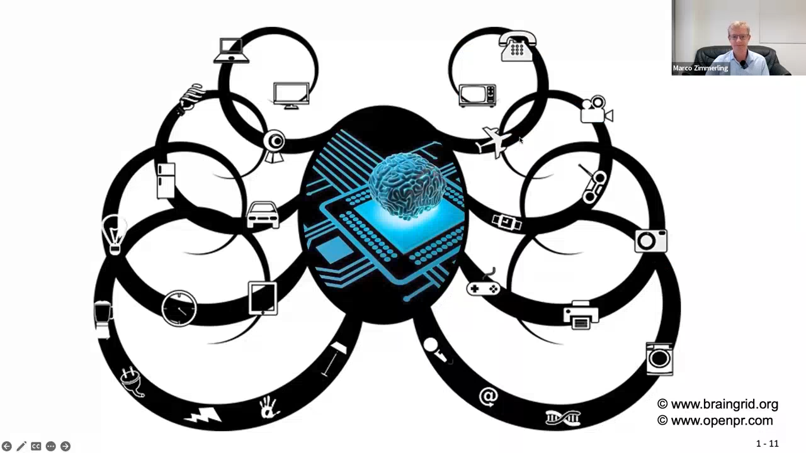
<!-- - `0:16:27`: this virus is. -->
<!-- - `0:16:30`: wow. -->
<!-- - `0:16:31`: i dunno what it was. -->
<!-- - `0:16:34`: okay so let's rewind so this may be so here i started to talk about embedded systems and that these embedded systems are information processing systems that are embedded into a larger product a smart horse i mentioned and washing machine that is not here but also robot or. -->
- 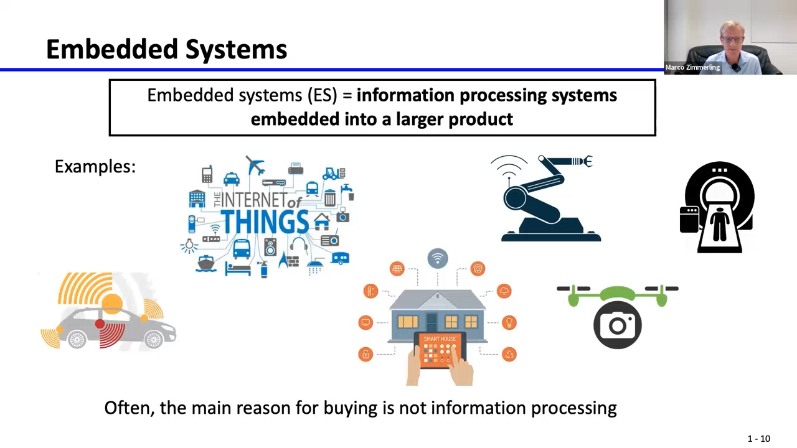
<!-- - `0:16:54`: a medical device or a drone so these are all examples of systems where you have some computing inside but the main purpose of the systems such as a smart house or a washing machine is not to do computing of course you can do computing in the smart house there are and reasonably many processes in the house these days. -->
<!-- - `0:17:14`: i am but it's not the main purpose. -->
<!-- - `0:17:19`: and the. -->
<!-- - `0:17:21`: the. -->
<!-- - `0:17:22`: the idea is is that yeah dependent by interacting with the with the environment so that you use these embedded system such as a smart horse race you have embedded computing units in a small house you have sensors for example you can understand certain properties about the environment for example who is making a phone. -->
<!-- - `0:17:42`: call on who is entering your street when may have cameras so all kinds of sensors. -->
<!-- - `0:17:53`: all kinds of pressure sensors humidity and temperature sensors on your smartphone as well it can detect how fast you're walking and can detect what kind of activity you are doing so you're basically learning you can you can get all these data and learn about the environment so this is what this the slightest is supposed to to surely. -->
<!-- - `0:18:11`: and. -->
<!-- - `0:18:18`: so there was another question on the chant. -->
<!-- - `0:18:21`: let's get back to the isn't it. -->
<!-- - `0:18:24`: and. -->
<!-- - `0:18:29`: yes so and there are many many different names for for this for this. -->
- 
<!-- - `0:18:36`: area of embedded systems are for embedded systems one of them was called the same physical system or you may have also heard the term internet of things. -->
<!-- - `0:18:46`: they're even in this refer to zero. -->
<!-- - `0:18:50`: the farc machine to machine communication or internet of everything or smarter planet so these are terms that come from different institutions and i think there's a smarter plan that comes from bush the industry four zero is very popular in germany and means that then you have basically embedded systems. -->
<!-- - `0:19:10`: it's embedded into the factory and and production. -->
<!-- - `0:19:16`: lions factory automation internet of things means that you have embedded systems that are young distributed in the environment you have very small sensor so this is one example that i will also show you later so it's a very small tiny embedded system can be even even smaller and the idea of an internet of things is that you have million. -->
<!-- - `0:19:36`: and millions maybe even billions of these devices. -->
<!-- - `0:19:40`: spread out into you into the environment or embedded even into our bodies in body sensing or even in space sensors that are or devices that are orbiting around the earth to provide certain services and observe how the earth is doing so this is the internet of things or the internet of everything. -->
# ==============0:20:00==============
<!-- - `0:20:00`: the key point for you is just that you have herds these different them curves and they are somehow all connected to embedded systems and the very basis of all the systems is embedded this is the area on the science of embedded systems. -->
<!-- - `0:20:24`: yeah so let's let's make this a little bit more more concrete here in this diagram so we just mentioned the term cyber physical system so the year you in this diagram here you have at the bottom you have the the physical world. -->
- 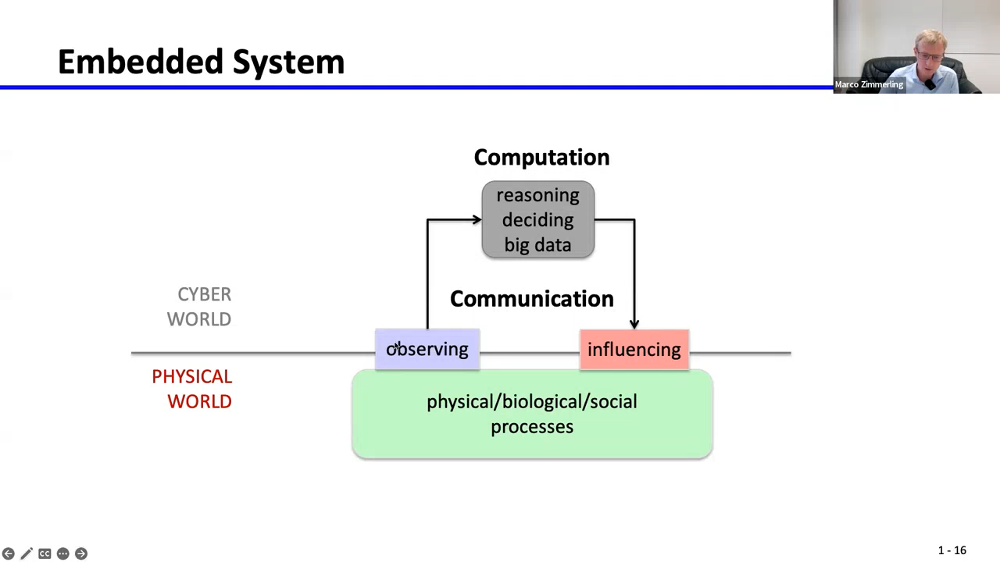
<!-- - `0:20:41`: so these are physical biological inside our bodies or animals or even social processes so everything that is going on in the physical world. -->
<!-- - `0:20:51`: and this physical world evolves right so we are walking we are aging and. -->
<!-- - `0:21:02`: more people are joining and. -->
<!-- - `0:21:07`: and an embedded system is now operating in the cyber world so it's a system that uses sensors to observe these physical biological and social processes temperature sensor is a very simple fix. -->
<!-- - `0:21:25`: sample or an accelerometer gyroscope so different different types of sensors are used to observe certain properties of what is going on around us. -->
<!-- - `0:21:38`: so these are hardware components sensors and and the sensor readings these these measurements that you take from off the physical world are then being collected and. -->
- 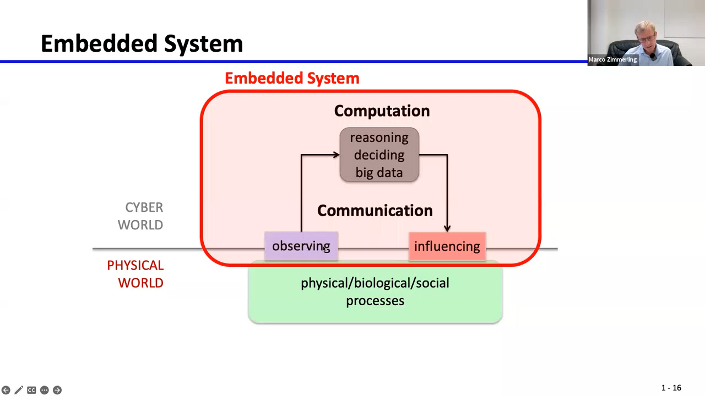
<!-- - `0:21:47`: at certain devices or comp computes and services that are running in the cloud. -->
<!-- - `0:21:55`: or on a dedicated computer. -->
<!-- - `0:21:58`: and there you have computer programs or even humans that look at these data if the observations they reason about about the data so you at a lot of data and then you take decisions why do you want to take decisions on the data yeah maybe you want to influence these physical processes. -->
<!-- - `0:22:19`: but for example you'll want or want to build. -->
<!-- - `0:22:23`: a control system. -->
<!-- - `0:22:25`: where you use feedback. -->
<!-- - `0:22:29`: so this is feedback loop here to influence or force the certain physical process into some some state for example if you have a production line or a chemical plant you may need to keep the air pressure in in a certain. -->
- 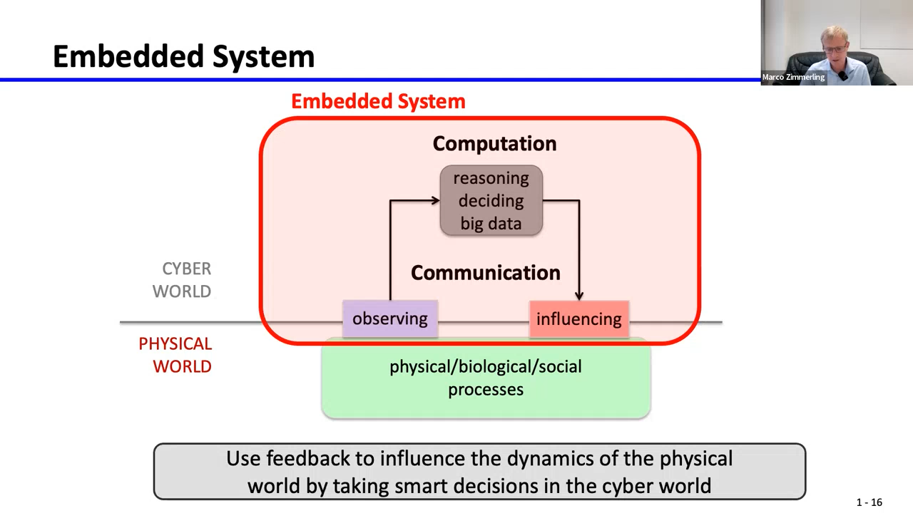
<!-- - `0:22:49`: a box and and at a certain level or at the temperature and and along along these chemical processes they have to be within a certain range and you have to have to control in order to to reach these requirements and therefore you use sensors to measure the temperature or cont. -->
<!-- - `0:23:09`: troll either room that decides whether you should increase or lower the temperature and then you'll steer something like a heating element or cooling elements to keep the temperature edison them and this year this red box this is what is interesting for us in this election so this is the embedded system so cents us. -->
<!-- - `0:23:27`: you may have more tours or something that you can control and that something within you can actuate so these aren't actuators and yeah embedded or the processing of all this then. -->
<!-- - `0:23:41`: so what i'm going to show you now is is a video of a very concrete cyber physical system where the physical processes are these two inverted pendulum see on the left side and the goal of this is to to to stabilize this this inverted pendulum. -->
- 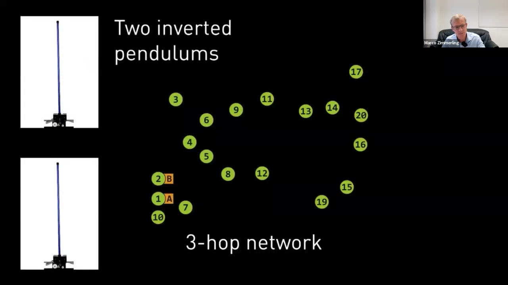
<!-- - `0:24:04`: and here on the lower left you see it an embedded device that is communicating over wireless so it's it's wirelessly connected and it sends commands to the motors at dependent on. -->
- 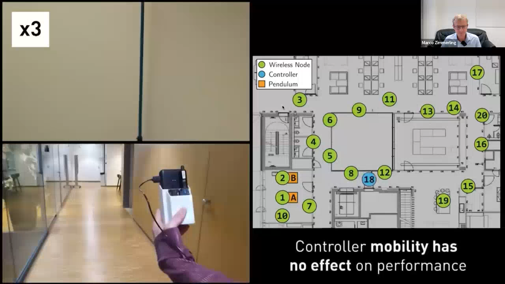
<!-- - `0:24:21`: the mortal goes back and forth and tries to stabilize like i'm doing here with my ok this is very challenging that is very short pencil the goal is to to stabilize stabilize the pull in in the upright position and to do this you need to. -->
<!-- - `0:24:39`: dr image for. -->
<!-- - `0:24:43`: at the bottom. -->
<!-- - `0:24:46`: of of dependent on so let's let's show a short video again. -->
<!-- - `0:24:52`: so now actually to credit pen the lumps that are being being stabilized by one dedicated wireless embedded device this is no number eighty rent and yet we have we had only one camera to shoot to shoot one of the panels. -->
# ==============0:25:00==============
<!-- - `0:25:08`: and. -->
<!-- - `0:25:09`: the current state of the pendulum is being measured by sensors and it's being sent to this blue note this node number eighteen that's one of the students is carrying around and not number eighteen looks at the sensor readings computer controller signals and send them back to to dependent on notes an honor to. -->
- 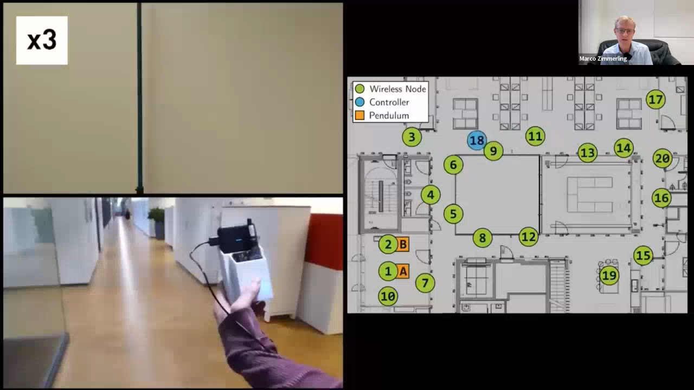
<!-- - `0:25:30`: to stabilize the pendulum in the upright position so that the the about this control loop the pendulum would just fall over. -->
<!-- - `0:25:38`: so this is one very concrete example of of an embedded system so let's go back to the slide we saw that embedded systems are in the cyber world. -->
- 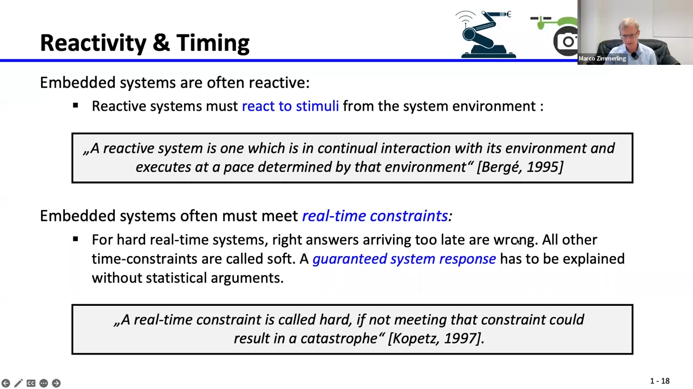
<!-- - `0:25:50`: but they are embedded or interconnected with the physical world. -->
<!-- - `0:25:56`: and okay so so what's the point the point is now that. -->
<!-- - `0:26:02`: if you are embedded and interacting with the environment you need to do this you may need to do this array often have to do this in a continuous fashion. -->
<!-- - `0:26:12`: so your receives stimuli or central inputs or certain events from the environment in the embedded system needs to continuously measure these these inputs and react to them and this is what what is called a reactive system. -->
<!-- - `0:26:27`: this one which is in continual interaction with its environment and executes at a pace that is determined by the environment. -->
<!-- - `0:26:35`: so depending on how fast your physical processes like this pendulum or you have a car or a washing machine though these are completely different physical processes that execute or evolve with different speeds. -->
<!-- - `0:26:51`: so certainly if you'll want to control the temperature in the room. -->
<!-- - `0:26:57`: the pace is much much slower than what the embedded system needs to provide in a in an autonomous car that's clear right. -->
<!-- - `0:27:06`: sawyer have to continuously interact end. -->
<!-- - `0:27:10`: the second very important requirement of embedded system many embedded systems is that you have to interact with the environment in real time. -->
<!-- - `0:27:20`: so you have to guarantee that you will not only compute the correct result. -->
<!-- - `0:27:27`: for example the controller signal you have and either rural and the this either of them should not only compute the correct result let's say ten but it also needs to provide this resides ten. -->
<!-- - `0:27:41`: within a certain deadline. -->
<!-- - `0:27:44`: so yup. -->
<!-- - `0:27:48`: because if it computes the correct result but it provides the result too late then this is considered incorrect. -->
<!-- - `0:27:57`: even though the the number itself is correct but because it comes too late it's considered incorrect. -->
<!-- - `0:28:05`: and there are soft and hard real-time systems are hard real-time systems are one where if you really provide the the answer too late this may have catastrophic comforting or consequences such as humans are being killed or harmed right so if you have various safety critical embedded system enough. -->
<!-- - `0:28:25`: factory and you have a certain machine live a lot of power rail and this machine does not stop within a certain number of nanoseconds or many seconds in certain situations this may mean that you harm the operator of the machine. -->
<!-- - `0:28:42`: or yeah autonomous car is a very classical example if you don't detect that somebody crosses the street and in front of you live in let's say i dunno the numbers exactly but living if you will micro or milliseconds then this will have catastrophic results of these are hard on haunt real time systems and they're also soft really. -->
<!-- - `0:29:02`: i'm systems were yeah it would be good to meet certain deadlines or provide the correct result at the right time but if you don't do so it doesn't have any kind of catastrophic consequences you may lose some money but for example that it's not. -->
<!-- - `0:29:17`: and catastrophic. -->
<!-- - `0:29:21`: okay so this light discusses two very important properties of embedded systems and. -->
<!-- - `0:29:30`: the first one says it is essential to predict how a cyber physical or embedded system is going to behave under any circumstances before it is deployed. -->
- 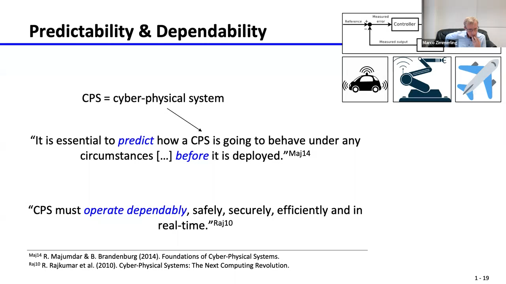
<!-- - `0:29:41`: and that's that again relates to the mission or safety critical nature of many of the system so if you operate an autonomous car you'll want to or essentially have a formal proof a mathematical proof that the system will behave correctly once i'm putting it into operation so once i'm so. -->
# ==============0:30:00==============
<!-- - `0:30:00`: taunting the car and it starts to drive on a highway in fribourg you want to make sure that it doesn't hit any lecturer any students from the embedded systems lich. -->
<!-- - `0:30:10`: so it very clearly and this means that he will lead we have to have models that allow us to predict how this the entire system is going to behave and that is of course very very complex. -->
<!-- - `0:30:24`: the second statement says imbalances or cyber-physical must operate independently. -->
<!-- - `0:30:30`: and here it basically means that it needs to provide the correct function. -->
<!-- - `0:30:38`: should also operate safely so that's that's the next step statement here safely safely basically means that okay you don't hung anyone or awesome operate securely and if you have an embedded system that is dependable safe and secure then very likely people. -->
<!-- - `0:30:57`: who will trust the system right so these three adjectives are are needed to provide trust together also with the predictions so if you have a form proof everything is going to behave correctly and in under any circumstances it will be secure and nobody will be harmed then you'll trust and also use assist so this is what we. -->
<!-- - `0:31:17`: info. -->
<!-- - `0:31:18`: system very often also needs needs to operate efficiently and there will be a slight about this very soon and in real time and we discuss real-time already on an appearance. -->
<!-- - `0:31:30`: okay. -->
<!-- - `0:31:33`: yeah so. -->
<!-- - `0:31:35`: again is a concierge should allow you to relate these these terms here and the need for a reliable safe secure and real-time operation tool critical domains autonomous cars and war absence. -->
<!-- - `0:31:53`: okay i'm worried about efficiency i mean why why why should should these systems operate efficiently well one of them is. -->
- 
<!-- - `0:32:02`: and your may have a smartphone or you also have sensors on many many devices maybe millions of internet of things devices that don't have a power block so you don't have a cable that goes to your to your power socket you have a battery so these devices are running on an. -->
<!-- - `0:32:23`: batteries millions of batteries and you don't want all and you cannot go around and replay as millions and millions of veterans. -->
<!-- - `0:32:32`: so if you do some calculations and you have let's say a billions of batteries on the earth and each of these these batteries last only for three years you're going to replace hundreds of millions of batteries every day and this is of course an infeasible infeasible effort. -->
<!-- - `0:32:50`: and the resulting waste would also be a huge impact or a threat to the environment saw a long lasting energy efficient operation is is very very important so embedded systems must be energy efficient. -->
<!-- - `0:33:07`: and yeah this or our requirements your code runtime weight and cost so these are basically are they all come down to the need for low costs. -->
<!-- - `0:33:23`: they have to be very small because you want to embed them for example in in your body or you don't want to increase the weight of your car there are thousands of these embedded systems but each of them has a weight rate or on a drone maybe there's a better example you want to make them as light as lightweight and as small as possible. -->
<!-- - `0:33:43`: and if you make something very small then of course you will don't have much space for example for data memory for to store your program you may only have a few kilobytes of ram talk to operate with. -->
<!-- - `0:33:56`: and now wait costs or costs if you just have one device that costs ten euros okay that's not very much but if you have millions and millions and this is very often not affordable so you need to go make these these none was much much smaller and therefore you will get into resource constraints and. -->
<!-- - `0:34:16`: a loss in our field and we will discuss this intellectual tool in some detail and is related to these resource constraints and the need to be efficient. -->
<!-- - `0:34:28`: okay now you may spread your heads scratch your head and wonder why how can we do this or how can we make that assistance efficient. -->
<!-- - `0:34:38`: we will discuss this at length in one of the later lectures but but the very quick and simple answer is that we specialize embedded systems right so if you have a smartphone or you have a washing machine or a car you know. -->
<!-- - `0:34:57`: what the system will look like what is the expected behavior and what is the environment in which the system is going to operate and based on this prior knowledge about the operating conditions and what kind of data and then this embedded system we'll see. -->
# ==============0:35:00==============
<!-- - `0:35:16`: on a smart your phone you have completely different kinds of data than on a very small embedded i o t device or in the washing machine or a car. -->
<!-- - `0:35:26`: you can then select your hardware components you can also program and select your software components in such a way that you minimize the resource usage while still meeting all the application requirements all the requirements of your washing machine sucks. -->
<!-- - `0:35:44`: and yeah also to maximise the predictability and reliability dependability of the system so specialization for a specific application or for a specific product if you will is very important in embedded systems and is a way to meet the efficiency. -->
<!-- - `0:36:03`: the requirements. -->
<!-- - `0:36:08`: okay let's sir. -->
- 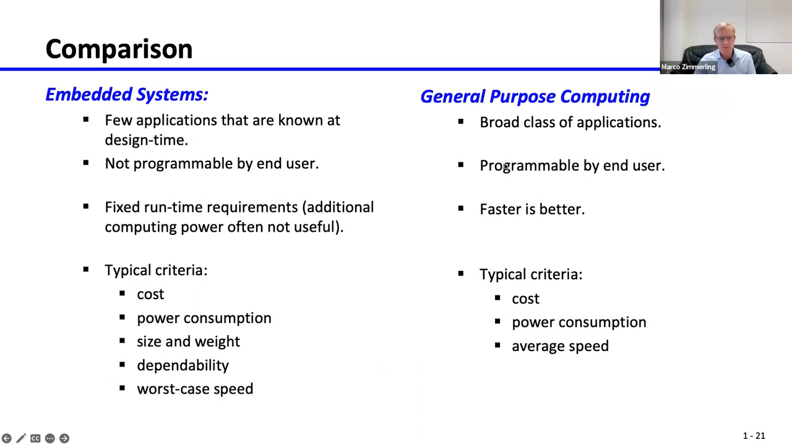
<!-- - `0:36:11`: the sliders are maybe also a good summary of what i explained so far as it it's a comparison between. -->
<!-- - `0:36:20`: it compares embedded systems to general purpose computing systems like your laptop or your desktop machine. -->
<!-- - `0:36:27`: saw as i just said. -->
<!-- - `0:36:30`: you'll typically don't assign one embedded system without knowing where where it will be used so you know pretty much what is the class of applications or what is the dedicated application that you are designing the system for whereas a laptop or your processor in your in your. -->
<!-- - `0:36:50`: and desktop and nobody knows what you're doing with this and you may do some graphic processing or as just a word and excel or and view a video or do some soul session as though it's a general purpose for a broad class of of end user applications. -->
<!-- - `0:37:11`: and these systems also programmable so you can you can program your own your own computer but an embedded system very often is not programmable. -->
<!-- - `0:37:21`: and. -->
<!-- - `0:37:23`: yeah this is maybe also a very important difference. -->
<!-- - `0:37:30`: on in general. -->
<!-- - `0:37:33`: general computing system you would say okay faster is something better read so if your web page reacts faster i'm more happier because i get the response much much earlier it makes me happy and that's different in an embedded system again to my classic example of a washing machine if the machine. -->
<!-- - `0:37:53`: washes faster your clothes are not going to be cleaner right so you'll it doesn't help you need the one hour program or whatever and two hours will at a certain temperature to achieve the required cleaning level of your clothes so foster is in general not that. -->
<!-- - `0:38:13`: for an embedded systems what is more important is that you do things at the right time that you meet certain deadlines when honor to keep up with the speed of your environment. -->
<!-- - `0:38:26`: rk cost power consumption these are criteria that you find everywhere and yeah related to foster is always better in general purpose systems and embedded systems we don't care that much about foster or the average speed of a system so how fast to x. -->
<!-- - `0:38:45`: execute a program or an algorithm on an average is something that you typically carry in a cloud environment for example when you do some computations in embedded systems we don't care that much about the average case we care about the worst-case how long will it take at most under any circumstances. -->
<!-- - `0:39:06`: this is exactly what he means to provide a proof to the end users to an authority. -->
<!-- - `0:39:15`: to somebody who checks maybe if factory equipment can actually be used they want to see a proof they want to see the worst case speed of the system. -->
<!-- - `0:39:26`: to make sure that the system works correctly as independent and doesn't harm. -->
<!-- - `0:39:33`: and users of the system. -->
<!-- - `0:39:36`: so in the lecture we will discuss and. -->
<!-- - `0:39:40`: we will go into some detail one of this related to dependability real time and we will discuss. -->
- 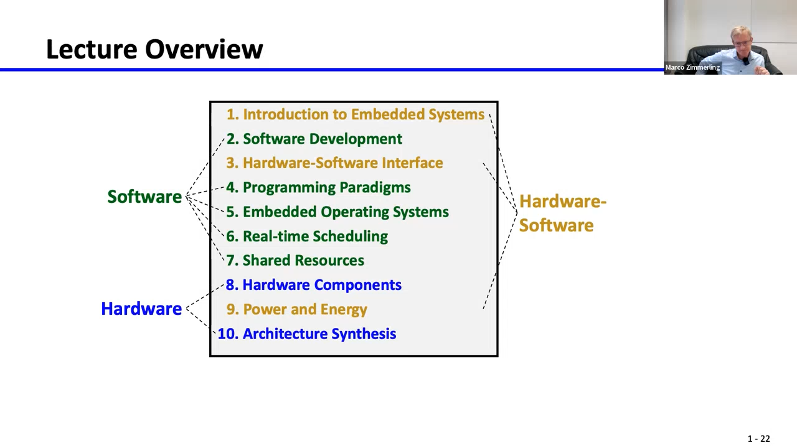
<!-- - `0:39:51`: software aspects so they are. -->
<!-- - `0:39:54`: most lectures are about software as you can see here. -->
<!-- - `0:39:59`: but also hardware and we will just have a couple of lectures where we discuss the interface between hotbeds of song sir. -->
# ==============0:40:00==============
<!-- - `0:40:07`: cross cutting concerns of what we very often do is embed in embedded systems to achieve the specialization and to make it very efficient we select hardware components of software components or we actually designed them at the same time so there's a very close interconnection between hardware and software in embedded systems so you can make. -->
<!-- - `0:40:28`: it's very efficient if you program your system it's actual wave with a very deep understanding of the hardware you can make it much faster for exam or make sure that you that you'll make the system very predictable and make sure that an algorithm executions under any circumstances within ten milliseconds for example so hot. -->
<!-- - `0:40:48`: software this interplay between harper and sofa is very important. -->
<!-- - `0:40:55`: okay so let's. -->
<!-- - `0:40:59`: let's go to the next pardon maybe there are. -->
<!-- - `0:41:06`: and. -->
<!-- - `0:41:09`: you may also have. -->
- 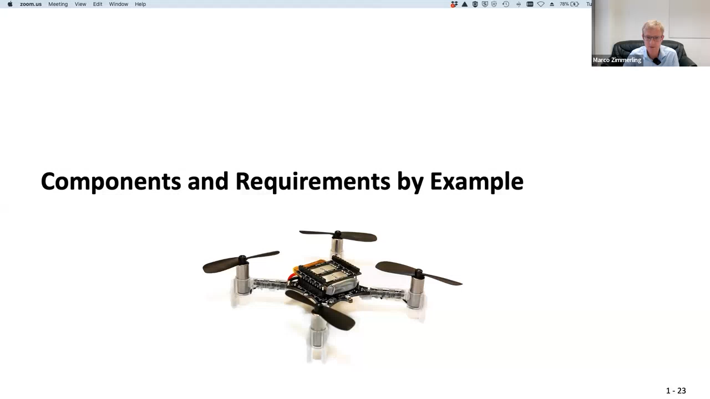
<!-- - `0:41:12`: questions. -->
<!-- - `0:41:15`: at this point if that is not the case i'm i'll just just continue here and i'm what i'm trying to do now is to give you a very concrete overview of of the software and hardware questions and problems that we have to. -->
<!-- - `0:41:34`: deal with in an embedded system and you're the example as you can see in the figure is an autonomous drone and don't have a drone here with me right now but we are some of our credit collaborators in at the university of auckland and they have exactly this crazy. -->
<!-- - `0:41:55`: fly a drone. -->
<!-- - `0:41:57`: and they are. -->
<!-- - `0:42:00`: using some of our embedded software components that we designed to do a control and one of the things they are doing is as an operating drone swarms and i will show you original which is not from our collaborators but it's just to give you an idea and i hope that individuals also. -->
<!-- - `0:42:20`: playing. -->
<!-- - `0:42:21`: quite smoothly over assumed to use all though so this isn't a team of drones. -->
<!-- - `0:42:29`: and of course in order to achieve this. -->
<!-- - `0:42:32`: this kind of formation of flying in a certain formation the systems these embedded systems of each of the drawing is an embedded system but they have they have to do some local processing but they also need to interact with each other and all you need to have a global view of all these drones of all. -->
- 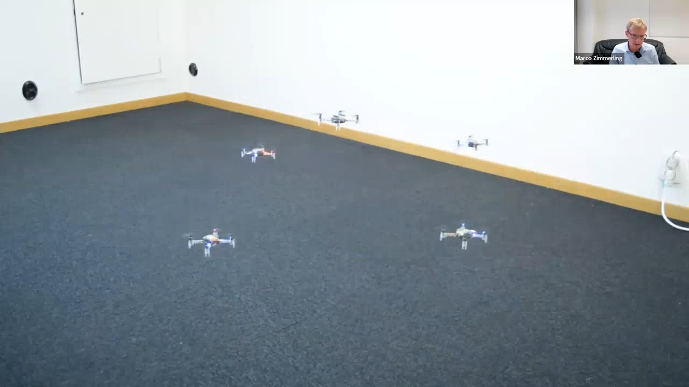
<!-- - `0:42:53`: embedded systems in order to make sure that the that they fly in a certain formation or that they don't collide. -->
<!-- - `0:43:00`: and this is another. -->
<!-- - `0:43:03`: show or video. -->
<!-- - `0:43:08`: from a group at each age zurich where i did my phd and there's a group of rough andrea and there there are doing experiments with much much more. -->
<!-- - `0:43:19`: advanced the control algorithms. -->
<!-- - `0:43:23`: and that are running on these drones and. -->
<!-- - `0:43:30`: sorry. -->
<!-- - `0:43:50`: yeah so these are much more complex formations and many many more more drones and there you have typically wireless communication to an operator to a central pc that organizes the entire swarm with respect to it's position or. -->
<!-- - `0:44:08`: the lights and also the music it needs to be synchronized so this is very complex example. -->
<!-- - `0:44:16`: and here's another video where you have ya. -->
<!-- - `0:44:20`: again where two drones are chasing each other through a building at each age zurich. -->
<!-- - `0:44:27`: so it's a it's a draw drawn race and of course the systems i mean as you can see they have sensors they actually bumped into angel. -->
<!-- - `0:44:38`: and one of the various there and so they have sensors to understand the environment and everything needs to operate very quickly they have to meet certain deadlines to drive their motorists in order to fly in a certain formation avoid hitting one of these these lamps year so. -->
- 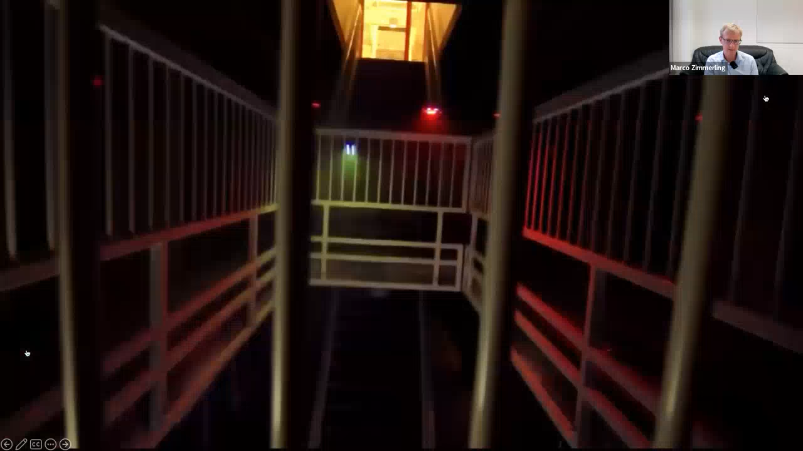
<!-- - `0:44:56`: or this is a very advanced embedded embedded system. -->
# ==============0:45:00==============
<!-- - `0:45:02`: okay so how does how does this strong drawn look like and. -->
<!-- - `0:45:08`: you will now look a little bit into the hardware architecture. -->
<!-- - `0:45:12`: and. -->
<!-- - `0:45:15`: later on a bit more into the software architecture of this crazy fly. -->
- 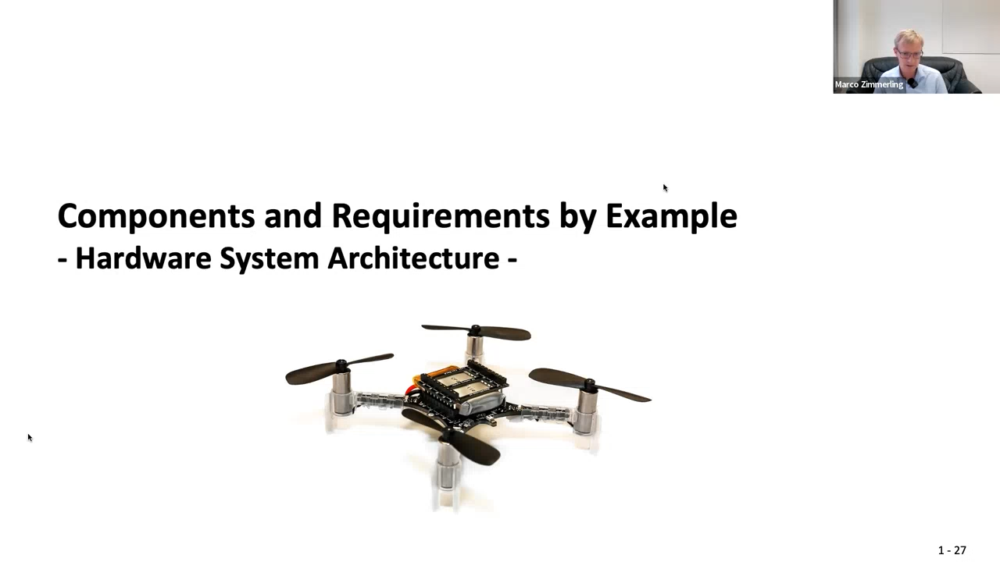
<!-- - `0:45:22`: and here this is a high level. -->
<!-- - `0:45:26`: the lumber of a high-level view and the hardware architecture this is called a block diagram so you have an. -->
- 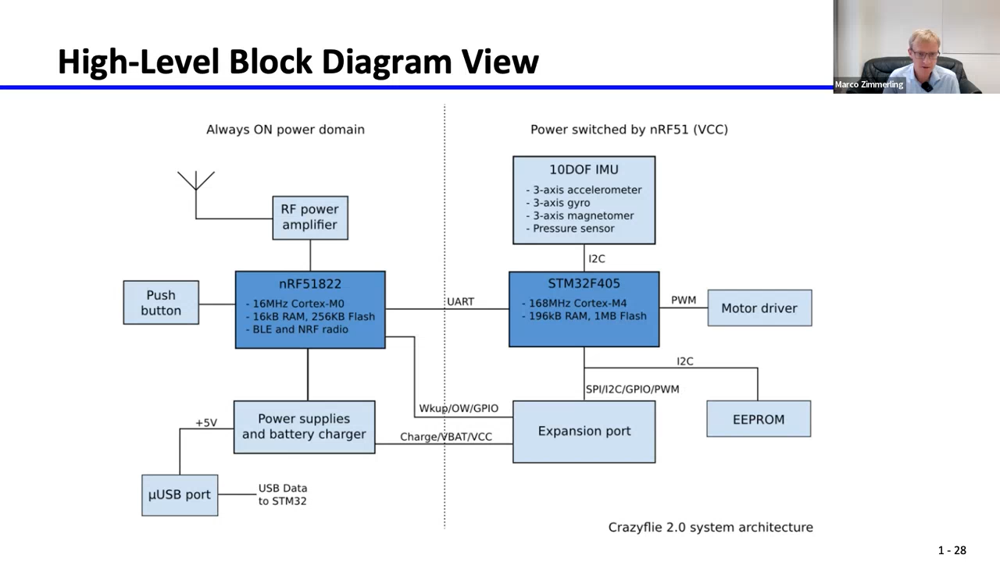
<!-- - `0:45:34`: different blocks and these are actually hopper components and as you can see here you'll we basically have two boards or two processors so he is a more powerful processor so this is actually the processor this is considered a platform if you will and another platform. -->
<!-- - `0:45:55`: with a a weaker and dedicated microphone for. -->
<!-- - `0:46:02`: here from arm cortex zero and the cortex and four and this one here is actually dedicated only tool to the communication. -->
<!-- - `0:46:11`: and so you can he answered it's an empty financial to drive the antenna it will communicate and the main purpose of this processor is to dual wireless communication with the operate whereas all the control algorithms. -->
<!-- - `0:46:27`: they require matrix operations these p operations are very specific. -->
<!-- - `0:46:33`: and more complex operations and therefore a more dedicated processor is used and here you also see a bunch of sensors okay so. -->
<!-- - `0:46:43`: this is maybe much better so this is basically what i just explained and you have a lower power more efficient energy efficient but lazier or a slower cpu. -->
<!-- - `0:46:59`: and here you have a more powerful one for reading out the sensors and doing the motor control and a much much higher speed. -->
<!-- - `0:47:09`: and these two processes are connected wire a bus or you aren't connection so syria is zero past zero connection which is nothing more than two components connected by a bunch of wires there's more than a single wire but this is also part of the lecture and you were the others. -->
<!-- - `0:47:29`: but these two can can talk to each other these two processes over a serial serial connection. -->
<!-- - `0:47:36`: this one has doing the all the sensing and control the local control loops and but they also have to interact because this process of here which is connected to the wireless radio. -->
<!-- - `0:47:49`: we'll exchange state information with the other drones for example to fly in a certain formation or to avoid that they are colliding so this is also important. -->
- 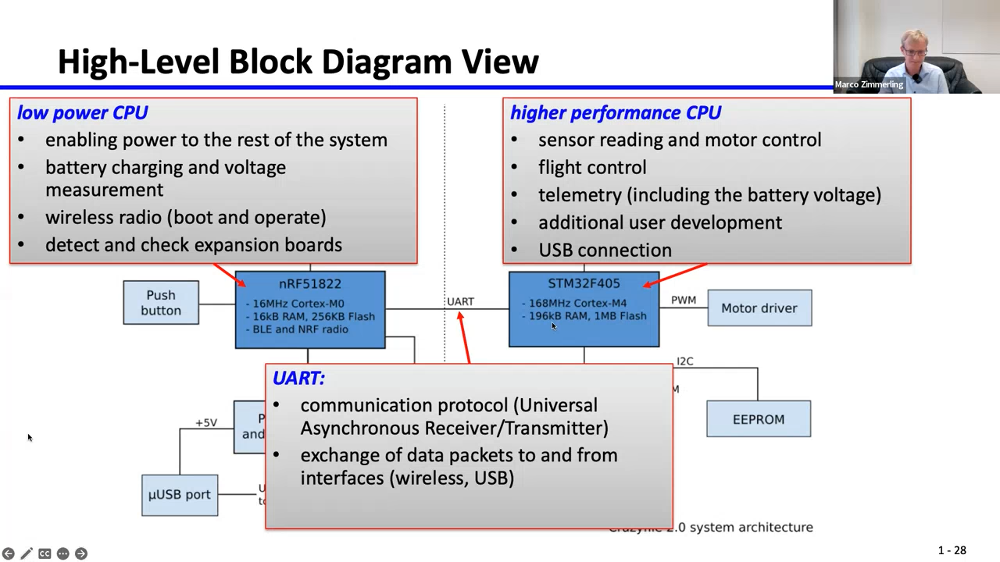
<!-- - `0:48:03`: so here is the sense aboard and a solo accelerometer gyroscope magneto meter and a pressure sensor. -->
<!-- - `0:48:12`: and you have different kinds of memories of course you also need to store some data you you are not only sensing and driving the motors and doing computing you also need to save some some some of the state first and foremost you will have to save the actual program. -->
- 
<!-- - `0:48:31`: the hermia firmware that runs on the embedded system this is usually done in in the flash memory or in an eat your prominent electrically erasable programmable read only memory this is typically used for for the for the firmware. -->
<!-- - `0:48:47`: and different configurations and sizes and here you may also have a flash memory and the contents of these two memories and also of the flash memory is retained when the system loses power whereas the content of the ram of the random access memory is lost. -->
<!-- - `0:49:06`: when when the power. -->
<!-- - `0:49:09`: is off and then the contents are erased i guess you're familiar with these rubber basic concepts but yet here we have an ear proms flesh and amram so there are different kinds of memory technologies evolving and also being used in commodity admitted systems these days. -->
<!-- - `0:49:30`: okay so desert button and this is the bottom and the top view of of the draw. -->
<!-- - `0:49:39`: and yeah this is a closer look at the parent i think this is different so here you see the. -->
- 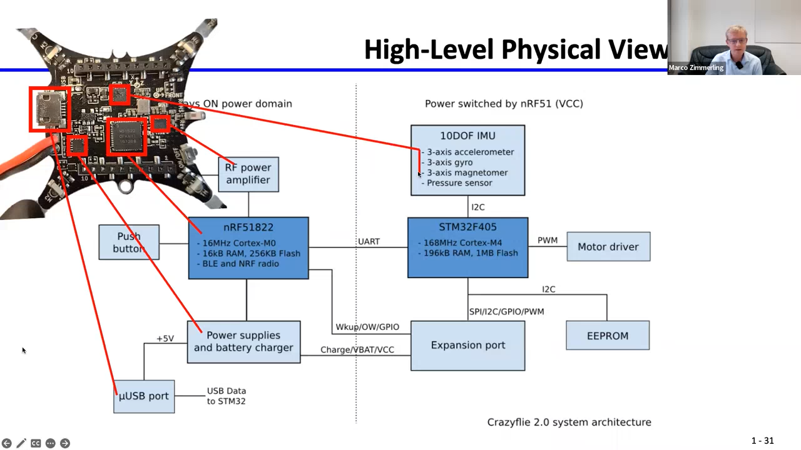
<!-- - `0:49:51`: me to the gyroscope in the magneto meter this is the rf amplifier this is actually you. -->
<!-- - `0:49:57`: the chip so that steep that is the physical chip then you can see here that is resembled by this block in this block diagram indiana and fifty one. -->
# ==============0:50:00==============
<!-- - `0:50:07`: yeah then usb port that is used tool to program the device for example and yeah maybe it was a push button to reset and pull amplifiers saw some power management has lots of eden and on the other side the bottom you have the other sends on the pressure sensor the multiple driver these the spell. -->
<!-- - `0:50:26`: will a circuit that you need in order to ramp up the voltage and and drive the motors and as the from and the picture of the more powerful processor and the antenna here is actually the antenna so there's the wireless antenna and i think you they are using a bluetooth low energy ble one. -->
<!-- - `0:50:46`: so this is the antenna that she was to communicate over this protocol lot of protocols so i think you would also be possible in print in principle to talk with your smartphone with one of the drones because usually as if loot have no energy on your smartphone. -->
- 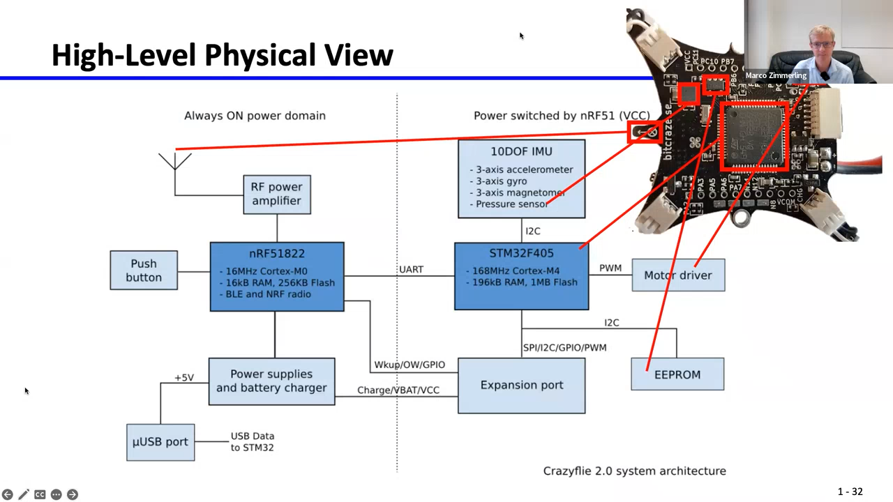
<!-- - `0:51:04`: okay so this was like a highly the view means if you know goal one level deep one level deeper than you'll. -->
<!-- - `0:51:13`: i have to deal with much more complex and schematic diagram here forza saw this lolita as schematic diagram of part of the year. -->
- 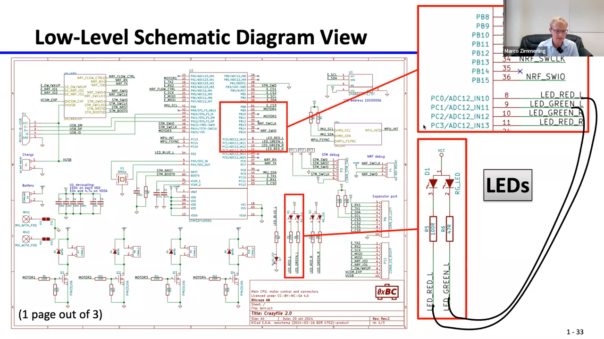
<!-- - `0:51:24`: part of the crazy flies or they are actually two more pages and here this is the the more more powerful processor did you see in the middle. -->
<!-- - `0:51:34`: and with with many many pins so these are like the physical connections or wires and it'd have to be connected to all your other hopper components on the crazy fly and here for example you can see there are a couple of pins here ltd ret ltd green and energy read again. -->
<!-- - `0:51:54`: these these four pins your assumed in they are physically connected to another component in the schematic so these are the ltd saw these little flashing lights which are. -->
<!-- - `0:52:06`: yeah it's it's like the hello world of embedded systems saw and if you do with professor bust awesome introduction to computer programming one of the first programs is hello world trade saw you write a program and the prince on on your console hello world and the hello world of embedded systems is that you. -->
<!-- - `0:52:26`: you let one of the entities blink so this is allowed and if you can make make the red the green and the yellow one flesh or in a certain way and in a certain pattern this is like the advanced gentlemen and to do this you have to wire your. -->
<!-- - `0:52:45`: the pins of your processor where you run your hello world program to the actual hunter components entities. -->
<!-- - `0:52:53`: there are more connections here like more tour of four so there's another kind mortal for here. -->
<!-- - `0:53:00`: and this is connected to one of the immortals. -->
<!-- - `0:53:03`: one of the motors on the crazy flair the crazy via has four or four motors of floor four of these rotors and us one connection for each of these motors and this is essentially a switch year. -->
- 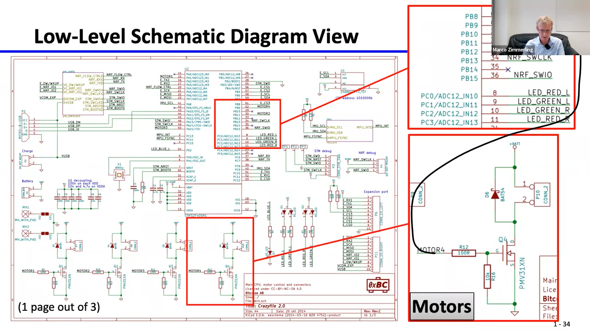
<!-- - `0:53:16`: and by by driving the voters of this model you can you can close open the switch to the smarter and depending on how long the the switch is closed or open you can steer or control how quickly you. -->
<!-- - `0:53:34`: this montoya or the propeller will rotate. -->
<!-- - `0:53:39`: this way you can accelerate or the accelerate and flier. -->
<!-- - `0:53:44`: in a certain way. -->
<!-- - `0:53:46`: and yami will also go into some detail in the lecture so the the duration of the of the unfair so how long the switch is closed and the mortals actually driving or how long's off as as as as pious swift modulation so this one scheme or one concept. -->
<!-- - `0:54:04`: that is used to control the the the properties of the mortal and therefore the properties of of the crazy fly in this example and we will look into this and some of the evictions. -->
<!-- - `0:54:17`: so we talked about hotbed what about software do you have all these different components and you'll have to operate them now and this is dung wire software and this is a high-level diagram of the software architecture on the drone so you have the the actual hardware. -->
- 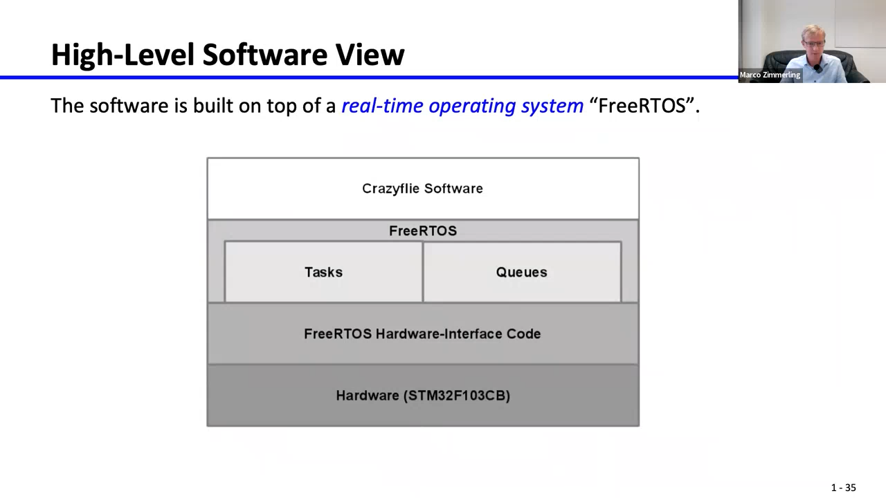
<!-- - `0:54:36`: and then you will very often have an operating system such as a real time operating system in the case of the one of the crazy flight is free autos so pretty well known operating system for real-time embedded systems and the nice thing about such an operating system is. -->
<!-- - `0:54:57`: you don't need to develop everything by yourself and developing everything by yourself in the embedded system is also called bare metal so bare metal you're really programming the actual hardware the actual metal and very often in more complex embedded systems this is not affordable you don't want to start from. -->
# ==============0:55:00==============
<!-- - `0:55:17`: from scratch and do everything yourself for every application and every product you want to reuse something and this is provided for example by an operating system. -->
<!-- - `0:55:27`: and it also provides you with some means tool to avoid programming failures or to detect box to debug back your system and yeah and certain abstractions suffolk has just toss wind and cures for events and so on and so forth so this is something that you can use and you can add. -->
<!-- - `0:55:47`: your own program your own sa fam to this and in this example here the crazy fly software runs on top of this free autos operating system and it makes heavy use of the features that are provided by. -->
<!-- - `0:56:02`: free articles. -->
<!-- - `0:56:06`: so in india architecture you will have essentially two kinds of tas and one of them real time tasks so these are the very very important tasks and you have non reactors which are not so important so real time tasks for motor control for example so. -->
- 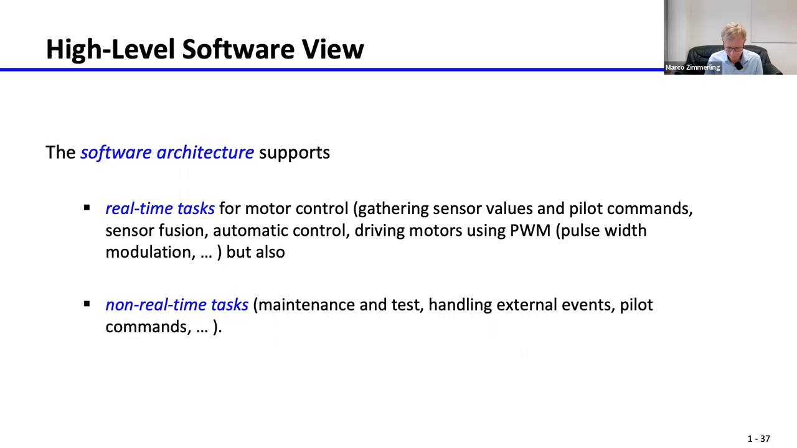
<!-- - `0:56:25`: typically if i remember correctly here the the execution speed is at least one hundred hertz or even one kilo hertz so this is the speed so every millisecond or at most every ten releasing i think is really the limit on the crazy fly for some of the things that he wanted all of them so every ten milliseconds this task needs to exit. -->
<!-- - `0:56:44`: you would provide a correct output so it needs to based on the sensor reading the current position and speed of the drone needs to decide whether to turn the mortal on and off. -->
<!-- - `0:56:57`: and this needs to be done every ten milliseconds it needs to compute the correct result the correct what voltage. -->
<!-- - `0:57:05`: that drives the motor and it also needs to compute this result live in this time-bound given this via time constraint of ten minute seconds and if you have such requirements the associated software task is called a reassigned task. -->
<!-- - `0:57:21`: very very important task but for maintenance or for testing if you're if you want to get just some information about the current battery level for example this is not some critical and therefore you want to use a non real time task to implement this functionality. -->
<!-- - `0:57:39`: so yeah you. -->
<!-- - `0:57:42`: don't need to fully understand this slide here but the main point of the slightest to give you some idea about the complexity of such system so let me walk you through this and to give you some idea of the complexity saw these other sensors. -->
- 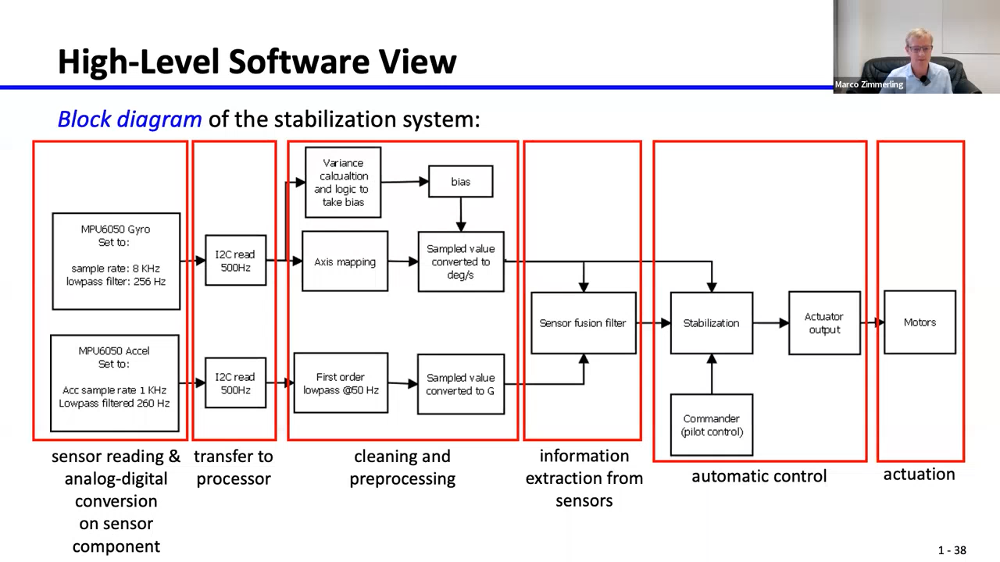
<!-- - `0:57:58`: the gyroscope for example and on the accelerometer so these other sensors that tell you something about the current state of the drum. -->
<!-- - `0:58:07`: and these are actually read out here as you conceive of a very very highest speed so you you're basically doing over something silly or something sticking with a killer hertz or one kilohertz in the case of the sutherland. -->
<!-- - `0:58:22`: and based on these many many samples there's already some local pre processing some local featuring the undone and every five hundred hertz we these samples the most recent sample or some moving average of the samples is being read out. -->
<!-- - `0:58:39`: again over a bus protocol is called ice current seat. -->
<!-- - `0:58:45`: and then you do some cleaning some processing and yeah you're doing the excess mapping and so on you're fusing all these are all the sensor signals and then you were doing this is taken as an input to the actual control ever been so the automatic control algorithm that needs to execute every minute. -->
<!-- - `0:59:05`: second or every ten milliseconds depending on what you want to do to compute a correct and timely real time. -->
<!-- - `0:59:14`: input tool to the mortar to the actuation so as you can see this is a pretty deep processing pipeline with a one two three four five six different stages and all of this needs to work in real time. -->
<!-- - `0:59:32`: everything needs to fit nicely together. -->
<!-- - `0:59:35`: you don't want to lose any samples along the way you don't want to overrun any deadlines here and there so this is a complex mixture of hyper components that are being used by software later on so the left side here is as hardware in here. -->
<!-- - `0:59:54`: you're dealing with software. -->
<!-- - `0:59:58`: okay. -->
# ==============1:00:00==============
<!-- - `1:00:00`: i saw in in the next couple of slides and i want to give you a little bit more. -->
<!-- - `1:00:10`: insight or overview of what you will learn and in the lecture and i will do this by means of questions so let's have a look at the at the time i will do this in by means of questions and you don't have to be able to answer these questions right now but hopefully and you're actually supposed to be able to answer these questions at the end of the. -->
- 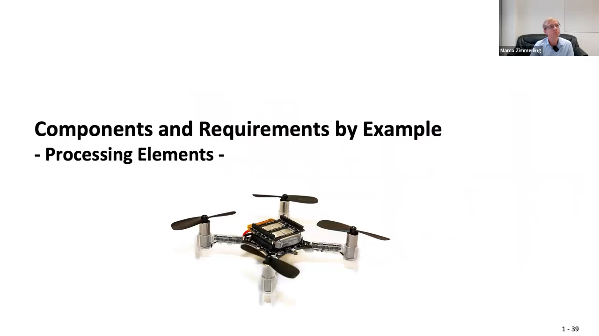
<!-- - `1:00:29`: entire lecture so in february when i give you these questions again you should be able to to answer some of these questions so you may not understand everything what i'm saying right now but it gives you some idea of what you will learn so one of the questions is what can you do to increase the performance of an embedded system rates on you may have a very. -->
<!-- - `1:00:50`: application you'll have an autonomous car and you need to do many many many controls much more than on this on this crazy flag so what can you do to increase performance and as you may have learned in other lectures or already guessed. -->
- 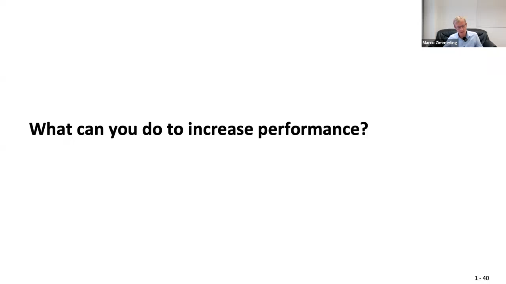
<!-- - `1:01:04`: one way is to use faster and more complex processes and this is moore's law so it is a trend that continues over time over time we see that the transistor count so the number of active hardware elements on these processes is. -->
- 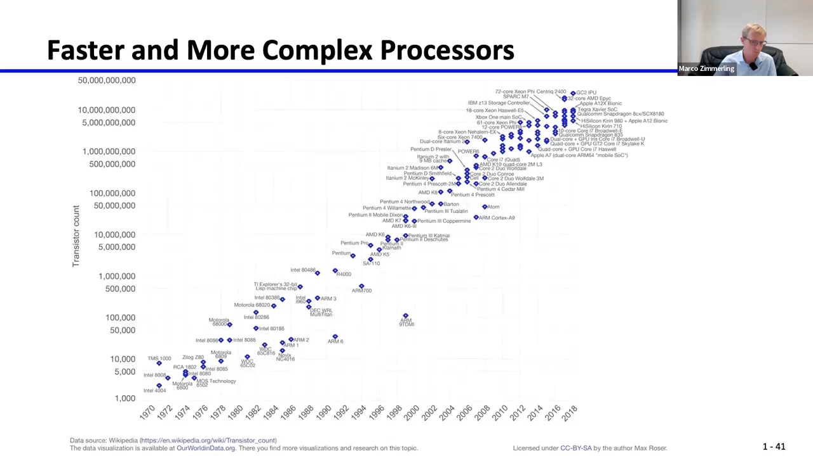
<!-- - `1:01:24`: rapidly increasing exponentially increasing and yeah you can the sea on fire for example in twin ts seventeen i think it came out yeah and it has yeah more than i don't know exactly maybe twenty billion i think that should be twenty billion. -->
<!-- - `1:01:44`: transistors and this. -->
<!-- - `1:01:48`: this trend will continue and maybe not maybe it would have flattened out that yeah you have the basic ideas that you have you can use more complex and faster processes where each individual core has more and more active transistors but of course you can also and this is actually the trend that has started. -->
<!-- - `1:02:08`: some time ago now is to use multiple of these process in court now so not only one with many transistors you will go a parallel. -->
<!-- - `1:02:18`: and this is a picture of the iphone. -->
- 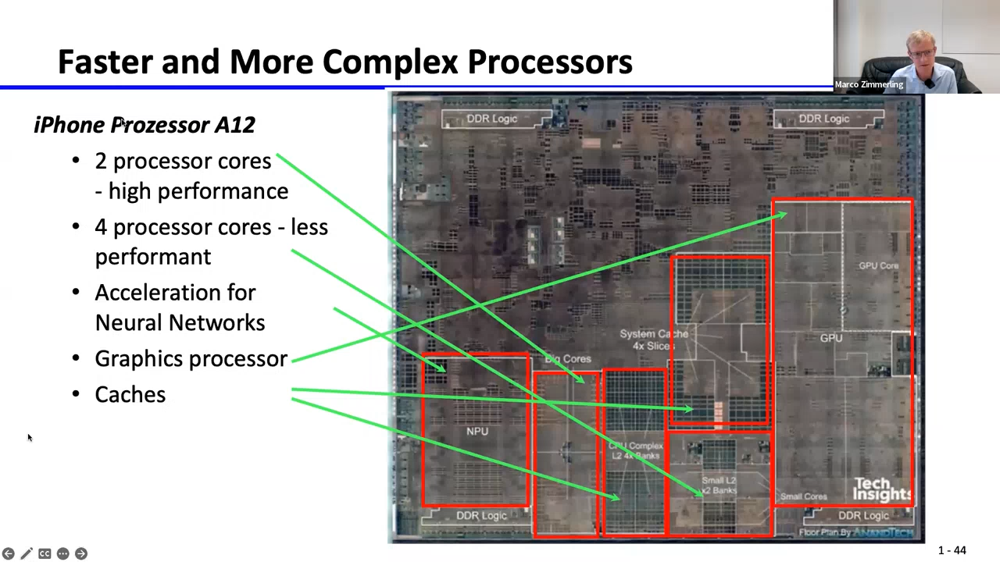
<!-- - `1:02:22`: i'm not exactly sure which model of the iphone but this is the process as h h ralph saw and it comes with six different course at least like general nah not really general purpose but yeah embedded computing horse and two high performance. -->
<!-- - `1:02:42`: course are here and four and. -->
<!-- - `1:02:45`: what other cores are. -->
<!-- - `1:02:49`: the big way or the because again it's a tool for for high performance dance and for lower performance task and this one here is a form and also tool to increase the performance you'll very often use very dedicated specialized processes. -->
<!-- - `1:03:08`: not only to increase performance but also to make the the overall system efficient which we will talk about in a minute so for example and very often nowadays we use machine learning models to do all kinds of things or even do some preprocessing on the smartphone not only in the cloud will be. -->
<!-- - `1:03:28`: train the models you can also do some training and inference of these neural networks on the devices itself and are dedicated to processing elements for these neural architectures for these neural network computation matrix computations. -->
<!-- - `1:03:45`: or graphics is also very good examples with cheap your course dedicated to graphics and of course very high performance caches to do very efficient data movement between these different elements. -->
<!-- - `1:03:58`: so the trend or for you to remember is that we are going faster more complex more parallel and this allows you to achieve higher performance. -->
<!-- - `1:04:12`: hmm. -->
<!-- - `1:04:17`: next question what can you do to decrease power consumption we talked about efficiency in the beginning what can you do to increase parkinson's. -->
- 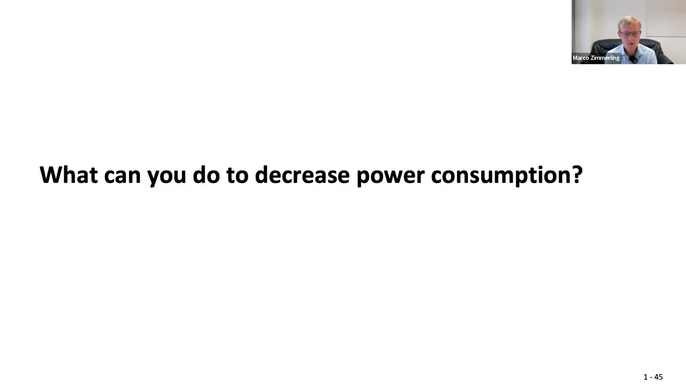
<!-- - `1:04:26`: well what i just mentioned is that you can you can. -->
<!-- - `1:04:30`: design or include specialized circuits if you have tasks then you have to do very often your design and esic a chip that does justice this can increase both the performance but it can also bring down the energy consumption the power consumption because it's specifically designed for this purpose. -->
- 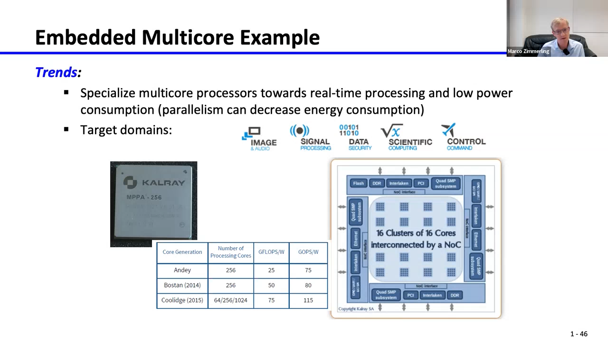
<!-- - `1:04:51`: and another aspect is that maybe a little bit surprising to some of you is that by using minds of course so executing things in parallel. -->
# ==============1:05:00==============
<!-- - `1:05:03`: one can actually decrease the energy consumption saw para realism or using multiple costs instead of one big core can decrease the overall energy consumption. -->
<!-- - `1:05:15`: and this is something that we can see yeah i mean it's already seven years old but you have this specialized chip for image processing signal processing scientific computing and what you can see here is year billions of one hundred fifty billions of operations per watt. -->
<!-- - `1:05:35`: so per what. -->
<!-- - `1:05:37`: and you can see that the dinamo of course was is going up. -->
<!-- - `1:05:42`: but the number of operations then you can do per watt so the overall efficiency is article i read so by by by doing i'm including more course you can and could compute execute more operations more efficiently. -->
<!-- - `1:05:58`: and he has actually a very high level block there from of this architecture so we have sixteen clusters in each of these clusters consists of sixteen course so it's this is an example picture of this middle configuration you have two hundred and fifty six course. -->
<!-- - `1:06:20`: yeah so there's just one one example and it might be a little bit surprising but you will learn in the lecture why parallelism can decrease energy consumption. -->
- 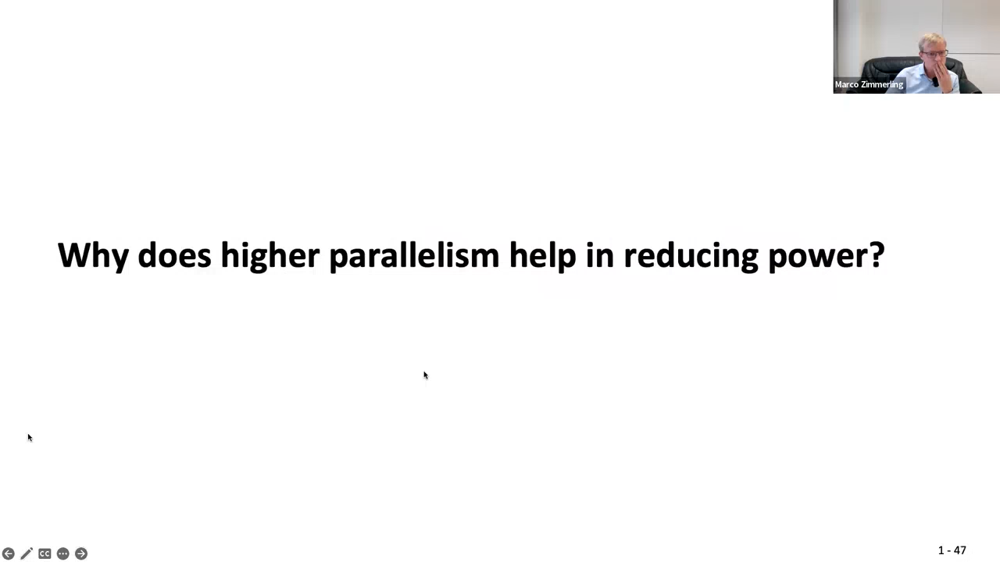
<!-- - `1:06:31`: yeah that's the question. -->
<!-- - `1:06:34`: and yeah so this is something that you will learn in intellectual. -->
<!-- - `1:06:40`: and this is another nice nice nice picture a half year from a rubber old samsung galaxy model. -->
<!-- - `1:06:50`: again here you can see that they were increased the capabilities the computer combat abilities but also made the system more efficient by using dedicated blocks for example for mighty meteor they have dedicated hardware blocks for mighty media also for the display and the comer. -->
- 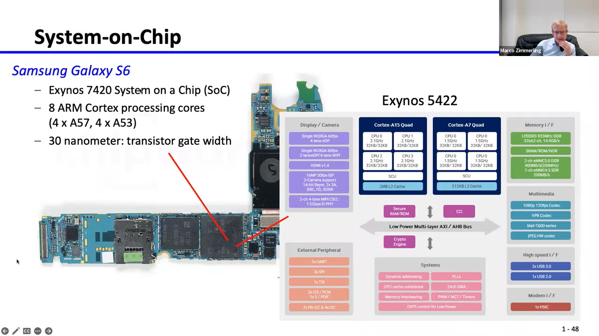
<!-- - `1:07:11`: dedicated cause and parallelism so here are four course. -->
<!-- - `1:07:17`: in this cortex a fifteen and another four course here. -->
<!-- - `1:07:24`: vortex a civil quick. -->
<!-- - `1:07:26`: so. -->
<!-- - `1:07:28`: parallelism. -->
<!-- - `1:07:31`: increases the complexity which is bad because it makes the system harder to understand but it allows you to make the system more efficient and increase the capabilities. -->
<!-- - `1:07:43`: okay how to manage extreme workload variability and whether for example your you might be idling for example now writes your you will have a lecture you don't have much to do or during the night but then maybe after after this the sooner the lecturer you will call your friend or. -->
- 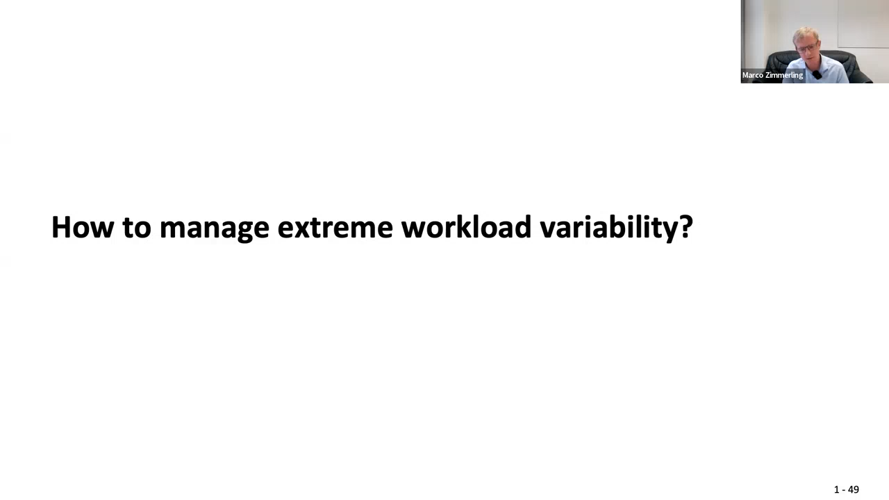
<!-- - `1:08:01`: you will take a bike so you have to be very active and you have to expend much more energy than you are probably doing so your workload or our workload over the day varies very low birk loved during the night and maybe during a lecture hopefully you are still awake and listening to me but sometimes when you are really under stress for example you're in. -->
<!-- - `1:08:21`: and and you have a very critical task such and such as an exam you will have to focus you'll have to execute. -->
<!-- - `1:08:32`: at your peak performance and you're also allowed and will use a lot of much more energy than in your and during faces where you have very little to do and this is what i mean with workload variability and this is very common and if your smartphone is just sitting around it does nothing but when you. -->
<!-- - `1:08:51`: inter interact with the smartphone it needs to wake up very very quickly and it needs to and maybe also start up different different components more powerful processors and to get the work done and this is exactly what what is being being done on many many embedded systems that you turn. -->
- 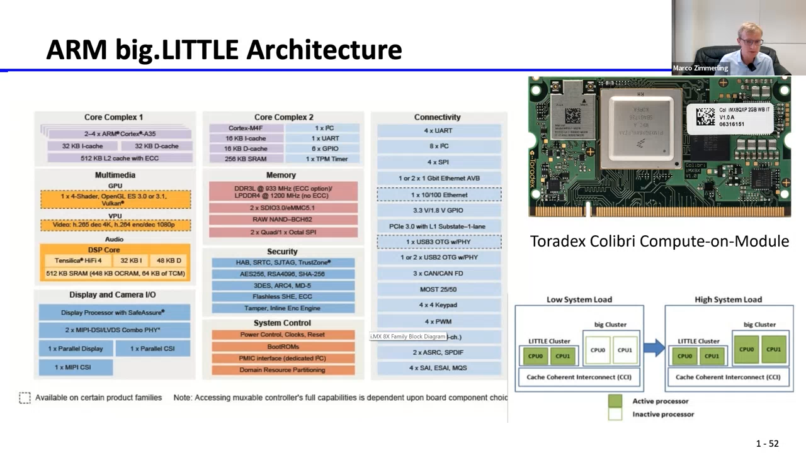
<!-- - `1:09:12`: entire cpu was for example like this this big cluster of more powerful cpu was is turned off when you have low lord but when you interact with the system and it actually has something important to do this big cluster of more powerful cpu is astronomer. -->
- `1:09:30`: and by doing this **duty cycling** is called duty savings switching components on and off.
<!-- - `1:09:37`: yeah your you can save power when you have a very low workload and during phases with a higher workload you can execute these tasks efficiently and you actually ought to increase the efficiency because you are handling these more heavy tasks with dedicated more powerful pro. -->
<!-- - `1:09:56`: some processes which will allow the system to turn off again earlier. -->
# ==============1:10:00==============
<!-- - `1:10:02`: compared to when it would use these little cores to execute the complex task. -->
<!-- - `1:10:10`: okay so let's move on to to the entire system so we we talked about. -->
<!-- - `1:10:17`: the drawn or dedicated embedded systems but each of these systems will. -->
- 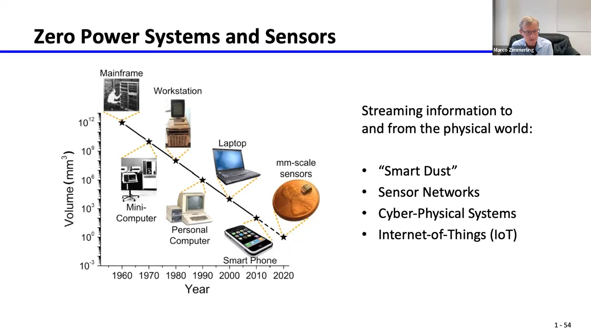
<!-- - `1:10:25`: i thought each admin assistant in isolation is not very useful i mean a smartphone is not very useful if it cannot communicate with other smartphones with with the base station for example a laptop needs to communicate and on your laptop or smartphone you also use cloud services so. -->
<!-- - `1:10:45`: what used to be called a mainframe fifty or seventy years ago and. -->
<!-- - `1:10:52`: sixty years ago. -->
<!-- - `1:10:54`: i mean these aren't all data sentence read and embedded systems are connected to data centers nowadays tool laptops to more powerful machines. -->
<!-- - `1:11:05`: and the trend is clear so we are able to design and build smaller more capable and better systems some of them are of the size of a grain of salt hardly visible and this is the vision of smartest isolate this vision has been around. -->
<!-- - `1:11:25`: for twenty years now where were the ideas that you have embedded systems of the size of a dust particle and this will sense your environment and and will be floating around us in millions and millions of these devices but all these devices eventually also need to integrate. -->
<!-- - `1:11:46`: wait and communicate with more capable larger systems. -->
<!-- - `1:11:52`: so you have the sensors and these may communicate with your smartphone or some other base station. -->
<!-- - `1:12:01`: device and eventually the data will work some of the data where will be community awards for a data center for example. -->
<!-- - `1:12:11`: and the sir so these are some some of them. -->
<!-- - `1:12:16`: passwords or or terms that you'll see that are related to sensor networks and other things and cyber physical systems. -->
<!-- - `1:12:25`: and at the very end of this chain here you have these various small sensors and the smaller sensors. -->
- 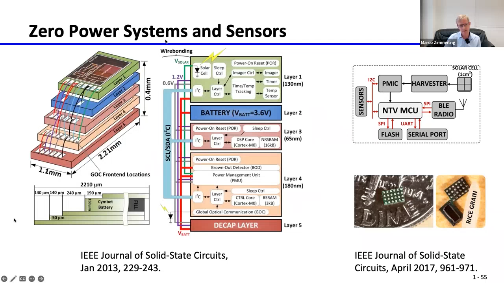
<!-- - `1:12:34`: they are embedded into a bridge in your body for example as i already tried to explain they need to operate for a very very long time so very often what you will see nowadays is that these devices are getting their energy not from a primary battery but they actually harvesting energy from from an environment and yen. -->
<!-- - `1:12:53`: this example this this very small sensor so you can see the size here so this is this is the size of the device. -->
<!-- - `1:13:03`: and in a later iteration they really made the small the size of the swords half of the size of a of the rice grain. -->
<!-- - `1:13:12`: and at the very top of this layered architecture the very top they have a solar cell using the solar so the system can extract some electrical energy that is stored in the battery so that's the second layer then there's some power management here. -->
<!-- - `1:13:30`: some don't know this is the power management here is actually the processing layer here but dedicated course. -->
<!-- - `1:13:38`: and some entering. -->
<!-- - `1:13:40`: and yeah there's the poor management which makes sure that energy from the solar cell is put into the battery and wedded when it is needed power actually flows through to the various hardware components that need. -->
<!-- - `1:13:54`: i need the power. -->
<!-- - `1:13:59`: yes and they made this much smaller and in a later iteration year there they were also able to attach various sensors a flash memory serial port for programming i would sketch and also bluetooth low energy radio so you can interact with this marry a very small device. -->
<!-- - `1:14:16`: full smartphone or any other ble enabled device. -->
<!-- - `1:14:22`: so does the last slate of this of this part of this lecture we will continue but done so just some some trends that you should be aware of it might be obvious obvious some of you but so many of the systems as i tried to explain. -->
- 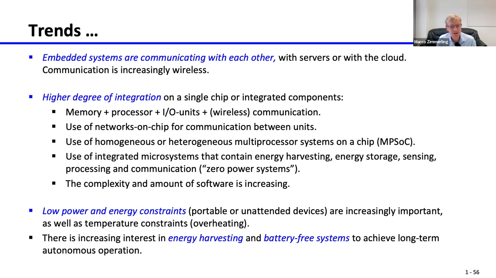
<!-- - `1:14:41`: i have to communicate with each other saw a single embedded device is not very useful if you want a bit more complex systems they need to interact with each other and very very often nowadays this happens over a wireless communication. -->
<!-- - `1:14:56`: which can reduce costs increase the flexibility of the system you cannot operate a drone with with a cable. -->
# ==============1:15:00==============
<!-- - `1:15:05`: so embedded systems are increasingly communicating with each other many of them are wireless. -->
<!-- - `1:15:13`: and there's a high degree of integration on a single chip or integrated components so you need all kinds of. -->
<!-- - `1:15:22`: hardware components becomes a memory computing mighty because as we've seen we have to interconnect these different cores and memories using network on ships we have homogeneous or heterogeneous models as architectures with different capabilities of these processing components to make it efficient. -->
<!-- - `1:15:43`: and reduce the costs and the size and so on. -->
<!-- - `1:15:46`: and yeah unfortunately this means that the hardware architecture but also the the competent complexity and the amount of software that is being developed for embedded systems is rapidly increasing. -->
<!-- - `1:15:58`: and. -->
<!-- - `1:16:02`: yeah i mean low power and energy constraints and very important heat is important and there's a very large interest in making these embedded systems autonomous so when you think about internet of things billions of devices. -->
<!-- - `1:16:20`: as i already said you cannot go around and replace all of these batteries regularly they should operate for ten twenty thirty years and as long as the product is in use and some of the products that we use such as a wall or in a smart smart wall a smart device or a sam. -->
<!-- - `1:16:40`: i system that monitors the state of of the environments such as the health of of trees in the forest for example so if you if you plant the tree and you put on the sensor that regularly checks the health of the tree if it gets enough water if there is any any infection of the tree you want. -->
<!-- - `1:17:01`: that this sensor can essentially operate for as long as the tree is growing. -->
<!-- - `1:17:08`: after eighty hundred years when when we use the tree to build furniture for example we cut the tree and then the sensor is not no longer needed but if you think about the take the example of a of a tree central then the sensor should really be be put on the tree and. -->
<!-- - `1:17:27`: it should operate for fifty sixty seventy years until you cut the tree this is not something that is possible today but this is where the entire field and the technology is going and for this we need energy harvesting we need to extract energy from the environment solar temperature differences. -->
<!-- - `1:17:48`: as vibration so for example when humans are walking we can extract electrical energy from from the vibrations to operate some sensors that we have on our bodies. -->
<!-- - `1:17:59`: and very recently and we also doing some research in this area is that we want to get ripped off of off the batteries and use other other devices to store energy because batteries don't last very long you'll have a limited number of charging cycles for batteries and therefore for example capacitors are being used. -->
<!-- - `1:18:21`: okay so these are some of the the trends and. -->
<!-- - `1:18:25`: we will now. -->
<!-- - `1:18:28`: now maybe desert. -->
<!-- - `1:18:31`: so are there any questions so we've been our continue for another. -->
<!-- - `1:18:37`: ten minutes i will try to keep this rather short but if there are any questions about this partner then this might be a good point and. -->
<!-- - `1:18:46`: otherwise i will and. -->
<!-- - `1:18:49`: continue with the. -->
<!-- - `1:18:52`: second. -->
<!-- - `1:18:54`: pod which will be a rubber. -->
<!-- - `1:18:58`: short part games christian. -->
<!-- - `1:19:02`: there's a question yeah one question do you hear me yes i can hear you. -->
<!-- - `1:19:08`: ask about realtime i think actually you extreme. -->
<!-- - `1:19:13`: ask again if it's possible could you explain again the time he has as he stems it means like it's predicted and it should be give the answers and yeah. -->
<!-- - `1:19:27`: i'm incorrect at the time they clashed yes yes yes exactly so very often the term real-time is confused very often people think about real-time as doing things very quickly. -->
<!-- - `1:19:44`: but but as we will see in the lecture and there will be a couple of lectures about real time scheduling and where will you will we will define this very very concretely i am real time for us in this course means that we have to finish certain activities such as a computation within a certain tie. -->
# ==============1:20:00==============
<!-- - `1:20:04`: comment about let's say ten to ten milliseconds it doesn't matter if we finished the task earlier if he finishes it within three milliseconds or five we don't care we only care that you finish it within ten milliseconds and this ten milliseconds is what we call a real time constraint or real time deadline and if you have a task. -->
<!-- - `1:20:24`: sc that. -->
<!-- - `1:20:26`: can where you can guarantee that it executes within this time bond this ten milliseconds and this is a real time task and we want to have formal analysis and proves that this has actually achieved. -->
<!-- - `1:20:39`: so i hope this is a this was enough for for a quick explanation right now and thank you so much you're welcome. -->
<!-- - `1:20:50`: we will go into much more detail in one of the late elections. -->
<!-- - `1:20:55`: well. -->
<!-- - `1:20:56`: just some one wanted to talk briefly about and software development and. -->
- 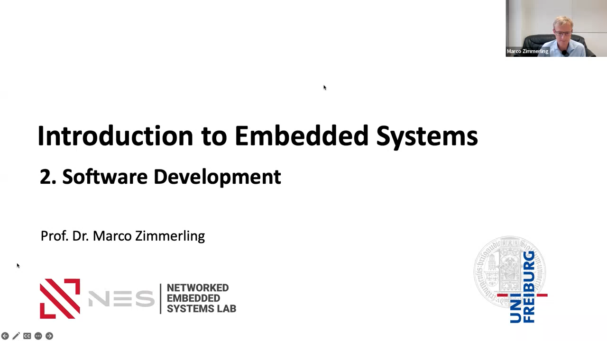
<!-- - `1:21:03`: for embedded systems and this is now the rubber short second chapter that i would like to start and finish today. -->
- 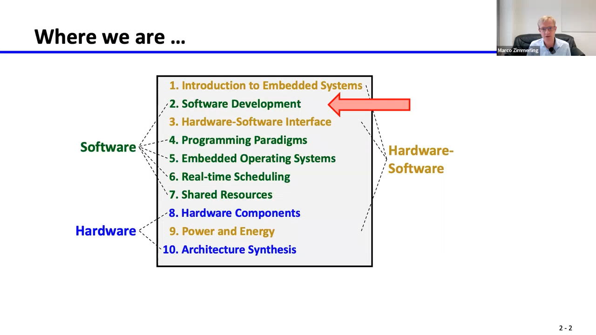
<!-- - `1:21:17`: so. -->
<!-- - `1:21:20`: i guess some of you who have attended lectures on computer architecture or programming you may be familiar with this but to just establish a common ground for all of you this graph shows all the process of getting from a. -->
- 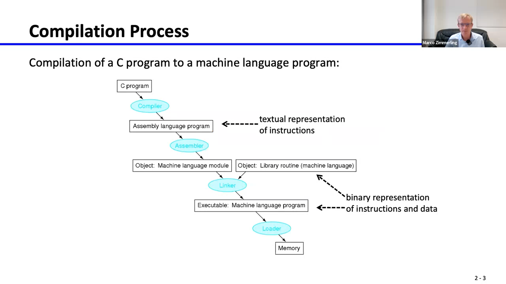
<!-- - `1:21:39`: grimm that you have written like the hello world program for embedded systems that fleshes the lcd. -->
<!-- - `1:21:47`: into something that is actually executed on an embedded system. -->
<!-- - `1:21:52`: and usually in embedded systems we don't you we don't use python or java for various reasons and one of them is efficiency in embedded systems very often we use c programming language that is called c. -->
<!-- - `1:22:08`: and then the c program is still a pretty human readable and but it cannot be executed on on the actual hardware so we need to have a compiler a cooler tools is used compiler that translates your c program in that you have written. -->
<!-- - `1:22:28`: into an intermediate representation it's still fairly readable but it's a much much longer program and not so not so easy to understand. -->
<!-- - `1:22:40`: and then there's a another tool called an assembler it's unfortunate naming but it is called an assembler that takes this intermediate assembly program and translates it into a machine language module or something that is that is almost ready to be executed or it could. -->
<!-- - `1:23:00`: potentially be executed already on and on your architecture but as we have seen very often you'll want to use other software components or like an operating system that already provide some functionality for timers and. -->
<!-- - `1:23:20`: fox or reading all sensors there might be some software library that you can use to read out a temperature sensor you don't have to write this yourself and to weave or integrate your your program that you have written with this existing software component. -->
<!-- - `1:23:39`: you need what is called a linker that does this interconnection saw your statement read our temperature sensor that this is actually being met with something that is really executed this linker make sure that it caused the right functionality from an existing library. -->
<!-- - `1:23:59`: the linker outputs a machine language rogen which is it's it's a binary representation as well as here so these are just using once and once you put this onto your embedded system it can can be loaded from. -->
<!-- - `1:24:16`: from an ephraim ephraim and the executed. -->
<!-- - `1:24:20`: so this is the year the entire and compilation chain. -->
<!-- - `1:24:25`: and. -->
<!-- - `1:24:27`: what is quite special in embedded systems is that. -->
<!-- - `1:24:32`: so this is what we what we have just seen so we have the source code and the compiler and it's and it spits out something or output something that can be executed on the embedded system so what you can see here on the slide is that. -->
- 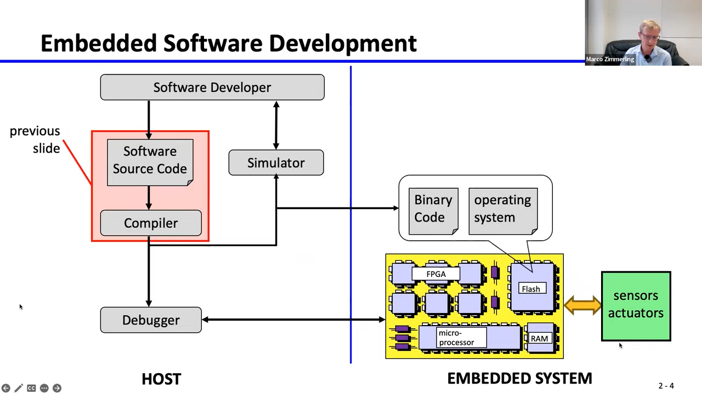
<!-- - `1:24:45`: the host so your own pc. -->
<!-- - `1:24:49`: where you have developed the program and compiled it is not the same hardware where it is executed so you'll develop it here on your host pc and it is being executed on a different hardware component. -->
# ==============1:25:00==============
<!-- - `1:25:05`: and bridging this gap here between your pc and here is not the trivia. -->
<!-- - `1:25:12`: and one is very often done is that you have a simulator where you yeah have some way or way of basically pretend that you're executing the program on the actual embedded system. -->
<!-- - `1:25:26`: but of course the capabilities or how much you can trust and abetted simulator is limited why is it limited in this limit because the simulator misses the entire environment so this might be an iota device that sits somewhere. -->
<!-- - `1:25:43`: on a tree in yours in your washing machine in your production pipeline but the simulator doesn't have the same inputs the same stimulus from the mound and it's very hard to provide the simulator with the exact same words i would say it's essentially impossible to do this it is possible to some extent but yeah so simulators are good. -->
<!-- - `1:26:03`: for some basic checks to check the execution flow and things are correct on a rather basic level but the entire system you will only see you if you put it into the actual embedded system. -->
<!-- - `1:26:17`: and also debugging and finding bucks in an embedded system is very very complex so what do you usually do as you use a protocol called gtech where you connect your pc over cable with your embedded programmer if your embedded system and this wireless protocol in the debugger you can step through the code to change. -->
<!-- - `1:26:37`: something read out the contents of variables and songs of. -->
<!-- - `1:26:42`: so this is quite different from the way you do suffer development for you or for your own pc if you're just doing some python script for example to generate a plot or whatever those is quite quite different in embedded systems. -->
<!-- - `1:27:01`: and this is one example of an embedded system i have one here so here in on the slide you have the launchpad from texas instruments this is is in development board from nordic. -->
- 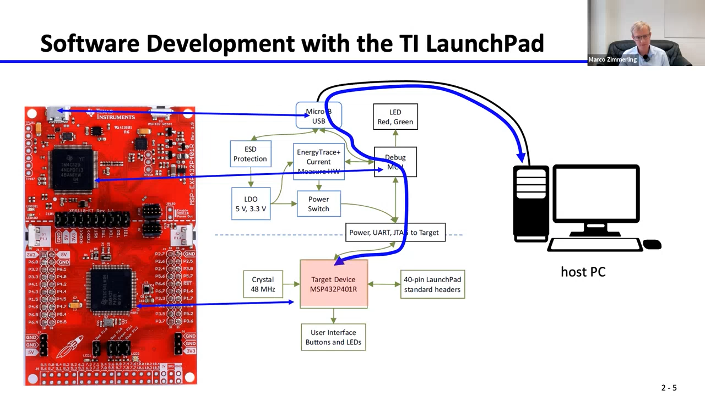
<!-- - `1:27:15`: and. -->
<!-- - `1:27:17`: you don't have to understand everything on a sled what i want to mention is that here on the lower pod this is actually the embedded processor the red one here. -->
<!-- - `1:27:27`: and all the rest on top you have to physical view or. -->
<!-- - `1:27:32`: and yet you have the block diagram all the rest year this processor with all these hybrid components are just there for you to observe what is going on. -->
<!-- - `1:27:45`: on the actual target device so through this chain near you you do the programming you can do the debugging over j take the program over you aren't who can provide the power or switch off the power to test your your system what happens if you turn it on and off. -->
<!-- - `1:28:02`: yeah i saw desert dedicated processor with all kinds of all kinds of peripherals is a very very powerful observer essentially it's an embedded system this year is an embedded system to observe. -->
<!-- - `1:28:17`: the embedded system that you are actually interested in so it's an embedded system in an embedded system and if you'll come tools some of the. -->
<!-- - `1:28:27`: hardly a practicum in the next summer semester or if you do a project with with my group or master's project or whatever you will very likely use one of these boards and you will interact with us at the gym. -->
<!-- - `1:28:40`: i. -->
<!-- - `1:28:42`: yeah saw baby maybe this is a little bit redundant but let me explain again so if if you will take your programs of this your your c c program your job right so the we edited the code your uh hello world the compiler translates into an assembler program you may also add some as. -->
- 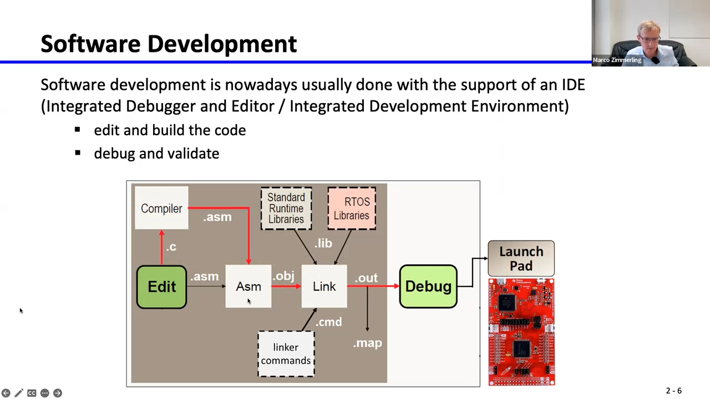
<!-- - `1:29:02`: similar by yourself which we and our group are actually doing very often because we want to make sure that things are as efficient and as as possible. -->
<!-- - `1:29:11`: so you have an assembler program does it translate it into a binary representation and the object fire then a linker connects. -->
<!-- - `1:29:22`: your own program with other libraries operating systems and whatever and lincoln commands which we talk about briefly and then it outputs a file. -->
<!-- - `1:29:32`: that is then programmed into the embedded system into the launchpad for example or into a development kit. -->
<!-- - `1:29:44`: okay so this is maybe a redundant you can have a look at this basically this is what i said with a bit more. -->
<!-- - `1:29:52`: and detail what is maybe worthwhile mentioning is that the linker not only uses the object file and the libraries as input and connects them it also does also link or commands dedicated commands that instruct. -->
# ==============1:30:00==============
- 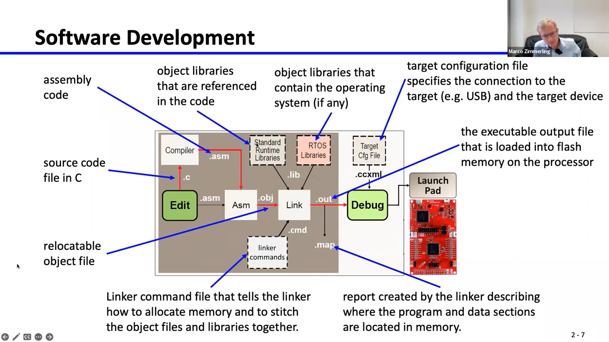
<!-- - `1:30:09`: i wear certain parts of the program should be executed in memory so which parts of the of the memory shall be allocated for and for program data for him to fulfill the actual program or for for the stick and so on so these are. -->
<!-- - `1:30:29`: there are dedicated additional commands and this is also sometimes important sometimes you'll look at the schematics at the data sheet hundreds of pages and you'll find out that you should you should put certain parts of your program into certain memory locations in order to optimize stuff. -->
<!-- - `1:30:48`: does not something that you have to do in in this lecture but if you really get your hands dirty and work of embedded systems is something that you may want to do so the app is a c c program if you have never seen a seat program this is maybe a way for youtube to see you saw its we human readable you may have written this this year. -->
- 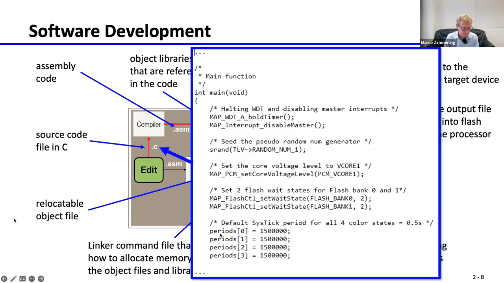
<!-- - `1:31:10`: where you set the voltage level and weight states and you enable the interrupts and so on this is then translated into an assembler this isn't. -->
<!-- - `1:31:23`: excerpt of an assembler for an arm architecture you may have seen the assembler fall for mips and other architectures of this is for for the arm architecture but it's still quite similar with lord statements compare statements branch statements and your tool things are edited together and so on but. -->
- 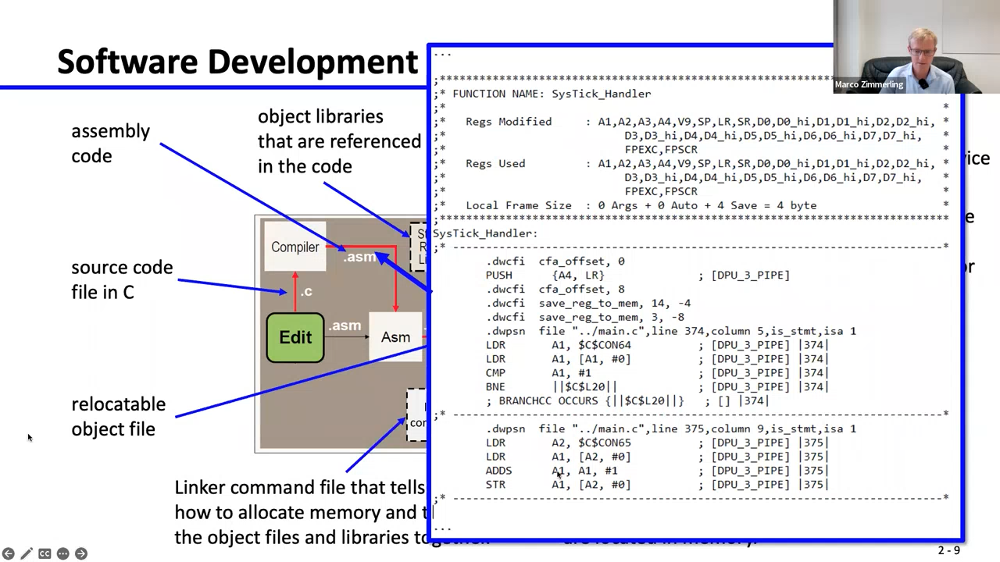
<!-- - `1:31:43`: you can still understand but it's much more difficult to understand and much much longer. -->
<!-- - `1:31:48`: and yet this is aki these are examples of the lincoln romance song yeah he will specify which one. -->
- 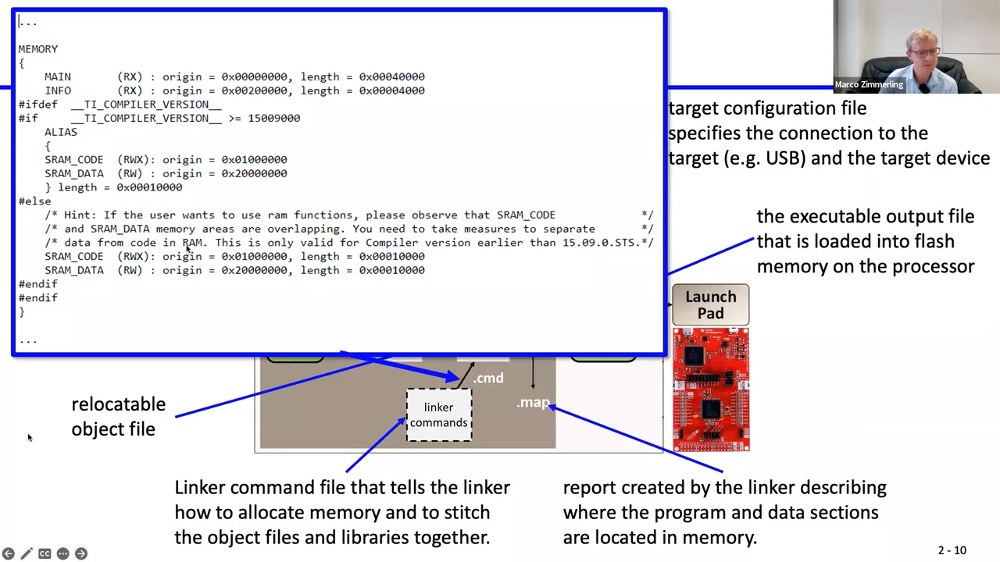
<!-- - `1:31:58`: the memory location a certain part of your program starts and where it ends and so on is awful. -->
<!-- - `1:32:06`: and then they have also commands to check that everything is correctly allocated so this is something that you can output well. -->
- 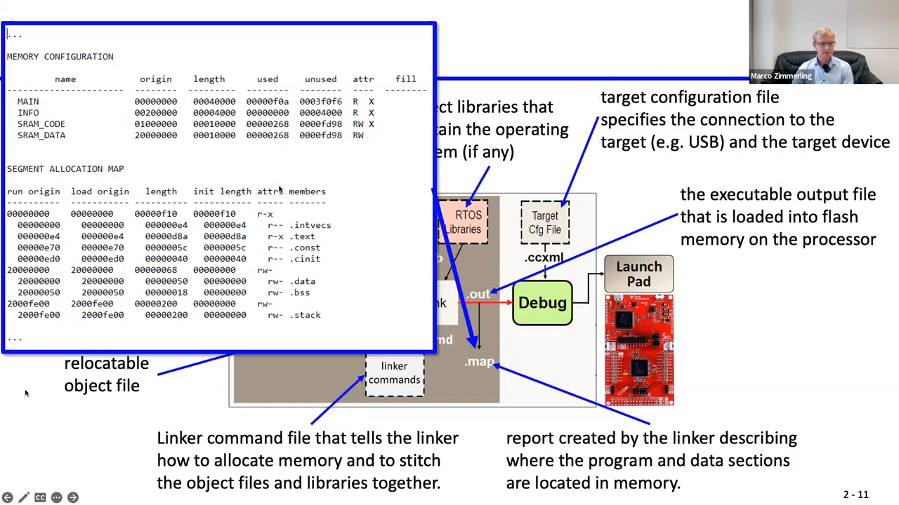
<!-- - `1:32:16`: okay and finally there might be an exit an xml file that is needed to in order to program. -->
- 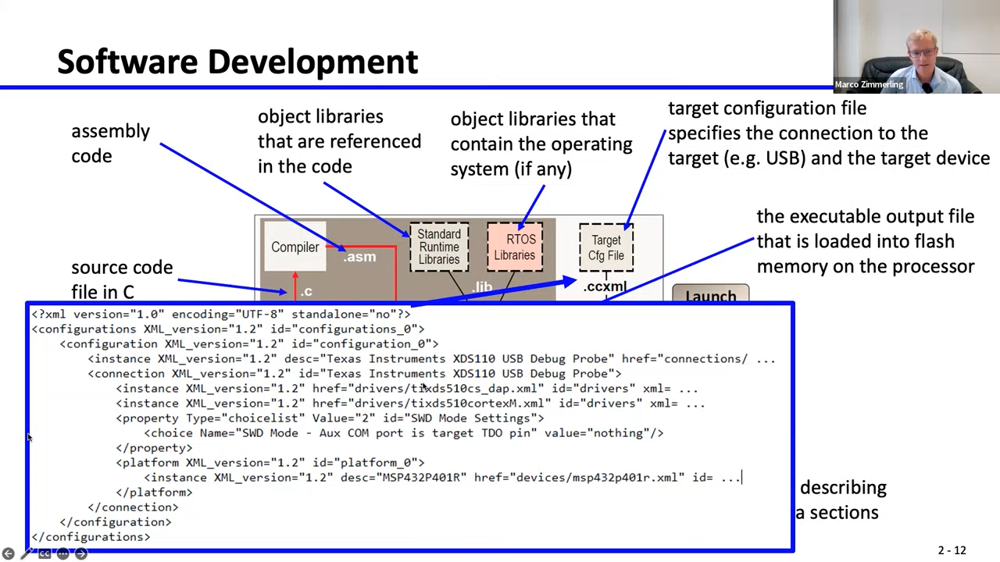
<!-- - `1:32:25`: or upload and instructs the observer how what would you what a dual river with the with the binary that is going to be to be programmed and using this this file and the binary you execute a command and over the years became over the years this year the port then the binary is put onto your bench. -->
<!-- - `1:32:45`: system. -->
<!-- - `1:32:47`: okay so we are almost at the end and i would like to invite yours or in this lecture and you will learn the basic concepts and learn to apply them with pencil and paper there's no lap associated with this nature and the at least at the moment. -->
- 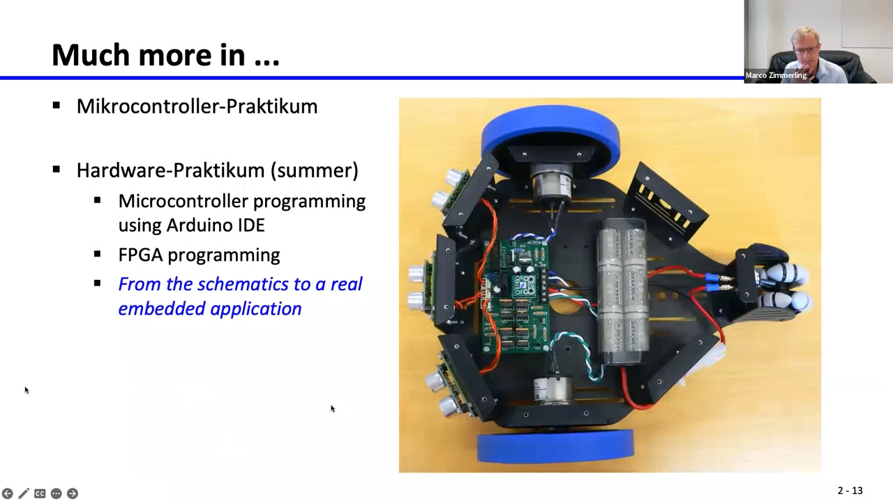
<!-- - `1:33:08`: i will as a continuation of this lecture i would and i think the students from computer science are actually there so it's a it's a mandatory course is to attend the hunter practical. -->
<!-- - `1:33:21`: and i would also. -->
<!-- - `1:33:23`: i ask the embedded system students in the masters to think about attending the hotter practical it's not mandatory form for them but it should actually be because what you do there is you attach this robot you which has different. -->
<!-- - `1:33:43`: processes different and interfaces it has more tourists to drive these wheels it has sensors sonar sensors here and you you learn and you will over overtime learn how to program all these components using a microcontroller based approach in the first part of the harvard article and also if pg april. -->
<!-- - `1:34:04`: grimm. -->
<!-- - `1:34:05`: to do more advanced stuff like this so this is what is offered in the in the summer semester by by my. -->
<!-- - `1:34:14`: group when there's also the advanced microcontroller or practicum by a group of professor who pitched from the. -->
<!-- - `1:34:23`: other department. -->
<!-- - `1:34:25`: so if you want to put what you learn in this lecturer into practice and get your hands dirty please look into this maps. -->
<!-- - `1:34:37`: okay so this brings us to the end of today's lecture. -->
<!-- - `1:34:42`: are there any questions. -->
<!-- - `1:34:48`: is there that there was one question is there an advantage if we use the assembly language directly instead of c. -->
<!-- - `1:34:55`: and. -->
<!-- - `1:34:58`: that there are. -->
# ==============1:35:00==============
<!-- - `1:35:01`: certain cases where you want to make sure that. -->
<!-- - `1:35:07`: things are really executed as you want them to be executed so sometimes you mean what you can do as you can you couldn't compile your your c program and then look at the assembler code that was generated by the c compiler. -->
<!-- - `1:35:22`: and sometimes you may find out that what the c compiler did this was not exactly what you wanted the compiler to do. -->
<!-- - `1:35:31`: i mean you can play around with compiler flags and optimization letters i dunno if you are a fan of this but you can influence what the compiler does to some extent but sometimes you will don't want to trust the compiler you'll really want to make sure that that things are being executed as you want them to be eg. -->
<!-- - `1:35:51`: executed and then you you have to write some code and you can also write the self modifying code in assembler so that the code that modifies itself as while it's being executed and this is something that that is typically done in embedded systems with simpler code but this is very very advanced way of. -->
<!-- - `1:36:12`: of programming embedded systems and we have some experience in our group of this but this is not something that you learn typically in intellectual so this something that you might be doing or learning in a in a master's project or at the end of a of a of a master thesis when you really really have to lose. -->
<!-- - `1:36:32`: and yeah but you are usually write assembler only for very small portions of your code like the very critical parts the rest really would like to do in c because otherwise it's just too much effort and too much code to maintain and and and understand so the c code is still much. -->
<!-- - `1:36:51`: and now. -->
<!-- - `1:36:54`: okay so there's another important organizational question maybe not all of you were present at the beginning of of the lecture saw today there will be no exercise so in the morning on tuesdays we will have lecture from eight to ten. -->
<!-- - `1:37:12`: also next week the week after there's a holiday on november first today there will be no lecture in the afternoon so no up nor exercise sorry in the afternoon from twelve to top so you have free time. -->
<!-- - `1:37:27`: next week that will definitely be the electorate in the morning we are not sure yet if we also have the exercise in the afternoon because we have to align the lecture content with the content off of the exercise so please register to the earliest course and have a careful look if there will be an egg. -->
<!-- - `1:37:47`: associates are ready next week and yet just we have to get up to speed with the lecture before we can apply the concepts in the exercise. -->
<!-- - `1:37:58`: i will upload the slides to ileus later today latest by tomorrow and also the recording of today's lecture. -->
<!-- - `1:38:09`: are there any other questions. -->
<!-- - `1:38:23`: there's a clash. -->
<!-- - `1:38:27`: i'm not sure if we can still do still. -->
<!-- - `1:38:34`: change this and i can check it with misery for moses moses moses if they're still a possibility so let me. -->
<!-- - `1:38:47`: services m s t. -->
<!-- - `1:38:52`: yeah. -->
<!-- - `1:38:54`: no promises but i will check at least if we can switch. -->
<!-- - `1:39:01`: i. -->
<!-- - `1:39:05`: is there a possibility to upload the slides before the lecture as i said in the beginning i'm giving this lecture for the first time now in viborg and i expect to be making changes to the slights until right before so i cannot promise to upload the slides beef beef before before the nature. -->
<!-- - `1:39:24`: okay. -->
<!-- - `1:39:26`: one. -->
<!-- - `1:39:31`: okay so if there any further clashes with lectures and maybe you write a comment on in the forum in the ilias forum maybe this is a better place to collect all the clashes saw also the the person saw who mentioned the clash with in his tea please write it in. -->
<!-- - `1:39:48`: the forum we can have a check but yeah the flexibility in the schedule i think is quite limited at this stage but we we will see there are also plans that i have heard that the how's i the the kino house will be closed from november. -->
