<!-- /home/areo/Videos/Einführung_in_Embedded_Systems/Lecture2.mp4 -->
<!-- /home/areo/Videos/Einführung_in_Embedded_Systems/_Lecture2_imgs -->
<!-- /home/areo/.config/mpv/mpv.conf -->
[toc]
# ==============0:00:00==============
<!-- - `0:00:00`: the. --
<!-- - `0:00:20`: the. -->
<!-- - `0:00:40`: the. -->
<!-- - `0:01:00`: the. -->
<!-- - `0:01:20`: the character marked canal isn't even scientists to be and also notice it was finished ringing houses and furnishings or discipline now does but altered behavior was forbid the sexual longing in a tourist and traveler highest missing false and. -->
<!-- - `0:01:40`: into discipline there was also abundant as the spam and effect susan and was august was on smoking was under small house and was mass on t-mobile and when that sealer system and affects us and and stalkers and aspects of fraud and wound him and effect often decent support for the young. -->
<!-- - `0:02:03`: this is pretty quick. -->
<!-- - `0:02:08`: since then is good. -->
<!-- - `0:02:11`: yeah. -->
<!-- - `0:02:13`: i can also enjoy more as a bustling market was that cynicism concisely i english and if abundance of bone sessions to the end and didn't want her name on the whole schulen does what auditors can go into one of four cdna out and buys an advice and as for darted you have intensified so by it's highest the arbeiten in fear for sheeting and teams the album financing unit. -->
<!-- - `0:02:33`: christ but soon so as equality it's management and i t marketing and our names contact the highest alice was extend him and affect his order of human relations highest for one was internal intensifies abide not my rootless concrete and endured. -->
<!-- - `0:02:49`: but soon so as the extent of way exodus doesn't seem as does had stricken and effect frontier in consulting to have much discussion of modern finance discretion come consumed by the workshops and furnished to interview some iron unbeaten official d and above all in romford on some corporate athens partners often give him and antonym hundred citizens common done demonstrations workshops heightened. -->
<!-- - `0:03:09`: can or neben against an aba d as august ruins a fine slim mouse metallic him off and it was spicy gas finds leaving us without reference or cantonments as an antonym your bus kind of messengers on what i'm thinking and from noon beer and keno. -->
<!-- - `0:03:24`: so the next ten poekr muslins of portfolio between the muffin research and analytics desperate altered their haben teilweise a simple analysis but soon spies impact analysis and concisely order awesome biosphere just one lending purchase in practice marketing soda stone marketing strategies fought for weekend off in regards to social media florence. -->
<!-- - `0:03:43`: thornton but soon spies a messenger or whatsapp management does paradise if you're having puts as miserable as the and all. -->
<!-- - `0:03:51`: unsure listened and anti optimism that processor startups are waiting for imam was gotten better practices and us said and thus deny it so gang and influence come directly mukesh khaitan cox's iphone says i'm an immigrant from employment and startups as i'm on a six thousand society in the sand vexed scientists were management's susan. -->
<!-- - `0:04:11`: and diagonal lankan. -->
<!-- - `0:04:17`: by us the saw does and get some by sweden he had said he has seen cannot be her contexts academy to have share on nuclear efficiencies under matan. -->
<!-- - `0:04:28`: you know it's comrades of her mood logistics sunflower sua basquiat which i english beaten can when sua does dust some iron demolish kite and fashion yet a falcon wants to summon fifty and taters couch pizza in anna bogart on wood aka novella management when da by the effect of boxes or foul summons who can lighten up the nuclear crisis on infinite. -->
<!-- - `0:04:47`: as as for years and shruti gun involved into the sun does any mukesh corrupt him and effect of these attached bubbly flights of philosophy minute of in the fangs i'd buy a glimpse at justice also have an usb into orbit relative or shine leishman few enlightened contact harmed initial unwitting disable or studio time on star disrupted the nuclear kite effect of ocean and liquids to become even fights congested. -->
# ==============0:05:00==============
<!-- - `0:05:08`: in tema by it's fuzzy and on abbott's mark one compare criticism arbeiten on diet and gained of director of somebody she been inherited gm studium golan tub gets flushed and dism semester would often in for gangland semester and four hundred mountain men are unmanned and couldn't and dessert across the open dare his dystrophy pussy and lesson. -->
<!-- - `0:05:28`: and then on the undersides hunger of beispielsweise the and inform as soon stay snake fozzie to digitally zealand without a seal. -->
<!-- - `0:05:39`: so each offer thus years on one puff hagen hopped on this country on best conclusion in vimeo not my way to arm time to relax and inform the defendant on swansea's wish that i can oh you couldn't imo many awards and qr code and scan the fittest zones on her website her on. -->
<!-- - `0:05:57`: and demonstration granted one of my alien face fintan but circulars and available would all in all in for armed behind having decent mittwoch not minor linkedin shooting defendant online stop annoyance and were to do so again if rbi shown telling prevented a of their website on each but alchemist fyodorov makes some quiet on food. -->
<!-- - `0:06:18`: patient kim. -->
<!-- - `0:06:32`: yep. -->
<!-- - `0:07:17`: oh no. -->
<!-- - `0:07:25`: eyes. -->
<!-- - `0:08:05`: sorry. -->
<!-- - `0:08:56`: okay. -->
<!-- - `0:08:58`: okay can you hear me. -->
<!-- - `0:09:01`: sorry quite a hassle with this hybrid setup here. -->
<!-- - `0:09:06`: so let's switch gears and. -->
<!-- - `0:09:11`: okay we will improve over time. -->
<!-- - `0:09:15`: let's talk about and in a system so welcome to the second lecture on embedded systems introduction to embedded systems. -->
- 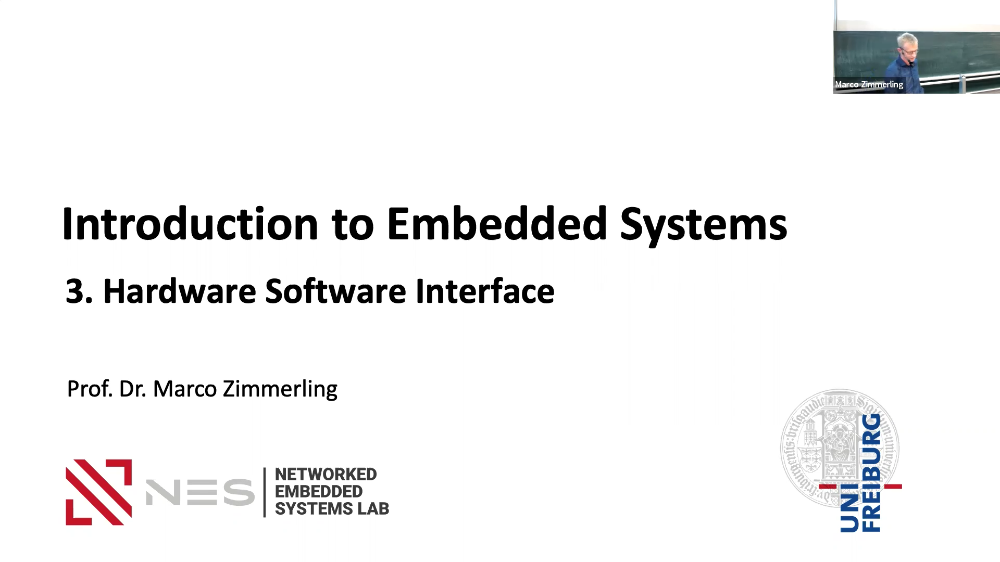
<!-- - `0:09:23`: one. -->
<!-- - `0:09:25`: and just don't. -->
<!-- - `0:09:28`: rick reminder to everybody to join the nearest course. -->
<!-- - `0:09:32`: you can golf why on the webpage of the website horses introduction to embedded systems and indians which will bring into. -->
- 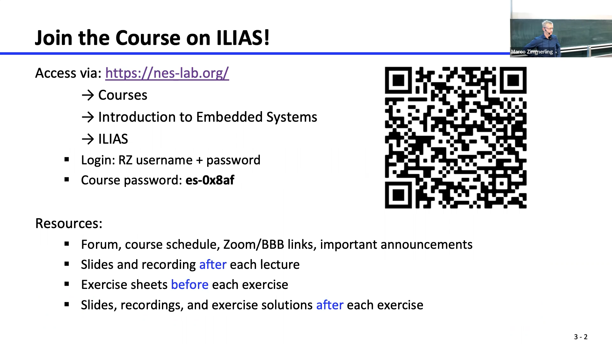
<!-- - `0:09:43`: has dui everyone brings into the alias course you can also scan the core to record and the course passwords again. -->
<!-- - `0:09:53`: year. -->
<!-- - `0:09:55`: you already find the slaves of the previous lecture. -->
<!-- - `0:09:59`: no one there as well as the recording and we will put all the solutions to the exercises the exercise sheets and recordings everything will be there so it's very important to join the aliens cause. -->
# ==============0:10:00==============
<!-- - `0:10:13`: any questions about this. -->
<!-- - `0:10:15`: so just a quick reminder in terms of timing and today we will have lecture in the morning nor exercise we still need to advance a bit more intellectual material and next week holiday so you can sleep in and. -->
<!-- - `0:10:33`: the week after we will have lecture in the morning and the first exercise on the material that we will recovered today and in the next lecture so please regularly go to india check for updates if there's anything unclear write a comment in the forum we will try to respond as quickly as possible. -->
- 
<!-- - `0:10:50`: okay so for those who attended last time i hope many of you will you will remember that we talked about so we had a general introduction for better systems what they are what are the problems we will be looking at and we briefly looked at software development and rio retina in the third chapter of the lecture on hardness of the interfaces which will which means that we will. -->
<!-- - `0:11:11`: this is these are two lectures that are most closely related to hardware components as well as the protocols and software that allow you to operate the software components. -->
- 
<!-- - `0:11:24`: you hopefully remember the slide from the last time we looked at i didn't bring one today as well so this is the crazy flier so one of these micronutrients and which is a very good example of an embedded system we looked at the front side and the backside of the crazy fly it and add. -->
- 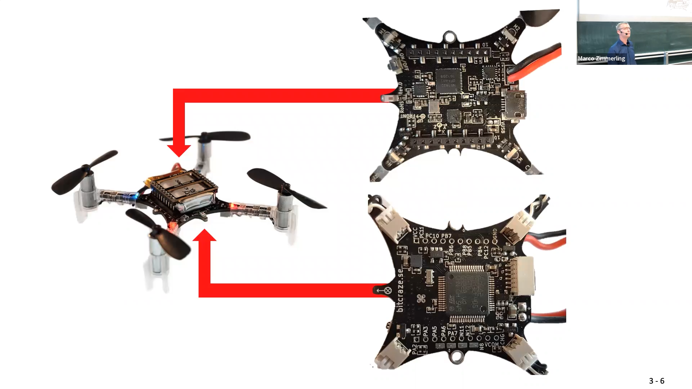
<!-- - `0:11:43`: the hardware architecture so we had this high level block diagram that shows on a high level of the different components here we have two processes law. -->
- 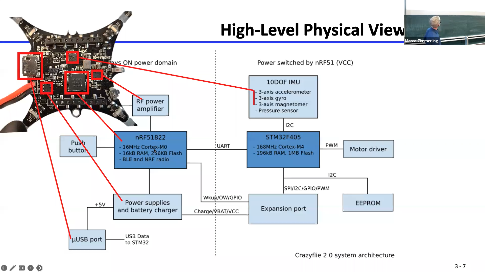
<!-- - `0:11:56`: lower power processor and more capable one as well as peripherals such as sensors but also memories. -->
<!-- - `0:12:06`: our suppliers and some. -->
<!-- - `0:12:09`: this was the other side with some other ones. -->
- 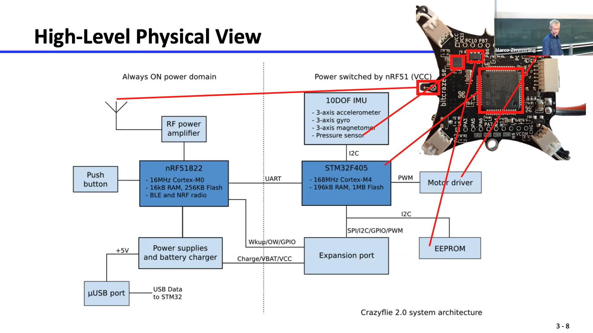
<!-- - `0:12:15`: and today and in the next lecture we will look into three different areas of hardware components that are most closely related and important to embedded systems so the first one is storage of course we need some way of storing the program for example that should be executed. -->
- 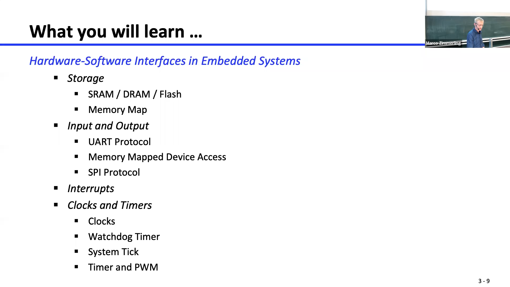
<!-- - `0:12:35`: and intermediate results. -->
<!-- - `0:12:39`: and how we can access this this just memories so this is about storage then we will look into input and output so how can we communicate with different components within an integrated circuit and with peripherals that are attached to an incorrect integrated circuit of an embedded system. -->
<!-- - `0:12:59`: some of you may have heard about new art or spr protocols. -->
<!-- - `0:13:04`: and then and so we will hopefully get to finish the sb i protocol today and next time we will look into interrupts and clocks and titles are very important components in embedded systems because as we heard last time. -->
<!-- - `0:13:20`: embedded systems interact with the environment and the environment evolves at a certain pace and the digital components have to keep up with exactly this pace in order to interact in a proper way with the moment so at timers and clocks are important. -->
<!-- - `0:13:37`: okay and storage and yet another on the crazy fly you you already saw that. -->
<!-- - `0:13:45`: this crazy ray has different kinds of memories so as you can read here we have a ran random access memory pretty small one and we have flash memory. -->
- 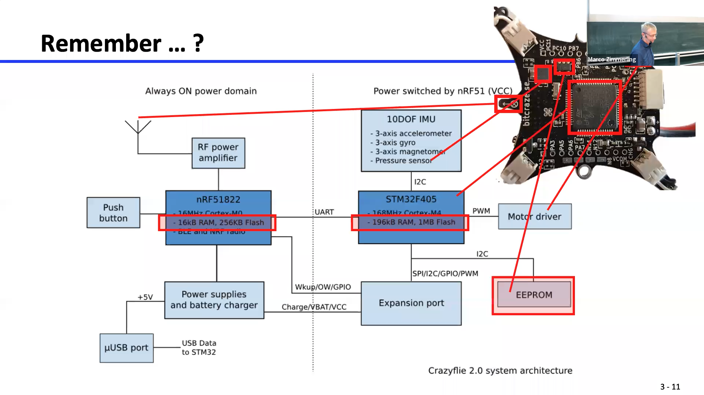
<!-- - `0:13:58`: the other processor has the same types of memories just a bit larger because it's more capable and also something that's called an ephraim. -->
<!-- - `0:14:09`: and we will look into into into these different kinds of memories. -->
<!-- - `0:14:15`: and this is one another boards that we will use i already used last time and to date i will use it again as as an example to explain or make things a little more concrete for you so we looked at this launchpad from texas instruments beyond the sun and you may. -->
<!-- - `0:14:35`: remember that as this large i think it's actually here on the bottom yet this observer infrastructure with debugging facilities and that allows us to observe what is actually going on on on the embedded processor so this is the year that a processor here and this is the precise name of this process processor. -->
- 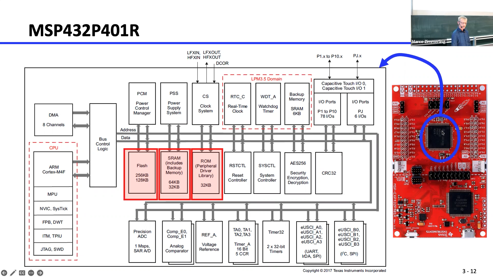
<!-- - `0:14:55`: msp for thirty two and then you'll have different variants of this embedded processor that rip reflects different capabilities so for the p four one p four zero one r this is the the block away from the monte to the war you can see that he is the. -->
# ==============0:15:00==============
<!-- - `0:15:15`: his his the processor and a disconnected tool along us. -->
<!-- - `0:15:24`: and connected to this to this bus are different components. -->
<!-- - `0:15:29`: and the vin on the integrated circuit as well as some ports that allow you to attach peripheral devices. -->
<!-- - `0:15:38`: so just as an example here we can see again that as as flash memory. -->
<!-- - `0:15:43`: available in two different configurations which will reside in a different number here and ran and some room. -->
<!-- - `0:15:52`: or the smaller size. -->
<!-- - `0:15:55`: desert some bus control logic that is used to transfer addresses as well as data over the over this bus. -->
<!-- - `0:16:05`: and as awesome in it's called him a direct memory access that makes it more efficient to transfer data between memories. -->
<!-- - `0:16:14`: and. -->
- `0:16:18`: okay so concretely we will now look into what is called sram dram and flash memory so these are three important types of memory **for very low power tiny embedded systems sram and flesh are most relevant and important and you will be will see why why this is the case**.
- 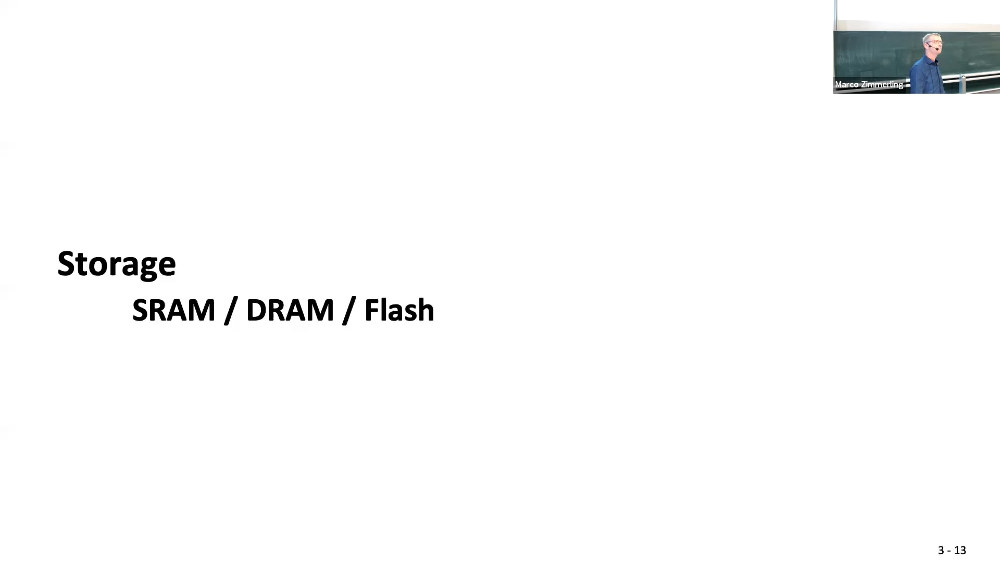
<!-- - `0:16:37`: i will go into war i will try to try to go into quite some detail how these things work but the important for you is to understand the basic principles. -->
<!-- - `0:16:48`: as usual. -->
<!-- - `0:16:50`: okay. -->
- 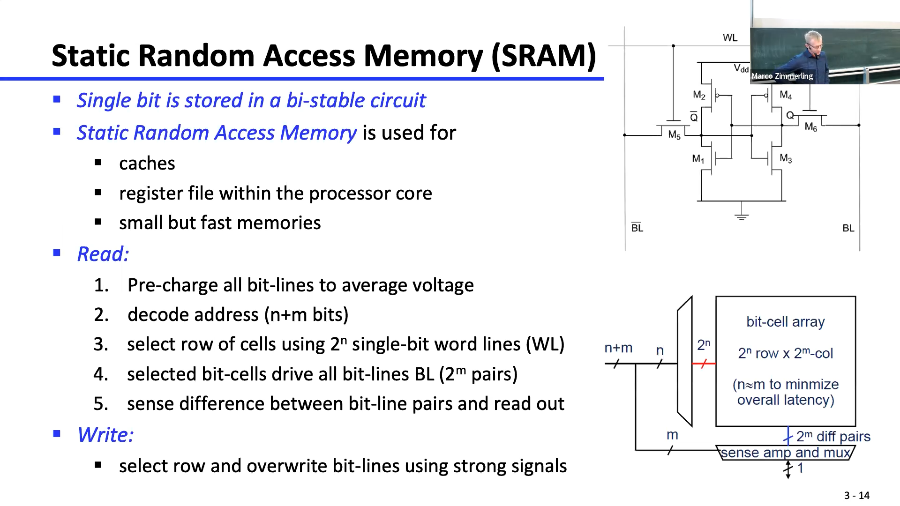
- `0:16:53`: sram stands for static random access memory and **static means that as long as the memory is couldn't connected or has a power supplier the bits of content that are stored in the memory are retained**.
<!-- - `0:17:09`: that is why it's called static. -->
<!-- - `0:17:12`: and here on the on the right side on this. -->
<!-- - `0:17:17`: diagram you can see how one of these memory cells is actually implemented so that still hits the circuit. -->
- `0:17:27`: **let's have a brief look at this at the circuit** so we see that in order to store one bits we need one two three four five **six transistors to store a single bit** so.
<!-- - `0:17:41`: that's so quite a lot of area and components are we. -->
<!-- - `0:17:45`: and. -->
- `0:17:47`: **concretely bits or the actual content are stored using these**.
- `0:17:54`: **four transistor m one t m four**.
<!-- - `0:17:58`: and. -->
- `0:18:00`: **m one and m two as well as m three and m four are inverters and these are two cross coupled inverters essentialy** so what i just said we want to understand the basic principles or so this is the assembly for an inverter and there's a second inverter.
<!-- - `0:18:24`: so this is the one represented by one and twin and the law won this. -->
<!-- - `0:18:32`: and three and four and these are crossed cupboard or somewhere connected in this way on a logical. -->
- `0:18:41`: never i hope you can still see you on the video you should you should be able to see as well as what i write on the porn and i can endure these the circuit or this these **these two cross coupled inverters have two stable states so why can have a one here...**.
- `0:19:00`: inverted results in a zero here which is of course then also applied here and so this is one one stable state of this one of these talk rust-colored inverters which may represent the logical zero for example.
<!-- - `0:19:18`: and then there's a second stable state zero one one zero and this then represents the logical state one. -->
<!-- - `0:19:30`: okay so this system the basic principle of how how a single bit is stored using these these for transit sushi. -->
- 
- `0:19:42`: **then we have two other transistors here...** in haifa and six **and these are called access transistors**.
- `0:19:51`: and **these can be closed or opened by asserting or not asserting the wl the wordline** called birdland him.
# ==============0:20:00==============
- `0:20:01`: the wing **if we apply a higher voltage here so the line is asserted the two access transistors are closed and the current state of the distortion the logical one or zero is actually available on these two bitlines becomes available on the bitlines**.
<!-- - `0:20:21`: buidling and the inverted state. -->
- `0:20:25`: **so if the current bit stored is one we will have a one here on b l and the zero on b l bar**.
<!-- - `0:20:33`: inversion. -->
- `0:20:39`: **okay and two bit lines are not only used for reading out also for writing something into into the memory cell** so let's briefly i want to stay on either look into how how reading writing and so on work so **if nothing is**.
- `0:20:55`: **being done the memory is in an idle standby state which means essentially that this word line here is not asserted these two transistors are open and so these the state is essentially physically isolated from the bitline** so nothing can.
- `0:21:15`: **when you want to read out...** and.
- `0:21:18`: **what is being done is that these two bit lines are pre-charged**.
- `0:21:25`: **they are pre-charged to an intermediate voltage so if let's say zero corresponds to zero but says that just an example it could could be differentit** will be different **and let's say this is five volt** which is really a lot for though i know paula embedded system so **then the pre charging will lead to an intermediate value**.
- `0:21:45`: idiot value will **pretty much exactly in the middle of these two**.
- `0:21:50`: **with these two bit lines are pre-charged to this intermediate...** why should she **then the word line**.
- 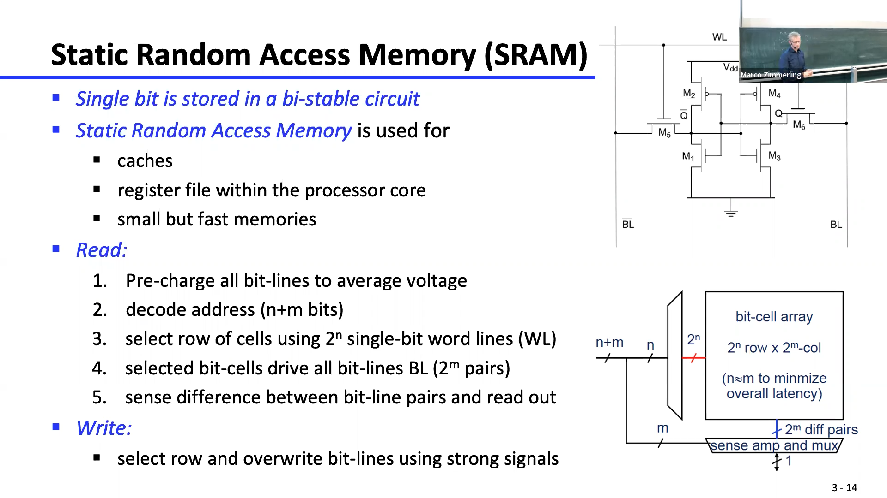
- `0:21:57`: **is asserted which means that these two access transistors here are**.
- 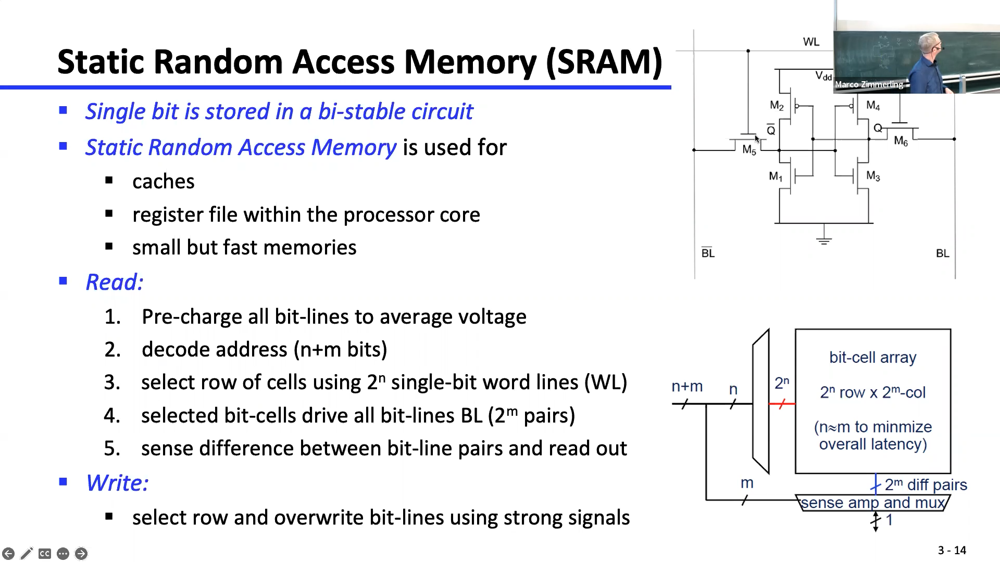
- `0:22:03`: **activated or closed** and **therefore the bitlines are connected to the internal state of the memory cell** and **this causes the bitlines to slightly change the voltage depending on what is stored here** so.
- `0:22:22`: one of them will **on one of the bitlines you will see a slight increase and on the other bitline a slight decrease depending on what is stored**.
- 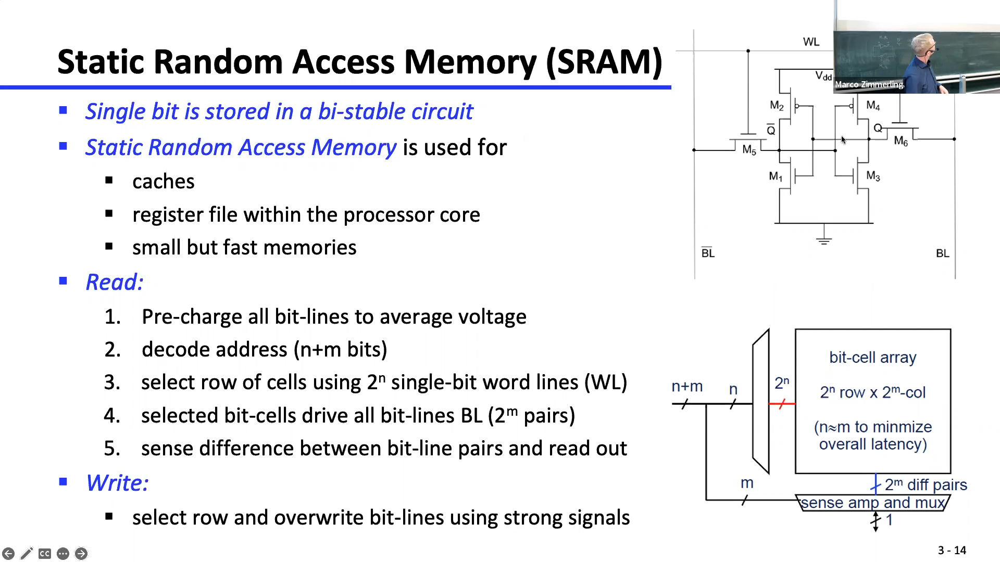
- `0:22:32`: and **then there's so**.
- `0:22:34`: something not shown here in detail but it's mentioned here **there are amplifiers that amplify this very slight change in voltage that you observe when you read out so this very slight difference that you see is measured and amplified by this**.
- 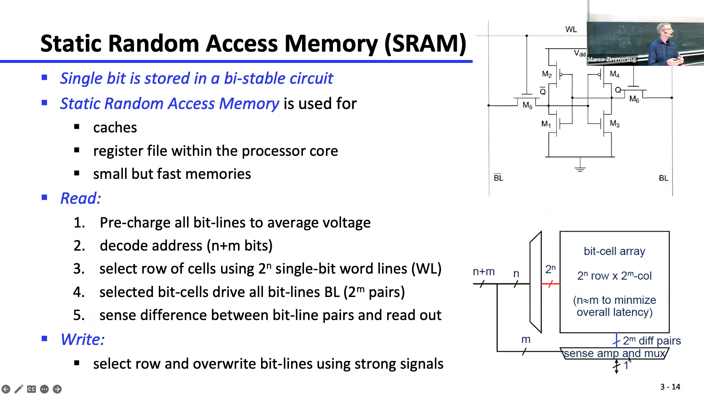
- `0:22:54`: **anappropriate sensing circuit**.
- `0:23:00`: so and then **in this way you can you can detect if there's a zero or one stored**.
- `0:23:07`: **if you want to write something something into this memory cell...**. **you apply the value that you want to run to brighton to these bid lines** so **let's say you want to write a zero would apply a one here and a zero** julio.
- `0:23:23`: **then you assert the wordline**.
- `0:23:27`: **which closes these two access transistors and the state is overwritten due to certain effects** and so on is actually over.
<!-- - `0:23:39`: okay. -->
<!-- - `0:23:41`: saw this as a singer singer this year and and usually what we have is that we have a larger array of these cells so we have good. -->
- `0:23:54`: isn't he a **matrix of these memory cells** and have you been to one **we want to read out a single bit we provide an address so we usually use thirty two bit addresses**.
<!-- - `0:24:13`: this is it sorry but zero and that thirty one of this address. -->
- 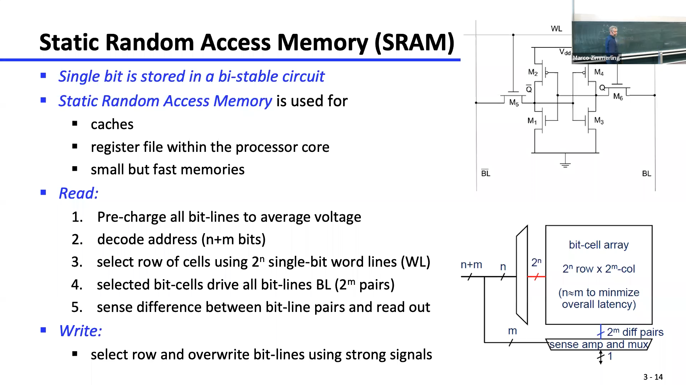
- `0:24:18`: and we provide this this or this address we preach a pre-charged year the bid lines saw so **here are all the bit lines they are not actually shown here so they are pre-charged** and then **due to this the circuit here we actually select based on some part of this address**.
- 
- 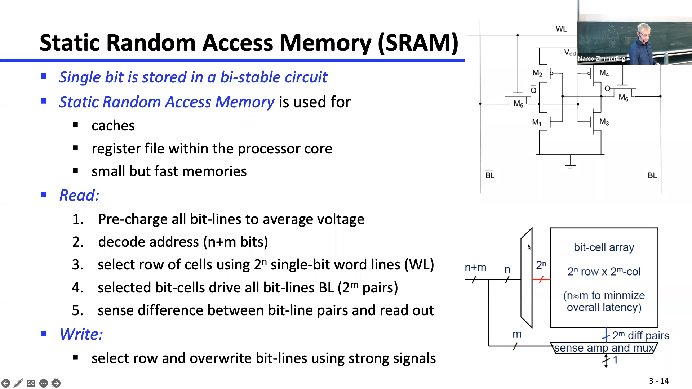
- `0:24:41`: let's say this is n and this is m.
- `0:24:44`: **could be sixteen bits for m to indicate the row in the matrix and m could be used to indicate the column**.
- 
- `0:24:54`: **okay and then we select the appropriate row**.
- `0:24:58`: **which means that we assert that the word len**.
# ==============0:25:00==============
- `0:25:02`: **across all these rows, across the entire row** and **there could one thousand bits stored in a single row** and then.
<!-- - `0:25:13`: we know. -->
- `0:25:16`: **then look at the other part of the address called m to select**.
<!-- - `0:25:22`: which. -->
- `0:25:25`: **which single, so we have the entire row**.
- `0:25:29`: **it's connected to the word len this could be one to one thousand**.
- `0:25:35`: **and then maybe we are only interested in eight bits out of these because we want to read out one byte**.
- `0:25:45`: **and where we find these**.
- `0:25:48`: **eight bits this one byte is encoded in the second part of the address**.
<!-- - `0:25:55`: okay so don't. -->
<!-- - `0:25:58`: i hope i didn't over complicate things so am i. -->
- 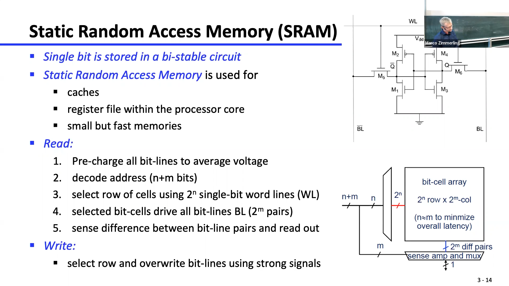
- `0:26:02`: just to summarize so what are the **advantages and disadvantages of of this sram** saw an exorcism **very fast** and it is **extremely low-power** but the **disadvantages** as i already mentioned the beginning is that it **requires quite some silicon area and many many components so we need six transistors to store a single bit** it.
- `0:26:22`: single but the **optimizations with fewer but cars like the typical one**.
- `0:26:28`: so it is it is mainly used as mentioned here on the slide for **smaller memories that really need a very fast access** very fast excess time so if you'll have the **register or a cache very close to the processor** you will use an s room.
<!-- - `0:26:46`: and yeah he will look at the example later. -->
<!-- - `0:26:53`: okay the second type of random access memory of the beloved st room the. -->
- 
<!-- - `0:27:01`: watch. -->
<!-- - `0:27:03`: roshan in your eyes. -->
<!-- - `0:27:06`: it. -->
<!-- - `0:27:08`: is it around store again. -->
<!-- - `0:27:13`: it could or can i sand. -->
<!-- - `0:27:17`: annie i'm not exactly sure if the real implementations would also allow for one thousand but it makes a lot of sense for efficiency reasons to go by multiples of was. -->
<!-- - `0:27:28`: exponents of two ways. -->
- `0:27:34`: okay so the **the basic operating how you operate is not that different from the sram** but **what is different is how bits are stored**.
- `0:27:46`: **in dram** and as you can see here in this in this diagram we actually **only need a single transistor**.
- `0:27:54`: and **a very tiny capacitor to store**.
- `0:28:00`: **a single bit in dram**.
- `0:28:04`: and it's yeah i mean may not be so surprising to use so one can say for example so if if the **if this capacitor is charged this represents logical one and if the capacitor is discharged this represents logic zero**.
<!-- - `0:28:31`: yeah so if. -->
- `0:28:34`: **if the memory cell is in standby mode...** this this row enable the last word line before is not asserted which means that there's no or the transistor is actually open and this capacitors essentially physically isolated from the buidling so that steady like the normal standby standby operation so **if you want to read**.
- `0:28:54`: **out...** your **assert the row enable and you pre-charge the bit line** as before.
- `0:29:03`: to such an **mid range voltage here** touch you.
- 
- `0:29:07`: and then **depending on whether the capacitor was charged or discharged a one was stored or zero you will see a change in the voltage at the bit line** so **if the capacitor was charged a one was stored you will see as a very slight increase because that's a very small capacitor** the president's him if a zero was stored you it will see a various slate.
- `0:29:26`: increase in the voltage year and **if zero was start you will actually see a very slight decrease**.
<!-- - `0:29:33`: i. -->
- `0:29:35`: and **again we need such an amplification circuit to measure these or detect these very small increases or decreases in voltage**.
- 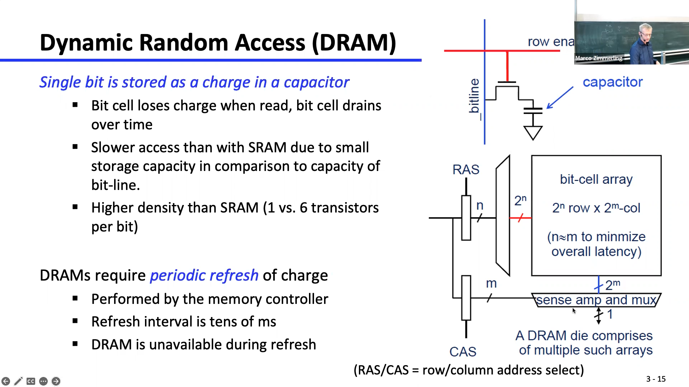
- `0:29:47`: so if you're if you're listened carefully i mentioned that so **if you will read out, you connect the capacitor, this one is closed the compesitor is connected to the bit line** **and current flows you actually discharge the capacitor when you read out**.
# ==============0:30:00==============
- `0:30:03`: which essentially means so **if a one was stored you erase** right though so that's pretty bad and even though even when **even in standby mode so when this transistor his is open and the capacitors isolated we have leakage**.
- `0:30:19`: so and **therefore we need to periodically refresh the contents of the memory so we have to restore the voltage levels in these storage cells**.
- `0:30:33`: and as it can read years or it's just i think there's a **standard that says it should be around every sixty four milli seconds** or **so every sixty four milliseconds what is in principle done is that you read out the content and you write again what you wrote out** eventually you **basically rewrite the memory**.
- `0:30:53`: **this is what we mean with a periodic refresh** so we read out see if it was a one or zero and then right again.
- `0:31:03`: **in order to restore the charging levers and retain the memory**.
<!-- - `0:31:10`: oh yeah we would come to this. -->
<!-- - `0:31:15`: all of this. -->
<!-- - `0:31:17`: nature. -->
- `0:31:22`: okay in terms of in terms of advantages and disadvantages though i mean one **advantage** might be now pretty obvious as it **requires fewer components so one transistor instead of six and very tiny capacitor** so that's that's obviously.
- `0:31:39`: the deniers saw it's **it allows for a higher higher density** read and this is.
- `0:31:48`: oh this is great **but it also has as the slower access times usually and less predictable excess time**. **why is this:...** saw it is **because when the dram is being refreshed we cannot read out the dram**.
- `0:32:08`: the demon **and if now in my embedded sytem i want to excess the memory i might have to wait until i actually can read out the memory so i have unpredictable excess times which i mean if you talk about orders milli seconds and we want to control physical systems that operate on microseconds so highly critical embedded systems**.
- `0:32:28`: **it's not a good idea to use a dram**.
<!-- - `0:32:32`: at least the programmers should be aware of this and yet always calculate or or assume the worst-case that you have to wait exactly sixty four milliseconds until you can actually start with access to one. -->
<!-- - `0:32:46`: okay so they are our frozen pros and cons between these two. -->
- `0:32:54`: so yeah and it's just very briefly **sum a little bit out** also we talked about a single single dram so that allows us to sourcing a pit then all we have again this this memory array here that we already saw in the in the essien.
- 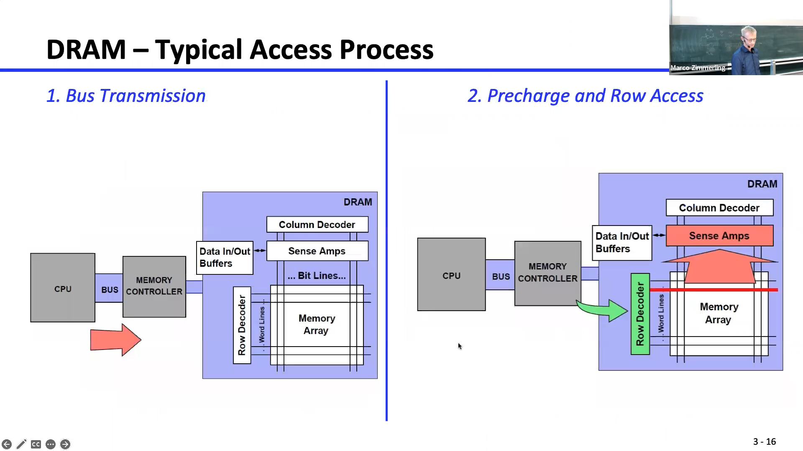
<!-- - `0:33:09`: so we have the cpu and the cpu provides the the address. -->
<!-- - `0:33:16`: for which you want to read or write something and also the cpu should inform if we want to write or read something out of course then the memory controller puts this onto the bus and appropriate sir crunchie makes sure that we do this one year is the appropriate word line that is connected to. -->
<!-- - `0:33:35`: the two a whole array whole row of memory cells is asserted. -->
<!-- - `0:33:44`: this means that the. -->
- `0:33:47`: that **we see changes in the bitlines** the **voltage slightly to increases and decreases which is a sense of it being detected by this this sense amplifiers** here.
- 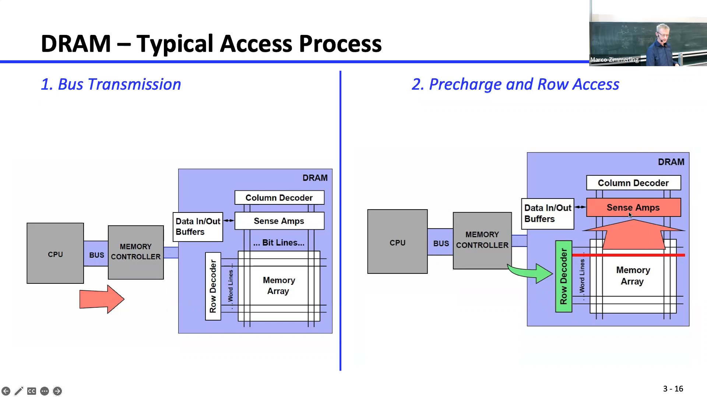
- `0:33:59`: and on the next slide we see ya so **now we have actually read out all these are all is for example one thousand twenty four bits**.
- 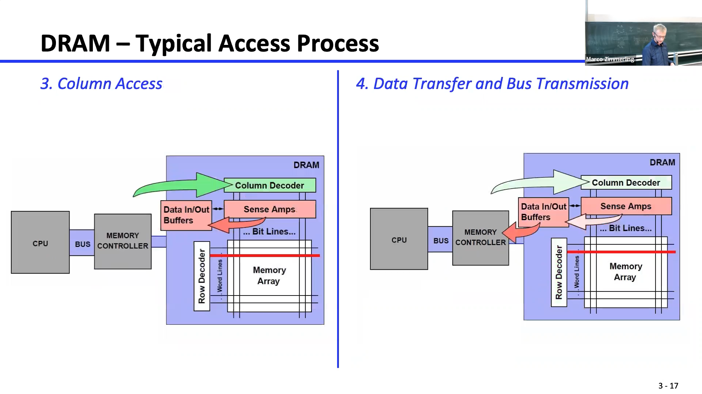
- `0:34:12`: **and there's now a column decoder that actually says which ones we are interested in based on the address we have** we have provided.
- 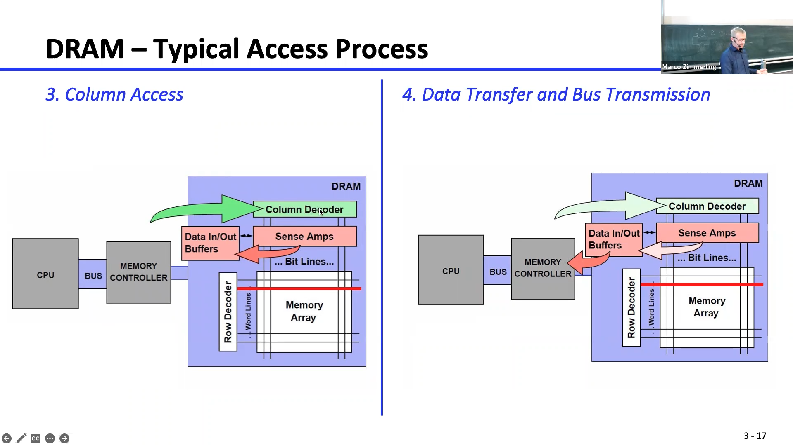
- `0:34:23`: and what is happening now so often **once**.
- `0:34:28`: **these bits let's say these eight bits this one we are interested in**.
- 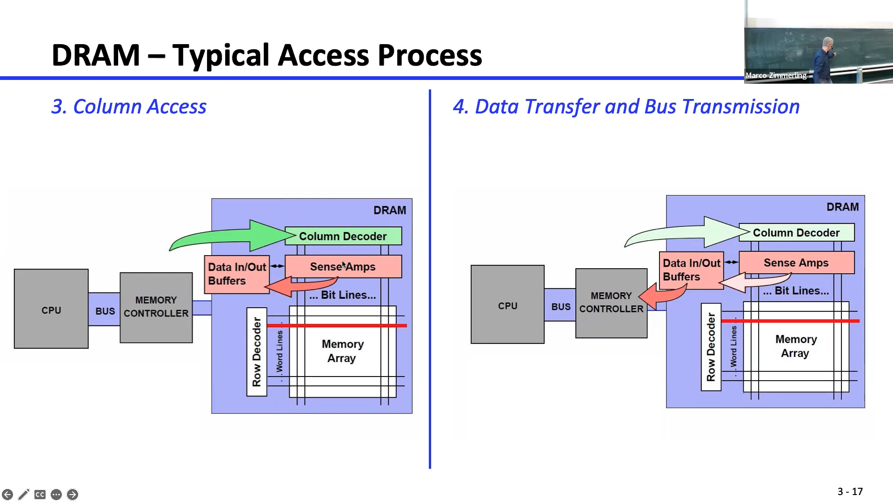
- `0:34:33`: it **has been put into the data buffer has been read out what is actually happening is that** now current flows back from the output of the sense amplifiers sorry.
- `0:34:47`: **the current flows back down and reinforces the memory** source and this is like the high level so this is like the **refreshing also that that is happening**.
# ==============0:35:00==============
- 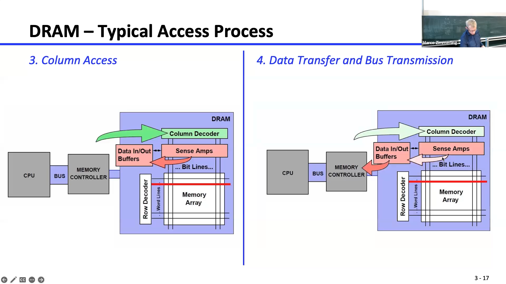
- 
<!-- - `0:35:03`: okay let me briefly check didn't. -->
<!-- - `0:35:08`: don't forget hockey. -->
<!-- - `0:35:10`: that looks pretty good. -->
<!-- - `0:35:15`: okay so. -->
- `0:35:18`: we looked at sram and the anderen and **why is dram called dynamic ram because we have this periodic refresh rate** so when the memory is disconnected from power we lose memory and if we just wait for some time for and let's say one hundred or two hundred mini-site.
<!-- - `0:35:37`: because we also lose or start to lose content so we see if it flips so we have to dynamically refresh. -->
<!-- - `0:35:47`: okay but only having voluntary memories of valentine's than me and they lose the contents if we do. -->
<!-- - `0:35:55`: don't have power would be a really bad idea in an embedded system so all if he only had one time memory for example the entire program that we have programmed onto the embedded system would be lost and saw and we need to again communicate and signs on it. -->
<!-- - `0:36:14`: clear i guess to all of us this this would be infeasible and therefore we need some and it is very handy and required to have a non volatile storage and in embedded systems nowadays this is usually a flash memory and you also flash memory in in your. -->
- `0:36:35`: in your laptops and victim as as the one hundred a certain type of flash memory that swear to let them briefly look at how our flash memory works or or what is the basic principle so **on very high level one can say that it's actually a normal transistor**.
- `0:36:54`: if you look okay i can actually look here the last point of wanted so we have source and drain and here we have to you have the game which is quality control gate right and **if we put a high voltage here this channel here is closed and electrons can flow** and it's it's closed and in addition to the.
- `0:37:14`: to the control gate or lectin on the gates that we will ever have what is called **floating gate it's like a a second gate that is physically isolated from the rest using some oxide based material**.
- `0:37:31`: so what does it mean it means so **given that this floating gate is physically isolated once we manage to put electrons here**.
- `0:37:42`: **these electrons are essentially trapped**.
- `0:37:46`: **until we apply another electric field from external and somehow manage to get these electrons out of the floating gate** so we can we can trap or store or program it's called program or writing something into this this floater.
<!-- - `0:38:05`: engaged and unless we apply as something we do something actively these electrons will stay here and this is what what is exploited tool to store or to enforce a certain state. -->
<!-- - `0:38:20`: and the. -->
- `0:38:22`: if there are no electrons here so it is erased so okay again so **this is like the different a diagram here** so this is the source here we have to drain **this is the control gate** and this is **in the middle here we have the floating gate**.
- 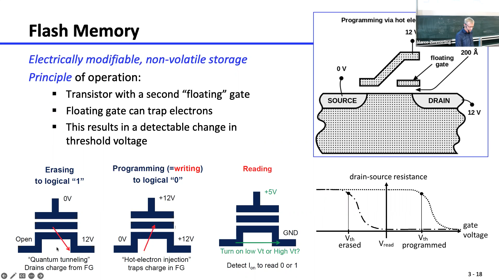
- 
- `0:38:39`: and **if there are no electrons on on the floating career gates it is erased and this is corresponds to a logical one**.
- `0:38:47`: and you were **using a process called hot electron injection one can trap or program electrons into this floating gate**.
- `0:38:58`: **which then represents the logical stage zero**.
<!-- - `0:39:03`: i hope on a principle level this is this is sort of clear and this is also the only thing that is that i'm asking you tools of trying to understand like the basic principle okay so we can program by erasing and then decided to zero or we can put electrons here and writing it are using. -->
<!-- - `0:39:22`: im protocols hot electron injection tool. -->
- `0:39:25`: represent a logical one and **if we want to read out**.
- `0:39:29`: **again what do we do we have some kind of mid range voltage** saw and.
- 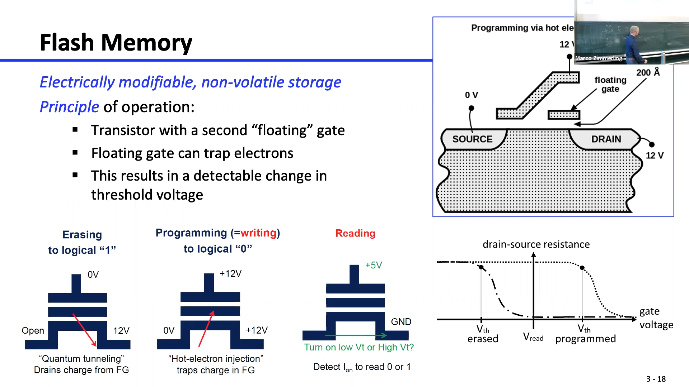
<!-- - `0:39:37`: i'm let's say we we apply okay here he an example would be the twelfth world and then you're an example it's okay they apply five was. -->
- 
<!-- - `0:39:48`: not exactly in the middle but somewhere in the middle. -->
<!-- - `0:39:53`: okay so. -->
<!-- - `0:39:55`: if. -->
- `0:39:57`: if we have electrons here we require a higher threshold voltage **so once we have electrons here a higher threshold voltage as it is required to actually close the channel so it is conducting and the transistor is closed to if we now apply such a midrange voltage**.
- close means actually open the channel for Zimmerling
- conducting bedeutet leiten
# ==============0:40:00==============
<!-- - `0:40:17`: that lies between the the normal threshold voltage. -->
<!-- - `0:40:23`: that is required to close this channel when there are no electrons trapped. -->
- `0:40:32`: and okay it it lies **it is higher than the normal threshold voltage but lower than the treshold voltage that is required when there are actually electrons trapped here**.
- 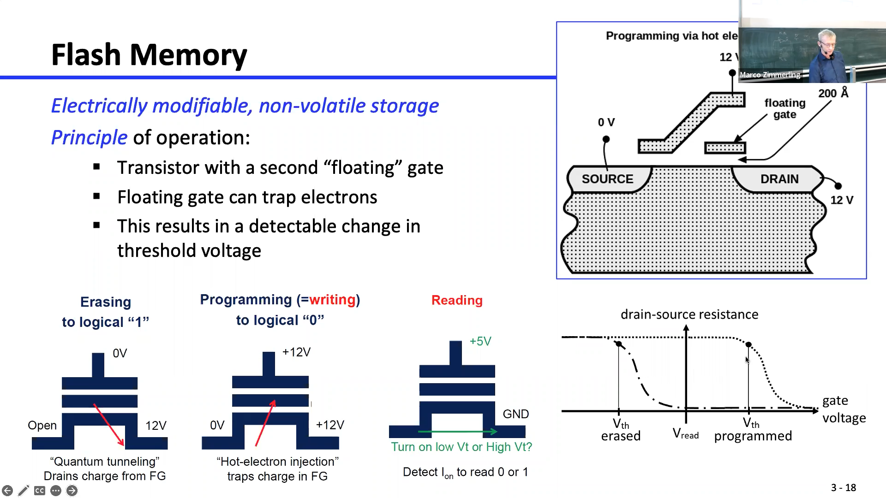
- `0:40:43`: okay so if we know atlantic this voltage what can us exactly **ask this question so is it now conducting or not**.
- `0:40:52`: sawyer **i apply a voltage that lies in the middle between these two threshold voltages and if i see that the channel is actually closed i know**.
- `0:41:05`: **that a logical one was stored**.
- `0:41:11`: and **if it's not conducting so the transistor is not closed i know that illogical zero was programmed in so there are electrons traped here**.
- **sobald floating gate beschrieben ist, ist es mit einer mittleren Spannung nicht mehr möglich Stromfluss zu haben, ein beschriebenes floating gate erhöht die Spannung, die an der Basis notwendig ist**
- 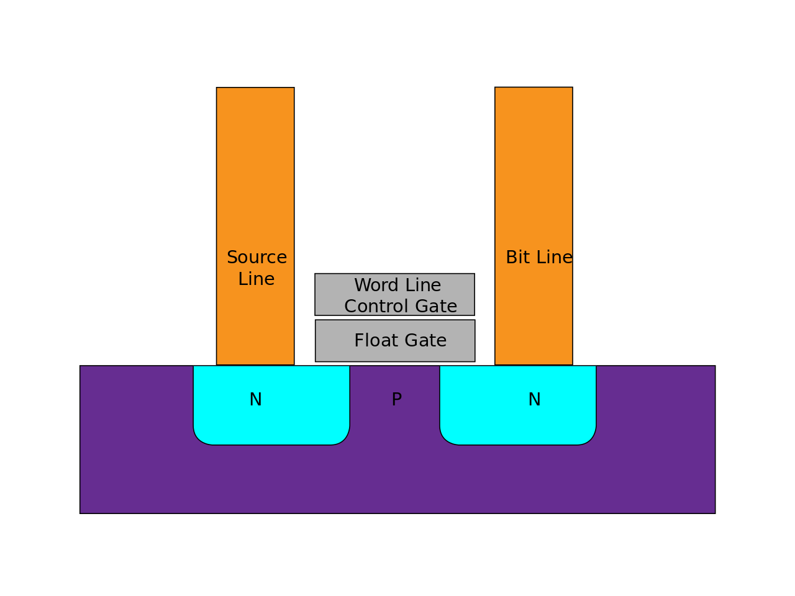
<!-- - `0:41:21`: okay and i hope i managed to explain this. -->
<!-- - `0:41:26`: to you. -->
<!-- - `0:41:37`: okay and there are tours all will be looked at okay this is how you can store as a single a bit. -->
- `0:41:44`: using using flesh and **there are two basic organizations on how to combine and organize** and and.
- `0:41:53`: **these cells**.
- `0:41:56`: **single bits** and there are called more organization or an end and and organization **nor is not not that much difference over to the dram that we looked at before** so we have we **have that every transistor** here so this this floating gate transistors are.
- `0:42:17`: have a connection saw **one end of the transistor like the source is connected to ground and the other end is connected to the bitline, to a single bitline** blessing of the driveway.
<!-- - `0:42:28`: and the. -->
- `0:42:32`: **that now acts like a nor gate because when one of the wordlines that is connected to the cells control gate is brought higher than the corresponding storage transistor acts to pull the output bitlane low**. **so by activating a single bitline**.
<!-- - `0:42:50`: ng for example this one here i can. -->
- `0:42:54`: **i can look at the bitline and see if**.
- `0:42:58`: **zero or one was stored in here** so **this is similar to what is going on in a nor gate** a in an arcade that's why it's called the organization and **!!! in the nand organization we essentially have that these cells are connected in a series**.
- `0:43:18`: acted in a zero in a series **we have a serious of these**.
- `0:43:23`: **bitlines?**
- `0:43:26`: **this now acts very similar to an nand gate**.
- `0:43:31`: **so the bitline is pulled low only when all of them are activated so if all of them are connected**.
- `0:43:51`: okay i wanted to mention he has say something about the about the **pros and cons** so that you can see here that this is a pasta.
- `0:44:01`: allows for **fast access** and western **nand is usually used for mass storage because it requires a smaller area**. **one of the reasons is that you don't need these connections to ground for for every single transistor** service since one of the reasons why we have a smaller cell size and.
- `0:44:21`: and therefore a higher memory density essentially this is sir **this is the reason why in your laptops on the ssd harddrive this is come some variant of the**.
- 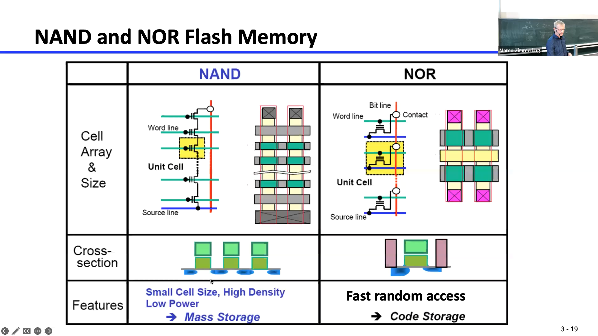
- `0:44:33`: **nand organization** and **nor** as as written years allows for faster access and therefore is used euston actually quite many and embedded systems and **it so fast that it allows you to execute code from the flash memory**.
<!-- - `0:44:55`: okay. -->
# ==============0:45:00==============
- `0:45:00`: this is a slightly more detailed look at how reading out from from an end to senseless works.
<!-- - `0:45:09`: your remember this this plot here like dune mid range voltage. -->
- `0:45:17`: and **in order to read out**.
- `0:45:21`: **the entire row here...**.
- 
- `0:45:25`: again this role **we also have to control all the other rows because they are all connected in series so what has been done is that that a very high voltage is applied this the v read** very high voltage **is applied to all world lines or rows**.
- 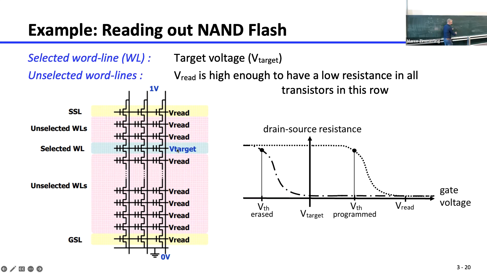
- 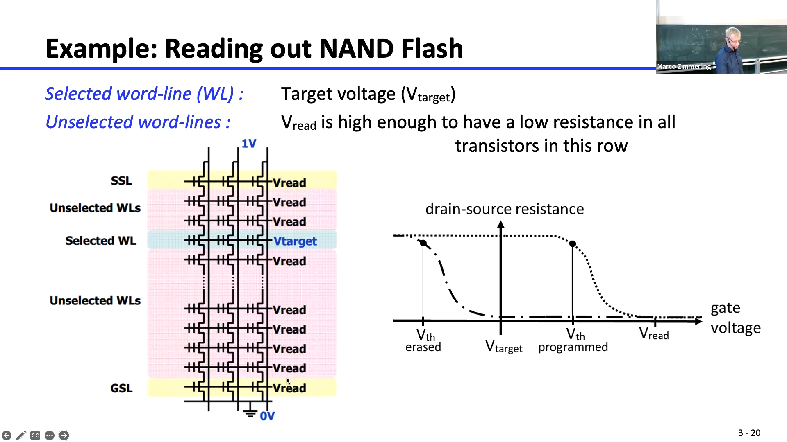
- `0:45:44`: but **we're actually not interested in we only want to read out the blue on but still we have to apply a very high voltage here that is larger than the threshold voltage**.
- `0:45:55`: and **then to to read out this entire row we apply a mid-range voltage the v target to this row and then we again see if it's conducting or not** so.
<!-- - `0:46:08`: if it is conducting we know that a logical zuber. -->
- `0:46:13`: **if it is conducting we know that it was erased so illogical one was stored** and **if we see that is not conducting we know that logical zero was stored because there are electrons on the floating gate**.
<!-- - `0:46:28`: or castle. -->
<!-- - `0:46:30`: just. -->
<!-- - `0:46:32`: okex was so much about. -->
<!-- - `0:46:34`: autozone sram dram and flesh. -->
<!-- - `0:46:41`: okay so we will now look at how how we can work how we can operate how we can access. -->
<!-- - `0:46:49`: these different kinds of memories on an embedded chip. -->
<!-- - `0:46:53`: and as i mentioned though we will very frequently use this this msp for thirty towards a very widely used unknowns or it's a it's really representative of many low-power embedded architectures. -->
<!-- - `0:47:05`: so this is not just one example so if you go out to industry you will very likely see this architectural or very similar architecture. -->
<!-- - `0:47:14`: so as we have seen in the beginning this this processor has a. -->
<!-- - `0:47:21`: yeah it has flash memory as we just discussed two hundred and fifty six kilobytes of flash memory it has estrella naughty around. -->
<!-- - `0:47:31`: yes lazaro. -->
<!-- - `0:47:33`: and it has a little bit of iran. -->
- `0:47:36`: and how can we access these are these different memories and and and to understand this or to understand the basic principles we need to understand so what is **what is the address space so what is the the width off an address** and this i already told.
<!-- - `0:47:56`: you. -->
- 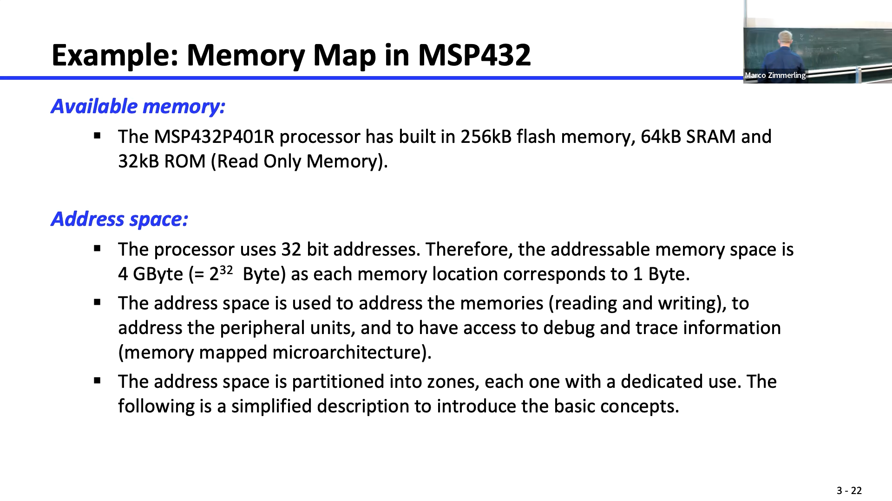
<!-- - `0:48:00`: that's a good time to raise. -->
<!-- - `0:48:28`: okay so **one address is thirty two bit** and. -->
<!-- - `0:48:32`: **in this architecture each address refers to a single byte**. -->
<!-- - `0:48:49`: you're so young and wanting to do this very simple calculation so he has a thirty two bit addresses which means that we can heaven address of the memory space of in theory six gigabytes which is true to the policy tore down. -->
- 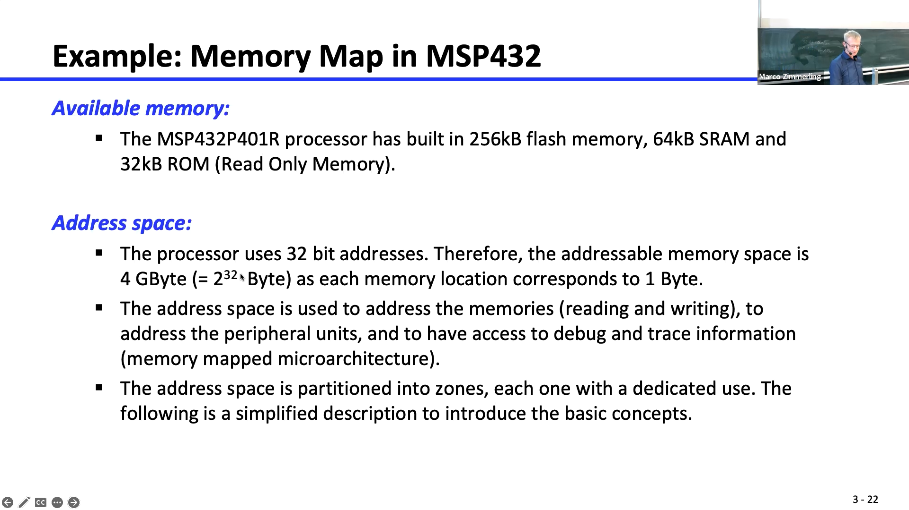
<!-- - `0:49:07`: because each address is thirty two bits and one address corresponds to exactly. -->
<!-- - `0:49:12`: one fight. -->
- `0:49:16`: and this doesn't mean that or as you can see it it definitely **doesn't mean that we have four gigabytes on such a low power embedded system due to cost and so on we want to keep this as small as possible** and then why add this this address space **we cannot only access memory but as we will see when it's also used to excess**.
- `0:49:35`: **peripheral units, ports or other devices and hardware components**.
- `0:49:42`: **as well as debug and trace information that is emitted by the processor** processing.
- `0:49:48`: and yeah again **maybe this high level picture will help...** solve we have and the cpu.
<!-- - `0:49:57`: and as we will see memory as well as reference. -->
# ==============0:50:00==============
<!-- - `0:50:04`: okay. -->
<!-- - `0:50:06`: man. -->
<!-- - `0:50:09`: rendering in the cpu will provide the address. -->
<!-- - `0:50:17`: one address as a whiff of thirty two bits. -->
<!-- - `0:50:20`: and we can write data into the memory. -->
<!-- - `0:50:27`: the memory location that is referred to by the address and we can read out the data. -->
- 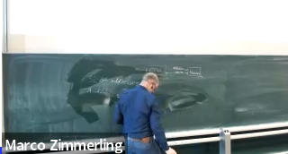
<!-- - `0:50:34`: from this little person. -->
<!-- - `0:50:36`: oh. -->
<!-- - `0:50:49`: okay. -->
<!-- - `0:50:51`: saw in this one msp folded into architecture. -->
- `0:50:56`: we have a memory map and the **memory map essentially is specifies**.
- `0:51:03`: **a partitioning of the address space**.
- 
- `0:51:07`: **into different zones** so there are addresses here on the bundle that are used tool or refer to memory where code is stored.
<!-- - `0:51:20`: then there are a range of addresses that are used to refer to to sram. -->
<!-- - `0:51:26`: peripherals. -->
<!-- - `0:51:29`: and some of them are actually unused and yet we have the debug and trace peripherals. -->
<!-- - `0:51:34`: so we end this have this memory method that essentially organize organizes the available address space. -->
<!-- - `0:51:43`: here using the example of the msp for thirty two. -->
<!-- - `0:51:48`: and what you can see here on on the left side are these are these addresses and the and. -->
<!-- - `0:51:56`: these these entered his locker a little bit dumb. -->
<!-- - `0:52:00`: special in in the sense that they are written in hex x fallen so. -->
<!-- - `0:52:07`: just to make sure we all on the same page saw the basic idea is to tour instead of writing a lot of zeros and ones so thirty two zeros and ones the people came up with the idea that they they can. -->
<!-- - `0:52:22`: so we have this. -->
<!-- - `0:52:24`: have an address. -->
- `0:52:30`: thirty two zeros and ones instead of writing such long numbers they came up with the idea of of **they are splitting this up into portions**.
- `0:52:43`: portions **each of them being four bit wide**.
- `0:52:49`: and then **encoding four**.
- `0:52:53`: **bit we can represent sixteen different numbers** from zero.
<!-- - `0:53:00`: two. -->
<!-- - `0:53:21`: oh. -->
- `0:53:25`: so **from zero to fifteen** and here it is it's this is ten should pretend like one yeah this ten saw this reversal in decimal the decimal format as zero misses ten.
<!-- - `0:53:42`: and this is fifteen world and if we would like to have saw it it served basically the task was to came up with a symbol for four numbers that are larger than the nine saw in in hex format this then becomes an air of capital spawning an f. -->
<!-- - `0:54:02`: fifteen is denoted using nf. -->
<!-- - `0:54:08`: and those in the middle are so eleven be sad. -->
<!-- - `0:54:12`: and i guess when many of you are already familiar with this though this notation. -->
<!-- - `0:54:31`: saw one. -->
<!-- - `0:54:33`: question that is typically asked is how how much how larger that is this address is how much code can be address using this this this range of addresses here so for code with you the starting address is zero zero zero zero. -->
<!-- - `0:54:53`: zero zero zero zero and the largest address of this zone or block here is one f f f and f f f s. -->
# ==============0:55:00==============
<!-- - `0:55:05`: so if you. -->
<!-- - `0:55:08`: look at the the binary representation of this address here that has an indicated appear on the slide you can. -->
- `0:55:16`: which would **you basically have to do to compute the**.
- `0:55:20`: **the amount of addressable memory here...**.
<!-- - `0:55:24`: is too. -->
<!-- - `0:55:26`: two lake near the end where like the upper entrance. -->
<!-- - `0:55:35`: minus the. -->
- `0:55:38`: laura like the address the drift refers to the lord and i hope so this is what i mean with **upper addresss and lower address**.
- `0:55:51`: and then don't forget to **add plus one** so **if there was only a single address then we would end up with zero so that's why we have to do plus one** and **this gives us the the amount of**.
- `0:56:05`: **addressable memory essentially** there's a seer there's an example so if we look at at this code block and we essentially have to through the power of twenty nine different addresses within this range of addresses and this gives us a capacity of two to the power of twenty nine which is in other words five hundred.
- 
<!-- - `0:56:26`: twelve megabyte. -->
<!-- - `0:56:32`: pocket. -->
<!-- - `0:56:34`: as i already mentioned there are different purposes of each shown zollinger in this memory map. -->
<!-- - `0:56:43`: it's not only used to store and read old code or some memory content but also to exist for reference. -->
<!-- - `0:56:51`: and on this msp fourth of the tool you will have different periphery so one can look into the data sheets or these arm. -->
- `0:57:01`: **screenshots from from the data sheet...** and you can find so these are hundreds and hundreds of pages that come with every embedded architecture and if you ever are going to work practically with such a system you have to you have to dig into these are these datasheets to find out all the details and.
- `0:57:21`: what you can find out here for example is that there.
- `0:57:25`: i am your father and **within this peripheral block there are certain addressees address ranges that are reserved for a timer**.
- 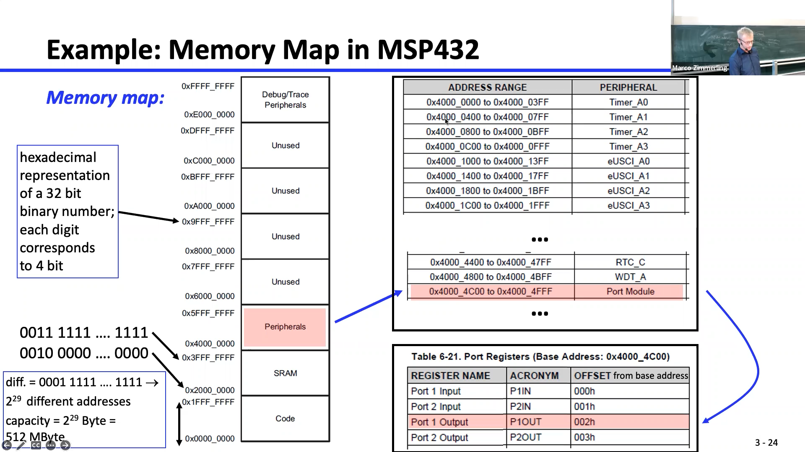
- 
<!-- - `0:57:36`: and as you can see there are at least four different timeless on this on this architecture. -->
- `0:57:42`: **here this is something this has to do with input output with serial bus** i guess we will look into this this later.
- 
- `0:57:51`: there's a real time clock **rtc real time clock**, **watchdog timer w d t** and **port module so what is a port module...** you may remember that looked last time we looked at this at this.
- 
- 
- 
- `0:58:04`: schematic of the msp for architecture and decided to have this chip and the chip as different pins or ports and might have **multiple pins organized into ports** so we have a port.
<!-- - `0:58:20`: which has several pins. -->
<!-- - `0:58:24`: let's draw here exactly a prince is a good number and this actually want us here having done so so here yes i have important module and. -->
- 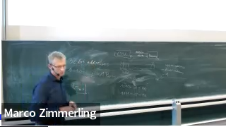
<!-- - `0:58:37`: yeah you have. -->
- `0:58:39`: again then a **base address for for this port module**.
- 
- `0:58:45`: and **if you would like to excess**.
- `0:58:53`: **a dedicated pin of a port you'll have to take the base address...** here four zero zero zero four cs zero zero **and add to this base address a given offset**.
- `0:59:08`: **and that gives you the address of**.
- `0:59:11`: **port one output zone**.
- 
- `0:59:15`: **of this dedicated board**.
<!-- - `0:59:22`: so this is here what is used on here atop. -->
- `0:59:27`: and yeah xx so this is what a what i mentioned **so this is port one**.
<!-- - `0:59:33`: and put one on our launchpad or this msp for thirty two which is. -->
- `0:59:40`: on the launchpad you see that **this port has 8 pins**.
<!-- - `0:59:46`: and pin zero is connected to an entity. -->
<!-- - `0:59:53`: so elegy is something that is very often used like the hello world of embedded system to actually see that face or examine the processor is doing something something it is a good idea to have like a blinking elegy and you can look at it and see okay this thing is actually still in storage so it is important to excess and program energies. -->
# ==============1:00:00==============
<!-- - `1:00:12`: okay. -->
- `1:00:15`: and to access this this ltd we have to take this base address as i already said and add to the space edges and an offset to get to the address that refers to the can **so we had this memory map and within this memory map using the same interface we can access codes portions in ram but also excess periphals**.
- 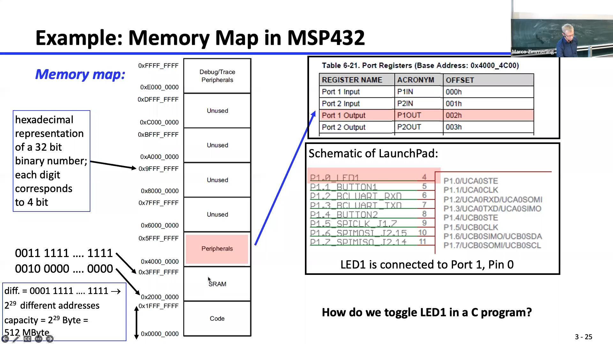
- `1:00:33`: **such as pins that are connected**.
<!-- - `1:00:38`: okay so how can me how does it look like in in a c program when we want to target a pin. -->
<!-- - `1:00:47`: for example to see that the device is still still working on this is just a very small pole portion of a c c program and you don't have to understand all the details but it's just to give you a flavour of how this how this concept in this sort of theory boils down if you ask. -->
- `1:01:07`: you'll have to program such a system in here **with these three three dots is indicated that you have to do a lot of setup code who configure the ports whether they used for input and output etc.** and.
- `1:01:21`: many many different aspects and some point you get to get to this line of courtier where we have to **declare**.
- `1:01:28`: and **a pointer**.
- `1:01:32`: **an eight bit or with a width of one byte** it am.
- `1:01:39`: **we declare this this pointer, its declared at volatile in order to tell the compiler not to optimize this variable away so the compiler might think okay this is something that is not really needed because since we are are trying to access peripherals and the compiler doesn't know at compile time when and how will we want to internact**.
- `1:01:59`: **with this peripheral we better tell the compiler not to optimize this variable away** okay so this is one to watch while italians.
- 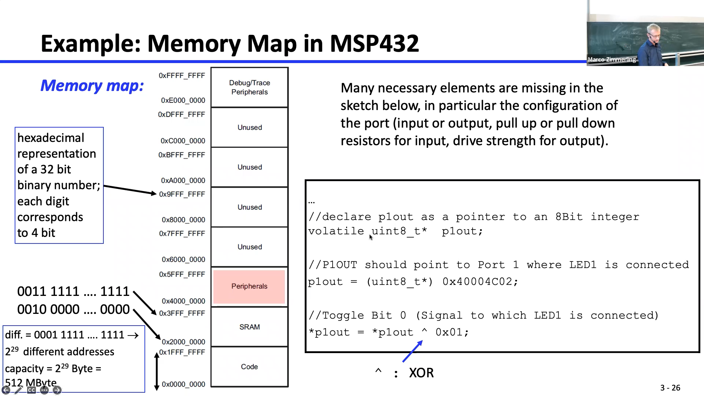
<!-- - `1:02:11`: under. -->
- 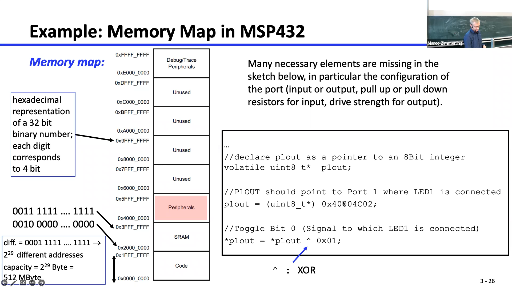
- `1:02:13`: **now we want to excess**.
- `1:02:17`: **the led**.
- `1:02:20`: and **this led is as we saw in the previous lead connected to port one** and in order to access this we have to take the base address four zero zero zero four c zero zero and add to this base address was the offset.
- 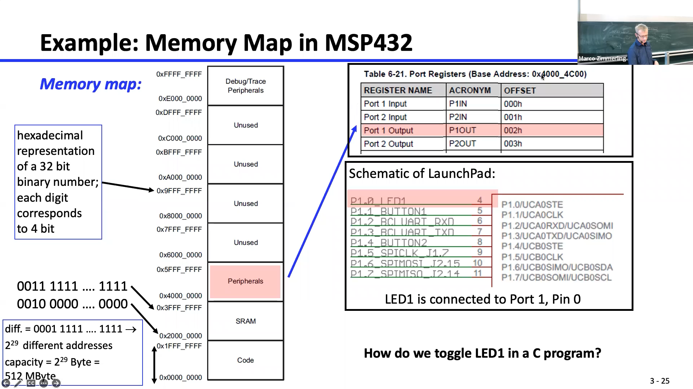
<!-- - `1:02:35`: and this is why b. -->
<!-- - `1:02:39`: this is the result of this calculation base address plus offset and this is the address this pointer should point on because this is the excess this is the address that ubuntu excess we want to work with this address that points toward to the entity on pod ones. -->
- `1:02:57`: and although **now the task is to toggle the pin**.
- 
<!-- - `1:03:03`: and exactly it saw the the. -->
- `1:03:09`: okay so this so if you **if we access this address what we get back or what we are actually working with is a byte** it **because every address refers to a byte as it's written here** so okay maybe this was simply the day or came maybe.
<!-- - `1:03:29`: okay so this this is a bad one. -->
- `1:03:35`: okay and **and as we saw here the the led is connected to the least significant bit** so let's say there's a zero and this seven then then this is a x exactly entity one.
- 
- `1:03:50`: okay so we had the pointer that the points essentially to the address so this is **the pointer**.
- `1:03:58`: **points to this address** and **when we read out the content that is stored at this address we get a byte** and **the state of the led is determined by the least significant bit zero**.
- 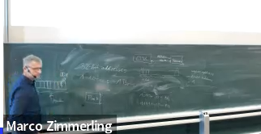
<!-- - `1:04:16`: okay so by doing this while writing this we essentially this this year essentially means that we are reading out the content the distort at this edwards so we have no abide and in order to to toggle the pin so it changed. -->
<!-- - `1:04:31`: the state of the pin what we do is we do an x or with one. -->
<!-- - `1:04:38`: how do i write the snow so if there was a zero here than i do and explore with with one. -->
<!-- - `1:04:46`: so if i were an x or yes. -->
- `1:04:52`: **this essentially means that i'm flipping the bit**.
# ==============1:05:00==============
- `1:05:02`: so **if there was a one that becomes a zero and if it was zero it becomes a one, this is what i'm doing with this xor**
<!-- - `1:05:15`: okay. -->
- 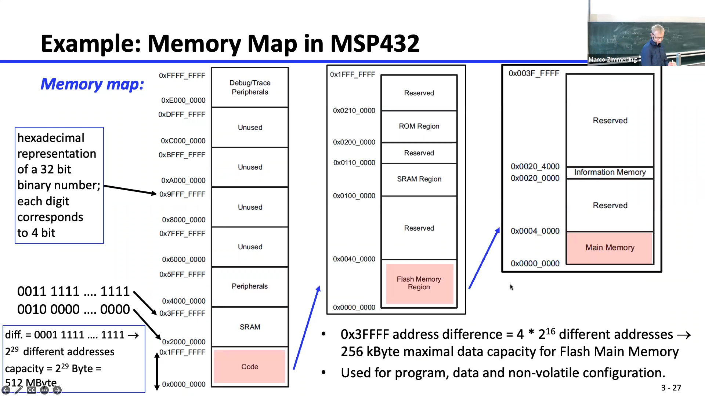
<!-- - `1:05:17`: i. -->
<!-- - `1:05:19`: now we go going back to the code region desert flesh flesh memory region here. -->
<!-- - `1:05:25`: and. -->
<!-- - `1:05:26`: and this again is pepper divided so it's like a hierarchy as you can see from a divided into. -->
<!-- - `1:05:34`: here and see that the do. -->
<!-- - `1:05:39`: very very low addresses i actually use to access the main marine. -->
- `1:05:44`: and you have to flip through all these pages in the data sheet to to find this out again we may i ask the questions or what is the **what is the addressable memory here in this main memory...** and here is again like the the calculation.
- 
- `1:06:02`: i cannot not dismiss **refers to the flesh main memory** they're expected to miss this one.
- 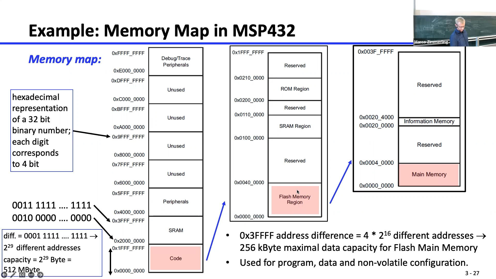
<!-- - `1:06:12`: right so. -->
<!-- - `1:06:15`: this is **hexadezimal format so zero zero zero is actually a sixteen bit value that is two to the power of sixteen times four** so this is the amount of interest and addressees that we have available here in this region each address refers to one by it this means we have four times to the power of sixteen twenty. -->
<!-- - `1:06:35`: hundred and fifty six kilobytes of maximum capacity of flash memory. -->
<!-- - `1:06:42`: this useful program data and whatever non-volatile of newish. -->
<!-- - `1:06:47`: again just **another example for you** one can so we we we had a look at the flash memory region we can look into the sram region and. -->
- 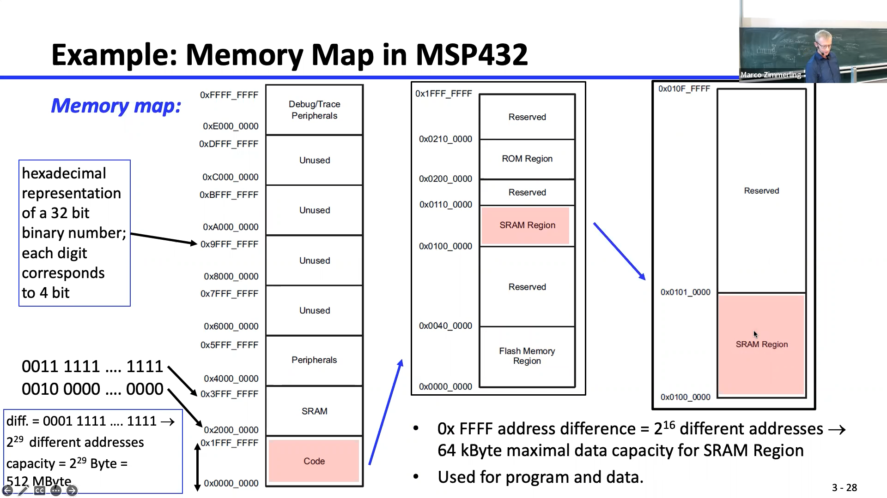
<!-- - `1:06:58`: again here one can ask the question what is the amount of addressable memory here and in this case it is sixty four kilobytes. -->
<!-- - `1:07:08`: so i can i invite you to look again at the science and and also check that this formula is sort of correct said take the **upper address minus lower address** and upon lands is lower plus one then you should get to these reasons. -->
- **Frage: was ist mit den Adressen, die auf der Linie liegen?**
- **difference 0xffff + 1 = 1_0000 = 16 ^ 4 = 2^(4^4)**
<!-- - `1:07:23`: ok sola so much about memory and how we can access these memories using address spaces and the and memory mapped to architecture on the msp. -->
- 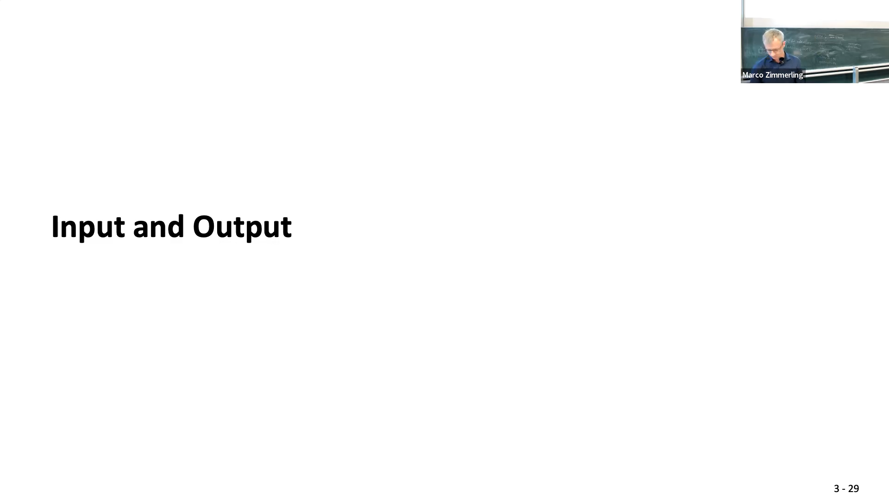
<!-- - `1:07:47`: okay input output very important though and better systems would be very boring if they couldn't interact with the environment so we need some way of communication for example some communication between different hopper hunter components for example the processor and sense of. -->
<!-- - `1:08:04`: sound. -->
<!-- - `1:08:06`: and. -->
<!-- - `1:08:08`: we will. -->
<!-- - `1:08:10`: look more closely into one. -->
<!-- - `1:08:14`: who have the saw and there are many many different. -->
<!-- - `1:08:19`: buses or or protocols and ice cred as for example is not mentioned here to interact with acoustic sensors for example ice gretzky usb sp are you are you may have heard of some of some of these but they are in the sense of getting quite complex. -->
- 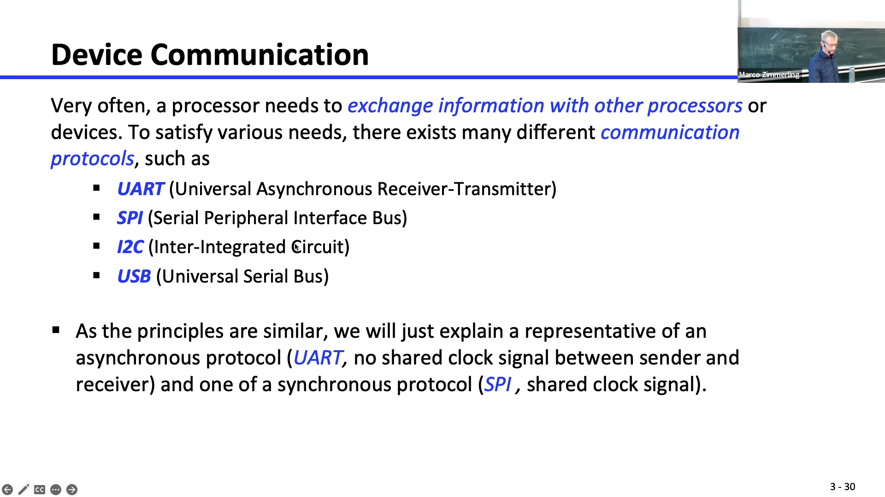
<!-- - `1:08:39`: and we will look at the who. -->
<!-- - `1:08:42`: let's say most simple ones that are nevertheless representative of the more complex once soul it is always a good idea to look at the more simple instances and these are also quite quite different in the sense that you are it is an asynchronous protocol and is a is a synchronous protocol and i will tell you what this what the sections. -->
<!-- - `1:09:04`: okay. -->
<!-- - `1:09:07`: so just thought who have your has has heard you aren't just. -->
<!-- - `1:09:11`: fuel. -->
<!-- - `1:09:13`: i haven't. -->
<!-- - `1:09:16`: okay so there was like half of the room and i guess it will be similar. -->
<!-- - `1:09:21`: online. -->
<!-- - `1:09:24`: so why should we care you should care because you aren't as ubiquitous saw it's everywhere in embedded systems also on the crazy fly for example we see that as a you aren't that connects these two processes so if one of them wants to talk to the other there is no other way than sending bits. -->
- 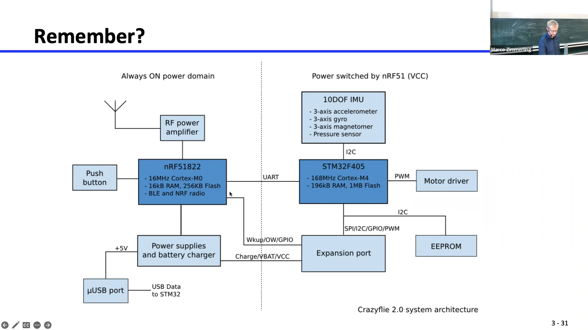
<!-- - `1:09:44`: over a warmed over you want and we will learn how this. -->
- 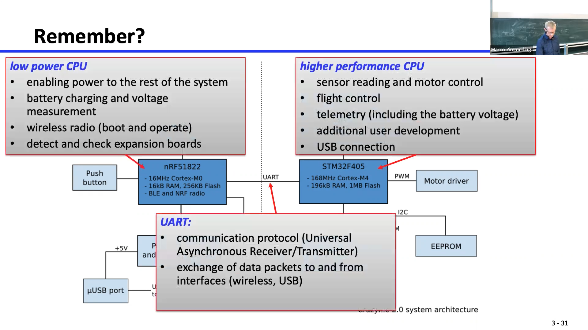
<!-- - `1:09:49`: this works. -->
<!-- - `1:09:51`: okay so. -->
<!-- - `1:09:53`: you are this is some. -->
<!-- - `1:09:56`: extremely simple it's on again equal time to rest. -->
# ==============1:10:00==============
- 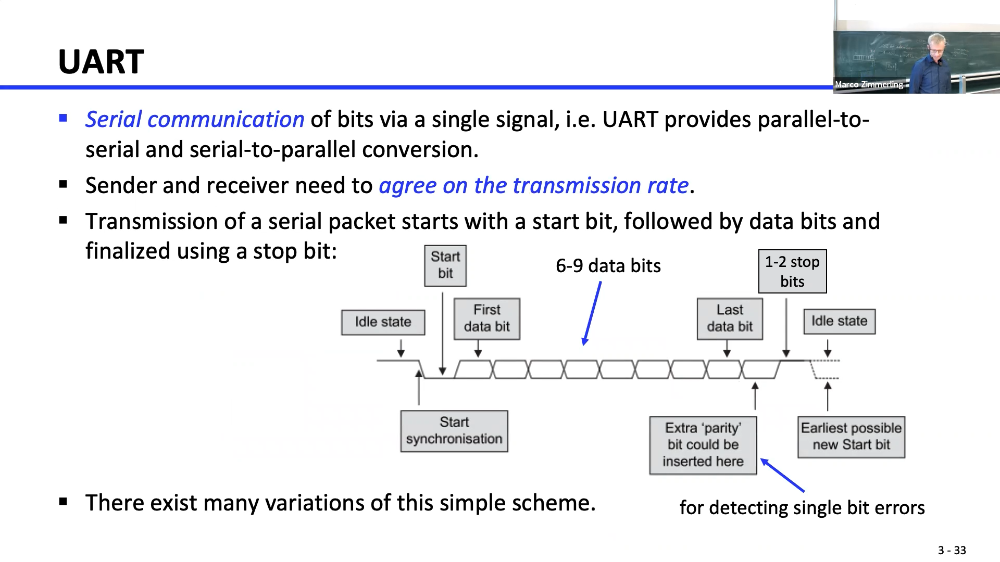
- `1:10:02`: it's because in this **very simply because it is just a single wire** and and their arm is let's say not much more requirement.
<!-- - `1:10:21`: so let's say we have. -->
<!-- - `1:10:24`: we have a sender. -->
<!-- - `1:10:27`: this could be one of the two processes on the crazy fly and we have a receiver. -->
<!-- - `1:10:33`: it's that's the annapolis processor. -->
<!-- - `1:10:36`: for example on the crazy plan and. -->
<!-- - `1:10:40`: want to exchange bits so there's really just a really just one wire requirement. -->
- `1:10:50`: and **there are in principle two ways to do uart** he wants and **on all these**.
- `1:10:57`: **processors you find integrated circuits so async implementations of the uart protocol**.
- `1:11:04`: but what you could also do and we actually doing in in our group for various reasons is **you can actually do this in software...** so you can you can have an integrated circuit to you but instead of having it integrated you can also have software or just **software**.
- `1:11:21`: **that**.
- `1:11:25`: **looks and changes the state of the wire so voltage high or low**.
<!-- - `1:11:32`: sometimes caught bits it's bit banging because you are you being bitter on this while. -->
- `1:11:41`: okay it extremely simple we have a single wire and it's **usually implemented using an integrated circuit for various reasons one can also do this**.
- `1:11:52`: **in software**.
<!-- - `1:11:54`: okay. -->
<!-- - `1:11:56`: does it this is very simple. -->
- `1:11:59`: there's very little or essentially **no coupling between these two like physical couplings besides the wire** but **this also means that this sender and receiver should agree on for example the transmission rate and many other parameters** once saw before.
- `1:12:19`: for him **before they can exchange they need to agree on on the format** that same.
- `1:12:32`: and **this format needs to be known to both of parties**.
- `1:12:40`: as written here **for example the transmission rate** so if if one for example you're the sender would put bits at a faster rate on the wire then the receiver expects the spits then i mean there is the communication going on but what you will receive yours as complete damage.
<!-- - `1:13:00`: kind of obvious. -->
- `1:13:02`: okay **so how does this work...** so let's say you want to program this all you want to understand how do you how do you and i see work sir so if if there's nothing being communicated we are in an idle state which means that the the voltage on this wire should be high.
- 
<!-- - `1:13:19`: three on whatever so it's **a logical one**. -->
<!-- - `1:13:24`: and **then the communication starts by making a transition to zero**. -->
- `1:13:31`: it's called the start stop it and after the the stop it we have for the actual content of the packet **so the start bit kind of overhead it's not really meaningful but it it's required to make the protocol work to make the the receiver aware**.
- `1:13:49`: **that something is coming** so now the actual ticket or the message starts for it and then depending on on the on the data that we want to transmit we make transitions so we go up so if we want to transmit the one we.
<!-- - `1:14:06`: again assert the wire of a stare at zero and some. -->
- `1:14:12`: the **duration of this bits is precisely known depending on the agreed upon transmission rate, this defines the length of each of these bit transmission intervals**.
- `1:14:25`: okay then there's the last date up it and after this last databit so it's written here **there can be between six and nine datebits** of it **so sender and receiver have to agree okay let's use eight bits** for example okay and then does as this is the last bit.
<!-- - `1:14:41`: it is so exemplar but one chose muscles was good saw **this lasted data bit here** and then. -->
<!-- - `1:14:49`: they **may agree to use a parity bid for detecting errors**. -->
<!-- - `1:14:55`: what is a parrot depends a bit **indicates whether the number of ones**. -->
# ==============1:15:00==============
<!-- - `1:15:01`: **was even or odd**. -->
<!-- - `1:15:04`: and by looking at this periods and the received bitstream the receiver can **detects whether at least one bit one was incorrectly transmitted** so it's a very basic way of detecting communication errors. -->
- `1:15:19`: but **for speed reasons for example sender and receiver may also agreed to not use the parity bit**.
<!-- - `1:15:26`: okay and then there are one or two started and then again we are indicted state. -->
- `1:15:33`: okay so let's this is a slightly deeper look at how this works and and **here we are looking at the speed of the clock**.
<!-- - `1:15:46`: i do. -->
- `1:15:48`: **let's say that there is a receiver runs on an internal clock** so does a steve here on the lower part of the sled we have the internal clock and in this example it is assumed that.
- 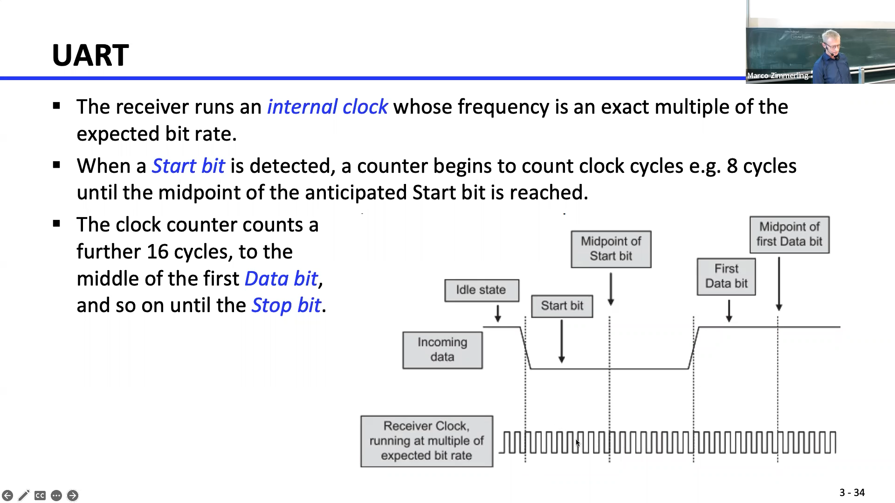
- `1:16:01`: this is **sixteen times the expected bitrate**.
- `1:16:06`: i saw **from here to here**.
- 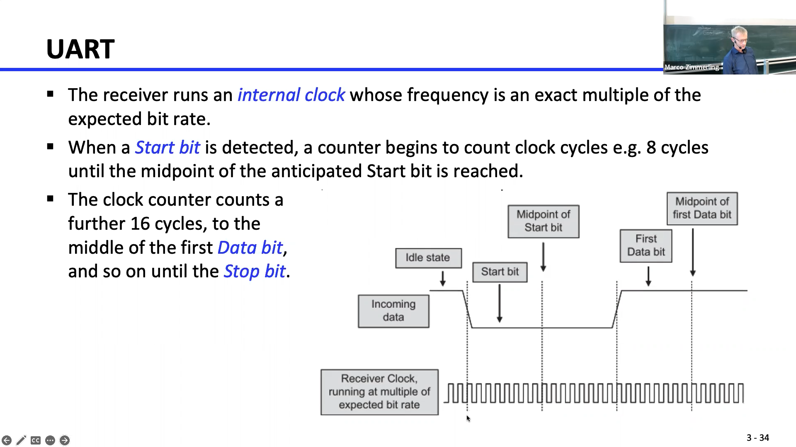
- 
- `1:16:11`: **the receiver makes exactly sixteen clock cycles** just for the purpose of this exam.
<!-- - `1:16:18`: okay so and and what ah so this year i'll stay this is the incoming data. -->
<!-- - `1:16:26`: as we saw before we go from zero to one to indicate started. -->
- `1:16:32`: and **the receiver**.
- `1:16:35`: **tries to read out**.
- `1:16:38`: **what bit is actually transmitted right in the middle of each bit** so **when it detects the change for example from one to zero when the start bit begins it counts exactly for eight clock cycles and then it reads out**.
- `1:16:55`: **is it a zero or one.**
- `1:16:58`: so **it detected a change then reads out and again for the first databit here and for all subsequent databits**.
- `1:17:09`: okay so this again shows you that it's very important to have his estate o'clock because every sixteen clock cycles so here it reads out the started six o'clock silence later a result what does the first state up it's in this case one and for the second infinite.
- `1:17:27`: ok or yeah this is **again going back to tour launchpad**.
- `1:17:35`: just to illustrate **there's also a uart here**.
- 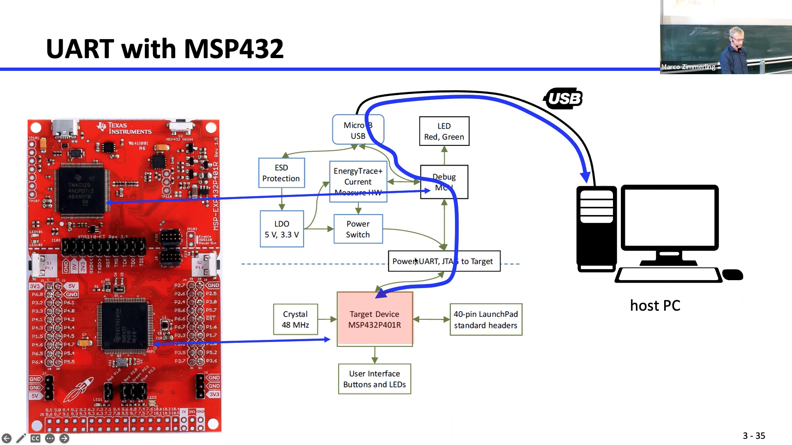
- `1:17:38`: **it's used to interconnect the observer architecture** this is the observer **and the actual processor that we are interested in using uart**.
- `1:17:49`: and this is **again the the block diagram** shows you exactly.
- 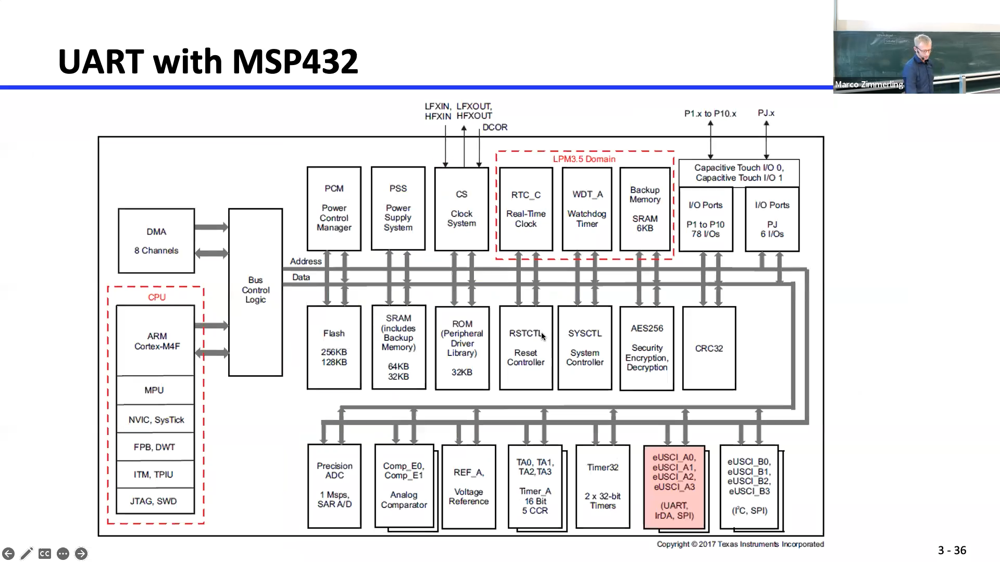
- `1:17:56`: yeah **ic that is doing it's an implementation of the uart protocol in hardware**.
<!-- - `1:18:04`: or. -->
<!-- - `1:18:06`: and this can or is accessed via this bus again using the mechanism that i explained that we talked about before. -->
<!-- - `1:18:15`: with the address space and so on. -->
- 
- `1:18:19`: okay so are we actually going to look into this now okay so yes so **here is again the memory mapped access** and then **now this or for the example of the uart block**.
- 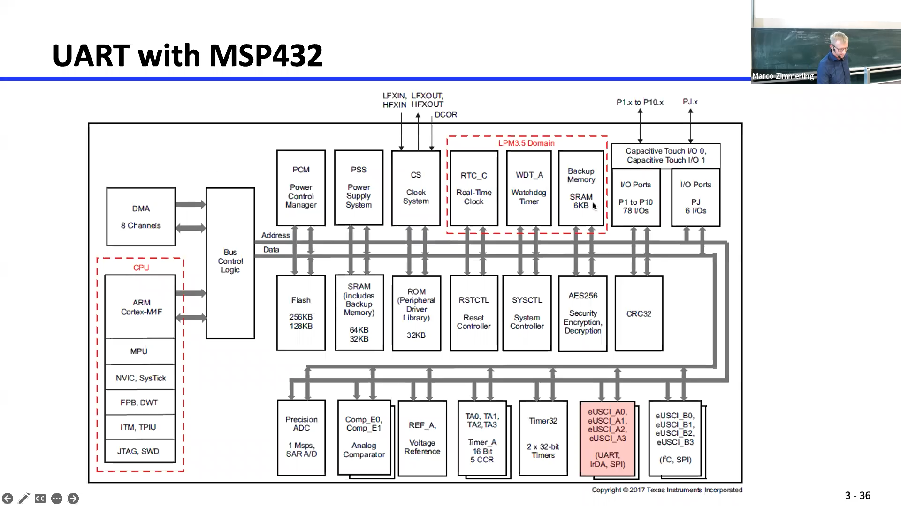
- 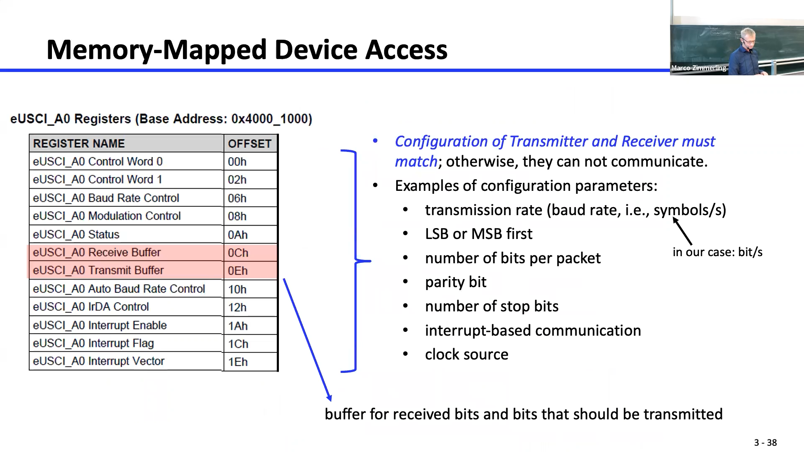
- `1:18:35`: so there's a **certain base address that refers to the**.
- `1:18:39`: **registers or data that is related to uart** aren't.
- `1:18:44`: and **it's used for example...** young for the tool.
- `1:18:50`: **to access the receive and transmit buffer as well as to set various configuration data** for example if we use a parody but the number of stop its and what is the transmission maintenance on all of these things have to be configured by accessing these memory locations and writing a.
<!-- - `1:19:09`: property values into these memory locations excuse me and as we already saw here. -->
<!-- - `1:19:17`: the clock is critical saw. -->
<!-- - `1:19:21`: and he admits elizabeth gets a little bit here now complicated. -->
- `1:19:29`: but i'm i'm trying to walk you through **this is how it looks like on this msp** have stood the rubber simple **microcontroller** and as you can see here we have multiple clocks lead the **mulitple clock sources that one can use on this architecture** will talk about timers and clocks in the next election so.
- 
- 
- `1:19:48`: i love him at this point and one can **choose which clock source woulde use someone one can have quarts? one can have an rc circuit** so different kinds of clock sources with different properties and speeds **than there's let's say this like a clock configuration sub sampling block**.
# ==============1:20:00==============
- 
- `1:20:08`: he away **where you can essentially have**.
- `1:20:11`: **modulate the clock signal so you can change the clock signal depending on your requirements and needs** and we will do this in a second.
- `1:20:22`: and then this configured clock the transmit lock or receive clock so here we look at the entry the transmit path is then **...driving this circuit that is used to transmit data over uart** want.
- `1:20:36`: **here is the transmission, so we want to send data from sender to receiver. data is put into the receive buffer**. **then there's a shift register that sends...** so since since.
- `1:20:50`: **the individual bits, bit by bit over the wire**.
- `1:20:55`: puts it onto the wire and then the receiver can can read it and answer **so what is a shift register...**.
<!-- - `1:21:02`: so let's say a business the first bid that is being transmitted and building with uncle on the wire let's say is one zero one. -->
<!-- - `1:21:12`: right and then afterwards so everything shifts to here and then the next month of his one. -->
<!-- - `1:21:19`: single one one. -->
<!-- - `1:21:23`: so. -->
<!-- - `1:21:25`: pencil. -->
<!-- - `1:21:32`: hey. -->
- 
- 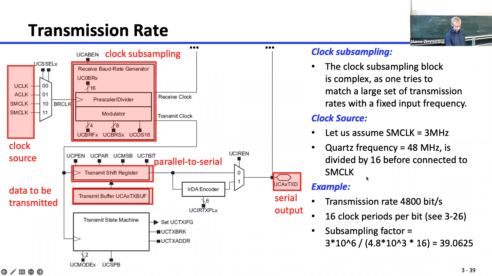
<!-- - `1:21:39`: okay so now let's assume **to understand how this clock sub sampling works let's assume that we are use the system clock smclk here**. -->
<!-- - `1:21:53`: and this is a free magazine so. -->
<!-- - `1:21:56`: clock. -->
- `1:21:58`: **this is actually connected to a quarks and is divided by sixteen before disconnected it is connected to this clock** to the clock so we get a three mhz signal.
<!-- - `1:22:09`: in here. -->
<!-- - `1:22:11`: and now let's further assume that we chose a very low transmission rate so far four thousand eight hundred bits per second is pretty low but just for the sake of this example let's assume we we have sender and receiver have agreed on this transmission rate. -->
- `1:22:25`: and will you they agreed also or they will use **sixteen clock periods per bit**.
- `1:22:31`: **exactly what you saw on slide three twenty six**.
- `1:22:36`: no sixteen clock signals for a single bit.
- 
<!-- - `1:22:40`: okay now. -->
- `1:22:42`: so and this means that **in order to get the appropriate frequency of this transmit clock we somehow have to get from the three mhz that are coming in here to the appropriate clock that comes out here**.
<!-- - `1:22:59`: this means that we have to configure or have to do a little little bit of calculation yeah right so we have to take so depending on zone or **we have a three mhz clock, this means we have three million clock cycles and we have to divide this number by four thousand eight hundred bits**. -->
<!-- - `1:23:17`: **times the number of clock periods**. -->
<!-- - `1:23:26`: so we want that one clock cycle. -->
- `1:23:30`: on the transmit lock is that **so what does number tells us is that one clock cycle on the transmit clock corresponds to thirty nine point zero six two five clock cycles on the system clock that comes in**.
- `1:23:46`: **and we have to appropriately configure this clock sub sampling clock in order to get exactly this ratio**. **in order to get to this transmission rate and the number of clock periods per bit**.
- 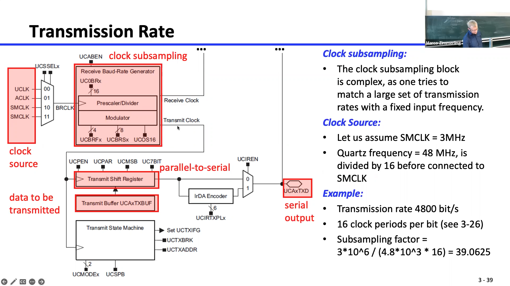
- `1:24:04`: okay so **how does this look like in c**.
<!-- - `1:24:07`: i. -->
- 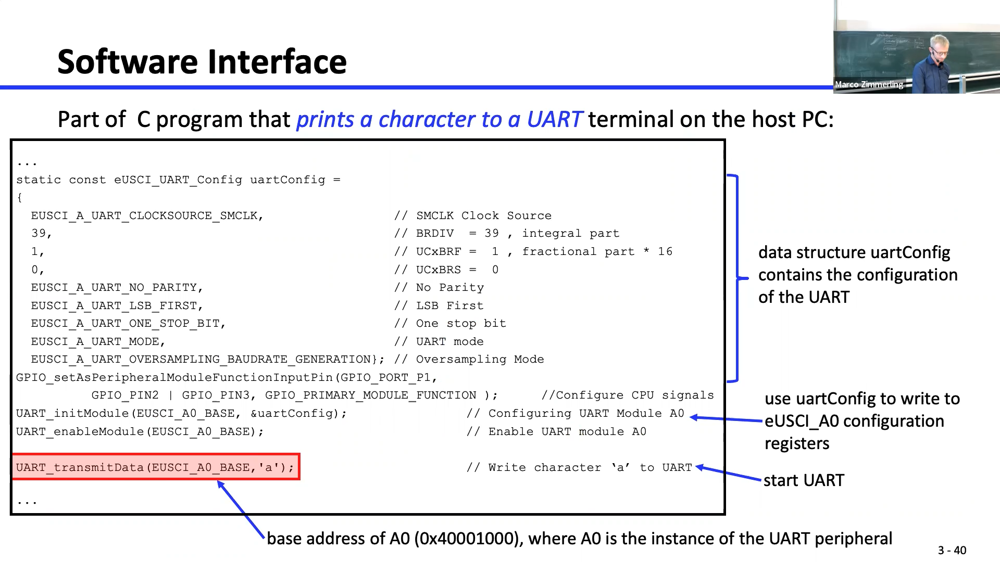
<!-- - `1:24:10`: the goal is to send a single or a single letter a single bite or of a you aren't here so this is this is the ankle so we want to send letter a over the wire which is again like it's an ascii asking put some some number in the ascii code which are used to remember back in the days so. -->
- `1:24:29`: and to do this **we have to first to configure the uart appropriately as we just discussed and to do this you're yeah you have to provides a structure it's a c struct with the appropriate contents**.
<!-- - `1:24:43`: af. -->
<!-- - `1:24:45`: you don't have to remember anything of this just to give you the idea you if you have to do this ever you have to look into the data sheet and you will find you have to do such calculations and you will find the appropriate values in the data sheet that you have to put into destruction in order to get for example the appropriate clock ratio so thirty nine. -->
# ==============1:25:00==============
- `1:25:06`: **thirty nine plus**.
- 
- `1:25:09`: **one over sixteen so this is the integral part and this is the fractional part**.
- 
- 
<!-- - `1:25:17`: no charity or nsp for us to really significant fit the tourists there will be one stop it and and so on. -->
- `1:25:24`: **then we have to connect the port of the processor to the correct pins**.
- 
- `1:25:31`: **configure the uart module using this configuration so this is the init so uart init so we initialized the uart module with this configuration that we have provided**.
- 
- `1:25:43`: **and it needs to be the same for sender and receiver**. **then we have to enable the uart module**.
- 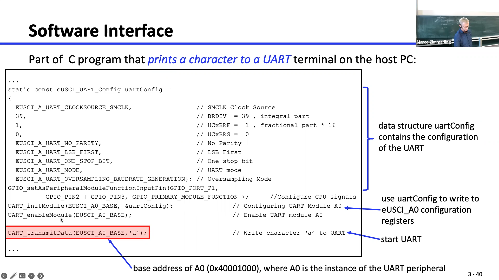
- `1:25:51`: **and then we can transmit**.
- 
- `1:25:58`: okay and here again this of **this is what you want to transmit** and **this is the base address**.
- 
- 
- `1:26:06`: so here we are thought this is how it looks like right **so we're essentially writing a into a memory location and this a is picked up by the ic circuit and transmitted using this configuration over the wire**.
<!-- - `1:26:24`: okay earned. -->
- 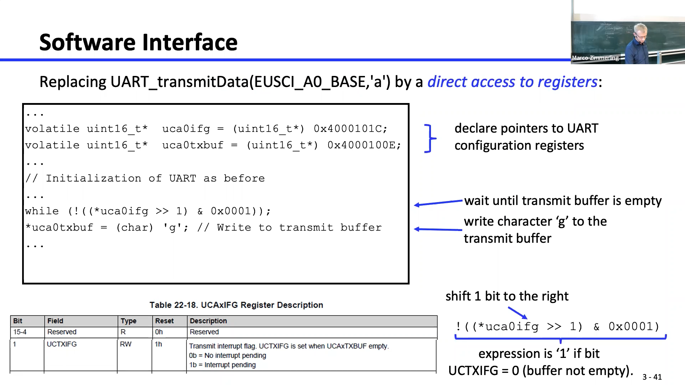
<!-- - `1:26:34`: i am so this is a very convenient library of some sort there are library functions and free articles or whatever sword make your life easy but for and we can just call this call dysfunction but in internally this this function looks much more complicated so. -->
- `1:26:52`: just to give you an idea so what what **what you have to take care of is for example is that you are not overwriting the transmit buffer**.
- `1:27:04`: and **there's a certain register that you can read out from this address...** you see you see a zero i f g at this address.
- 
- `1:27:17`: and **you can access the content of this memory location, the content of this register in order to check**.
- 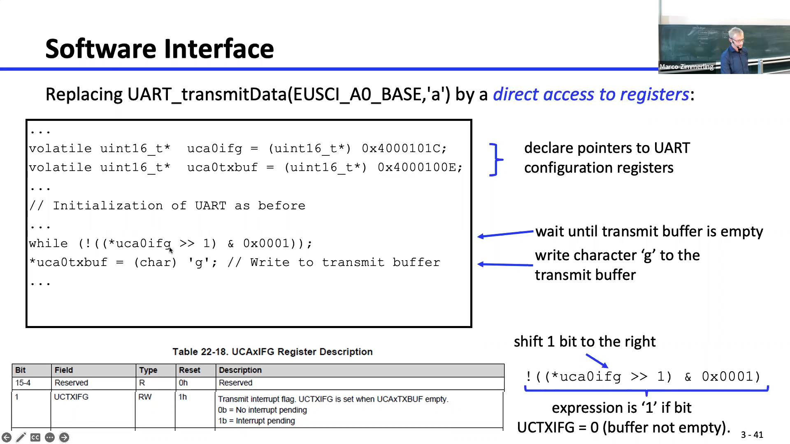
- `1:27:26`: **if the transmit buffer is empty and if so i can write the next letter into this buffer because i don't want to overwrite**.
- `1:27:38`: **the contents before it is transmitted**. **so therefore we have this while loop and we have to repeatedly check is the buffer empty** is the button okay and sorry **and as long as the buffer is not empty i will stay in this while loop**.
- `1:27:52`: **then i will exit the while loop when the buffer is empty**.
- `1:27:56`: **and i can write the letter g or a was the previous example into the transmit buffer**.
- `1:28:04`: okay and **then there's here's some some logical operations...** and one needs to do needs to do and an author.
<!-- - `1:28:12`: and. -->
<!-- - `1:28:15`: okay maybe it is instructive actually saw it again **by writing this here with the star i access a memory location what i get back is a byte** it **and from the data sheet i know that the second bit in this case it's a second bit. -->
<!-- - `1:28:33`: so this least significant as the monster game begins. -->
<!-- - `1:28:36`: six. -->
<!-- - `1:28:40`: and now i'm interested in in this one here. -->
- `1:28:44`: and the data sheet says if it is zero no interrupt is pending saw the buffer is emptied right so **i need to check**.
- 
- `1:28:54`: **if this second bit is set or not set**.
<!-- - `1:29:03`: right in an auto tool to do this i have two shifts **shift this**. -->
<!-- - `1:29:11`: **to the right**. -->
<!-- - `1:29:13`: when get get to hear all of **all of this here it's not important** than i do **and with one**. -->
<!-- - `1:29:24`: and then i can check then i get the result. -->
<!-- - `1:29:33`: shift by one. -->
<!-- - `1:29:40`: yes and if it is one then this end expression will evaluate to one. -->
- `1:29:48`: exciting and **then we do do the not** exactly okay so what is written here is essential is correct.
<!-- - `1:29:58`: but this entire expression is one so true if this bit is not empty. -->
# ==============1:30:00==============
<!-- - `1:30:06`: the buffets on it. -->
<!-- - `1:30:09`: okay. -->
<!-- - `1:30:14`: sure. -->
- 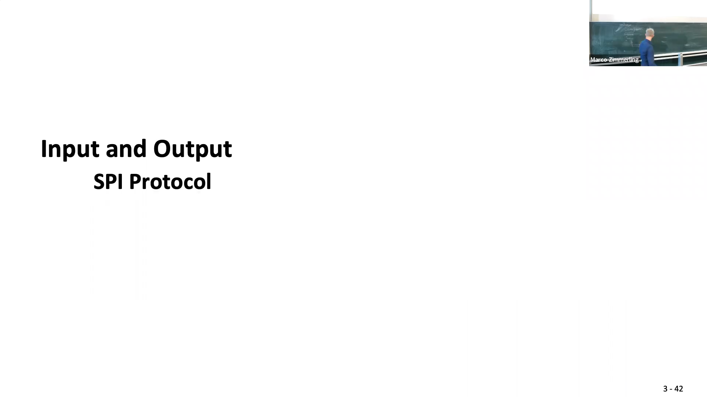
<!-- - `1:30:31`: okay this is i i didn't specify this in it in the picture when you can configure the yard. -->
<!-- - `1:30:38`: whatever in whatever way you want so you can use ellis be nice significant or more significant and giving what i wrote all the time years or this would be like the most significant bit young but this is all. -->
<!-- - `1:30:56`: of the configuration and can be fully configured by the by the problem. -->
<!-- - `1:31:01`: and. -->
<!-- - `1:31:03`: and i think we will we will need the spare protocols will inform the next lecture. -->
<!-- - `1:31:09`: yeah so thank you everyone and. -->
<!-- - `1:31:13`: now see you in two weeks. -->
-------------------------------------------------------------------------------
# Transistor
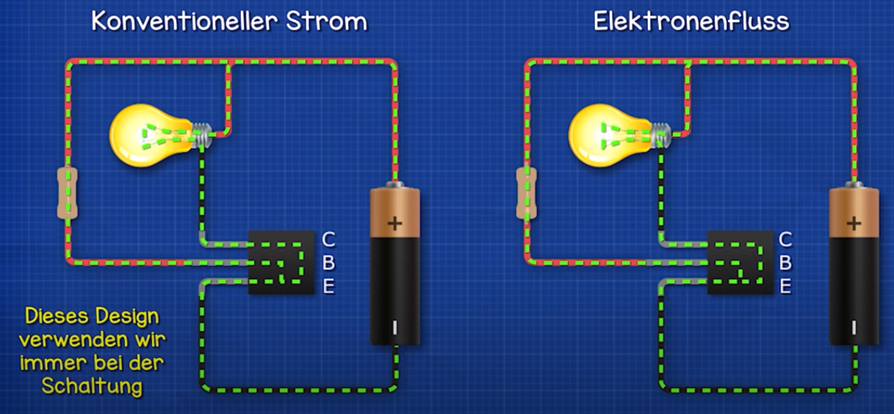
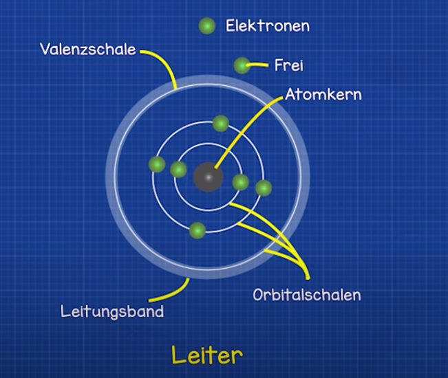
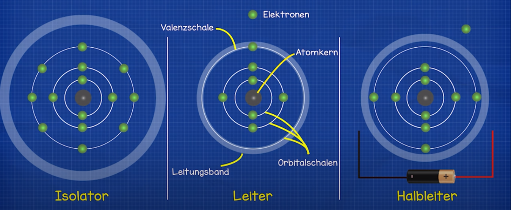
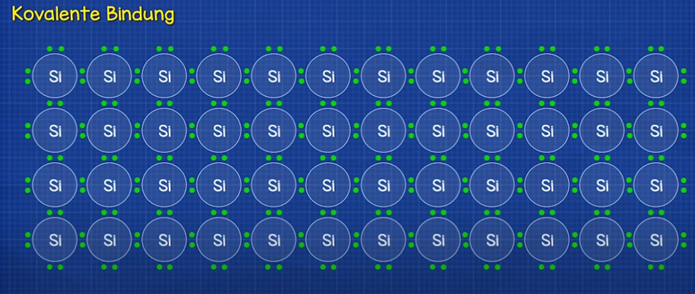
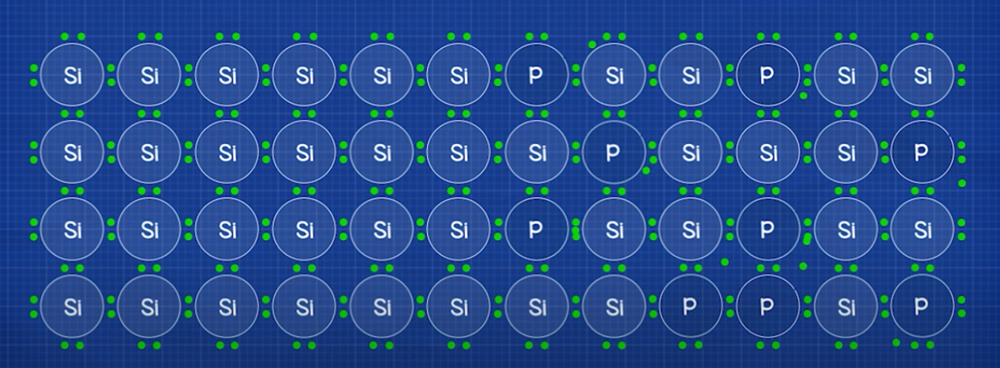
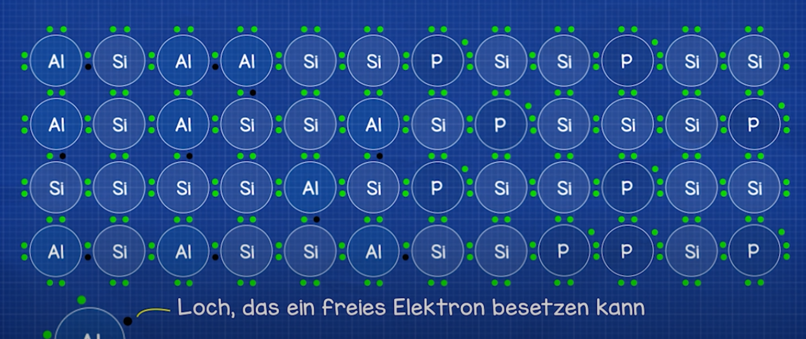
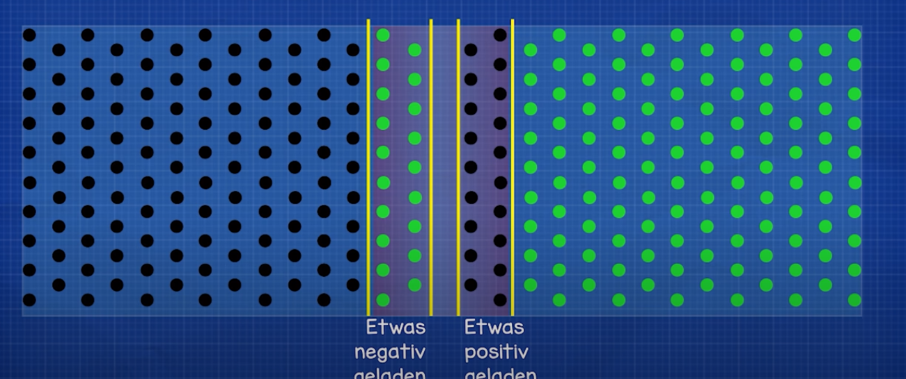

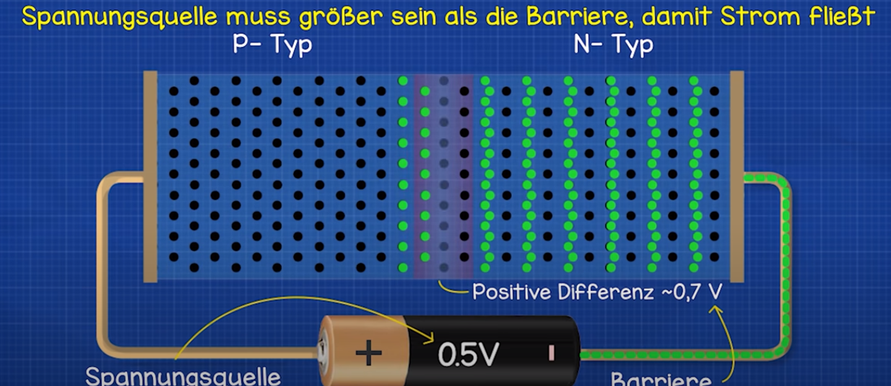
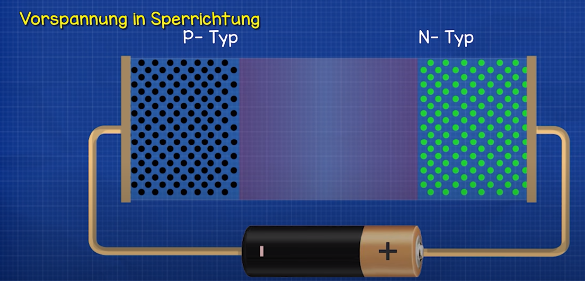
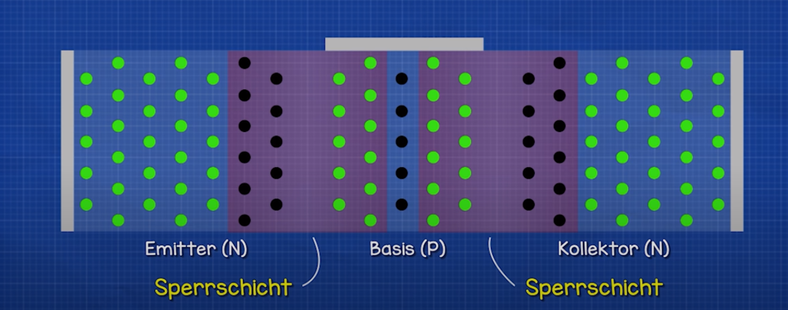
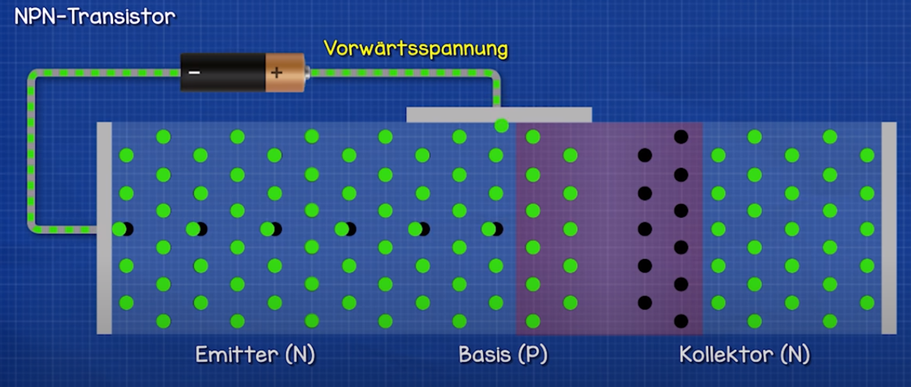
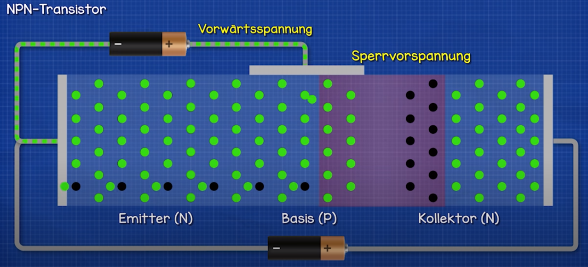
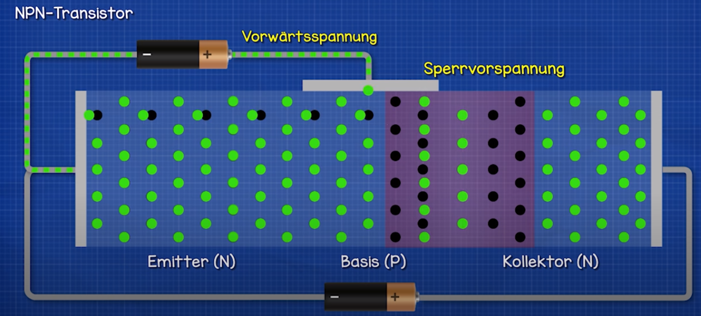
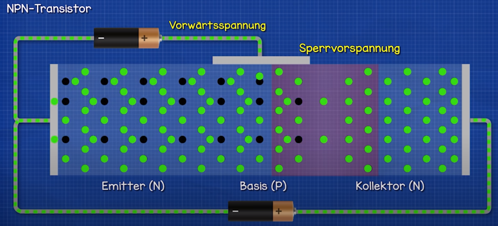
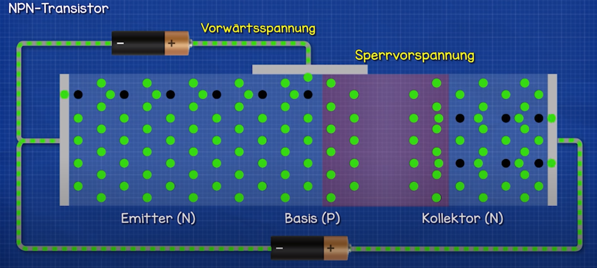
