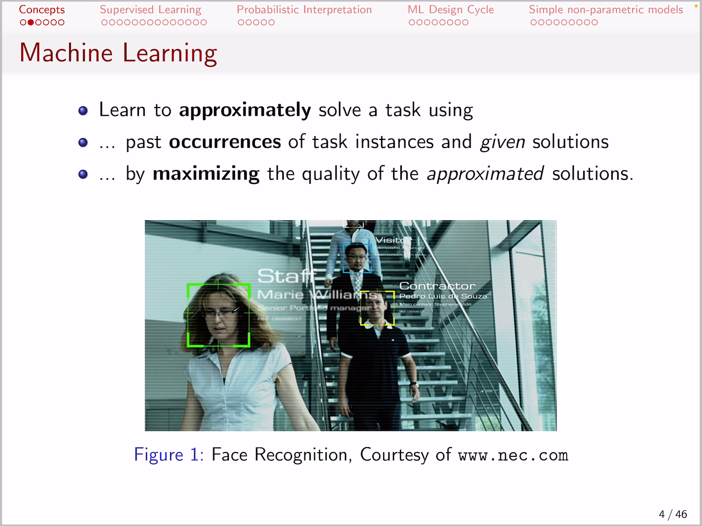
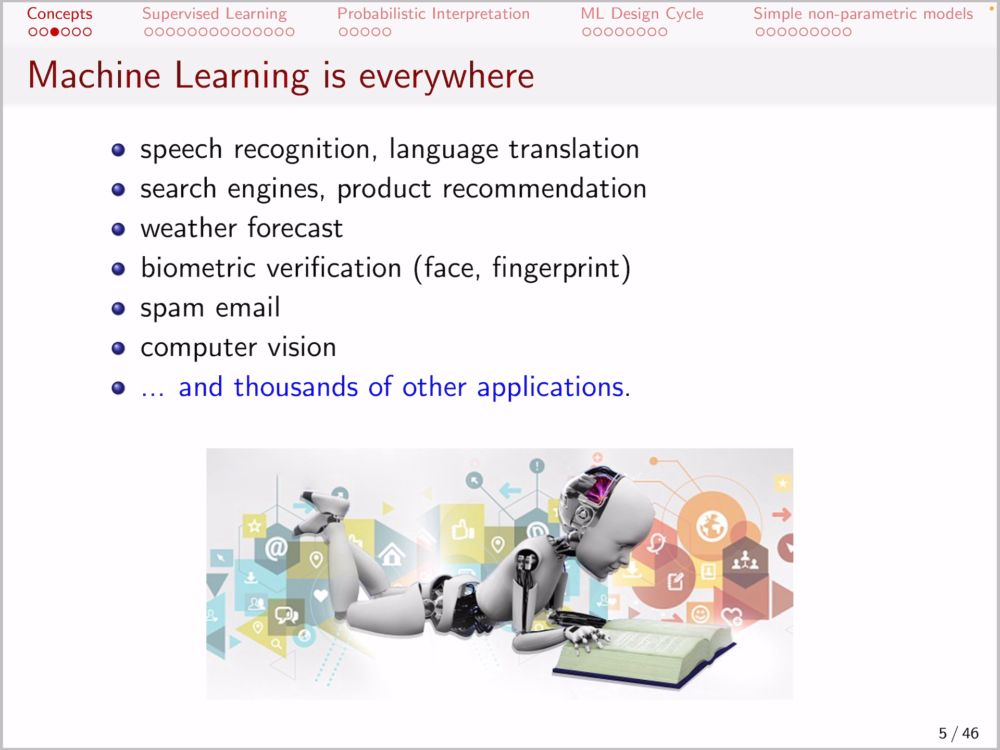
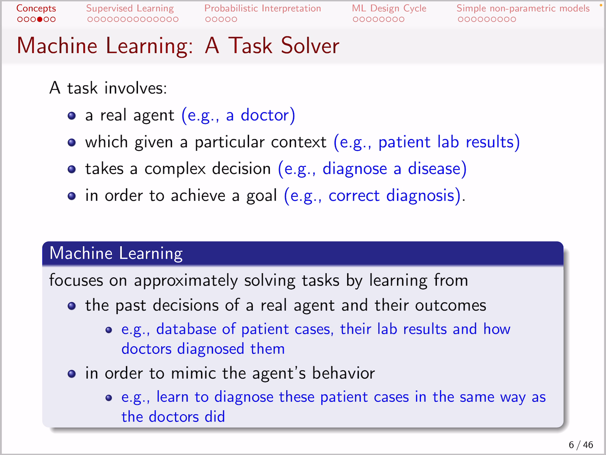
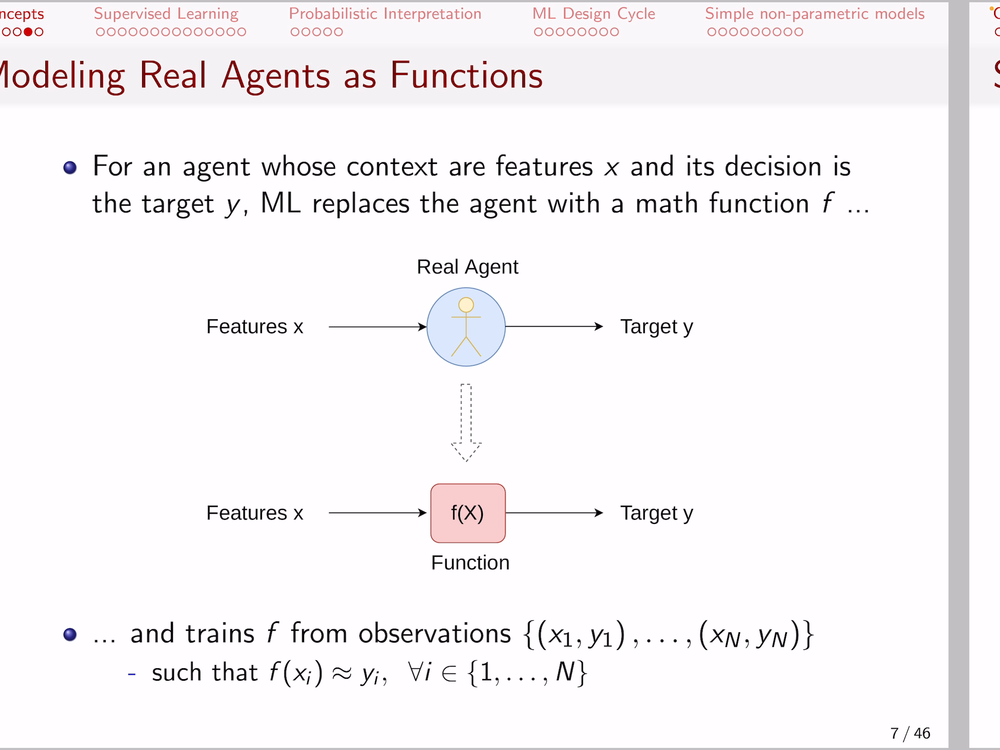

<!-- /home/areo/Videos/Machine_Learning/01._Introduction_-_part_1.MP4 -->
<!-- /home/areo/.config/mpv/mpv.conf -->
[toc]
# ==============0:00:00==============
- 
<!-- - `0:00:02`: hi guys and welcome to the very first video of the lectures that will accompany you throughout the machine learning lecture today we're going to introduce you to the topic of machine learning and throughout today's features we are going to cover that. -->
<!-- - `0:00:20`: concepts of machine learning at the beginning and then afterwards familiarize you with supervised learning and as a third step we are going to provide a probabilistic interpretation of the supervised learning task and then move on with describing the design cycles that typically you have to do in order to. -->
<!-- - `0:00:40`: to apply machine learning last but not least we are going to provide some simple non-parametric models that will provide a smooth introduction to some real machine learning methods so without much ado let us start with the concepts what. -->
<!-- - `0:01:00`: his mission and so many of you already might have heard of machine learning from the use from your friends maybe you'll have already worked with some machine learning tools or maybe implemented assumption learning methods in the past and you already perhaps know that machine learning is a subfield of art. -->
<!-- - `0:01:20`: efficient intelligence and in essence machine learning is a way to make machines am able to learn to approximately solve a task so what we are going to do is we've tried to solve tasks in an approximate not exact way and we're doing that. -->
- 
- 
- 
<!-- - `0:01:40`: that by recording lots of data and trying to learn from this data in other words we use pastoral curious just of past instances and given solutions so if we have a task that we need to solve we record data off of how it was solved in the past and we make use of this data in a way that. -->
- 
- 
<!-- - `0:02:01`: we are trying to learn algorithms that propose some solutions in the same way that the recorded solutions were given and we are trying to maximize the quality of thus approximating solutions sought to give you a very simple explanation and assume that. -->
- 
- 
<!-- - `0:02:21`: you would like to offer some advertisement to the users of an online website yet fought for the sake of of the example assume that you either the developer or the main id person behind. -->
<!-- - `0:02:35`: a website that has to offer advertisements and your you have the task of deciding which advertisements to give to a user and you measure the success of your decision by whether the user clicks on the advertisement or not. -->
<!-- - `0:02:52`: so what the solution here is is the fact that you have provided an advertisement that the user clicked and a bad solution is that you have provided an advertisement that the user did not click so if you have does a taunt. -->
<!-- - `0:03:12`: off off with a different user profiles and different advertisements that were shown to them and also recorded whether they have clicked on not then you can you can train an algorithm or a method that is able to learn whether a user has. -->
- 
<!-- - `0:03:32`: a likelihood to click on an advertisement or not and such metals that you are going to train or optimize is going to make use of the previously recorded user experience that is what we call task instance saw an instance of a user provide an advertisement and. -->
<!-- - `0:03:52`: the fact where they clicked it or not you are trying to learn a model that approximates the behavior of users and why do we need to do that we need to do that because in the future we might decide for a new user and for a new advertisement what is the likelihood that he is going to click on it. -->
<!-- - `0:04:13`: because that's how you make revenue and in fact machine learning is the art of of creating algorithms and metals that learn from data for example on. -->
<!-- - `0:04:24`: on face recognition but there are much more examples of machine learning that are currently being used basically it is everywhere from speech recognition to language translation it is being used in in in most of your daily lives for example when you translate some text from english to try. -->
<!-- - `0:04:45`: german and vice versa there are some machine learning models there that contact at natural language processing tasks and it has been used extensively on search engines in what we call learning to rank so you'll learn how to rank the top relevant websites and that you do by having. -->
# ==============0:05:00==============
- 
<!-- - `0:05:05`: particular task instances that is whether a person clicked on some websites when he searched for a particular keyword in the past and you want to optimize the top recommended websites search engine in a way that they align with what people have kicked in the past so you're trying to approach. -->
<!-- - `0:05:25`: ksi made the solutions that people have given in the past because we believe that that is relevant and the same goes for product recommendation if you are websites such as for instance amazon you want to recommend products where you predict or estimate that the user has a high. -->
<!-- - `0:05:45`: high chance of actually purchasing those products and you do that by having collected data on a previous user's previous products and the fact whether a user purchased that product or not but machine learning has even further interesting applications. -->
<!-- - `0:06:06`: such as weather forecast or biometric very verification which is quite diverse it's taught from face recognition fingerprint recognition gait recognition so you likely are using fake a fingerprint recognition on a daily basis on your smartphones and every time. -->
<!-- - `0:06:26`: you are using that there is a machine learning method behind the scenes that actually predicts the likelihood of the fingerprint being you and how does it do that if you remember when you set up your phone you provided some example fingerprints those are the tusk instances that i mentioned the machine learning model learns from those examples. -->
<!-- - `0:06:46`: it knows that those fingerprints were yours it has also other examples of fingerprints that were not yours and then it tries to classify a fingerprint into being you or not by making use of the previously recorded fingerprints on the other hand everytime you open. -->
<!-- - `0:07:06`: and at your email account likely there would be multiple spam emails that that are being sent to you but you don't see all of them and that majority of the spam emails are being filtered by machine learning algorithms that decide whether an email is spam or not and. -->
<!-- - `0:07:26`: this machine learning algorithms are being trained on previously collected spam emails and also normally maize and the algorithm tries then to predict whether an email spam or not by actually learning to correctly predict spam emails from wants that. -->
<!-- - `0:07:46`: explicitly don't expand in the past and most importantly nowadays computer vision is a main application domain for machine learning in the application areas such as automated to driving such as face recognition which relates to. -->
<!-- - `0:08:06`: biometric verification as such as scene understanding that image segmentation recognition of tumors from from scanned images so so forth it is quite a very large array of of potential application domains where machine. -->
<!-- - `0:08:26`: learning is being applied and the thousands of other applications that that could have been mentioned at many of those help humans in their daily lives and others helped the economy so it is fairly safe to say that machine learning is one of the most. -->
<!-- - `0:08:47`: important research fields nowadays nowadays and i could play the most successful approach to solving ai and for this reason you should consider it as as an investment for your profile to be able to understand the base. -->
<!-- - `0:09:07`: basics that we are offering in this course. -->
<!-- - `0:09:10`: great how can one perceive machine learning well you can understand of it as a way to solve tasks. -->
<!-- - `0:09:20`: there are multiple ways to solve tasks and some of them don't require machine learning for example if you want to sum up to two numbers math three plus five you don't need collected data for that because you know the logic of of of summation. -->
- `0:09:36`: machine learning is more relevant for most tasks that either you **don't know the logic** how you can relate and the solution to a task with that given the factors that contribute to the solution offered tasks where you have an expert that actually is carrying that is.
- `0:09:56`: is computing the solution of of the task and you want to **replace the expert** with a with an automated algorithm because the automated algorithm maybe it is a less expensive or perhaps perhaps you don't have enough experts to actually solve all the tasks that are relevant for.
# ==============0:10:00==============
- 
<!-- - `0:10:17`: patient told me so what really are we referring to with tusks when we say a tusk we made an age related it can be a human being it can be. -->
<!-- - `0:10:30`: software it can be a maybe a robot it can be a factory machine saw this agent. -->
<!-- - `0:10:39`: given a particular context for instance if it is a doctor the context is where you're receiving your patient that is your context and that patient has some lab results of the blood pressure the the values of off the other metabolize in his body so you need to take complex. -->
<!-- - `0:10:59`: decision given this data this profile of your actual context and the decision can be parishioners to diagnose whether that particular patient has a disease. -->
<!-- - `0:11:12`: and of course that is not enough to define a task because you have to link your decision to some quality criteria you have to make sure that your diagnosis is correct so to sum up your task involves a real agent context. -->
<!-- - `0:11:29`: taking a decision and achieving a goal and machine learning tries to emulate his principles he tries to replace agents with with computer algorithms that tried to take complex decisions in order to maximize some quality goals. -->
<!-- - `0:11:49`: by making use of some context and the context in the case of machine learning algorithms is data. -->
<!-- - `0:11:57`: i saw summing up machine learning we can say that it focuses on approximating solving tasks by learning from the past decisions of real agent and the outcomes in the case of the doctor the past decisions is where you have a database of patient cases you have the lab results and how dr. -->
<!-- - `0:12:17`: diagnose them this is the data from which you learn how to relate patient lab results to a particular disease if you collect lots of patient patient cases and lots of diagnosis given by some doctors then you can try to learn how did the doctor be. -->
<!-- - `0:12:37`: late and the results that he saw about a patient's case to the diagnosis and we wanted to learn the method that automatically tries to learn the logic of relating the patient profiles to a disease. -->
<!-- - `0:12:53`: so what we are trying to do is we try to mimic an agent's behavior so we learn to diagnose the patient's cases in the same way as the doctors did and in essence this way of looking into machine learning as a tusk solver is quite university if you think about it we as. -->
<!-- - `0:13:13`: humans we structure our lives in a way that we solve tasks basically every second of our life at our tasks can be even when we sleep the body has to decide whether it needs to regulate the body temperature it needs whether it needs to to decide whether to increase briefing god. -->
<!-- - `0:13:33`: chris briefing it needs to maybe decide whether to wake you up if you feel too cold and when you wake up in the morning and it decides whether what what should you should do first in the morning saw a human agent solve tasks we did not mention with respect to what it's all such tasks and that is of key. -->
<!-- - `0:13:53`: was quite complex in the case of human beings because well of course you want the the body solve those tasks your body solves the tasks in order to keep your life to maximize energy etc but you as a human being have very complex tasks all you want to you want to be sucks. -->
<!-- - `0:14:13`: zestful at your job you want to be successful at your study etc but in essence there is some common goal that you want to do and in order to achieve them you'll take some decisions so human beings take decisions all the time to achieve some goals and that means all the time they are solving tasks. -->
<!-- - `0:14:34`: now the magic of machine learning is that if i have lots of data about that particular context of an agent for instance a human being and how he reacted what actions and decisions he did in order to achieve those goals i can try to mimic i can try to learn some. -->
<!-- - `0:14:54`: some logic on how that particular agent operates and i can try to replace him with an accurate and that does not have to only only be a human being it can be for example well it can be a machine yup if you're if you have a factory and you have some engine. -->
# ==============0:15:00==============
- 
<!-- - `0:15:14`: that that works all day and produces some sensors sensor logs started because of temperature humidity maybe the vibration of the engine and time time after time it fails so you have the data of the context meaning you have the the temperature and the vibration of the engine and us. -->
<!-- - `0:15:34`: also some decision making to do that the operator of of the factory dust that is well i need to stop the engine because it is going to fail and if you record all those cases of the of the factory engine failing in the past then you can learn an algorithm that automatically predicts when will the. -->
<!-- - `0:15:54`: ancient fail and perhaps take some measures ahead of time and replace the human operator that that works in the engine so in essence what we are trying to do is we emulate agents in solving their tusks well that's move a step more concrete map so far thinks i need to. -->
- `0:16:14`: bit obstruct how do we do that well we do it by a simple principle if we connect the contexts upon which an agent takes a decision let's call this context features throughout throughout this lecture **features means that the set of**.
- `0:16:35`: **factors that contribute to the decision of often agent** for instance if you want to to decide whether you want to show a commercial or an advertisement to a user then the context or the features well the profile of the user the the age of the demographic information etc the type of the.
- `0:16:55`: commercial or advertisement and maybe the video of the advertisement this is the context upon which the user decides whether to click or not on the advertisement and you have something that is called the decision we defined it to be the target that is the target of the decision making process **decide**.
- `0:17:15`: **whether to shop or not the advertisement is the goal** but the actual **target is will the person click it or not** so you want to predict security whether a person will click or not the advertisement that is your target so actually you have the feature sticks the information for instance off.
<!-- - `0:17:35`: video and the user profile then you have an agent that is the behavior of of a user and then you have a target where the clicks that the advertisement or not now what machine learning does is replacing this blue circle by mathematical function. -->
- `0:17:54`: **we want to learn a mathematical function that behaves in a very similar way to the real agent** and how do we do that well we **collect lots of observations so we collected the past how did particularly users for agents behaved**.
- `0:18:14`: when they were provided with particular context or if we have the first context x one we know that they behaved in the way one way and **x one again to remind do other the features that describe the user profile and an advertisement** and **y is**.
- `0:18:34`: **is whether he clicked on it or not** so if we know in a particular context x one that we clicked or not as by one then four and many recorded cases we can record the context all the features and on the other hand the target.
<!-- - `0:18:50`: and and in this case can be large can be millions of examples it can be billions of examples that the more data you have typically the better the quality of your decision will be if you replace the agent with an algorithm and the crucial part here is that our criteria for learning is that. -->
<!-- - `0:19:10`: at this function f that replaces an agent should replace it in a way that the output of f if we provide x matches the y that we have collected data. -->
<!-- - `0:19:23`: so if we provide the context as an input to this mathematical function f it should output the same value as in the data that we have collected in other words it should solve the task in the same way as the task instances that we have collected so in a very high level so. -->
<!-- - `0:19:43`: since this is what machine learning does replacing real agents functions in a way that it can correctly predict the target for the recorded instances saw we are going to call as an instance all the recorded cases of. -->
# ==============0:20:00==============
- 
<!-- - `0:20:04`: off of the list of features and targets saw and can be and patients in your data base x can be patiently formation y can be how how they were diagnosed for a disease or x can be for instance up. -->
<!-- - `0:20:22`: and a user profile and a feature profile and y can be whether the user click the video or not and in many other applications x can be an image why can be whether it's you or not. -->
<!-- - `0:20:35`: x can be a fingerprint and y can be again whether it's you or not. -->
<!-- - `0:20:40`: ix can be for example a tweet message and y can be whether it is a hate speech or not if you want to learn an algorithm that detects hate speech. -->
<!-- - `0:20:50`: and on the other hand ix can be for instance characteristics of your house the square meter can be how many room cities that it can be some other characteristic of the of the house such as the area of the city where it is located and y can be the price if you want to predict the price of a house. -->
<!-- - `0:21:10`: house for instance if you work from some real estate website that needs to make some approached approximation for for the price of a house salt there are many cases how you can model tasks as machine learning and the way to replace agents with real functions. -->
<!-- - `0:21:30`: is to actually model them in a way that for the past record it up. -->
<!-- - `0:21:38`: features and targets your function f when given a feature oppose the same target. -->
<!-- - `0:21:46`: and the hope is that if it can correctly model the past data then it will work good for future date meaning if you receive a new x and you don't know why for example it is your patient and you don't know whether he has a disease or not in that case then. -->
<!-- - `0:22:06`: when you use the function f and not the real agent anymore you don't need the agent anymore because now you haven't mathematical approximation to that agent the mathematical approximation is cheaper abts as accurate as the real agent and it is definitely more scalable so you can run f on a smartphone but for. -->
<!-- - `0:22:26`: original security is a complex disease then you have very few medical experts so the benefit of replacing agents with mathematical functions is huge and the principle to do it is to collect lots of data about the features and the targets of previous instances of the task and training this mathematics. -->
<!-- - `0:22:46`: function in a way that it outputs the same values as a collected target when inputted the collected features. -->
<!-- - `0:22:56`: great that was actually half of the story machine learning is not just about that to be honest that was what we called supervised learning that is the case where we have a target which is typically given by an expert scientist either diseases annotated by by a doctor in the. -->
<!-- - `0:23:16`: the sense that fought for this patient he had no taste wherever the disease was present or not all we have data where users have clicked on an advertisement so it's always the ground truth so the the the knowledge comes from an expert in an explicit way that is what recalls supervised learned. -->
- `0:23:37`: in fact supervised learning has many flavors such as **classification** if the target that we want to predict is a **nominal** terrible for example has a disease does not have a disease or it can be **regression** if it is a **continuous variables** such as for example the house price which does not have only two categories.
- `0:23:56`: but has it revalued output it can be **ranking** such as the cases of search engines where what you want to do is you want to **rank the top relevant**.
<!-- - `0:24:09`: websites and in fact supervised learning will really represent the lion's share of this course most of the weeks we are going to discuss and cover supervised learning algorithms nevertheless there is a second stream of of mission done research which is. -->
<!-- - `0:24:29`: unsupervised learning and it relates to the cases where the target contains no explicit label or context features for instance let's assume you are the manager of deutsche bahn and you you have now a new railroad and maybe a new technology. -->
<!-- - `0:24:50`: so you have a faster train that goes much faster than the carrot trains and you want to make sure that the electronics inside the tray will not make the train crash it is being controlled by complex electronics so you want some safety systems to make sure that it doesn't malfunction. -->
