<!-- /home/areo/Videos/Machine_Learning/01._Introduction_-_part_2.mp4 -->
<!-- /home/areo/.config/mpv/mpv.conf -->
[toc]
# ==============0:00:00==============
- 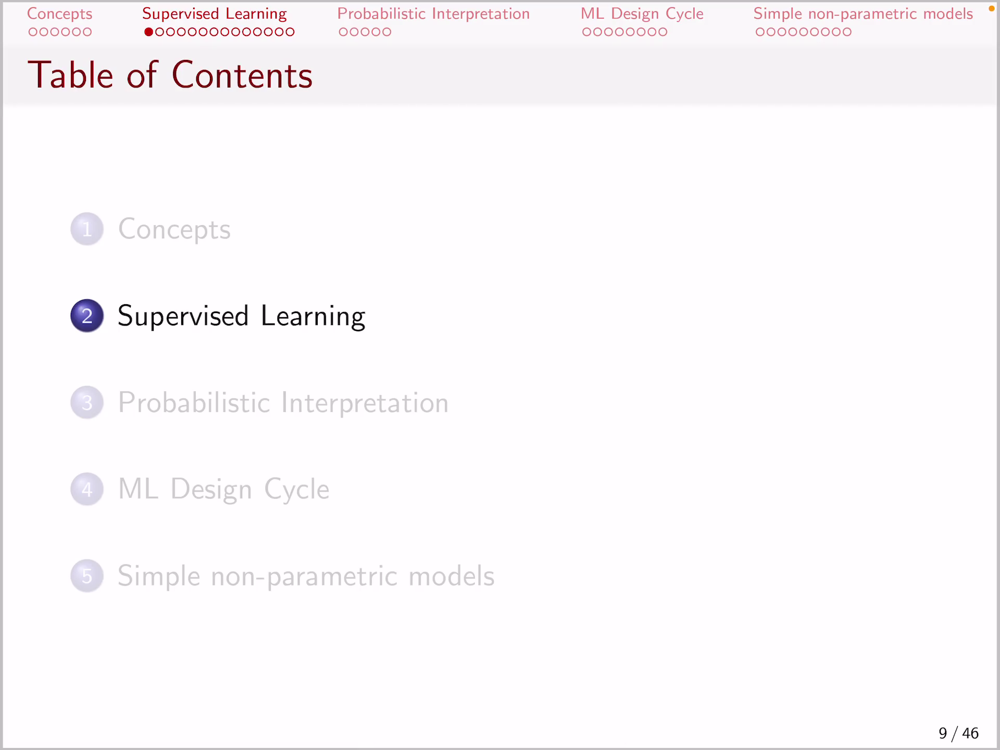
<!-- - `0:00:01`: we're moving to the second part of the lecture that is an introducing the concepts of supervised learning and in order to do that we are going to start with a simple example that motivates supervised learning so in this case assume that. -->
- 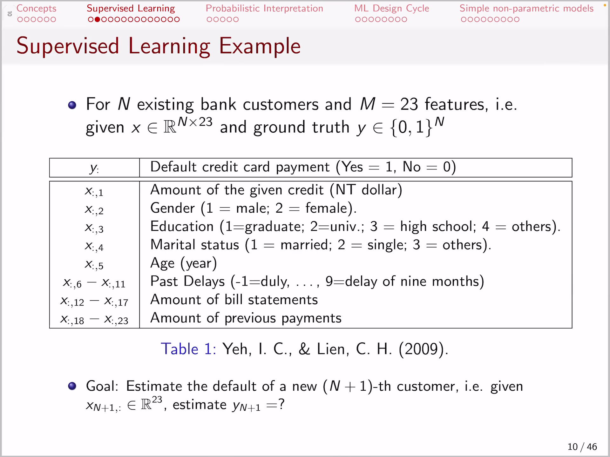
- 
<!-- - `0:00:20`: you are trying to solve the question of deciding whether a credit card credit card payment would default or not. -->
<!-- - `0:00:31`: in other words you have some bank customers they have credit cards and at the end of the month they have to pay back or credit cards some of them unfortunately will not be able to do that so they will not be able to pay back the purchases that they have accomplished with a cry. -->
<!-- - `0:00:51`: edit cut and you'd like to predict what is the likelihood of a particular customer not being able to pay back the credit card amount of salt in other words what you have here as a problem is considering an bank. -->
<!-- - `0:01:11`: customers and each back then customer is identified with twenty three features so most of the context or the characteristics that describe the particular customer and they are quite diverse in this case saw the first feature is the. -->
<!-- - `0:01:31`: the amount of give them credit that he has to far the second feature is whether a person is male or female and the third feature is his education status the fourth the marital status his age and then you have some previous information about the best delays so. -->
<!-- - `0:01:51`: lol delays from julie up to the delay of nine months then you have for the last months the amount of view statements and the amount of the previous payments in his credit card so what you want to do is for a particular patient considering considering the highlighted. -->
<!-- - `0:02:12`: the features you want to predict the target variable y saw for a particular customer. -->
<!-- - `0:02:20`: which provide is described by twenty three values in other words by a feature vector of dimensionality twenty three you want to estimate the target y whether he will actually be able to pay his credit card yes or no salt in a bit more formal terms. -->
<!-- - `0:02:41`: we have our futures which is a metrics of an many roles one role but customer and twenty three columns one column for each of the characteristics that describe a customer and then for each of those customers in the past we have information. -->
<!-- - `0:03:00`: whether they were able to pay the credit card or not so actually. -->
<!-- - `0:03:07`: and here stands for a large number of customers and what we want to do is we want to learn machine learning algorithm in a way that if we have a new customer say the end plus one customer. -->
<!-- - `0:03:23`: then what we want to do is. -->
<!-- - `0:03:27`: give him this twenty three features of that new customer in other words given the amount of the given freddie the gender educational your customer whether the new customer is married or not his age the past delays etc are given all this new context of the customer we want to approximate. -->
<!-- - `0:03:46`: made the target y on whether he will be able to pay the credit card or not so that is an example of what we call a supervised learning problem where we are given features x and we have as many instances of features. -->
<!-- - `0:04:07`: and for every feature we have a corresponding target why that is the quantity of the variable that we want to estimate or predict in this case given x the features of the offer customer predict y whether he will pay back the credit card. -->
<!-- - `0:04:27`: or not that is by the way a real example and now what do we need in order to do that. -->
<!-- - `0:04:36`: well when it's something that actually does the prediction and in a more formal terms given some training data and of recorded instances which are composed of future variables and assume that now we have. -->
<!-- - `0:04:55`: in many instances and previous customers and and the fact whether they paid or not i saw with each customer feature vector being a dimensionality of 'em in other words for every customer we have and many values that describe him or her. -->
# ==============0:05:00==============
- 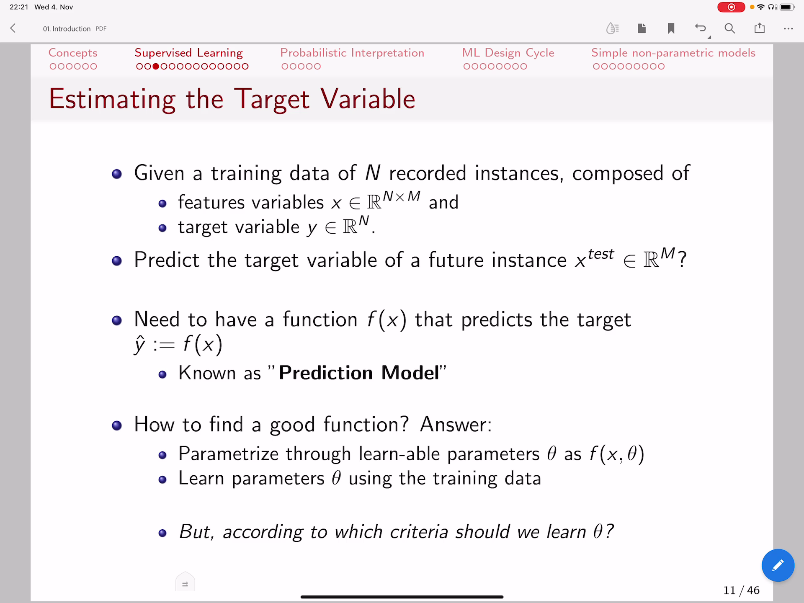
<!-- - `0:05:15`: and what we want to do is predict the target variable of a future instance x test and of course for this new feature is just meaningful this new customer we have 'em many characteristics that describe for instance all the previous age marital status the amount of his credit card. -->
<!-- - `0:05:35`: cetera saw what this is we are talking now about the problem definition. -->
<!-- - `0:05:44`: so this is. -->
<!-- - `0:05:47`: our problem definition. -->
<!-- - `0:05:51`: and in order for us to solve this problem defined in this particular way what we need is well we need a function f remember what we said in the in the previous video that our aim is to replace the decision-making by a function so here the d. -->
<!-- - `0:06:10`: decision making whether a person paid back the credit continent or not well that is recorded in the past so we have that information now we want a function that is able to emulate that why do we need that because for a new customer we can make an accurate prediction. -->
<!-- - `0:06:30`: and whether he will pay the credit card or not and we can maybe inform him ahead of time or take some measure if we know in advance that he won't be able to pay the credit card and we do that by modeling a function f which we call a prediction model throughout this course whenever you hear. -->
<!-- - `0:06:50`: the prediction model that means the mathematical function that emulates the actual process that we are trying to learn so in this case he had tried to learn how to predict whether customer we will pay back his credit card and not for the sake of the formalism. -->
- `0:07:11`: for the first time let us just mention that this **quantity y with a head means that this is an estimated and approximated quantity** so if there is **no head of a variable it means that we are talking about the real value** so the real provided.
- `0:07:31`: data on **past cases whether we know with if a customer paid or not** that is the real why and **why with a head is our prediction** for a particular customer whether he would pay or not salt.
<!-- - `0:07:47`: we wanted to model this predictions in a way by learning f so how can we learn if that is a one million dollar question and one way to do it that is often the gold standard for machine learning is to pyramid tries f by some learn. -->
<!-- - `0:08:06`: double parametrized theater so theater is a logic how we decide whether a patient at sorry whether a customer is able to pay back his credit card mount yeah so all the actual logic of emulating an agent will be defined. -->
<!-- - `0:08:26`: as some parameters and this these parameters would be trained using the collected data in a way that the output of this function f in other words the y head matches the true y. -->
<!-- - `0:08:43`: so that being said how exactly should we learn those theater so how do we learn that the output of the function f in other words the y head matches the two y. -->
<!-- - `0:08:58`: while we can do that if we introduce a new concept and that concept is the idea of a loss function what we need is being able to measure the difference to the ground truth in other words define the quality of a prediction model. -->
- `0:09:18`: f of x which is pyramid tryst with the **parametes theta and remember feet i was at the way how we make our function f be intelligent enough in order to be able to solve a particular task** so futile if f is a neural network.
- `0:09:38`: are the weights of the neural network for example so it it actually **models the ability of a function f to correctly estimate y**.
<!-- - `0:09:50`: and what do we mean correctly estimate why we need something concrete there so we need a way to measure the distance between the correct y and the estimated y hat so in other words we need to define a loss function as the difference between. -->
# ==============0:10:00==============
- 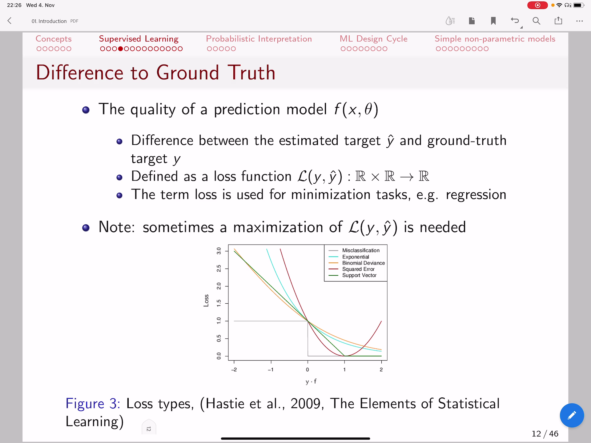
<!-- - `0:10:10`: true why. -->
- `0:10:12`: and the predicted y hat and **loss function: this function measures how wrong are we in our prediction** if the function value of the loss of the difference is small in other words it means that our estimation matches perfectly the real.
<!-- - `0:10:32`: why and that's means that our function f is very curate actually in estimating y given x salt that is great so we want the last to be close to zero meaning that there is no difference between our estimation and the true y. -->
<!-- - `0:10:53`: and in most of the cases we are talking about up a minimisation tusks saw the loss which measures the difference between the true target and our estimation. -->
- `0:11:07`: is a is a function in itself that we want to minimize and in some cases we might want to maximize for example if we want to have to have at a different problem such as for instance a pay **pairwise ranking for search engines there we want to maximize the rankings**.
<!-- - `0:11:28`: quality but when it comes to making mistakes when it comes to measuring the difference between the estimated target and the true target for example in a prediction task that involves a binary variable such as predicting whether a customer pays back a credit card or not in this case. -->
<!-- - `0:11:48`: jesus we want the arrow to be as small as possible in other words we want the loss which is the function that measures the error to be as small as possible and how does that actually work so assume that your why in this particular case. -->
- `0:12:08`: it's a binary variable salt **let's say y...** is in the domain of minus one and plus one.
<!-- - `0:12:19`: and. -->
<!-- - `0:12:21`: as we said we the y had to be the output of a function f when keeping the features x so the logic here is that if we plot the last as the y axis and y times f as the expenses then for those. -->
<!-- - `0:12:40`: cases where f is less than zero. -->
<!-- - `0:12:44`: that means that we will have a negative value for the output of f and if the true target is minus one. -->
<!-- - `0:12:53`: then we would have a negative output of f times minus one that means we are going to have a positive value. -->
<!-- - `0:13:02`: which is what we want in the sense that. -->
<!-- - `0:13:06`: if the actual prediction is minus one we are also outputting negative values on the other hand if the output of f is positive and the true target y is also positive then a positive value types of positive value actually also outputs a positive value and that means a product of y with the alt. -->
<!-- - `0:13:26`: half will be positive if we are making a correct prediction and it will be negative in the other cases for example if the target is minus one and the output of f is positive then positive times minus one will be a negative value and actually not that means we. -->
<!-- - `0:13:46`: doing an arrow. -->
<!-- - `0:13:49`: the same can be said if the true target is plus one for example and. -->
<!-- - `0:13:57`: if the output of f is negative instead of being a positive one so size does not match to the grandchild why or why head is different if it is negative when if y head is negative when y is plus one then negative value times plus one is going to be negative so what we are seeing here is that the cwa. -->
<!-- - `0:14:17`: entity y types fo fx. -->
- `0:14:21`: that is the x axis in this plot **for cases where y times f effects is negative...** that means we are doing an arrow the last is one last remember measures the arrow and if y times f effects is positive it means that for.
<!-- - `0:14:41`: for cases where the true white is minus one f is negative and in cases where the true why is plus one that f is positive that means that the sign of the function f matches the true target y and if that is the case. -->
# ==============0:15:00==============
- 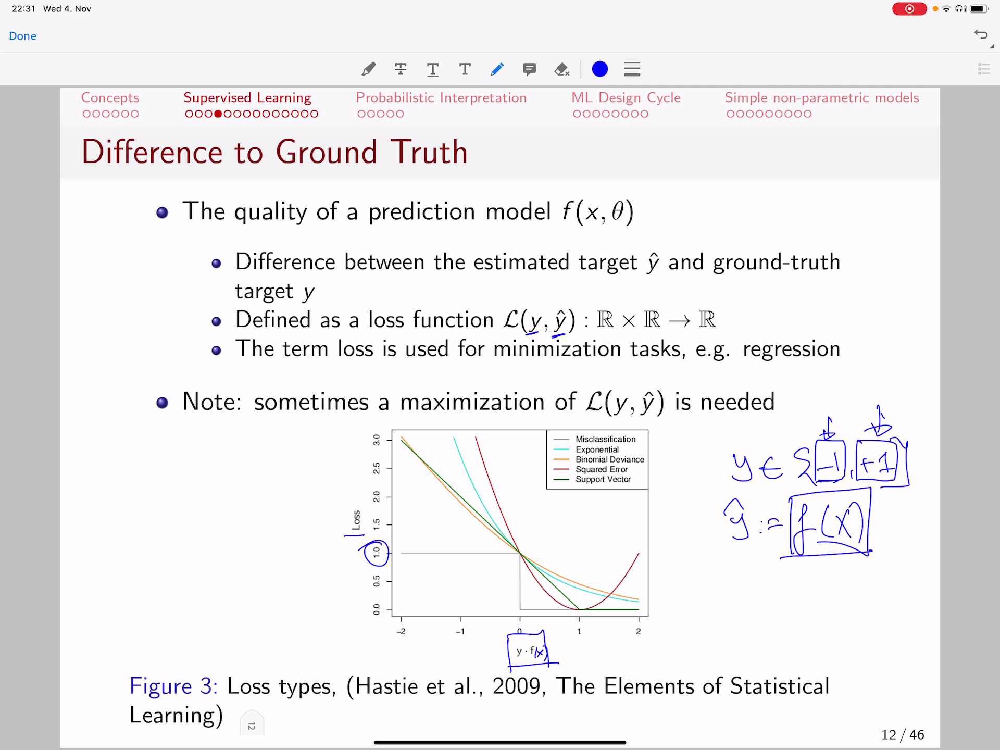
<!-- - `0:15:01`: case that the sight of white and the sign of of f are the same then their product is positive and that means in those cases where f is positive y times f is positive in other words this parts here then our error is zero. -->
- `0:15:22`: because we're not making a mistake the output of the function has matches the output matches the the true why and if we see here that **is actually the way how we measure errors in this particular loss function** and that is just one of one of the different ways how.
- `0:15:41`: we defined a loss function that other ways as well but in this particular case we call this the zero one loss so this is the **zero one or the miss classification loss** what it means is that **if your f in other words the estimation is different from from the real target you**.
- `0:16:02`: **you're making an error and the last is one** on the other hand **if your estimation the output of f matches the true target y then you are doing a correct prediction and then the loss is zero** for cases where y concept is positive so.
<!-- - `0:16:22`: that is actually. -->
- `0:16:25`: the lion that measures the errors however that is **not differential...** and for many algorithms that is desirable property what does it mean to be differential if you check for instance the gradient at this point in time drawing is zero is a flatline what we want.
<!-- - `0:16:45`: is that the gradient is non zero at many points and defined everywhere here at this job. -->
- `0:16:55`: at this vertical line the grinding is not defined and it is zero everywhere else so there is **no mechanism for training some parametric models if the actual error is not up as a derivative of zero** so one way to handle that is to **create some approximation**.
- `0:17:15`: it's the loss function and make the loss function differential saw the way we do it is by creating what we called **proxy losses or approximation losses** some of which you are actually seeing in this video and and in this particular slide saw for it.
- `0:17:35`: asked us you see that all the lions with different colors **there minimum**.
- `0:17:43`: **you said the same place where the loss is zero** sought the minimum of this losses that a minimum of those functions you set at location where the predictions are correct and at the other locations here for example in the pot why.
<!-- - `0:18:03`: they're white i'm saying is negative meaning that the predictions are different from the two targets so we are making a mistake then we are having a high loss in other words we are making a high error what we want to do is we want to have predictions f in a way that they match perfectly i'll target y and that. -->
- `0:18:23`: he's the case where the the product y times f is positive and if that happens and we see all those losses go to zero you know the was they all indicate that we are not making an error and that is the logic of **loss it is a function it is mathematical fuck**.
- `0:18:43`: **action that actually measures how well how we're doing without prediction how well do we measure the difference so it measures the difference between our estimation and the real target** and some of those losses operate when the re.
<!-- - `0:19:03`: real target y has a domain of minus wanted one for binary variables some others operate when the target y is is either in the domain of zero or one such as for example cross entropy that we're going to see in a minute but in essence the logic is the same. -->
<!-- - `0:19:24`: last measures how well we are doing with our prediction by measuring the the difference between the true target and the estimated target and that can be measured for both cases where the target variable is continuous and also for cases when the target variable. -->
- `0:19:44`: is actually nominal nominal meaning categorical such as the case here where we have two categories pay back the credit cutler are not great so we have a notion of a **prediction model** we mentioned that bit earlier that is the **way how we repay**.
# ==============0:20:00==============
- 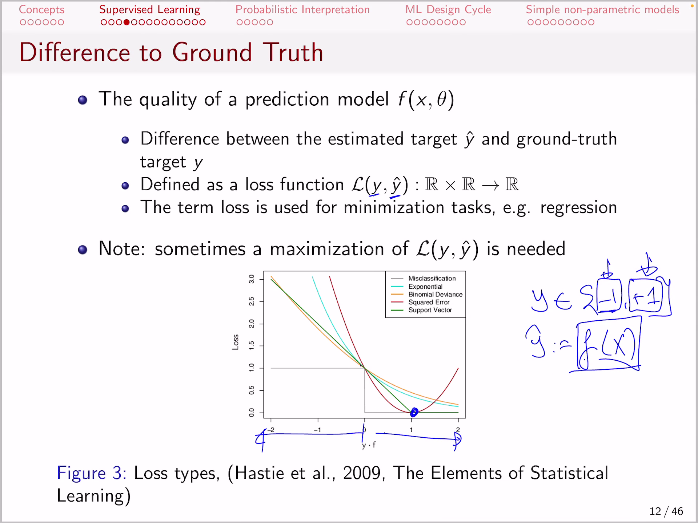
- `0:20:04`: **place an agent** and we take decisions based on the features x we now **also have a way to measure how well apple's predictions actually be taken** by measuring the difference between the true.
- `0:20:21`: estimation y and are approximated estimations y had just the output of a function f and we said that we **model it with loss function which is a way to capture this error** and this last function isn't itself a "helper" function and what we want to do is **we want to train**.
- `0:20:41`: **f in a way that it achieves a small value of loss** not the worst we want to have the predictions in a way with a loss of zero meaning that we want predictions that do that which don't differ at all from the true why you're not the worst of f is a curate in st.
<!-- - `0:21:01`: mating why great now with all those elements we can put all the pieces of the puzzle together and give a first introduction to what supervised learning is. -->
<!-- - `0:21:15`: in supervised learning we are talking bout models trained from data so assumed that you have. -->
<!-- - `0:21:24`: and instances and each instance has em futures for instance customers of the bank and m is the number of attributes that describe accustomed remember from the previous example the age marital status the amount of credit card etc so we did. -->
<!-- - `0:21:44`: find the futures to be the metrics of dimensionality end by m in the domain of real values and we defined the target to be actually a vector in the real value domain that is also in the dimensionality and meaning that for every instance and in the way. -->
<!-- - `0:22:04`: worst for every customer of a bank we know the target whether he was able to pay the the debt or not so that is part of the recorded data futures and targets and we defined for the sake of generality here the target to be from the domain of real values. -->
<!-- - `0:22:25`: it could be from the domain of categorical variables so it can be one of see many categories for example it can be two categories just zero and one or it can be one two three etc so it can be either nominal okay to gorica oid can be a real value. -->
<!-- - `0:22:45`: continuous upward for instance remember from the previous video if we want to predict the price of a house and our futures ex describe actually the characteristics of the house and then what we said is we want to learn a prediction model we want to learn a magic function f machine learning. -->
<!-- - `0:23:05`: it's all about finding this function if we want to find a function f that can correctly approximate our target y in other words we want to learn a mathematical function that solves the problem because being able to estimate the target variable means being able to solve the problem. -->
<!-- - `0:23:25`: the target variable can be whether you diagnose a patient's or not so that is what we want to estimate and. -->
<!-- - `0:23:34`: that's why we defined the output f to be the approximation to why denoted by y head and we have that for every instance and where and in this case. -->
<!-- - `0:23:50`: it's one of our and many instances that we have collected. -->
- `0:23:56`: and with a definition of f when traduced the concept concept of parameters parameters defined the logic how f works with men but that and they are part of the function f so the function **f takes an input being**.
- `0:24:16`: **the features of the particular instance** for which we want to estimate the target and **function f also take some parameters**.
- `0:24:26`: assume that those parameters other the logic how it works and those **parameters actually**.
- `0:24:33`: **will be used in combination with x**.
- `0:24:37`: **in order to capture the way how ics relate to each other** for example what is the relation if we if you want to predict.
- `0:24:46`: that whether credit card or default or not well what is the relation between the age of the customer and then the relation between the age and marital status and the amount of the credit card payment so **you're trying to learn that the relation of the contributing features on the contributing factors**.
# ==============0:25:00==============
- 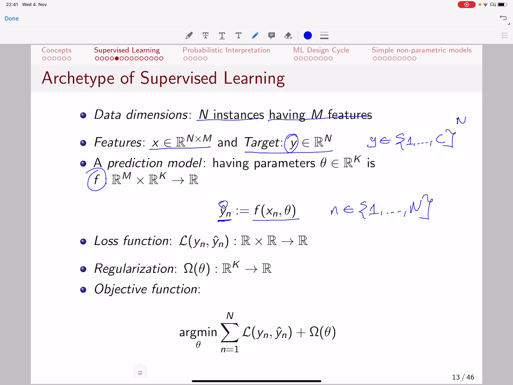
- `0:25:06`: **into making a decision for the target and this relations are actually being combined by those parametrs theta** we're going to see that in a second but just to give you a bird's eye view and then we have a loss function that actually takes the real target why our approximation y head.
<!-- - `0:25:26`: and measures how well are we doing with the approximation how close is the y head to why we are going to see further examples of the last function button of the other loss functions but in essence it just measures the difference between the predictions oid is a quantification of the. -->
<!-- - `0:25:46`: amount of error that we are doing and. -->
- `0:25:50`: then we have something that recalled **regularisation...** we won't go into much details about it at this point but what it means is that.
<!-- - `0:26:01`: our data sometimes have some problematic instances maybe some cases where the customers actually were able to pay back the credit cards but we recorded mistakenly that they didn't or there might be cases where we were not sure whether. -->
<!-- - `0:26:21`: they were married or not that deep maybe provided wrong information so data has noise our data is never hundred percent kid and then if you train your prediction model by trusting blindly your data you might actually learn some noise. -->
<!-- - `0:26:41`: instead of actually learning the actual behavioral task so what we want to do is we want to regulate we want to control this model that it does not always blindly trust the data but that it is able to actually be immune from some problems problems of the. -->
- `0:27:02`: data we call that **regularization aspect the ability of a prediction model to be immune from the noise present in the data** so that is defined with the omega function that we are seeing here and that comes brings us to the final what recalled the objective function.
- `0:27:22`: which is defined here so what the **objective function...** indicates is we want to learn the logic of a prediction model remember if that is what we want we want to have an accurate prediction model and how do **we make the prediction model curate by actually**.
- `0:27:42`: **learning the logic of how the prediction model works** so **feta is actually what we want to control**. **if we control the theta...** we control how f behaves and then if we control fb as we control the estimated targets and if we can control the estimate targets we can make them as close as possible to the true target.
- `0:28:02`: what does that mean it means that we can **minimize loss function with respect to theta**.
- `0:28:10`: and the way we do it is **by minimizing the some of the errors across all the collected instances** in other words if we have thousand customers in the bank we want to make a small arrow since as possible over this collection of thousand instances so if we if we sum.
<!-- - `0:28:30`: the errors that we are doing we want to make as few of those arrows that is what the summation here indicates it is a summation of a some of the errors that we are doing in estimating whether customers will be able to pay back its credit card amount in other words we are trying to estimate the y n. -->
<!-- - `0:28:50`: or the target for every customer index by smoke and in the bank and. -->
<!-- - `0:28:57`: we are trying to make our predictions curate remember why head is defined as f of extent fita so if you minimize with respect to theater you're actually. -->
- `0:29:12`: **apapting your y head in a way that the difference between y and and the estimated y het is a smallest possible** in other words we **tried to minimize loss function**.
- `0:29:27`: **by changing theta** and we also add this **regularization term to make our model immune to data** we will not discuss regular realizations in detail to date but is just for you to know that sometimes what we have is noise in the data and we want to control it so in essence.
<!-- - `0:29:47`: is what supervised learning is can be defined with just this app. -->
<!-- - `0:29:54`: objective function in other words we have an augment of the print prediction model parameters few futile that is a summation of the arrow that we are doing and estimating every single instance of a training set plus some control mechanism. -->
# ==============0:30:00==============
- 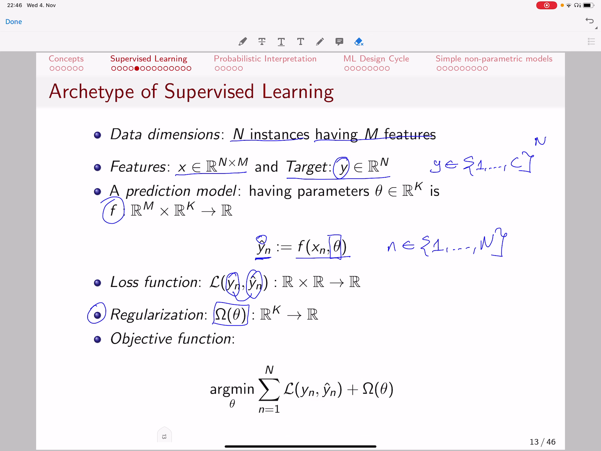
<!-- - `0:30:15`: as we said for the record accusation so that is the objective that we are trying to solve and. -->
<!-- - `0:30:23`: ethanol can be very diverse depending on the type of prediction model that they're using but this particular formalization is actually a universal formalization of the problem that to a certain degree is universal for many of those examples that we are. -->
<!-- - `0:30:43`: going to see and and the algorithms of this lecture sought always we have an objective function we try to minimize it and we minimize it by training the parameters of the prediction model to minimize the amount of errors the amount of errors me as the sum of errors over all. -->
<!-- - `0:31:03`: the training instances that we are doing that is the spirit of supervised learning great but we did not really say anything specific about what a prediction model is we always said yeah we have a prediction model but you never saw something real about it so let's start with a very simple prediction. -->
<!-- - `0:31:23`: model alina modern salt water lina model dust is awaited some of the features ex. -->
<!-- - `0:31:34`: multiplied by some lina coefficients theater in other words for the m many features that we have up for every instance and so and remember it was customer and in our previous example it can be on and on a different example. -->
<!-- - `0:31:54`: having a different semantics but in the previous example was a customer so we have 'em in that case with twenty three attributes and not what we are saying is that well in order to estimate whether a customer will pay back his credit card amount we are giving some importance to each of those features so we. -->
<!-- - `0:32:15`: we can decide well what was the first that the first feature was the amount of credit card so the amount of credit card has some importance we control this importance with this coefficient then for example his age has some importance then maybe the marital status whether his married or not has some importance. -->
<!-- - `0:32:35`: and maybe the importance of age is too high it is a very important factor to decide whether the person might might pay back the credit card or not perhaps older people are more careful to pay back or credit cardinals perhaps the the fact whether he's married or not is not very significant. -->
<!-- - `0:32:55`: in order to estimate whether he would be able to pay the credit card so maybe the coefficient future too for that particular future should below so if you see here. -->
- `0:33:08`: we try to **give some importance to to those actual features** so we tried to learn a model or a logic how to combine different the the relation between different.
<!-- - `0:33:25`: features in this way by just scaling each one of them with a coefficient and that's that ends up being actually that. -->
<!-- - `0:33:35`: the lina model that we see here and it has also some term here simple efficient that recalled peter zero that is the bias of a unit model you are going to see more details about the new models and coming video by the logic here is that what it actually achieves is. -->
<!-- - `0:33:54`: given some pyramid to theater it weights the inputted features in a way that in the end this estimations y head will be trained to match the true y and let's see an illustration he had provided in the plot so what. -->
<!-- - `0:34:14`: you see in the x xs is. -->
<!-- - `0:34:18`: our future here we have just a single future so we don't have as many of them we have just a single one and a white axis is a target why what we see here with a line this line here. -->
<!-- - `0:34:32`: is a function f effects. -->
<!-- - `0:34:36`: given. -->
<!-- - `0:34:38`: some theater. -->
<!-- - `0:34:40`: and feedback here is just. -->
<!-- - `0:34:44`: a few times zero plus futile one time six because we have just single x it's a wonder i mentioned this is the feature that we have the living area of housing square-feet and we want to predict the price which is or why if we train a linear model then it is going. -->
# ==============0:35:00==============
- 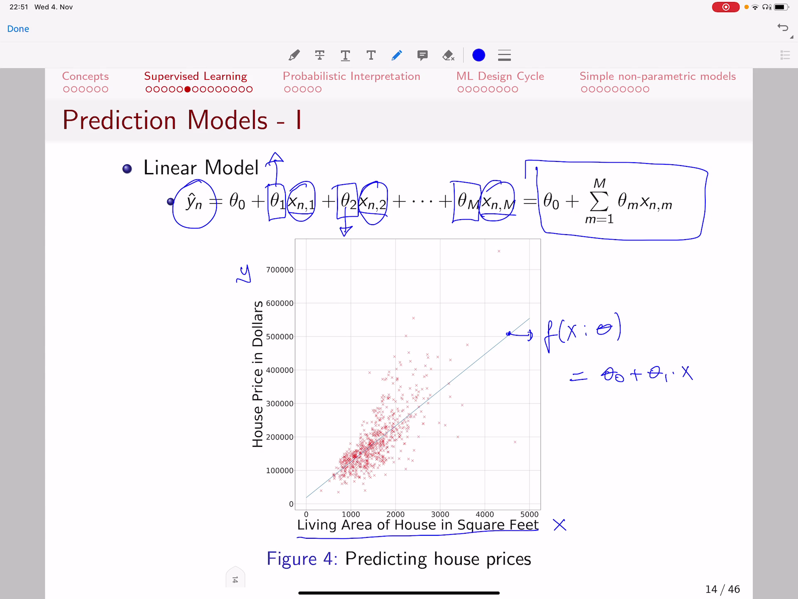
<!-- - `0:35:03`: look like this lina line so that is the model that we're using to predict the price and it here it has been trained to minimize the amount of aerosol the difference between an actual measurement y and an estimation why hat that is lying on this particular on this. -->
<!-- - `0:35:23`: particular line that is line f this difference here will be measured by the loss so the last between why and why head is how far we are is our estimations and our estimation is always light on this line how much do they differ from the actual measurements so here is. -->
<!-- - `0:35:43`: she is identified by this vertical line he can be a bit larger yeah it can be much larger he can be it can be smaller cetera saw this linear model has been trained that the sum of those errors is actually minimized and if you. -->
<!-- - `0:36:03`: see if you want to plot alina alina line that that passes as closely as possible to all those points that is that that informal way of saying that we want a lion to actually have. -->
<!-- - `0:36:21`: the smallest sum of errors to all the points that you would end up with sunlight like this because this passes more closely to the points in other words it has the smallest error to add to those points and with that being said you get the first glimpse of actually what. -->
<!-- - `0:36:41`: a production model is. -->
<!-- - `0:36:43`: and how can you relate a feature to making a prediction in this case adjusted in a model. -->
- `0:36:52`: however a **leaner model is not very powerful in itself because it cannot create capture complex interactions between the different features** at a follow up can be a polynomial model so what a **polynomial model** does is it **models**.
- `0:37:12`: **as interactions between features** for example a polynomial of order to pass terms that that capture the interaction between actually.
<!-- - `0:37:26`: the em feature here and the m prime feature in case you forgot what a polynomial is that for instance if you have a polynomial function f and it will take as an input to features x one x two. -->
<!-- - `0:37:43`: and some theater then you'd have terms such as x one square you would have terms such as x one time sticks to you would have terms such as. -->
<!-- - `0:37:59`: excellent terms such as x two and terms such as extra square and now. -->
<!-- - `0:38:06`: if you consider these two terms were actually the turns that are the same like the ones for the linen modern and. -->
<!-- - `0:38:17`: we have a fetus for them that's called the peter peter one peter two but we also have some fetus that actually are now capturing the relation between the terms so we have a pizza one one the futile one two and the theater to two. -->
<!-- - `0:38:37`: and if with some of those terms we create a second order polynomial. -->
<!-- - `0:38:44`: yup just that you refresh a little bit your knowledge about polynomials up. -->
<!-- - `0:38:53`: we called this terms in the polynomial all of them are what we call mono meals. -->
- `0:39:02`: and the **polynomial is is a sum of polynomials** so some of those more normals are going to have interaction between features for instance this minority here has the interaction between x one and x to solve a polynomial regression is more powerful than a lina model and.
<!-- - `0:39:21`: the reason why it is more powerful is because it can capture interactions between features in other words coming all the way back to our customer example it cannot model the relation between the age and for example whether a person is married and give a coefficient to this relation relation for example. -->
<!-- - `0:39:41`: the person is married and as young age and the product has that small value up this up this coefficient that a one two might be too high and say that hey look if this guy is both married and is young then maybe he will. -->
# ==============0:40:00==============
- 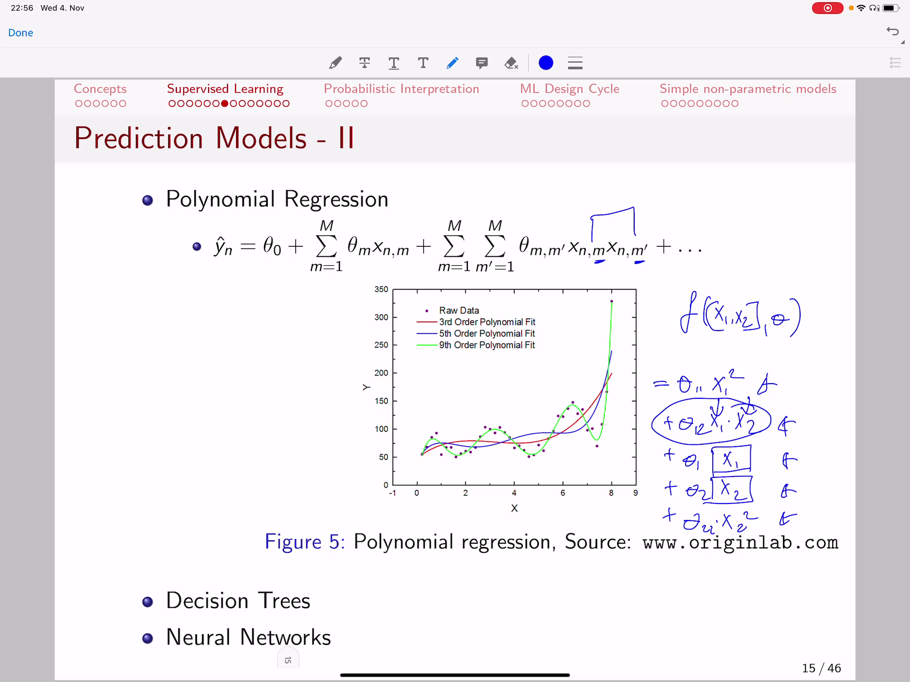
- `0:40:01`: not be able to pay the credit card so we are putting a very high coefficient for that guy and with our feet i want to so you have a **control over theata in a way that it can stimulate or it can downplay the importance of the or the lack of importance of the combination of**.
- `0:40:22`: **two or more extra features** because we say two or more because we can have a third order polynomial fifth order polynomial or whatever order polynomial that is possible and let us see an example here assume we have just a single xml.
<!-- - `0:40:41`: we are trying to learn actually a polynomial. -->
- `0:40:46`: of that single x now **don't be confused you can have a polynomial of a single x...** it just means you have terms for example if we are having a five order polynomial you're going to have that as a term with some theta and let's call that the theater for the few.
<!-- - `0:41:07`: order five plus you're going to have a feet up for the fourth order. -->
<!-- - `0:41:14`: of extra power for plus a theater for the x to the power of three plus extra power of two with a theater class a theater. -->
- `0:41:29`: four x classify it as zero so that can be your f of x given the fetus so **you can have have a 5 order polynomial even if you've only a single feature, is just you have powers of that x** and if you do that for ap if you train the key.
<!-- - `0:41:49`: correct fetus for a five order polynomial using the data provided here this this this dots then you'd see that your polynomial will look like the blue line. -->
<!-- - `0:42:04`: if it if it will be trained to minimize the loss function as we said earlier the objective function we're not covering at this moment how exactly those parameters will be trained because we have further lectures to do that but we are just showing the concepts of what prediction models can actually achieve. -->
<!-- - `0:42:24`: and with that in mind we can mention that if you increase the the order of the polynomial you feed the data better and better because it because it captures more and more relation between the features and as a result it can. -->
<!-- - `0:42:41`: capture complex interactions and feet your data better so what you are going to see is that if you increase the degree of the polynomial you actually pass more and more closely to those points for instance this green line passes much better through to the points than the actual row. -->
<!-- - `0:43:01`: red line however if you have a new point here. -->
<!-- - `0:43:08`: that is your new ext maybe ex-prime and you want to now predict. -->
<!-- - `0:43:16`: what a what would be the white prideful that ex. -->
- `0:43:21`: **which one do you think is better likely the prediction of the red line likely the prediction of the the green line...**
<!-- - `0:43:32`: so that depends it seems in this case the prediction of the green line is better so in this case you might want to have the ninth order polynomial fit in other cases you might want to add a third order polynomial fit it just depends on the data there is no magic formula formula for that you're going to see. -->
- `0:43:53`: techniques in the future lectures on how to actually control the complexity of your prediction model and with that being said we can mention that there are actually **!!!other types of prediction models** that one can use such as **decision trees** and **neural networks** and we can move a bit a bit and disk.
<!-- - `0:44:12`: scribe them for instance your model can be a tree in this case we have an illustrated example where we have three futures at whether a patient now this isn't up at assessing the risk of medical patients it is a it is an example here and our base. -->
<!-- - `0:44:32`: once they have three features that describe their condition whether their their systolic pressure at ease. -->
<!-- - `0:44:41`: it is a real valued features of choice the pressure that you measure with a device or you know the age and you also know whether or not they have the sinus tachycardia. -->
<!-- - `0:44:53`: and then the decision tree is actually composed of nods where you take decisions and the first decision actually checks whether the systolic pressure is greater than ninety one if yes you output that the patient is at risk if not then you check the age. -->
# ==============0:45:00==============
- 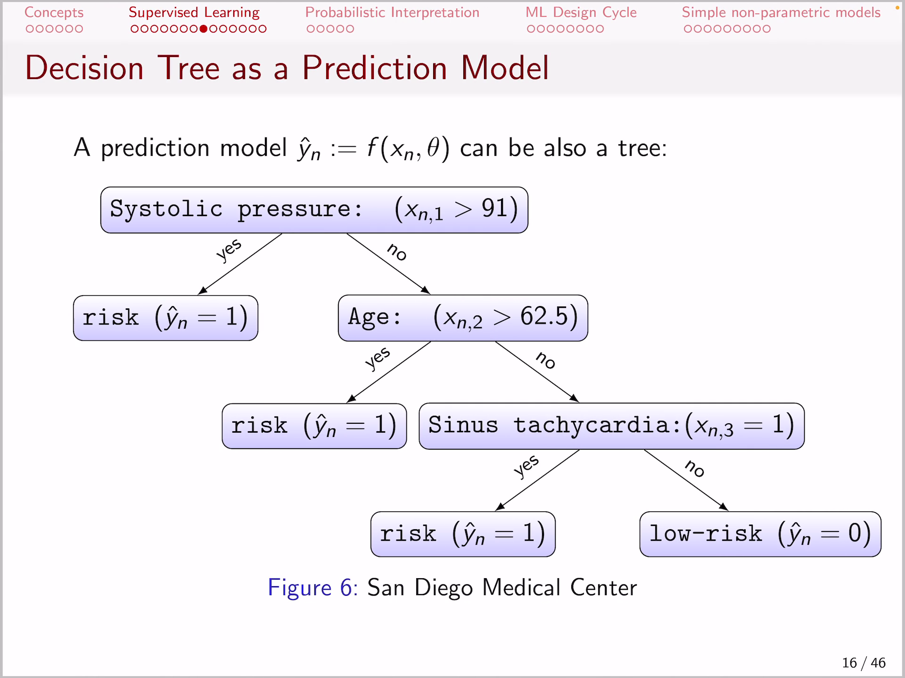
<!-- - `0:45:13`: if he has an old person. -->
<!-- - `0:45:15`: greater than sixty two was age is greater than sixty two point five that is risk patient otherwise your check whether he has a sinus tachycardia if yes is a risk patient otherwise he is low risk so if you check here carefully you also see a mathematical function because decision trees were. -->
<!-- - `0:45:35`: which by the way are very very popular prediction models in machine learning they are also functions and a decision trees in fact stepwise function. -->
<!-- - `0:45:47`: so if we consider the plots in the picture on the left hand side what we are seeing here is up. -->
<!-- - `0:45:55`: a single future ex and a target y and the on the right plot we see how a decision tree is actually mimicking the target y how the estimation why head which is the output of fx is actually approximated y and we see that it. -->
- `0:46:15`: does that by using steps that's what decision trees do they build step wise functions and the actual read function that you are seeing this **red lines**.
- `0:46:27`: **i actually the output of the decision tree** than that you see here for instance we have the first decision is excreta then three are not so basically if it is greater than three it is this region if it is lesson three it is that region and if it is greater than three we check y.
<!-- - `0:46:48`: whether it is greater than four point five so basically then we have. -->
<!-- - `0:46:53`: the decision whether it is this region here or that region there and if it is greater than four point five then we output two point five which is this value here. -->
<!-- - `0:47:07`: and if it is not greater than than four point five meaning that it was in this region here then we output one point eight which is this value here saw a decision tree is actually a function that is a stepwise function so in essence it is a mathematical function to and that is a candy. -->
- `0:47:27`: date for our prediction models another candidate and neural networks which we have lecture that is coming it in the fourth in the forthcoming weeks we're not going to spend much details at this particular moment in time however it's worth mentioning that the decision of a **neural network models**.
- `0:47:47`: **take decisions or make outputs by actually also capturing the interaction between features...** but they do it in a different way they do it by first having some combination of features and defining some functions for those combinations and.
- `0:48:08`: then they have other functions with input is the output of the first function so what we are talking about is composite functions functions of functions and for instance if you have if you have a neuron index i.
<!-- - `0:48:26`: that isn't an inner function f i of of x and it's neuron is in essence a functional peter i and what we have here for is for example in this in this illustrated feature picture is that a neuron c takes as an input the output of neural a. -->
- `0:48:46`: and neuron b also takes as as an equal the output of your a and then you're on d takes it as an input the outputs of neurons seat and europe be **so neuron d is a function of those neurons c and b..** and those neurons c and b they weren't there.
- `0:49:06`: themselves the functions of the output of urinate so actually with respect to the input now we have a function of a function of a function as an output.
- `0:49:19`: saw the output is function of of c and b c n b where a function of eight and eight was **a was function of the input** so that's what neural neural networks aren't they are prediction models however they are not defined in a way like a dinner model for example.
- **not a single function like previous prediction models**
<!-- - `0:49:39`: that is just a function of a decision tree that is a function neural networks are functions or functions or functions so you'll take the output of a function put it as unable to another function and then take it take its output boarded up as unable to the other function and you make a very very deep composite function that actually then. -->
<!-- - `0:49:59`: becomes very complex and is able to to learn how to estimate the target y very complex tasks. -->
# ==============0:50:00==============
- 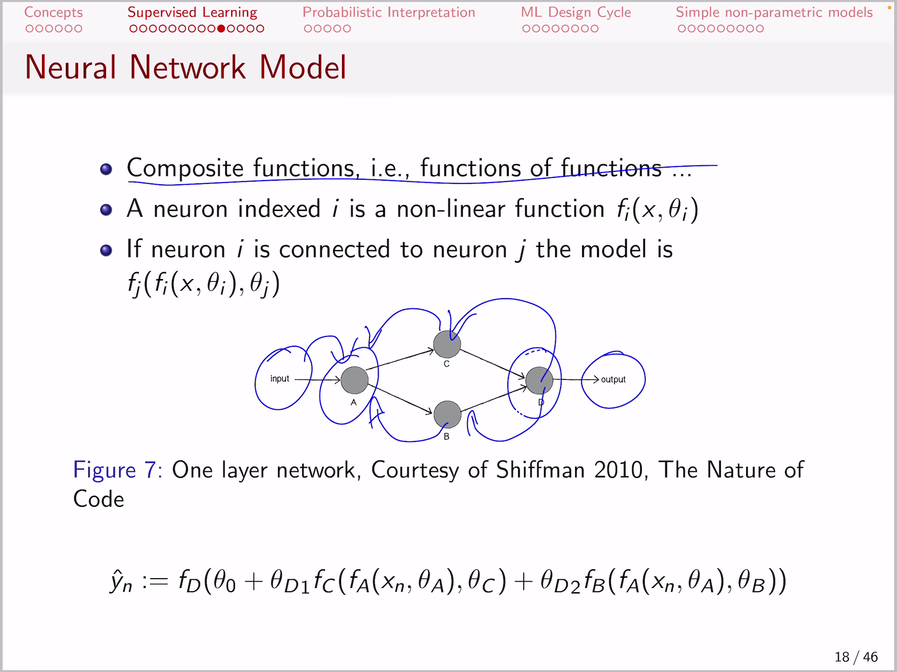
<!-- - `0:50:09`: great. -->
<!-- - `0:50:11`: then let's move a little bit and describe what are some real loss functions well they depend basically on the type of problem that you're trying to solve and that usually is related also with the domain of the target variable if it is a real valued one. -->
<!-- - `0:50:31`: such as for example the house price up then you measure the difference between the the real y and the y hat by just actually computing that the difference and taking the square we call it. -->
<!-- - `0:50:48`: the list. -->
<!-- - `0:50:54`: square error. -->
<!-- - `0:50:56`: or the least square error loss and we also have the absolute value of the difference as another candidate for the loss we call it the elwha loss. -->
<!-- - `0:51:09`: furthermore if you have a classification task meaning that your target is a zero one but it is a zero one variable. -->
- `0:51:21`: then we defined the last to be actually the lot logistic last defined here in the slide and what does the **logistic loss tells us...** well assumed that your y hat.
<!-- - `0:51:38`: he is actually a probability in the sense that. -->
<!-- - `0:51:42`: it is in the range between zero and one. -->
<!-- - `0:51:47`: now if your y n is zero then this term here would become zero because y n is zero and basically zero times log off of white y hat of n is zero and one man minus y n. -->
<!-- - `0:52:07`: then becomes one in the case where white and his era saw you have this right hand turn being nonzero and the left hand turn being zero however in the other case. -->
<!-- - `0:52:21`: whether y n is one then one minus one this time he becomes zero and in that case this right hand side becomes zero because one minus y n zero when y n is one however if y is one then here you have one in this part he becomes ground zero. -->
- `0:52:41`: so in other words what we are seeing here is a **switch function...** so this function is is a switch in the sense that for cases where y n is zero this site would be actually active and in the case where y n is one decide would be active and.
- `0:53:01`: they're perfectly symmetric now let's take **just one of the sides...** let's take the quantity of **y n types the logarithm of y hat n:**.
- `0:53:15`: so for what values of y had n does the logarithm go to zero it goes to zero the **logarithm goes to zero if actually the quantity of y hat n goes to one beacuse the logarithm of one**.
- `0:53:34`: **is zero** and **for values that are smaller than at than one** in another case in other words for values of y hat that go towards zero then **the logarithm of very small values would be a negative quantity** and **remember you have a minus front**.
- `0:53:54`: so **if have minus one times the logarithm of some very small value** here as y n that is going to be **a negative times negative value** here if y hat n is very small so that means minus one times a negative ad you would **actually be a large positive value**.
- `0:54:15`: and that means this last **function here is going to measure high error in cases where your y hat is zero when the true y was one because you are making a mistake**.
- `0:54:28`: **on the other hand:** if in the case where the the true y end was one and your estimation your wife had your prediction was close to one the logarithm of one becomes zero and that means the product of the logarithm times and one also becomes zero which means you are doing zero.
- `0:54:48`: ara ara because you're outputting a probability close to one when the two target is also one that which is what we want **and this other loss term here that is actually symmetric...** so you can do that the method tom it's actually exactly the same thing.
# ==============0:55:00==============
- 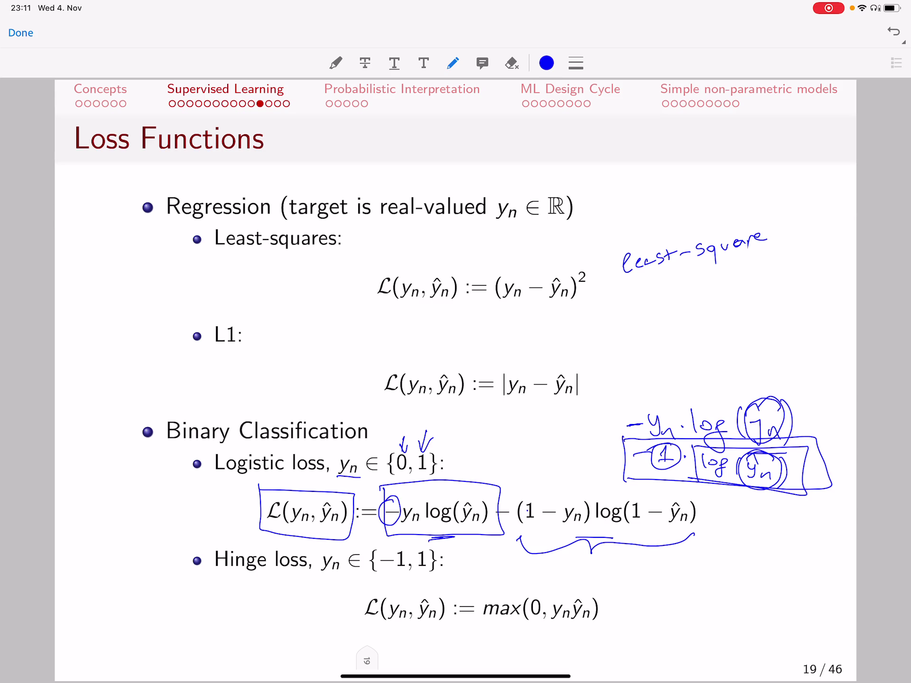
<!-- - `0:55:08`: so if if y m b would be zero then what you want is one minus way and you also want the predicted probability to be zero because one minus zero venice is logarithm of one and then the error is zero. -->
- `0:55:23`: cases of the multiclass classification which is defined with multiclass loss at that we define as the **softmax loss:** saw that is for the cases where your **target variable is actually defined not as two category**.
- `0:55:43`: like in the binary case either be zero or one but for cases where you have more than one category for example you want to **classify an image as being either an airplane or a vehicle or bicycle** so you have more than two categories the strategy how to handle those cases history express that.
<!-- - `0:56:03`: target variable as actually being. -->
- `0:56:07`: as many binary targets as the aca terrorists saw is it an airplane yes or no is it a car yes or no is it a bicycle yes or no so **we divide we will divide the multi categorical problem into a set of binary problems**.
- `0:56:28`: **that zero one for each of those categories** and then the **strategy is to learn one prediction model separately for every category** so we learn one prediction model to predict whether it's a bicycle or not one whether it is.
- `0:56:45`: whether it is a a car or not etc and **then we connect them together with this formula here...** so what we say is that we make a prediction for the class c out of capital see many classes and we normalize it by the.
<!-- - `0:57:05`: some of the probabilities of all the classes together and that she ensures us that we will have a probability distribution of c because if we have a value let's say if each to the power of f of x and pita see that miss. -->
<!-- - `0:57:25`: the estimation that we have for the emf instance in our dataset with respect to the parameters for the c class in other words what is our prediction for the target of the sif class after we decomposed the tasks of the multi category. -->
<!-- - `0:57:45`: task into. -->
<!-- - `0:57:47`: binary classification tasks and well that is divided by the sum of all the predictions for all the classes because if we do that then the sum of the probabilities it is going to sum to one for example let's just creator. -->
<!-- - `0:58:07`: a fake artificial example let's say that each of the two the power of f fought some x and with respect to theater one where let's say just that was three point two and you with respect to f extend with respect to the theater to that. -->
<!-- - `0:58:27`: it was one point two and let's say that you till the power of f with respect to a theater three. -->
<!-- - `0:58:35`: was your point seven then if we want to predict. -->
<!-- - `0:58:41`: for the second class at is just one point two divided by three point two plus one point two plus zero seven and if want to predict for the third class that is zero point seven divided by three point two plus one point two plus europe seven. -->
<!-- - `0:59:02`: as you see if we have to do that also for the first class let's do it in the end we have three point two divided by three point two plus one point two plus europe and seven and if you see their summation is going to be one because one point two plus europe and seven. -->
<!-- - `0:59:21`: three point two if you sum up those three popular is that going to some to one saw you created a probability distribution of these classes. -->
<!-- - `0:59:34`: and that each one of them is going to be between zero and one because every component is actually smaller than the than the sum of all components saw at this components in the nominated they're going to be all smaller than the than the sun because the sum includes the part in the nominated. -->
- `0:59:53`: and for this reason you have each one of them defined as a probability because they are between zero and one and across the classes the probabilities sum to one so that is the logic behind behind this this transformation here we **call this a softmax transformation**.
# ==============1:00:00==============
- 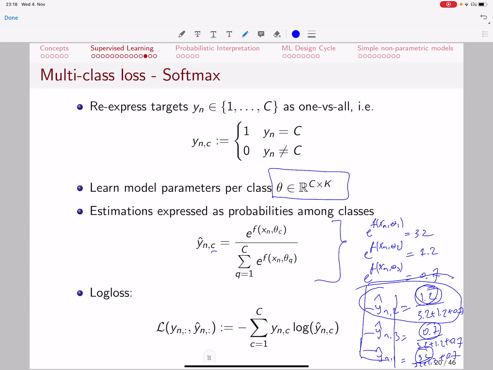
<!-- - `1:00:13`: formation and. -->
- `1:00:16`: then the **loss that we are having...** is basically well how well does the probability for the c-th class match the true target of the cth class.
<!-- - `1:00:28`: neither to target was one which is coming from our definition above the definition above remember when we created a binary targets out of multi categorical variable that is either one or zero if that particular instance is classy or not and if. -->
<!-- - `1:00:49`: and then we want to make this part here be close to zero and if we the only way we can make it trust two zero is by making this y and c actually be close to one so even that is crossed one and the logarithm of one is zero and that means that. -->
- `1:01:09`: this last function here **is going to actually be small only in the cases where our prediction matches exactly the case off**.
- `1:01:22`: **of the instance for the class where it is one**.
<!-- - `1:01:27`: saw that is the last definition for multi categorical variables now we come a little bit to the concept of regularisation wet which we very very superficially covered sought we have a further coming lecture for this point but i just want to. -->
<!-- - `1:01:47`: the mention that that we have here the concepts of undefeated and all the fittings undefeated basically is. -->
<!-- - `1:01:55`: that our prediction model. -->
- `1:01:59`: does not accurately approximate the data so instead of passing a little bit better to the data sought instead of being something like that **our prediction model is a flatline so so does a lot of error**.
- `1:02:16`: **in actually**.
- `1:02:18`: **correctly approximating this instance** so **we say that the prediction model is undefeated the data**.
<!-- - `1:02:26`: we have as i said another lecture to come on it and appropriate the appropriate capacity or the appropriate expressivity of a prediction model is well when it just. -->
<!-- - `1:02:38`: that can estimate the target variable so the target variable y is estimated by this line which is why head f of x at points on this black line are actually our estimations and they actually match our estimation of the point on the line matches the actual measured point. -->
<!-- - `1:02:59`: with a black dot but we can also have cases where where we can have this also has a prediction model it still passes very closely through those points however we see that. -->
<!-- - `1:03:12`: there is something wrong going on here because this likely is not the correct lie so we have enough of a feeding behavior there and how do we measure that how do we control that well if we have some new data ex and we know that the true target is y then we would see that well. -->
<!-- - `1:03:32`: this prediction models of this line that oscillates is actually not passing the lost boys. -->
<!-- - `1:03:40`: what we want to have is not undefeated not overfeeding behavior we want to have the right capacity of a prediction model for which we are going to investigate some more efforts in the coming lectures. -->
- `1:03:53`: and yes the **regularisation is just trying to do that it tries to find that the right settings of your prediction model in order to not make a prediction model of or overfeed or undefeated** for example here you have a case of regularizing polynomial.
<!-- - `1:04:14`: regression we won't go into the details is this is just an illustration to see that there are mechanisms that you can control the characteristics of a prediction model in a way that you that you have a prediction model that passes nicely through the data does not oscillate lot it does not under feet. -->
<!-- - `1:04:34`: but it just passes close to it and it is it is extra smooth and simple that are with you watch the concepts of regular recession in this context so thanks see you in the next video. -->
- "bei **logloss:** eine von den yn,c unter C wird 1 sein und die beiden anderen 0. log ist bei 0 maximal negativ, was sich durch das - zu maximal positiv wandelt. Wenn an dieser Stelle nichts nahe 1 für y hat steht, dann wird es mit der 1 multipliziert maximal positiv, also nicht gut. Wenn da etwas nahe 1 steht, dann kommt da log(1) = 0 raus und die mal 1 * 0 = 0."
