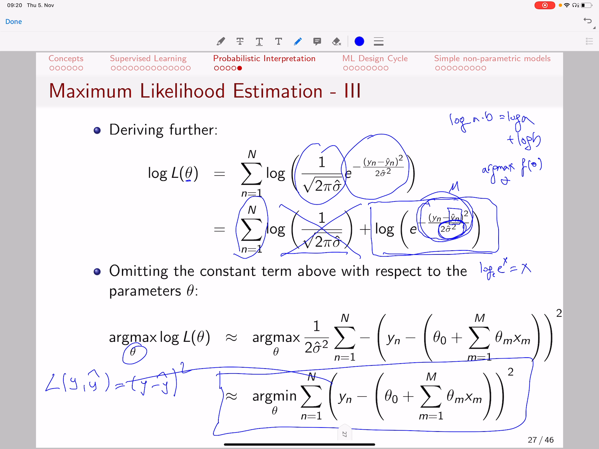

<!-- /home/areo/Videos/Machine_Learning/01._Introduction_-_part_3.MP4 -->
<!-- /home/areo/.config/mpv/mpv.conf -->
[toc]
# ==============0:00:00==============
- 
<!-- - `0:00:01`: hello and in this part of the video we are going to cover two sections of this lecture first we are going to describe a probabilistic interpretation of what you have seen in the previous section so remember we covered at what prediction models are. -->
- 
- `0:00:20`: what loss functions are and then afterwards at how do we define an **objective function that minimizes the loss function by updating the parameters of the prediction model** and it feels like that is a sort of a given formulation however have seen the sec.
- `0:00:40`: then that there is a probabilistic logic behind the last functions that you saw and we are going to see that actually **minimizing the least square error is equivalent to maximizing the likelihood of observing the target give them the data** shop.
<!-- - `0:00:58`: to start with the concept we're going to bring into our attention a modern that is our model f of x and phaeton outputs our estimation to the target y head and in this case it is a leaner model it could be. -->
<!-- - `0:01:18`: be a nonlinear model too but for the sake of simplicity consider that these banana modern then our next assumption is that the errors that such a model does are normally distributed at and that the mean off of the errors is located at. -->
<!-- - `0:01:38`: the estimated target. -->
<!-- - `0:01:41`: so what that means is the following. -->
<!-- - `0:01:45`: if you have for instance. -->
<!-- - `0:01:48`: a regression task where you have just a single feature and you have the target which you want to estimate and assume that you are having some observed data instances as the ones shown with dots then if you fit a linear model that likely is gone. -->
<!-- - `0:02:08`: to be this one and that is the output of your prediction model f given x and fita which in the current case is going to be if he does zero plus the taiwan times x because you have just a single x while in the general case you can have as many future. -->
<!-- - `0:02:28`: hers and now if we see we would not as that well sometimes i predicted y head which is always the points on the line so those are the white hats for giving x this is the y head and maybe for this given x. -->
- `0:02:46`: this pointy years the y head so the **y heads are always points on the line** and you notice that well sometimes the estimated value is smaller than the than the real value saw for it for example here or sometimes it is larger than the estimated value for example here and **what this assumption**.
- `0:03:06`: **tells you...** is that well the estimated value are a plus minus at those of the real values shop they tried to approximate the real values however there is some error involved and this error is normally distributed so if you have for example here.
<!-- - `0:03:27`: the estimated value sometimes you'd have. -->
<!-- - `0:03:32`: values real values that are smaller sometimes at a higher however on average the highest density would be at the predicted value. -->
<!-- - `0:03:44`: and then there is where you'll have the smallest error actually at the point of the estimation at that that the the height the smallest likelihood for an error and then the likelihood of an error or decrease as the real up absurd value is too different from. -->
<!-- - `0:04:04`: estimated value so you're going to have at this point what we can call the mean of the prediction and you have some standard deviation. -->
<!-- - `0:04:15`: what this assumption says is that. -->
<!-- - `0:04:19`: this distribution of actually errors or in other words the differences between the y had the points on the line and the extra data those differences are normally distributed and they mostly are lying close to the line however you have some that are away and. -->
- `0:04:39`: the **actual distances between the line and those points if you plot them they are going to be normally distributed** like we shown here.
<!-- - `0:04:49`: great so what it's actually indicates is that the model generates estimations that are normally distributed they are located at an average value at a mean being the prediction of this lina model and have a certain variety. -->
# ==============0:05:00==============
- 
- `0:05:09`: sigma square saw that his assumption that actually we are **talking about a probabilistic model one that does errors and those errors are normally distributed** and **the mean value of our predictions is going to be the output of our prediction model**.
<!-- - `0:05:29`: great so with that probabilistic definition of a prediction model we move to the next point. -->
<!-- - `0:05:37`: we are going to see that. -->
- `0:05:40`: **optimizing and minimizing a least square loss is equivalent to maximizing the likelihood of the data** what do we mean with liking of the data women with defining a probability density function which is going to be defined as the **p head**.
- 
- `0:06:00`: **that is an estimated probability density function** which actually describes the **likelihood of observing y given x** salt and that is being done based on the mean prediction that is controlled by the parameters theta what it actually says is that.
- 
- `0:06:20`: at well given extend our prediction model we actually want to have an accurate prediction that means the likelihood of predicting y given x and the prediction model should be as high as possible so the **probability of observing y given the features should be actually a large as possible**.
- 
- `0:06:42`: and well **it should be large on all the measurements that we have seen...** so i should be large on the first data point given them the first observed features and the predictions of a model and it should be high on the second data point.
- `0:06:59`: it should be high as well on all the other data points so if we want to jointly maximize the probability of observing those data points than **what we have to do is maximize the product of the probabilities** so we want to make this probability high and that probability high.
- `0:07:19`: and then probably that the eyes to what we want to do is make the product of all the probabilities as high as possible and **that results in this formulation here above that we are actually showing** that **is what we call the likelihood** so **we are going to**.
- 
- `0:07:39`: **have to maximize this likelihood in order for a prediction model to be accurate in estimating y** so as you see here **we have a product of all the elements and the elements are the probabilities** that is what we need to maximize that's why we call it maximize the likely.
- `0:07:59`: dude this is the likelihood of their observations given the data and **the maximization means, train the parameters theta in a way that the likelihood of observing y is the highest possible** we have vent two questions here the first is well what do we do with that how do we handle.
<!-- - `0:08:19`: all it and the more concretely what should be the values of theater that actually maximize the picom see window movement behind transparent terminallikelihood well we have to estimate that we have to compute which theater actually will provide some average prediction some in predictions which are as close as possible to why not. -->
<!-- - `0:08:40`: in other words that maximize the likelihood of observing why. -->
<!-- - `0:08:45`: and before we start without a derivation remember some trivialities from your mathematics course the logarithm of eight times speed is equal to the logarithm of eight plus the logarithm of b and that if you want to maximize the function g. -->
- 
- 
- `0:09:03`: the point that achieves the maximum of that function that means the pyramid a few times by the way **when we say arg min or arg max...** it means that **it will output the value of the variable that achieves the minimum or maximum of function shot**.
- `0:09:20`: the **minimum of f effects basically means that we want the smallest possible value of the function f** while if we say that **argmin x of f of x what it will output is at which value of x will the function f have achieve it's mininum**.
- `0:09:40`: mom saw **this formulation here with output the best x while this formulation here without the best f**.
<!-- - `0:09:51`: in the sense the smallest f and the extent of chiefs the smallest staff. -->
- `0:09:56`: so with that being said what we say **what we are actually observing is that the arc max of a function g doesn't change if we if we add the logarithm because...** gf if you have for example.
# ==============0:10:00==============
- 
<!-- - `0:10:12`: and let's say this is. -->
<!-- - `0:10:16`: g of theater for theater then if you take the logarithm is going to be out may be something like that it might not be fully accurate but just for you to get the concept if this this is the g of theater. -->
<!-- - `0:10:31`: and saw the maximum here. -->
<!-- - `0:10:34`: it's going to be at the same futile location. -->
<!-- - `0:10:39`: and that's why the okmok of g is equal to the okmok of the longer with the actual values of the function change but what it doesn't change what doesn't change is the location of theater that achieves this maximal so we can safely assume that adding the logarithm does not change the artemis great now we. -->
- 
<!-- - `0:10:59`: needs to derive the product because working with products is difficult so what we will do is we are going to take the logarithm of those products so are going to take the logarithm of the probability of the first data point given x one theater types to pro. -->
<!-- - `0:11:19`: probability of the second point given is to give an x two and theater times the probabilities until the last probability of y and given extent and theater so what that will result is actually based on this rule. -->
<!-- - `0:11:39`: all above it's going to result in the logarithm of. -->
<!-- - `0:11:45`: the probability of the first data point. -->
<!-- - `0:11:49`: plus all the terms until the last logo written. -->
<!-- - `0:11:55`: of the last data point y n given extend and theater. -->
<!-- - `0:12:02`: yup so that is just to show you that by this very simple mathematical derivation then we go from a product of terms to a summation of the logarithms of the terms and now remember we said that this probability here is normally distributed so the. -->
<!-- - `0:12:22`: errors are normally distributed that means the probability of y n is normally distributed so if we plug the actual formula for the normal distribution that is going to be the one that we see here then what we are trying to maximize is the maximum. -->
<!-- - `0:12:42`: rising this term here the maximum likelihood is equivalent to maximizing the sum of the logarithms and the other logarithms of the probabilities so if we replace a probability by it's function that actually what we want to maximize is. -->
- `0:12:58`: again the logarithm of the likelihood and that means it is that the sum of the logarithms of the actual formula definition for for a normal distribution and that means **we want to maximize the function that we are seeing here** so we want.
<!-- - `0:13:16`: to maximize. -->
<!-- - `0:13:18`: this. -->
<!-- - `0:13:20`: that is our objective. -->
<!-- - `0:13:23`: well how do we do it we need to derive this term further first of all here's what we see is that we have the logarithm of two products remember again logarithm of a times b is equal to the logarithm of eight plus the logarithm of b saw the lager. -->
- `0:13:43`: read some of this ten times the logarithm of this term is going to be the logarithm of the first plus the logarithm of the second and now what we see here is that well actually **with respect to feta this term is a constant and if you want to maximize that with respect to fita**.
- `0:14:04`: **the constant doesn't matter** so what it means is that the augments of a function f a theater with respect to the theater is the same as the arg max.
- `0:14:17`: of a function f a feet up classic constant with respect to the feeder **why is that the case...** so well assume you have a function and this is the maximum value the theater that achieves the maximum value this is the f of utah if you add a constant.
<!-- - `0:14:33`: and dysfunction here is f of theatre plus see if the constants dispositive then what you are going to see is that the function just shifts but the maximal value would remain the same so if you have constance and you need to find the maximum you can drop the constants they don't change the location of the maximum. -->
<!-- - `0:14:52`: so with that being said we are left with just one optimization turn that is the optimization time here and here we have a further triviality shock what we are seeing here is that if you have the logarithm of the expected value. -->
# ==============0:15:00==============
- 
<!-- - `0:15:13`: and here we assume that we have the logo written with with that the the base of heat that is. -->
<!-- - `0:15:22`: the logarithm with base e of e of x is equal to x that is the mathematical property of of logarithms and we are going to see here that the logarithm of equal the power of minus something is actually going to be the spine of something that you hear. -->
- `0:15:40`: shop the logarithm of the exponent will leave us just with a terminus white and minus the estimated value of y n. **why the estimated value remember, because that was the average of our predictions...** so in the in the normal distribution this is the mean M and because up on every.
- `0:16:00`: which the predictions are the ones that out prediction model outputs then the the average value in the in the normal distribution is replaced with the output of our prediction model and this is the term that is left out this time here is what is left out after cancelling the logarithm at the end the exponent shop.
- `0:16:21`: we can take it out and **remember we have a summation of all the data items...** up so the data instances that remains here and **then we have minus y n...** minus this was our estimated and in other words the output of.
- 
- `0:16:40`: **our prediction model which in the previous case was a lina model** and **now what we can do here is the following we take this minus**.
- `0:16:52`: **and we change the the problem from a maximization to a minimisation...** because remember maxim maximizing.
<!-- - `0:17:03`: let me write it nicely. -->
<!-- - `0:17:07`: remember. -->
<!-- - `0:17:10`: the art much with respect to the theater of minus f of theater is equal to the augment of the top with respect to f off the top so if i change the sign of a function then this optimization problem is equivalent to actually fly. -->
<!-- - `0:17:29`: keeping the problem from a maximization to immunization. -->
<!-- - `0:17:33`: and that is actually obvious right if you have. -->
<!-- - `0:17:39`: for example if you have minus f a future that the actual up. -->
<!-- - `0:17:46`: maximum values are going to be those close to plus two zero in the case where f is positive for example so you don't want you don't want minus one thousand you want that do such as minus one because the smaller they are the larger they are if they have minus at the end and that is equivalent to actually minimizing prepare yourself. -->
- `0:18:08`: great saw an ad in essence that is actually what is being done **we convert the the maximization to a minimisation and get rid of this minus sign** and **we also can get rid of this term here one divided by two --standard the two variance**.
- `0:18:26`: **squared-- up sorry two variance two standard deviations square** and that is coming from this party above now **why can we get rid of that...** we can get rid of it because again if you have a function.
- 
<!-- - `0:18:43`: and you have the minimum of that function futile then multiplying this function by by a to a constant time see that doesn't change the location of the box maybe the function will become something like this. -->
<!-- - `0:18:58`: but it's actually maximum location would remain the same. -->
- `0:19:03`: the constants don't change that the location of the maxim so if you are interested just on finding that location you can get rid of constant tips and that means **we end up with**.
- `0:19:17`: **the formulation below...**.
<!-- - `0:19:20`: which says the following it says that maximizing the likelihood of observing the target variable given the features and the predictions of our model which are the average values in a normal distributions. -->
- `0:19:40`: it ends up equivalent to this term here well **what is this term here...** remember out less liquid arab was.
- `0:19:50`: why minus y head squared and if you **remember the objective functions that were described at when we talked about the supervised learning concepts...** **that was equivalent to minimizing the loss function of all the**.
# ==============0:20:00==============
- 
- `0:20:10`: **n data points** and the last function was be between the nth target.
- `0:20:17`: the estimation of the target and **if you then replace lost with this new square error here you end up with actually this formulation** sought as you see here **maximizing the probabilistic likelihood of observing targets if you assume that the errors**.
- `0:20:37`: **are normally distributed that is equivalent to just learning a prediction model that minimizes the least square error** and that just shows that **when we say we minimize the least square error we just don't do it for the sake of let's say that is a good way or or let's do it for whatever**.
- `0:20:57`: **reason but we do it because it tests a key probabilistic interpretation behind and that is what does this section of the course tells you**.
<!-- - `0:21:07`: great so we're not going to talk a lot about probabilities and that the probabilistic inference part of machine learning you have instead a course at the university of the sun which is titled supervised pattern recognition and offered. -->
<!-- - `0:21:27`: by professor thomas brock's app that is more focused on probabilities and the aspects that relate to two probability distributions and sampling strategies this course will have actually more let's say types of methods types of representation learning some optimization algorithms. -->
<!-- - `0:21:47`: but not so much probability theory behind cetera interested in that you can follow the the the course by professor brooks now. -->
<!-- - `0:21:58`: so far we discussed what machine learning is we discussed what the supervised learning task is what does it mean to have a prediction model to make estimations of a target at what does it mean to have lost that measures the difference between the target and our estimations to it. -->
<!-- - `0:22:18`: what does it mean to optimize a prediction model to minimize the sum of the losses of observed instances another was to minimize the amount of error that we are doing in our prediction app and with salt also that that we have different type of types of losses and finally we saw that. -->
<!-- - `0:22:38`: well there is a probabilistic reasoning behind all this concepts however we need to settle a little bit some basic understanding of what you are going to do with machine learning so this section is different from the previous sections in this one we're going to discuss some prince. -->
<!-- - `0:22:58`: couple's hobby she learned is actually applied in in the real life salt. -->
<!-- - `0:23:06`: if you are about to design. -->
<!-- - `0:23:08`: a solution to a task using machine learning your solution typically would go in six different phases the first phase. -->
<!-- - `0:23:19`: we define it as the preprocessing face the part where you represents the data afterwards you need to extract and encode features after you do that you have to select what features are relevant once you have finally a set of relevant features that have been extracted and pre processed then you can trade. -->
- `0:23:38`: prediction model that is the box cult that we are labour labeling as **machine learning:** that is the part where you **define a prediction model** and also your **train the parameters of the prediction model** in order to accurately estimate a target favourite book that happens in the machine learning model box however we have may.
- `0:23:59`: many settings for machine learning models some of which we're going to see out in the end of today's lecture many of which nevertheless are going to be covered in the subsequent lectures and **all the settings of those machine learning models which which we need to figure out a way how to handle they are part of**.
- `0:24:19`: **the step of evaluation and model selection. So we need to select what algorithm or do i use how do i assemble settings how do i design my my experimental protocol with data in order to conduct** that and once we have finally a good model a good algorithm that we have calibrated to produce a cure.
<!-- - `0:24:39`: your predictions then we have to do some post processing on the predictions not always but sometimes it's relevant. -->
<!-- - `0:24:47`: saw the preprocessing involves collecting data so. -->
- `0:24:54`: in in re life **in many cases you are not offered you're not being offered clean data** like the metrics x that wasn't the dimensionality of any instances and and features so you'll often don't get data in that kia format is that what you will get is.
# ==============0:25:00==============
- 
<!-- - `0:25:14`: some data scattered in a relational database that is found in different tables so you need to figure out a way how to join all the features with a with a primary keys of the tables and you have to do some database jump juggling in order to collect the data up sometimes. -->
- `0:25:34`: data is located in a distributed way for example a factory records sensors and it's sensor would would have it's own file located somewhere in different servers so you have to basically do lots of efforts to actually **bring the data together** sometimes you don't have data talk and you have to do.
<!-- - `0:25:54`: design a procedure for collecting data for example questionnaires in other cases you have the data but you haven't so far no annotations from an expert for example you you want to design a machine learning solution for classifying images into objects for example. -->
<!-- - `0:26:14`: whether it is a fog false flagging caught with or whether it is a bmw or messages but you don't have the target variable y then you hire some human beings maybe some colleagues and they basically pulled the y they label the the picture they say hey this is my status so why has value. -->
<!-- - `0:26:34`: you have class one this is the first vog and why is it that you have class two if customers for swag and and and etc it can have a patio y equal to a third class if it is miss edit so someone has to label this data in a way that we can make use of it to train the model to to classify images and cars. -->
<!-- - `0:26:54`: into what what types of breads they they belonged to that in other cases you might have the data label they might be actually collected and in a nice structured in a nice way however you don't have legal permission to use it so you might have to get approval to use. -->
<!-- - `0:27:14`: your data so that as you see up there is a bit of a struggle to make data up at coming in a way that you can use it directly and even if it comes steel their open issues maybe some collapse of for some features you might have missing values for example if you would. -->
<!-- - `0:27:35`: work with our customer and bank example that we discovered in the previous video well maybe for some of the customers you don't have the age information so that is a missing value what do you do with it cullen you have to discuss different values how to how to fill in those missing cells in the column. -->
<!-- - `0:27:55`: sometimes you have outliers maybe values that were measured wrongly for instance you'll see that while the age not as a value that is two hundred that probably is a mistake probably the operator that field the age wanted to write twenty bucks by mistake he wrote two hundred that happens a lot so you'll have to act. -->
<!-- - `0:28:15`: really cleaned the data entry and remove or handle those outliers where you might have any balance target so maybe you have a problem such as maybe cancer detection where ninety nine per ninety nine percent of the people that come to a clinic they actually don't have cancer so it's a very balanced problem. -->
<!-- - `0:28:35`: and you have very very few cases to actually learn to to classify a cancer so you want to offer sample this minority class all you want to actually a downsampled the majority class there are different strategies how to handle an imbalanced target and sometimes you want to standardize a day. -->
- 
<!-- - `0:28:55`: data what it means is that maybe one column has is normally distributed maybe the other column is not normally distributed so you might want to make all of them have a similar range for example that the column values they are then that standardized to have a mute zero and a standard deviation of what we are going to call the sum of those concepts. -->
<!-- - `0:29:16`: in the comic lectures at and even though machine learning is is mostly about the box with a light blue all these aspects are important so they are more handsome thinks they are more things that people don't like to do cleaning data is sometimes boring and a bit and a bit annoying. -->
<!-- - `0:29:36`: but it is very important that someone does it great whilst you have collected your data you have it in a nice format and all the features are clean you have no missing values and outliers you might want to extract some future self defeat and that cases where that is. -->
<!-- - `0:29:56`: does this and the features you have collected are not affect us for example they could be images they could be brainwaves they could be audio fires they could be text if you want to for example work with translation tasks it could be maybe a description of a human cell maybe sc a screening of a human cell or. -->
# ==============0:30:00==============
- 
<!-- - `0:30:16`: maybe a protein sequence so how do you extract the effect of futurist out of those type types of diverse and rich datatypes of their different strategies some of which we are going to see the lecture many of which we are going to see the computer vision course etc but. -->
- `0:30:36`: it is important to know that **there is a step that you need to convert app features which originally are not in a vector format you'll need to convert into a vector format**.
- 
<!-- - `0:30:49`: sometimes you want to engineer features for example you you want to maybe predict whether someone is at risk of a disease and the doctor says well it's related to the body mass index so if you would know the body mass index and provided as an input to a prediction model then the estimations of the target. -->
- 
- 
- `0:31:09`: be accurate and that means you can use a weight and height square in order to **create a new feature** so we take two futures height and weight and we create a new future that is an engineered version of those two we call it the body mass index so we can take existent futures and create nuance and then let the predicted.
<!-- - `0:31:29`: the prediction model trained on the new features i'll make the combination of new features plus the old ones sometimes those features are not up. -->
<!-- - `0:31:42`: they are not defined in a continuous up domain for example you might have the city as a feature if you want to for example for dig the the the price of a house and you have the location where the house is actually situated and that could be berlin or fribourg. -->
- `0:32:02`: or london and **these are not numerical features that you can train the prediction model so you'd have to convert them to some of numerical feature** and one way to handle it is the one hot encoding of ketchum grip the categorical future says you have ten categories then **instead of this ten category feature**.
- `0:32:23`: **you create ten different features each being either zero or one** for example is your location fribourg one if it is five books the record is not is your location berlin wanted is if it is berlin's the record is not sought you create one future but each category and value zero one if that part.
<!-- - `0:32:42`: tea color value if if that particular instance has a respective binary feature or not we call that one hot a call the golf categorical features so that is another step that one has to do a practice in order to make sure that any work nicely. -->
<!-- - `0:33:01`: there is also the other step the step of feature selection so sometimes you have lots of features at for instance a recommender system datasets you have meetings or futures by restaurants you might have one future for every product in your catalog and if you have millions of products well then you have lots of features. -->
- `0:33:20`: and in essence **sometimes for scalability reasons or also for accuracy reasons we might want to select only a subset of those features we call that a variable of future subset selection process** some **algorithms actually do it** on.
<!-- - `0:33:40`: they on for example decision trees saw the step of future selection is something that you don't always have to do you have to do it depending on what machine learning model you have to use and that comes with experience after you learn the characteristics of the prediction model then you can understand whether they do feature selection or not. -->
- `0:34:00`: and then you decide whether to apply this to not in the pipeline of design im sure that models which brings us to the final part that is the core of machine learning that is all where there's a part where most of our efforts in this course lie **that is on designing prediction**.
- `0:34:20`: **models and actually optimizing the parameters of the prediction models in order to minimize the loss function** because that's what we're primarily doing in michigan and that is the most important part for us together with the evaluation model selection however it is very important to emphasize that.
<!-- - `0:34:41`: in practice thus three steps here the steps before applying machine learning are actually crucial. -->
<!-- - `0:34:51`: they're crucial because if you don't do that appropriately then your machine learning models will not be very successful they will not be very curate so you must keep the data well it must do diligence feature extraction any coding and you must apply feature selection if it is necessary. -->
# ==============0:35:00==============
- 
- `0:35:11`: there is in fact a new stream of machine learning that basically tries to replace those those tasks and what it means is that **we can merge**.
- `0:35:27`: **those four steps in what we call**.
- `0:35:31`: **end to**.
- `0:35:34`: **end learning**.
- `0:35:36`: **for example deep learning is typically one way of doing of doing end to end learning**. **still in deep learning sometimes you have to do preprocessing** but in essence the concept of end to end learning is that you **provide the data in his original manner as possible as you collect it** and.
- `0:35:56`: **then the feature extraction and the feature selection is done by the same model that does the prediction** so what it means is that **the prediction model**.
- `0:36:17`: **it incorporates the**
- `0:36:22`: **feature presentation**
- `0:36:27`: **which means it incorporates the extraction and the selection steps together** and sometimes the prediction model by the nature of the way it is designed for example as a deep neural network might not need a lot of preprocessing so if you have lots of data.
- `0:36:45`: and if your model is end to end length and to end it is set up as an end to end learning then you might need little preprocessing but **pre-processing is is often used in practice because it improves ecuracy** so that is the concept of end to end learning is very popular nowadays and it basically means we want.
<!-- - `0:37:05`: models do actually do all those steps up inside them instead of us doing those steps manually separately and then having a model that thinks or assumes that the that the features are carefully selected we don't want them when we want the model to actually figure out what features it will need. -->
<!-- - `0:37:26`: and for real for example in computer vision that means well what we want to input is just the image. -->
<!-- - `0:37:34`: that is the x y pixel and the rgb channels the third dimension that goes in and then the model in itself figures out how to extract features from an image in order to output a target y which is for example which brent does does the cop inside the the. -->
- `0:37:53`: the image belonged to and that being said we can move to the next step we have to **make sure that the models with train are carefully calibrated to achieve the highest accuracy** for example **if you work with neural networks you want to control the capacity the number of layers so how deep this networks**.
- `0:38:13`: **have to be** for some simpler tasks they don't have to be very deep for very complex tasks they need to be very deep salt **depending on the complexity of the task also the complexity of the prediction model has to be adapted** and adapted means it needs to be configured saw this tip.
- `0:38:34`: **is the step where we configure actually the settings of a prediction model which we otherwise call them hyperparameters** so remember **prediction model has has parameters those are the thetas that we used to make prediction** for instance if lena model or the polynomial model that we discount discussed and **hyper**.
- `0:38:54`: **parameters is a term that means thoes are parameters by they are not used to make prediction instead they are settings of the of the prediction model** that's why we use the keyword hyper so hyperparameters are the settings and the parameters of those values that you use to make a prediction directly **and if you carefully**.
- `0:39:14`: **select the hyper parameters**.
- `0:39:18`: **then you achieve what we call generalization** that **the model can actually accurately predict the target value of new data**. we don't want just a model that can correctly or accurately estimate the target variable of our previous collected data.
- `0:39:38`: that is important of course because we learn from it however **we don't want to to overfit or we don't want to to actually fit to the noise of the recorded data** so **we want the model to be successful in the future because that's the purpose of machine learning we learn from the past so we can be accurate in the future**.
- `0:39:58`: and **that is what we call generalization that we can generalize to new instances or generalize to future instances** and we we can design experiments how to control that we can we are actually generalizes well to unseen instances.
# ==============0:40:00==============
- 
- `0:40:17`: fia valuation and **model selection can also be more general than that** well in that instance can be **what if i don't know what machine learning algorithm do i use** that is a part that we are we are actually also figuring out here so we can try a different machine learning algorithm and that means we may.
- `0:40:35`: **moved back to this step try this machine learning algorithm train it evaluated measure it's a curacy and and calibrate it's hyper parameter so it settings find the best settings for an algorithm and then you can try another algorithm** maybe try first elinor mod.
- `0:40:56`: and see if you can break breadth of the i prefer meters water curious you achieve and **maybe try decision tree and maybe you'll try a neural network and maybe you'll try support vector machine** and in the end you keep the one that works the best so those particular steps have to be done in the evaluation and and model selection part.
- `0:41:17`: and then finally you might have some **post processing phases:** these are rare they're not very very common but sometimes they are useful for example **if you have predictions and you want to ensure fairness i saw you want that the predictions should not discriminate based on race gender**.
- `0:41:36`: religions sexual orientations so what it means is that is that **if you have for example a sensitive attribute so let's say your attributes were were from x one x two x m and actually one of those attributes sensitive it could be for business race so**.
- `0:41:57`: **what you want is if you want that the probability of estimating the target given if x to the race is maybe.**
- `0:42:07`: **is maybe african american.**
- `0:42:11`: **that this probability of y.**
- `0:42:15`: **given that it's equal to the probability of y if x two is maybe white american.**
- `0:42:23`: **so you want to make sure that the that the estimations are done in a way that those two probabilities are as close as possible and that you can do by actually updating or modifying the predictions in a way that that such fairness criteria hold**.
- `0:42:43`: and for example **some models don't yield probably? probabilities for example**.
- `0:42:50`: **then you might have models such as let's say support vector machines etc which don't yield probabilities so you might want to adapt the predictions in a way that they achieve probabilities and that is another post processing step** so that's the end of the.
<!-- - `0:43:10`: this part and we are going to move with the next video to discussing at some simple non-parametric. -->
