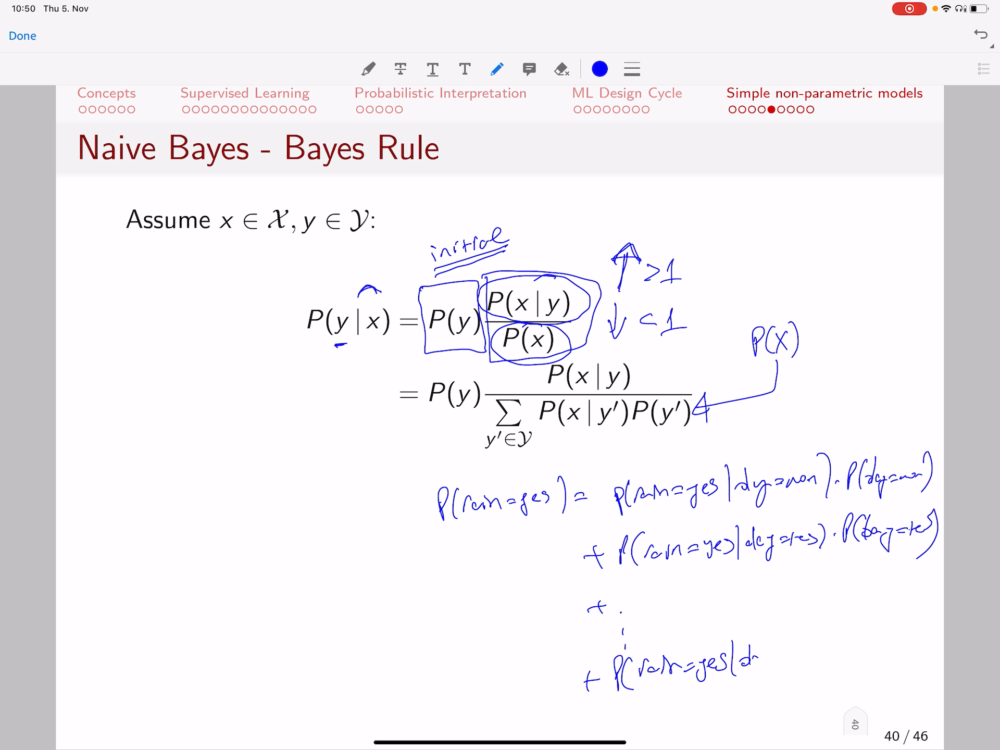

<!-- /home/areo/Videos/Machine_Learning/part1.mp4 -->
<!-- /home/areo/.config/mpv/mpv.conf -->
[toc]
# ==============0:00:00==============
- 
<!-- - `0:00:01`: in this final video of today's lecture we are going to provide two simple machine learning methods and they cover nonparametric models in contrast to the models that we covered in the previous lecture content. -->
- `0:00:19`: **we are not going to have prediction models that have parameters theata** instead the prediction models that we are going to see next our **models that do not train the theta instead that they look directly at the data that we have collected in the past in order to make a prediction**.
- `0:00:39`: so **they are going to exploid the data and the logic is going to be based directly by computing up some information from the data instead of accumulating the knowledge into the parameters** and at such type of models that do not have their own parametesr but instead.
- `0:00:59`: look up the data they're **called otherwise as lazy models** in the sense that they are lazy **they don't train their own parameters but they look up to the data directly** and we have two of those types of two of those models in this type one of them is neural the ace is.
- `0:01:19`: nearest neighbor and the other one is knife base and let's start with the nearest neighbors the nearest neighbors classification and regression model is arguably the most simple machine learning method that is out there and it is surprisingly efficient the **logic behind the nearest neighbor**...
<!-- - `0:01:39`: the method is quite simple in fact so assume you want to predict the target y that belongs to the domain. -->
- `0:01:49`: curly why and it predicts the target of some feature vectors x that also belongs to the domain of current x sought the logic of the nearest neighbor classifier is that **it looks up all the training examples in your dataset and finds**.
- `0:02:09`: **the one that the ones that i'm the most similar to the instance for which you want to make a prediction...** so you'll find the k nearest neighbors of x and you aggregate the target variables of those instances and when we say we want to find the nearest.
- `0:02:29`: neighbors it means we want to find the neighbors that have the smallest distance and the distance is measured by a function d that takes as an input to feature vectors and computes their actual inverse of the similarity saw the smallest the diet the more the more similar data points are so let's ex.
- `0:02:49`: truly **give a very small example to**.
- `0:02:54`: **illustrate the point...** so let's assume we have a simple dataset of having just one x and the target y and let's say exists maybe four and then the target y zero x x x has a value of six and the target is one x can be three.
<!-- - `0:03:13`: read the fabulous era can be seventh of anyone it can be eight the value one or it can be to the veggies zero. -->
<!-- - `0:03:22`: that is our dataset so that is x one is for y one zero x two is at is six y two is one etc so now what i want to do is i want to learn a nearest neighbor prediction if that when it's given a new ex-prime and let this ex-prime have a value of. -->
- `0:03:42`: of let's say nine i want to predict the target variable so i want to know what is the y heads of value nine and **what the nearest neighbor does is well it checks first the similarity between this x prime and the first instance** sought.
- `0:04:03`: **let's say we measure that we measure the distance as as the second p norm...** and that is going to be d of x x and zed is going to be actually x mindset square for example yep it can also be that the absolute value it could.
- `0:04:22`: be that the second one etc so the distance between nine and four is nine minus four five so five square is twenty five so that is the distance between x and this new value ex-prime that we want to classify and **then we have the**.
- `0:04:42`: **distance between nine and six...** so nine minus six three the square of it is nine nine minus three six square of it is thirty six nine minus seven is to the square of it for nine minus eight is one it's scrap angeles one nine minus two is.
# ==============0:05:00==============
- 
- `0:05:03`: seven the square is forty nine so this column has a distances and now what we are going to do is **we try to find which of those distances are the smallest...** so let's say we want to find the top three venues so it is going to be this one.
- `0:05:21`: this one and this one because one four and nine are the three smallest distances and then what we do is **once we identify those three must similar data instances then we take the targets**, **so the target is one one and one** so.
- `0:05:41`: **then we say that the prediction for a value that is nine is going to be aggregated from the targets of the three nearest neighbors which have target one one and one so basically it would take that that the most likely option here which is one so we say that the prediction is one...**.
<!-- - `0:06:01`: because we computed the similarity of this new venue nine to all the previous values in our recorded dataset dataset and that we found out that the most similar ones had the target once our prediction is one it is as simple as this you loop over all training instances you compute the day. -->
- `0:06:21`: distance between the point for which you want to make a prediction and all the recorded instances and then you select the smallest distance **so how does it look if instead you have two dimensions...** so you have x one and x two so the domain of x.
<!-- - `0:06:41`: isn't his and our two and the domain of white is in red and green so it is strong here with with two different colors and let's say this is your ex-prime for which you want to make a prediction so what you do as you compute the the distance between this point and all the p. -->
- `0:07:01`: points maybe this point and this point here this point and that point there etc with all of them in this case it can be for example that the **euclidian distance or the square of the euclidian distance**.
<!-- - `0:07:15`: it it won't matter in this case up or even the absolute value can be can be used and what you would notice is that actually the three closest neighbors are the ones that are shown here with his inner circle site is this one here this one here and this one here la. -->
- `0:07:35`: those are the three neighbors saw if you see those three neighbors what you are going to to see is that two of them are red and one of them is green so **if you want to make a prediction you'll take the most likely option the most frequent** and not a class among the neighbors saw the prediction of why.
<!-- - `0:07:55`: head is actually going to be red if you use three neighbors. -->
<!-- - `0:08:03`: what about if we use five neighbors so if we extent and use five neighbors then the the five nearest neighbors are located in this upper circle and they include also those two those are the five closest points to the central point ex-prime and now. -->
<!-- - `0:08:22`: we see that among the five nearest neighbors actually three of them are green. -->
<!-- - `0:08:30`: so the prediction is going to be green. -->
<!-- - `0:08:34`: if instead of three nearest neighbors you'd take five nearest neighbors. -->
- `0:08:40`: and **that shows you the sensitivity actually of the nearest neighbor algorithm to the setting of how many neighbors you use** remember from the previous video that we described concept of the the settings of an algorithm and we called them hyper.
- `0:09:00`: meters **k for example is a hyper parameter** because **based on the way you select k you're going to have different results in terms of your prediction and then based on that you're going to have different accuracies of your prediction** in this case assume that you know the true.
<!-- - `0:09:20`: target of x prime is green and that means if you take very few neighbors then the prediction that is y had equals red for three nearest neighbors is going to be wrong and you need more neighbors need more examples and take the majority of the of the closest examples ie. -->
<!-- - `0:09:40`: in order to make a prediction. -->
<!-- - `0:09:43`: sought nearest neighbors besides being a very very simple algorithm has also motivations into the way how humans sometimes reason so if you don't know much about a domain and you want to make a decision you'll try to remember similar situations in the past. -->
# ==============0:10:00==============
- 
<!-- - `0:10:04`: and if you find similar examples and similar solutions while you try to maybe recall some of the solutions and try to provide the same solution to a new problem if this if this new context of the problem is similar to some previous cases that you have seen however the nearest neighbor. -->
- `0:10:24`: uber is not always secure it and er we saw that it **is very sensitive to the choice of k and it is not immune to outliers...** for example if you have data that i located.
<!-- - `0:10:40`: and two classes like that. -->
<!-- - `0:10:47`: and let's say you wanted to select one nearest neighbor just the closet nearest neighbor then the nearest neighbor of all those circles is going to be the rectangle. -->
<!-- - `0:10:59`: however. -->
<!-- - `0:11:01`: one can fairly assume that basically the right separation between those two classes would be based on the separating line saw this point yet this rectangle likely is an outlier. -->
<!-- - `0:11:16`: salt and the fact that it is an outlier actually makes a nearest neighbor algorithm very prone to believing that the nearest neighbour is the correct option while it may be the wrong option because it could be just an outlier instance and instead we might want to have a classifier that actual. -->
<!-- - `0:11:36`: lee is immune to this outliers to these examples that that are not very different to its own kind and not very similar to its own kind for example the the. -->
<!-- - `0:11:49`: the triangle here is different from the other instance of its kinds is located far away and is located close to the circles sought for the circles this is a noise it's an outlier that they shouldn't take seriously or whether the nearest neighbors takes it seriously because it is just located close to the spa. -->
<!-- - `0:12:09`: the nearest neighbors app is a is a very accurate method in many domains but it has some problems such as not being immune to outliers so let's put things a little bit more formerly let us define our dataset s d. -->
<!-- - `0:12:28`: and diet is actually a set of tuples and the tuples have two vectors the future and the targets. -->
<!-- - `0:12:37`: i saw xs in the image dimensionality of 'em any future features white if it is a multi categorical can be a vector off of one hundred and called it at a target fabulous void can be a single binary value a single continuous value if it is a continuous variable. -->
<!-- - `0:12:57`: etc but in essence our data is composed of features and targets for and many instances that we have collected in the past the mathematical definition of the nearest neighbors of as is the curly es. -->
<!-- - `0:13:14`: and that is a subset of the data so the k nearest neighbors are key elements from the data and we can mathematically defined the k nearest neighbors to be the subset curly s of our data such that the cardinality of this set s is equal to k it. -->
- `0:13:34`: means that **we want to find out that the set s that depends on x in a way that this set has k elements and the criteria how we find it is by minimizing the following so we try to find the set s**.
- `0:13:54`: **that**.
- `0:13:58`: **contains feature vectors x prime**.
- `0:14:02`: **such that the distance between x prime and x is the smallest possible in terms of the aggregation** now in order to understand the logic of this formalism assume that your distances are.
- `0:14:19`: between ex-prime and x or something like that so let's say they're zero and then i'm going to sort them up in increasing order so let's say that zero zero point three one point five six seven twenty cetera so **if i say**.
- `0:14:37`: **i want a subset of three elements four k equals three so i can take this value this value on that value or any combination of three items from this set off of indices** and.
- `0:14:56`: **if i follow this logic here that i want the ones that have the smallest summit in the distances is going to be the the the three smallest because**.
# ==============0:15:00==============
- 
- `0:15:07`: **in the summation of those distances**.
- `0:15:11`: **they have the smallest sum** if those distances are the smallest so **there is no other combination of three elements which are going to have a smaller sum than the ones that have the smallest distance** so the sum of the three smallest values is always the subset of the data where the.
<!-- - `0:15:30`: the total sum is the smallest possible so we want to find then the subset s such that the elements in it have the smallest sum of distances between the elements in in the subset s and actually the value x for which we want to find the nearest neighbor so that's jr. -->
- `0:15:51`: **that's a math definiiton of saying give me that instances x that achieve actually the smallest possible distance to an item for which we want to make a prediction** and se in fact it is a subset of the data storage will provide us.
- `0:16:11`: what instances are the closest neighbors a nearest neighbors k many of them **and then what we do is we take the y the target of those nearest neighbors similar to what we said in the previous examples and that's what the projection operator**.
- `0:16:28`: **pie of y does** you might remember it from your relational calculus and your database courses that **this symbol means just give me the y column** saw this three nearest neighbors maybe maybe i'm going to be the three nearest neighbors of an item x might be maybe i do.
<!-- - `0:16:48`: dunno the fifth instance. -->
<!-- - `0:16:51`: and then maybe the twelve in instance in your database for example and baby the item. -->
<!-- - `0:16:57`: twenty seven in your database. -->
<!-- - `0:17:01`: let's say i decide to the the nearest neighbors x because if i compute the distance between this and x five between this x and x twelve and between x and x twenty seven then the sum of those distances is the smallest possible. -->
<!-- - `0:17:18`: among all the subsets of three instances in the database and with that in mind this operation fire off of why just takes the sri values of y so just takes the targets and as an aggregation so even though three targets are in fact. -->
- `0:17:38`: continuous various then the **aggregation will take the average of them** for example if if we remember that the case of trying to predict the price of a house you find the three most similar houses and then you estimate the price to be the average of the prices of the most senior the houses so you find a house that costs one mil.
<!-- - `0:17:58`: when you rush you've found a house that costs maybe eight hundred thousand and you found a house that costs nine hundred thousand those are the three houses that are the most similar to your house based on the features of the house such as meter square and and actually that the neighborhood if you want hunting. -->
<!-- - `0:18:18`: called this feature so you creator feature vector x you compute that that the similarity for instance they're putting distance between this feature vector and all the houses you database and you found three houses that that have a target a cost of the house that is seven hundred eight hundred and nine hundred thousand or salary eight hundred. -->
<!-- - `0:18:38`: one hundred and and amelia for example and the average is nine hundred thousand so that's what you predict the average of the target values for the most similar instances and that is this aggregate operation here. -->
- `0:18:54`: that aggregate operation over the targets that you extract with a projection approach operator over the set of the nearest neighbors this is your **prediction model fx** for nearest neighbor.
<!-- - `0:19:09`: and. -->
- `0:19:12`: **what actually are the aggregation operations...** as we said let's define this nearest the targets of the nearest neighbors of.
- `0:19:23`: feature vector x as y nearest of x and that is just a projection y into the the y elements of the tablets of the nearest neighbors s of x **for a continuous target the aggregation is basically for every element y had in the list in the set**.
- `0:19:43`: **of the target values for the nearest neighbor of x** that is basically the average of las vegas like the average of the of the three most similar houses to yours in the examples that i just gave **if on the other hand the target variable is a nominal or categorical**.
# ==============0:20:00==============
- 
- `0:20:03`: **variable then what we want to do is we want to make a prediction for every class...** so if if remember you are trying now to find out.
- `0:20:13`: if you have an image you want to find for instance wether the image includes the automobiles you want to find what is the brand of an automobile bmw and mercedes or a full force fucking for instance and then what you do is **you take an image your compute**.
- `0:20:33`: **the pixel wise euclidian distance off every pixel in one image with every pixel in the other image so you have a distance between instances as the pixel wise distance**. **so the sum of the pixel wise distances is the distance between two images** and.
- `0:20:54`: they are more clever ways to capture similarity between images but let's say for example that's what we are doing **and you found out that for a particular image the most similar instances are three cars and their brands...**.
- `0:21:14`: false wagon for fucking bmw then what you do is you are going to predict what's wagon because it appears twice.
<!-- - `0:21:23`: and what that means is that you make a prediction is it false fucker then the the likelihood is two out of three because two out of the three nearest neighbors out of forty fucking what is the probability that it is that it is a mess at as well if forrest us out of those three to where it was. -->
<!-- - `0:21:43`: volkswagen and one would be a mess at us then the probability that this eustace will be classified as messy as is one out of three because one out of three nearest neighbors is my status and the probability that it is a bmw zero because in essence none of the nearest neighbors was a bmw so that's what we are doing. -->
- `0:22:03`: ink for the case where the nominal target is at a categorical variable **for every class our prediction is basically we say how often or in other words how many of the nearest neighbors y prime**.
- `0:22:22`: **belonged to this category** so why prime equals see why primate consumer status on face wagon **and we divided by the number of nearest neighbors** so if a fortune five hundred years twice than the cardinality of the set of items that matched the class sports wagon is.
- `0:22:42`: going to be two and two is going to be divided by k if k would have been three then it is two of a three **so it gives you a probability of the likelihood that at a particular instance x belongs to a class c based on how often does this class c**.
- `0:23:02`: **occures among the neighbors the most similar instances of a particular instance x which we wanted to make a prediction** so that is basically the logic of a nearest neighbor and it is quite similar to **recap: you take an instance that is described by a feature vector you look through all the training**.
- `0:23:22`: **instances in your dataset you compute the distance between the instance for which you want to make a prediction and all the other instances in your dataset, you sort those distances**. **you select the items that have the smallest distance and among the items that have the smallest distance which means they are the nearest neighbors**.
- `0:23:42`: **then you look into the y values and if the prediction is a regression then you take the average of the y values if the prediction is a classification then you take the most frequent class among the nearest neighbor**.
<!-- - `0:23:58`: that's all you have to do in order to implement and run a nearest neighbor method they are either a bit more clever strategist to speed up the computations that i needed the steps of a nearest neighbor for example when you loop through all the instances there are algorithms to. -->
- `0:24:18`: divide the search space up into into some kava sub spaces for example the kd tree version of the nearest neighbors but we won't cover them in this lecture it's sufficient as basic concept to understand that **the nearest neighbor basically just finds similar examples and predicts based on them**.
<!-- - `0:24:39`: and that's all this this method actually is doing. -->
<!-- - `0:24:43`: great. -->
- `0:24:45`: **now we can move to the second non-parametric method which is the naive base:** the base rule is a core property of probability theory and **the bayse rule states the following: the probability of**.
# ==============0:25:00==============
- 
- `0:25:05`: **an event y occuring given the occurrence of an event x is equal to the probability of the event y times the correction factor which is defined as the ratio between the probability of x when y occurs divided by the probability of x**.
<!-- - `0:25:26`: salt. -->
<!-- - `0:25:27`: i'm sure most of you have seen base ruled out when you have them. -->
- `0:25:34`: i learned about statistics or probability but we can very briefly **summarize it as follows: so you want to know the probability of y happening**.
- `0:25:47`: **and now you have some more additional information x is some additional additional information you know a little bit more about what factors contribute to y so what you are doing is you multiply the initial belief of y so this is the initial belief**.
- `0:26:06`: **if you wouldn't known that x occurs then basically what you know about y is just the probability of y. however now you know that x occurs saw the probability of y occurring either will increase or it will decrease based on how does x contribute to y**.
- `0:26:26`: **if x the occurence of x is something that makes you more confident that y will occur then this ratio would go up otherwise it'd go down**, how actually does this ratio work sought.
- `0:26:41`: **what it measures is the nominator part says what is the likelihood that for x occuring among the occurrencies of y**.
- `0:26:52`: **and you divide that by the occurence of the probability of x occuring if you wouldn't know that y occures**. so in other words **if x is more likely to occur with y then it is likely to occur alone then it means x is a contributing factor to**.
- `0:27:11`: **y**, **because it occurs more often when y occurs** saw **then you have a value that is greater than one and that means your initial probability of y will increase because now you have a new factor that you know that has occurred which is x** and x occurs often with y, it occurs more often with.
- `0:27:31`: y then it'll occurs alone so when you divide p of x given y divided by pure fix is going to be greater than one and that reinforces the probability of y happening because now you know that exceptions can execute often with y while on the other hand if the probability of x.
<!-- - `0:27:51`: six is greater than the probability of x given why then this ratio is going to have a value less than one what it means is that ex of yours less often together with white than it of yours alone in general so x is more frequent than it is when it occurs together with y and in that case. -->
<!-- - `0:28:12`: case if this ratio is less than one because the probability of x given y smaller than the probability of x that means your initial belief about the probability of y will decrease because now you have observed something which is x which does not occur often with y so now you have some information that well maybe you. -->
- `0:28:32`: why also wanted your very often because x is a factor that actually does not talk you often with y so i have some more information that makes me believe less then why would a cure because i know x does not talk you often with why that is the logic of the base rule **and this denominator p of x**.
- `0:28:52`: **can be described as following that is one of the axioms of probability...** so the probability of x is equal to the probability of x given y pride times probability of y prime for all the possible print options so if you'll say what is the probability of raining.
- `0:29:12`: well that is and now you know which deities now that you'll consider the de facto so the probability of raining.
<!-- - `0:29:26`: the reigning guess that is equivalent to the probability of raining. -->
<!-- - `0:29:32`: if you know the day. -->
<!-- - `0:29:35`: it's monday. -->
<!-- - `0:29:37`: times the probability of date being monday plus the probability that the reign of the cure. -->
<!-- - `0:29:47`: and the day is tuesday times of probability that the day is tuesday plus. -->
<!-- - `0:29:55`: all possible days. -->
<!-- - `0:29:58`: rain yes date sunday times have probability of a day equal sunday so basically well they are seven days if you add up all the probabilities of raining and you know it's monday raining and enjoys tuesday renting and you know it's it's where does. -->
# ==============0:30:00==============
- 
- `0:30:19`: until sunday **...in the end well the date wouldn't matter anymore because you have added all the possible values of it so that is equivalent to just the probability of raining being yes because you can sum all the the additional factors with all their possible values and in the end you have**.
- `0:30:39`: **counted all possible probabilities that this conditional variable might contribute to because you have enumerated all the possible options of conditional probability types the likelihood of of the the the conditional probability** so **that is an axiom of probability that you know very well from your previous**.
- `0:30:59`: **courses** and.
<!-- - `0:31:02`: what we are going to do here is well we have to provide a little bit of a further intuition saw the idea of base rule was that the profit of y given x means that the occurrence of y which is a probability of y will be multiplied by. -->
<!-- - `0:31:22`: by a correction factor. -->
<!-- - `0:31:24`: i would call this a correct correction factor saw this factor will either correct increase your initial belief about why because now you know that execute cure all it will decrease it that's the logic behind the base rule and let's give an example about it. -->
