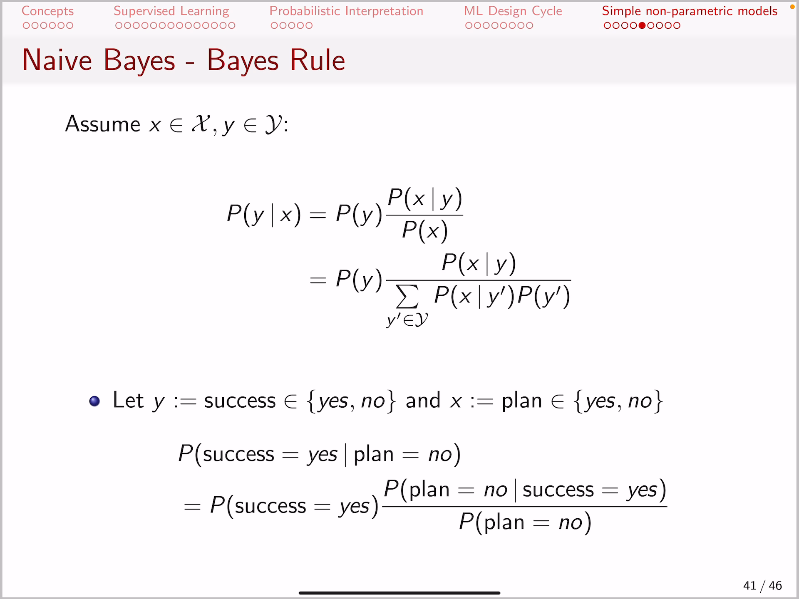
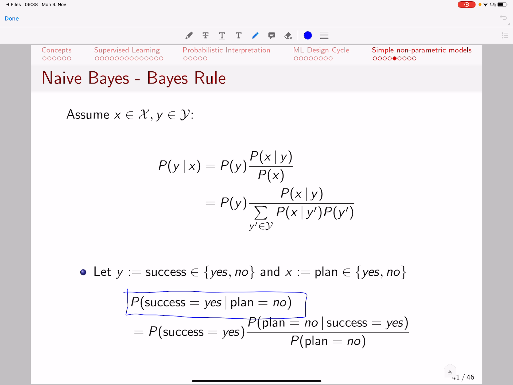
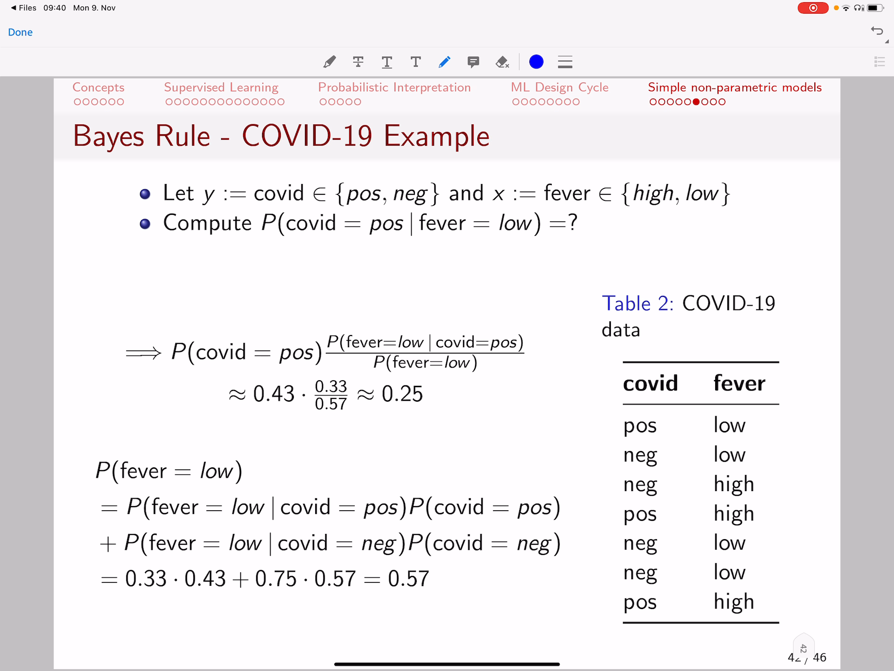

<!-- /home/areo/Videos/Machine_Learning/part2.mp4 -->
<!-- /home/areo/.config/mpv/mpv.conf -->
[toc]
# ==============0:00:00==============
- 
<!-- - `0:00:01`: let's have a look at an example where we would like to know the probability of a startup business being successful or not conditioned on the fact whether or not the founder of the startup had a business plan so in essence what we are going to compute. -->
<!-- - `0:00:20`: is using the base rule for calculating the probability of success being yes given that a person has no business plan and please. -->
- 
<!-- - `0:00:32`: keep an eye on the domain of those variables the variable y in other words defined as a success has a domain of a binary variable either yes or no and the same goes for the plant it is either yes or no so the probability of a person being successful in a snap. -->
<!-- - `0:00:52`: publishing has started at given that he has no business plan according to the best route is equivalent to the initial belief of a person had being successful. -->
- `0:01:04`: times the correction factor and the correction factor measures to what degree does the fact that you have no plan influence on your initial belief of being successful and **good example: assume that...** we took all the people that were successful for example one hundred of them and we found out that.
- `0:01:24`: only five out of those one hundred people had no business plan sought among the successful guys those that had no business plan were five therefore the probability of having no plan given that you are successful he is for example **five divided by one hundred** and.
- die Grundmenge sind die 100 Leute und davon sind 5 ohne Plan, daher P(plan=no|success=yes)
<!-- - `0:01:45`: now let's consider all the people those that were successful and those that were not successful and for us we found out that about eighty per cent of them had some plan and twenty percent of them had no plan saw the probability of having no plan is too divided by ten so as you see the prob. -->
<!-- - `0:02:05`: ability of having no plan two divided by ten is much smaller than the probability of having no plan and being successful because among those that were successful the percentage of people that had no plan is much much smaller than the percentage of people having no plan in general therefore this ratio. -->
<!-- - `0:02:25`: the probability of having no plan give them that you are successful. -->
<!-- - `0:02:29`: it's much smaller than the probability of having no plan and as a result this ratio is much smaller than one which means the initial default probability of being successful will be multiplied by a correction factor that will. -->
<!-- - `0:02:46`: even reduce further your chances of being successful because now we know that if you have no plan your probability that story that the probability of having no plan and being successful with further deteriorate your initial belief of being successful that is what app-based rules tells us. -->
- `0:03:06`: and **we can move on with a concrete example...** let's say i have again two variables why whether you have that you are sick with with a cava disease in fact this is just an example that the the medical correct formulation would be that your.
- 
<!-- - `0:03:26`: either positive or negative to the sys corona virus too but for simplicity we call it copied positive or copied negative and the other variable is whether you have fever and we identify fever with with either being high or low. -->
<!-- - `0:03:44`: now assume that we want to compute the probability of having covered if you know that your feeble is low subject to the data shown here in the table so that the data shown in the table is accumulated for example at the clinic and at indicates here in this example seven patients. -->
<!-- - `0:04:04`: and those patients were either positive or negative to cover it and they had low or high fever so if we follow the best rule what is the probability of covet being positive if you know that the fee-based law well it is equivalent to the initial belief on whether you are you are covered positive. -->
<!-- - `0:04:25`: and that we can compute using the data here so we see that we have three cases of coffee being positive out of seven cases so the probability of being covered positive is three divided by seven now let's move further and we what we have. -->
<!-- - `0:04:44`: have another factor that we know we know that the patient has a low fever so the fact that he has a lot of people will either increase or decrease the chances that he has coffee so it will change the probability of coffee being positive by multiplying it with a correction factor and let's see if the fact. -->
- **bei P(A|B) ist B die Grundmenge in der A einen Anteil ausmacht. Diese Grundmenge hat aber in der Gesamtbetrachtung auch keine 100% Wahrscheinlichkeit.**
# ==============0:05:00==============
- 
<!-- - `0:05:04`: that a person has fever reduces or increases the probability of having covered in order to do that we have to compute the probability of having a low fever among the copied patients and divided by the probability of having a fever in general. -->
- `0:05:20`: the probability of having a fever in general is equal to the number of people that have low fever divided by the total number of people so here we have one two three three four we have four patients with low fever out of seven patients so this is four divided by seven and **in addition**.
- `0:05:41`: **you can compute the probability of fever being low using axiom of probability...** where we compute the probability of your being low as the probability of you being low and knowing that covetous positive times the probability of it being positive plaza probability of fever being low.
<!-- - `0:06:01`: ap given that you know the patient is copied negative times property that you have covered negative and if you do the math that is approximately the point fifty seven which is equal to forty five by seven scientists skating is equal to the probability of a person covered at if you replace and do the math. -->
<!-- - `0:06:21`: not what we are left here is the probability of having no fever among have covered patients so we see that we have three patients. -->
<!-- - `0:06:34`: and out of those three patients we see that people low fever high fever heist only one out of those three covered positive patients has actually fever that people being low salt the fever being logged given that the patient is copied. -->
<!-- - `0:06:53`: positive has a probability of one divided by three. -->
<!-- - `0:06:57`: and one divided by three smaller than forty five by seven so you end up with this correction ratio which is less than one and because it is less than one then your your initial belief that a patient has corvette which was having a probability point forty three is not multiplied with this ratio and it ends up in a. -->
- `0:07:17`: probability of about twenty twenty five **which means that...** if you know that you don't have fever your initial probability of having coverage point forty three is not reduced to point twenty five and that happens because this ratio the probability of those having low fever among the copd patients.
<!-- - `0:07:37`: is read it all so you have just one patient with low fever among the those that were copied positive and which were three and that ratio is much higher than heavy low fever in general which was four out of seven patients so you have a correction factor because low fever correlates with a small fraction of peak. -->
<!-- - `0:07:58`: will have you covered compared to last having lock fever in general saw the magic in the in the best rule happens in this ratio it actually happens in this box here and in the conditional probability of the dependent factor or variable in this case fear of being long subject. -->
<!-- - `0:08:18`: to call it being positive. -->
