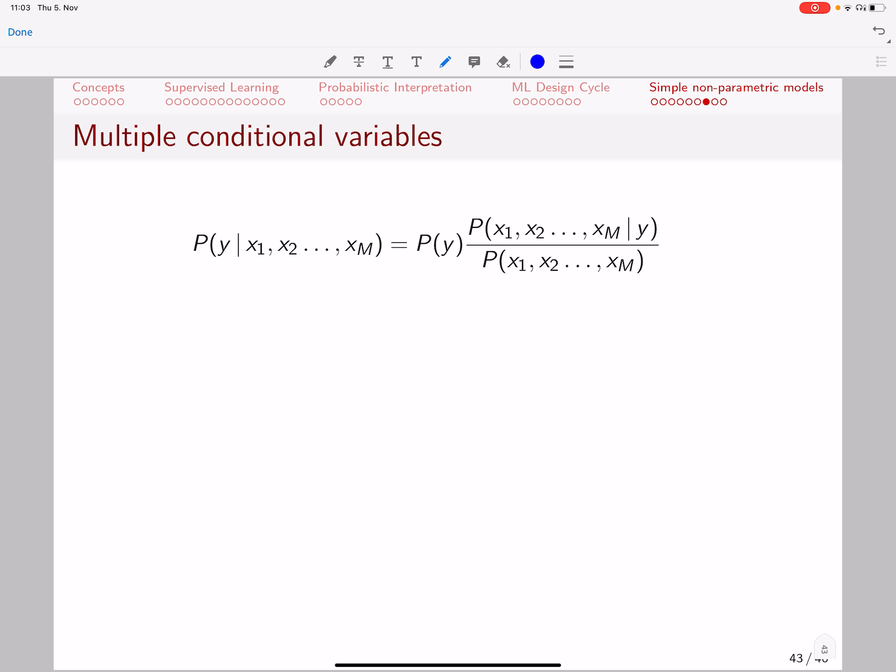

<!-- /home/areo/Videos/Machine_Learning/part3.mp4 -->
<!-- /home/areo/.config/mpv/mpv.conf -->
[toc]
# ==============0:00:00==============
- 
<!-- - `0:00:00`: silicon valley maybe you have better connections better chances to grow your business etc soc. -->
<!-- - `0:00:06`: what bass tells us is that if you have multiple variables x one x two one two weeks and and you want to find the probability of y depending on those multiple variables well then that is the same logic again is the probability of y. -->
<!-- - `0:00:26`: times this correction factor and the correction factories the joint probability of those dependent variables given y. -->
<!-- - `0:00:36`: is it smaller or larger than the joint probability one of those dependent variables in general without without a curing together with why sop are those factors either acute alone more frequent or less frequent than when they appeared together with a. -->
<!-- - `0:00:56`: we have y and that is what we are going to do if we have multiple conditional variables and that sounds fun so what we are going to have here is again covered example and. -->
- 
- 
- `0:01:13`: we have now why and why is covered positive or negative x one is fever high or low x to his calf he is a person coughing yes or no and excretes a headache so we **expanded our coffee nineteen at dataset with two more conditional dependent features**.
<!-- - `0:01:33`: years and their weather person is coughing or whether a person has headache and now i'm raising a question my question is the following i want to know the probability of coffee be positive if a person has a fever if he is coughing but has no headache and you'd say well what. -->
<!-- - `0:01:54`: the problem that's that's easy i can compute the probability of course it'd be positive that is this term here then all i need to do is the property that your fever high copyists and headache know among those that were positive and divided with a probability of people that have high fever cough yes and that take not among all the people know. -->
<!-- - `0:02:14`: not just those that were positive salt. -->
<!-- - `0:02:19`: the part above is those symptoms given covered positive and those symptoms here let's ignore them with just. -->
- `0:02:30`: a dot saw the probability of this dodd giving coffee positive divided the probability of his dot and dot means these three variables **however we have a problem here:** that's a problem that i tried to mention above let's check these patients that were positive what we are noticing is.
<!-- - `0:02:49`: that none of them have none of them has high fever cough and no headache so we have high fever cough but we have one instance with a headache we have high fever but then we and we have. -->
- `0:03:04`: high fever nor headache but then this person doesn't have a cough **so these exact examples never appear in our data**.
<!-- - `0:03:13`: and it does not appear for the positive class but it also does not appear for the negative class of comet. -->
<!-- - `0:03:20`: so if we are going to use naively if we are going to use directly this rule then what we are going to see is that the probability of caveats positive given those symptoms is zero why is it zero because the probability of those symptoms among the positive pay. -->
<!-- - `0:03:40`: patience is zero and if this term here is zero then the probability becomes zero but the same is for covet equals negative given those symptoms because among the negative patients this for guys well those symptoms never occurred to us or the probability of those symptoms. -->
- `0:04:01`: when cover is negative is also zero and that means the probability is zero so **if you try to find the joint probabilities of those symptoms while they never occure and that's a problem because if you have lots of of**.
- `0:04:20`: **conditionalitis so many variables then then it becomes even smaller the chance that**.
- `0:04:28`: **you will have coverage of all possible combinations** because if you have if let's say are binary and you have ten different variables **then you have two to the power of ten many different combinations of values** so the chance that you have ten to the power of ten many patients where all the combinations of symptoms to cure.
<!-- - `0:04:48`: that is very low so you don't have sufficient data to cover all the scenarios however if we look into this case well that doesn't look very convincing does it i mean it's true that this particular case where you have a high fever and you have cough but no. -->
# ==============0:05:00==============
- 
- `0:05:08`: headache it's true that it does not occur here in this table but **on the other hand** what you see here is that well we see that **if you have a high fever then it somehow correlates with covid positive because well actually in the three cases that have high fever basically two**.
- `0:05:28`: **of them had covid** and **if you check people coughing...** then we see that well they calf and it is positive they coughing it is positive and to other cases it is negative **so it doesn't tell you much information**. **what about the headache..** while the headache it's no for this positive.
- `0:05:48`: guy it is not for a negative guy and it is not for a negative guy **so in the cases where it is no two of the cases have been negative so maybe no headache is an indication that well you don't have covid perhaps** so you see **those symptoms help you to actually**.
- `0:06:08`: **get some knowledge about the data so is there a way to make use of them even though such combination does not occur directly in the data** when the knife base algorithm tells us away how to do it and we're going to find it out in a second.
<!-- - `0:06:29`: while the knife base tells us is if you have the joint probability of a set of variables x want to extend. -->
- `0:06:40`: then assume that they are just independent so **don't try to find occurrences where they all appear together but treat them as occurring alone and independently** so in the example above we had high fever cough and no headache and we were trying to find a pe.
<!-- - `0:07:00`: patient with these three symptoms happen together what knife best tells us is don't do it that way just check for patients who had only fever then get the probability out if you just check for patients who had a cuff and get the proper units out of it and then just check for patients who did not. -->
<!-- - `0:07:20`: have i. -->
<!-- - `0:07:21`: i have a headache and then multiply the probabilities so treat them separately and then multiply then what that means is we go from this nominate here to the nominator he has so the probability of x one x two until extent given y or curing is actually dick. -->
<!-- - `0:07:41`: impulse into the probability of x y given y times the probability of x still given y times the probability of exempt give them why and what that misses statistics is we assume they are all independent so if we have the probability of x one x two given y if they are independent that. -->
<!-- - `0:08:01`: mr probability of swans given y times the probability of x to given why not for just two and four and is just a triviality so basically we say the probability of the swan or curing if we know that wire cured is independent to the probability of x to occurring if y cures saw the. -->
<!-- - `0:08:22`: chances that they both have cure is just the chance of the first accused times the chance of the second occurs independently on each other and then you just multiply them because you want that they're all occurring but not occurring together you want they are all occurring in individually and then the fact that they'll occur together. -->
- `0:08:42`: aether is multi is the multiplication of the of the elements where they'll cure alone in separation so that is actually the logic of the **bayes rule is just replacing the joint conditional probability with independent probabilities** and that makes it easy because remember the preview.
<!-- - `0:09:02`: example we did not have a patient with these exact symptoms of cured but if you took those symptoms one at a time we had patients that had a fever we had patients with a cough we had patients with no temperature and that means those probabilities along along they can be computed now. -->
- `0:09:22`: and then we'd just multiply them and **there is another point here that naive bayes further actually tells us it is if you want to make a prediction on y**.
- `0:09:36`: **then this denominator**.
- `0:09:39`: **is actually not needed...** what i mean is that this **term here it does not depend on y**.
- `0:09:47`: so **if you want to predict white and for example y can be either coffee positive or coffee negative so you can compute just this nominator party above you can computed for full cvoid positive and then you can computer for covid negative and then you check which one has the highest value then you say that like**.
# ==============0:10:00==============
- 
- `0:10:07`: **propably this patient is positive or negative based on the nominator** so you don't need real probabilities and you don't need the denominator because the denominator does not depend on y directly **so we can drop it because we just want to to predict which of the values of y is more likely instead of computing the exact**.
- `0:10:27`: **probability** value so we don't need the denominator for making those computations and that means the **naive bayes can be reduced and simplified to this very simple formula** what it says is.
<!-- - `0:10:41`: the probability of y given documents of some additional factors or symptoms at x one x twenty x m is the initial probability of y times the correction factor that means well how much does it help to know that x one has occurred well if. -->
- `0:11:01`: one oculus often with why if it is a high probability then it helps it increases your belief to two knowing that why oculus and the same likes to extort years often with y then it also would increase the probability and maybe **some of them will decrease and some others would increase** at the end.
- `0:11:22`: the total product will tell you some information whether those additional factors those additional variables they will actually increase or decrease your initial belief about why happening.
<!-- - `0:11:39`: in this case what a coffee happening after you know the symptoms well if those symptoms occur often with covet then your your your belief that the person that's called it would increase after you annoyed symptoms if he has symptoms that don't talk you often with copied then your initial belief about this patient had a cough it will decrease and. -->
<!-- - `0:11:59`: that's what this simple rule does so we can move to our example and now i can raise a question tell me if the person that as covered entities this magic person that has fever cough but no headache and as you see we don't have any patient that is. -->
<!-- - `0:12:19`: secondly looks like you're in a database nevertheless with nice bass now we know how to actually compute the probability of a person having of it or not having covered even for a set of conditional variables that don't occur explicitly because we divide them. -->
<!-- - `0:12:39`: we treat them independently and what that means is that we treat fever high and carpet positive separately. -->
<!-- - `0:12:49`: to cover it yes sorry to calf yes uncovered positive so the fact that you have high fever and and cuff here is treated independently and not jointly so we're not checking for people that have both fever and cough but we are taking the fact that yes fever and the fact that the scarf as an independent event. -->
<!-- - `0:13:09`: and with that being said we can compute the probability of a person that covered so what we do is we just check the three out of seven people actually are positive that's a probability of b positive and the probability of being negative it's just the other way around is is those four patients out of seven neither prob. -->
<!-- - `0:13:28`: plenty of having high fever. -->
<!-- - `0:13:31`: given that you're positive to cover it is being conducted in this way so you just check well these are the guys. -->
<!-- - `0:13:41`: with covet among the three guys with coffee how many of them have high fever and you'll notice that it has one two saw the probability of having high fever given that you have your covered positive so among those that talk of it positive you check that actually two out of three have high fever. -->
<!-- - `0:14:01`: and what about among the cases where you notice that the patient is called with negative well if it if he has a coffee negative then basically just one guy this guy here has a high fever because these other guys have low fever so then it's one hour. -->
<!-- - `0:14:21`: out of four that have a high fever among the copied negative and that means a property that is europe on twenty five and so on you can do all the remaining computations at home and what you'll notice is that whilst you have all those terms now we are ready to compute the probability of someone having covered. -->
<!-- - `0:14:41`: positive if they have a high fever a cough and no headache and that is the initial belief about a person having covered times now the contribution of the fact that you know he has high fever so you check what is the probability of of heavy by fever with coffee positive we have computed that here. -->
# ==============0:15:00==============
- 
- `0:15:02`: we take this term we plug it here then we have the probability of a person having cough among those that have covered tons of probability of not nor headache times given the the the people that were tested positive to cover it and **notice that this symbol here it is not an equality so it's not**.
- `0:15:22`: **measuring the exact probability remember why because we drop the denominator to make our computations easy** and if we do that then we notice that actually base computes a value of zero point zero six four.
- `0:15:38`: s s an approximation of the chance that this person has covered positive for covet negative if you replace the exact formula you're going to notice that it is extra zero point zero three six **so you have according to naive bayes a higher chance to be**.
- `0:15:58`: **covid positive and covid negative if you have symptoms**.
- `0:16:03`: that is in essence how does knife bias work and it is simple algorithm **what you should by now understand is that both the nearest neighbor and the naive bayes they just did some computation on the data the first one iterated over the training examples and**.
- `0:16:23`: **and found that most nearest neighbors while the naive bases iterated over the data to compute probabilities of the condition variables subject to the target and the probability of the target or the probability of of the of the conditional variable occuring, however it did not.**
- `0:16:43`: **what store any logic it just looked up at the table so that is different to for instance neural networks that have weights and try to memorize things such type of models that we saw such as nearest neighbors and naive bayes they don't have memory that just look into the values they do computations on the fly that's it that's how.**
- `0:17:03`: **those non-parametric models work** and with that being said i thank you very much for carefully watching the videos of today's lecture and i would very gladly i wish you all the best in this course so see you next time.
