<!-- /home/areo/Videos/Rechnerarchitektur_old/computer-architecture-20211021.mp4 -->
<!-- /home/areo/Videos/Rechnerarchitektur_old/_computer-architecture-20211021_imgs -->
<!-- /home/areo/.config/mpv/mpv.conf -->
[toc]
# Tags
techonology trends, ic (integrated circuit), performance (responce time, throughput, mem )
elapsed time, execution time, cpu clocking (cpu time, clock rate, cpi (cycles per instruction), ic (instruction count)), power, spec cpu benchmark,

# ==============0:00:00==============
<!-- - `0:00:00`: the. -->
<!-- - `0:00:04`: alright so do we talking about at first about sedative and memory a little bit and then about like time space and time so let me first show you the and. -->
<!-- - `0:00:19`: now if need to find my button again. -->
<!-- - `0:00:26`: the the slides below it are and this time i'm trying to the white you seeing my other point of which did not work last time or and so on. -->
- `0:00:43`: here is where we there last time so what i wanted to to show you here is that bit was a **tremendous increase in**.
- `0:00:52`: **memory capacity in in since the seventies** and meters since i was a teenager actually so so so i i had a my first computer actually bought in in around like the beginning of this plot sway ninety eighty and dumb.
- `0:01:10`: it's really exponential to know that the the x xs here is a linear at the the **y axis is log scale** the locks gates that means in any kind of straight line heater like it would be an exponential curve in.
<!-- - `0:01:30`: the. -->
- `0:01:32`: also the **costs went down** in the same way or if you can think are ugly into the wrong the **relative performance per cost went up** so this plotter at the bottom is from the author copied from the boston computer museum which had that.
<!-- - `0:01:52`: for the last one number he was estimated and by by the author actually in the picture bank well. -->
<!-- - `0:02:06`: the author i am starting to think i am over it here i bet the author which the author provides together with the book you as a two thousand twenty number which is twice as big as the one which has sandwich was two hundred fifty billion. -->
- 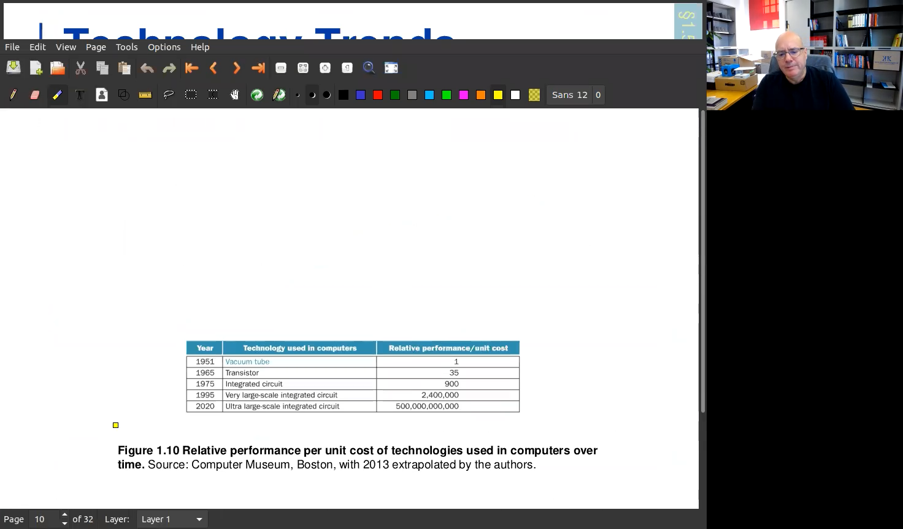
<!-- - `0:02:25`: okay profitability as is five hundred billion. -->
<!-- - `0:02:30`: but but anyhow you see this this trend in the year just as an asset of a short anecdote where b b going to buy a really big machine with a two terabyte a main memory and it's actually cheaper than the medium. -->
<!-- - `0:02:47`: size car these days which is also something i did not not expect and and the strength will probably continue so this is really not stocking that the then then then the memory you have is increasing and this is also a problem of which we going to have focus on in chapter five. -->
- 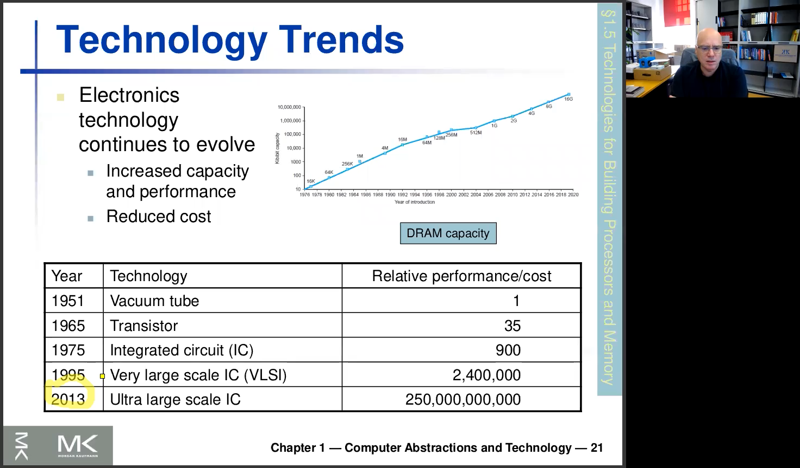
<!-- - `0:03:07`: so close to the end of the and is in the second part of this whole electoral not today but of the lecture series alright am. -->
<!-- - `0:03:18`: the the real reason why we had this is the semiconductor technology and and maybe to give you some some insight into this one how this works here is you have this. -->
- 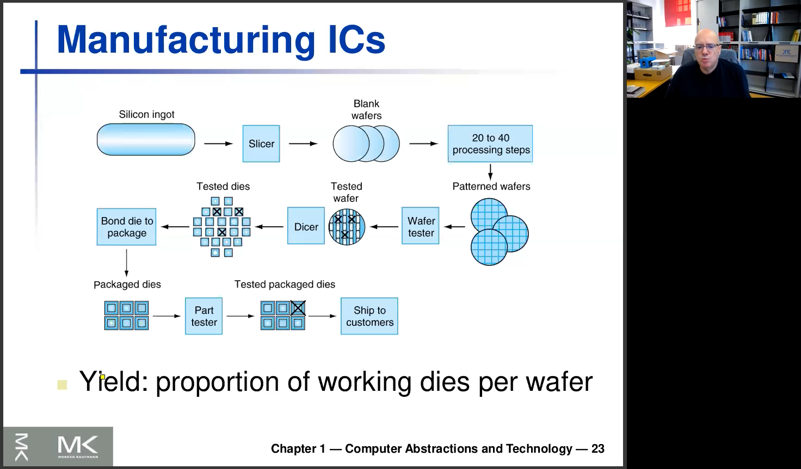
- `0:03:33`: silicon ingots with like a **cylinder** and from that you can **slice off these wafers** and then.
<!-- - `0:03:42`: i. -->
- `0:03:43`: oops sorry and then these wavers through a **optical process...** they're like lots of **structures kind of printed on and are like her**.
- `0:03:53`: **manufactured in a certain way layers of it** and then you get here these are **wafers with patterns on it** and then you contest the wafers and and then you're having here and.
- `0:04:07`: he took these certainly need to put them in url to put produce chips i mean i think this is the reason why they're called chips you they are all hours apart dice so you put pick is wafer into your cutting into these individual bits they're super usually supposed to be almost always identical and then **these crosses here**.
- `0:04:28`: **mean that like you would have some production failure** and that's the reason for that is **because this process you on the right here is not perfect** and you will always introduce sort of box they called for it's actually so independent physically a physical manufacturing box if you want and then some of these so he will.
<!-- - `0:04:48`: not work. -->
- `0:04:50`: and you have to start them out and there's a whole lecture on this topic hollywood actually test these and we're not talking about this here **then you need to put this into a plastic** chicken **and put connections to it** switzerland is kind of the bonding in the packages and then you tested again and may.
# ==============0:05:00==============
- `0:05:10`: maybe them some auditioning one said a need to be removed because the obagi skin **test them again and some additional ones need to be removed** to the customers so that the most important concept here and this is why the why the system the book is yields like how much.
<!-- - `0:05:31`: or how many. -->
<!-- - `0:05:34`: and the percentage of of chips you actually get friends and it's not hundred percent in reality because you have always is physical issues and then some other guards parade like here and here's a former yes sir his pictures right and here's a picture of off think of me. -->
- `0:05:53`: and into a seed cecil into the wafer and you see like of course **at the border you can use these chips but the the middle** you can use these and this would be like five hundred six four dislike the size to a leaf or properly.
- 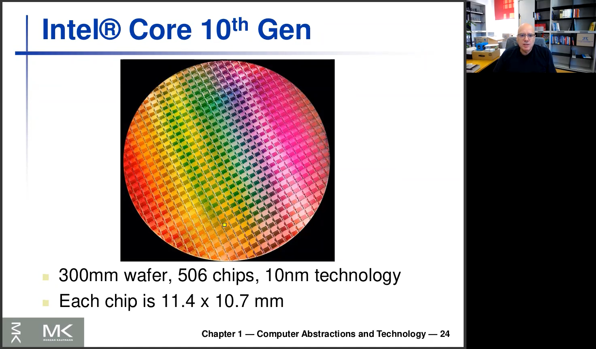
<!-- - `0:06:13`: and that's already the veins the technology so ten nanometers the intuitive still the tin mango meteor but the bmd who is to hearses for these laps like the process besought here this is done in the lead and his lips are currently a very hot topic both in industry and in quantity. -->
<!-- - `0:06:33`: just because there's a. -->
<!-- - `0:06:36`: like they're not enough and chips produced these days and then cars cannot be manufactured to be cetera and and this lap that are into and owns its own laps and to the mds is using other labs and thus like companies require hamas and some have laps and currently. -->
<!-- - `0:06:56`: for instance amd uses a seven nanometre technology in the sun nanometers means the does shirt is modest size off and you can have in this optical process the graphic process said if the smallest the while it's the transistor british never heard of but francis traits of course not clear what what. -->
<!-- - `0:07:16`: i mean it's kind of when you produce these chops then inside a desert chips and an insight this modest talk to you can produce but have this linked fear and the smaller there is it's as better. -->
<!-- - `0:07:30`: alright and yet so maybe also here this number is pretty interesting so each add chip at the end of die is roughly like one square centimeter like ten by ten millimeter to like maybe like the the needle of my thump and. -->
<!-- - `0:07:50`: and and yeah that's how our chips are produced and there's this concept of yield on the mixed a slide or something which i i'm not so sure why why the author put it into the book but that the maya maya argument is as follows the the cost to to chip the time right back for. -->
<!-- - `0:08:10`: the processor. -->
<!-- - `0:08:12`: if it is a puzzle consists of one die obvious i should have mentioned that that nowadays may be multiple chips are put into one of addiction then not identical ones at different once and then you would have minded chips a pair of processor you want but usually. -->
- `0:08:32`: think of just having sort of one or one taiwan then one with the one that corresponds to one processor and the question is what's the the cost of this dependence of of of various factors so of course the **yield goes inversely linear** right.
<!-- - `0:08:53`: because if you have lists out that the percentage is the percentage of of tips which work then at the very end in them. -->
<!-- - `0:09:05`: and now the interesting part case is kind of this long this the whole argument and from actually here this is what the author of the book wants to point out so if you are put in this year deal in the formula on the top you will. -->
- `0:09:24`: we'll see that the **die area goes into the cost per die like monotonically increasing** a **die area would increase** the cost which is kind of what you would expect like is bigger this said you would want to have a chip which is likened to thumbs to newsom's to natives of sum then you would to.
- `0:09:44`: have an mmo to pay more **however there is this thing here this is two...** which says okay we're actually not having a linear cook connection here so the **die area of the size of our chip goes into the**.
# ==============0:10:00==============
- `0:10:05`: **costs with this example he quadratically** the actually explained in the book that this some.
- `0:10:12`: **this connection is emperiticaly determined** of this this thing here at the bottom which i showed here and this is an empirical formula on its we cannot really explain dislike form when monitoring the manufacturing process and even earlier this is claire's just sort of the point that to me.
- 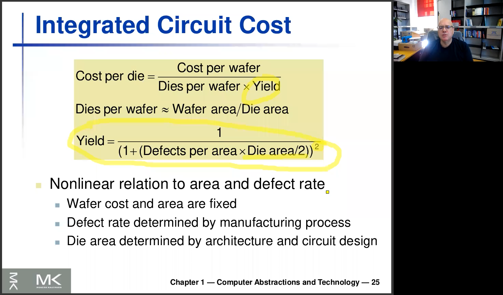
<!-- - `0:10:32`: glad it's not an year but may be. -->
<!-- - `0:10:36`: equal bills with three or four like gotten on the year above linear. -->
<!-- - `0:10:41`: alright so we're not going to do any computation on this in the exercises i think and let's move on to performance and before i i i do that so there's an example in the book with the airplanes which i don't find it and fittings will let me give you some other. -->
- 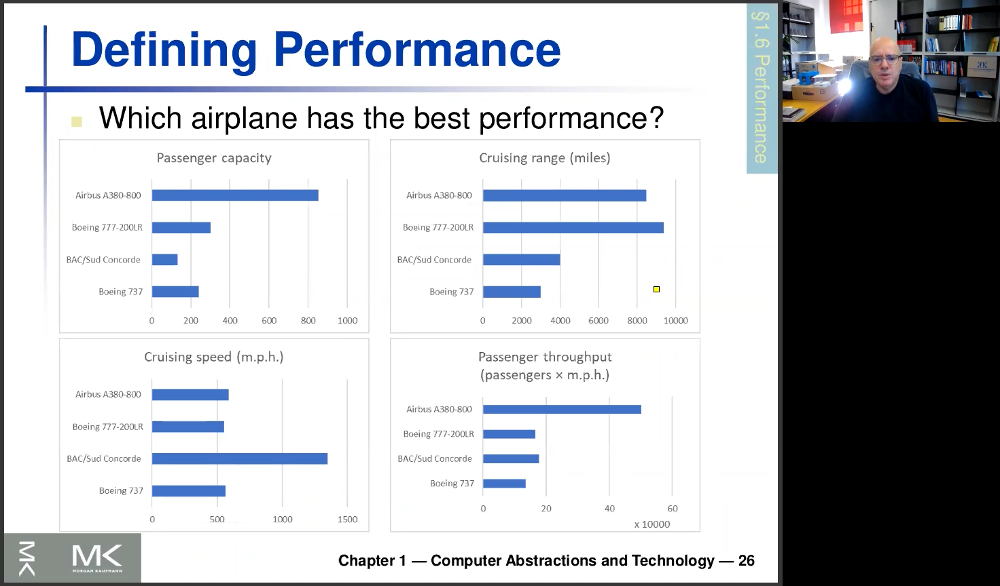
<!-- - `0:11:02`: motivations and in the first one i want to it's kind of a top-down an education or motivation bem and so this book here i can see myself stories and see myself in order to to be able to. -->
- 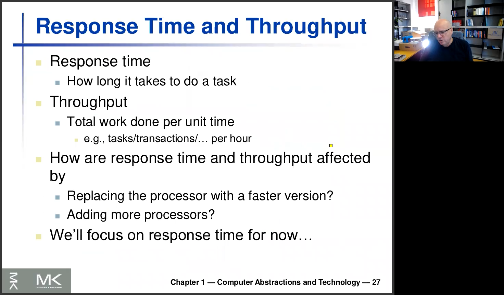
<!-- - `0:11:21`: i. -->
<!-- - `0:11:25`: yeah what anime out little let's not not bothered about that so i hope you see what i'm what i'm showing now my my chat is the just a second okay and this book here is like from nineteen ninety eight it was. -->
<!-- - `0:11:43`: during the time i am after my otherwise studying the prime example of performance analysis which is also if it occurred around the same time as the books of all electrolytes and this one was also from the nineties the audacity or deficient in the it says the article the assistance. -->
<!-- - `0:12:03`: performance and it's a little bit dated but of course like it says still do. -->
<!-- - `0:12:10`: a good read and maybe you'll find more information about this in the web so if you want to know how you really statistic of two distinct precisely on this may this is an additional. -->
- 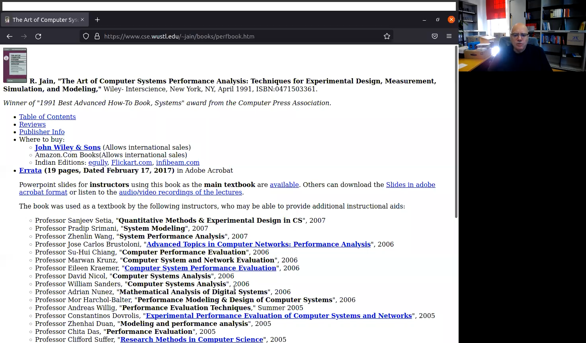
<!-- - `0:12:23`: great. -->
<!-- - `0:12:25`: okay but now let me show you the first example which is from the book and so i've pretty boss with an alias already and and as a motivational extent and it's this it's like a small program which we're going to. -->
<!-- - `0:12:45`: evaluate it's running time so i did this already before as you can see so i'll start again so that you can really see sir taking his time since four minutes or so or five minutes let's put it this way and. -->
- 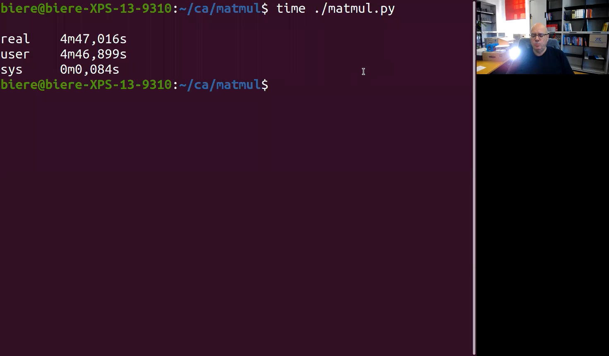
<!-- - `0:13:02`: it doesn't matter expert application so so the code is it is produced in corso. -->
- `0:13:12`: ernest's it sir the extra code is the one here right so this is the **matrix multiplication in python** and you're on top i'll i'll get the zero metrics which is the recite initialized to zero and then i have yes of course two random ones.
- 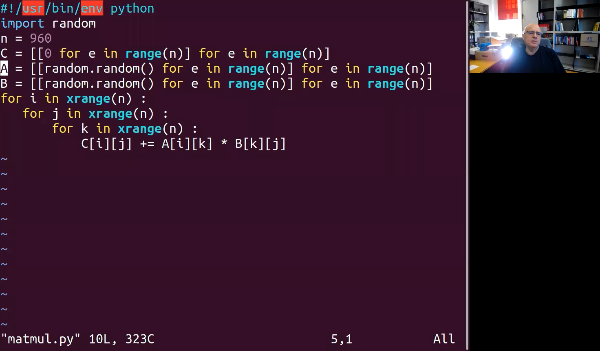
<!-- - `0:13:30`: because they need to do something of course i could have just put them. -->
<!-- - `0:13:37`: concrete value is there but it just generate the brain the end and tiered this is the most important part this is the the size of the matrix which could cook to one hundred. -->
<!-- - `0:13:48`: then the the item group or program is pretty fast food as if in in a zero point three seconds if i put those sorry. -->
<!-- - `0:14:02`: if i could put two hundred then it it's already consistently slower so that twice as a slow ads as far as his low rates it's the fifth or off of what is it like roughly seven right. -->
- `0:14:17`: and the reason for that is because **matrix multiplication is actually cubic algoirthm** you see this also if you're an.
<!-- - `0:14:27`: and if you look at the code here so desire three four looks great and all are in the range of one to ten and and yes it's a simple complexity analysis which gives you. -->
<!-- - `0:14:41`: such like a cubic complexity and then if you increase this number here to two nine hundred sixteen. -->
<!-- - `0:14:50`: then you get what what the other window is showing here like five minutes so this will i keep it running in the background okay now. -->
# ==============0:15:00==============
<!-- - `0:15:02`: the first. -->
<!-- - `0:15:05`: i'm sorry to hear the first thing i want to say show you here is and it's also from the book is what how can you make this faster because we wanted to have a fast computing rate and by doing actually at the end faster processes. -->
- 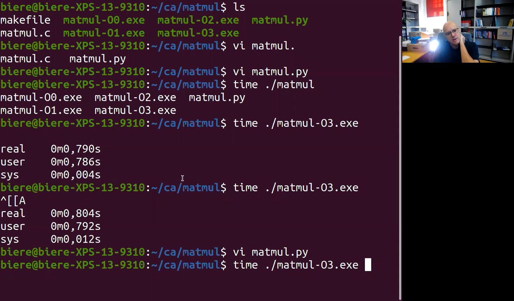
- `0:15:24`: but before you do that maybe on a high level there are some other ways of optimization i mean there's actually something which i will show you later in the year when we talk about caches how you can optimize this further but the **simplest trick of course is to just write a c program** which does the same so.
<!-- - `0:15:44`: so i need like a slightly more complicated initialization for the of or for the two mattresses and to see also here they are initialized to be a nine hundred and sixty but a sixty mattresses and then it's almost identical quote i don't have pissed off. -->
- 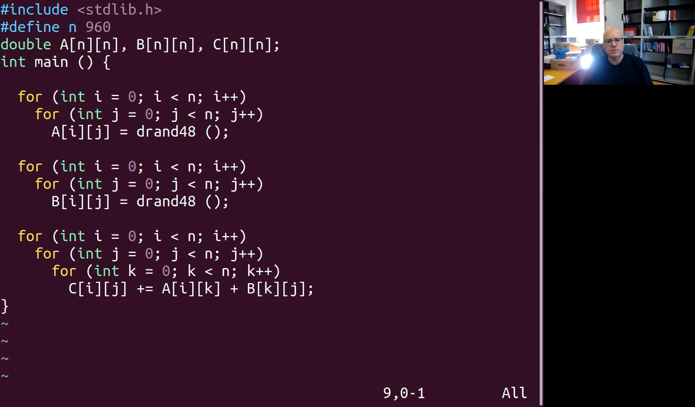
<!-- - `0:16:04`: fancy a range based photo from python and c bloodless i would have it but i wanted to see here and that of course i have to compile it so this this other this type of program is interpreted to the python pro an interpreter would then directly interpret his python. -->
<!-- - `0:16:25`: actually there's a compilation of pussies in the background but it would only generate them. -->
<!-- - `0:16:30`: like a byte code and then run a despite called interpreted. -->
<!-- - `0:16:35`: and what i show you here is likes then the compilation was the gcc compiler in four different optimizations and if you're you see already here the the the one with the process optimization is an envelope it was one second zero point eight seconds the rebuffing the reason for that is. -->
<!-- - `0:16:55`: cause because i'm running the other one in the background and also the laptop years i'm using it for zoom so without any lag you can only run the program itself takes a zero point eight sentence and yes of course this is a then an imprecise measurement digital. -->
<!-- - `0:17:15`: located and then maybe take the averages and. -->
<!-- - `0:17:22`: alright now i also want to show what happens if i don't optimize the optimization level of zero and then it takes i think of one five seconds on an unloaded machine so maybe here so i dunno ya eight seconds say any house effect but then i did this before and i were into it. -->
- 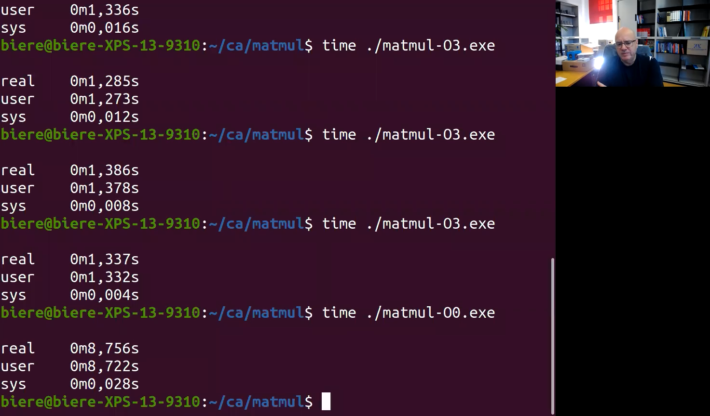
<!-- - `0:17:41`: where this machine was not used it's actual laptop here and it was five seconds. -->
<!-- - `0:17:47`: okay and then you get from five seconds to slightly below. -->
<!-- - `0:17:52`: what we saw above your two slightly below one second so it's a fifth or sixth whistle so the compiler gives you by using two doing something clever here the factor of six and and of course this is a prime example for for optimizations built into. -->
<!-- - `0:18:12`: compiler and if you really want to learn about this what the kite compiler really does then you need to to go to compiler class a but but i'm i. -->
<!-- - `0:18:24`: and like in the book there will be also the assembler code for that but will going to look at that in the in the second lecture because i'm not now alright. -->
<!-- - `0:18:37`: so you can get here at the factor off of the earth survive time sixty so three hundred seconds to one seconds effect of **more than three hundred by by just switching from python to c** and yes there's like edition. -->
<!-- - `0:18:57`: things you can do and then each chip of the there's like some. -->
<!-- - `0:19:02`: something in which goes in this direction at the very end of course he can paralyze it and then. -->
<!-- - `0:19:09`: what you get here is. -->
<!-- - `0:19:13`: sorry this is the wrong thing here. -->
<!-- - `0:19:20`: and you will get actually effect of forty thousands i cant find the the picture at the moment yet. -->
<!-- - `0:19:28`: the right one here like you get like a factor of forty thousand what we did here was this patient person he actually took him at three hundred seconds and then we translated it to see the hours took like zero point eight but was a different machine i think this was some of the book some some interprocess of money. -->
<!-- - `0:19:48`: in the movie slot so completely different processor than what i have here in the uk but the ranges is the same six hundred the effect of under seventy five when we had like a factor of three hundred four hundred grain and you can increase this by by these other methods of the other chapters and then at the end with. -->
# ==============0:20:00==============
<!-- - `0:20:09`: six even go to n like fifty thousand times faster like then then the sir this version he kept here. -->
<!-- - `0:20:19`: with python. -->
- 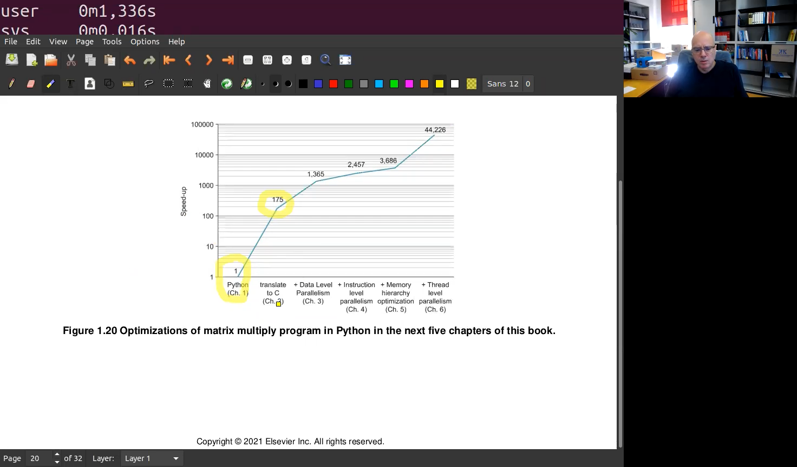
<!-- - `0:20:22`: okay so this was one motivation but i have not alone and i want to show you this so maybe you see getting back i have for started to fill my empty shelves year and there's their books from donald knuth in particular huh this one is there these are the art of compute the pro. -->
<!-- - `0:20:41`: cramming in the. -->
<!-- - `0:20:44`: of course this is the least these are the five minutes of computer science they're actually older than i am and to the original series and to adult muth and has also been with visiting beaten against a couple of years ago in two thousand and thirteen and he awesome measures like time of at least. -->
<!-- - `0:21:04`: ever since and then you've changed the way how he measures it and you see it here he he measures time in terms of amendments so that's why there's a wikipedia article on this members you can also find it in those books in the art of computer programming series. -->
- `0:21:24`: and what's memes well memes simply means like at a program **can be measured machine independently**.
- `0:21:36`: the **performance of a program can be measured by measuring how many memory accesses it does** came.
- `0:21:41`: and **it's actually a pretty solid way of measuring the time**.
<!-- - `0:21:46`: if you don't want to commit to a to a particular machine because machines are changing like every biker through three years you have new processes and new technologies and and so sort of if you want to keep the discussion for instance of the the effect of of of running an egg with them on on some of em. -->
<!-- - `0:22:06`: machine independent of the current process of generation you might want to use something like that act so memphis and then even if you would go to the latest google phone clues say just say he finished a book in two thousand and fifteen and then just recently there was in the night. -->
- `0:22:27`: sir books and posits will be actually similar last year and and you measure that you're going through this book and you will check out how he measures times then you'll see he doesn't find this makes the weighted assets that he programs in c by the wayside of billions of c his seabed extra me and **it's called**.
- 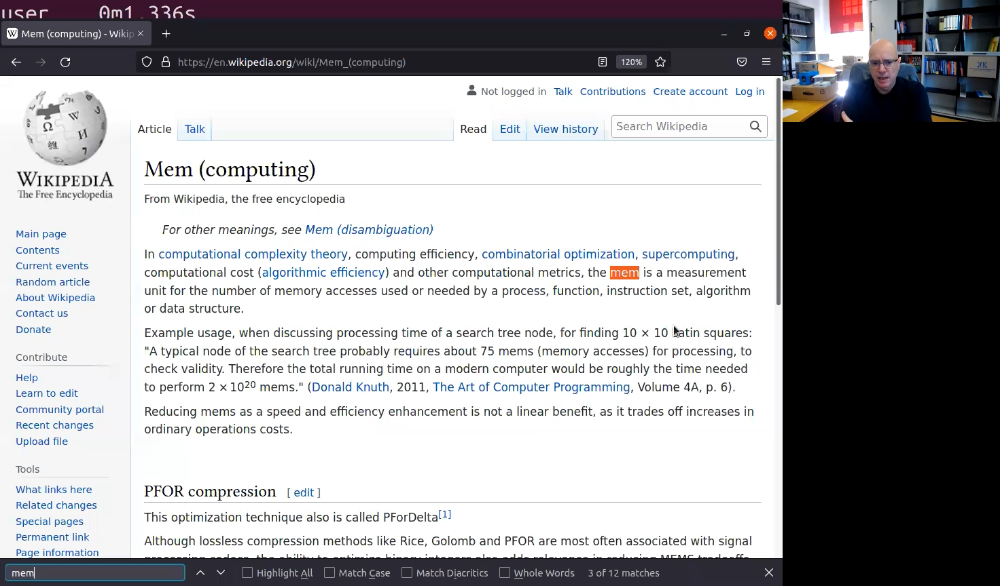
- `0:22:47`: **literate programming** it's like **every point of access is hidden in a macro and then whenever the pointer dereference it's value excesses the aray if you want then you would ineease this global memes counter and at the end when the program finishes you print this number**.
<!-- - `0:23:07`: his number. -->
<!-- - `0:23:10`: okay that's how knuth bassett that it looks like still a little bit like academics on the food gets you know the third motivation that and this here is by me on github so he go to my github page you will see there's like them here these on my. -->
- 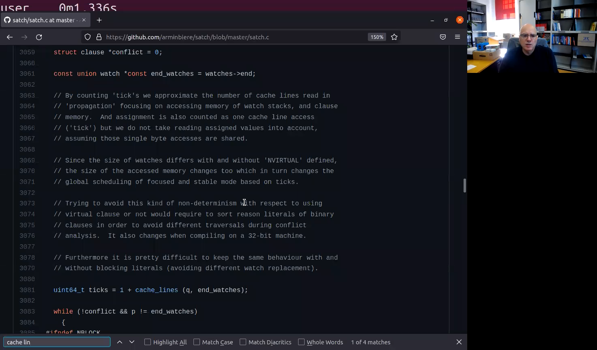
<!-- - `0:23:29`: okay then there's the sach a sat solver which i did for the education to. -->
- `0:23:37`: for purposes earlier this year there was a seminar in the paper i i program distinct just a nice example of sat solving and at the the problem here was that **the sat solvers consists of multiple faces and you don't want to spend too much time in each of the faces** wrangle and would have spent the same time near the sanctum here.
- `0:23:57`: now **of course you could do this with a with sort of like a real time clock** return clock but the the **bad thing about using a real clock is that you you would actually kind of put non-deterministic in the program** because a weld is clock is not completely accurate and the procon might try running one run a little bit further.
<!-- - `0:24:17`: than than before for the same time and then you get sort of strange effects by by by by switching to this other face too early and therefore you need to kind of measure the time taken by scientists or some inside of the program and we could use the. -->
- `0:24:37`: memes of thunder knuth but it's also pretty awkward because then every the reference of a point of reference each homage to one you need to kind of increment this counter and it's also not accurate enough because **what's really the time taken**.
- `0:24:58`: **in this modern processor is actually how many cache lines you're going to excess** and this is of course the topic of chapter five so i cannot explain all the details here but what at the end but very nicely for getting sort of like it did the monistic and pretty priests.
# ==============0:25:00==============
- `0:25:17`: sighs then a def a mad a precise way of measuring the speed of one face so that you can switch between other ones but at the same time there is **to measure how many cache lines you actually excessed** and of course you each has need to sort of approximate is so so and recall.
- `0:25:38`: it's not memes because donald knuth was the meme so **we call them ticks** three you could also say **how many cache lines did you**.
- `0:25:48`: **excess during the hot spot of the algorithm** and it's not that complicated so here's the the edwards for that while he just **take the two pointers you you subtract from them and divide by the size of the cache line** this is done **with the shift because that's cheaper than the division**.
- 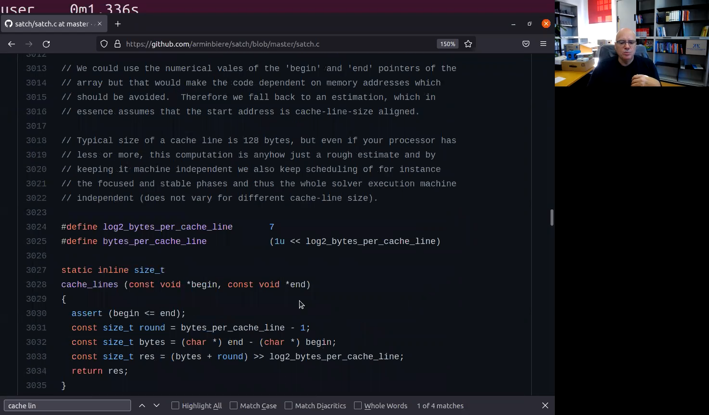
<!-- - `0:26:08`: vision and you see her already it's like we assume here simply that the catch lines on the twenty eighth fight even if it's not the case like sixty four pike was the latest example on that this is still pretty good. -->
<!-- - `0:26:24`: an estimate an end and yes so so so it looks pretty complicated and all but why why i'm showing it as well this is one example there even if you do some high-level high-performance computation in this case implementing assets over it's kind of important to understand. -->
<!-- - `0:26:44`: like how caching might how the process will work with respect to this memory issues and it and it turns out that at least phones that have the programming perspective this is like what i claim here when this program is that the b and. -->
- `0:27:02`: and then the **number of cache line acccessed is a better better metric** at least a deterministic one than tie.
- `0:27:12`: and and also better than booth's memory speeches of course and not the same so cache lines are as i said from twenty eight pints and it's like if you have this line in the cache it's cheaper to access all of these on the twenty eight bytes by **knuth would for instance**.
- `0:27:32`: **count a memory access to two different cache lines the same as memory access within one cache line** which is not accurate.
<!-- - `0:27:43`: alright so this is the the the motivations i i wanted to gift from the to the book cause this response time right so that should be finished by now writes with this thing took know a slightly more than five minute this is the response time of the. -->
<!-- - `0:28:01`: the matrix multiplication or. -->
<!-- - `0:28:04`: am. -->
- `0:28:06`: so it's how long it takes to do a task to but there's something else weeps like a throughput and and **throughput is like how much work you can do** right so so because sir this machine here has four core so **i could actually try to run four matrix multiplication**.
- `0:*28:26`: **in parallel maybe they would take the same time** that they'd be ticketed a bit more each **but altogether they would have done almost four times the work in the same time** the **throughput would increase**.
- 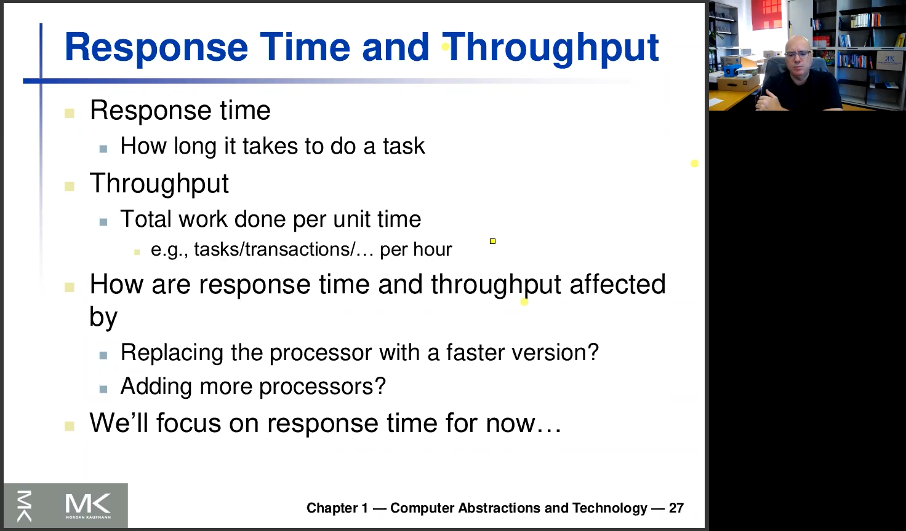
<!-- - `0:28:42`: and that's kind of what we're after here in in in this book so first we're going to have to look at response time improvements and then later look at methods to improve also throughput and as i've already explained. -->
<!-- - `0:29:01`: ultimately the the the way how it's done today is like getting lots of butts of course to do lots of work in parallel and this way increase the throughput but not necessarily response time. -->
- `0:29:17`: okay and there's like the one caveat here like in at and this is already **discussed before with this mems and this cache lines** and it's like **what do you read take as time** and if you take.
- 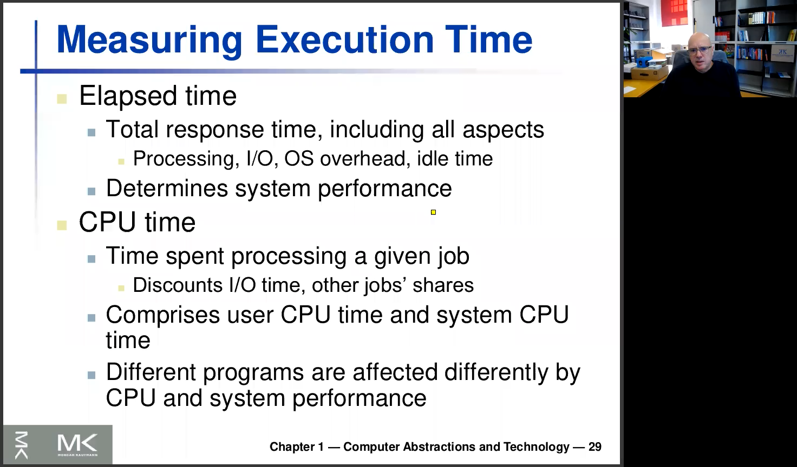
- `0:29:36`: real time there's like two times one is like how how **how long it really took in reality** is called off from the **wall clock time or elapsed time** there on the top right to the spot you.
- `0:29:52`: and this includes all the time instead of b saw him before him maybe i should actually show you this with the time commentator so here it was almost the same surreal time as the ballpark time while the **user time...** missed.
# ==============0:30:00==============
- `0:30:10`: it's **time spend on running this process** of doing this matrix multiplication misinterpret that the python program and then there was a **little bit of system like maybe this was reading the libraries to interpret this python program**.
- 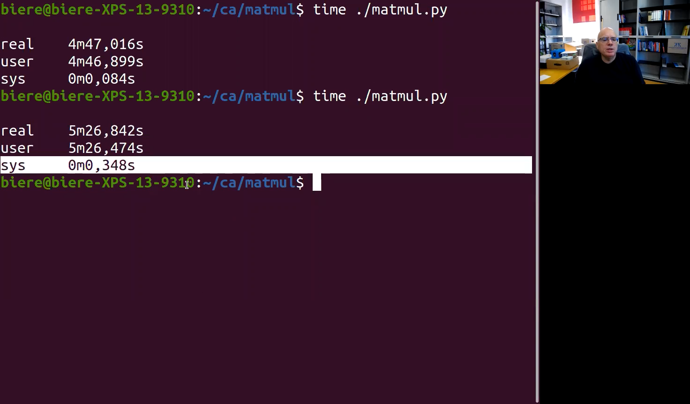
<!-- - `0:30:27`: this is a python program and here for the thumb. -->
<!-- - `0:30:35`: c program the difference is actually not that much rain. -->
<!-- - `0:30:41`: i. -->
- `0:30:45`: so **cpu time** is really sort of an **only the program is running and not something else from the system** or maybe.
- `0:30:57`: when **not: disc chops or network excesses** and that's why also classic that **you have these two user and real** on what we just saw and the **on the slides it's kind of elapsed time and the cpu time** then instead of elapsed time i prefer the term workshop time because that's really make clear that that you are.
<!-- - `0:31:17`: really that that sir that what what it means where there's no no ambiguity there if you say what time. -->
<!-- - `0:31:27`: okay. -->
- `0:31:28`: then on the computer architecture if you forgot about forget about the throughput at the moment it might have been course and you could **measure time with the fourth way** so **we saw now...**.
- `0:31:44`: we saw these **mems** we saw.
<!-- - `0:31:50`: bissau. -->
- `0:31:52`: these are **cache line excesses** then **we real clock time** and **user time** i would call him a **but you could also just measure how many clock cycles the processor used to to compute** the dismisses actually pretty pretty exact except for a technics eat it again.
<!-- - `0:32:12`: and like issues like memories thoughts or. -->
- `0:32:18`: i miss predictions and whatever and this is of course **if you run like one job on one dedicated machine pretty deterministic but if you run multiple jobs...** you have might have and even my mac in the course or you need to react to external events.
- `0:32:37`: this is not completely.
- `0:32:39`: back a **not completely deterministic anymore** and actually can also be used to secure the text but in any case for us like an the simplest abstraction we can measure only more how many clock cycles did it take to to execute say a certain programmer.
<!-- - `0:33:01`: and. -->
<!-- - `0:33:04`: and this is shown on this pictured here and and as lights are slightly more technical. -->
<!-- - `0:33:12`: discussion about that which will follow but let's just like focus first on. -->
<!-- - `0:33:20`: on on this kind of basic principles which you must have seen in any digital design constantly have not attended which is the same course let me just explain what what dennis our are like. -->
- 
<!-- - `0:33:36`: and a new one. -->
<!-- - `0:33:39`: like clang important if you want. -->
<!-- - `0:33:43`: should for switching them just a second. -->
<!-- - `0:33:49`: okay so. -->
<!-- - `0:33:52`: in principle in each design a week when we have this kind of abstraction with with the clock here so this dusty notes kind of clock and then and this is in essence the state of our system. -->
<!-- - `0:34:11`: and then we the the read the state okay and and produce through some function so i'll i'll put your a kind of a block. -->
<!-- - `0:34:25`: and also read some some input we produce some. -->
<!-- - `0:34:31`: next statement we remember and this is the input. -->
<!-- - `0:34:38`: and this is the next state. -->
<!-- - `0:34:43`: and and then in addition often there's like a second clock here which you can interpreted as special going on here's where this would be the output alright and one. -->
<!-- - `0:34:58`: okay so they element maybe that slight divide is a little bit here so this is the next state logic here and and and. -->
# ==============0:35:00==============
<!-- - `0:35:14`: and everything which is a kind of a computed in one clock cycle not here it's a clock input which has this shape effort i have already the clock years into just didn't have the line there. -->
<!-- - `0:35:30`: and of this of this this is kind of the shape of the clock which you see here on on on top of this huh. -->
<!-- - `0:35:41`: then i'll be up. -->
<!-- - `0:35:44`: you would just read here. -->
<!-- - `0:35:48`: the the current state and and produce them here and here the next state. -->
- `0:35:56`: and and then save the state here and then the the crucial part here is that this part here is next state logic here is sir needs to be computed writer it has some what look what we with all actually delayed it will take some time to compute this.
<!-- - `0:36:16`: and am. -->
- 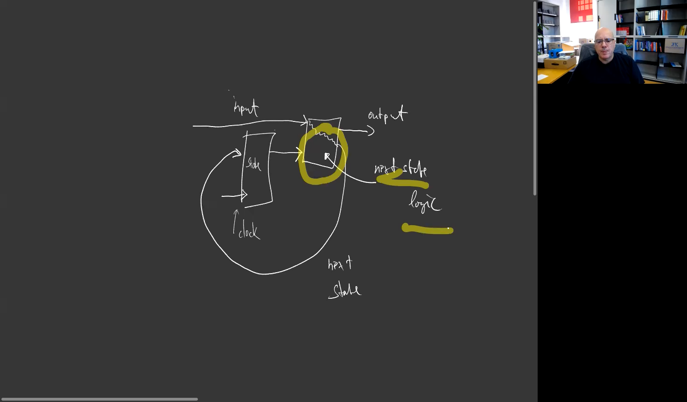
<!-- - `0:36:20`: and usually you can think of if he would go that here too. -->
- `0:36:25`: **zoom in into the next state logic** rate then you would have from maybe mike gates then maybe a navigate here am and if you have not seen gates that this is an an interior and and this is an or and right and so this continues to.
<!-- - `0:36:46`: read stuff from here and then at the end you you need to produce the next state here. -->
<!-- - `0:36:54`: and then computing this logically of course in into reality this will be mapped to a lower level actually the transistors but we're not looking at this level yet so maybe i'll talk a little bit late about cmos mk now so so so so this logical gate will take some time. -->
<!-- - `0:37:13`: ends well this is maybe like a but to compute this time here is the time it takes from an input list or from here to effect the output here the mistakes that may be around ten picosecond so this is the range wipe may be an it not lord she could. -->
<!-- - `0:37:33`: second in one picosecond is one thousand offer a nanosecond and that's the inverse of one giga announced just to give you sort of the the relation rates are all processors so this clock here and we have the cops here and this clock duration hear this. -->
- 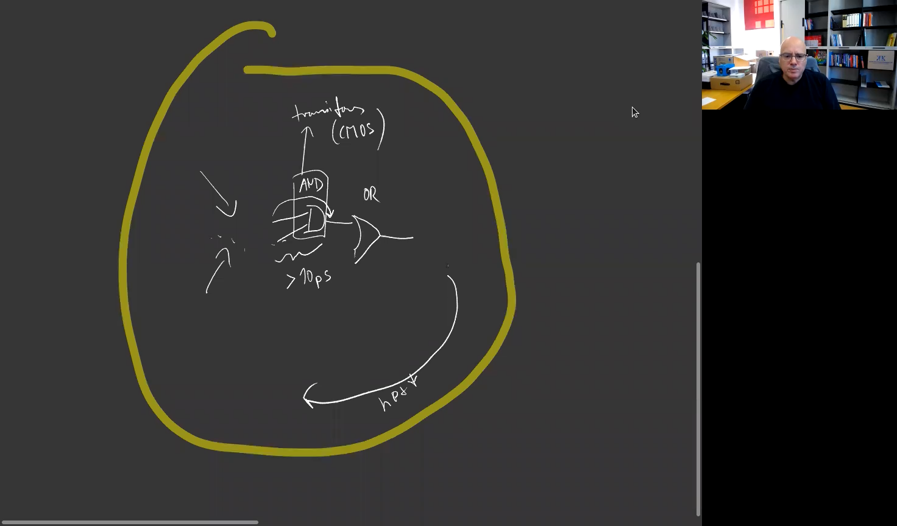
- `0:37:53`: this usually in the range that **this clock deration here is in the range of of nanoseconds because the clock frequency which is the inverse is in the range of gigahertz rates** nowadays as you see here it's more like a falcon got helpful current this for computers or even for fallon says likens french.
- `0:38:13`: and then **the inverse of it would be like one fourth of a nanoseconds which is two houndred fifty pico seconds** now if you go back to my picture and i would say like one engage taste tenant tenant take the picosecond compute and then there's like a another one here another ten seconds straight then he can only sort of have twenty five pico seconds.
- `0:38:34`: in one clock period... spring like a.
- `0:38:42`: twenty five with food this way and then **until then you need to compute the next state** and **then at that point you're getting the next edge** actually there's a trick here which is kind of a very old and very effective trick is.
<!-- - `0:39:00`: that in here like these things could actually use that if compete view you you don't care about sort of this or how it is propagates the changes in computation and then it will take them. -->
- `0:39:16`: maybe in needs **some time until the next state function stabilizes as it doesn't change anymore** but then it's fixed at zero in one for one bit and i just have **to make this clock appear long enough** such that this happens like **you have the computational trick...** through our oil.
- 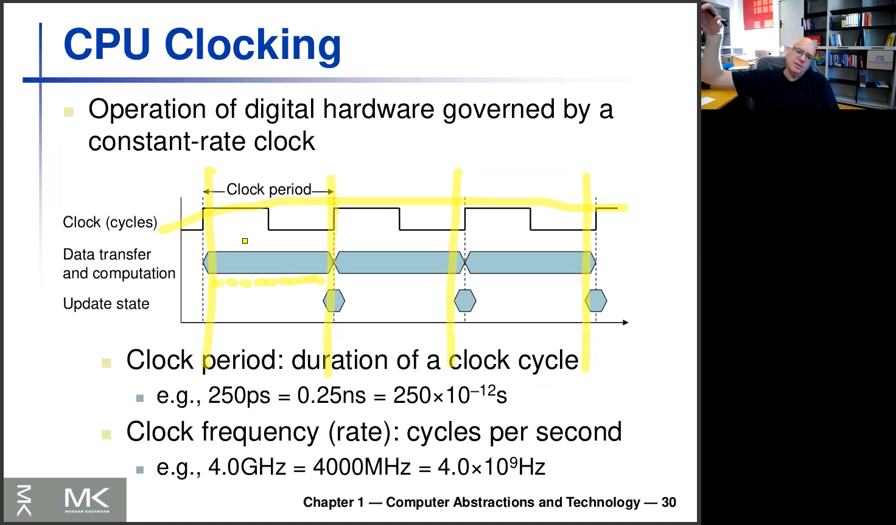
<!-- - `0:39:35`: our aim gates here that writes up and now i have the wrong color here hassle. -->
- `0:39:42`: and then **at the end of course that stabilizes because the state doesn't change** and then you have computed next to function **only at that point you're reading the next state and updating the current state** and and as a trickier so.
# ==============0:40:00==============
- 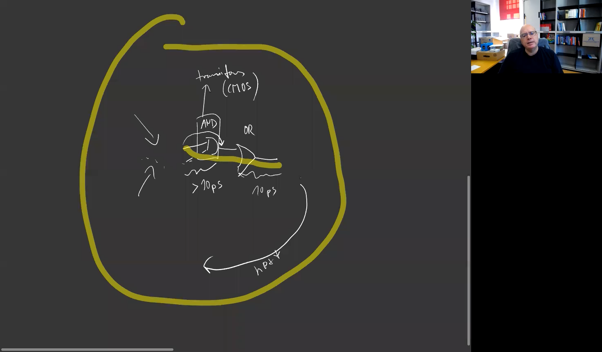
- 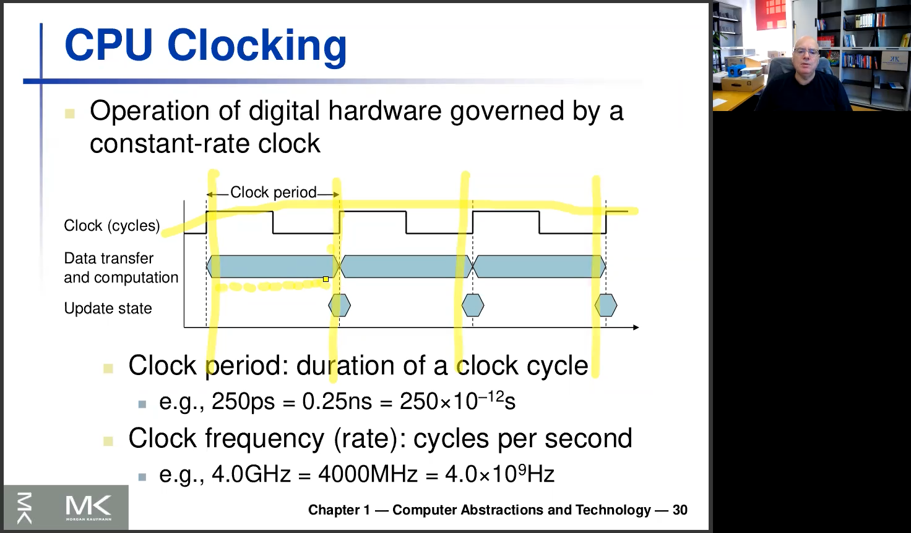
- `0:40:02`: this is kind of an edge triggered from the sign which i cannot go into but the basic idea is that **the dashed lines here, you really sort of open a little bit the the input for the next state when this comes back here**.
- `0:40:23`: wait here to read this thing here and then the **only a small** set of very rare is more like the the **fraction of time you will read here this next state and update this state here** and **during that time here the output is still kept stable** or it would take of perth lake also pretty long.
- 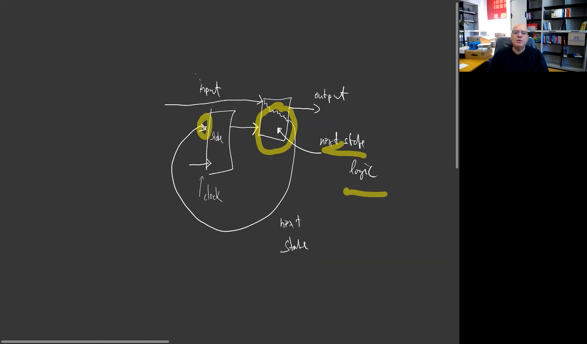
<!-- - `0:40:43`: an aunt was to to estate that is chased they change actual trickles down beard is annexed a function to this is kind of this this an abstraction you get here by having this edge triggered design alright but you see already here a very important fundamental to a pro. -->
- `0:41:03`: **problem:...** so you can make the **clock frequency only**.
- `0:41:11`: and air is supper **so high such that the clock period allows the logic like in our case the next state logic to finish it's computation and stabilize**.
- `0:41:30`: frank exactly as he can so so the point is **if you're making a clock frequency too high this clock down here would open up this input too early, then this**
- `0:41:48`: **next state logic would not be computed yet and you get strange response** we can only **then you have to slow down the clock** end and that's the point here **this of course depends on how...**.
- `0:42:03`: like **how many gates you have here** your like how much computation the **depth of this circuit here**.
<!-- - `0:42:12`: and awkward like lots of other things are which is not part of the topic of this class but if you would really want to really implement our design and processes then then that's what you would need to also traced like. -->
<!-- - `0:42:31`: one thing i just want to mention is that for now it's likely you have one output here and then this issue is like hung or ten times four times then this might actually or the produce here. -->
<!-- - `0:42:48`: for this guy here that would increase the the time here and then if it would just use it once so there's like also and then sizes of this you've been you implement these gates here with sea mosque you can also turn the knob into a once a size these are trans. -->
<!-- - `0:43:08`: justice in a certain way such that you can reduce the time here but then again this might have other effects so say any also there's like this is known that and on the physical air but like i wanted to explain your here and the principle which is clear right so he cannot you need to reduce the amount. -->
<!-- - `0:43:28`: of computation between two clock ticks. -->
<!-- - `0:43:33`: amin is if you go back to the graph you have to adjust for the slides is it how i mean the time between two crooker i mean the clock period is supposed to be the time for one instructional i'll be below the level of one thousand exactly this is what we're going to discuss. -->
<!-- - `0:43:53`: answer to the first and if you go too late at two am. -->
<!-- - `0:43:59`: to to the chip the forward you will see that in principle one instruction will be executed per clock that is of course not true and that's also what we're going to in the second half after. -->
- `0:44:16`: he didn't in this lecture today because **instructions might actually take multiple cycles** it might also be opposite so we'll see this later that you can even get **with clever like out of order technology you can even have multiple instructions finished**.
- `0:44:35`: **in one clock cycle** but if you think about the simplest kind of way of implementing of processes so for instance if the look at that and this is the processors rate then it would may be a part of the **input would be the program part of the input would be**.
- `0:44:54`: **the data** at the end and then in one clocks i picked execute one one the instruction button that's why this is a very particular question here then you need to do all the spirit create like like this complex instruction within one foc cycle and that might take too much time right because.
# ==============0:45:00==============
<!-- - `0:45:14`: we need to wait until everything in the worst-case stabilizes and then we have to. -->
- `0:45:21`: reduce the earth to the the clock frequency and to the the whole design will become slower so one **one trick we're going to learn is that the kind of splitting the work in such a way that maybe we do only half of the book train at one clock cycle but then maybe we can get a**.
- `0:45:40`: **higher throughput** so that's exactly the cradle you're going to to look at throughout this whole lecture so what you see here is his first sort of the simplest version and for the simplest version ah yes clock cycle as you said corresponds to one
- `0:45:58`: one instruction prayer but it's of course not the whole truth but that's why also do and it's what i said like i had this **five ways of measuring time. clock cycle is not one measurements** and we're going to discuss this in the second half of today's lecture and theoretical question the cia.
<!-- - `0:46:18`: yet how precise is the clock frequency and how is it general recall this is out there that this is pretty precise or did they have like a certain. -->
<!-- - `0:46:29`: then okay the the restore is it supposed to be pretty precise because they have a specific copy for generating the clocks have is like a clock generator i think is an oscillator or something and this is pretty precise however if you think maybe you could do another picture here this is awesome. -->
<!-- - `0:46:49`: part of his physical things i already explained here this part will be fair here right. -->
<!-- - `0:46:57`: and you need to put into it to get the clock to all this to do since you don't have to this is only the sort of schematic what you're really happy that you have lots of sort of different flip-flops like everywhere like the state elements which only one bit by hill horse the idea is that this whole thing your voice all state. -->
<!-- - `0:47:17`: and then of course you need to have something which distributes this clock right. -->
<!-- - `0:47:24`: and the some wires for rights will be started like the channels on the on the silicon and they also take time and you have the same issue as with his inaugurated need to make sure that you don't have too many so you might need to sort of repeat or sort of. -->
<!-- - `0:47:42`: is said of yeah and if you have a flip look very down here free then there's kind of something which causes a clock skew in whatever rain. -->
<!-- - `0:47:54`: and i but all of that is done by tourists to the it's not completely true actually so what's happened in the science is. -->
<!-- - `0:48:06`: not for a bj but for four wheel and a essex is that you're do kind of a top down design you go lay down in a level of abstraction until you hit sort of like the transistors and the routing but then at the very end made it to these effects such as discussed like hear this but there's need to distribute the clock. -->
<!-- - `0:48:26`: and to also have some some other like fame walk or whatever resizing of system sisters at you you cannot get the time you actually expected when you started from the pole case we have a feedback loop which unfortunate goes because really dance it's like if you would compile a program nowadays and then the compiler would say oh. -->
<!-- - `0:48:47`: yeah he fell and i cannot release what is to assemble instructions so please give me another empress marie and a heart of people already doing this that he could really go down to his lower level of physics and then you get maybe an issue you get he has a really long tiny pockets quiet and because of that we need to restructure the logic in that. -->
<!-- - `0:49:06`: in the end make mean you need to re be signed some parts of your pipeline and software and not that used too much to that except that what you what you saw with the example with my success of it's also very similar instead of you will really have this leaky abstraction you cannot get it as fast as possible then you need to understand. -->
<!-- - `0:49:27`: what's going on at the bottom and then change the way how you design as something like some live it up or maybe even might have been in your stretched. -->
<!-- - `0:49:38`: okay so clock is precise a principle but you have a physical effect that the clock is also just like the wire which is like like needs to connect all these so all these flip-flops then furthermore actually you will have multiple clocks when the memory system has it's own clock. -->
- `0:49:58`: and then the discussed already do **multiple clocks** on on the cheap and and then the input and output the chips hooper sort of parts of the chip you have might have blocks of will and today's circuit chip you with if yes like the range of of six or even a docent.
# ==============0:50:00==============
<!-- - `0:50:18`: sir clock sexually okay so same principle yes. -->
<!-- - `0:50:23`: but yeah there's this specific issue that it need to be stupid the clock and then there might. -->
<!-- - `0:50:30`: alright one more question clocks so in modern processes you can do something called overclocking is that mean that the time is nuts i mean that meant that the time can be optimized rate yes exactly and what's happening and that will be discussed is a little bit i think there's also the slights but i don't. -->
<!-- - `0:50:49`: thing today is that when you you can increase the clock but then you need to guarantee that the sun. -->
<!-- - `0:50:58`: and the snitching he sought is actually this is level below that of the gates on the transistors as a quads switch lever but you really take into account like the transistor switch times rain and maybe even one day the one you have revisited the the critically alike for the. -->
<!-- - `0:51:18`: optics but at the switch level rate then you will will have to have models which pretty okay if you do it like that then you will put you with more heat rate and that's than the effects in order to keep the computation. -->
<!-- - `0:51:33`: pass morning off right then you need to sort of we had this year in the apa picture here if you keep them white small enough for each gate right then you'll need to. -->
- `0:51:44`: produce more heat and this heat needs to be taken out like for those who beat their own gaming machines they know that if they increase the the frequency they put to this **over clocking then they have to add more cooling to the system**.
<!-- - `0:52:02`: okay. -->
<!-- - `0:52:07`: so i'm not sure so where we have now the half time. -->
<!-- - `0:52:15`: and question and nonsense so i will stop the the recording paused the recording for a second and then not stop sharing and pause it just hope they don't kill it. -->
<!-- - `0:52:36`: alright so now that we saw the importance of this sir. -->
<!-- - `0:52:43`: clock here and it really am. -->
<!-- - `0:52:47`: yeah so it's it's a kind of an artifact grade of all this certain implementation is done like this abstraction eg he was getting but that's what i explained at the very beginning so we have layers of layers of abstraction and here the layer is is a clock and this so soon christmas. -->
<!-- - `0:53:07`: clock based design. -->
<!-- - `0:53:12`: and i alright you're not sharing screen again sculpture thank you. -->
<!-- - `0:53:20`: i help you. -->
<!-- - `0:53:25`: i'm sharing screen again okay sub so here you can on the computer of course the cpu time but it's like the number of clock cycles time the clock cycle times i should point out. -->
- 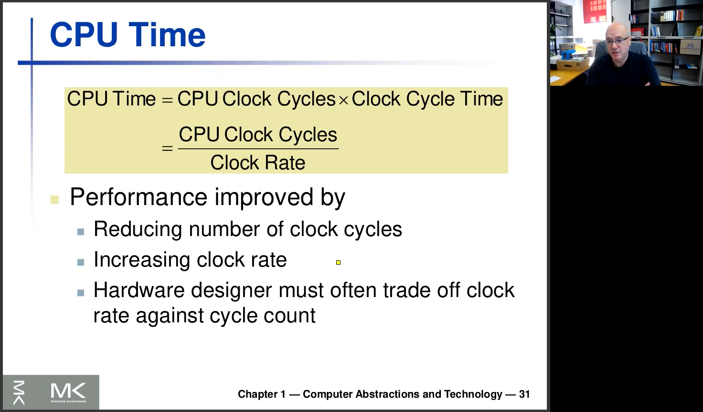
- `0:53:41`: at **the number of clock cycles is of course something you can actually get from the processor** are **usually processors have an instruction where you can read...** the current number of **the current clock cycle and then like it's usually sixty four bit register** and **then after you done**.
- `0:54:02`: **with a program you can also get the clock cycle and then you take the difference then that will be sort of your the number of clock cycles it took for your program**.
- 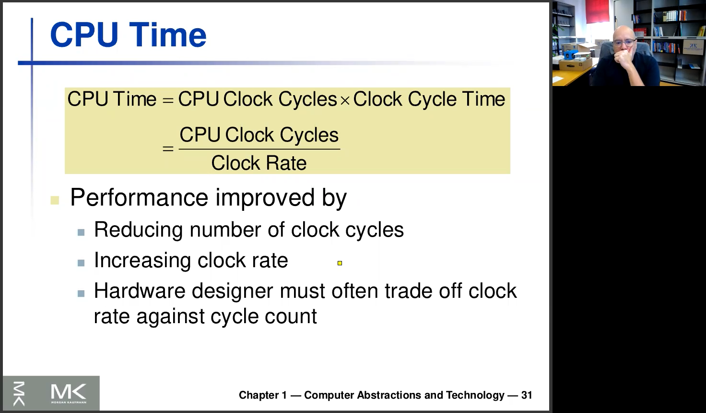
- `0:54:12`: and then the cpu time then of course is because the drop rate is is fixed and actually this is also completely true anymore **there's ways of slowing down the clock...** or as we discussed right of **intel has this thing like turbo mode...** or something he heard about tube remotely from.
- `0:54:32`: this exactly means the opposite for your **you know that like maybe there's only one thread running but it's like this matrix multiplication that needs lots of power...** so that's is what happened to my laptop right then i got the zero point eight seconds and **therefore i actually slow down all other cores which are not needed** because i'm only thing.
- `0:54:52`: matrix multiplication and **then i increase the clock frequency because i'm still can sort of keep below the temperature budget** so like the heat can still be from the chip **this one core which is running...** will not conduct **is then allowed to produce a little bit more heat than**.
# ==============0:55:00==============
- `0:55:12`: **usually** fall for already.
- `0:55:15`: but **if you ignore that...** sort of like this like yeah it's pretty like more than ten years to decide third of this **clock scaling** and then your do you compute the cpu time as the number of clock cypress times the clock cycle time like this period so before.
<!-- - `0:55:35`: between two. -->
<!-- - `0:55:37`: fuck edges. -->
<!-- - `0:55:40`: and all if you want to say the frequency so the recording the pu great but i for some reason i prefer frequency it's the latest with the ghosts of this clock cycle time i think you get the point right i think this is not that complicated. -->
<!-- - `0:55:56`: maybe i should also point out that it's some or some companies actually they they do a dual. -->
<!-- - `0:56:04`: the edge design and so unlike junta does for instance so they would have they speech some flip flops here at this part in this flip some flip-flops here and this is a kind of pipelining which we're going to discuss actually but this is like a very low level. -->
<!-- - `0:56:24`: eight and and of course they're trying to do some semi automatically these days about putting for us at the the basic the most simple notion of this is that you only have the rising edge it's called like when putting up the edge you will need to stabilise the next day logic into. -->
<!-- - `0:56:43`: incomplete mixed team. -->
<!-- - `0:56:47`: okay and in the simplest models that what i just said like a fixed clock no truck skating and and yep. -->
<!-- - `0:56:56`: only sort of rising edge synchronous design then this is your cpu time. -->
- `0:57:04`: okay now we can of course increase the clock rate this is what this fox killing that his tuba mode of into a trademark ring at an a does and you can **reduce the number of clock cycles...** and so the question is how can you do that well.
- `0:57:22`: **can make instructions more complex for instance so that like one instruction does much more work than some others** this way you decrease the number of clock cycles.
- `0:57:35`: on end and this is a tradeoff and yes it is a **risc five** of what we saw actually goes into this direction of of **making things simple** and and **making jops a little bit more complicated** in the sense that **you might need multiple instructions** but **because of that**.
- `0:57:55`: **the individual instruction is simpler to implement and therefore you can increase the clock rate** so this is kind of what we're going to look at now.
<!-- - `0:58:09`: and yet and yet you continue to sutton some of these computations but i think at least for me it's pretty obviously you have clock rates and clock cyclists and then you compare how much or how fast something is and and we're going to do this. -->
- 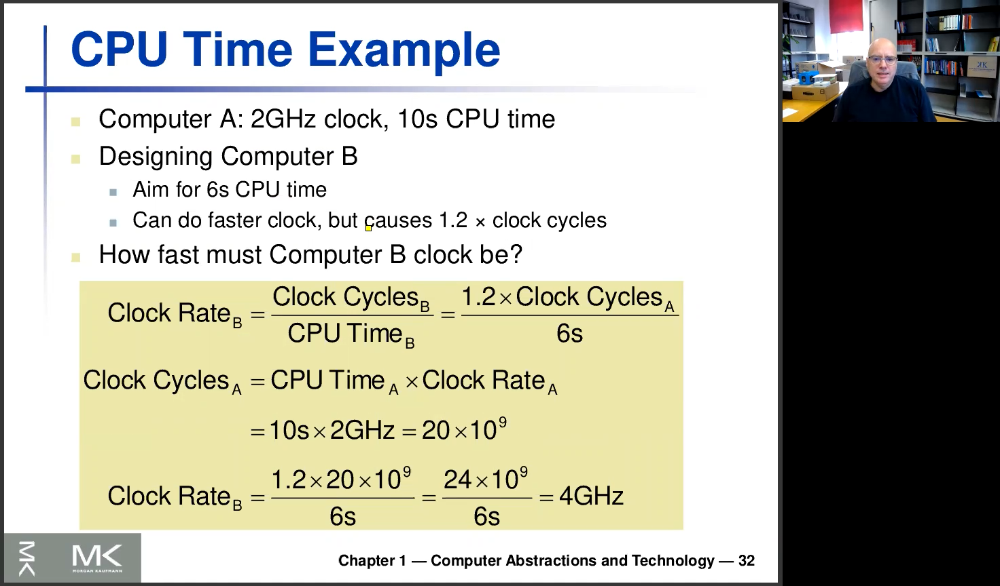
- `0:58:28`: indeed **the exercises** is next.
<!-- - `0:58:32`: week in details so i think this is something one really has to sort of stone into some computations and it's perfect for for the exercise so i'm not going to to do that now. -->
<!-- - `0:58:45`: what i want to do the show also is this in instruction count and dislike of the instructions but as i said there was this excellent question before whether each seven o'clock cycle would it would execute one instruction is of course natural because. -->
- 
<!-- - `0:59:06`: b. -->
- `0:59:08`: if you're a for instance doing pipelining then it might be actually the case that you're you're having **for each pipelines state..** just be going to see we have like **...one clock cycle** like to execute this pipeline stitch but **only if you run through all the steps in the pipeline**.
- `0:59:27`: **you finsih one instruction** and that can actually be likely that i think the maximum washing up with pentium four which was around twenty stages rates vs twenty clock cycles until one instructions change.
- `0:59:43`: **however if you keep this pipeline busy you will actually still produce like one finished instruction per clock cycle because it just lots of overlapped**.
<!-- - `0:59:53`: and. -->
- `0:59:55`: and in addition it might be that you have for you split the work even inside of the process or not like at the core level but inside of the process i have some **parallelization...** to remember this nice pictogram we had with the airplane ride and a valuable set of fences to do additional payroll.
# ==============1:00:00==============
- `1:00:15`: it could be done in one clock cycle and if you just had to to efficient operations in like an hour metrics example of a method that wasn't multiplication and addition so many of you can actually do them in parallel and **then for both of them one will only need one clock cycle** so **this is why there's not a direct correspondence between clock**.
- `1:00:36`: **and then instruction**.
- `1:00:40`: but of course like **on the very high level we can compute maybe an average number of cycles per instruction** that we take our program the measure like how many cycles would we take the instructional average like one point four for instance and then multiply this by how many sparks.
<!-- - `1:01:00`: his behalf and then we get the the clock cycles and by that begin again get the cpu time but no depending on the number of instructions we have. -->
<!-- - `1:01:11`: and the reason i'm showing the movie this is because this is what they actually use in in in this a benchmark the spec benchmarks between to the discuss now and. -->
<!-- - `1:01:24`: of course. -->
- `1:01:26`: **what kind of instruction and cycles per instruction depends on the program then** because **for for different programs you might have more instruction that take long time like for instance multiplication might take a long time** or like lots of **memory accesses takes a long time, that's actually the worst thing** so this is why i showed you before or.
<!-- - `1:01:46`: it is a memes in this case line of excess cones because that's the. -->
<!-- - `1:01:52`: one of the sort of bottlenecks the memory exists but there may be other computations the memory is not the bottleneck but the sort of extra maybe like floating point computation. -->
<!-- - `1:02:06`: that's probably true for this matrix but a completely so loose look at that later. -->
- `1:02:12`: **so different instructions have different clocks per instructions and then the different programs have that too** and yes lenny can do **again with this model you can come do some computations** and the various tradeoffs for so you can implement a **processor which has...**.
- 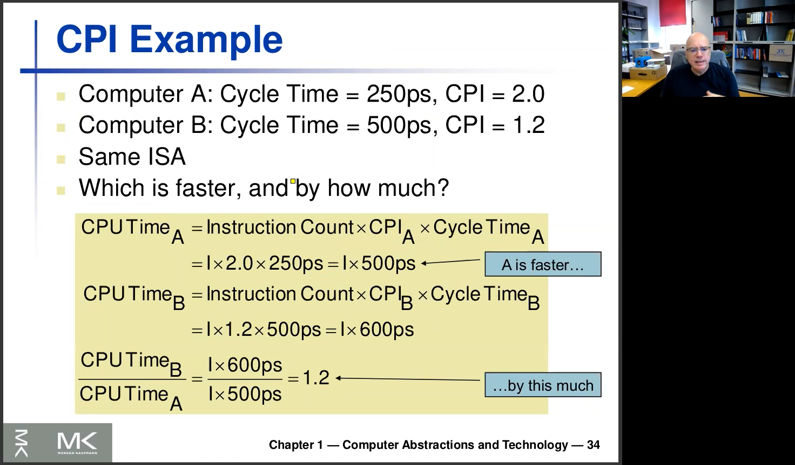
- `1:02:32`: **smaller clocks per instruction and then another one but then the clock cycle time goes up** on and that's what you see yourself in these examples and and we'll do this in the the exercises more details i think the principle should be clear.
- `1:02:53`: and yes and then of course do what you really have he says i think i hinted at that already that sort of **for different instructions...** like addition or multiplication **the average clocks per instruction are**.
- 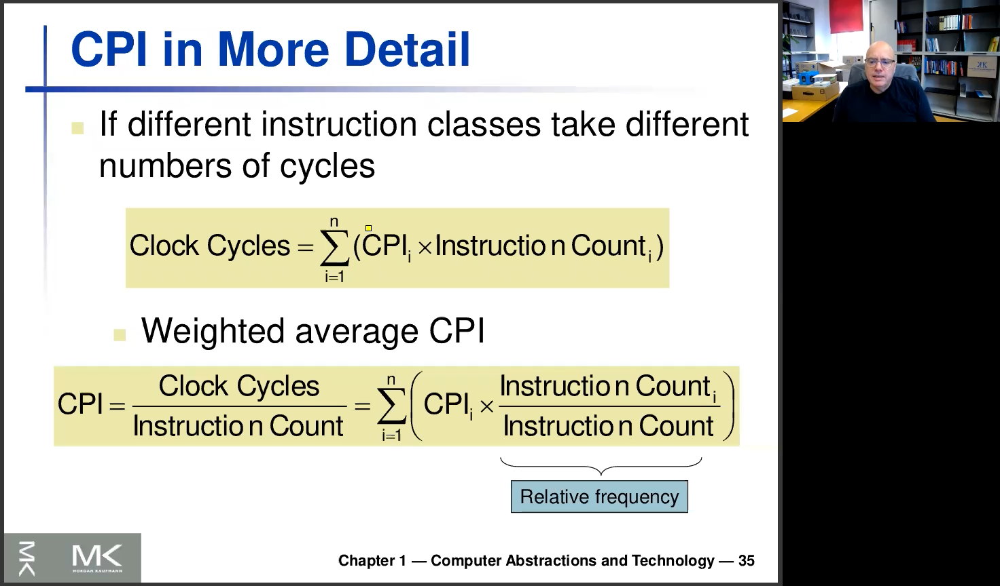
- `1:03:12`: **different** and that's why you made it great so you take her there maybe in this brooklyn might have like eighty percent additions and interests that this clock clocks pill addiction and then so many loads and whatever applied to the references and that's why i he has like a more precise modern of his thing of later.
- `1:03:32`: ethan and **one addition will not always take the same number of cycles** fall for very very very reasons but like the **it's way more precise as if you would just take the average clocks per instructions for all programs**.
- `1:03:53`: alright and then again we can do an example but like like such a computations and this will be best done in an **exercise** it's not really complicated it's just the weight off of seeing these tradeoffs maybe more with real numbers we're going to do this.
- 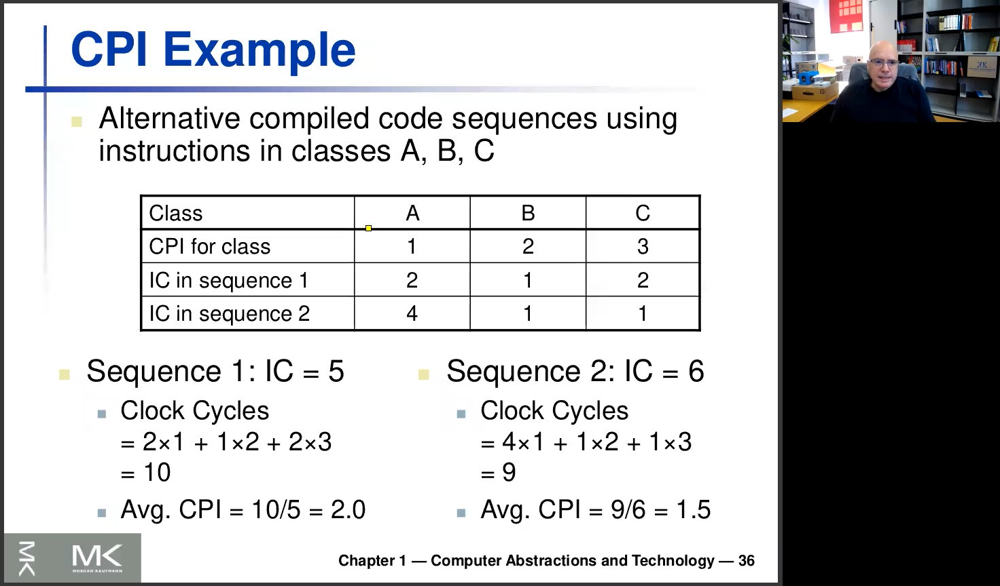
<!-- - `1:04:13`: next week on the exercise she. -->
- `1:04:16`: alright so you could do it like that so you take the instructions per program you take the o'clock cyprus banks extraction and then the **seconds per clock cycle, the clock period** in this way gives you the cpu time and of course like the algorithmic issue so i'll show you some later.
<!-- - `1:04:36`: quebec actually with this so. -->
<!-- - `1:04:39`: with his. -->
<!-- - `1:04:42`: matrix multiplication a program because that's actually not in the book but this like a very nice trick on you check the herbs and and get way better matrix multiplication then we saw already this example with the programming language bright so we were if you use python we. -->
# ==============1:05:00==============
<!-- - `1:05:01`: when he produced way more instructions because python interprets this so while it compiles into the despite quoting and interprets despite code which takes way more instructions than this compiler a business program produced by the c compiler which sort of almost close to the metal to the re processor only it. -->
- **algoritm: use better algorithm for e.g. matrix mulitpilication**
- `1:05:21`: has the necessary instructions vessels and **c: no type checking going on and so on because it's a typed language** and then of course we saw this in the compiler so much that i remember **o three...** would likely involve way more crisis **compiler optimization** in that there were two assists **reduces the instruction count** and.
- `1:05:41`: also because **it might actually use cheaper instructions the clocks per instructions** and then last not but least this is what is the core of this lecture so these cushioning some pop we will not really look much in this lecture but you need to be available anyhow.
<!-- - `1:06:00`: we will look here at the bottom at this that what you could gain by. -->
- `1:06:06`: and by by by changing or or kind of and using a different instruction set architecture so really look he and his lecture hall houses of the architecture which means should be similar **how the design of the assembler language affects then later the design of the process on which allows for optimazation**.
- 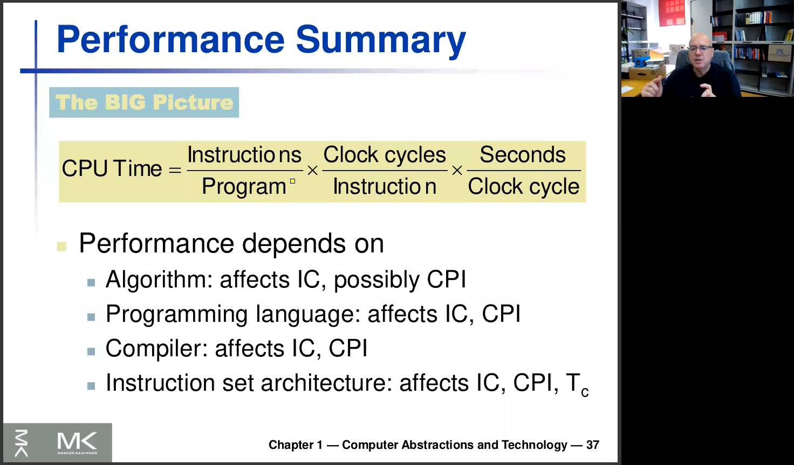
<!-- - `1:06:26`: last certain optimization which is at the core of chapter four and. -->
<!-- - `1:06:32`: and to some extent a certain sense we are optimizing here in this lecture he owns the last bullet of the instructors architecture and one that gives you. -->
<!-- - `1:06:47`: alright so here's do. -->
<!-- - `1:06:51`: powell trends i think one should switch should explain this and it explains lay curb one particular aspect which some people call it the like there was the **pile wall** in two thousand and. -->
- 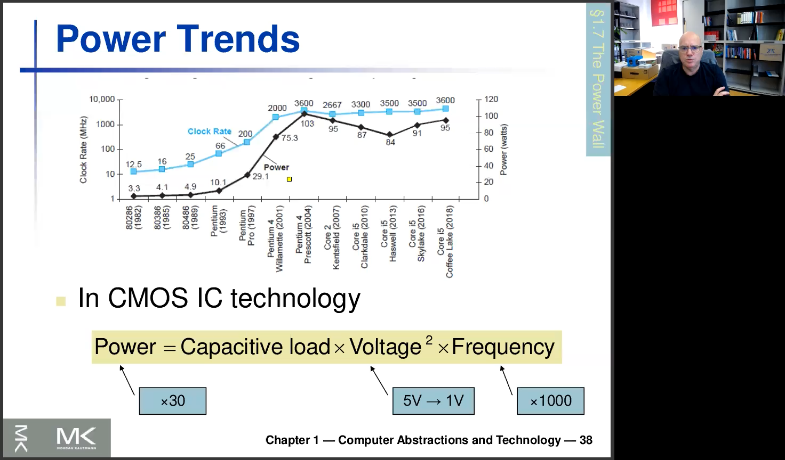
<!-- - `1:07:05`: for three of my favorite one he released and. -->
- `1:07:10`: because there's a **nice book** and the **race for a game machine** it's content books if you want to note that cohen's toronto she knew what his **yellow line...** is.
- `1:07:21`: this is when the playstation three and the xbox three sixty processes will be designed a clean austin in texas and they were both designed by either him and his book i was just mentioning like the race for a gaming mashine is.
- 
- 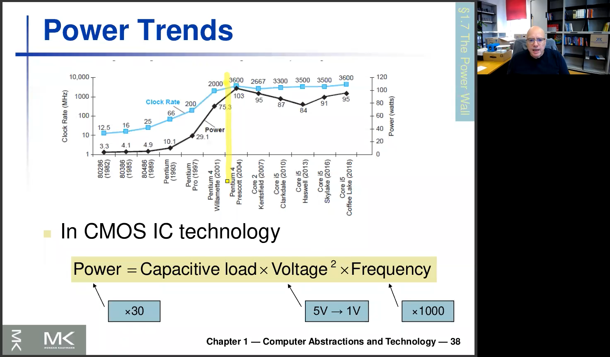
- `1:07:41`: about this trend situation that both companies like sony and microsoft i asked i be able to build a processor for them with out knowing that the other one was listening but of course competitors and during that time artist was also like when input was working on these pentium four.
- `1:08:01`: oh it was really **the time that this sort of cmos technology hit this power issue that likely there was no way to to get sort by scaling down the**.
- `1:08:18`: **the transistors and increasing the clock for instance get faster processors**.
- `1:08:24`: and **so everybody now started to have two very long pipelines** of his phantom four was the this twenty est packed them was mentioned before ending additionally **since then we are really pretty stable in the frequency** and authority to see this because this eleventh hour turrets like here i think like in this book.
- `1:08:44`: it's was said **ibm expected that this power pc in in these machines they were using would go up to even five giga house which we don't have today...** and the reason is because this would just produce **too much heat which cannot be offloaded from the chip** and.
- `1:09:04`: and another aspect which is in here but it's only a side note here a date you **could also actually dramatically decrease the power needed to run a processor by decreasing the voltage because it goes in quadratically...** but there the.
- `1:09:24`: signers like his **physical designers already hit the limit of what is doable and so it seems like we cannot go further down without...** making so **producing lots of noise, then these signals which are used in his gates are not precise enough** and he would turn down the **voltage...** so then what did she **means the difference between zeros**.
- `1:09:44`: **and ones** that are **capacitive**.
- `1:09:50`: **states** like in this scene was watching.
- `1:09:53`: okay and that's why at **around that time** so almost twenty years ago **people stopped scaling the frequency and it's only because of power we cannot produce we cannot increase the frequency more with all these transistors without producing much more heat**.
# ==============1:10:00==============
- 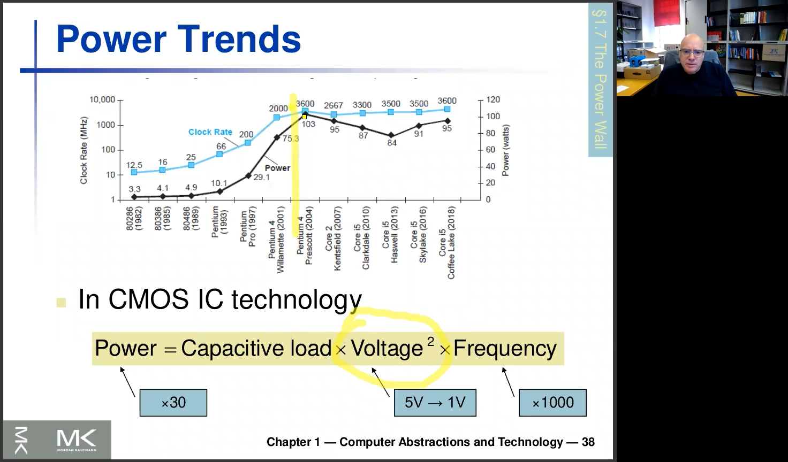
- `1:10:13`: however the the the moore's law which they removed six people because it kind of seems just to story continues partially not exponentially anymore but maybe like a pony is likely to increase every year which means we have **more and more transistors and the only way then to**.
- `1:10:33`: **to sort of stay within this power budget you have**.
- `1:10:39`: **to add more parallelism** on the chalk and on the on the on the on the on the corso so this has started to you within tulsa this is the into history **around the time when they realize this...** and this is a **core two and it**.
- `1:10:59`: **and it had mulitple cores on one die** and it continues of course nowadays behalf for lots of course like you can buy machines with sixteen was easily even as a consumer and your phones have eight cores and to.
<!-- - `1:11:19`: yep and ccfl course is something you can have for four and a silver and. -->
- `1:11:28`: by the way **also around that time the graphics cards were really like making a big impact for the games and other applications because they would really go massively towards this parallelization would have lots of cores like thousands of cores**.
- `1:11:47`: hurry and and here's an **example how you compute that** but i i think we do not even put this into the lecture because i think this is too too specific.
- 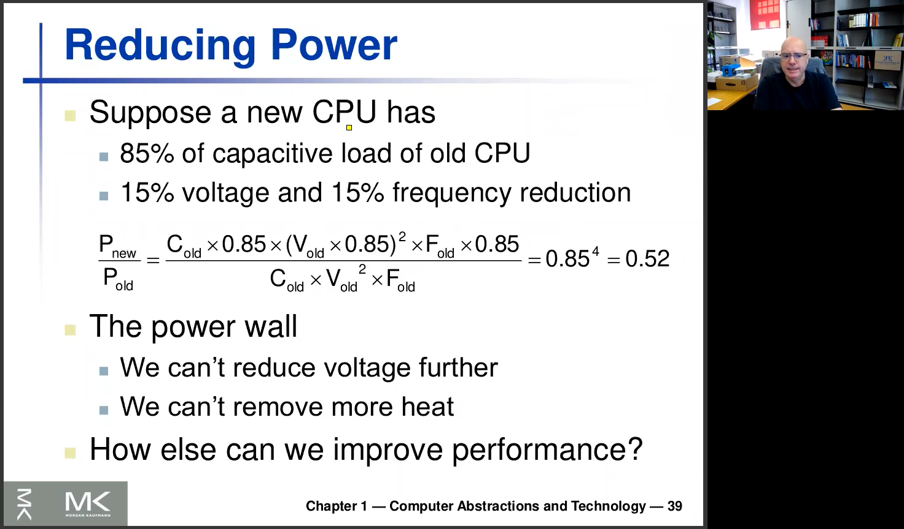
<!-- - `1:12:00`: okay and you you kind of see em again like a entered and other processes like how much. -->
- `1:12:11`: the improvement began in the eleventh hour around that time so those are the three i mentioned before it is two processes for the gaming machines by design and since then the the the the slope here off the single thread winnipeg processor performance it's coin.
- 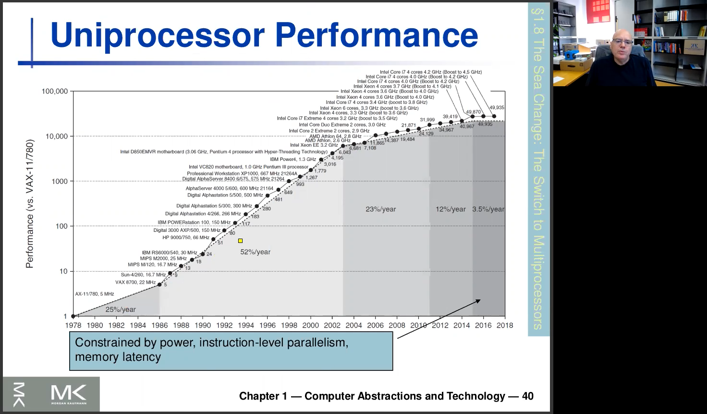
<!-- - `1:12:31`: really slowed down right so here it was. -->
<!-- - `1:12:36`: it still seems to be exponential we're not sure really have any more rights etsy really seems to like. -->
<!-- - `1:12:42`: having this shape right sorry about that shakes me to get my tablet. -->
- `1:12:48`: like here this almost looks like a straight line rights and the system **exponentially because again here we have a log scale** patio like the yeah it's going arm in and maybe it's not even a straight line anymore and then it will not be an exponential improvement anymore if you have a linear texas.
<!-- - `1:13:09`: right so i mean here it's like still up if somebody writes three point five percent per year that innocent explanation improvement like he said it would be nice to have that much interest these days on your money but it's clearly slowing down however still be getting more and more course more and more transistors. -->
<!-- - `1:13:27`: one more course so he over all the machines which could actually still continue to to improve and the reason for the improvement the most recent improvements here was i would say there's more amd machines actually so it stops it too. -->
- 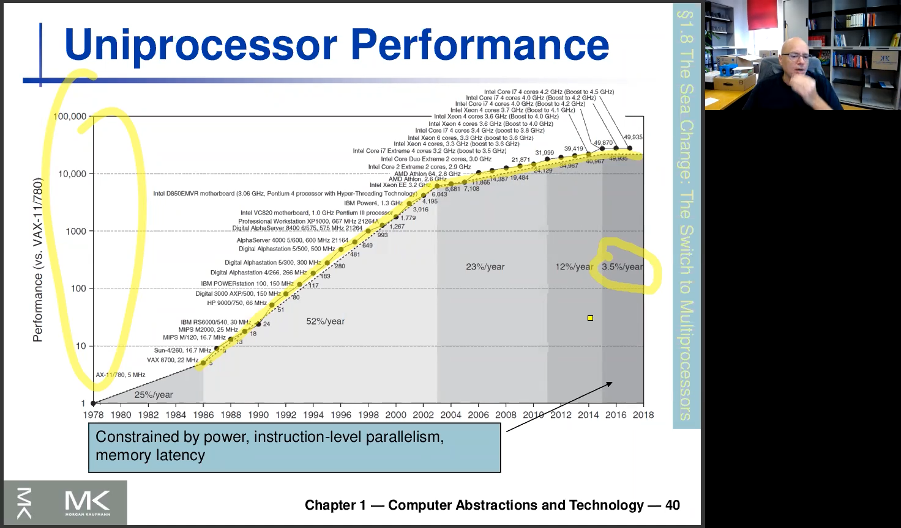
- `1:13:47`: thousand and eighteen but we actually do have quite **some improvement here from amd** and that's due but my understanding is that this is **due to the better caches and better memories** so maybe the actually sr if this continues like chump through the pain.
<!-- - `1:14:08`: empty machines these days. -->
<!-- - `1:14:11`: okay so but we have mighty processes so that's mighty force it originally was called mighty processors happened now it would say mighty course and this requires explicit parallel programming which is really a beast as i mentioned before i've been teaching this for quite some time and we'll talk about. -->
- 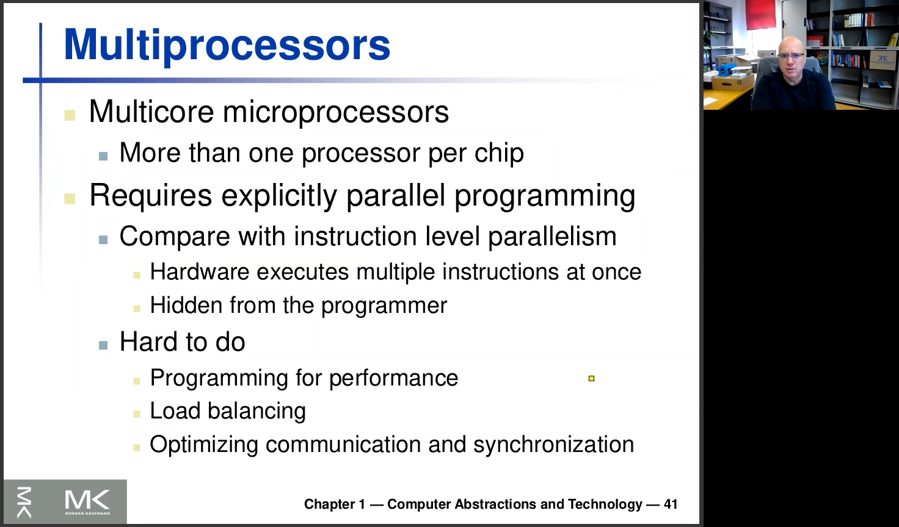
<!-- - `1:14:30`: just in the last chapter of the book and also at and it's very hard to do so some people say it still requires hero programmers to really get sort of this and like mighty cause will use the pro like this mighty course in order to get them the improvements. -->
- `1:14:51`: ns and while the some of this **other parallelism we're going to discussing this lecture like pipelining and out of order** this is something which **is transparent to the programmer to get this for free** in a certain sense except again.
# ==============1:15:00==============
<!-- - `1:15:11`: have this leaky abstractions and there's one leaky abstractions which you should be aware of and we're going to discuss this later this is. -->
- `1:15:21`: and branches so practice might be mis predicted then did you have that you will fall for the reasons you learn in this lecture you will slow down your program and that's why you **should avoid cranches** you believe in going for ultimate to performance.
<!-- - `1:15:42`: now last but not least that is more on so we can relate to. -->
- 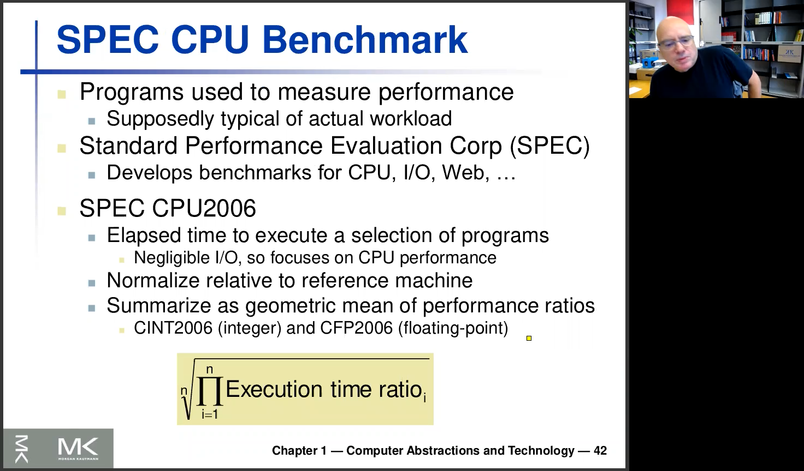
- `1:15:49`: much of exercises on this the only thing which is interesting here is an exercise in maybe also in in general here is this what you see here in the bottom and b is this this whole piece **one of the most important benchmarks in the computing industry the spec benchmark** cars xp.
<!-- - `1:16:09`: you didn't. -->
<!-- - `1:16:11`: i found so i didn't look at that much into detail before i read the book and so the type i find this quite interesting so let me explain this to you. -->
- `1:16:20`: so nd the the thing i went to was was interesting forty for the for the bin for the exercise is is this part here that **they use the geometric mean and not the arithmetic mean** and to so what's the spec benchmark okay so what they do is they take.
<!-- - `1:16:40`: so the physical its parameters to put the eater i'm sorry for my pin. -->
<!-- - `1:16:47`: so this is spic spic two thousand and seventeen and. -->
<!-- - `1:16:57`: i. -->
<!-- - `1:17:01`: a cases of hiv some soccer and. -->
- `1:17:07`: how did he do this with a big ticket sort of a **set of benchmarks which are in programs and they run some computation** and you probably are familiar with many of them said like there's a a program which is also scripting language.
<!-- - `1:17:25`: then there's like a compiler here is. -->
<!-- - `1:17:30`: route planning these creepy ben simulation that's like the four simulating networks and then this is some text parsing length the better application will be looking bitch. -->
<!-- - `1:17:45`: new compression that's like my izumi snuggling in the cloud with this recording yeah some deep learning yeah we've mentioned already if all goes to this monte carlo tree search is behind then i forgot this is not difficult because it doesn't have to be owning it but the multicolor research. -->
<!-- - `1:18:06`: then there's like some classic the search for sudoku and compression okay and then it isa would have afford this particular law and so you need to use a compiler they probably houston into the compiler like gcc whatever and then for this particular program at this particular input in. -->
<!-- - `1:18:26`: more instructions would be like the two thousand billion instructions for this perl benchmarks and so on and as you can see the kind of wanted to have the same range so they are all in this sort of thousands of billions of instructions. -->
- `1:18:41`: then you'll see it here the **clocks per instruction in this differs wastly** writes of the **perl interpreter...** is.
- `1:18:50`: that **is actually making use of his am out of order hardware quite effectively** heal even more right so he would have er you only need like zero point three clocks to finish one instruction so they can be heavily heavily paralyzed within the processor while the.
<!-- - `1:19:10`: other cases i would still have the most heavy one on on business is this town here this data compression seems to not be able to to finish instructions much python one clock cycle like. -->
<!-- - `1:19:27`: like average clock cycle every four cycles per instruction you spawn points for anyhow so you get this mix and somebody has to decide what to what to use there. -->
- `1:19:38`: then the the **clock cycle time is constant** this was one of the christian which is also not completely true on all machines so **maybe this was the machine they used in the google cloud but this is important and there's no turbo mode or whatever happening here** to you in.
<!-- - `1:19:57`: and then let's eat an actual time it took to to to run this. -->
# ==============1:20:00==============
- `1:20:03`: program on this machine okay so we're trying to measure here this processor how fast is this procession it took is this much time now what does spec two so it takes now this a **reference time...** and this is and so i had to look it up so this is usually some **some strange process**.
- `1:20:24`: for years he was always a sun machines and i think since son does not exist anymore the students use but **they still use these hardware because there's like this spark hardawre** the **spark is the latest processor which runs this sun assembler**.
<!-- - `1:20:44`: and i. -->
<!-- - `1:20:46`: then they have to be like one machine there and and also execute this the programs on that one will of course be different like a different program because the compiler will produce the central for the spike machine and it will take that much time for instance for this data compression as almost. -->
<!-- - `1:21:06`: this thing is actually faster but for other things it's like twice as as yet even almost like three times as. -->
<!-- - `1:21:15`: the fastest zoom that this entire machine masses despite the machete. -->
- `1:21:20`: okay and **then you divide these times you get then this column here at the end** okay.
<!-- - `1:21:26`: and then this gives you yet such a set but this is almost three times two point four i mean here's the biggest difference four point six one for the compiler it seems like the compilers have a faster are running on a on on into it and on the spark and a year but here for co. -->
- `1:21:46`: impression slightly the opposite okay and then and it's the ultimate thing and as this expands this former enough **you need to compute an overall number** so you want to say somehow **compared a spark machine a intel machine is two point three six faster** dependent.
<!-- - `1:22:06`: and that's computed deal with his geometric mean and. -->
- `1:22:13`: and if i still have time i will show you the sauce on the blackboard and **then you can compare two machines** so you **can also maybe runner amd machine** and **then his amd machine would get maybe a different number like four point five** and **then you want to say this amd machine**.
<!-- - `1:22:32`: is sir. -->
- `1:22:35`: since they are **is so much faster than the intel machine** and then you'll probably **want to divide this four point five at by this two point three six and then this**.
- 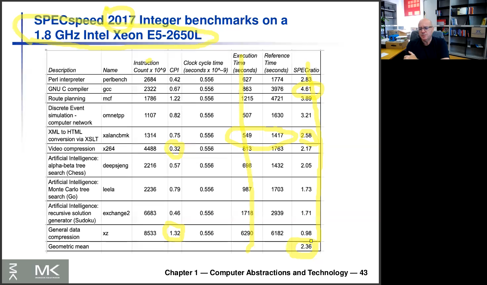
- `1:22:47`: this **vector should give you how much faster amd machine is**.
- `1:22:55`: and **for that you need to do this and geometric means because otherwise the reference machine time would actually have an influence**.
- `1:23:08`: okay so this is **there's also like a power version but i don't want i want to skip that** because.
- 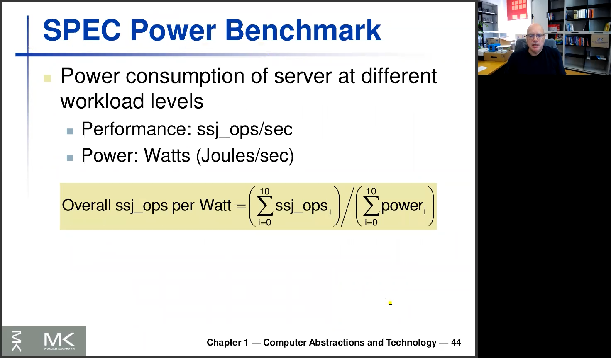
<!-- - `1:23:16`: that's something i i don't want to explain so we're missing this part on the pins fall under the law and the fallacy low low hour at either end and so i be not explain this and now may be next. -->
- 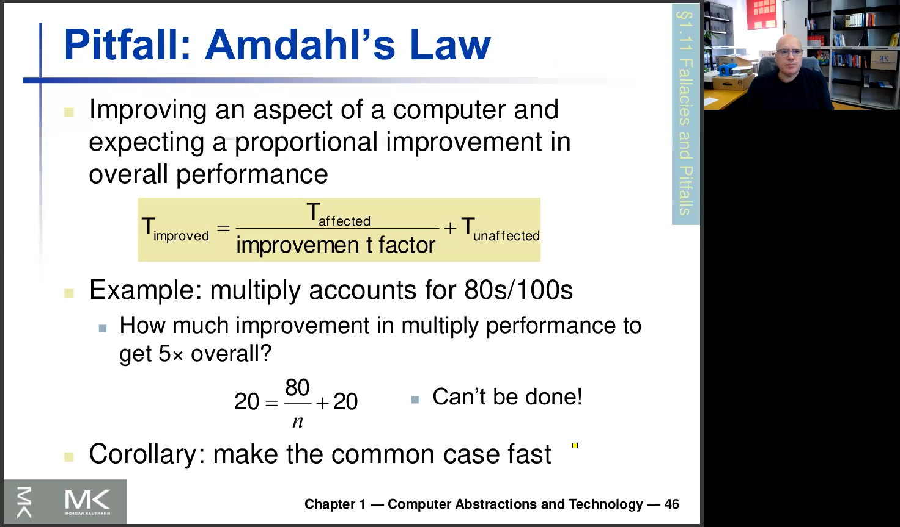
- 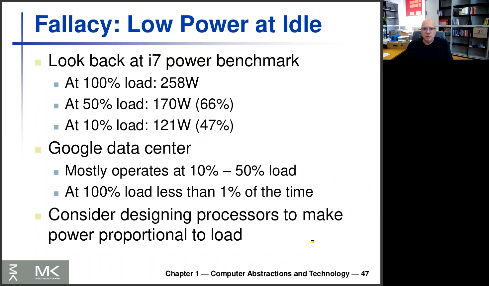
<!-- - `1:23:36`: sweet but i. -->
<!-- - `1:23:40`: so that would lead me to the end and i'm open for questions. -->
<!-- - `1:23:48`: so we already have some questioned into chance. -->
<!-- - `1:23:55`: so first question is why the geometric mean and to think of no no other mean like the arithmetic mean this is exactly something i can show you a very fast i'm still sharing right yes. -->
<!-- - `1:24:12`: so i need to have a new page so i'll do it very fast and then we could do this awesome exercise but i felt like i i'll i'll do it so if you're. -->
<!-- - `1:24:27`: i have and. -->
- `1:24:31`: since also not explained in the book so that's why this information is not by me so **let's assume...** so the first term.
<!-- - `1:24:40`: a machine like the pics s one second for the first program right so let's say compression and the as two seconds for the for the. -->
<!-- - `1:24:52`: for the second in let's say completion rate compression and compilation and the reference machine here takes all one and part two and then there's the second machine so maybe this is into a hear you're here this is interest rate then. -->
# ==============1:25:00==============
<!-- - `1:25:09`: the other one here this t one is our amd machine. -->
<!-- - `1:25:14`: okay now if you recall it would be the score of this thing would be like the view speak score would be if m m s one divided by all one times and asked to divide it by our two okay. -->
<!-- - `1:25:34`: k n and then if you want to compare it against the eight this pic of the other machine then you would get t one he might but all one. -->
<!-- - `1:25:45`: tea to be mined by party to knesset can see these guys cancelled right. -->
<!-- - `1:25:52`: he writes i would actually just get rid of the square root of the the second skier geometric means of the seconds would be kind of this this thing here goes away now if you would do the same with the arithmetic mean break you would tiff m s s one or what. -->
<!-- - `1:26:11`: our one plus. -->
<!-- - `1:26:14`: as to over rs two provided by and yet one half of that is kansas i'm not showing this or welch's to make sure you don't forget. -->
<!-- - `1:26:29`: ah right. -->
<!-- - `1:26:34`: sorry d two he might have but are too. -->
<!-- - `1:26:41`: then what you actually get here at the end is or s one or two plus s two on one divided by it or just put it wednesday at t one or two class of teeth who are are two or like. -->
- `1:26:59`: awhile and now you see there are these guys here and say **it depends on the the machine you using as comparison like in our case was the spark machine to determine this ratio** and it's like why **it's better to have this ratio where**.
- `1:27:20`: **r's go away then the ratio of arithmetic**.
- 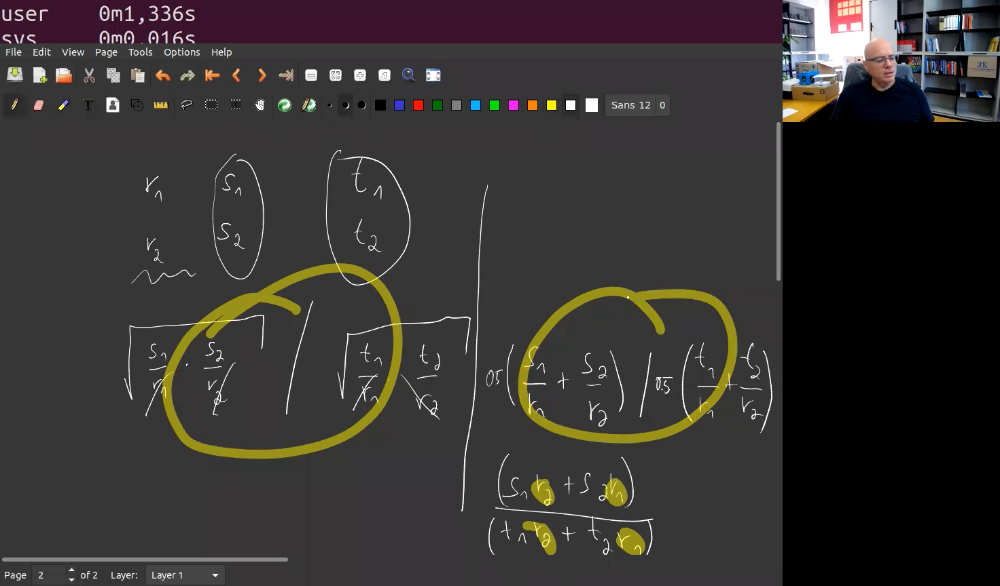
<!-- - `1:27:24`: elkins explained that's what i want to explain so we still have like maybe like one or like fourth in one equation or some. -->
<!-- - `1:27:34`: okay so then one should question so modern processes have rebel frequencies to minimise poet usage which mechanism increase and decrease the frequency internally. -->
<!-- - `1:27:47`: oh i think they only did the mechanism this is of course something operating system specific and actually if you go back to the there's like two two questions that of course like what's the hapa for doing this there today i actually don't know exactly but you have to control this is clock somehow. -->
<!-- - `1:28:07`: the clock divisions are usually by high off a frequency of this clock and then you can sort of tap only every tenth. -->
<!-- - `1:28:15`: a clock cycle you put a small counter around the clock and an only upper tennessee repeated and then speed you can generate multiple blocks from one or two layer and then of course then you tap like menu put the output that could be berry this is the hotmail pop and for the software purposes of the puzzle record way more complex. -->
<!-- - `1:28:36`: he like ben might be the ideas then you want to do it and here is this a little bit of of of that and i think there's like that also. -->
<!-- - `1:28:48`: a picture i wanted to show here which is related to this and earlier this month here. -->
<!-- - `1:28:58`: that one for the fantasy it was and while i can't find it at the moon and anyhow so this part here lets you think about like what kind of policies you'll you'll want to do that's more not for a single processor this is for the whole cloud but the similar argument. -->
<!-- - `1:29:18`: or it's like when do you want to switch to to set up like a lower frequency for instance or when to save some power and in this example for the cloud when you have sort of like go downhill by fifty percent is the sixty percent lord you don't say fifty percent. -->
<!-- - `1:29:38`: all of the power read so it's a tradeoff and the same kind of things have to be done in the uk. -->
<!-- - `1:29:46`: in the operating system so that's very complicated and to lucid even be due for instance or benchmarking force for for scientific papers be really completely switched dissolved because it's completely unclear how it really works. -->
# ==============1:30:00==============
<!-- - `1:30:02`: like what's the policy i don't think it's pretty her completely clear and it's like internal and no. -->
<!-- - `1:30:10`: the two parts okay i hope this made it a little bit clear that they're like. -->
<!-- - `1:30:16`: these two parts. -->
<!-- - `1:30:19`: alright. -->
<!-- - `1:30:21`: alright. -->
<!-- - `1:30:25`: if you see one more short we could do it otherwise i'd say we stopped for now and no one had stopped. -->
<!-- - `1:30:32`: okay then see you next week august and use the forum if you have more questions sort of as synchronicity. -->
<!-- - `1:30:43`: i. -->
<!-- - `1:30:47`: no need to find mine zoo the game. -->
<!-- - `1:30:51`: your. -->
<!-- - `1:30:59`: don't hear it. -->
<!-- - `1:31:01`: the. -->
# Fleury's Lecture
# ==============0:00:00==============
<!-- - `0:00:00`: the right. -->
<!-- - `0:00:06`: and if one person remote could tell me that you can read a urim that would be nice. -->
<!-- - `0:00:16`: so one person thank you very much. -->
<!-- - `0:00:20`: so. -->
<!-- - `0:00:22`: all leads to the soul. -->
<!-- - `0:00:27`: on tuesday. -->
<!-- - `0:00:30`: i'm uncomfortable junior isn't a virgin or maximum. -->
<!-- - `0:00:34`: the european are already basically regular computer and inwards and then improve results and basically will continue with what she was talking about namely. -->
<!-- - `0:00:50`: and yet so here the rest of the year. -->
<!-- - `0:00:55`: so if you look at what's happening inside a cpu you have this data pass which performs an algorithm of top. -->
<!-- - `0:01:03`: and if you look at the sentence you already see the two different things pepole the corporation so you're doing something and then fail. -->
<!-- - `0:01:11`: when you have data that mean that you have to access it somehow and iraq will perform some operations that to do something with it. -->
<!-- - `0:01:20`: but in terms of controlling the zeman said applies. -->
<!-- - `0:01:24`: and yet for basically wanting it loser which is out what's happening they can the controlled which is a sequence of data possibly of memory which basically tells his instructions mean get something from memory or do some operation. -->
<!-- - `0:01:42`: and if you look at the cpu you have already at the limit on cpu a very small memory. -->
<!-- - `0:01:49`: which is his pack. -->
<!-- - `0:01:50`: which is actually a category of best rum and it's them are important you get access for them so this is extremely fast memory but it costs a lot of money which is why we don't produce discs were basically and it is compared to a disk which is a thing which confused like this needs memory for keep the battery. -->
<!-- - `0:02:11`: which is why when dreams when you switch off your computer you lose all data which was in this richest which which was in his memory. -->
<!-- - `0:02:20`: now if we go back to our a twenty process. -->
- `0:02:24`: the big car with more guards and you can already see that the big cores are really bigger and more coarse and **one of the reason that they are bigger is that the big cores support more instructions than the small cores**.
- **the ddr logic is for memory**
- `0:02:45`: depends if he is needed the object of memory.
<!-- - `0:02:51`: and you can see on the river you know if you are a serious gamer appropriate an external view which you know. -->
<!-- - `0:03:02`: an extended gp you which performs much better but the show just during the song more names if you got an awkwardly matrix or just the ball moment where your career just couldn't work with us at night ready to do. -->
<!-- - `0:03:18`: and there is one thing more i want to point to which it is this should move on. -->
<!-- - `0:03:25`: so this year so technically this is for you which is best which is specialized into doing this machine learning things are possible as indication of an estimator but no everything will be ignored but by having a separate processor and punctual as hour and tooth. -->
<!-- - `0:03:45`: links direct yet consumed is taiwan which is especially important because it's quite a professor is on your topics which mean that consuming less power is definitely something you actually want to do. -->
<!-- - `0:04:01`: now yeah so you can see he is not already the biggest and yeah when you write a program you don't want to pay who paid kill every component of the things i mean you have to to some extent i made doing something in the union. -->
<!-- - `0:04:18`: asked the guy yeah you have to pay the program for random tribune but basically we tried to do obstruction obstruction in that it helps us deal with complexity. -->
<!-- - `0:04:31`: here in this hierarchy of complexity we just don't need to look at all the low level details. -->
<!-- - `0:04:39`: animation. -->
<!-- - `0:04:41`: for example near your mouth is memories big memory gear or the rammer from grub your visual system also has memory and if you write a program the way you usually don't care about where remember where things aren't installed to trust the program state. -->
# ==============0:05:00==============
<!-- - `0:05:01`: the process takes skill and things information ball around the invisibility or to put it in the other direction. -->
<!-- - `0:05:12`: so in terms of obstruction we yeah. -->
<!-- - `0:05:15`: i mean when you see this basically at the lowest standard what's odd is that you're about some elixir you'll have some extra electronic signals which are on and off and if you've ever written a program you know that don't work the level of opening of process opening song enter any sort of putting. -->
<!-- - `0:05:36`: neopoints overnight on home video would give those starting here is one or zero or something but just write something a little bit on the inevitable infrastructure then we'll use this instruction that architecture so what this is basically. -->
<!-- - `0:05:52`: this is the interface between the software the hardware and software. -->
<!-- - `0:05:56`: the britain. -->
- `0:05:58`: one year later he knows how to handle this this instruct this instructions and when you run the software you write directed his instructions or you write a program which gets translated into instructions **and because we use this instruction we're actually don't ahve to take care of every detail of which transistor is on or off**.
- `0:06:18`: which transistors of **this is basically handled by the hardware and you don't need to know much details about it**.
- `0:06:29`: yeah **and then you have one higher level of complexity which is still hardware** but then you have **system software interface**.
- `0:06:41`: and **so this abi** is so beside bizarre so when you write a program that usually **rely on standard libraries** that ivory for example you just you grab you you **ask the system to give you a memory and basically you're rely on the system to give you that memory** and you.
- `0:07:00`: **don't have to take care exactly about details** and at the **highest level** which are the most you as a **programmer working on** basically **is implementation**.
- `0:07:14`: and does **don't have to know exactly what's happening on top of it**.
<!-- - `0:07:22`: now let's talk a little bit of balls yeah so in terms of of. -->
<!-- - `0:07:29`: if we go back to this. -->
<!-- - `0:07:32`: yeah you go back with this weapon here but basically have to talk about things and it's fair spoke about. -->
<!-- - `0:07:39`: i always thought daytime. -->
<!-- - `0:07:43`: a different way to store data or to communicate and communicate data. -->
<!-- - `0:07:50`: in general the two different kinds of data are depressed one wanted one. -->
<!-- - `0:07:55`: so the idea is that it's one at a time which means that it loses it's strict i mean it's when you pull it off and it has power and accuses information. -->
- `0:08:05`: **this tends to be faster** than the second opponent which is number one time which means that you can switch off power and it's still there.
<!-- - `0:08:14`: however. -->
<!-- - `0:08:16`: it says it's faster but it's not there anymore which means that you will spawn to start a time or place where information can be retrieved later. -->
<!-- - `0:08:26`: no attacks because even if it's monetize to cook eat he bought a tie so there were talks of years ago where if you believe you put your cpu in the fridge you could at least theoretically be able to extract some information because it's all the time but it doesn't disappear immediately. -->
<!-- - `0:08:45`: and that's even if your portals so technically you could put it in the fridge and extract some information now this is probably not something that is important for you but if you are fearing an attack by someone who gets access to your computer this is something that is actually important. -->
<!-- - `0:09:03`: and then we have the ten version which i usually use a second memory so the point is that the cpu doesn't work directly with a number i mean when it's anything but frisco to go to divert different number time memory. -->
<!-- - `0:09:19`: magnetic disks which. -->
<!-- - `0:09:25`: yeah you've probably never seen. -->
<!-- - `0:09:28`: and then scratch memory which all the sitcoms and i'm thinking this means the means. -->
<!-- - `0:09:39`: which also plan is appearing now and replaced by yep. -->
<!-- - `0:09:43`: some. -->
<!-- - `0:09:45`: usb flash drives. -->
<!-- - `0:09:48`: which now. -->
<!-- - `0:09:50`: the that. -->
- `0:09:54`: now this is **this kind of memory is only local** suppose this is a memory that is basically painted in my laptop on the phone whatever you're using.
# ==============0:10:00==============
<!-- - `0:10:05`: for me and try to communicate this information so for example. -->
<!-- - `0:10:10`: you want to communicate it to over the internet or your virus version of it. -->
<!-- - `0:10:17`: this is too so the point is that you can communicate information from the outside you can get fired from the outside which are of resource sharing. -->
<!-- - `0:10:26`: but the yeah this for example the time of resource sharing for example to upload i just made earlier i mean the recording you saw earlier also an example of resource sharing and it's also true that laws will give you access to for example the university has computers you might want to look and even from another. -->
- 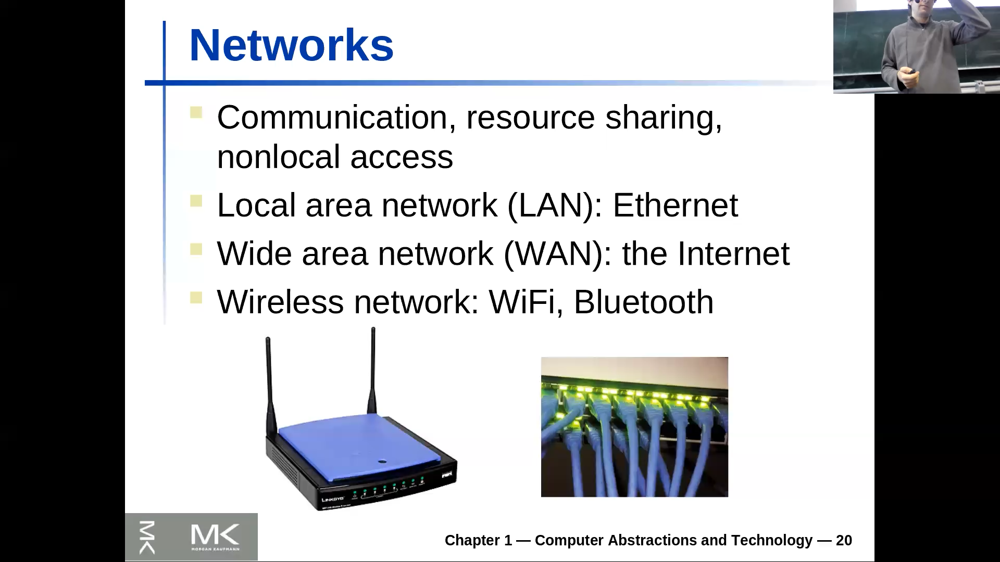
<!-- - `0:10:46`: does that mean you need to also access the data which is not on this computer with another computer. -->
<!-- - `0:10:53`: so they're similar simple yet so here that several things you can do. -->
<!-- - `0:11:00`: you can do something purely to her or that part none of which is your neighbor as a caterer makes the water appear. -->
<!-- - `0:11:08`: yup. -->
<!-- - `0:11:10`: i probably won't give an alternate one isn't a letter and it's nuts i dunno. -->
<!-- - `0:11:18`: well maybe even the woman. -->
<!-- - `0:11:21`: i. -->
<!-- - `0:11:23`: also they're starting to slowly disappear right because i've talked to your home and you have no space anymore to put the ethernet cable so we need adapters for it. -->
<!-- - `0:11:32`: so i guess in a couple of years and the computer disappear. -->
<!-- - `0:11:36`: so basically this is the first and only logan so you can have a look at ekberg and this company which our basic needs connected to the computers and he wanted the books on white router which may give you access to wide area network within the internet. -->
<!-- - `0:11:55`: yeah you're on the internet. -->
<!-- - `0:11:59`: and so basically it gives you have the local things which communicate with the outside and when you send a packet outside it's coming the router and the router sending into the victim. -->
<!-- - `0:12:12`: and then yeah obviously we don't always escape into the open wireless network i mean the phones are gone or for your wifi. -->
<!-- - `0:12:23`: all your noodles is. -->
<!-- - `0:12:27`: the war soldier was one of the wifi. -->
<!-- - `0:12:32`: and but if consuming a small. -->
<!-- - `0:12:35`: so basically these are two different technologies which are advantageous and inconvenience. -->
<!-- - `0:12:42`: so yeah we have different different technology. -->
<!-- - `0:12:47`: and that changes who has dick pollution so we have generated two kinds of changes the first one is suddenly promotion. -->
<!-- - `0:12:57`: protocol switch the usb cables which. -->
<!-- - `0:13:01`: which are partially upgraded in a competent way at some point you also have changes in the protocol so if you look at wifi on wifi. -->
<!-- - `0:13:12`: the thing four point two four six i mean you'll have various versions of the photographs which usually you have. -->
<!-- - `0:13:20`: but you usually have the technology will allow us to bring bring wall data and transmits more data want to make it more reliable or have the capabilities especially we have this low energy bluetooth which with the idea that consumes less energy and then transmits a signal. -->
<!-- - `0:13:41`: would you probably know if you have a bluetooth headset. -->
<!-- - `0:13:45`: which is usually using stolen little energy boost because consumers born which is rid of rooms again if your company you're using the phone. -->
<!-- - `0:13:56`: and it should ever have issues with communication it's because it's a very it's something that hasn't really changed which is why that incompatibilities between searches. -->
<!-- - `0:14:08`: now we can't get over us are basically communicating to the outsides and we focus mostly on memory. -->
<!-- - `0:14:23`: basically memory has increased a lot now years of training on our memory you have a computer. -->
<!-- - `0:14:32`: if you're you compare your son with sixty game. -->
<!-- - `0:14:38`: i think the ottomans and yeah so there's this it'll look cool and the thing it's you're so i think bill gates said something along the lines of two hundred fifty six k member ram is basically wait to which we would never need that much memory. -->
<!-- - `0:14:56`: yeah i know six thinking that he got bites and it's tends to be increasing. -->
# ==============0:15:00==============
<!-- - `0:15:04`: i can actually see just the increase in terms of all sizes what's not better news actually that ignorant media has changed the lama robin fight. -->
<!-- - `0:15:17`: the media which came out this year renting. -->
<!-- - `0:15:22`: but basically there was also the pollution here and if you just look at the costs. -->
<!-- - `0:15:28`: yeah the crosby. -->
<!-- - `0:15:31`: learn and grow. -->
<!-- - `0:15:34`: yeah. -->
<!-- - `0:15:36`: so here you have the table which contains some information about color possible. -->
<!-- - `0:15:43`: while the staples. -->
<!-- - `0:15:45`: the fact you chose the baseline vacuum to chew is something that i have never seen you can see it in a museum the sometimes a piece basically it's big tube and it's something which can think. -->
<!-- - `0:16:04`: it could basically switch it could switch tension few thousand times. -->
<!-- - `0:16:11`: right so it could go from zero to one for one point zero of your problem and then you have to change it. -->
<!-- - `0:16:18`: now get a few thousand times lightsaber knots and then you just have to remember that your cpu is doing sara de liberation for seconds. -->
<!-- - `0:16:28`: so the nineteen fifties was probably enough but today it's just nuts it wouldn't work out and they seem to me that francisco was an advantage it's a bit of technology. -->
<!-- - `0:16:40`: and basically that revolutionize anything. -->
<!-- - `0:16:44`: already have this one thirty fire i mean it was thirty four directed by golems is thirty five from it's people and the second advantage is how does an infection through with something big and from the store or something very small. -->
<!-- - `0:16:59`: which we also have reduced the size so basically if you look at the ninety years. -->
<!-- - `0:17:04`: her computer was several rooms bigger. -->
<!-- - `0:17:08`: and now i see my netbook hear a purple dress on. -->
<!-- - `0:17:14`: and sonia wasn't benefit then reminded you of buying from the visitors. -->
<!-- - `0:17:21`: and the bakery and then we just gave up and then the clones the ones with two hundred billion. -->
<!-- - `0:17:31`: one thing to remember matter which is very which i think is a pitcher. -->
<!-- - `0:17:37`: a better information about all things we've all. -->
<!-- - `0:17:41`: this is remember that when the apollo program was launched with computers which at this point was on my phone. -->
<!-- - `0:17:49`: and i have a platform. -->
<!-- - `0:17:52`: was local so yeah they're some of the management of all the nations on this computers and then we just saw yet today it would take you less time. -->
<!-- - `0:18:04`: producing transportation. -->
<!-- - `0:18:08`: ooh that became cycle. -->
<!-- - `0:18:14`: your viewpoints and i think that's the wrong thing. -->
<!-- - `0:18:20`: yeah not what i wanted yet one thing to realize is that if you compare this graph. -->
<!-- - `0:18:27`: two. -->
<!-- - `0:18:29`: moore's small. -->
<!-- - `0:18:32`: okay. -->
<!-- - `0:18:34`: yeah. -->
<!-- - `0:18:37`: pool. -->
<!-- - `0:18:38`: uber for basic needs this is also it's. -->
<!-- - `0:18:43`: also explanation. -->
<!-- - `0:18:46`: then the people that. -->
<!-- - `0:18:51`: no. -->
<!-- - `0:18:53`: booking. -->
<!-- - `0:18:55`: then it's cuba. -->
<!-- - `0:19:02`: hm hm. -->
<!-- - `0:19:11`: go. -->
<!-- - `0:19:16`: but they skipped the accidental it was later insistence the stages that sorry. -->
<!-- - `0:19:28`: the memory of class on board a lot but it's become a lot faster but it hasn't caught up with i'll probably do computations. -->
<!-- - `0:19:39`: which means that over time memory has become a lot more costly for i mean you should do one operation we cannot do a lot fewer memory exorcism in the past. -->
<!-- - `0:19:53`: now back to the transistor. -->
- 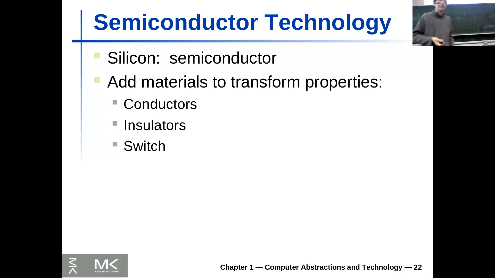
<!-- - `0:19:56`: i. -->
<!-- - `0:19:59`: yes so we have this. -->
# ==============0:20:00==============
<!-- - `0:20:03`: i mean this is funny cause the technology is worse about the money and it's even more worth more because we have one and it's largely in taiwan and you know that there is one. -->
<!-- - `0:20:17`: what did you condition the between taiwan and china have a slightly different opinion on whether taiwan is a separate country or not. -->
<!-- - `0:20:28`: so basically if. -->
<!-- - `0:20:31`: yeah if there is a war basically the semiconductor technology would just probably disappeared somebody. -->
<!-- - `0:20:39`: and that's why partially all this coming conduct the industry is trying to womb and it's been broke away from that building tops in virus other countries. -->
<!-- - `0:20:51`: not if you look at the eggs and for the record with typical witches and then it comes back separate the very small ones are very small transistors. -->
- `0:21:05`: now it's a little bit more complicated than that because he would have considered i mean between two city containers octopus song i mean certainly between two transistors and the transistors on silicon but **between two transistors you're going to have some conductors when you want to transmit information**.
<!-- - `0:21:25`: i mean if you look back at the plots. -->
<!-- - `0:21:29`: if your muscle memory you're mentioning the excess yeah you're horrible to have it isn't a conductor. -->
<!-- - `0:21:37`: and within them districts which is semi conductor behaving this way. -->
<!-- - `0:21:45`: and islamic center of which is to be able to activate the gear to make pots. -->
<!-- - `0:21:54`: and yeah big shot so one. -->
<!-- - `0:22:01`: if you go back to this slide here. -->
<!-- - `0:22:07`: you can i mean this is ignite the desire. -->
<!-- - `0:22:12`: you obviously would actually die and he used to make listeners torture he wouldn't be able to follow because businesses look for tracking. -->
<!-- - `0:22:23`: both of these things means that the financial goals of the night which i think is. -->
<!-- - `0:22:32`: rapid moon phases is awesome. -->
<!-- - `0:22:37`: and so you haven't been actually getting the dogfight away from of the limit you can actually reach but we would like to make it smaller and making it smaller it's actually in your huge challenge because at some point or something or one of physics which the two wires. -->
<!-- - `0:22:56`: we are very close. -->
<!-- - `0:22:59`: at some point in the relationship might cause chemical. -->
<!-- - `0:23:05`: you have to put your skills will gather some information on them. -->
<!-- - `0:23:11`: and this is something you don't know how to handle at so we don't like that this is an image of them all small we can make things. -->
<!-- - `0:23:22`: i mean this isn't an issue the issue is something we're talking about for i mean people are talking about for twenty years or something but apparently it's i mean we have the first cpu as which are printed up three hundred meters so it seems to work out. -->
<!-- - `0:23:39`: but at some point i think below one other major interest the cycle from this or it just doesn't work anymore physics tell you that this is going to work at least not with silicon. -->
<!-- - `0:23:54`: now let's talk a little bit about the manufactured silicones. -->
<!-- - `0:23:59`: so you stop being cynical. -->
<!-- - `0:24:03`: then slice or something small a little bit and then the wafer. -->
<!-- - `0:24:08`: the wafer is managed through the appearance. -->
<!-- - `0:24:13`: when you have a small processing space then you get the yeah some patterns when it because they perceived the weight problem as it goes. -->
<!-- - `0:24:24`: wait for the one. -->
<!-- - `0:24:28`: so basically this is wrong he never really made the redbird basically able to produce five hundred kids with the game and each year the year and the worship. -->
<!-- - `0:24:47`: when you were there when you have been spending. -->
<!-- - `0:24:53`: yes for visiting golden rule. -->
<!-- - `0:24:57`: repair privileges. -->
# ==============0:25:00==============
<!-- - `0:25:01`: festival or the which because during the spring thing is pretty nice extremely complicated i mean. -->
<!-- - `0:25:10`: there's a building or reading factory any new or reducing the size of the waiters from the next thing the scorpions are definitely been demoted. -->
<!-- - `0:25:22`: it's not something that you can just try out and just consider the money and then move on because all the plans you will discover that so all the way to go. -->
<!-- - `0:25:36`: yeah. -->
<!-- - `0:25:38`: for whatever reason they might because this is printed in in the vacuum on your vacuum maybe it was the october oxygen or something thats just a broken system. -->
<!-- - `0:25:52`: right and then you know which one the way the prince dies. -->
<!-- - `0:25:59`: it and then contribute to the testing particularly china. -->
<!-- - `0:26:05`: because i mean we go back to those if you look at the images here you'll have one parent who doesn't work. -->
<!-- - `0:26:14`: you have so many caledon hockley as every part of technology advocate you cannot just advocate but you try to test at least enough to find which ones don't work. -->
<!-- - `0:26:24`: one trade which is solid pins or. -->
<!-- - `0:26:28`: i some pictures. -->
<!-- - `0:26:32`: that actually prints that said eight course i remember that as a discomfort to those were interesting senator he wasn't six corrosion. -->
<!-- - `0:26:45`: i'm basically it works out you can just get refined writes it's basic that you produced it otherwise he would have to throw it away. -->
<!-- - `0:26:57`: now you can eat this wafer. -->
<!-- - `0:27:04`: i'm pretty sure that this is basically the old ne isn't a picture i guess interested public but i think every and he was things about august is printed then basically become trademark informational information that into whatever it printing interest. -->
<!-- - `0:27:21`: don't want to tell you. -->
<!-- - `0:27:25`: and there is a. -->
<!-- - `0:27:27`: and so we talked about the rape of all things. -->
<!-- - `0:27:32`: vistas between us the inflammation. -->
<!-- - `0:27:36`: the cost is basic needs the cost of a waiter divided by how many. -->
<!-- - `0:27:43`: how many guys can put on the weight will depend on you but basically you have it on awake or putting his own picture where there were five hundred and six five minute wait for a five hundred and six the work and basically the cost of one guy. -->
<!-- - `0:28:03`: the cost of living. -->
<!-- - `0:28:09`: yeah well then you have the power to wake her and revenue raiser every day every hour this is not completely true because the problem has been wrong. -->
<!-- - `0:28:21`: for the hawks on the year. -->
- `0:28:24`: and then back to the millions one divided by the area and everyone for **one important to realize is that it's square in the area of the die** between the bigger you'll have to make them bigger.
<!-- - `0:28:44`: chip a bigger you actually need you in the heat of your big ultimates. -->
<!-- - `0:28:52`: so in general the weight of cost in the area offices you have decided designer should be a certain way so let's make the texts and then the big factors determine the process and this is basically what they're trying to bring. -->
<!-- - `0:29:10`: cool. -->
<!-- - `0:29:13`: yeah it's an arrogant turn by the service record designer. -->
<!-- - `0:29:18`: so it's a circuit design and most morning wanted to be surprised. -->
<!-- - `0:29:24`: most cpu was no odds something like eleven other majors the second one is the one in your phone that might even be seven depending shop a reasonable lot but basically in your college student movie or like fifteen inches or something because human. -->
<!-- - `0:29:42`: a car is big enough that you don't care so much about saving to send to send you to someone always on spacebar emotion portion. -->
<!-- - `0:29:58`: yeah i think that the eu is not something i don't know any number of things and i'm pretty sure that that's an oldest industry would not give you any information about defeat. -->
# ==============0:30:00==============
<!-- - `0:30:15`: one interesting question is okay now how big the moon is that. -->
<!-- - `0:30:22`: you live the wrong. -->
<!-- - `0:30:28`: yes so it's usually misses spending nights. -->
<!-- - `0:30:33`: and a spotlight on these reasons even when which easier to do so wrong with lenses and so basically it's wrong. -->
<!-- - `0:30:45`: so that's why it's wrong. -->
<!-- - `0:30:48`: but yeah it's a good place for miami would make sense of people chips and bits of his year or something pretense somehow doesn't mean someone somehow because you have immense because it doesn't work. -->
<!-- - `0:31:04`: okay so normally has a cpu. -->
<!-- - `0:31:08`: anyone can try to talk about performance. -->
<!-- - `0:31:15`: yeah the first thing. -->
<!-- - `0:31:23`: yeah okay so the first example of this year which is from the sides so basically it's a question how do we find their phones okay but here they give an example rich amin doesn't buy for basically your name and then they come here for the birth. -->
<!-- - `0:31:39`: which isn't a capacity of all of the ball the scheme and the precedent so big basically among people over eighteen. -->
- `0:31:51`: and basically everything to be wanted isn't winning for each category so you have a concord with the mostest but somehow it is that he was both interesting and adequately wouldn't go that far so we have different measures and then the **question is how do we compare them**.
- `0:32:12`: and basically **we have something similar for cpus**.
<!-- - `0:32:20`: let me show you an example. -->
<!-- - `0:32:23`: most nods. -->
<!-- - `0:32:28`: your. -->
<!-- - `0:32:33`: well for him actually he was my computer to my computer in my office so like we don't have interactions between zoom anywhere from here. -->
<!-- - `0:32:47`: so you'll probably all know matrix multiplication. -->
<!-- - `0:32:55`: in the most. -->
<!-- - `0:32:58`: i mean it wasn't as if was recently the. -->
<!-- - `0:33:05`: so here you can see the algorithm of the vacation return the people ropes and then it's the result of as given by this fallen on. -->
<!-- - `0:33:15`: no i think sneakers are basically the complexity of it is it's cubing. -->
<!-- - `0:33:26`: and the traditionalists are people we have every big thing that fact actually review was actually written on complex it's over. -->
<!-- - `0:33:40`: so. -->
<!-- - `0:33:43`: the typical way the neighbors. -->
<!-- - `0:33:48`: and then anybody in the boathouse. -->
<!-- - `0:33:57`: hey. -->
<!-- - `0:34:05`: no they basically wanted engage with the nation we have you have the one thing to notice is that my presence. -->
<!-- - `0:34:18`: the matrix. -->
- `0:34:23`: but what people aggravate me know whether **they consider matrix addition to be constant time** but my kitchen big.
<!-- - `0:34:35`: and so there is a way to reduce this exposure through. -->
<!-- - `0:34:40`: the aggressive awesome which gives you two points or seven eight. -->
<!-- - `0:34:53`: the whole thing and then i mean in recent years it was a rush to reduce the number. -->
# ==============0:35:00==============
<!-- - `0:35:00`: something inside us more specific. -->
<!-- - `0:35:03`: i think the record is up two point seven one. -->
<!-- - `0:35:07`: no not this is was basically an archetypal one set of acres becomes mostly a bunch of dishes because. -->
<!-- - `0:35:19`: the author is improved and then the first book was the best one a lot of us other legs and so basically the coffin the constant which is hidden always bristol bay got accepted to my tricks has said something about the size of the universe really devastating diseases. -->
<!-- - `0:35:39`: it was recently in the news because of his project by google are basically the application or specify the size. -->
<!-- - `0:35:53`: the general. -->
<!-- - `0:35:55`: checking his butt. -->
<!-- - `0:35:57`: your responses are just better than the others inside and basically drinking something better but it has been said differently in the basic bihar they say one hundred million. -->
<!-- - `0:36:11`: what's interesting about this a few days later song. -->
<!-- - `0:36:16`: the uniform some of it is actually my next or even just the food. -->
<!-- - `0:36:24`: well then managed to get one with vivid was rendered against nobody. -->
<!-- - `0:36:29`: one thing to. -->
<!-- - `0:36:32`: yeah one thing at once in the capable hands of a way that basically meant motivation but what what if he was actually would have prevented engine. -->
<!-- - `0:36:42`: and basically when i was visiting assumption on the operator they would follow the book of the ball. -->
<!-- - `0:36:52`: no. -->
<!-- - `0:36:54`: the trusts. -->
<!-- - `0:36:57`: so in this class we are not going to talk about how to improve algorithm. -->
<!-- - `0:37:02`: we are talking about wallet. -->
<!-- - `0:37:05`: and what goes on. -->
<!-- - `0:37:11`: he was robbed. -->
<!-- - `0:37:17`: hmm. -->
<!-- - `0:37:20`: so basically a dedicated example is that we'd be running reading books with jacqueline. -->
<!-- - `0:37:27`: and we refill usb those in the first type of basically this is the one and then already grew up at bowling for the same reason and we make it important for cosmos. -->
<!-- - `0:37:43`: i want to be clear this is basically using the same diversity we have over our complexity of end to the policy but because we do home we'd have basically been operating the better or produced because functions we actually get the solution which performance. -->
<!-- - `0:38:03`: huge improvement in performance. -->
<!-- - `0:38:11`: no i can try music you want. -->
<!-- - `0:38:17`: but here you can see the python program. -->
<!-- - `0:38:20`: we figured it was a random number. -->
<!-- - `0:38:23`: and then the vacation. -->
<!-- - `0:38:27`: and this has size two hundred and fourteen. -->
<!-- - `0:38:31`: no. -->
<!-- - `0:38:35`: this one year. -->
<!-- - `0:38:40`: hmm. -->
<!-- - `0:38:43`: those are big time. -->
<!-- - `0:38:51`: okay. -->
<!-- - `0:38:53`: really cool what this means and then he said he was nice but basically we just did the program and that program over. -->
<!-- - `0:39:04`: one point one point to me at one point eight seconds. -->
<!-- - `0:39:10`: well this is a base version we just found the site then actually we can try to do something a bit better namely we can write rewrite our program in c. -->
<!-- - `0:39:24`: so it. -->
<!-- - `0:39:25`: if the exact same program exactly on the heels. -->
<!-- - `0:39:30`: oh areas and individual vacation and here again in the village was run the numbers. -->
<!-- - `0:39:38`: the. -->
<!-- - `0:39:47`: yeah. -->
<!-- - `0:39:52`: and i can execute it. -->
<!-- - `0:39:55`: so basically know how to program and then i mean the program itself. -->
# ==============0:40:00==============
<!-- - `0:40:01`: the tourism is in demand and basically then you're the year but just know this from station one. -->
<!-- - `0:40:13`: the open minded anything where we go for the seconds. -->
<!-- - `0:40:19`: now let's ask the compiler to optimize events. -->
<!-- - `0:40:24`: important the twenty seconds of zero point four seconds with mirror on two seconds. -->
<!-- - `0:40:32`: and if i ask you to optimize the war with europa zero nine cycle. -->
<!-- - `0:40:40`: and at the highest level of motivation we don't see a difference anymore. -->
<!-- - `0:40:47`: i think if. -->
<!-- - `0:40:51`: if thinking different change the time. -->
<!-- - `0:40:58`: the changing size will receive difference between the moons. -->
<!-- - `0:41:05`: hooper. -->
<!-- - `0:41:17`: hmm. -->
<!-- - `0:41:20`: but basically now we have made our mattresses twice a dollar and remember twice as loud humming eight times more operations to pull through. -->
<!-- - `0:41:37`: he goes in between. -->
<!-- - `0:41:40`: then. -->
<!-- - `0:41:43`: the between the level of the sensation. -->
<!-- - `0:41:52`: produces anyway so basically we have all this information and yeah you can see here that. -->
<!-- - `0:42:01`: i think we have the same algorithm have used different levels of optimization which use slightly different features of hardware. -->
<!-- - `0:42:09`: and we got a huge huge performance improvements. -->
<!-- - `0:42:17`: and basically we will talk about poker make us even better the nick chubb in the next next chapters. -->
<!-- - `0:42:26`: now let's go back to that. -->
<!-- - `0:42:31`: this. -->
<!-- - `0:42:35`: we're here. -->
<!-- - `0:42:37`: okay. -->
<!-- - `0:42:44`: oh yeah can. -->
<!-- - `0:42:51`: yeah let me show you. -->
<!-- - `0:42:53`: it's one of amin's favorite examples. -->
<!-- - `0:43:14`: hmm. -->
<!-- - `0:43:35`: okay so this is a more competent this is a more complicated example. -->
<!-- - `0:43:42`: right so i mentioned before that as i mentioned before that memory hasn't caught up with a very basic in the thousands of imposter but the memory of says it all. -->
<!-- - `0:43:55`: and basically so this is code written by. -->
<!-- - `0:43:58`: and the idea that you want overtime. -->
<!-- - `0:44:01`: the question is vulgar your best woman. -->
- `0:44:05`: and actually you want to move on an even better one time that you want to find a new wave the one to estimate the pint in a way that if you run the bicycle of the same time which is something trying something but what actually does is to **estimate the number**.
- `0:44:24`: **of memory acceses**.
<!-- - `0:44:29`: instead of trying to really motivate them and that way it gets the venue which is neither of the clothes that doesn't depend on what cpd was actually doing. -->
<!-- - `0:44:48`: yeah so if you look at what's your. -->
<!-- - `0:44:52`: the violence. -->
<!-- - `0:44:56`: you will have elapsed. -->
<!-- - `0:44:58`: just how much fun is boring. -->
# ==============0:45:00==============
<!-- - `0:45:04`: and then you have the system timer which is actually the portal to the system especially when your oscar river in the uk it's just it's it's pocket spot on the system time because he just asks the exploitation yet you ask him that the phoenix that gives you. -->
<!-- - `0:45:22`: a memory and that's a common system time. -->
<!-- - `0:45:25`: which is insult mine is this way i mean that's not going to ever even depend on the future. -->
<!-- - `0:45:31`: and you. -->
<!-- - `0:45:36`: he hasn't got squats but basically the cpu was oily was only when the one closest to my computer was like what the fuck. -->
<!-- - `0:45:46`: the computer might have interrupted the process of the weight not only is the editor might just be asked to i mean central database or examples. -->
<!-- - `0:45:58`: which is why time is a measurement and for example the cache access is a better version. -->
<!-- - `0:46:11`: right so. -->
<!-- - `0:46:15`: well this i mean this version so this was the prevention of islam concussion is something which is. -->
<!-- - `0:46:23`: which is a better example than this guys basically be good and actually we would talk in the next chapters a bit more about the cash in this way then you will understand better why repercussions is. -->
<!-- - `0:46:37`: no. -->
<!-- - `0:46:38`: if you measure response time and. -->
<!-- - `0:46:46`: if you want to go about this if he was going to wake up the when the response is the boss and the snowboard is how many. -->
<!-- - `0:46:58`: the dollar. -->
<!-- - `0:47:03`: just like the year. -->
<!-- - `0:47:07`: if i want to shoot through central north of dayton. -->
<!-- - `0:47:11`: if i want to send you side for example. -->
<!-- - `0:47:16`: it send you it over the internets it would probably yeah i mean it would take a certain amount of time. -->
<!-- - `0:47:25`: well the reason i mean we're just let's say that let's say that you have a one gigabytes stable connection the first one percent gigabytes and basically the particular setting but we have a response time of one second. -->
- `0:47:40`: in basic rules i mean yeah it's the most lucre seconds now if **if i send you a truck of hard drives**.
<!-- - `0:47:52`: the trucks were properties we'd take let's say two days to get to you. -->
- `0:47:58`: so you would have a **response time of two days** but you could **put in a lot of hard drives** which means that we're **actually sendind a lot of data** properly and not smoke would have been able to send to you just over the internet.
- `0:48:11`: and so there's a **difference between response time and throughput** i mean if i send you every day and you will get nothing about the books i mean lots of data so basically once you're sold the **cost of sending a truck is that you have to wait two days the first day but then they're just come every day**.
<!-- - `0:48:27`: until this is what happens this is what marks an important distinction between the response time and movie. -->
<!-- - `0:48:37`: so what happens if you will check i mean what happens risk of time to smoke or to replace a call system with a passover. -->
<!-- - `0:48:46`: but if you're if your processes oscar. -->
<!-- - `0:48:50`: do a combination. -->
<!-- - `0:48:55`: what what is changing. -->
<!-- - `0:48:58`: anyone have an idea. -->
- `0:49:06`: so basically **if your cpu is faster...**.
- `0:49:10`: the time it takes.
- `0:49:16`: to do a task will become more done for example just imagine that because you have a boston cpu takes **one second instead of minute** would be able to walk it would mean that you'd be **able to do more work**.
- `0:49:31`: now **if we more processors...** not familiar with that way of thinking about it but just **imagine that i facebook or google add more servers** which will increase in the servers what would have happened.
- `0:49:47`: when the **response time won't change** because it **still takes the same amount of time for the information being processed** but the **throughput will increase...**.
# ==============0:50:00==============
<!-- - `0:50:03`: at the end of the next cycle the focus on response time. -->
<!-- - `0:50:12`: instead of ouput. -->
<!-- - `0:50:17`: no. -->
- 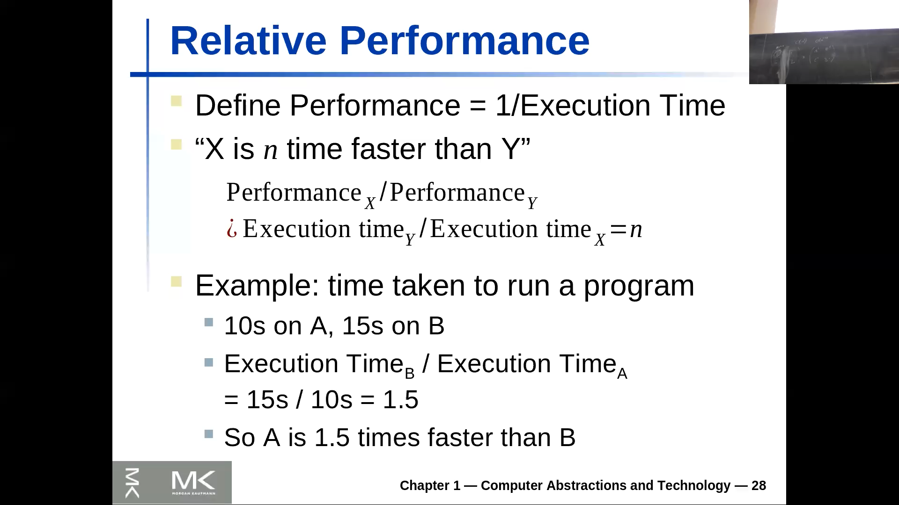
<!-- - `0:50:21`: yeah but basically we didn't want the whole of us to one decided by the fighter. -->
- `0:50:28`: **if you think of a cpu...**.
<!-- - `0:50:32`: quite a bit of a cpu. -->
<!-- - `0:50:37`: the ravens of the pilot. -->
- **you have a frequence of 5 GHz**
- **and basically this is the performance and 5GHz means 5 billions operations per second**
<!-- - `0:50:43`: he got ads and basic games the organs and the product begins. -->
<!-- - `0:50:50`: operation are saying where you have also has protected you. -->
- `0:50:57`: and **when you want to compare two programs or two computers** and you **say that x is 10 times fatser than y basically you compare the ratio of performance**.
<!-- - `0:51:10`: which is very similar to. -->
- `0:51:15`: **which is just the same of comparing...** gonna be binding the contents **executin times?**.
<!-- - `0:51:21`: so let's see that on the exam group which is given on the science page. -->
<!-- - `0:51:25`: someone got a program that expects things to prevent an infected being we divide the institution finally could do that as one one times one the pasta be. -->
<!-- - `0:51:50`: no this basic basically. -->
<!-- - `0:51:53`: so this basic image removed from time. -->
- `0:51:57`: this is basically the program but **in practice...** probably the actual program.
- `0:52:03`: **it's more complicated than that** because the final four hundred pixels to run the program dependent on the brooklyn respond to the point where depending on what the process is all the overhead systems maybe the computers to get idea where the customer he was alive at the time.
<!-- - `0:52:22`: because it's all baby things for us to reduce the little things at the same time and basically it's all about the elapsed finance the opponents and basically all the aspects here it's because our oldest aspects it's very large compared to the times i mean you rarely. -->
<!-- - `0:52:42`: he thinks he could probably have just the fittings. -->
<!-- - `0:52:46`: if you open your browser settings might have brought on wednesday. -->
- `0:52:55`: and then once maybe i've heard of in the way of **cpu time...** which is part of the fun.
<!-- - `0:53:05`: i. -->
<!-- - `0:53:08`: the basic needs is a kind of spent by the process on the job this basically doesn't include in the irishman. -->
- `0:53:19`: so **it doesn't include idle time** on which he ended june one way to recover the bonds and it doesn't include all the drop spot if the cpu has to be inter.
<!-- - `0:53:34`: he has been talked about before. -->
<!-- - `0:53:40`: yeah so now let's talk her to the balls about what crimes mean and prosecuting work the traveling. -->
<!-- - `0:53:48`: so basically they have a carrier so endless cpu or cpu fracturing and basically did crooked spending okay the funding. -->
<!-- - `0:53:59`: not all. -->
<!-- - `0:54:01`: cool. -->
<!-- - `0:54:05`: it look cause cpu from very far away. -->
<!-- - `0:54:11`: new router. -->
<!-- - `0:54:15`: we're just giving them. -->
<!-- - `0:54:17`: nevada. -->
<!-- - `0:54:23`: richard. -->
<!-- - `0:54:27`: the targeting states. -->
<!-- - `0:54:36`: and then when our nation. -->
<!-- - `0:54:39`: the mixed finances. -->
- `0:54:46`: **basically every time the clock ticks, it's ging up we start the calculation for the next state...** and then i imagine it's been the same.the cards
# ==============0:55:00==============
<!-- - `0:55:03`: every everytime would probably. -->
<!-- - `0:55:06`: we started the traditional next state. -->
<!-- - `0:55:09`: then. -->
<!-- - `0:55:11`: at the end of the calculation it must be finished and it must be spoiling these space. -->
<!-- - `0:55:19`: because he isn't basically. -->
- `0:55:24`: you piss your **cheating in the sense that shortly before the clock time the next state has to be stored in the state**.
<!-- - `0:55:33`: this is basically us nice reading my spoons. -->
<!-- - `0:55:40`: so basically around the time my initial ended muslim stork the preparation. -->
<!-- - `0:55:50`: he read years of reputation of the temperature tends to relax in the direction of the clock cycle. -->
<!-- - `0:55:57`: gauntlet of two hundred typical seconds which means that the switch every twenty five seconds the panthers are polar minus twins. -->
<!-- - `0:56:08`: and then the drop frequency is the number of seconds in the bowl. -->
- `0:56:15`: the **one divided two hundred fifty** which the other four times depending on.
<!-- - `0:56:26`: now if you are wondering okay what was up here but at least it resume into the games. -->
<!-- - `0:56:35`: this is the recognition on different gates without good for the immigration. -->
<!-- - `0:56:46`: facing the nation is a sign that it's time that the election the electronic signal needs to get stomped. -->
<!-- - `0:56:55`: finish the invasion. -->
<!-- - `0:56:58`: so let me insights. -->
<!-- - `0:57:03`: yeah it's just it's not sufficient will just speed up the growth rate the limited by the foundational states. -->
<!-- - `0:57:12`: otherwise we'll get into reuse federal minimum wage at home partially cultivated besides for something that doesn't make so much sense anymore. -->
- `0:57:27`: **clock frequency must be large enough to finish all the calculations**.
<!-- - `0:57:37`: you. -->
<!-- - `0:57:40`: yeah we talk a little bit and we can slightly work around it sometimes but i say you're actually in that case i need to pre-rinse through the divisions basis so basically potato came here you should wait so what's really want to do next has to wait. -->
<!-- - `0:58:00`: but that's basically order can do i mean if you watch on. -->
<!-- - `0:58:06`: yesterday he wasn't impatient is not the goal the next thing i know cpu is limited private school. -->
<!-- - `0:58:18`: now we can look wednesday. -->
<!-- - `0:58:21`: he can just do a of all of them. -->
<!-- - `0:58:25`: how much trouble the most corrupt cyclists. -->
<!-- - `0:58:30`: so basically the cpu time is the number of cyclists little sci-fi cycle timer so it's a new crop cycle the rates. -->
<!-- - `0:58:43`: and. -->
- `0:58:45`: yeah so basically **if you want to improve the cpu time there are several ways to do it**.
<!-- - `0:58:53`: it can reduce the number of cycles which means making the program better. -->
<!-- - `0:58:58`: this is basically an example of my picks for deprecation alexander reciprocation the comparison between all zero mean with zero and just bought them towards basically reduce the number of cycles needed to be got across the program. -->
- `0:59:15`: we can **increase the clock rate**.
- `0:59:18`: **at least until the hardware fits i mean until you don't manage the manipulation? in time anymore**.
<!-- - `0:59:25`: and in practice this is usually the video. -->
<!-- - `0:59:30`: not tradable go in cycles. -->
<!-- - `0:59:36`: there is so neat way to your i mean if i've ever heard about. -->
<!-- - `0:59:42`: oh. -->
- `0:59:45`: what can boost the newspaper but basically **in the cpus you buy in your computer you can to some extent increase performance by increasing the voltage and reducing the clock time**.
<!-- - `0:59:59`: so that way you get to pick some overhauls ultimates usually at the cost of an opponent. -->
# ==============1:00:00==============
<!-- - `1:00:09`: now let's let's get to cpu time and again do some calculations. -->
<!-- - `1:00:19`: i have to chip in with this business produce officer doing something strange but anyway so basically here we want to. -->
- `1:00:27`: we have a computer which is running would you go ahead truck time and we have ten seconds to pew time and actually we **want to make a computer that is fourty percent faster**.
<!-- - `1:00:40`: the however big. -->
- `1:00:44`: **we do a faster clock with our clock cyles we can become slower**. **then we can calculate our clock rate and compare it**.
- `1:00:55`: and then we conclude that **we have**.
- `1:01:01`: **to make our computer twice as fast to get a fourty percent increase** of these.
- `1:01:06`: when you would kind of hope that they would get the body was there any upcoming autumns and busted **actually there is a factor two because of the cost of changing clock cycle seconds**.
<!-- - `1:01:20`: and we will do more more calculation exciting exercises next week. -->
- `1:01:27`: now this is a slightly skewed i mean this is a **measure of clock cycles** but we can **actually try to do something more precise which is to count the number of instructions** wrong.
<!-- - `1:01:40`: but it grew back with his blood crazy and one instruction the years of instruction. -->
- `1:01:48`: and **basically going for instructions mean that we can also compare instructins if you take two? cycles**.
<!-- - `1:01:57`: so we huddle. -->
<!-- - `1:02:00`: the view is mine is inspection **clocks per instruction**. -->
<!-- - `1:02:06`: the. -->
<!-- - `1:02:10`: the instructional program by the program. -->
<!-- - `1:02:16`: yeah it's. -->
<!-- - `1:02:18`: but considering it's the around the language and eleven. -->
<!-- - `1:02:25`: was in every song from all the versions this is one of the reason why the vacationing public adjusters and one of the trainees unchanged that tweet the tweet is a bitch to get instruction which to say. -->
<!-- - `1:02:45`: the everything. -->
- `1:02:47`: the **basically the instruction count is given** wizards not on the table.
<!-- - `1:02:54`: now the average sacred ritual the most i can. -->
<!-- - `1:02:59`: i you for. -->
<!-- - `1:03:01`: you can your inspection home i mean young one hundred and something an instruction connection paid seven cited was not deserted only one. -->
<!-- - `1:03:11`: so now that an average cycle construction is determined person by the unwavering sense of change. -->
<!-- - `1:03:20`: actually different infection can harm the infection but what solutions have just the average one. -->
<!-- - `1:03:31`: yeah. -->
<!-- - `1:03:36`: yeah so you have some. -->
- `1:03:39`: **here we have some calculrations**.
- `1:03:42`: **which i actually want to skip because they for the exercices next week**.
<!-- - `1:03:54`: yeah what's happening in practice is a difference of instructions poverty is beautiful but basically you do weighted average pitches before every class the better frequency. -->
<!-- - `1:04:09`: and here we have some calculation again rehoming. -->
<!-- - `1:04:14`: he has. -->
<!-- - `1:04:16`: three pythagoreans about instruction. -->
<!-- - `1:04:19`: wish they would try to defend the guy then ring consequences depending on where in virginia we have then we can go and see them actually our. -->
- **then we could do a comparison and see that the second program is stacking one clock cycle less, however it has a average cpi which is lower**
<!-- - `1:04:31`: sick bro ruin the program. -->
<!-- - `1:04:35`: i was just thinking one looks like a mess. -->
<!-- - `1:04:41`: however the average city irish and no one. -->
<!-- - `1:04:48`: the visa could have another subject which will go on. -->
- `1:04:54`: so basically **when you start to have that you have to be careful in counting the number of instructions because if you count the number of instruction**. **we have here five instruction and here we have six instruction but somehow...** this five instruction.
# ==============1:05:00==============
- 
<!-- - `1:05:12`: five instructional mothballs and six instructions that's because it's an instruction was for the losses. -->
<!-- - `1:05:24`: yes. -->
<!-- - `1:05:26`: so here you have this simple tradition again in a slightly more complicated funny instead he moved the ball well removing version. -->
<!-- - `1:05:36`: and the question is how do we hook up bones. -->
- `1:05:41`: so changing the **algorithm...** usually winter **affect the instruction count** because if **you have a foster program you will require fewer instructions** so the **most extreme example...** i can give is you try for fortune to saddam era would **generate a permutation until its sorted**.
- `1:06:00`: is probably or this is a very bad way of floating it's huge and i mean it terminates if it generates a new reputation each time but it's a very biodiverse.
- `1:06:12`: and so **switching to mergesort would reduce your instruction count a lot**.
- `1:06:16`: i read the reviews your buttonhole what.
- `1:06:22`: this **might have an impact on the cycles per instruction because we might be able to use different kinds of instructions**.
<!-- - `1:06:32`: not again. -->
<!-- - `1:06:34`: i'd originally wanted maybe he went through like one. -->
<!-- - `1:06:38`: but she was very outspoken. -->
<!-- - `1:06:41`: the program in different programming languages is usually without instruction cards and the instructions. -->
<!-- - `1:06:49`: pickup yard. -->
<!-- - `1:06:51`: because the you might be able to. -->
- `1:06:56`: it's hard to say how basically you **might be able to do things in one programming language that they cannot do in others** which means that you're going to get across the program.
<!-- - `1:07:05`: this program is actually i. -->
- `1:07:09`: the **compiler optimizes a lot and changes a lot of instructions**.
- `1:07:18`: and then at the lowest the **compiler is compiling a programming language to a instruction set architecture** protection the chimney.
<!-- - `1:07:29`: huge impact. -->
<!-- - `1:07:33`: no. -->
<!-- - `1:07:38`: if we try to look. -->
<!-- - `1:07:41`: interesting things is. -->
- `1:07:43`: i mean if you look at the **clock rate** over last year's anything needs and somehow it's cause i mean the change that **hasn't changed much over the last years**.
<!-- - `1:07:57`: i mean i think the reasons that i think. -->
<!-- - `1:08:06`: you. -->
<!-- - `1:08:10`: hm. -->
<!-- - `1:08:15`: the new regime. -->
<!-- - `1:08:18`: arguing. -->
<!-- - `1:08:25`: cycle of new evidence one anyway so basically if you look at very reasonable peed we have also a thing into a nonsense person to you which would which would lead you by the second. -->
<!-- - `1:08:40`: oh. -->
<!-- - `1:08:41`: basically that was again from greece. -->
- `1:08:44`: **the problem is basically why it stopped increasing** in **the amount of power we withdraw? has increased**.
<!-- - `1:08:54`: and basically yeah. -->
- `1:08:56`: **the faster your clock is the more power you need**.
- `1:09:01`: **the more power you have the more heat you produce** and it's important to remember that in terms of basic to use cpu has production of phones and instead of a smaller the production of heat which is extremely high it's much closer to the atomic reactor than this.
<!-- - `1:09:21`: one or something that's producing or local. -->
<!-- - `1:09:26`: now if we run a modern jumps on the power as we have a goal it would mean the power equal to the square of work at the. -->
- `1:09:40`: which means that **if you compare the last years we have actually reduced the voltage from 5V to 1V...** plan for the wonderful wonderful without increasing the maintenance the thousands.
- `1:09:53`: **which means we have increased our power by 200**
<!-- - `1:09:59`: ans. -->
# ==============1:10:00==============
- `1:10:02`: yeah i mean basically if you don't manage i mean **reducing the voltage more is extremely complicated...**.
- `1:10:09`: possibly because if you reduce the voltage to even this basic need to have one on the database because no one has any we all do this thing was.
- `1:10:21`: i mean **we all think of computers as the binary one zero and one but in practice we have intermediate things** which are kind of renewable others and then if you're mean.
<!-- - `1:10:35`: yeah this awesome ghost signals and basically if you want to make sure that we don't. -->
- `1:10:42`: the you want **to be sure that we don't confuse a ghost signal with a real signal** the portage for it which is basically the difference.
<!-- - `1:10:57`: now if you look at this again you can see that the number doesn't coun. -->
<!-- - `1:11:03`: and basically what happened is alex as the police because you have actually improve the capacity. -->
<!-- - `1:11:11`: how safe is boy but it was mostly hochman is that the wrong time keeper realize that the prayers we are making will not escape anymore for basically they have to find a better way to do it and basically what people mean is is that the instructions were to call the call. -->
<!-- - `1:11:31`: the door for you and your house and then he would walk or holiday spirits. -->
<!-- - `1:11:41`: and the point desert extra two or more causes can be similar in certain order which mean that basically you can do i mean you don't make things faster but you hope for the children to attend medical juveniles than. -->
<!-- - `1:11:59`: and so your power basically increases again. -->
<!-- - `1:12:04`: one reason the reason is basically that is more cause with nemo pocketing the travels of the pirates. -->
<!-- - `1:12:12`: and actually it's so bad now that there is a tempo dark cynical which the fact that we cannot use of new investments in every part of the. -->
<!-- - `1:12:26`: but sometimes torn between what you wanted news. -->
<!-- - `1:12:33`: now let's just as okay so here's a formula one resistant empowered. -->
<!-- - `1:12:38`: i suppose the cpu will have eighty five percent of capacity the queue but we haven't ruled that out by the manufacturing we have reduced the botnet lots anderson. -->
<!-- - `1:12:55`: and neat. -->
<!-- - `1:12:58`: opportunity. -->
<!-- - `1:13:00`: the breakfast thing and we compared to ours when we actually needed a slight reduction abort the pregnancy or the two holidays. -->
<!-- - `1:13:17`: yep and the issue is we can i mean it's called a power we cannot reduce voltage further and we cannot remove morton's. -->
<!-- - `1:13:27`: yeah so basically that and the fact that you cannot remove more heat is that's physics at some point. -->
<!-- - `1:13:34`: well the question is how can we improve performance further. -->
<!-- - `1:13:42`: well this is yeah but because the processes of the blues over last the pokemon. -->
<!-- - `1:13:49`: two years or something. -->
<!-- - `1:13:52`: but basically between the brisk process and the second most is the type of person. -->
<!-- - `1:13:59`: which is about right this basically means that just finding a new cpu residual performance and the packers twenty five percent. -->
<!-- - `1:14:07`: then they hide the end of the golden era golden era of the fifty percent jr which means that if your program is small just wait two or three more years and then the performance increases. -->
<!-- - `1:14:23`: yeah that basic he stopped around the tree which is the drop was. -->
<!-- - `1:14:30`: where it started to slow down was where the bones in queens was when the girl was just perfect i mean we'd go back and now he doesn't even vote on more. -->
<!-- - `1:14:43`: so we don't really managed to make buses to cuba anymore. -->
<!-- - `1:14:48`: i. -->
<!-- - `1:14:50`: so big is this murderous performance of the compete cpu so it takes into account everything but when you might wonder okay actually we see performance increases while the cpu is going to become foster and one of the reasons is that we have rid of several reasons. -->
# ==============1:15:00==============
<!-- - `1:15:10`: one of them is actually that our memory has become better but if you're have we actually because we have managed to produce smaller subdues but in practice we have made our cpu swarm we just have put more things in it and because we could put more things we could put more memory and this is options pocket extending. -->
<!-- - `1:15:30`: the last years because we have this memory which works better for which actually increase performance of programs. -->
<!-- - `1:15:42`: yup. -->
<!-- - `1:15:44`: i mean in the recent years threatened by the power the instruction level apartment and memory. -->
<!-- - `1:15:51`: oh never really mean that you have to wait for the murder i mean just imagine that you have something that doesn't you have to put on the hot and all the smoke it's time to give information and if you can avoid the probation then you actually the. -->
<!-- - `1:16:11`: molds and instructional practices and insights. -->
<!-- - `1:16:18`: in the repair i said actually we have started reading the koran says is true but actually we started off the cheating. -->
<!-- - `1:16:27`: they need that. -->
<!-- - `1:16:32`: but basically you look at the thing you can predict the next states but sometimes we. -->
<!-- - `1:16:38`: penetrating the next phase i mean the next state of events doesn't depend on what you could actually she's kind of cheated. -->
<!-- - `1:16:50`: and. -->
<!-- - `1:16:53`: two next the city. -->
<!-- - `1:17:03`: hmm. -->
<!-- - `1:17:09`: and basically that we managed to get more instructions although it was operating a program making use of being foster interest managed to think of something. -->
<!-- - `1:17:23`: then. -->
<!-- - `1:17:25`: this instruction is included in the especially the part where tactical choosing cuts the same time. -->
<!-- - `1:17:35`: i. -->
<!-- - `1:17:39`: one of. -->
<!-- - `1:17:41`: in very recent years. -->
<!-- - `1:17:45`: there's one thing i mentioned you saw you saw the weak persons border and basically for a long time the cpd was were basically two dimensional. -->
<!-- - `1:17:55`: right so basically incidents in recent years i started to make sense three dimensional so there isn't three the tragic origin which can headed for cash because you're basically because it's media can put more cash for product and it's closer to the cpu because again they ship with more cash but it's bigger. -->
<!-- - `1:18:15`: far away it takes a lot of fun so if you make it three d you can get more paul i mean you can get want more information trolls. -->
<!-- - `1:18:26`: so basically it is that the kid just waiting for your computer to get foster it yeah it's not super seriously i mean it can make your computer possible that's limited so what can we do to actually makes a computer faster. -->
<!-- - `1:18:42`: whether we can resist vertical microbial system but basically we have more than one of or something. -->
<!-- - `1:18:50`: which basically means the houses here divergence right to end up as in you've got eight calls with your order goes into executing to the same time. -->
<!-- - `1:19:05`: now when you use similar processors. -->
<!-- - `1:19:09`: and basically you need to break a groove around with the idea of the fallen. -->
<!-- - `1:19:16`: this is not in any way basically all the of years comic book really it's just cooperate separate out the hardware but from a programming point of view as for free. -->
<!-- - `1:19:28`: it's just thought two years warranty corp it's not for three anyone. -->
<!-- - `1:19:38`: yeah and it's something which is hard to do and then you have to program the fall on the lot financing so just imagine two sea views and one has finished and is what is just waiting for the other which is not what you wanted to write you want to use supposed to be used as much as possible which also means i have to optimize. -->
<!-- - `1:19:57`: mutation synchronization because when you want cpu to be to be able to tell the other hey i'm waiting give me working. -->
# ==============1:20:00==============
<!-- - `1:20:06`: and this also requires that we actually can kids which isn't always the case at some point you're combining rare i mean you're combining inflammation and burglary cannot. -->
<!-- - `1:20:16`: he dies in one. -->
<!-- - `1:20:19`: to take this into account. -->
<!-- - `1:20:26`: the is i'm not sick of benchmarks. -->
<!-- - `1:20:29`: which was defined in the pics. -->
<!-- - `1:20:35`: rockefeller from texas which is called strike. -->
<!-- - `1:20:38`: the product is used the better performance and it's also typical of oxford world. -->
<!-- - `1:20:46`: that's something i continue to discuss. -->
<!-- - `1:20:49`: that's something that can be discussed so basically we have some of the basic its core state boasted about performance immigration call and contains several kinds of vegetable. -->
<!-- - `1:21:04`: not in the coupons expire on the last time it's book that most people reserve the privilege about the input output. -->
<!-- - `1:21:15`: and it's normalized relative to a reference machine. -->
<!-- - `1:21:20`: and it's using geometric means of performance. -->
<!-- - `1:21:26`: just explain why the name. -->
<!-- - `1:21:37`: for basically humor apparently rachel suggested that. -->
<!-- - `1:21:42`: and another. -->
<!-- - `1:21:43`: the veterans are. -->
<!-- - `1:21:46`: what's new is basically the time all the random ones and the i phone. -->
<!-- - `1:21:58`: roads and square and who were on the ice basically. -->
<!-- - `1:22:08`: which means that when you compare the one who compared to the machine and the whole time provided by retros the sparingly. -->
<!-- - `1:22:23`: the marketing money buy the veterans actually my name is the artist and all. -->
<!-- - `1:22:32`: which means that you're compare machines independently of others. -->
<!-- - `1:22:37`: if you would. -->
<!-- - `1:22:39`: the game would have. -->
<!-- - `1:22:42`: he at any moment. -->
<!-- - `1:22:45`: but it was. -->
<!-- - `1:22:51`: and he would. -->
<!-- - `1:22:58`: if you you're under eighteen. -->
<!-- - `1:23:05`: you are going to have something like that over ratios divided by tune and you can see here that the referenced payments were on the rise. -->
<!-- - `1:23:15`: he was a most likely. -->
<!-- - `1:23:21`: but she's not actually the comparison is still dependent on the revenue especially when the jurich geometric mean is actually not dependence. -->
<!-- - `1:23:34`: let's have a quick look. -->
<!-- - `1:23:37`: over the. -->
<!-- - `1:23:41`: yeah so basically we have two different programs we have here in different applications so we have a current converters on the recommendation for climbing. -->
<!-- - `1:23:53`: the mediocre printing. -->
<!-- - `1:23:56`: the reputation with which they work different instructions com. -->
<!-- - `1:24:06`: and some different secure instructions because programs are more optimized. -->
<!-- - `1:24:12`: actual lore. -->
<!-- - `1:24:16`: i mean you should go get something like one person in bottle. -->
<!-- - `1:24:22`: and basically you know hugs it's seven get times the restaurants the machine and then you get this decoration which would then compare between versions. -->
<!-- - `1:24:34`: so he ends up so here's this is an intel xeon e pi. -->
<!-- - `1:24:41`: the thing the seventeen and possess big racial war the basically compared to the recurrence time it's the coupon book and master. -->
<!-- - `1:24:58`: hmm. -->
# ==============1:25:00==============
- 
<!-- - `1:25:03`: just chick but i wanted to find one to go. -->
<!-- - `1:25:08`: okay i can move on. -->
<!-- - `1:25:14`: one thing which is tricky. -->
<!-- - `1:25:20`: it starts when it goes back. -->
<!-- - `1:25:23`: the thought they have got the better the public on some of service or different workflows. -->
<!-- - `1:25:30`: well this gives you a performance in operations per seconds normalized operation per seconds and then you can compare it with the number of watts. -->
<!-- - `1:25:39`: which is how much energy and strong and then it basically kindergarten operation all the. -->
<!-- - `1:25:45`: your repetitive with applications. -->
<!-- - `1:25:51`: and in the case of the sea on the south. -->
<!-- - `1:25:54`: group of his home therapy. -->
<!-- - `1:25:58`: football then you get probation over the phone. -->
<!-- - `1:26:06`: hmm. -->
<!-- - `1:26:08`: the results are thousands. -->
<!-- - `1:26:12`: hmm. -->
<!-- - `1:26:21`: newborn yeah okay. -->
- `1:26:24`: so one thing we have to **be careful** is that what we hope is an option.
- `1:26:29`: you don't have to the **power benchmark** of basic need the **power consumption is not linear with the load** but basically a portal consumption.
<!-- - `1:26:39`: the console country two hundred and sixty was fifty percent go to one hundred and seventy six but thirty percent one of the more than seven percent. -->
<!-- - `1:26:51`: so basically comparing the. -->
<!-- - `1:26:55`: next i mean the. -->
- `1:26:57`: you have to be careful when interpreting published about the practice according to data removal it **mostly operates on 10 and 50 percent load and it's very rarely goes the full ?**.
<!-- - `1:27:15`: but **basically** because it has been suspected you might want to have his vision he wanted to **increase performance** the lungs and then those people that need smoke or do any that would basically try to mix the scriptural proportional to where you basically would reduce something. -->
<!-- - `1:27:32`: so if you don't need a cpu it consumes barely any power. -->
<!-- - `1:27:38`: now this is the last sign i want to show. -->
<!-- - `1:27:45`: this is not a snob. -->
- `1:27:47`: part of islam and it's a **question**.
- `1:27:50`: **how much can i make my program faster by using this multiple cores thing**.
<!-- - `1:27:55`: i misread the vehicles or the garden. -->
<!-- - `1:28:05`: yes but basically mahal. -->
<!-- - `1:28:10`: hm hm hm. -->
- `1:28:21`: so basically sorry if you look at the programs you basically repugnant he **always two parts in a program** know how to hawk which is kind of like pasta and apart from the boston.
  - **one part u can make faster**
  - **one part u can't make faster**
<!-- - `1:28:34`: so basically just imagine how a program where a new phone which takes important one hundred victims phones one hundred and the agency the doctor. -->
- **program with 100s and you can make 80s faster**
<!-- - `1:28:48`: the bakery replaced the opponent out and just the atp and evicted was made for fun and then we have this inclusion centre and we basically want to reduce i mean we want to know what the human factor is and for example if they want to reach twenty we want to make a program take on the twenty second. -->
- **if you want to the program to take only 20s this is not goiing to work**
<!-- - `1:29:08`: realize that this is no polaroid. -->
<!-- - `1:29:11`: physical smallest state is say the nfl the puma is about the cancer he was make a lot of things posture but that's not going to be positive and what you can do. -->
<!-- - `1:29:29`: and this is young. -->
<!-- - `1:29:31`: and this is for young. -->
<!-- - `1:29:37`: yeah. -->
<!-- - `1:29:40`: yes and i think that's all i have to say other any question. -->
<!-- - `1:29:47`: no then see you all next week on tuesday while. -->
# ==============1:30:00==============
<!-- - `1:30:05`: the. -->
# Additional stuff
# ==============1:20:00==============
<!-- - `1:20:07`: a revolution of having a smartphone which at the end and then replace may be these computers we are heading in to. -->
<!-- - `1:20:18`: this is one example an often output then in principle on an abstract level the output the input just wasn't the type of input the output you see your two which is the screen and and this is on an abstract level just like the verb accessed by by a vet. -->
<!-- - `1:20:38`: rain like two dimensional array where you have the the color code like he had this case there for pits which would be sixteen colors but then instead of firmly displayed it'd be more like twenty four bits and you have at a certain x y coordinate like this color code that will be the output. -->
<!-- - `1:20:58`: okay now to some real stuff so this is a a york. -->
<!-- - `1:21:03`: and this is the inside of and you are hateful and within apple a to processor and you see. -->
- 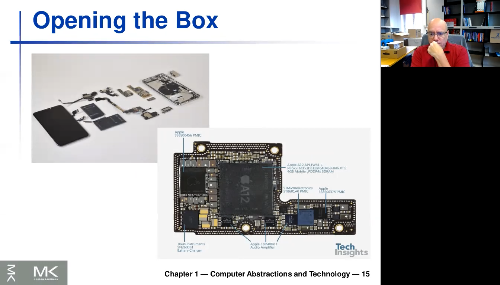
<!-- - `1:21:15`: there's like if you disassemble you see the screen here and this part here this is sort of the core of the heart though and this is the battery i think and then maybe there's some other sensors which i dunno exactly but this part here is highlighted here and i'm in is we cannot see you. -->
<!-- - `1:21:35`: curso a consummate cursor know what i mean beats and the cycles of screening we can see that you're highlighting something which we cannot see what. -->
<!-- - `1:21:44`: you see my mouse. -->
<!-- - `1:21:46`: guess okay then i'm going to use the mouse trench alright so here's this this thing here is highlighted here and need. -->
<!-- - `1:22:00`: yes and and this has all the chips on it so you see hear some audio processing chip is like a battery charger and not sure what that is maybe the the. -->
<!-- - `1:22:18`: the the connection for new by finding the radio but we don't know maybe the very radios are inside here so this is the whole the core of it like it contains a lot of things the eight twelve processor from apple as i said it's like arm-based and then. -->
<!-- - `1:22:35`: hub so there should be a picture from the inside here and then if you zoom into this a twelve you see these this part and he down here there's like the course which means that these two and a disk the disk because here and he. -->
<!-- - `1:22:54`: our small course. -->
<!-- - `1:22:56`: they decided the process was likely going to discuss in this lecture and and you can think of white chip the fours about implementing such a thing and also the one toggle por i showed you before it's like the one of these guys more like this guy like a beaker. -->
<!-- - `1:23:17`: epic arm started to be signed to a smaller and a small course in because the idea is that these guys the media. -->
- `1:23:27`: all very false can do a lot of things in parallel and but i need more power and that's why the episode it'll be clearly designer was called to also have like **small cores on this chip which**.
- `1:23:42`: **do the sort of the smaller sort of low frequency and whatever but you don't need all this compute power...** and this way **safe sort of power at the end** and then if something important has to be done like playing a game then you need to switch this because and then if you talk about games.
- 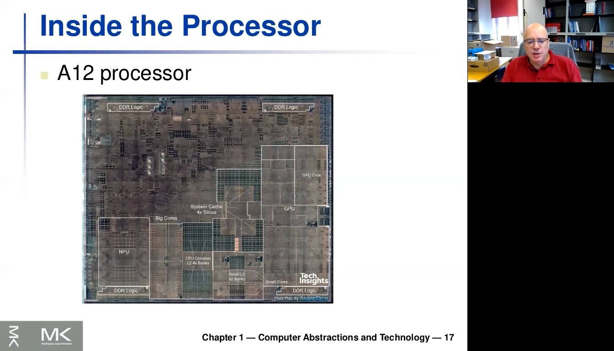
<!-- - `1:24:02`: see here's this actually and this is now more common also in even evening into there's actually some graphic processing units which is dedicated top down like you can also think of this is part of the diet is finding this to be used course and is actually takes quite a bit of of space here. -->
- `1:24:23`: and then vc your **memory controllers...** like this is for accessing dvd art of the **data datarate ram outside of the chip** and not last but not least you see here in **npu which is a neural processing unit...** is just a name what then.
- `1:24:41`: and like epl is using of you could call it to differently so this is like it cheap to you but it's a dedicated course for just doing a new **deep learning like computing evaluating deep learning models** so they have this already on the chip like an accelerator for may.
# ==============1:25:00==============
<!-- - `1:25:01`: maybe you're you're next you're having for that let's say cod or whatever. -->
<!-- - `1:25:08`: okay now i'm getting to this sub a picture so so. -->
- 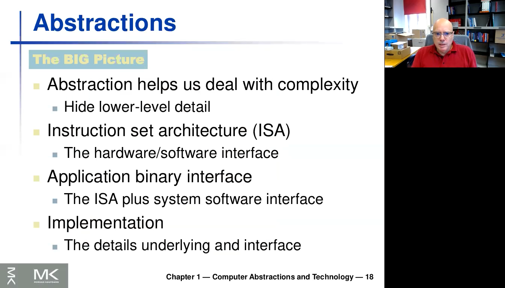
<!-- - `1:25:16`: we are having abstractions which allow us to keep things simple right so we hide lower levity too this is the the the the idea of abstraction i need to warn you this is one of my favorite them toms actually there's this concept of leaky abstractions so whenever you do an abstraction it minded the entity. -->
<!-- - `1:25:36`: turns out that a well there's this particular aspect that you need to take too into account in order to get sort of maybe correct but often fast system said in particular really look at this very detailed down in the level of abstractions to get distinct fast and in a certain sense. -->
<!-- - `1:25:56`: is the reason for doing this lecture is exited this so you should be aware there's like a stack of abstractions maybe of trauma will appear and then all these libraries and then at this level you have operating system which talks to the hoffner and and then in the hallway that's sort of like engineering aspects which you may. -->
<!-- - `1:26:16`: might need to take care of all together like a fost program at the very. -->
<!-- - `1:26:24`: and the the the the. -->
- `1:26:29`: **the abstraction which the computing history sort of**.
- `1:26:35`: **committed to is this instruction set architecture** and and **that's kind of the if you think about the assembler language of of the the processor but its called architecture** which is a little bit of a misnomer and that's also why these books are architecture ling y the sort of.
<!-- - `1:26:54`: this. -->
- `1:26:56`: jail here has the name architecture but it's in a sense describing **what's the api, how can you talk to the hardware.**
<!-- - `1:27:05`: and so you to think about sort of your program has this. -->
<!-- - `1:27:10`: commits to this icarly say x eighty six or arm and then he can run on the processor which supports this abstraction however that's not all also the operating system of course needs to run the program and has sort of hooks in there for library functions but also for a cease operating system. -->
- `1:27:30`: excess and this is called **application binary interface how you sort of like your software your program talks with the other software close to the hardware** same you kind of the software on the side then see the application binary a b i there's no acronym nobody should get a guy and then **down you have the abstraction to hardware** do.
<!-- - `1:27:53`: okay then we're having the will to talk about data and i think like this is time that i should stop now and if. -->
- 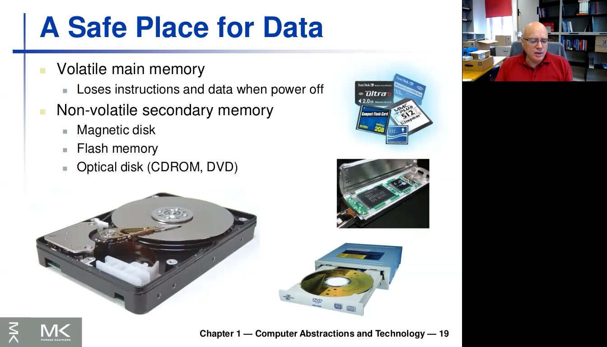
<!-- - `1:28:07`: there's some questions we can still take it about the subtraction layers and design lebanon struck at the introduction and also sort of this. -->
<!-- - `1:28:21`: processor or maybe some organizational question. -->
<!-- - `1:28:27`: so if there are no questions. -->
<!-- - `1:28:31`: then i would say i thank you for for listening for attending and you will get like the lead to the video in the helios forum very fast and anvil download also the mpeg for fy into the net closet or later. -->
<!-- - `1:28:50`: you're viewing alright so see you on thursday by. -->
<!-- - `1:28:57`: thank you good bye. -->
<!-- - `1:29:00`: i i i. -->
