<!-- /home/areo/Videos/Rechnerarchitektur/Computer-Architecture-2022-10-18.mp4 -->
<!-- /home/areo/.config/mpv/mpv.conf -->
[toc]
# Tags
classes of computers, history of computers, performance, seven great ideas, kinds of software, levels of program code, inside the processor
# ==============0:00:00==============
<!-- - `0:00:00`: the arcade then what has been mister the recording for those who are now listening only recording is an explanation how to access the material and the organization in some more motivation about the touring the work of the authors of. -->
<!-- - `0:00:20`: the books of his once wardens it into the video this is the book will do you and the village name is the same and sir. -->
<!-- - `0:00:30`: this is very important though this is very better time because this way we'd be able to to get actually all the materials wrote ok now back to the lecture okay everybody knows there's this computer revolution this has been going on since the year of the century and it it allows many new. -->
<!-- - `0:00:50`: all applications and everybody now knows sir. -->
<!-- - `0:00:56`: to use a computer like even your your grandma and grandfather probably now losing his cell phones for it said this happened in the last five years. -->
- 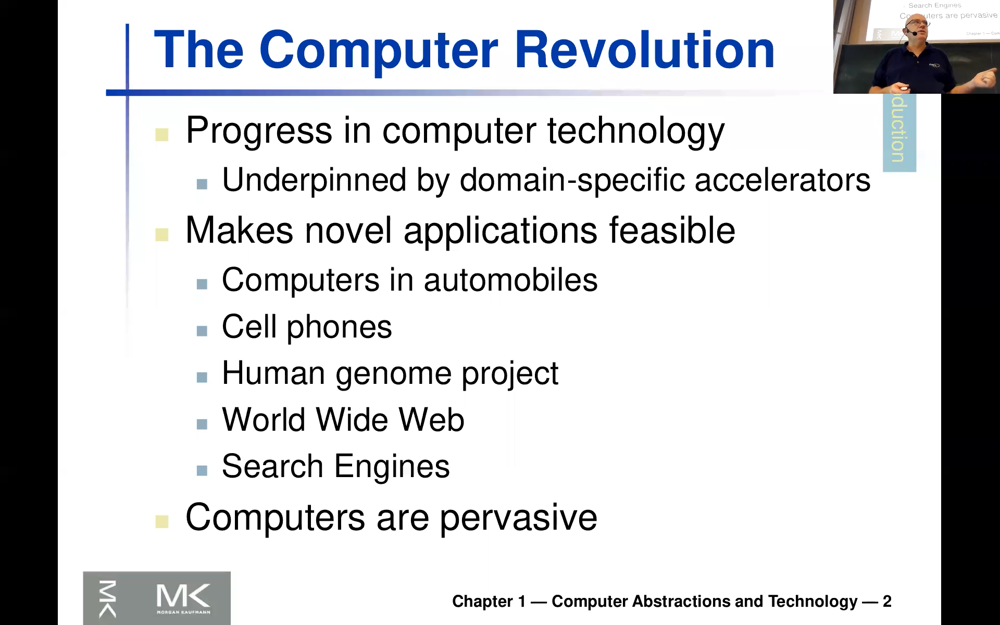
<!-- - `0:01:04`: the little bits failure one thing which should have imagined is this human genome project period and this was a roughly twenty years ago where computers start their news to them and to decipher the genome of the of the human and there was a big project because it. -->
<!-- - `0:01:25`: is lots of data and also needed a lot of computer science and this was a kind of a flagship project of applications of computers here in biology then even earlier tenure in maybe ten years earlier mid nineties the world by depth. -->
<!-- - `0:01:43`: and to following these associates in which you already used herein appeared and and the other thing which is also happening but also already since probably a couple of years that computers are pervasive so they're likely amused in in all the things rape and. -->
<!-- - `0:02:04`: yeah some of you might actually would have like now three computers midst you right in your pocket the fallen the smart watch and a laptop frame and in your house you should check like how many appliances a handful actually needed an ip address so i stopped counting when when when when i was at or above twenty. -->
<!-- - `0:02:24`: okay and so computers are everywhere and this trend will just continue probably them from it exponentially is nothing new for you and also like what i just explained there's of course two completely different types of computers and to them this is one of the things why this. -->
<!-- - `0:02:44`: tip crisis and maybe it was his golden age of computer architecture is important because depending on the applications needed like different types of computers and different types of processes. -->
<!-- - `0:02:58`: bool a little later go to the server history chester at them i've shown you. -->
- 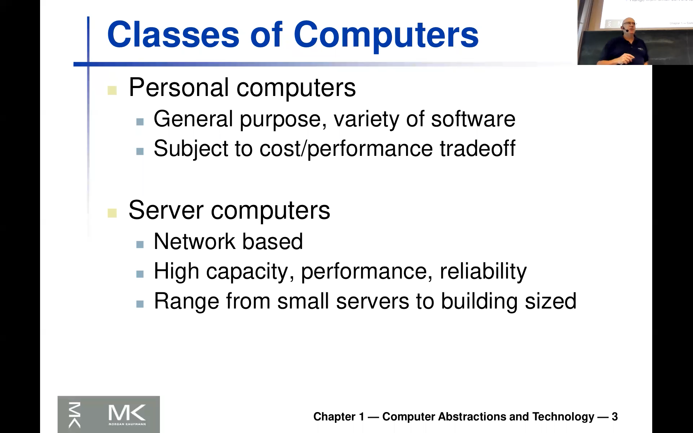
<!-- - `0:03:04`: and i'd like of course nowadays this is already like a history because it started in eighty one we have personal computers and the idea was that a computer is small enough and also an expensive or cheap enough that a one person can own one computer and that was a revolution. -->
<!-- - `0:03:24`: the eighties. -->
<!-- - `0:03:26`: and before already aliens are still taught today and their server contractors like a small group would have some servers where they put their freedom maybe even in your home you'll have some i dunno like some network attached storage or something so usually you access the service from there. -->
<!-- - `0:03:46`: worried. -->
<!-- - `0:03:48`: they have higher capacity higher performance in need more power right. -->
<!-- - `0:03:52`: but there might also be a more reliable. -->
<!-- - `0:03:56`: and. -->
<!-- - `0:03:59`: this has been treated and is still true today by them. -->
- 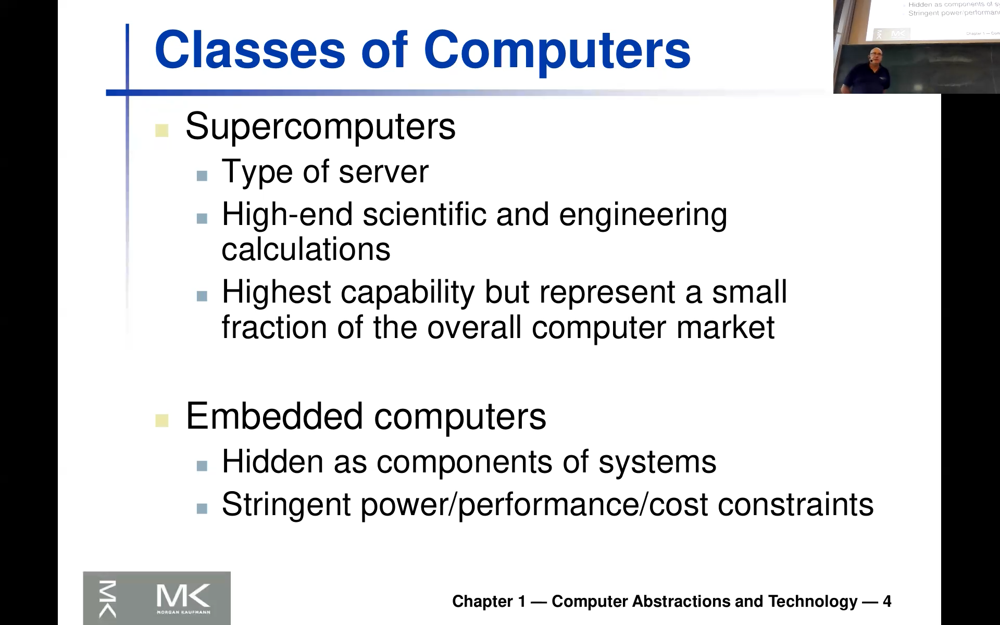
<!-- - `0:04:07`: supercomputers and first the first computers were kind of also the computers so the difference is subtle so terminology change a little bit of soccer and super computers or computers where pitchford might take up a considerable part of the room and they're really expensive so we're talking til. -->
<!-- - `0:04:27`: first supercomputers by i remember around like one million euro and socially it was clear that maybe year and the insurance company would own one bright and elegant is incomplete they would air and he still true today said his leg is on the server or service businesses still owns book ogres and lots. -->
<!-- - `0:04:47`: of this material we're discussing it was actually invented in this age of supercomputers as i said this was before nineteen eighty so pipelining editor it will also look at other forms of speeding up processes and dream. -->
# ==============0:05:00==============
<!-- - `0:05:04`: they were originally used for engineering in an intern scientific over the earth and services but awesome service industry like insurances and banks. -->
<!-- - `0:05:17`: i. -->
<!-- - `0:05:19`: alaska police was also happening since a twenty years and to assert of this room have their studies called after the train it's called combated computers so that means you have a small computer somewhere in a in a robot or the best examples of cars which might have thirty. -->
<!-- - `0:05:39`: or processes in them. -->
<!-- - `0:05:43`: and they're hidden right if you buy a car you don't really think about the thirty processes in that car. -->
<!-- - `0:05:49`: and on the other hand they have way harder constrains in terms of cost and power and performance is usually not that big an issue nowadays any more at like maybe a couple of years ago they would need to have certain power of restrictions etc cause restrictions. -->
<!-- - `0:06:09`: and okay now of course you know what's happening so that's what i said earlier this quarter and we're in the post-pc era and this that is the best example for that is probably one of the earlier guidance and input is a picture here but you are. -->
<!-- - `0:06:28`: saw this picture of steve jobs showing the delightful with a touch stream and this was around my fifteen years ago and it was kind of the start of this all he said was a year in his curve so the smartphone which was the neighbors with his touch interface and and by the way also the clouds will come to this later. -->
- 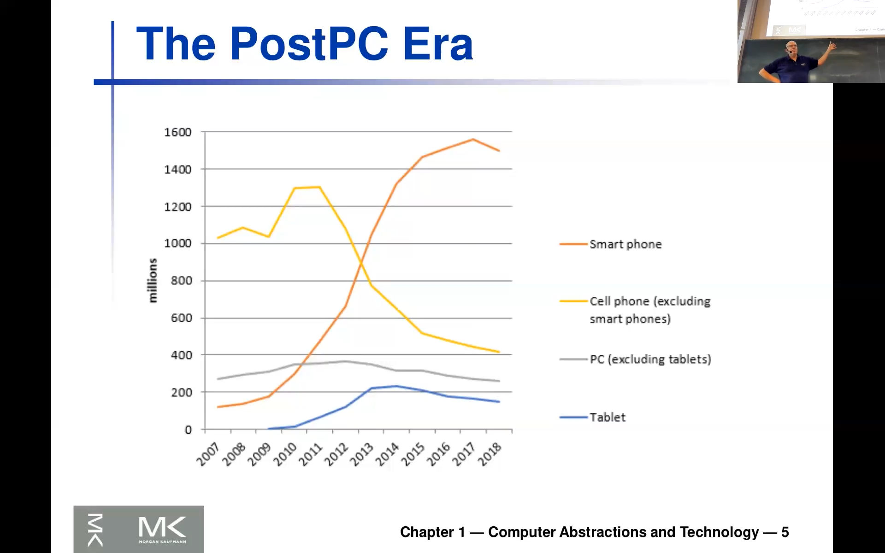
<!-- - `0:06:50`: and the greeley was a few years ago and the number of computers and desktop computers are actually oven down a little bit probably not like for technical students but maybe other. -->
<!-- - `0:07:09`: people would not have her pc anymore because he can do all the painting or whatever the smartphone one with a pc. -->
<!-- - `0:07:18`: so the tablet market is also increasing and so i'm not sure likewise goal it's it's it's on discouraged it's like going down and your cell phones have worse urban town near a traumatically because they're replaced by the smart ones. -->
<!-- - `0:07:36`: okay and cell phones yeah they had a chip in it but i would not call him or something edit it as a computer. -->
<!-- - `0:07:44`: and so this cell phone may be the light of your smart watch for sure it's not on the site but our phones they are of course something what would be classified as personal mobile device as he carried around. -->
- 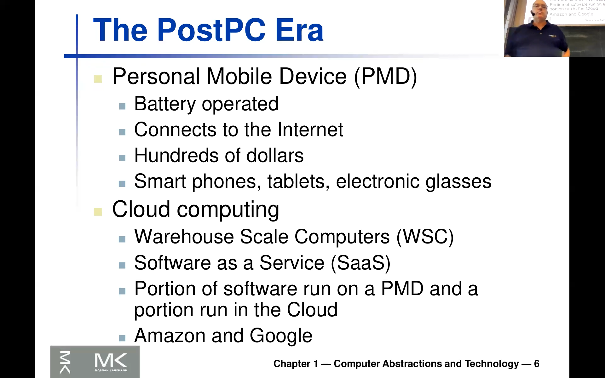
<!-- - `0:08:02`: enter your soul on pederson puts her in his lights so these are pedersen sleights and also electronic classes maybe you heard about this circle retried this and i'm not sure that this was the success that some of these technologies come up and gawk but maybe maybe wasn't the best electronic losses. -->
<!-- - `0:08:22`: as more watches this is really the news that says how many new players might watch now a days he lay one fourth one third now so that means there but i don't think anybody isn't linked on class theory though. -->
<!-- - `0:08:37`: and to okay this. -->
<!-- - `0:08:40`: is all are also by the way am connected to cloud computing which also started to appear probably a slightly before even we talked about sperm. -->
<!-- - `0:08:54`: and at the start of. -->
<!-- - `0:08:58`: am of the smartphones and really search incense in the region cora was because the a la google was the first one which was running that for the service it was the google search they had to run cities like irvine. -->
<!-- - `0:09:15`: they had to produce and analyze a lot of data and run. -->
<!-- - `0:09:20`: and algorithms on that data and for that then also search it very air and light with low latency to the customer and because of that they actually kind of are one of the driving forces behind clouds sort of the idea is that it had really big data center. -->
<!-- - `0:09:40`: the data center is simply like a big factory full of pcs and actually is really pcs and will will come with mimi talk about this later but like and yet he was not a really good service they're they're too expensive but to put a pcs there and then many of them. -->
# ==============0:10:00==============
<!-- - `0:10:00`: in delivers it's a very highly complex organization on how to how to operate this. -->
<!-- - `0:10:12`: yes and one year after google. -->
<!-- - `0:10:15`: amazon at least this is my interpretation whether it's quote. -->
<!-- - `0:10:24`: eight of us businesses near flawless service type services and they also came into this clog business but also probably more on sort of a technical perspective at least that's how i understand the the. -->
<!-- - `0:10:43`: the the history and they had all this like you know like what people use amazon usually for the you buy things in the internet ring but of course in order to organize it they had to also come up with some sort of data processing. -->
- `0:10:59`: and now an advantage yeah so **i heard that the awb essen cloud part has a higher a higher revenue than the elector then the actual parcels and the percentages they get from organizing the parses** and.
<!-- - `0:11:18`: one reason for that is because knowing more and more people move towards their businesses into the clouds if you'd like a local company here or so i know for instance like a pekin in australia there was there was a guy can say it siemens so they could they wanted to have their their siemens machine connect on ozil opening. -->
<!-- - `0:11:38`: actual closet and of course there was a student there in dennis who was actually then become a became responsible work for helping them of getting the siemens machines into the lot and and so even if you're kind of knowing in income like most of you are targeting embedded systems it's completely clear that your device. -->
<!-- - `0:11:59`: as we talked cloud services most of the time. -->
- `0:12:03`: and **there is a reverse trend maybe you heard about this too so computing on the edge...** hadn't heard about this trend and this is a particularly important if if you think about like maybe my phone is now listening what i'm talking right but but of course the the enemy analysis of my language.
- `0:12:23`: she will not be done on the phone it will be done in the google cloud operate or like who could see the epic cloud or whatever.
<!-- - `0:12:31`: and and that's too costly for several reasons for for a metal many embedded systems and it's also a little bit trickier it is if you have such applications like machine learning applications political which need a lot of power and yet finding your car and what happens if the engine at brigstocke right can you still drive your car. -->
<!-- - `0:12:53`: and so on yes so there was a big trade the last twenty years to more and more functionality in the cloud in particular you can for the embedded domain is completely clear he tried to to surf computation and data sitting in the cloud and the first thing you would need is a can. -->
<!-- - `0:13:11`: section internet connection when you think about engineering but desert line of reverse traded and it's called edge computing. -->
<!-- - `0:13:21`: and for instance and big am a big interesting part here is trying to get sort of fences machine morton and machine learning into smartphones or maybe even like cheaper devices so that it's like an independent of the internet an independent entrepreneur. -->
<!-- - `0:13:40`: but where this fight will end i dunno array like it's completely unclear at the moment for me but it could be like one prediction for the future could be we're going to need even more praise the cloud and everything will be connected to the plot and you won't have anything in your life without having an internet connection ring. -->
<!-- - `0:13:58`: or people are saying or a very small color vision or think about the hub or something like that in a war right like of which is happening on this planet you believe can you operate the machines without an internet connection. -->
<!-- - `0:14:16`: and also this is like increasing this cloud service and me and saw commercials for elisa this in the evening there's really a very big thing here and difficult of course microsoft microsoft as his own clothes as your azure. -->
<!-- - `0:14:35`: i heard that. -->
<!-- - `0:14:38`: from your perspective it's also pretty tricky says you think about amazon will closer they all us companies and this is one problem with the the data protection. -->
<!-- - `0:14:52`: and by the research is to adhere to european standards of the would have servers here in in europe but of course it's not clear whether they would not allow some seo agency to access this data from us agency or think of something else. -->
# ==============0:15:00==============
<!-- - `0:15:12`: by the way this was a chinese load which is also very big is called alibaba the case you heard about that. -->
<!-- - `0:15:19`: of course you would not put your data here as a local company and the alibaba clock right but you could. -->
<!-- - `0:15:25`: so it's just like so this is a is an interesting thing and has to do with this tension between what i said before a computing on the edge and computing in the cloud and this is a consequences of our main topic here because we need to sort of trade off performance and and. -->
<!-- - `0:15:45`: maybe it's computer architecture between and either set of low power and high power or and may be required in an internet connecticut yucatan and things like that. -->
<!-- - `0:15:58`: okay this prince means that this was the historical part. -->
- 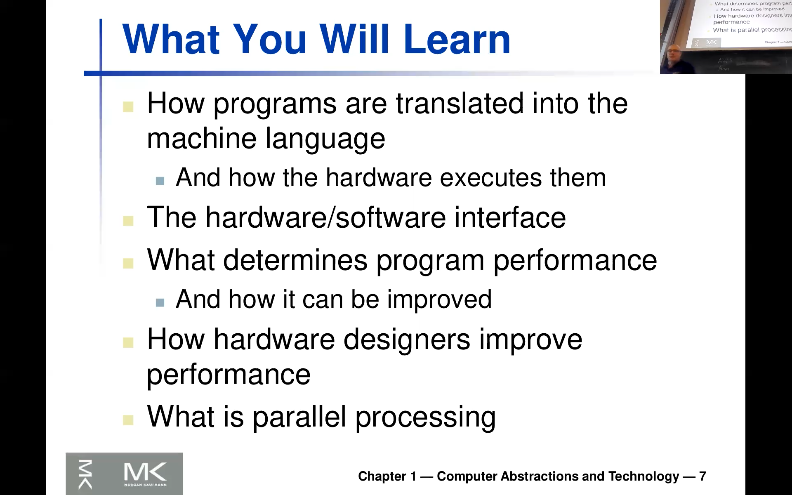
<!-- - `0:16:03`: am. -->
<!-- - `0:16:05`: and yet these lights are on the pds for the pictures as some water above all the others. -->
<!-- - `0:16:14`: okay what will you learn and widened by you need to learn and so so computer architectures are talking which are yes i don't dare to say there's another topic into this as google google or something to say the and as compiles ok. -->
<!-- - `0:16:32`: but both of them are now getting of. -->
<!-- - `0:16:36`: or as sort of a new renaissance rachel had pedersen and had his he had his video famed in golden age of computer architecture and so these things come in cycles. -->
<!-- - `0:16:49`: and and i think so what you learn here is a sort of some general ideas about am and kind of programming from the shooting so for instance how programs translated into machine language actually give you'll talk about compilers that's why i i made this quote unquote. -->
<!-- - `0:17:09`: tired am well we won't talk much about his will actually use them without explaining how the work so you will need to go to other lectures what we going to explain is sort of from the bottom what's the target of the compilers which is the assembly language or machine language actually even. -->
<!-- - `0:17:30`: and then of course howell parker executes this sir. -->
<!-- - `0:17:35`: add languages this is assembly languages. -->
- `0:17:39`: and this gives your does first and then kind of as very sacred and important harper soccer interface **which is actually the reasons for the name computer architecture** so that the name of the architecture has **two meanings** i'm going to spend a couple of.
<!-- - `0:17:59`: times because it might not be. -->
<!-- - `0:18:02`: completely cured. -->
<!-- - `0:18:04`: so first of all you think of any of your computer architecture what you think of. -->
<!-- - `0:18:09`: while the architecture of a computer ring how how the computer looks and how the building blocks and how the connect and we're going to learn about this too but there's a very. -->
- `0:18:22`: he finds an income to the sides which means **computer architecture is actually the assembly level description of a processor** right.
<!-- - `0:18:32`: so on so typical. -->
<!-- - `0:18:36`: the layer is either a written instruction said. -->
<!-- - `0:18:48`: maybe. -->
<!-- - `0:18:53`: using this term architecture. -->
- `0:18:56`: and maybe after about an iron earring and and so so **isa this interface what you can think of is a contract between the software, low level software like machine code and the hardware**.
- `0:19:11`: **so the hardware gives the software developer**.
- `0:19:16`: **the description the semantics of what it would do and the software developer translates what he what she wants into this language.**
- `0:19:27`: **this is the instruction set architecture** and authority law bay was once like x eighty six we're going to talk about this one.
<!-- - `0:19:36`: and then on mips is a very old one which was the predecessor of this one which is the core of the sub officer lecture yeah you can see that the end but opened in the in the picture it as required penetrates the risk five years or so. -->
- `0:19:55`: one of the certain instruction set architectures okay so this isn't a distraction a computer science really works with obstruction or the other does soccer and and the interesting thing is in this australian in it admitted on this picture saying this **was actually invented by ibm**.
# ==============0:20:00==============
- `0:20:13`: it being like a very early i think like a round in our sport so i'll come the number now or anything **when they invented this ibm mainframe** but he was.
- `0:20:27`: maybe cause the book onto the news blurb and they already had this idea **we're going to build multiple different computers but they all have the same language the language was his assembler of that ibm machine** there were no high level languages back there so the idea was get by like.
<!-- - `0:20:47`: different machines like it her differing factor twenty five it says in price starting price was a million right. -->
- `0:20:56`: **and they all understand the same programs**.
- `0:20:59`: **and this is this contract the software hardware interface** and as you all know right i'd be empty then i'm also invented the pc it was then later because it was kind of open of course overtaken by other companies.
<!-- - `0:21:17`: and the pc market is heavily dependent only on the x eighty six of inputs architecture because this was the dominating process of back then and this architecture the x eighty six architecture because of that survives until now so this laptop is a xavier six. -->
<!-- - `0:21:35`: but of course you see traumatic changes he saw his also like. -->
<!-- - `0:21:40`: like april in particular the vent from originally they had a think powerpc it might be much older than the event to an intern at one point and now they're back to arm but their newness is different even if another one which i didn't mention yet another architecture and sarker said the picture. -->
<!-- - `0:22:00`: and then. -->
<!-- - `0:22:02`: now wings n actually druids themselves so they didn't bind in the chips anymore but develop them themselves. -->
<!-- - `0:22:13`: okay so this is an urban church now down here this maybe. -->
<!-- - `0:22:19`: yes it is on top is two things these are kind of he'll probably have to take them as is it's not completely true anymore as i said likely might be possible for even for some of you to change the architecture and these abstractions in some applications and because this verse clyde is actually open so this was not the case for men. -->
<!-- - `0:22:39`: years so this was something they had to learn and understand. -->
<!-- - `0:22:43`: in term. -->
<!-- - `0:22:46`: this in assurances of course. -->
<!-- - `0:22:49`: how have programs work in the office they aren't. -->
<!-- - `0:22:56`: and in order to determine how far something is you first need to understand how the measured. -->
- `0:23:03`: how fast something is in turn bob heart like a tiny bite but still some part of this lecture in particular on thursday or probably or next tuesday that we'll talk about **how to measure performance** maybe you've heard about this **spec benchmarks** that we talk about and how hard this order came about and.
<!-- - `0:23:23`: turn. -->
<!-- - `0:23:26`: yes the usurper lecture in some ways a university city would do this this book he write as i told you reading this that's more depth here this is the computer the actual but it would have a separate course only on set of computer performance evaluation. -->
<!-- - `0:23:44`: and we'll talk detached upon this a little bit because it's important for for us so we tried to improve something in terms of speed or power or some other posts and in order to do this you'll first need to measure by this metric. -->
<!-- - `0:24:04`: now the last two are probably the most interesting one at least like for me to actually am and this computer architecture also teaches you some very basic ideas how to improve performance a clean general of course be boldly going to do this various sep or. -->
<!-- - `0:24:23`: process of his songwriter. -->
<!-- - `0:24:26`: but you're going to see like what kind of methods aren't there to improve performance and well it turns out that most of them have some sort of parallel processing players they will also learn about kernel computing so there's unfortunately no early computing costs here and that at all i taught one. -->
<!-- - `0:24:46`: in lids but here we don't have the one at but this of course very important and you see the basics for this parallel processing and taught a little bit and how it is actually implemented in hardware because part of his parallel processing is actually particular for mighty threaded. -->
# ==============0:25:00==============
<!-- - `0:25:05`: the mighty cord machines which we all now have and is to understand and am logging in to sort of like what what does it mean that your law wise is so slow we should lock in this new hobby disgust when when we talk about caches and things like that are close to the end of nature. -->
<!-- - `0:25:26`: okay now before i go on i want to show you this a picture here where the i b m mainframe as i said you can and not the picture that companion here so this is available. -->
<!-- - `0:25:40`: and i'll adjust it has his nice pictures side i find it odd that he that they removed it from the hope was that this would work but you can and this one is not publicly available but best of the right but you can darwin so the first electronic inquiries year this is retinal earth. -->
<!-- - `0:26:00`: mm yes perspective is easier and you see this as a whole room all rights and this was meant for doing some numeric computation it was done through during the war actually. -->
- 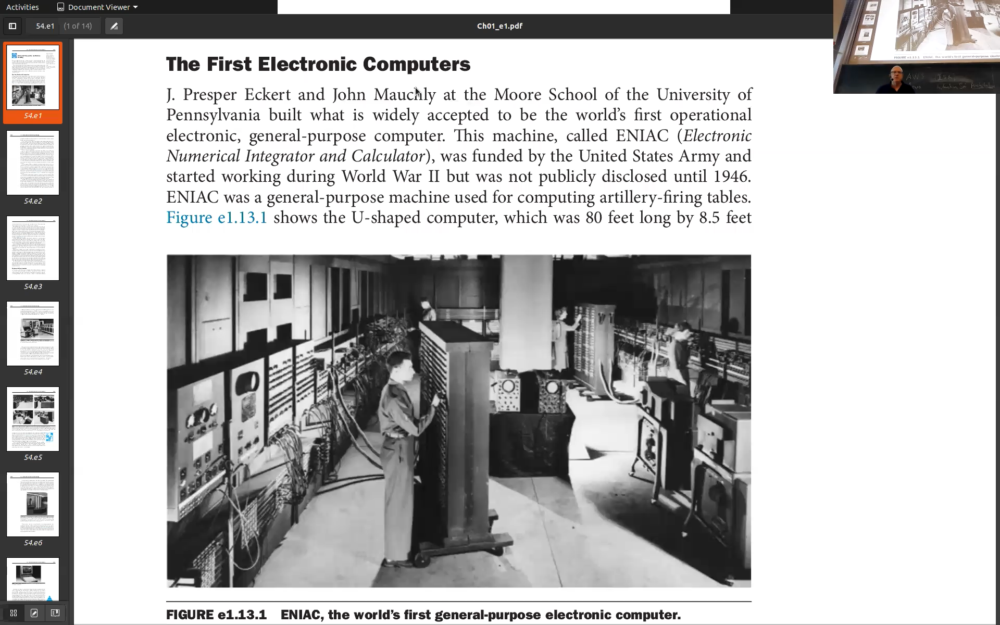
<!-- - `0:26:15`: this was this is like. -->
- `0:26:19`: the restate is is knocked the body ceiling like a big disease like at eighteen thousand vacuum tubes to the head is technology he has i should have explained this is where technology such acknowledging maybe you remember from digital design costs from technische informatik **technology means like in what is kind of the**.
- 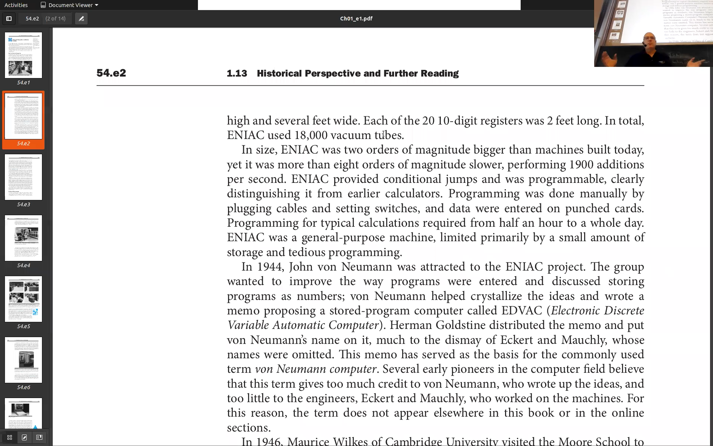
- `0:26:38`: **the physical implementation of a switch** free and vegan didn't have transistors that he used to vacuum tubes later they used relays and then transistors came in various forms and probably digitally sign remembered that was seamless his current current technology in oil like improved versions.
<!-- - `0:26:59`: alright and add and then i got the questions are yeah so devoid of commercials so that means only after the world war ii could buy this machine here it is called when he walks this is kind of the first. -->
- 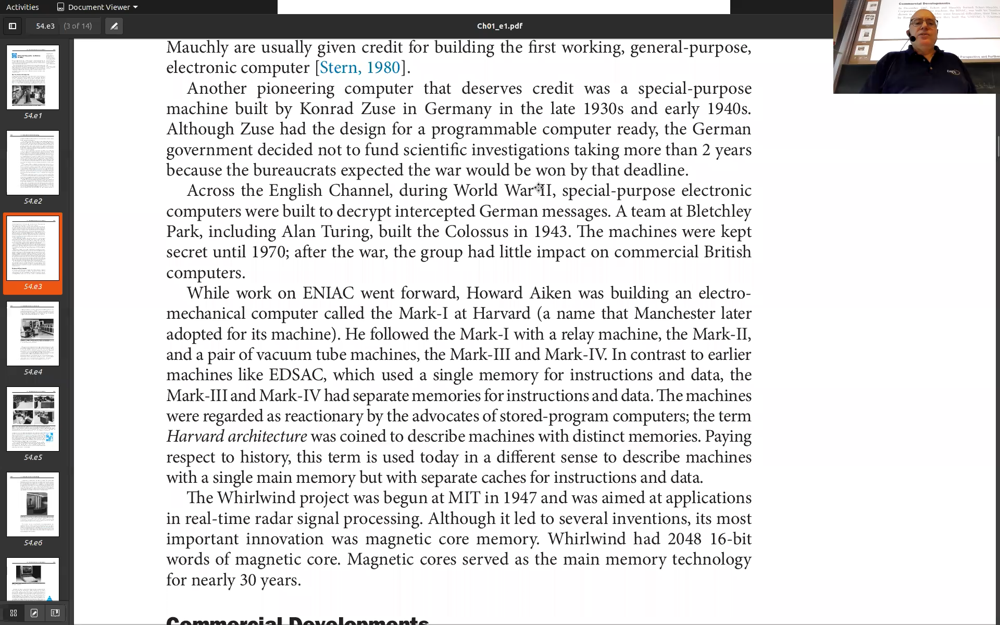
- 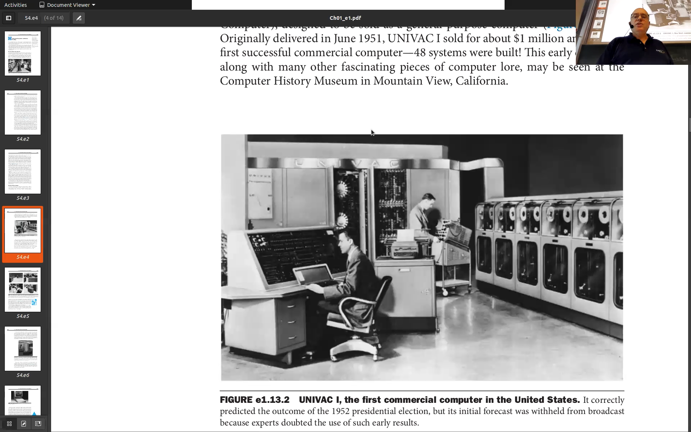
<!-- - `0:27:11`: machine. -->
- cmos
- `0:27:13`: which you could buy before it was just sort of a government and then **i b m went into the business** end or and this is what what i wanted to show which is for me quite amongst marxist before i was born so kind of i b m saw in the sixties that.
<!-- - `0:27:33`: and. -->
<!-- - `0:27:35`: that this computer might really fly off like the gold ruby might have his computer revolution and so they were really putting five beings is quite a big influx of people into the development of the system three sixteen and this machine and she still exists today and actually the forty below. -->
- 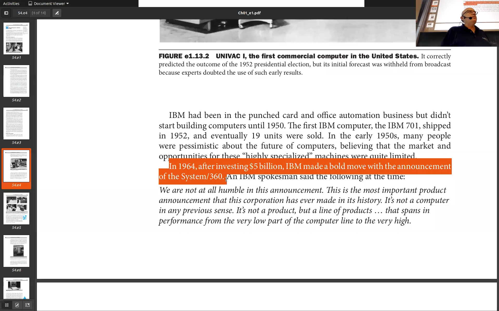
<!-- - `0:27:55`: sitting in stuttgart and it's a like amy and curtis thing is and as i said my day it's mainly used by service companies like think about like a big lv an airplane reservation system or insurance companies and they have programs which they have already deceased is. -->
<!-- - `0:28:16`: is right they were done on this island machines they're still buying these machines. -->
<!-- - `0:28:22`: and yet this is like one you see before it was worth five billion this is like you this would be way way larger day and year and in here are like a couple of pictures of the machines there they are all like a million and an end you see it down there indication. -->
- 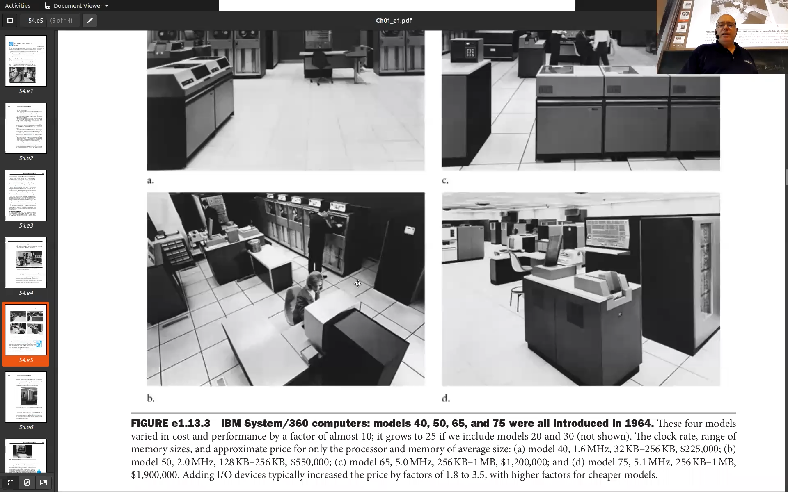
<!-- - `0:28:41`: but began writing an hour it will be way way more expensive and so he was really mean to you see like if the local old room with his be such a computer. -->
<!-- - `0:28:51`: and. -->
<!-- - `0:28:53`: but earlier already had his business and. -->
<!-- - `0:28:57`: an idea i may not be in i b m means business it's only an international business machine okay that tablet or a sailor computers of different size okay maybe two different types of companies even and they could charge more for certain features. -->
<!-- - `0:29:17`: it's a classical theme and but in order to keep this all running it'll come up with an idea how can i take a program from ear to ear ring and i want to like and implement a program for this very expensive machine to be the same program as the small one so that's why in in essence there there are really this thing is. -->
- `0:29:37`: please puke four different mighty machines this is really sort of be the **starting point of this idea of a computer architecture course back then everybody programmed in assembler the high level languages but the assampler was understood by older machines even** the machine called train.
<!-- - `0:29:56`: okay then yeah then the supercomputers like this was seventies i think yes sit seventy six. -->
# ==============0:30:00==============
<!-- - `0:30:04`: manor was not even a t natured like there was this guy as a simon gray who invented what dennis kois of computers and as i said before some of the technologies we're going to discuss later can be really traced back to these early designs of of of simple computer. -->
- 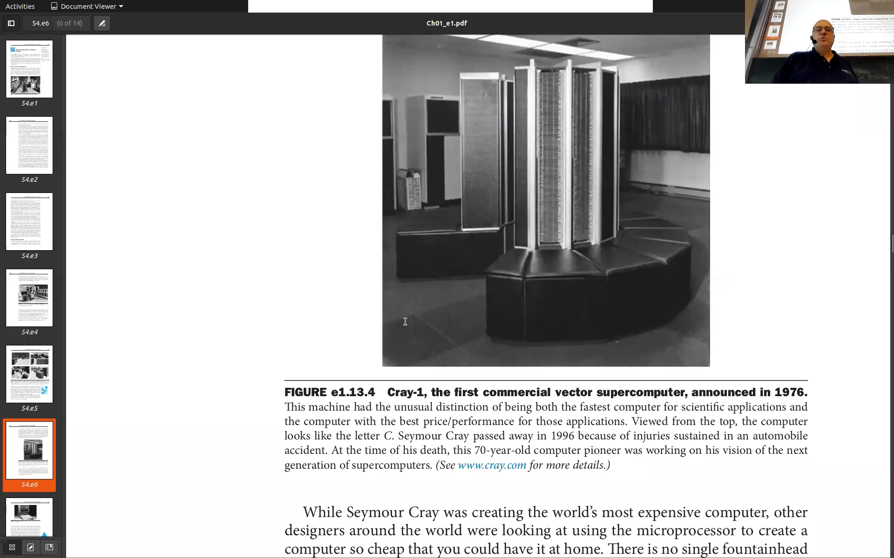
<!-- - `0:30:24`: then came the effort to see an air but they actually this was. -->
<!-- - `0:30:30`: i even buy a buy to persona thousand comp accompany what is named for clock cause the bush snuck in a student these drops who then later really became famous with empty break so this one actually lost against the i b m p c as i said in ninety one. -->
<!-- - `0:30:50`: and it was really the turning point of the evening every person like a pc and as i said now a days probably each of you will have at least ten computers. -->
<!-- - `0:31:02`: alright and then this pictures maybe also interesting is is he what was on his picture without meeting the catchy. -->
- 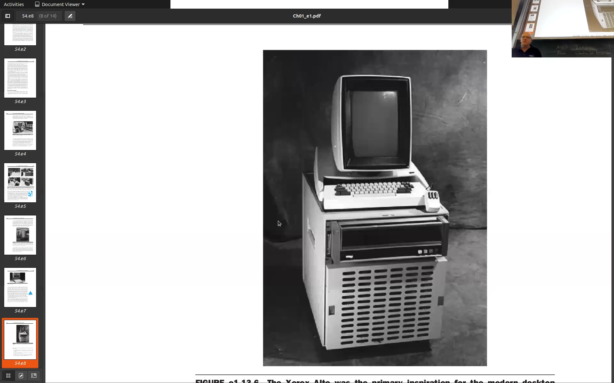
<!-- - `0:31:12`: there's a mouse again. -->
<!-- - `0:31:15`: and so there was also like another important step of people figured you don't want to have a text interface but like a graphical interface and this is you behind the computer clerics idol who was the first considered as the first one in this regard alright then we have. -->
<!-- - `0:31:35`: measuring performance out of it will come back to this later when we see more details in particular about the spec things are all explained some more more heart attack. -->
<!-- - `0:31:47`: alright so. -->
<!-- - `0:31:49`: in his experience as a synthesis only become immune so that means that who could then what the lord was a worse law but you might have for me. -->
<!-- - `0:32:00`: and. -->
<!-- - `0:32:02`: razor this is a in human rules are like pete offered said legless career job of size thirty centimeters and you see this when he welcomed his first computers were really big ruin than this one. -->
- 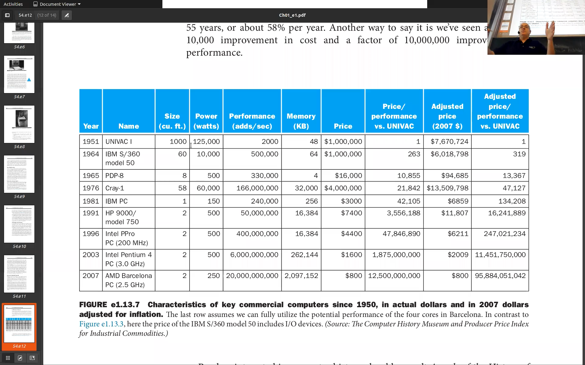
<!-- - `0:32:21`: ah this i am here and i i was smaller it might it's more like earth iraq frightened and so who could who crave like ten years later than usual he was that size oh i forgot to mention a pdb the age of big data cleaning. -->
<!-- - `0:32:41`: coordinate all your these rivers computers which actually made it to the university is actually because they were cheaper can also see it there but way cheaper than the ivy in gear and the cray and again this is tara back then right like for millions picton is different. -->
<!-- - `0:33:01`: numbered and falling against the grain. -->
<!-- - `0:33:06`: bright and entertain the pc they were really expensive so right this was more like a car. -->
<!-- - `0:33:12`: or the personal computer was wearing the size of the car what do you think would be something similar like a computer people wouldn't like buying ten years of person using. -->
<!-- - `0:33:23`: but think about robots rate rates are like a personal robot the chimpanzees are actually burning him working very hard the hard part of this like having your personal robot train and i think this will be in the same price for him so he will frequently be paid twenty and fifty k euro. -->
<!-- - `0:33:42`: anyhow so this tshirt three a look like it probably would be a car today. -->
<!-- - `0:33:48`: you ended of course it goes down and to your performance was off and for that i wouldn't need to explain you are what performance does but you can see kinda oven and an exponential increase here. -->
<!-- - `0:34:04`: and yet here's like one way of explaining certain number of additions a second rig this guy what was to doing it with two thousand second so this was her you seemed at two hertz and the two. -->
<!-- - `0:34:20`: kilometres he can hear and see the kids could hear maybe if the computers in the loop in an infinite loop buried in the long room. -->
<!-- - `0:34:29`: it is of course not possible anymore with our instead of billions of instructions per second. -->
<!-- - `0:34:36`: do you have here so this is twenty billion every year. -->
<!-- - `0:34:41`: and to do this lecture will about how to reach that read. -->
<!-- - `0:34:47`: and i have. -->
<!-- - `0:34:50`: another thing which i actually took i have to do this now every year teaching this i fear and so i went on wikipedia as well as search for it was law and it's of course changing every year so i hope one can see that yes he did but probably not in the video but then. -->
# ==============0:35:00==============
- 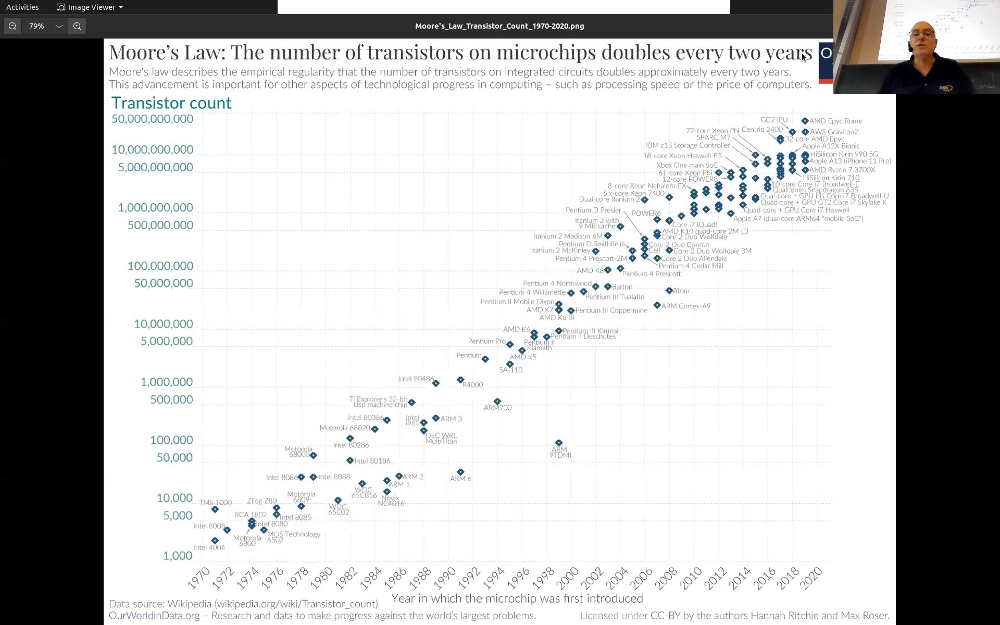
<!-- - `0:35:10`: go to wikipedia and click on this thing are also put it into the url. -->
<!-- - `0:35:15`: like sources here so first of all i'm very important when ever you see such a lot you'll need to change exists possible but merely exist and maybe even more than that it is important whether they are linear state right here he years over the years from ninety seven weaknesses or on the craig avery. -->
<!-- - `0:35:36`: and the right and until the cookers and twenty. -->
<!-- - `0:35:44`: ans yes all of mine. -->
<!-- - `0:35:48`: first impulse as a computer was as it is and is kind of almost my life as it will be resurfaced in to. -->
- `0:35:58`: so this is the years linearly and then as i it the most important thing is as the scale what does it mean the scale are well on the y axis using an existing engine the reds and getting you the million.
<!-- - `0:36:17`: and what is the. -->
<!-- - `0:36:21`: the actually measured there on the y axis is the number of transistors in in one. -->
<!-- - `0:36:30`: a corridor. -->
<!-- - `0:36:32`: ans. -->
<!-- - `0:36:34`: so and i'll tell you a little bit more so this morning i felt like i should explain that get up to date count on on the allowance because like and actually what was it like two weeks ago and needed a new processor come alonso i could check at one. -->
<!-- - `0:36:51`: ah so the the including one is year like one of these certainly are a new processors which actually does rome i don't know like the hair from elon and maybe all alpha can show you this milan. -->
<!-- - `0:37:06`: and. -->
<!-- - `0:37:09`: and they have like fifty billion transistors in this capacity explains this other sly trainer. -->
- `0:37:19`: because well you just have an **exponentially increase in transistors** and then **somehow and this is part of our lecture you need to turn these transistors into speed** rang.
<!-- - `0:37:33`: and in the old days actually like antithesis five. -->
<!-- - `0:37:37`: there wasn't a way simpler method it would just increase the frequency. -->
<!-- - `0:37:43`: and so until actually the height of this it's funny but it's actually the opposite in the pictures it's i'm not sure i didn't check this morning. -->
<!-- - `0:37:54`: in around two thousand and five there was the hate of this doesn't say you're right does somebody find it it's the. -->
<!-- - `0:38:03`: up is of these two game the machines which already the xbox three hundred sixty and the sony three playstation and the chip there this was covered both her record vs incorporating the sense of the word annexed by liberians in austin by the same company co both other companies in. -->
- `0:38:23`: interesting story and and they're actually this was the first time the he really hit this this issue that they cannot increase the frequency limits of the direct **already five gigahertz** back then and since then it didn't scale much i mean like we do see some improvements now so we'd like these companies are now reaching six gigahertz but.
<!-- - `0:38:43`: like before says i don't have his perfect block frequency but watkins he also got almost exponential up and then it started to become fled the wrong two thousand pilot. -->
- `0:38:53`: and and therefore since **two thousand and five you have big interests in multi core court in parallelism** and that's kind of the core of visits to this this.
<!-- - `0:39:07`: the assumption. -->
<!-- - `0:39:10`: i the am yeah there's like yeah let me just like if you some more examples of just show you idiot. -->
<!-- - `0:39:19`: can too i shared the whole screen and unknown from the door tory is. -->
<!-- - `0:39:24`: so. -->
<!-- - `0:39:27`: i'll have my desktop machine it's in an ice nine eleven will he see it in a second. -->
- 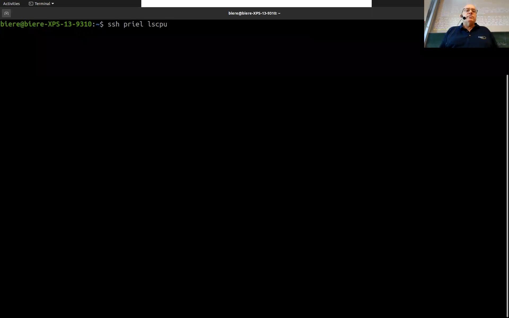
<!-- - `0:39:35`: you know it's attendant usl it's a ten. -->
<!-- - `0:39:39`: and matures is getting an eleven next but you know now they're already twelve and thirteen from gentle. -->
<!-- - `0:39:48`: and i just looked up the the the thirteen you can buy now i didn't know that you can buy it now like to generate new nutrition races aka one. -->
- 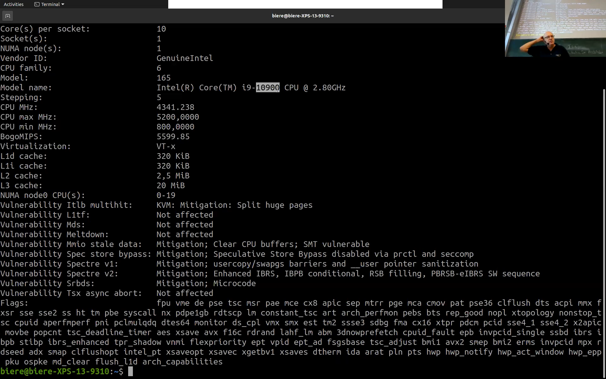
<!-- - `0:39:57`: for that i couldn't find transistor count so i did that though no words to the flagship of interest tits here but i know that the i i nine or twelve for nine hundred which was kind of until just like recently the vegetable into that has only three billion only in input. -->
# ==============0:40:00==============
<!-- - `0:40:17`: during his reign. -->
<!-- - `0:40:22`: and one an interesting meeting and this brings me back to the politics we discussed initially one interesting reason why. -->
<!-- - `0:40:34`: is falling behind him d was that a m e that amd actually produced from external companies to produce the chips are actually from taiwan is the reason why it brings us back to politics so the best chips currently are made in taiwan tsmc is the largest. -->
<!-- - `0:40:54`: at the most the plants are producer and term yeah i just also saw i looked up in edison so like this one three. -->
<!-- - `0:41:04`: one three nine hundred and also the latest amd machine is seven nine fifty they both around eight hundred euro half boasts thirty two threads and to do. -->
<!-- - `0:41:19`: endless delay can be highly indeed because this peak year was possible but only because the the taiwanese company the bruising nine anime meteors mr smaller transistors while it was doodling it's eleven meters thing and now it is one three ninety included for seven and one. -->
<!-- - `0:41:37`: meteor which those guys have already analysed you as the mds also with dmc that's fight mental nature and caesar so again a shrinking. -->
<!-- - `0:41:49`: and you see also called politics creeping herod. -->
<!-- - `0:41:53`: because a like a main china mainland china of course claims that taiwan belongs to them and in principle they want to have them back and said of the best to factories in the world producing chips are setting a timer. -->
<!-- - `0:42:11`: alright then by the way so this one has a similar consequence i told you that biden has just put a large bill on on in computer chips manufacturing all the processes but also on europeans are doing that and return more recently it was investing in the marketable can children is somewhere. -->
<!-- - `0:42:31`: big factory and what they wanted delivers this is very funny they want to become the satan instead of supplier for extra chips as tsmc is doing so they want to have that while you could go to this inter and to get a chip produced there with the modern. -->
<!-- - `0:42:51`: we are a technology and in the first like this will be then sort of european in this like western control that at security and guess what. -->
<!-- - `0:43:02`: last year google became part of the respite consortium so one of the targets in marketable is the purchase which launches what we're going to the specimens lecture. -->
<!-- - `0:43:15`: okay and yes i looked up i think i told you right because of this i three ninety has this one to nine hundred as a. -->
<!-- - `0:43:24`: the three billion. -->
<!-- - `0:43:26`: but in a fight go to our weakest machine behalf. -->
<!-- - `0:43:36`: which is this and which is an amd machine you see we have here maker actually has to terabyte by the bakery also this was the main reason he bought that. -->
- 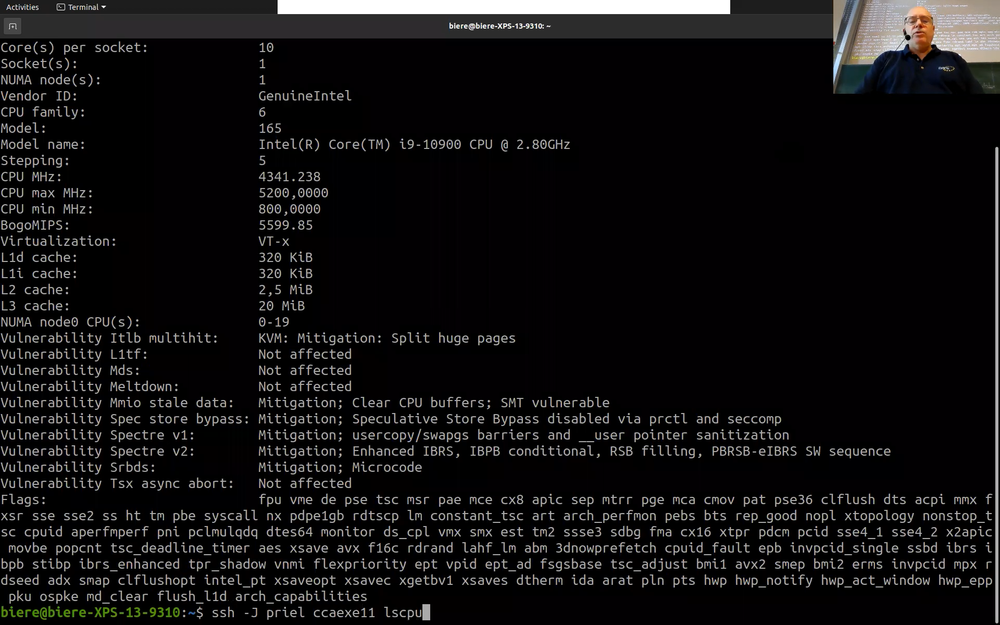
- 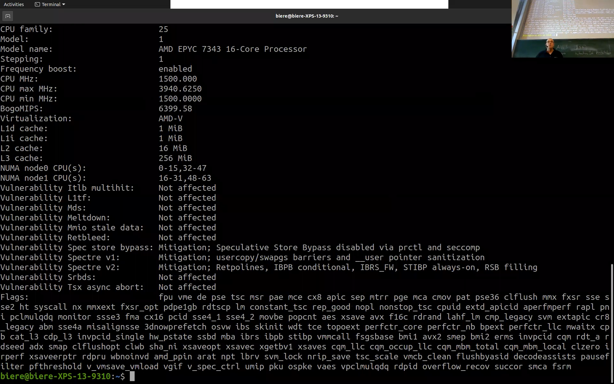
<!-- - `0:43:46`: but in africa that even in some clusters you can have to toss cushions with two terabyte memory and and this has really large caches here so even this new amd which you can just buy since two weeks has only half of them but this is a server processor right. -->
<!-- - `0:44:07`: and and this guy has nineteen billion. -->
<!-- - `0:44:11`: transistors so sits here somewhere europe. -->
<!-- - `0:44:18`: and then last year when i gave this nature this was before july three ninety eight article or this empty claim all you think like what happened there like one and a half years back. -->
<!-- - `0:44:28`: while the eboue eboue was having the crown of this and he came out with this in one chip. -->
<!-- - `0:44:35`: and and this one is too huge so it has also around a twenty billion the big one the m two and the smaller one the m one has sixteen billion so again the machine disruption that are struggling as since they're in between. -->
<!-- - `0:44:50`: however and as also interesting. -->
<!-- - `0:44:54`: what do you do with all the stressors do you know what an amd has been linear like this md forward like a d. -->
# ==============0:45:00==============
<!-- - `0:45:04`: the disable machine here. -->
<!-- - `0:45:07`: slowly put it into caches mostly so they put just way more cash on the chip. -->
<!-- - `0:45:15`: and then in addition and this machine doesn't but the one you can buy like the consumer part. -->
<!-- - `0:45:21`: now since the leagues that one has of course a cheaper yuan in transit it just put cheap to use on it and as actually what a plaza did they put like. -->
<!-- - `0:45:31`: a lot of these resistors in contribute part. -->
<!-- - `0:45:35`: and yes so we talk also the cheap you are but again last year this actually was at the very end i hope i'll be able to cover up a little bit. -->
<!-- - `0:45:47`: so cpu and also became sort of an. -->
<!-- - `0:45:53`: interesting as in the last twenty years and he didn't really exist before they were like graphic processing units before but they have they have a similar trend and of course they are now very important for machine learning and as i said at the end of the lecture we're talking about accelerators for machine learning because actually patterson worked with. -->
<!-- - `0:46:13`: i think he worked with google or on their on their machine learning processes which is more efficient than the cheaper use for for machine learning. -->
<!-- - `0:46:23`: alright. -->
<!-- - `0:46:25`: so this was moore's law it continues as you can see and yeah the lake last year only to make the claim that. -->
- `0:46:37`: abbott but maybe we should discuss it later when we talk about yield and that's one of the tricks and last year for epidural kind of trump ahead of moore's law actually go up higher was that he **put multiple chips on top of each other**.
<!-- - `0:46:54`: and the only going to have to re discuss this when we talk about yield will be in one of the following slides. -->
<!-- - `0:47:04`: okay. -->
<!-- - `0:47:06`: so let's go back to the more technical part and celebrate what i need to discuss now for the last fifteen minutes is kind of how do we get down to the. -->
<!-- - `0:47:20`: to to what we really want to talk about which is our internal architecture not the computer the internal set of how the processors is done and from. -->
- 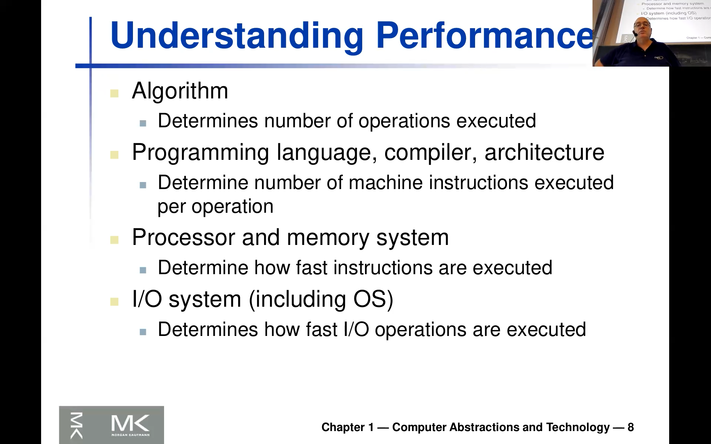
<!-- - `0:47:34`: of course the mighty boom. -->
<!-- - `0:47:39`: influences in the to the performance of a computer systems and yeah so you've been to errors classes and here you heard about like complexity of an everson and of course he have a more. -->
<!-- - `0:47:57`: a faster emerson in terms of complexity it usually pays off to use this algorithm certificate like example iron babyliss sort with his clicks are rare. -->
<!-- - `0:48:09`: then however even dare he mustered the one that kicks on is actually slower than you said have gotten below twenty lumens when he was bumped his word is the goal toward stadiums and i and the reason for that artist kind of constance rates at one point is. -->
<!-- - `0:48:29`: is it more important to maybe really look at exactly the number of executions done and not just have the approximate complexity and the second thing which i hope you will learn also in this lecture ogle at least look a little bit into it is there some low levity. -->
- `0:48:49`: **details on how these machines work in particular with respect to memory and caching which if you don't take this into account you can actually get hundreds the slowdown**.
<!-- - `0:49:00`: and to then sometimes are right so if an individual instruction one program because of a bad memory locality needs hundred times more than for another program the first of the corrupt this factor one hundred rain. -->
<!-- - `0:49:18`: alright then next thursday after resemble an end to your will need to compile into something which the machine can execute even better well nowadays of course many things are interpreted and even those are not completely true. -->
<!-- - `0:49:35`: like if you run javascript or python then these are scripting languages speaking which can be interpreted but he can also be compiled it means and either into rewritten in machine code or into some intermediate language where that is then interpreted. -->
<!-- - `0:49:56`: am but at the end all of that right like a will be executed on the machine like here we have an arm here we have work info. -->
# ==============0:50:00==============
<!-- - `0:50:11`: and this machine has a. -->
<!-- - `0:50:14`: as suggest already started to explain like half has like. -->
<!-- - `0:50:20`: the main cpu but also like additional things around it in the most important one is memory and as is often a bottleneck so the one aim of this luxurious or my my goal is that you understand it you'll bit this. -->
<!-- - `0:50:36`: it systems is issues which then. -->
<!-- - `0:50:40`: existing in if you look at program's performance in the local level. -->
<!-- - `0:50:47`: and. -->
- `0:50:50`: and the first like there are obstructions which usually lower the the user like you as a programmer and to get away without thinking about it but if you **know how these memory systems break you might actually get faster progress** and on the other side in the process aside we're trying to look at.
- `0:51:09`: exactly this kind of **abstractions which which hide this complexity of the memory system** and i always also big thing in it's comes both in terms of disk.
<!-- - `0:51:19`: as as the nowadays of course in turn network. -->
<!-- - `0:51:26`: alright. -->
<!-- - `0:51:29`: the the author has. -->
<!-- - `0:51:32`: useless sensor picture prompts here whenever he explains an idea in the book are here as a car finance here. -->
<!-- - `0:51:43`: oops. -->
<!-- - `0:51:45`: and to answer like the pictogram away he benches what what the basic idea is but but but the cern. -->
- 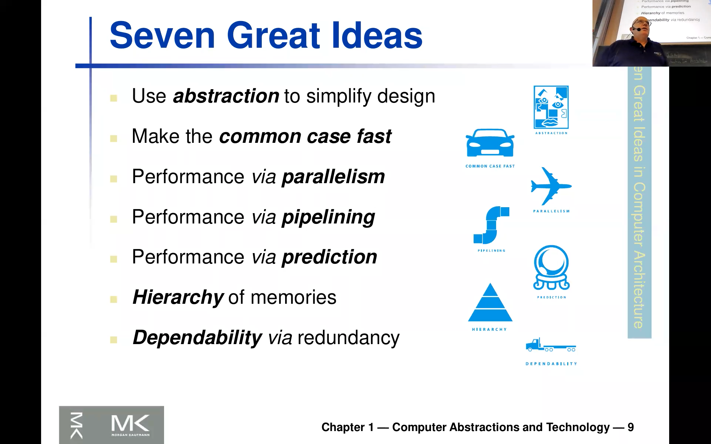
<!-- - `0:51:54`: different concepts to make sense so let me try to explain them and i hope i'll i'll i'll whenever we get to a certain point i'll i'll refer reference back to peace so what is an eight no seven channel and years okay for the first one is the most important one but what. -->
<!-- - `0:52:13`: you've seen this or think like i would even call computer science the art of abstraction rain otherwise we would not be able to build these complex systems. -->
<!-- - `0:52:25`: and it also exists in other sciences for it that you're making bit layers of abstraction but like in in our. -->
<!-- - `0:52:34`: proficiency this is of course everywhere. -->
<!-- - `0:52:39`: and i. -->
- `0:52:42`: **abstraction means you give a contract to some sort of somebody trying to use the system on a higher abstraction level and you'll need to implement this somehow on the lowered structure level and of course this process is continued on the lower level**.
<!-- - `0:52:59`: and this is the most important year in computer science i would say. -->
- `0:53:06`: and then the next one this is not that unknown usually and and the reason for that is because most of you i assume have not been doing and say performance optimization so great **performance optimization** i mean you have a complete running system.
<!-- - `0:53:25`: system and you need to make it faster. -->
- `0:53:30`: nk and then the **most important lesson there...** is.
- `0:53:34`: mike profile the system measure it's performance and then try to figure out **which component which case takes most of the time and then of course you should first optimize that part**.
- `0:53:49`: **sometimes also called the eighty twenty principle** sill and if you look at your system you measure it was vince eighty percent in in that inaccurate then you optimize that one he could get his zero hugo system performance by five.
- `0:54:07`: forget it by ba you is is eighty percent or forty percent rate then you get a reduction of forty percent and so on so **the common case needs to be fast** is an engineering trick.
<!-- - `0:54:20`: but a very important one and actually is behind many things in computer architecture. -->
<!-- - `0:54:26`: okay the next two. -->
<!-- - `0:54:29`: am. -->
<!-- - `0:54:31`: is. -->
<!-- - `0:54:35`: i would maybe put them together but like that said. -->
<!-- - `0:54:39`: one can one can think of them all or several of them so the one the first part is your. -->
<!-- - `0:54:47`: am. -->
<!-- - `0:54:50`: you do things in parallel so this happens in all organizations right as evidenced in factories this happens like nyc now right i'm teaching you to to you all of you imperil. -->
# ==============0:55:00==============
<!-- - `0:55:02`: and it's faster than if i would teach to you the individual and yet here's the airplane i'm not sure where he picked the airplane is assumed for that one. -->
<!-- - `0:55:18`: right so parallelism is is one important concept here then and the next one a pipeline you must have heard about esper and the first time you probably really see it in action is here in his computer architecture course in the old days in the start of the industrial revolution. -->
<!-- - `0:55:34`: then there were like the sun. -->
<!-- - `0:55:38`: and there was this basic idea of introducing pipelining into factories maybe you heard about like ford are doing this for the fourth factory which made and production cheaper and i'm from a small town actually here and plague forests are mediocre at it like johan severe. -->
- `0:55:58`: a watch of manufacturers in that they did the same for producing watches so **pipelining is something which increases throughput** and and will be the first optimization we're going to look at for processes.
- `0:56:15`: and may already nodded it makes me feel a bit so **pipelining allows you to do to split the complex task into simpler task which then each of them can be done faster because it's a simple task** and then **you can also put more people into more like proper transistors**.
- `0:56:35`: **into use and therefore increase the output**.
<!-- - `0:56:43`: so next a concept a prediction. -->
- `0:56:48`: and where half of your using this in a couple of places maybe you've heard about **branche prediction** he cannot have what it is is if you're making **machine code you have instructions for jumping around in the code** you don't have **like do while loops**.
<!-- - `0:57:07`: or something and. -->
- `0:57:11`: and in all protestant heads read them to be a chump and **these jumps have probabilities in real code** for instance if unions tight **loop you will often go that loop and and a jump which jumps bank at the beginning of the loop has a higher probability**.
- `0:57:32`: **and that you can use to prefactor already instructions from within the loop and not sort of wait until you know whether your you'll repeat the loop or not** and **the same is true for caches** so the most precious are the most **one of the most**.
- `0:57:51`: **important low level optimization.**
<!-- - `0:57:54`: and. -->
- `0:57:57`: the decision **targets is increasing memory throughput** and these caches help you for debts am and air your **prodict which cache lines which data should you keep and which to throw away** subwoofer was a little explain this later.
- `0:58:13`: and and a related to what i just said with his cash an prediction is here this higher **hierarchy of memories** i still have this one thing here.
<!-- - `0:58:25`: so you will after this ledge lecture understand this he served four lines so the vp and you will have her. -->
- `0:58:36`: **close to the processes core level one cache** very close **very fast** but **the smallest he** can see just one megabyte.
- `0:58:44`: and it **split into the data and an instruction cache**.
<!-- - `0:58:50`: then there's like some other cash is selected to cash this is bigger and there's even a third one and bitches are one quarter of a kicker by trade. -->
<!-- - `0:59:01`: and yeah so these ninety million transistors for this for this processes but i guess of course i don't know details are probably. -->
<!-- - `0:59:10`: mostly a located here to this to this cache isn't it soviet hierarchy of cases are increasing in incapacity the smallest one is more than cause of american excess facet of the second born and exists lower in the third one is really slow but it has a high capacity. -->
- 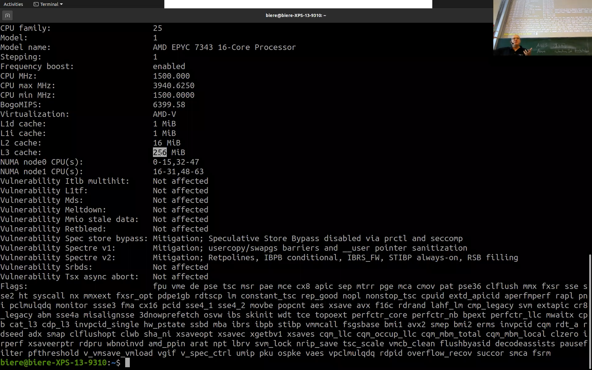
<!-- - `0:59:30`: then comes the real memory as as if this machine has two terabyte of of main memory. -->
<!-- - `0:59:39`: okay so this hierarchy of they always been will understand and this was a very general principle and we discuss for that then repeatedly discuss dependability your redundancy. -->
<!-- - `0:59:53`: i. -->
- `0:59:54`: is a little bit orthogonal topic but it's of course here in this yang in this processor design necessaries of italy in particular will discuss arrow corrupt **error correcting codes for memory**.
# ==============1:00:00==============
<!-- - `1:00:12`: rk so. -->
- `1:00:16`: the well is below your program soviet application software system software and **with system software we mean both libraries maybe plus operating system software** and then below you have this this and this.
- 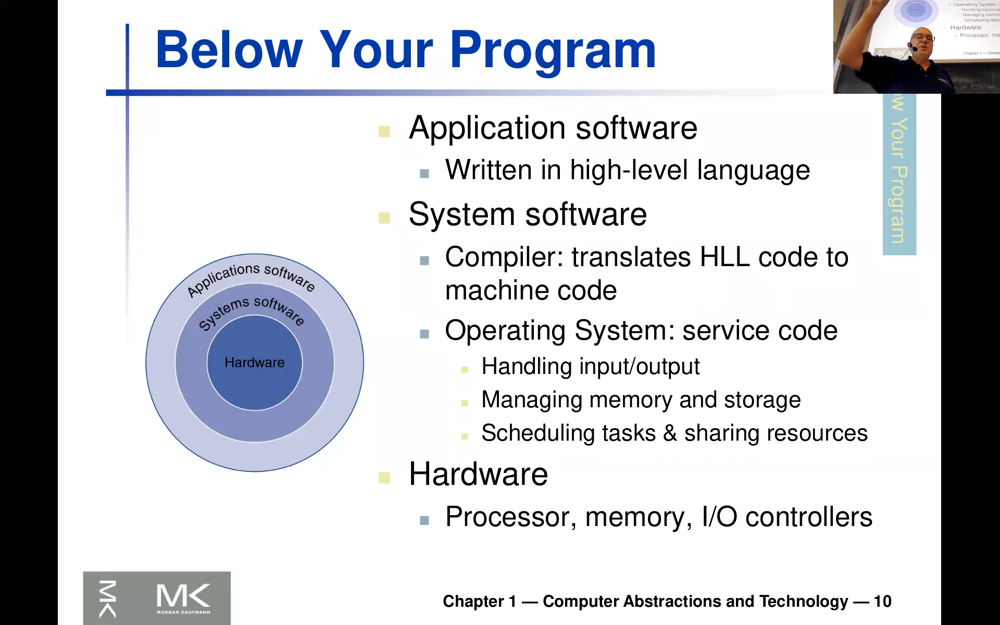
<!-- - `1:00:35`: hardware. -->
- `1:00:39`: we actually talk a little bit about **interrupts later which will explain which will explain how to go from one of these layers to the next one**.
<!-- - `1:00:50`: if you look at like a mop or representations looks by this. -->
<!-- - `1:00:56`: and maybe this author explains already been important to him do you know the difference between machine code in a singer. -->
- 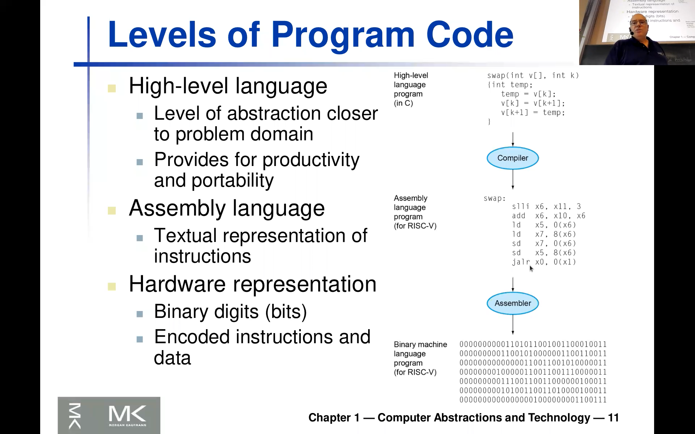
<!-- - `1:01:04`: okay so it's here in the slide. -->
<!-- - `1:01:08`: so absurd. -->
<!-- - `1:01:10`: so your top is like some crc blockbuster nerd probably see platypus code and your or java and your while it says c and but maybe some modern scene and then so it has an. -->
<!-- - `1:01:25`: it gets like this d and i. -->
<!-- - `1:01:28`: and it's an array and you're going to have to swap the two elements a dead position at k and capelet for her right that cycle for that and here you see assembler code in risk five. -->
<!-- - `1:01:43`: just the same. -->
<!-- - `1:01:45`: in stealing something as a symbolic assembler instill it in a sort of symbolic motion pin. -->
<!-- - `1:01:53`: and. -->
- `1:01:56`: then i am an assembler takes this input and produces machine code i mean this down here still some poly crepe it's not really but but this is the **thirty two bit vector** right she can think of this as **four bytes** and **each line here corresponds**.
- `1:02:15`: **to one line here** and there's one thing that you don't see here but we'll discuss it later there will be a **labels like this one here but maybe as a target of a loop and then the assembler will have to compute actually the address of this target** and and so.
- `1:02:35`: this swap here is symbolic but like this this gets an address.
<!-- - `1:02:41`: right and this is the machine called a desert like four bytes sequences which would go into a risk five. -->
<!-- - `1:02:47`: the computer and he would execute it said we'll look at history tablets and most of you have seen i think this part already in technician vermont decorate with the dating right i hope so some minority. -->
<!-- - `1:03:04`: but there's more to does inward and outward and. -->
<!-- - `1:03:10`: we're going to evaluate this whole system and with input and output alright. -->
<!-- - `1:03:19`: i don't think we'll talk about much so we'll talk a little bit about discs or like actually today will be mostly ss these like flesh discs but we won't talk about a network adapter and that one i already explained here while i don't explain how displayed. -->
- 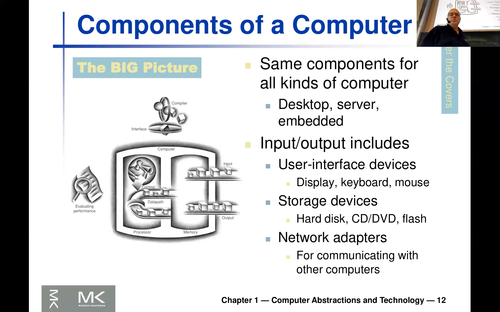
- `1:03:39`: ecology works but you can think of this is all such as **bits coming out of the computer and being represented as pixels**.
<!-- - `1:03:50`: and if you want to. -->
<!-- - `1:03:54`: get like maybe something real of this levels of construction expansion and here's a nice picture from apple iphone and there you can have a look at the sun increase was released sort of in suction phone and you see a couple of chips right so so this is a display. -->
- 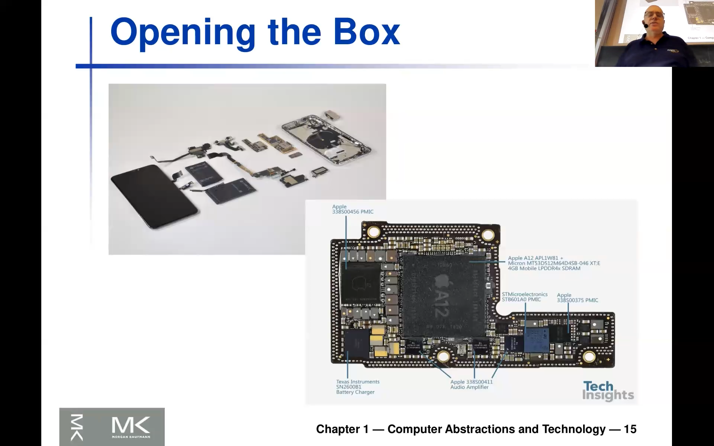
<!-- - `1:04:13`: didn't the circuit board sin in tears like him. -->
<!-- - `1:04:17`: and here are several chips like there's like one from texas instruments necessary for charging and this one i i don't know what what this p makers at this year's like audio amplifier and then you would have feared that the main processor which is this a twelve processor which was the. -->
<!-- - `1:04:37`: leading edge focus or process url. -->
<!-- - `1:04:41`: of apple and before the m one came around i think now that he'd been with tennis like in one in one sing this one. -->
<!-- - `1:04:50`: yeah. -->
<!-- - `1:04:52`: all right. -->
<!-- - `1:04:55`: inside of the process certainly will then look at it if you're in the mood for the understanding and the yep the building china's national events of the day was pretty high level and the next turn. -->
# ==============1:05:00==============
- 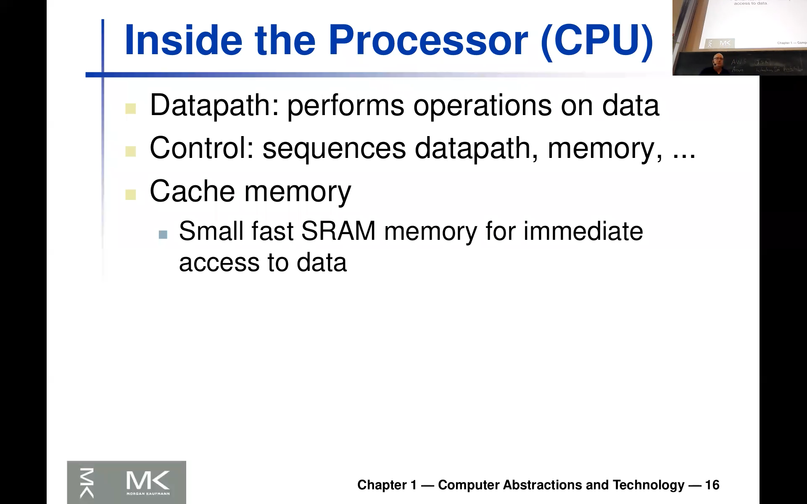
<!-- - `1:05:12`: weeks it will be more technical but i'll try to be also still a little bit entertaining yet simplest questions etc the water i said who's unloaded. -->
<!-- - `1:05:27`: yes so i'll put it on the webpage here so yes so maybe i'll repeat it here so we're going to start like it's always like one hours ago without great it's also because of resume and i hope you will be able to survive ninety minutes in a roll and. -->
<!-- - `1:05:46`: to build a goal from a tin syrup and ten fifteen tool that halted to twelve. -->
<!-- - `1:05:55`: and i'll will be recorded so we also decided this year we going to do the exercise recording straight from the yes because last year's thing we didn't do that said the end of this lecture you will have thirty ninety minutes videos to watch until the content for your punishment then said i'll get you to show up. -->
<!-- - `1:06:14`: or at least like a wad sure some of these are either life or add through recordings i mean is more fun being here and in it's use me spent was a more time like understanding was because. -->
<!-- - `1:06:30`: okay so anything else was guessing. -->
<!-- - `1:06:33`: okay somebody has voted spawn on thursday i was still a lecture then next week we're going to have an exercise circuit and see you i'll see you in untrusted and if your birthday is six acre. -->
<!-- - `1:06:50`: sos song. -->
<!-- - `1:06:53`: is it. -->
