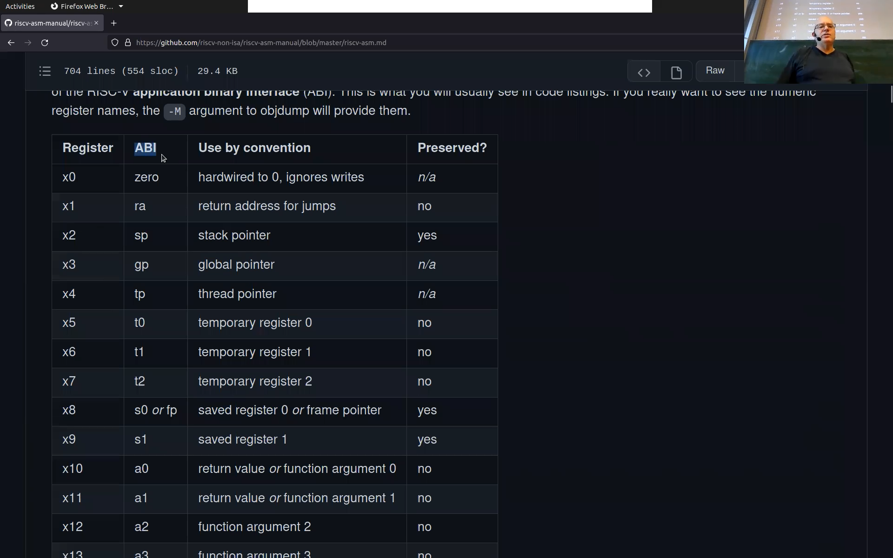
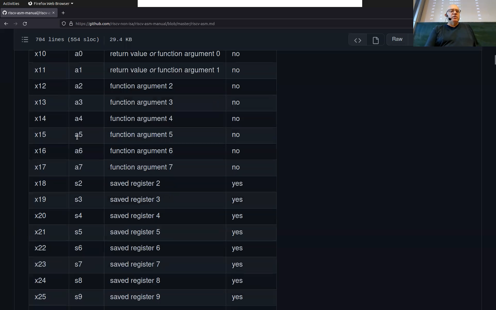
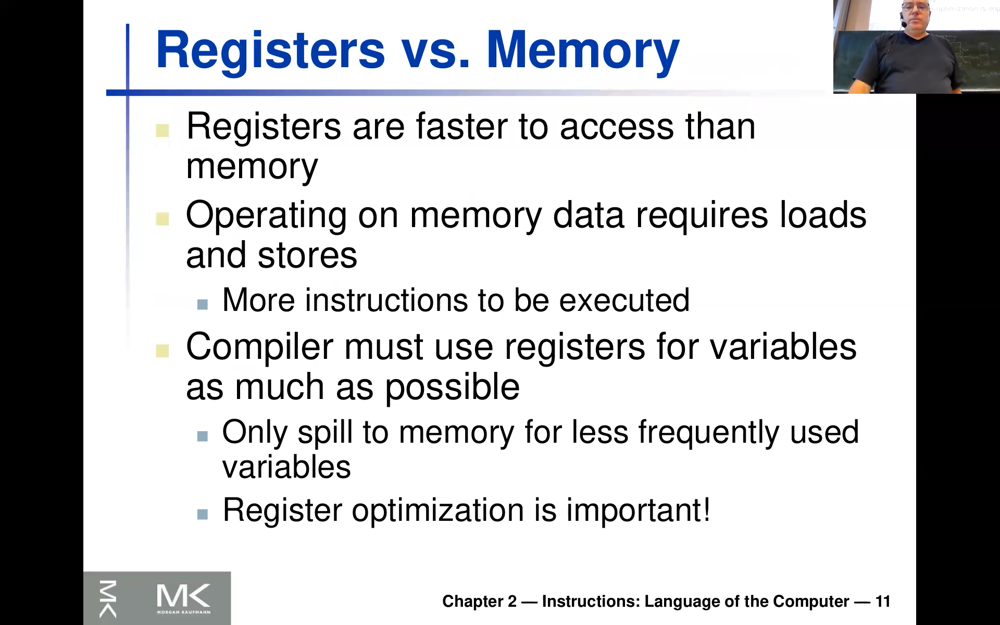

<!-- /home/areo/Videos/Rechnerarchitektur/Computer-Architecture-Chapter-2-2022-10-25-slide-01-to-11.mp4 -->
<!-- /home/areo/Videos/Rechnerarchitektur/_Computer-Architecture-Chapter-2-2022-10-25-slide-01-to-11_imgs -->
<!-- /home/areo/.config/mpv/mpv.conf -->
[toc]
# Tags
instruction set (is), arithmetic operations, design principles (simplicity favours (regularity, higher performance at lower cost)), (abstract syntax tree, control flow graph), word and double word, registers, pseudo instructions, instruction length encoding, main memory (byte addressable, little and big endian, aligned words), array and offset
# ==============0:00:00==============
<!-- - `0:00:00`: the court now. -->
<!-- - `0:00:04`: okay so today we're going to talk about him at the cemetery and so starting with the chapter two and to going into the. -->
- 
<!-- - `0:00:18`: instruction set architecture or describe it as as one example in the room. -->
<!-- - `0:00:26`: i'll i'll make some references to other the other instruction sets in particular of course we're going to look at was a little bit it. -->
<!-- - `0:00:37`: x eighty six on which this laptop is running of course and but like the only dive really deep into the. -->
<!-- - `0:00:46`: am into the. -->
<!-- - `0:00:50`: into the risk five there's one thing i'm lifted unprepared because of an accident this morning so and usually i would but you find it on this companion page so i can click on it so he paulo go to the media there's like a link to the companion wearing like some of the. -->
<!-- - `0:01:09`: pdf have you seen already are and also i'm particular one we're going to discuss next but there's also the reference card off the. -->
<!-- - `0:01:21`: risk five which is really useful but i didn't prepare it's all celestial you this next time and i show you some more online from a versions of this one but the one the reference card is just one when he sold the book it's actually like more solid paper and that it has two pages. -->
<!-- - `0:01:40`: and it's in a certain sense everything which is about five percent at one and then yeah i i go back and forth between that one and also the one unlucky temperature i'm going to show you. -->
<!-- - `0:01:54`: and in in in a couple of minutes or so so anyhow if you really am not that much interested instead of sort of top-down and stories whatever it just the bottom up in and read this reference card and try to understand everything which isn't data so this is in. -->
- `0:02:14`: i didn't sense the topic of this chapter there's one more thing which is a little bit tricky but that explained is needed is something which is called **application binary interface...** and a yeah so we come to that so this is sort of additional you can think of it as a **contract how you use assembler**.
- `0:02:34`: i have a similar indeed **it exists like for like**.
- `0:02:39`: **operating system cross compiler** writes **it's kind of a convert that the compiler in operating system**.
- `0:02:46`: **and it even might change so in linux for instance there was a change in c plus plus application binery interface around two thousand and eight and so binaries before that if they are not statically built they will not work with binaries afterwards**. so this application binary interface thing i'm going to explain next but it's like a little bit mixed ms lights little been me.
- `0:03:06`: ext but i i hope i can can explain it later right so is the point the point is on the **very low level of your talking here in this chapter about the contract the language you talk to the processor** right.
- `0:03:20`: and **then on top the operating system assumes certain calling conventions for instance or that registers are used in a certain way** and that's what we're going to talk about on top and if you cannot really distinguish to read in because like assemblage of is connected to the lowest level of your grades used in the upper upper.
<!-- - `0:03:40`: level is the operating system on the lower levels the process. -->
<!-- - `0:03:46`: alright. -->
<!-- - `0:03:48`: okay so this green card while you're recalling the reference in this companion pdf that's the instruction set and that's what we're going to look at now so most of you have been to the informality greater to the site was not been to discourse. -->
<!-- - `0:04:05`: look at nobody that's interesting are you okay so so that they're just explain to you there was another process or very simple one spot was afforded a t r e t i in that one and head of the tickler i could injured a simple one but some of the failure you're going to have to see here is of course already. -->
<!-- - `0:04:25`: they're like design decisions like how can designers language and am but i'll allow as most of you have seen this so i'll go sort of on very basic explanations probably not that a little bit faster. -->
- `0:04:40`: so it's kind of year it's **just the instructions the processor understands** ends and different computer said differently socks and sets i mentioned this before wretched **invention of this whole thing was actually probably hit a coke commercial reasons** and **because i b m wanted to sell the this**.
- `0:04:59`: a different in a **different machines** mature some of them are very expensive said he wanted to have a different shader in terms of like what they can sell.
# ==============0:05:00==============
- `0:05:09`: and **in order to have programs work in all of them they invented a common language** this was like the **this was i b m three seventy** which i said is still used to today and about the first like it made sense for a subscription level as he discussed the most important concept in computer science it's distractions **abstract such that the processor...**.
- `0:05:29`: **and how it's really implemented in hardware**.
<!-- - `0:05:33`: from the operating system. -->
- `0:05:35`: it's like a just like finished two minutes ago **this is not completely true** choose to do something something that isn't **something that is called leaky abstraction** so **sometimes you need to look through** it.
- `0:05:45`: and **maybe you've heard of these spectre and meltdown bugs** straight they **are classical example of now a leaky abstraction** right so they have sightedness even so it's not even functional but they have like timing instead of which you assume about the process of ones implemented and you can use interpret the operating system security.
<!-- - `0:06:05`: have any of that it's url is invalid abstraction is instruction set. -->
<!-- - `0:06:09`: and yet only come through the very simple instruction stated in the end it became way more and more complex and adam and eve early days i think i explained is also already last time and clustering and the other days this wasn't portrayed effectively because people had to program the machines innocent of the ring and heather. -->
- `0:06:30`: **like a complex assembler which in an instruction a lot of things as if it is more usefull from programming prospective**.
<!-- - `0:06:40`: and the the other reason so this was lynn kind of initially it and instead of a trend of making things more contractors to help the procurer for aids hiv programs nowadays of course are endless at least in the eighties and it was clear that sort of these compilers and you need to use compilers anyhow right now. -->
<!-- - `0:06:59`: coco etc so that's why you have one. -->
- `0:07:03`: and **there was a trend so this was started by the stupid pioneers of our book and his encourage than to do the opposite...** so really put more of the functionality into the compiler and keep the instructions said simply.
- 
- `0:07:16`: **and this allows us sophisticated optimizations** and **therefore making make the hardware design simpler and more efficient and effective**.
- `0:07:28`: and now what's happened then added over the years was and this was calling his hers **reduced instruction set architecture** errors or that the name was of risk fine this isn't a name offers five and the first computer which exceed those two guys commercialized.
- `0:07:48`: of or like put forward was this **mips** which was kind of for long time the embedded one of the embedded processors so most a hard disk at mips controllers midfield processes in it ends.
<!-- - `0:08:06`: and it turns out this was a good decision but x eighty six didn't go away right so so people laughed so have old binaries running on the processor and all the infrastructure compiler and everything would just remain. -->
- `0:08:19`: i entered but it was clear that this reduced instruction set is simply what's the water simple instruction set is gives you an early opportunity to to to **build faster computers** and so what **intel** also **amd** and all this.
- `0:08:40`: the **x eighty six and companies** there **were actually a three at one point four** but **the last one centour was actually bought by intel** as far i know there's **only two big ones left** teaches amd and inch over what they didn't they had like **internally also a risc machine**.
- `0:08:59`: then **when we read the complex x eighty six code they translate it into their internal machine code** okay and then in the **internal set of machine you can all the tricks we're going to learn in this lecture** like **advanced pipelining simplified hardware** or whatever and the only did this because of this legacy he should he wanted to to run the.
<!-- - `0:09:19`: woods author but in principle it would be better to just switch the cd instruction set architecture and into even in inter's also young and his former education business and talking to people there to inform the verification this is the most complex thing so besides it's a use like or arithmetic unix. -->
<!-- - `0:09:40`: units at the thing they really want to formally verified is this he called him of instruction into micro instructions mature than the more risk like such so you see like some of some of these discussion will be having your are technical but some are just like legacy or commercially motivated. -->
# ==============0:10:00==============
<!-- - `0:10:00`: and now with his serve risk fires desert us a chance that this may change come a traumatically because there's like a really open a set and it's again and a simply one a reduced instruction set and so you can kind of find on the web the older material you see them. -->
- `0:10:20`: i recently put the definition of title get up write a discuss it in the working poor is an open process says completely different from what you see like **we don't know the intel risc format we only kind of sort speculate what they do internally** and then these people that were doing this spectrum met an ox they will really need to sort of have a plan.
<!-- - `0:10:40`: box and tried to figure out what's working inside harry and is of course banned from security perspective. -->
<!-- - `0:10:46`: so so i see this as a turning point and it started in actually ten years ago and it's skating truly moral mental and policy western digital said they're going to use risk instead of mips for for the artists in the future and give you similar things going to happen like ever. -->
<!-- - `0:11:06`: we're also sort of and it's completely clear that you see if you will you are in china and russia and europe cannot access computer design or like internships or indeed chips while you can take risk five chips rain. -->
<!-- - `0:11:21`: not chips i mean you can take the risk five is fine as is so there's a kind of as others tried the minds of esteemed becomes open source. -->
<!-- - `0:11:30`: when doing do he began getting away from the legacy and that was also charged with designing the limits of this as part of the lecture i'm going to also show you. -->
<!-- - `0:11:41`: alright so i said this already so there's this sir. -->
- 
<!-- - `0:11:44`: risk five instruction set end. -->
- `0:11:49`: and it's called for and it is like **from two thousand and ten** you find here lots of materials here on this webpage i hope your you looked at his already been on the show you this didn't open it yet risk fine art and there's like lots of going.
<!-- - `0:12:08`: any interested in says i'm not saying you see this completely take over the oil companies and i think i had an expense already last time that intel is building this new fab in the end you can run in is it marked in bulk like a logo where did half has played into also take instead of external does. -->
<!-- - `0:12:29`: science in particular is also interested in risk face the science so that it might be that you can buy in a couple of years a chip manufactured by an internet interactive work but sadly respond chips. -->
<!-- - `0:12:43`: ah okay so there's like a lots of things here end. -->
<!-- - `0:12:47`: lots of companies are involved is as i said introduced us in walked in and even though this is called of course a competitor. -->
<!-- - `0:12:55`: and. -->
<!-- - `0:12:57`: right now let's go back to the slights. -->
- `0:13:01`: so this is a typical of many artists artists and architects once again by the time in architecture like the **name of this lecture has two meanings, one meaning is just sort of language of the assembler and the other one is of course like how the process of internally is is designed like the**.
- `0:13:21`: **architecture of the processor** and and so you need to kind of like from the context figure out what of the reach of the two is meant and thus also of course a connection right if you have a simple.
<!-- - `0:13:36`: or instruction set architecture it's may be easier to the architecture of the processor might be simply rhetoric of course connected. -->
<!-- - `0:13:45`: okay yeah so this thing has fire in it rape and as you know the. -->
<!-- - `0:13:52`: this is arm sixty four and will come back to this layers are arm sixty four actually has a very similar to mips so they they had an armor the previous arm he was one arm seven missed the sixty fourth cohort on aid and that was like had also lots of legacy in it and and they also like. -->
<!-- - `0:14:12`: i think he was asked none of not more than fifteen years ago but the completed kind of move to set up a new design said he believed proc. -->
<!-- - `0:14:20`: their own compatibility and then now also a move to a more risk like or even closer to the mips like the language. -->
<!-- - `0:14:32`: all right and yeah and then there's lake some things which is like when i started like when i was your age that the biggest thing that back then worthy ser parte de ses from the ib name and also the. -->
- `0:14:47`: the yeah the powerpc from id em in particular from sun these were used in the **sun machines** like bitch oracle later bought and **sparc** the record and they were related and so **sparc power p c were also risc machines** but they're now **almost completely gone** as natural completely so and as i last time.
# ==============0:15:00==============
<!-- - `0:15:06`: somebody explain to me that in the they still have our pcs in aerospace because they have a way longer you have to keep the process away longer city. -->
<!-- - `0:15:17`: an active trade that he disliked twenty years ago nowadays still having the same processor. -->
<!-- - `0:15:25`: alright but it's building it is is very clear that this seems to be like a nicer place a nice hybrid or a nice time for for looking at exactly this topic because there's this risk drive it sir. -->
<!-- - `0:15:40`: it's in cooling of my earlier idea and is completely open source as it's open source so i should say to actually say something to that of course you still need to produce it and for that you need like a fair or something and that's of course still not open prayer so this is actually one of them. -->
- `0:15:59`: the **most hidden things like this last step of producing a chip** white and it's also very expensive so these these fabs are really expensive you know i have a lot of i needed a lot of knowledge you might have heard also that this sir.
<!-- - `0:16:16`: the oil like business news the. -->
<!-- - `0:16:20`: his newest to the processes is called mychart of cosmology transistor can be linker notes like five nanometers think and it was seven nanometre last time i gave his lectures. -->
<!-- - `0:16:33`: an injured just reached seven nanometre but they didn't have it like last year. -->
<!-- - `0:16:39`: and this requires like very sophisticated machines and in the most advanced machine is actually dutch as as company which produced these machines is a dutch company and. -->
<!-- - `0:16:51`: it's also quite interesting sort of that there's like an southern race for this machinery for his facts alright but now let's get our technical terms. -->
- 
<!-- - `0:17:05`: the simplest thing about a center so so so suddenly yeah so it's probably you have seen this with his red tea but now you can maybe rethink what you remember from back then. -->
<!-- - `0:17:18`: an illustrated through self more general principles a king and an associate of the muslim in the simplest and operational the computer can do is to compute and compute is usually associated with arithmetic operations so adding two numbers rate almighty plying him. -->
<!-- - `0:17:35`: and then. -->
<!-- - `0:17:38`: and here we are already using the the the the the the cylinder. -->
<!-- - `0:17:46`: format there's like a covenant of things to say about this. -->
<!-- - `0:17:51`: it's here in the comments. -->
<!-- - `0:17:54`: once used the most common one so it has three arguments right to use the instruction edition said this is this plus and then you have here at this as as the nation and this as the two sources this is the left source and this is the right source. -->
<!-- - `0:18:14`: okay so if i write it down on him on the blackboard yes lawful citizen and of course not and the thing is that a becomes a wall that was our job was in this. -->
<!-- - `0:18:36`: rk and and this is an article or two this is about particular format what what what other kind of what other. -->
<!-- - `0:18:45`: the possibilities are there as well or you can have here on. -->
- `0:18:52`: and you see that in the **reti we had an accumulator architecture** soul so they talk about this later in a in a minute **where sort of one of the arguments and the destination would always be the same register** okay so that might be something you're irish aig.
<!-- - `0:19:11`: thus equal. -->
<!-- - `0:19:14`: okay. -->
- `0:19:17`: and by by sort of easy likely this comes readiness and business at a b c by this you already see all this or **risk five**.
- `0:19:26`: **is what people call a register register machine** are like **the two operands can be in the register and you store the result in another register** the new rules or reside in another register **while in an accumulator like reti would always one target register always has to be one of the sources**.
- 
<!-- - `0:19:46`: says. -->
<!-- - `0:19:50`: rk and in addition his wife says and all obligations look like that said there's laws the station is does not exist but will come back to this later the insists and by the following treatment will show you this already now. -->
# ==============0:20:00==============
<!-- - `0:20:08`: so isn't the only hazard. -->
<!-- - `0:20:13`: endless. -->
<!-- - `0:20:21`: and later we're going to have another world with laws. -->
<!-- - `0:20:28`: these must be the. -->
<!-- - `0:20:31`: makes them constantly called like maybe the mind. -->
<!-- - `0:20:35`: and then the buyer and then the exhibit which is always zero and so on. -->
- `0:20:46`: the design of this was priceless **all arithmetic operations will be same they have two arguments and one destination**.
- `0:20:56`: and the **advantage of this...**.
- `0:20:58`: again for you who saw the deeds it's kind of august because the **bits of your instruction come in and then you will immediately know where to read and to write because they are all the same**don't want to sing and as i explained before like in interest instance this is extremely complicated because they have like a clip to pin one bite and in twenty five.
<!-- - `0:21:19`: lung instructions and that and so you really need to spend lots of work actually to get this down to something super here it's way secure. -->
<!-- - `0:21:31`: okay so design principle once implicitly favors regularity. -->
- `0:21:36`: okay **you make your your design more regular by simplifying sort of the different variance and this allows you to implemented faster**.
<!-- - `0:21:48`: and i'll show you here now. -->
<!-- - `0:21:53`: at one example and yeah before we do that and how many of you will have seen compiler class were pissed nobody not nobody has seen the compiler class. -->
<!-- - `0:22:05`: so this is your it of course like on on on your background and and but compilers erwin is of course the next step on top of assembler right so that's why you see the of course like says a little bit of compiler in discourse and even though i can only explain. -->
<!-- - `0:22:25`: not much air however as of course you can read a compiler book or take a compiler class but this is one of the companion pdfs i think this one here has a very far olivia very of like an it you see it's only twenty six pages and you can get it not. -->
<!-- - `0:22:44`: to continue slightly to f and end. -->
<!-- - `0:22:51`: the h will become available from the companion website drain and so those i told you i should get the book last time the author or pederson decided to take the old book and take out stuff so that we can manage to get this into sort of disaster a three hour course or two. -->
<!-- - `0:23:09`: our course and like this part is not not shown and and you see a little bit like what compilers are was taken away fast over it so it's religious you read this yourself if you'll get hooked up to this one of course compilers you take like sisa will only mostly looking at c in the same direction and. -->
<!-- - `0:23:29`: compile into. -->
<!-- - `0:23:31`: a sampler and then there's this linker which are which. -->
- `0:23:36`: links it then with libraries and there's also longer later which we might actually not touch upon in this letter but you can think of **there's a compiler which produces something which is then executed by the**.
- `0:23:50`: **processor** and yeah and the first thing which is a very interesting concept and.
- 
- `0:23:58`: and is you need to **get something this is called an abstract syntax tree** asked and and this just **translates to that the structure of the program into something which can be managed by a program** viable croker right this is the first interesting concept okay and then an hour **this is the result then**.
- 
- `0:24:19`: **this will be the result of the compilation of this loop right**.
- `0:24:25`: low grade however **here you see here this x0 already** that's our zero here the **register which is contents the zero**.
- 
- 
- `0:24:39`: but **these guys here they're not real they're just virtual registers** so what a **compiler really does it takes this ast and translates it into something which is called intermediate code**.
- 
- `0:24:52`: **maybe you heard about lvlbm, it was pioneered by the clang project actually first in apple and that's an intermediate code** and **it's targeted towards c and c plus plus** and of course you could also the one which is targeted towards was clive already services ltd the will level.
# ==============0:25:00==============
<!-- - `0:25:12`: that it elevated. -->
- `0:25:15`: and **what's the difference to read code, we will later see, there's only a finite number of registers in in the actual processor but here we just assume you have infinitely many...** of the awkward like ours year olds who are thousand of whatever and then if you're compiling a tiny chest of sort of allocate these operations on things which.
<!-- - `0:25:35`: **don't really exist in the processor yet** and you **can do optimization on this level like shrinking things** so they're like two examples in limited **and then take this and...** generate. -->
<!-- - `0:25:48`: **allocate it to real registers** and there's also some people optimization and so on. -->
<!-- - `0:25:54`: alright so on. -->
<!-- - `0:25:57`: i want to show you these two pictures and what kind of optimizations to compilers do i do like his program there loot and his loop and you see it this loop there's lots of things executed so if this runs now for a while and then it would execute you see everything which is here upon this path. -->
<!-- - `0:26:17`: both right for every loop iteration. -->
- `0:26:21`: but then if you look carefully and this is like the first of a festival called and the code motion so you can you **realize that some of these computations are redundant you only need to do them once you can pull them out of the loop**.
- 
- `0:26:34`: and are absurd in nunca trump **and then it would look like this** train.
- `0:26:43`: so you see this is of course we foster because the are the only execute is for instructions dead end however the compiler can even do a little bit more so there is this you will see later this indices in **these indices are incremrent and in sometimes you can and**.
- 
- `0:27:03`: at you **you can actually avoid reading them and then**.
- `0:27:09`: **get down here to this last version** which only has martha could find it.
- `0:27:15`: surrey here **this version down here which has only two** are earth.
- `0:27:24`: the **instructions** and bright enough has **implicitely we can assume every instruction takes that one clock cycle and this way we optmize of course the program heavily right by factor ten or so**.
- 
<!-- - `0:27:37`: and that's what the compiler does for you and any new one is of course people it when it's mainly in the right in europe and assemble into it manually in turn. -->
<!-- - `0:27:49`: and is still important i would say and made it come to some some of his assets. -->
<!-- - `0:27:55`: during this lecture to understand like what the compiler is capable of doing and what it's not capable of doing so in certain cases you only get the fastest possible code if you release a good figure all the compiler would not be able to know that okay so let me rewrite the program in a certain way so that that the compiler can. -->
<!-- - `0:28:15`: to use the optimal the ability the information and because the lockers the the compiler is not all knowing right you have and sometimes you have intentions and mac neighborhoods will will see some of that in particular with trenches all shortly later in the lecture. -->
<!-- - `0:28:33`: all right end of one thing i also want to show because i'm using it in the demos but i think you've all seen this rate so this is like technically now after almost every compiler out there is is so. -->
<!-- - `0:28:49`: i then put the other way like twenty years ago when when i started like all these cern i am in the process of manufacture down compilers and nowadays the gcc is the standard everywhere right like people would or wouldn't use this most of the time may be up on when those people widows with more of use the demise. -->
<!-- - `0:29:09`: gross of the compiler end. -->
<!-- - `0:29:13`: and from the gcc and also like for for the heal if you're on an mta hotmail or. -->
<!-- - `0:29:21`: they inherited some of his combat command line options and in particular this optimization or oliver's end. -->
<!-- - `0:29:33`: and and you see on the left a couple of. -->
- 
<!-- - `0:29:38`: are a couple of optimizations of is called motion for instance at what he saw in action and his induction valuable emanation then there's things like globally some are common some expression in the nation as strengths reduction and this is a propagating constant so this is already happening in the desert optimization level one. -->
- `0:29:58`: on in interior this is the highest one and that would also inline and this is namor one of the most powerful of optimization it would **inline sort of functions if they're small enough** and then the reason for that is because you can **instead of calling the function you will take the code of the function put it in**.
# ==============0:30:00==============
- `0:30:18`: **here in the while loop and then start this whole optimization we just discussed inline** and writer.
<!-- - `0:30:26`: and okay and that's why typically i only use like either aws for your or nothing right in in to a desert morning in the old days. -->
<!-- - `0:30:37`: this is of course the most advanced optimization and in the old days there was a risk that it's broken said produces incorrect code and to like in the nineties i was at the packing things which at the end turned out to be a gcc bark river now though nowadays you rarely find this so i don't see this as. -->
<!-- - `0:30:58`: any more however it is still an issue with this and with all three the compiler will use very interesting optimization if you programmed the cord a little bit sort of out of the standard so you you think the program does what is it what would you know so you think the program does what it should do but you miss you. -->
<!-- - `0:31:18`: just a little bit some standard came in maybe on a lowered or optimization level you would not get caught on the higher the optimization the compiler would would would would do and could do anything because like there's some undefined behavior so so that means. -->
<!-- - `0:31:38`: you need to understand and his lowest level what compilers are doing but like only a little bit like for this lecture but in principle i i i think like it's good that a good idea to learn a little bit about this. -->
<!-- - `0:31:51`: okay so this companion also has a discussion of java and beyond particularly should know about the java virtual machine you see here from the left a mapping to this risk instruction sets there's something if you interest in china and you're was and have seen travelers machine what you might want to look at. -->
<!-- - `0:32:12`: alright. -->
<!-- - `0:32:14`: so the now back so why did i explain this well because we have your c code and and let's the what the compiler could give you a writer. -->
<!-- - `0:32:29`: in the lecture i mean i was in the exercises and in hiv deposited later in the exam were were what you do is somehow for some time showing you see code and app and assembler code. -->
- 
<!-- - `0:32:43`: and. -->
<!-- - `0:32:45`: dare mighty beliefs of all of you to get around to. -->
<!-- - `0:32:51`: acquainted with his soul of course. -->
<!-- - `0:32:55`: ideally you should write assembler progress but unless you did this already for variety of them and yes question is that. -->
<!-- - `0:33:04`: i love that now. -->
<!-- - `0:33:09`: yeah that's true yeah it's true simply saw your pics. -->
<!-- - `0:33:18`: yeah you see the the the the author did not generate the cold down there automatically but er. -->
- `0:33:27`: so this is against lights from pedersen and i'm using them because i want to satish like they are copyrighted but like you see the watermark and kaufman sold so in the online version i marked them but maybe i should actually put a marker so **this should be sub**.
<!-- - `0:33:44`: okay amateurs. -->
- `0:33:48`: but that makes a good argument so so a principle you should do this automatically and **let's let's try to do this out of automatically** end.
<!-- - `0:33:58`: and em. -->
<!-- - `0:34:02`: okay is so so and i too am so i add test c and this is a function and er it has. -->
<!-- - `0:34:13`: let's call it a f for function into g and age and what i nj. -->
<!-- - `0:34:22`: and arab. -->
<!-- - `0:34:28`: and and ended the result would simply be a return or no it of course led by painting i think it was like that but please correct me if i'm if i was in class or your plus of course and. -->
<!-- - `0:34:44`: and plus okay and now i can em one way of doing this if you have a lisk five compiler so i usually use simply the one which comes with the ubuntu here and then. -->
# ==============0:35:00==============
<!-- - `0:35:00`: then you and all the minus este which says the unit to generate assembler and may maybe i'll show you first and when i do this with a standard compiler rape and this will generate x eighty six and are great and nfl then you get his ass file of here. -->
<!-- - `0:35:20`: and it's pretty complex raid so. -->
<!-- - `0:35:23`: this stuff at the bottom is kind of used for it is kind of redundant but the real cause of this ever is here you see he also the labor. -->
<!-- - `0:35:32`: and it gets simpler. -->
<!-- - `0:35:35`: so here the uh yeah we'll come back to this layer did but if if your ad here minus or three because the vendor compiler is doing mid way more easy than its shrinks to the server or four or six five lines this is the simpler code earth's core. -->
- 
<!-- - `0:35:55`: responding to and if you're not going to discuss x eighty six much and. -->
<!-- - `0:36:02`: and and actually only these these three raid are are up here or are necessary in the am ok and if you don't have the same with be from a pink i still have it at gcc. -->
- 
<!-- - `0:36:19`: minus s artists to see then that attested s here is his risk five and yeah that cool thing is that. -->
- 
<!-- - `0:36:32`: now we have all these cross compilers like geared city you can just install them with a package manager. -->
<!-- - `0:36:40`: and ye. -->
<!-- - `0:36:42`: yan looks also complicated servers are not going to discuss merchant and maybe already now so this is the stack pointer for for handling automatically yellows will discuss the syllabus later and this needs to be saved somehow into depth so that's why there's laid lots of stuff going on. -->
<!-- - `0:37:02`: while if you optimize this thing also with minus one treated get very close of course i didn't tested this morning yes it should be very close here to be to what we see on a slide. -->
<!-- - `0:37:16`: there's one difference yeah and jesse also the sop ripening question am. -->
<!-- - `0:37:23`: i dislike a couple of things which a lot of whispers kid i cannot explain yet but will come to this image the data the hope is this rochester name's a zero a zero a one and so on. -->
- 
<!-- - `0:37:37`: bags like phenolic just you sit you see it's the same structure it's on the slides for music executives say exhibited the black ring. -->
<!-- - `0:37:48`: however there's another version which for that you need to have. -->
<!-- - `0:37:53`: i like the you need to somehow install this cross compiler and so if for instance you have a ubuntu machine or like a virtual ubuntu machine just tick this and and it will give you the right command to install this package there are actually many more which is actually pretty cool so he could for instance i'm not sure like leather. -->
<!-- - `0:38:13`: i installed something else like earth. -->
- `0:38:17`: no **s three seven** no i did not that one but **spark** was not one but you can do the same with sort of different compilers and and and that's very cool so this didn't exist like accompanies in years ago either so that's awesome what's better now you can really like see what the samplers with different machines and furthermore.
- 
- 
<!-- - `0:38:37`: sure. -->
<!-- - `0:38:39`: you can actually add compile programs and we'll do this later in the lecture or in risk fire with his pilar and executed on this machine with emulator. -->
<!-- - `0:38:55`: okay so then you would really run the the real machine code generated for his wife. -->
<!-- - `0:39:02`: and that's of course what makes it way better for this class because you can just see the run the goal if you can also like the assembler programs to get into lexical we'll do this later like i just wanted to show you this already like initially what were you going to do. -->
<!-- - `0:39:18`: okay now and the other is swung the recommended way if you don't want to install it you can even do it on your phone if you want. -->
<!-- - `0:39:29`: and it's not the recommended with the recommended way is playing with a compiler because then you can actually even executed and. -->
<!-- - `0:39:39`: at is to use something which is called earn. -->
<!-- - `0:39:43`: got ojt caught. -->
<!-- - `0:39:47`: and this also only exists as a couple of years so this is very cool and this is an online tool in hawaii i hope. -->
<!-- - `0:39:56`: i saw you put for instance the function we just copied grid that had this one maybe i'll get bigger. -->
# ==============0:40:00==============
<!-- - `0:40:06`: and then you can europe. -->
<!-- - `0:40:10`: is he like it remembered in a cookie the last time i used his webpage usually will get you if you now started like can started to do it will for instance probably give you risk some gcc and that then is either already compiling and on the right to see exactly what i. -->
<!-- - `0:40:29`: didn't on the on the command line and. -->
- 
- `0:40:35`: yes **i can for instance also do it with a**.
- `0:40:41`: **thirty two bit version** and you see what changed anybody paid attention.
<!-- - `0:40:46`: yes. -->
- `0:40:48`: yes **the w is gone** and the w build this gun i'm not sure like me are managed today but i will explain why why there is a w they're in there and many already as a hines.
- `0:41:01`: **there is a thirty two bit version and the sixty four bit version of risk 5** is **not just one instruction set is like with compilers with different variances** like to like over the years they need to let you only even point **for instance this vector unit vector eighty x** one.
- `0:41:21`: **instructions, they can only be executed by certain intel processors** yeah maybe you have different arsonists entered into a into a nine twelve came and they decided to switch off eighty x five hundred twelve.
<!-- - `0:41:38`: and because the efficiency course cannot do that and actually later will have example sundance so this machine still hasn't been exponential and what i just learned yesterday that new amd or seven or nine fifty was as her just came out like a little over two weeks ago. -->
- `0:41:59`: that one **now can do the navy x five huntsville's again** and then **if you compile a program with this instruction it will not run on other machines** strayer.
- `0:42:09`: and for **risc five** it's so similar so **they have different variants of this assembler**.
<!-- - `0:42:18`: and and as actually really features so you can have a couple of features we're going to look at them. -->
<!-- - `0:42:24`: in one teach off of this is whether solely to get or whether it's sixty puppets and. -->
- 
<!-- - `0:42:35`: what you just saw. -->
- `0:42:37`: am **on a thirty two bit machine** and.
- `0:42:42`: **reading the thirty two bit word is the same as reading the full word** because that's the that the same **while on a sixty four bit machine...** it was the default here what we had before this one here.
<!-- - `0:42:59`: our eighties and she struggled a bit. -->
<!-- - `0:43:02`: would would need to be second only i only needs thirty two bits at things i haven't tested this is no dangerous but if i put e alone. -->
<!-- - `0:43:12`: and of course it's as he concedes it's compiling all the time and then. -->
<!-- - `0:43:22`: oh this should also breaker. -->
<!-- - `0:43:24`: why is there a word. -->
<!-- - `0:43:27`: and it was a my expectation was that. -->
<!-- - `0:43:31`: oh because i'm turning insane curious. -->
<!-- - `0:43:35`: if somebody was faster than me. -->
<!-- - `0:43:38`: yeah fuckin. -->
- `0:43:40`: because now as **long as sixty four bit...** and edit now i'm assuming a sixty four bit machine and then of course you seats are the same so when he was a cease and and eschewing goes down to machine code and now **this program here would be the same on both machines but it would have slightly different semantics** it so this is very.
- 
- `0:44:00`: cool so you don't install it or play at least with this one and i can also tell you what what's our **favorite exercise...** are well aware of your taking a seabrook until the left become eyelids.
<!-- - `0:44:15`: then on the right to be remove something ring. -->
<!-- - `0:44:18`: okay and then let you put in this the curriculum and m this is a good way of doing sort of on paper assembler programming right because it's it's way simpler to salute so that's why it's good for you to play with this in figure one on the left i have a broker who can see her too seriously plus bus and on the right i'll get. -->
<!-- - `0:44:38`: a similar ideas try to understand what's going on it's anyhow important for this high for the sensitive and highest performance cooker proclaiming as i explained before though you really want to know exactly what the compiler is doing many of the compilers do something clichy writer because the compiler doesn't know is significant. -->
<!-- - `0:44:59`: and you feel lonely figure it out if you'll be you look at the center. -->
# ==============0:45:00==============
<!-- - `0:45:05`: alright so got quoted rates of suicide. -->
<!-- - `0:45:10`: and. -->
<!-- - `0:45:12`: back to the slides and then we also fix this box and it's er. -->
<!-- - `0:45:18`: as you can see this is a little bit tricky here and because i didn't tell you. -->
<!-- - `0:45:27`: and i showed you this light. -->
<!-- - `0:45:30`: what types g h by nj and also if you see this was the last comment there the extra was either thirty two bits of integer and. -->
<!-- - `0:45:42`: and then a person like this ad has a specific meaning. -->
<!-- - `0:45:49`: okay. -->
<!-- - `0:45:53`: so the first design principle. -->
<!-- - `0:45:57`: or was that was already in mips the case that you included a registered right in the india sampling will need to tell the cabbage is the destination and into alleyways and until you have any surplus vulcan and and you need to buy it split. -->
- 
<!-- - `0:46:17`: that was a year. -->
<!-- - `0:46:20`: and it seems to be with compromise so people also experimented with a sixteen but thirty two seems to be assertive what people agree. -->
<!-- - `0:46:30`: in i. -->
<!-- - `0:46:33`: what do you know about this internal and include micro cause they sometimes have actually one hundred twenty eight registers all even more so they they definitely have internally seven pit or something so maybe thirty to be dishonest article compromise between compactness of the assemble. -->
- `0:46:53`: right because **three times five is fifteen bit** and if you want to death for instance am a sixteen bit.
<!-- - `0:47:01`: as high as thirty two bit. -->
- `0:47:04`: machine coat and this easily fits then you still have around sixteen or **seventeen bit lefts to encode other things**.
<!-- - `0:47:12`: okay so this explains this number restarted too. -->
<!-- - `0:47:16`: so around and around. -->
<!-- - `0:47:20`: i think he said on the next slide and this is how they're called. -->
- `0:47:25`: **x zero to x thirty one** and turn.
- `0:47:32`: and he comes to pointer by things become a little mixed upside explained **in the beginning there's this application binary interface** in **what the processor is really doing** part of what you see here on the slide is what the process is doing and **part of it is like how operating system should use the processor** array.
<!-- - `0:47:52`: and yeah this one is for instance i explained this already this is really hard recorded. -->
<!-- - `0:48:00`: sir register zero is always zero. -->
<!-- - `0:48:03`: right so this is what we saw here. -->
<!-- - `0:48:06`: if i want a new commander the one who put behind me i tend to like them. -->
- 
<!-- - `0:48:16`: and. -->
<!-- - `0:48:18`: then it is some x one is a return address and that's also like implicit in the sampler contract located but the rest here and these are really sort of contracts between the processor and people operating system so so here's a mistake pointer rental. -->
<!-- - `0:48:38`: all of it i shall be able to talk about that day. -->
<!-- - `0:48:43`: and when she puts around like values which cannot fit into the registers on the on the stack. -->
<!-- - `0:48:53`: then there's applauded pointer which are. -->
<!-- - `0:48:58`: alec contains a pointer to some global data of the program and then you can use a relative to this a global pointer or you can access this global data and his relatives means is he like maybe only have two kenny or four k of global variables in your process. -->
<!-- - `0:49:18`: and. -->
<!-- - `0:49:35`: right. -->
- `0:49:53`: the process composes punish the puke the **process thinks that it sees everything** rain **but it's virtually of course encapsulated, processes are encapsulated they cannot see each other memory** now **threads are different. threads reside in the process and there are may three four...**.
# ==============0:50:00==============
- `0:50:10`: five buying ten.
- `0:50:13`: **threats and they all see the same memory of the process**.
- `0:50:17`: **and therefore the thread also needs some local data like for instance it can have it's own stack pointer**.
- `0:50:28`: okay so **there is also thread local memory** a region of a process when the earth local diggers okay and then there's length and **temporaries**.
- `0:50:42`: **you can use as you like** it and then does the **frame pointer which is for debugging and so it's like it's it puts at the start of the**.
- `0:50:56`: of the current implication **of a function** that will come back to this later and so this is i think not strictly necessary clinical pilot even away and then **there are some saved registers this is part of his application binary interface** and **then these two here are calling conventions**.
- `0:51:16`: benches so **the first two are function arguments and result**.
- `0:51:24`: and **the other ones are only arguments** to get him more arguments that resides.
<!-- - `0:51:32`: alright so this is the idea here and. -->
<!-- - `0:51:36`: i need to show you now and also this webpage and and. -->
<!-- - `0:51:44`: right so this one bit here it's like on smoking google it but i could also link in derpy illness i think and so does his time. -->
<!-- - `0:51:56`: am particular here the. -->
- 
- `0:52:04`: united shore okay so it isn't like that at assembly programmers manual submitted a little bit misleading because it's here under the salt sanction gear none is anon so let this get here does not always **this is part of what i said wake up the application binary interface which sits on top of the instruction**.
- 
- `0:52:24`: **set architecture**.
<!-- - `0:52:26`: and it's very useful for our colossal pay attention because on the slides he don't do it but i think is is a. -->
- `0:52:34`: not good so maybe we should have done the ccd **on the left all these**.
- 
- `0:52:38`: **registers** king.
- `0:52:41`: and **then you see here in the application binary interface so in the assembler**.
- 
- `0:52:47`: **instructions you could also do...** yeah maybe i still have this clip showing his soul.
- `0:52:57`: oh no he does not but i could do for instance **if this would be x zero**.
- 
- `0:53:05`: **i could also make it zero**.
- `0:53:08`: okay **so the point is you could use the assembler both like in the numerical value of which of course gives you the 5 bit encoding from zero to thirty to thirty one**.
- 
- `0:53:21`: **or you could use the symbolic encoding in the assembler**.
<!-- - `0:53:28`: and and now you see here if this x ten and eleven these were the return values and then the the other four here note that for what is to the the other six here these are also arguments rights and in total you could have. -->
<!-- - `0:53:46`: it's from two to it's actually. -->
<!-- - `0:53:51`: don't six plus two so you have eight arguments and two resides. -->
<!-- - `0:53:57`: and they start from a zero a m a zero a one decided to first arguments to a function. -->
<!-- - `0:54:05`: and the return value is also a zero and this you see it was like that. -->
<!-- - `0:54:11`: this explains this a little bit so remember how dysfunction looked like a ten g age. -->
<!-- - `0:54:24`: t h ira. -->
<!-- - `0:54:27`: e h i j as argument and and xochi is in essence a zero right. -->
<!-- - `0:54:38`: oh my. -->
<!-- - `0:54:40`: why didn't do that now. -->
<!-- - `0:54:43`: pressed the wrong key. -->
<!-- - `0:54:47`: and so this is in essence. -->
<!-- - `0:54:51`: avon. -->
<!-- - `0:54:55`: and and this is a tool. -->
# ==============0:55:00==============
<!-- - `0:55:00`: a three rape so very simple that of course like in the in the exploitation woods x x ten x eleven x thirteen grey. -->
- 
<!-- - `0:55:11`: again i guess you get deployed rain that clear and then the recited to you you see isn't that in essence a zero. -->
- 
<!-- - `0:55:23`: and it would of course compiled exactly the same i hope you get the one. -->
- 
- `0:55:29`: and of course i would need to change here also the excess and that's why i why this this version here is is actually better and the **assemblers all understand it too** so he do manually assembler.
- 
<!-- - `0:55:44`: and as he saw the compiler will even generate this a zero you could also put here these guys are. -->
<!-- - `0:55:55`: alright and the names are as follows right or so zero we saw already then the return address is his x one steak pointer loaded pointer thread pointer dennis is a temporary so that you can using the function as you like about me. -->
- `0:56:13`: do anything with it it's just really stretched face and then there's this **frame pointer** which yet **has to do with function calls** can get come back to this later **this one you have to save that's why it's called s** so **saving means if you as a function are using this register you have to restoring after you used it**.
<!-- - `0:56:33`: it. -->
<!-- - `0:56:35`: and and yeah we'll later see why white is is actually important and then also they made a decision you see how many of the of how many there are there the more virtuous which need to be saved. -->
- 
- 
- `0:56:49`: and and you're against emperor's israel **ideally you want to have as many temporaries as possible because they are fast** but of course **because you simply want to have only**.
- 
- `0:57:01`: **thirty two registers you are kind of restricted and you need to sort of make a decision** in in and this is such of course and not completely in.
<!-- - `0:57:15`: an enlightened is not random so of course this is like experience from myths which is to now what is now forty years old ran into now so it's like an evolution so that's why also does respite looking at is a good example right so you see how sort of like what's what what kind of weird design decisions which prevail and which are. -->
<!-- - `0:57:34`: arc could and could are considered to be useful. -->
<!-- - `0:57:40`: okay what does he also and his flight down here already one for mentioned it are pseudo code instructions so here are some appropriations which actually will turn into multiple instructions and you're down here there's a tables at the very end. -->
<!-- - `0:57:55`: yeah. -->
- `0:57:57`: **pseudoinstructions so these are sort of not really** much length not met one to one to **machine code** but they would exit with **something more complicated** and we'll see some of them later rate so for instance he had this one is pretty cool.
- 
- `0:58:15`: maybe you've heard like **nop** it at the wall construction the package **doesn't do anything** yet **this is the same as if you would add x zero immediate to x zero which is always zero and store it in x zero which doesn't make sense because it's like a sink**.
<!-- - `0:58:33`: and so on rights are like yoga or this one you see i have recording the plague blackboard usually in other resemblance you have the move instruction which takes the or which takes on a register the source register and moves it into another one of the greatest aid becomes a beam. -->
- 
<!-- - `0:58:50`: and this of course the same as what you see here on the right you take the the source register here you add zero to it so this is why there's an iron for immediate this is a constant and history in brighter. -->
- `0:59:05`: okay so so that's why and of course like if you're if you're **filling on exercises or an exam or whatever**.
- `0:59:14`: **you can use any of these** and even if it's closed and not in vegas trade then we are happy with it of course but you've been completely new five i commend instruction be given the leaded coloured but but but sort of this art was sensible and after like after this a part of the lecture and of course.
<!-- - `0:59:34`: we don't then only unearthed after the very end will you will be able for instance to to see about fence and things like that and. -->
<!-- - `0:59:44`: and. -->
<!-- - `0:59:46`: right end. -->
<!-- - `0:59:49`: and you can can concise is to see lake and what he does okay. -->
<!-- - `0:59:57`: that's what i wanted to say here this is back to the slides. -->
# ==============1:00:00==============
<!-- - `1:00:04`: yep. -->
<!-- - `1:00:08`: i think you saw disarray in the one. -->
<!-- - `1:00:12`: implicitly he paid attention to them and all you have seen. -->
- `1:00:17`: exactly six before a **sixty four bit is called a quad in x eighty six** at while.
- `1:00:29`: he seemed he's got good examples as sixty four bit depends on whether you're compiling or sixty four bit or thirty two bit **if you compile it in thirty two bit like a word is the same as the basic datatype thirty two bit**. **each register would have thirty two bit in thirty two bit machine**.
- 
- `1:00:49`: sixty for the **sixty four bit would have sixtiy four bit machine**.
- `1:00:53`: now banana frightened maybe i'll **go back to godbolt here**.
- 
- `1:01:00`: and **if i go back to here thirty two bit, long is sixty four bit** and an evergreen.
- 
- `1:01:11`: **then we're computing with thirty two bit on a sixty four bit machine**. **that's why we need to add here, we're only interested in words, in the terminology from risc five is a word is thirty two bit**.
- 
- `1:01:27`: and **however if you're not going to us a thirty two bit machine right you don't need this anymore because the semantics are the same**.
- 
- `1:01:39`: **because the basic data type is thirty two bit of each register has thiry two bit**.
<!-- - `1:01:48`: alright then yeah i should also say that last time i gave this lecture i struck a little bit because i. -->
<!-- - `1:01:56`: this lies the author did for the first edition of the respite book and then people taught him or like herb and said okay you should actually learn. -->
<!-- - `1:02:07`: better use the thirty two bit version of hers file which i think is not true after thinking about it because of even for embedded systems we might at least in a couple of years or just use a sixty four bit. -->
<!-- - `1:02:25`: processors and at this point like for this controller maybe it's better to use thirty two bit but. -->
<!-- - `1:02:31`: my my feeling is this the study to be an age will really retire it soon. -->
<!-- - `1:02:38`: solaris five constants or little endian sixty four the sixteen thirty two doesn't need this work in the early tudors means working the water said ellis through in the book for the second edition the thirty two bit version. -->
<!-- - `1:02:56`: but sometimes either like they're still sixty four bit versions in the slides are are mostly sixty four bit. -->
<!-- - `1:03:03`: i. -->
<!-- - `1:03:06`: there's another reason of this you saw my compiler here on the command line if you recall irritable. -->
<!-- - `1:03:15`: am. -->
<!-- - `1:03:18`: ups. -->
<!-- - `1:03:21`: this was also a sixty four worsen and the the thirty two bit version. -->
<!-- - `1:03:29`: is not installed so you need to actually get it in compiling from source from internet which is better is way simpler to use the sixty four bit version so that is why i will also use for the theme was this the sixty four bit version so last year i used the thirty two bit version but it's very difficult for you to to uninstall it. -->
<!-- - `1:03:48`: this one is really just a simple installer with a package manager and got the point of course there's no difference you can earn. -->
<!-- - `1:03:58`: so. -->
<!-- - `1:04:00`: wow. -->
<!-- - `1:04:04`: what is an easily compatible laser certain instruments like this sw for instance is different but it turns out that at eval have some remorse there were i really program therapy in the summer and i'm using the thirty two bit version. -->
<!-- - `1:04:21`: **it doesn't matter which you should compile with the thirty two peter sixty four in general is not compatible**. -->
- `1:04:28`: **if you compiled for thirty two bit you need to execute it on a thiry two bit machine**.
- `1:04:33`: **but assembler code might work for both** as you probably saw he arrived like for this it may maybe i should make this point again now i have removed but if there was law right.
<!-- - `1:04:45`: and ends. -->
- `1:04:47`: that would have been our actually not for what i just was about to say so it doesn't work for for for long and you have to think of another example at least like **there's code which works the same for thirty two bit machine and sixty four bit machine** people give machine is a lacuna in that **and if you combile with one of the compilers you would always get the right thing**.
# ==============1:05:00==============
<!-- - `1:05:07`: writing. -->
<!-- - `1:05:10`: i thought like if you went to a tube but it's not completely true. -->
<!-- - `1:05:16`: okay. -->
- `1:05:25`: there's a as i said there's this this is the major thing there's like thirty two bit and sixty copies and **there's actually a third one you can even have a compressed version** so they figure out as **usually all machine laborourts like instructions are thirty two bit even on a sixty four bit machine**.
- `1:05:43`: **and now they even have a version which is sixteen bit**.
- `1:05:48`: **so two bytes instead of four** and that's like sort of what the ultimate condensed version which may work on your smart card or something right.
- `1:05:57`: and **and these three are not compatible in a certain sense right so you really like and execute them you'll end up in one of these three** and the opening leg of i just looked up this morning of course it's changing every time the the reinsert assembler instruction manual so where do i find this.
<!-- - `1:06:18`: yes i find it on from the risk five webpage sit here yep. -->
<!-- - `1:06:25`: so you can hugo to two specs you see and then here. -->
<!-- - `1:06:32`: there's the. -->
<!-- - `1:06:35`: the pdf of december ended the really cool thing is it's like only one list at this size okay and now if you scroll down here you will see. -->
- 
<!-- - `1:06:48`: very early on for fire. -->
<!-- - `1:06:52`: here. -->
- 
<!-- - `1:06:56`: so we are only talking about his first two years. -->
<!-- - `1:06:59`: but they have already planned for extensions full length longer words wordstream. -->
<!-- - `1:07:04`: and this is the compressed one with a sixteen bit indices the. -->
<!-- - `1:07:08`: with the usual story to give this is the worst i'm going to look at the lecture. -->
<!-- - `1:07:13`: and then in addition sir this art is for my stupid half and then in addition they they allow the button allow a circle like in separate instructions or not for instance there's one person which doesn't allow the vendor but it's not assumed that the processor knows how to multiply because it said. -->
<!-- - `1:07:34`: hard to implement. -->
<!-- - `1:07:37`: operation and. -->
- `1:07:41`: and so **you see there's this format the length then this thirty two bit sixty four bit and then also...** what the thing is is.
- `1:07:52`: **like what kind of instructions are are possible**.
<!-- - `1:07:56`: so this whole respite as italy might have visited around her straight. -->
- `1:08:01`: and **the most standard one is of course the one which does integers it does multiply it does floating point it is sixty four bit and it is also privileged instructions for running operating system** this is some a chronic brain and so if i compile with the olmec maybe i can ex.
- 
<!-- - `1:08:21`: truly into this i can do. -->
- `1:08:26`: no no i didn't prepare it so this will take too long and **you can compile it and then you can look at the file type under linux and then figure out okay this is this particular version** and it's density fault right the one i just said.
<!-- - `1:08:43`: but maybe for some applications. -->
<!-- - `1:08:48`: like if you put an uno microcontroller in here in ten years then you would have a very restricted subset. -->
- `1:08:58`: yeah and the quizzing is a personal hook processor and everything and not the process of his sign itself but also open open source version of that but the **whole architecture is completely open source** so you can release a different listing for your needs.
<!-- - `1:09:18`: hey and yes that's what the now there's a correct version rain. -->
<!-- - `1:09:28`: so now we should go to memory that's what i hope to finish today. -->
<!-- - `1:09:35`: okay and so. -->
- `1:09:38`: **we have the bit thirty two bit or sixty four bit registers and thirty two of them, like index by five bits each** by the pits each end and that's of course not enough am so so we'll go balloon to see this later like it's like a second to next last.
<!-- - `1:09:59`: your very awkward caches and everything like the old memory aka permanent memory hierarchy and **the registers are the fastest thing you can work with** the cleaning every clock cycle you can kind of update the register. -->
# ==============1:10:00==============
<!-- - `1:10:14`: i. -->
<!-- - `1:10:16`: it would be really great the process of wood on it that the whole computer will only concede have registers but this is way too expensive and and and. -->
<!-- - `1:10:27`: because this dynamic rather than to look at is way easier to to produce and to in big quantities and to way cheaper slower but cheaper. -->
<!-- - `1:10:41`: therefore you you offload landlocked lots of you automate your you're there you're working on a the memory as your no. -->
<!-- - `1:10:49`: and then. -->
<!-- - `1:10:54`: and you need to access his memories of the lord moved from memory into the processor and also store stuff into the memory back. -->
- `1:11:03`: end and **there are two design decision usually would need to make here**.
- 
- `1:11:12`: and the **first one is little endian verus big endian** to never heard about this little endian is means hook is our only half of your knowledge so let me just explain it earned her a legion sir.
<!-- - `1:11:27`: though. -->
<!-- - `1:11:31`: else. -->
- `1:11:33`: **hers is little endian...**.
<!-- - `1:11:36`: were rarely ever the they one three of the muslim inspire some were fired. -->
<!-- - `1:11:44`: ends. -->
<!-- - `1:11:47`: indian. -->
<!-- - `1:11:50`: and and this is by zero by one the boy who by reason. -->
<!-- - `1:11:59`: and basically what what you're saying you're this and then. -->
<!-- - `1:12:06`: like writing on his number and mousse like this. -->
<!-- - `1:12:14`: right so so for instance if earth. -->
- `1:12:18`: as indicated this is the one year and the zero zero zero **then his whole thing is the same as two hundred sixty six?**.
- `1:12:33`: **now and big endian...** for it's usually okay so i'll just the the tune.
- 
<!-- - `1:12:46`: but here's monkey is because it will say something about the interest on your debts the highest getting four hundred. -->
<!-- - `1:12:56`: this one has the lowest this is his pinky. -->
- `1:13:02`: and need **little endian...**.
<!-- - `1:13:05`: **is lik..e** was coming eighty. -->
- `1:13:10`: it **x eighty six version** that makes any sense does this one.
- 
<!-- - `1:13:15`: but indeed great idea. -->
<!-- - `1:13:19`: the vpn. -->
- `1:13:23`: so **this is the common thing and that's why they decided for risc 5 little endian** to the lenient.
<!-- - `1:13:29`: i. -->
<!-- - `1:13:33`: in other processes it's big engine and you really have to sort of like sparring for instance and they then you really have to actually be careful usually at this point i will show you some code where i have to work around this but i don't think i have enough time so it may not. -->
<!-- - `1:13:51`: showing his coat end and so does this one thing little business big engine. -->
- `1:13:59`: and **the other thing...** which you see here is.
<!-- - `1:14:03`: it's. -->
- `1:14:06`: **what is an address where does it point to**.
- `1:14:11`: and it's **like a byte, byte adresses** transit by the tresses.
- `1:14:18`: and unless of course very common right but there are some **machines in the old days** or so i had access to.
<!-- - `1:14:26`: i find machine from dec at one point in that machine head. -->
- `1:14:33`: **could not access unaligned data** eight hour **which means...**
<!-- - `1:14:39`: in europe for instance. -->
- `1:14:42`: you **take address one and read those four bytes** by services by **this is a unaliged word** prayer on an island.
- `1:14:52`: **wherase aligned means you read like thos four bytes starting always at a mulitple of four**.
# ==============1:15:00==============
- 
- `1:15:02`: and it is also machine it was really the machine with sort of the program with the crush if you root for **early machines would crash if you would read from pointer one**.
<!-- - `1:15:13`: and now here it was made the decision that you completed the episode sort of whitehall underlying trier he could start reading at it at three or so this is to address two unreachable whites or eight bytes of sixty four. -->
<!-- - `1:15:34`: and yeah and this is something you need to check of course like the venue to when you think about what's on the loaded program employed right leg for the indian this is completely contrary to read data from you the truth is father benito then want to work with good. -->
<!-- - **one has to swap if on wants to work with endian** -->
<!-- - `1:15:53`: well you need butter for everything. -->
<!-- - `1:15:57`: and even the bubblegum x eighty six and others have actually. -->
<!-- - `1:16:02`: assembly instructions for fucking the swap because it's so common. -->
<!-- - `1:16:09`: so now let's look at. -->
<!-- - `1:16:13`: at the typical. -->
- `1:16:16`: as an editor **typical memory instruction**.
- 
<!-- - `1:16:22`: and then. -->
<!-- - `1:16:27`: there's this concept of a base address or saw indeed. -->
<!-- - `1:16:32`: in the laity there was this index for it's viciousness very similar by the way and so what you really do here and this is the most common. -->
<!-- - `1:16:45`: among the most common of accessing memory is you you take. -->
- `1:16:50`: **take the adress of a memory region like in another register** like let's say.
- `1:16:59`: and **like here x twenty two**.
- `1:17:04`: **and then as you you take an offset here**.
- `1:17:08`: to that so **like is this eight here** okay so so we assume your dead.
<!-- - `1:17:18`: an eight year the picture because he thought he might not leave the scene. -->
<!-- - `1:17:25`: it can either i need to raise something. -->
<!-- - `1:17:34`: so yeah a red read the earlier start. -->
<!-- - `1:17:42`: it is you're the you're the war or is europe and then of course we will be the type he wouldn't have been so for now assume it's a thirty two bit machine and we're having in sources keep on the machine and get any logs frightened you need to tire what is this. -->
<!-- - `1:18:01`: just like to assume the contents of any use the word size later little bit or sixty four million. -->
- 
<!-- - `1:18:09`: let's say when you board the. -->
<!-- - `1:18:13`: right then had happen. -->
<!-- - `1:18:17`: eighty one. -->
<!-- - `1:18:20`: weapons along the way eighteen. -->
<!-- - `1:18:27`: sorry i should have been because he was considering what was such a badass though. -->
<!-- - `1:18:36`: is it is it doesn't chocolate we a slide the book is ninety two but has otherwise one more i'll take some effort he repeated like zero i don't know as well or tweeting the address so. -->
<!-- - `1:18:55`: actually sixteen but the characters x number but that's not a sport let's assume in manchester. -->
<!-- - `1:19:04`: the extreme. -->
<!-- - `1:19:09`: it doesn't matter what it is though estate prices are temporary so he could look it up with a signal then for a grand. -->
- 
<!-- - `1:19:18`: alright and now i want to. -->
<!-- - `1:19:21`: i. -->
<!-- - `1:19:24`: and then i have soccer and breakfast you're not using. -->
<!-- - `1:19:30`: i have. -->
<!-- - `1:19:32`: certain has been dependent on. -->
<!-- - `1:19:36`: in retrospect the one that had the age is some other value. -->
<!-- - `1:19:42`: to the uncle guests. -->
<!-- - `1:19:53`: ever. -->
<!-- - `1:19:56`: these are the conditions are right now before i get into the cold air discord called my talk i need to be citizen or to the sun where where i store where i have access to a successful image. -->
# ==============1:20:00==============
<!-- - `1:20:11`: i now i need to. -->
<!-- - `1:20:15`: easier a grade. -->
<!-- - `1:20:18`: and then piano. -->
<!-- - `1:20:20`: why is the waiters putting into the twelfth. -->
<!-- - `1:20:25`: another linen and while i take the actress here off a that's extracted tool and then i need to because this is constant now. -->
<!-- - `1:20:35`: find out the position of all rode his bike because it's deleted still rare the one kind of sport like that. -->
<!-- - `1:20:49`: now that the tide comes into play again so you need to lose some. -->
<!-- - `1:20:54`: one is the reason why is he became popular the already be separation in scene because as of typing it on like sixty four bit you know he has eight bytes. -->
<!-- - `1:21:08`: a visual element is started of course i do that a lot this one starts at eight plus aided by his friend is one hundred eighteen plus sixteen bytes. -->
<!-- - `1:21:20`: and it starts at a loss and you see it here sixty four whites frightened. -->
<!-- - `1:21:28`: so this ain't here. -->
<!-- - `1:21:32`: corresponds to this argument here. -->
- `1:21:38`: and later restoring it at him in a twelve and is just twelve times or a trade **twelve times eight is ninety six**.
<!-- - `1:21:50`: and of course the sort of tightening in your head and making ranked but didn't see you get this for free reign because he knows that his ears invite wrong. -->
- 
<!-- - `1:22:05`: alright then you see this is the load instruction it takes years as i said so it takes the waitress or from the register as sixty four bytes to it then gets the starting point of eight eight reads those eight bytes puts me. -->
<!-- - `1:22:22`: enter the register x nine this was a temporary registers i had to remember that. -->
<!-- - `1:22:29`: okay then you need to add age to it. -->
<!-- - `1:22:34`: okay and for that you need like a little bit of a redundant air operation so we take the resulted we'd have so far x nine at this age which is extremely tall to it and started taking the eggs nine. -->
- `1:22:52`: yes this is temporary so he can use it as we want **now we store** and **you see here now the direction changes a little bit but it makes sense right because you want to have these memory offsets a base plus an offset...**.
- `1:23:07`: is that an **expressions here you want to have them on the right** he is thor he registered he the right **otherwise it always goes to the left but for the store it goes in the other direction** prayers but it makes sense all he looks at his misspoke.
<!-- - `1:23:24`: and. -->
<!-- - `1:23:28`: okay is this clear this is important thing razor this difference also between the high level language. -->
<!-- - `1:23:37`: and an older and then english this time he uranium. -->
- `1:23:41`: **i could ask you to do the same for a thirty two bits...** is for disturbed.
- `1:23:48`: what would change if i would ask the resist thirty two **and assume a and h are bit** while changing.
- `1:24:03`: ransom maybe i'll write the two worries **on the blackboard** and then luke and.
- 
<!-- - `1:24:10`: one lol. -->
<!-- - `1:24:13`: because of the worsening years in the eighties. -->
<!-- - `1:24:20`: read the honeymoon. -->
<!-- - `1:24:23`: and it ain't right. -->
<!-- - `1:24:26`: already have your ins. -->
<!-- - `1:24:31`: three hundred. -->
<!-- - `1:24:34`: age and then additionally a on the wall resign. -->
<!-- - `1:24:45`: and the right is already connected also he saw the resident of warriors. -->
<!-- - `1:24:57`: what the one you see here on one on the slightest upper mod one local to the lower one would be the difference in the super bowl is on the dealer he said. -->
# ==============1:25:00==============
<!-- - `1:25:11`: oh. -->
- 
<!-- - `1:25:16`: all them. -->
- `1:25:19`: yeah i expected so everybody repeated for the for the video **so the offsets are halfed because instead of eight byte words we would have four byte words**.
- `1:25:32`: and and and and and and of course **this is what...** the assembler are kind of that **the compiler gives or c gives you so you don't have to think about it** and it's probably the most common part in programming is similar to the interface offices.
<!-- - `1:25:49`: okay. -->
<!-- - `1:25:52`: think. -->
- 
<!-- - `1:25:54`: that's your saw on top of the slider. -->
<!-- - `1:25:58`: but i think i said missouri. -->
<!-- - `1:26:03`: i guess all of this business concept i have to explain but lou will come back to this later. -->
<!-- - `1:26:10`: and register as fast as possible existent memory maybe you remember have already picked perform digital design course from the technician from arctic because there's like a you can actually do it with with one transistor you have to refresh it once in a while just a mini crib that's why the skin or may simpler and faster while if you think about. -->
<!-- - `1:26:30`: obviously remember how flipflops are done i think like you could get a stable in look for for one bit of a register you need six transistors shred and there was a complicated. -->
<!-- - `1:26:41`: and so that's why. -->
- `1:26:44`: **registers are kind of a trade-off they are way faster but hard to implement need lots of space and power**.
- `1:26:51`: **while memory is kind of easy to, so you do this trick with a refresh but it's slow and you can only make it reasonably fast by reading always chunks like a whole row in the bram**.
- `1:27:07`: okay so **so the compiler then needs to sort of opmitze**.
- `1:27:14`: he thought my sword **for using as many things in registers**.
- `1:27:18`: many ancient race histories and and maybe you remember even when when i compiled this without sorry i did something wrong bias or.
<!-- - `1:27:34`: no it was g a trend as men direction. -->
- 
- `1:27:42`: so **if i compile this then or without optimization** then you **see lot of code** happening here and **and that code and needs to source registers to memory actually to save them there** that are perceived as they are on these take a bunch of extra.
- **stack pointer gets room for sixty four bit words as you can see here**
- 
<!-- - `1:27:59`: buy are waiting for at least six he thought his words as you can see here **six eighty four divided by six** is. -->
- `1:28:10`: so you're **forty eight divided by eigty six?** and seven.
- `1:28:15`: and then here this is saves as things on the stack pointer in an enter **so you kind of saving registers on the stack pointer and like in real memory** this of course bad and so the first **task of the compiler...** is to white this and and kind of **do as much as possible here in registers**.
<!-- - `1:28:35`: t right there's no temporary you can actually reusing the argument registers which are used anyhow. -->
- 
<!-- - `1:28:43`: and that's why this is way better and but of course like in principle. -->
<!-- - `1:28:48`: emphatically if to do this i think the most important compiler optimization trick is to inline functions and if you do this recursively you will get sort of lots of the potential things you can put into registers. -->
<!-- - `1:29:02`: and then you run out of register space. -->
- `1:29:06`: **and the term for that here...** that's what i wanted to instroduce **is called spilling** okay he remembered my latest episode **you saw this intermediate code when there was r zero hundred r thousad so he can have thousand registers in his intermediate level but now you need to decide which part this long**.
- `1:29:26`: **assembler code when you actually use real registers or whether you store them in memory and that's called spilling**.
<!-- - `1:29:36`: and to register and occasionally more registered optimization. -->
- `1:29:42`: okay they're a new **comeback to this two times more** so there's this one part where we **talk about this server interface for function**. **this binary applications interface for function** audience and then a **second to last slide we talk about caches and the memory hierarchy** which is a mighty mighty xd one of the most important part of this lecture because.
# ==============1:30:00==============
<!-- - `1:30:02`: does this is something you really should citizen at least grasp a little bit like how how is memory architecture of the computers working and now we're starting here at the bottom with the e center so see you then next week we'll be going to have exercises on thursday see you next week bye. -->
