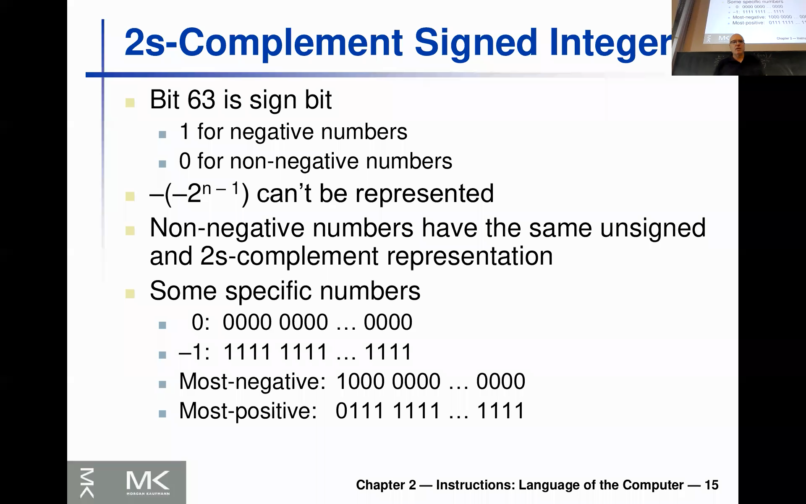
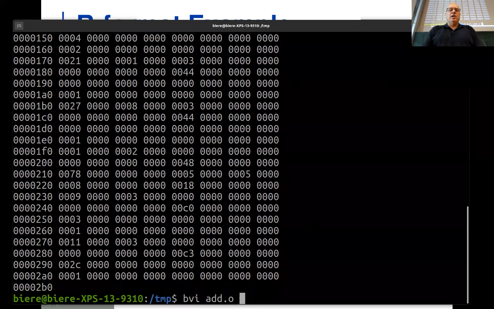
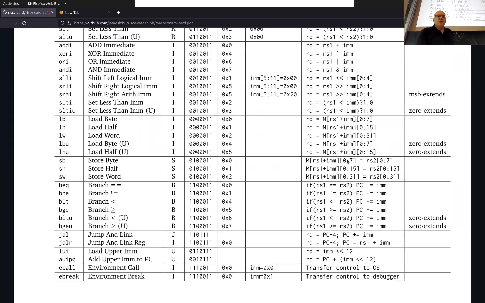
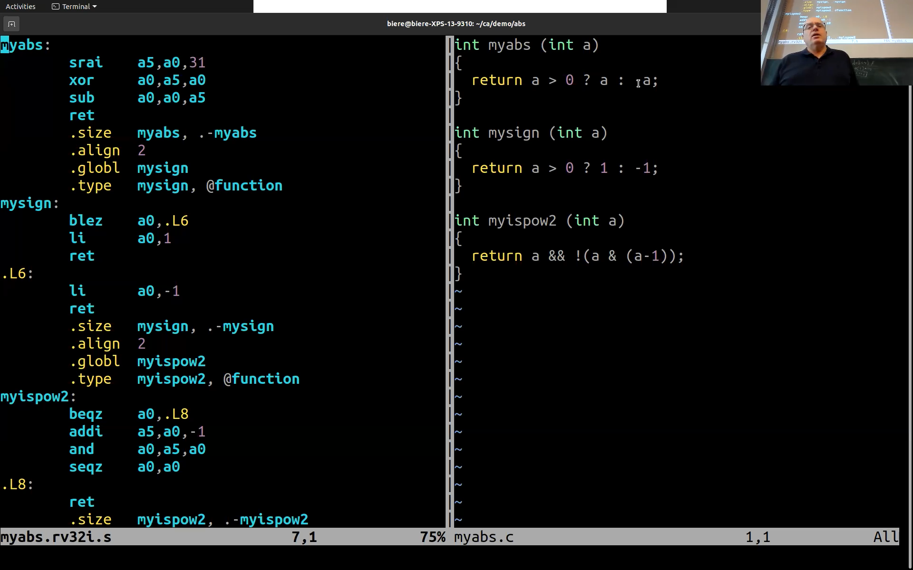
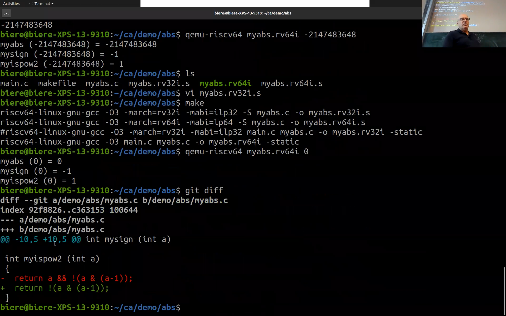
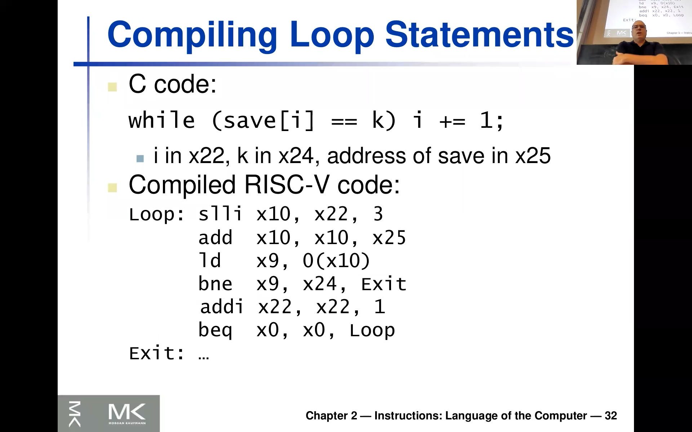

<!-- /home/areo/Videos/Rechnerarchitektur/Computer-Architecture-Chapter-2-2022-11-03-slide-12-to-32.mp4 -->
<!-- /home/areo/Videos/Rechnerarchitektur/_Computer-Architecture-Chapter-2-2022-11-03-slide-12-to-32_imgs -->
<!-- /home/areo/.config/mpv/mpv.conf -->
[toc]
# ==============0:00:00==============
<!-- - `0:00:01`: gatwick streaming yes and i'm going to share the scream. -->
<!-- - `0:00:18`: i guess i'll say i was explaining this emitted instruction here and the. -->
- 
<!-- - `0:00:25`: i. -->
<!-- - `0:00:27`: ill admit admitted just once more that my audio is working. -->
<!-- - `0:00:35`: and. -->
<!-- - `0:00:38`: she knew a contest without stopping sharing and want to stop sharing okay let's little this is working and. -->
<!-- - `0:00:48`: so he never knew where the marines than the wire. -->
<!-- - `0:00:58`: i is less than men. -->
<!-- - `0:01:01`: a then may he member eight mile. -->
<!-- - `0:01:06`: he loves zillow and environments something. -->
<!-- - `0:01:15`: and serve. -->
<!-- - `0:01:20`: reverend a luminous expressions that made it actually separate one would would pour respond to this i add to this this add instruction and the point here is and this is white white says thier he wants to make the the common case fast. -->
- 
- `0:01:37`: and this this vehicle idea to one assemblies rock favorites as you want to have like four bytes only encoding this ring and so that also means you see in this instruction you would still need to sort of put the **five bits for this a destination register** you need to put **five bits**.
- `0:01:57`: **for the source register** and then you see they're not like **thirty two bits left for this immediate** and you **also need to encode the opcode** so actually what's going to happen is that **we're only going to have only like to ert actually twelve bits** here are available for this immediate.
<!-- - `0:02:16`: arms at all speeds raid and to fit into this thirty two bit but you see it's very common year hitting about like this erase not engage or so years notice and imagery but it's something which has bigger elements. -->
<!-- - `0:02:31`: you could still like use these these twenty bids rail cars or it is twelve bids. -->
<!-- - `0:02:37`: and. -->
<!-- - `0:02:39`: and. -->
- `0:02:42`: and it's happened so often that sort of this was the design decision to have immediate split half the **immediates in this risk five only have like a smaller number** right not like like the full thirty two or sixty four bit.
<!-- - `0:02:57`: and this is akin to commonplace and in uncommon cases would be to for instance to to load into a register a thirty two bit value and we're going to see that the business then an additional instructions you need actually to instruction to loaders a full thirty two bit value into registry. -->
<!-- - `0:03:16`: okay but now the interesting thing is that this this immediate here is twelve bits as you're going to see later so you can remember this for analysis just not the fault you will see later why's twelve and that is just not the full thirty two bits which you need to include like the four bytes for for this instruction sorts. -->
- `0:03:33`: something less and then **in addition you also want to have negative numbers like two's complement** and and that's why we need to good to go back and look at it to complement and so on.
- 
<!-- - `0:03:48`: rachel everybody should know that right so so you have this unsigned binary integers and they're encoded like this so if you'll see like up and down here at such a bits of vector here and then you just encoded like a from the at least significant bit to the most significant bit and. -->
<!-- - `0:04:07`: and. -->
<!-- - `0:04:09`: are down here you see the the largest constance which can be represented so he has a sixty four won bids you do one plus two plus four plus eight plus and so on until two to the power sixty three and this this gives this number. -->
<!-- - `0:04:29`: and that's maybe. -->
<!-- - `0:04:32`: i am. -->
<!-- - `0:04:34`: it's awesome explanation and think by writing he has seen growth in mulan. -->
<!-- - `0:04:44`: remember the distance the same was so there was one. -->
<!-- - `0:04:51`: i agree with the other law. -->
- 
<!-- - `0:04:59`: and and so that's why the biggest numbers assisted have like a one power larger than than the number of pits you have minus one. -->
# ==============0:05:00==============
<!-- - `0:05:08`: and if you can't remember this big numbers so old i'll show you a small trick to do this or so and so we just used python here because it can print us the likes for instance this number here's sixty four minus one. -->
<!-- - `0:05:28`: right so that's the one which is on the sly. -->
<!-- - `0:05:33`: and if you want to do a thirty two bit machine you would need to do like this and that i actually remember by heart so distrustful billion the one above is likely to be remembered but this is just four billion looming more than four billion just for you to remember it for begins. -->
<!-- - `0:05:54`: right so it's four with nine after the numbers after drain. -->
<!-- - `0:06:01`: and. -->
- `0:06:03`: okay so these are the two cases for unsigned binary teachers and and er i assume most of you are familiar with java array **in java there are no unsigned integers there only two complement integers**.
- 
<!-- - `0:06:17`: and this is going to be on the next slide so so so he also remembered that right i hope nobody has never seen this before. -->
<!-- - `0:06:27`: has ever seat and has never seen these before any also like these are assigned integers are like defined or slightly differently that the most significant number there is the sign bits are we going to talk about this a little bit more so that's why i want to repeat that. -->
- 
<!-- - `0:06:45`: okay and right so you see here already led you need to. -->
<!-- - `0:06:52`: you see there's like not two to the power in like likely on the blackboard still but in minus one so it's sort of not maximum number of positive numbers almost goes down because of two and four aggregate like as many negative numbers okay so you kind of cut this big two to the power. -->
<!-- - `0:07:11`: returns a minus one into two halves one negative and one positive. -->
<!-- - `0:07:17`: there's an interesting corner case which we're going to discuss a little bit more here in the lecture and and so is saddam he was he distributed between various versions so i'm not going to do this now with the python code i just your grater can be exactly the same way. -->
<!-- - `0:07:33`: am. -->
<!-- - `0:07:36`: and the or there's a typo this should be severed clear cut interesting i saw no no sir he is not the maximum value maybe i should should should show you the sacrifice and cook so so it's like n minus one so thirty one right so this is the biggest number down in nc. -->
<!-- - `0:07:55`: scientists are thirty two bit it's just two billion in in c and this is called into marks. -->
<!-- - `0:08:05`: but it's just this constant and you can think of it is a zero followed by only once this is the biggest positive number. -->
- 
<!-- - `0:08:15`: and what's the. -->
<!-- - `0:08:18`: naked most negative a number ray. -->
<!-- - `0:08:24`: while this is wrong as he going to see an accident in two min here is light has a slightly larger absolute value so this is interning so this this is the number which has all once raped so the sign is one in the rest of the nozzle. -->
<!-- - `0:08:42`: and and this he says in absolute terms like one more rate if you take the absolute value of his one would get like like a even though rare. -->
- 
- `0:08:53`: **now question what do you get if you negate this number** into compliment.
<!-- - `0:09:04`: right so they can write a program like in java you can can for instance or python whatever can can write like or as equal to that number and then you say b is minus this number what the speed and. -->
<!-- - `0:09:19`: egli turns out this is a rare overflow it actually is the same number of games a minus of this number in computer architecture is kind of again the same number. -->
<!-- - `0:09:31`: so this is a strange overflow right to take the negative number you take a minus of it and you get back a negative number which is of course correct. -->
<!-- - `0:09:42`: anyhow so i just went to you too i hope most of you have seen at least this material maybe not this specific as the asians i have down here you see the the the the biggest sixty four bit version so that's the same here rates of sixty four bit you do sixty three so right not in but in minus one because we. -->
# ==============0:10:00==============
<!-- - `0:10:03`: that's the negative one it's even rate in the absolute value for the positive one is one less. -->
- 
<!-- - `0:10:15`: okay. -->
<!-- - `0:10:18`: so i hope you all remember that that's kind of an important your face for several reasons but it will be like the year we will we discussed this one. -->
<!-- - `0:10:31`: okay and writes so here again it says the same thing if you have a sixty four bit number then bids to sixty three so you'd start counting at zero bit zero two p sixty three or sixty four bits and it sixty three is the sign bit and it's. -->
<!-- - `0:10:49`: negative for negative numbers and zero four for non-negative numbers are also four zero so that way doesn't say positive number right or zero zero. -->
- `0:10:58`: and i would i just explained you see this was my question or **minus of minus two to the power n minus 1 can't be represented by the program that you rly usually get back** mine **the same number again**.
- 
<!-- - `0:11:12`: and it will actually later see white white as is the case because it actually simplifies harker you just take so if you implement the common case and you stick in this number which has get back actually the number again. -->
<!-- - `0:11:26`: okay and then we have zero or this was an am sorry not yet that i i said it wrong the most negative one is of course this one with with all zeros and just wanted the beginning so this is just minus one re this zero this is minus one. -->
<!-- - `0:11:43`: and the. -->
<!-- - `0:11:46`: yeah one way to remember that this one one one is all is just minus one while you're at one what do you get like if it just as the the the number one which is usual one right while you get a zero and all floor so you take a carry and you to get again one plus one game zero one plus one guest series of these carry trickles. -->
<!-- - `0:12:05`: oolong and kansas all this once to zero and then at the end there will be a carry out like the very last one and it will be forgotten forgotten so you get actually if you add one to this one one one one one you get like zero so that's why this is minus one. -->
<!-- - `0:12:23`: okay yeah and i as i mentioned saw this most negative is usually caught in two minutes i didn't say this before intimating eden to underscore mean in the most positive is in tmux as i wrote there in in the terminal. -->
<!-- - `0:12:44`: alright i hope there's no questions because they should all be known and then you'll also know how to code how to compute these guys but this is not the focus of his lecture so i'll not talk about this is about like the circuit out to implementation. -->
- 
<!-- - `0:13:01`: negation re. -->
<!-- - `0:13:05`: so these things you might you might have seen them as well and at least if you've been to the digital design course you have seen it so this assign extension that's really important to let let's let's talk about this once more and and the reason why we need that is because they often have to. -->
- 
<!-- - `0:13:23`: to talk about sort of a smaller data up and like beta giving in bytes or cape favorite data given in in half words which is sixteen bytes sixteen bits two bytes or in in words which is from thirty two bit so four bytes and then of course like. -->
<!-- - `0:13:43`: some people call it double words or quotes in into like a sixty four bit so so eight cf like something smaller like say one bite and you want to work with it with your registers which have thirty two bit rate. -->
<!-- - `0:13:57`: and so you need to kind of extent this eight bits to thirty two bits. -->
<!-- - `0:14:02`: and there are two ways of doing this so he used the extension from eight to sixteen bit but those thirty two and sixty four to say well if you're given hear this sir a bite here on the right with his blue zero here to sign it then you can. -->
<!-- - `0:14:19`: and at just zero extensor you take off at all zeros as is the kind of common case but if you have to assign extension then you need to look at his bit into which has copied the spit actually sixteen times sorry not sixteen times eight times right so you take this bit here the most acute he can pick up a pie. -->
<!-- - `0:14:40`: and you copy it eight times. -->
<!-- - `0:14:44`: okay will you remember in the in the eighty there was even a circuit actually a bird doing this. -->
<!-- - `0:14:52`: and the reason we want to do this is and i'll show you some more example that's actually something if you go down to the low level of programming and are so in it's exactly something you really have to care about it isn't. -->
# ==============0:15:00==============
<!-- - `0:15:05`: because this bite here that could be for instance interpreted as soon as assigned by an unsigned byte again in in java there or the sign new miracles but like in c this is sexually and not the case and that's why we have to distinguish that. -->
<!-- - `0:15:24`: and if you then want to work with his spite but you don't know what ended it was signed then you need to assign extension in order to work with this. -->
<!-- - `0:15:33`: if from you assumed the bite is unsigned or so it ranges from zero to two hundred fifty six or sorry from zero to two hundred fifty five. -->
<!-- - `0:15:45`: then it's duke just put zeros in front of it but if you think it's assigned by two age ranges from minor minus hundred twenty eight to plus hundred twenty seven right then and you want to work with it with with sixteen bit then you need to sort of relate to this sign extension hearing copy that sign bit eight times. -->
<!-- - `0:16:06`: and this distinction here corresponds to an explicit assembly instruction so you can load the bite engine than you would without any sort of suffix here it would implicitly mean sign extended loaded bytes it would exactly to what we do too here so we looked at. -->
<!-- - `0:16:25`: the most significant bit of the bite and extended or and we can explicitly tell the processor know we're going to two zero extension of respite so we load a byte from memory like from a string a single eight bit character but when we load it will we're going to look with we don't look at the sign could just fill the rest of the of. -->
<!-- - `0:16:45`: the sir of the the register the other like a twenty four bits just by zero there will be this a lot bind and science. -->
<!-- - `0:16:55`: okay i hope this is cleared especially for him. -->
<!-- - `0:17:05`: or will we that we don't have a complete an example here so but like you can either load from memory or you can load from from an immediate rate so that's in in both cases you would have that actually. -->
<!-- - `0:17:20`: like the difference between signed and unsigned. -->
<!-- - `0:17:25`: and. -->
<!-- - `0:17:28`: okay so what will i think like we'll see some more examples where this happens and and. -->
- 
<!-- - `0:17:36`: okay and the cern now we're moving from. -->
- `0:17:44`: and symbolic assembler so english is newly said **symbolic assembler to machine code** so a kind of are already hinted at it so so so what we saw before like this at here ray.
<!-- - `0:17:58`: that's a kind of a symbolic assembler i am actually in the examples are going to look at it's really like text like this but of course at the end the machine reads release thirty two bit like il a bit vector of length thirty two bit and it's zeroes and ones. -->
- 
<!-- - `0:18:19`: and that air then is called machine code break because it's like a really sort of the four explicit bytes which this instruction am in codes. -->
<!-- - `0:18:31`: and and. -->
<!-- - `0:18:34`: and that will be going to look at. -->
<!-- - `0:18:39`: also today. -->
<!-- - `0:18:42`: and. -->
<!-- - `0:18:44`: okay in one important design decision this was not explicit in the digital design course but it's like more pronounced the discourse. -->
- `0:18:57`: so **the choice how you encode this symbolic instructions into sort of bit vectors**, this is a design choice and it has certain principles and the most important principle is kind of tool to **choose the encoding in such a way that**.
- 
- `0:19:18`: **the decoding and in turning this machine cord into something which can execute is fast** so **you don't need lots of hardware and also did the depth of the hardware is is smaller so that means fast**.
- `0:19:35`: and for that one **design principle here is regularity** and the also said already like and like this **make this common case fast that's another one** but **regularity helps to to to achieve a is simply and avoid in particular k splits?**.
<!-- - `0:19:53`: gets him everything and we see this in a couple of of situation. -->
<!-- - `0:19:59`: and in order to get to this machine code will be need to understand hexadecimal but i also assume everybody has seen this suggests to the lake or maybe for you to recall and each takes a hit as the reason why why why do we actually use a hexadecimal number swelled a nice thing. -->
# ==============0:20:00==============
- `0:20:19`: b each each digit in hexadecimal has four bits sometimes also quite a number so let's y to add **two hexadecimal numbers just form a byte** and therefore you can easily kind of map here this eight.
- `0:20:37`: i eight hicks at the statesman or eight digit hexadecimal number to the sir eight times for thirty two bit number right lake or so he can also think of yet so **this eight and two digits form one byte this is four bytes and that why four bytes**.
- `0:20:57`: **are thirty two bit**.
<!-- - `0:20:59`: okay so this is something you should get used to i hope all you already used to that said if you can translate easily been in. -->
- `0:21:08`: and his hexadecimal numbers and these are binary numbers for decimal numbers it's more tricky because it a actually **in order to encode such a decimal number into such a thirty two bit string** you actually need to divide by ten take the rest this is your last digits okay.
<!-- - `0:21:28`: and then divide by ten against the actually neat division or greater. -->
<!-- - `0:21:33`: and it's actually not the trudell equity implement even so he really needed the divider and and that's why hexadecimal is way more used sort of an in-law little brooklyn was there's the kind of easy according rights that lakeland is enabled by nibble rates at every these four bits can be met. -->
<!-- - `0:21:53`: and to the ditches here. -->
<!-- - `0:21:57`: iron and now with this with what you have probably all seen let's let's have a look at adam such sort of a design of this machine called. -->
- `0:22:10`: so this encoding and so they're like an innocence **four different formats** so this is all much simpler than in other or assembler.
<!-- - `0:22:21`: and. -->
<!-- - `0:22:23`: a starter set architectures and. -->
- `0:22:27`: as the old like thirty two bit these instructions and the form are the default fallen four categories and this is sort of the the the simplest one which we which we are going to also see on the next slide and i'll also show a demo for that one this is the **r format so that's mainly used for like**.
- `0:22:47`: **for register plus register gives result** again this is why you need like five pits for the.
<!-- - `0:22:56`: destination register you need five bits for the two. -->
<!-- - `0:23:02`: source rochester saw s means source and d means sir destination so this is where you take the values from his source and then you do some operation and then you put it into this destination and then the operation you doing this is included here in the seven bits so in essence that would give us. -->
<!-- - `0:23:22`: hundred twenty seven different. -->
<!-- - `0:23:26`: as statements but there's lake sam and sup. -->
<!-- - `0:23:32`: categories as well so sometimes you kind of cluster this assembly instruction by by this accord and then you take variances which are dysfunctions and are actually not all of them are used currently so there's even free space sort of indecision calling so the encoding is not like complete. -->
<!-- - `0:23:51`: and. -->
<!-- - `0:23:52`: and and you will later see why it's so complicated as strange you will get a feeling i hope or that widest is sort of split here you see it would would look what way more natural it seems that you want to have these funky may be together and maybe even you see like the seven pit policies tend it's just you're at the right. -->
<!-- - `0:24:13`: and. -->
<!-- - `0:24:15`: and tim. -->
<!-- - `0:24:18`: but for now let's just an egg and accept that said if there's leg is maine according to his status or sap functions which are split over the bit the bits are actually split into two parts and then the three registers are involved in in in doing this and. -->
<!-- - `0:24:38`: i think here we have an example and all buddhists also in the demo. -->
<!-- - `0:24:46`: alright so here do you see the most common and in a little upstart. -->
<!-- - `0:24:55`: the muslim one so this is for ad and his attitude determines here are the seventh industry does fifty one in december. -->
# ==============0:25:00==============
<!-- - `0:25:04`: so this additional numbers as you can see and are then these set of registers year in and year and it's actually good that we actually use this x variant and not this other variant which which is in that table so all i'll show you. -->
<!-- - `0:25:25`: and where do i have it you know this one. -->
<!-- - `0:25:29`: no i thought i'd opened it. -->
<!-- - `0:25:35`: no. -->
<!-- - `0:25:46`: on the wrong one birth from scoring. -->
<!-- - `0:25:54`: sorry on the two at thought i downloaded it so that must great. -->
<!-- - `0:25:59`: again. -->
<!-- - `0:26:02`: so this a nice a public reference crime in the book also has a reference card but that one has a copyright so i don't want to put it into our ears cloud but you can get it from the companion site but i don't want to put the companion material directly in our cloud and and. -->
<!-- - `0:26:21`: and there's this sir. -->
<!-- - `0:26:23`: where is clive reference credit which do. -->
<!-- - `0:26:27`: if i thought i've put already on the next cloud but it probably forgot to upload and this one has the same as this cream thing which is in the book and the amp is free so it's called free reference court and. -->
- 
- `0:26:43`: yan and we'll go through this in the lecture a couple of times and it's like from two thousand and eighteen but it didn't change martin also has sir two parts which is the other one does not have first of all the pseudo instruction which i mentioned already so this means lake though for instance you see here this is **pseudo instructions** re.
- 
- `0:27:03`: for return which **assembler will translate into two real instructions** but the assembler would know that the assembler would know a ret is translated into to machine instruction likened to two thirty two bit words.
<!-- - `0:27:20`: but the reason i am showing this now was was again this page just to give you one. -->
<!-- - `0:27:25`: back right so we have this former register names to treacherous this exist and are going to be actually talking point i think i'm not sure like which chapters but the later chapter we're talking about drilling points so this rd or architectural state registers and they have different meanings which is sir defined by kenan. -->
<!-- - `0:27:45`: we're back here and there's also some convention who is responsible for restoring or saving them but we'll talk about this later and am but what i want to point out is are these guys here the second column here at they are related also to this application binary interface a the i a. -->
<!-- - `0:28:05`: end. -->
- `0:28:06`: they're easier to kind of program with or associate with if you do pro low level assembler programming you it's better to use these guys am however these guys here on the left to which they correspond to see they have **in the name encoded already the index of the register** it like.
<!-- - `0:28:27`: and that's why on this light. -->
<!-- - `0:28:31`: we're discussing it's better actually to use these x variants but now we could go back to the table and really see what what these are rights i think a twenty that a x twenty is is something which needs to be saved in x x ninety spoke so this such as oracle registers and why is it better here. -->
<!-- - `0:28:52`: well because these numbers each will just see in the in in the machine and right so here this is nine this was the destination be doing x twenty plus x twenty one is saved in in register x nine. -->
<!-- - `0:29:06`: and these two registers are are are here so rs one is this one does is twenty is the left operand right so this is for addition and not important for floating point addition it's important but not for integer addition but for subtraction is of course important which one is the left one right in which. -->
<!-- - `0:29:26`: one is the right one. -->
<!-- - `0:29:28`: okay and indian coding is clear right so you just put your listening lander and you need to encode it you in five pits rates are just such shake that you see it's easier not to this nine year dissimilar is er this fight pits right. -->
<!-- - `0:29:45`: okay now i'm down here you see now the eight digit hexadecimal number for that right. -->
<!-- - `0:29:55`: and i'll show you now how you actually would be able to do this yourself which also gives you a flavor of course like we don't expect you from two this manually so cb might want to one exercise where we do it manually and also in the exam there might be questions like it potentially gives you of course like all all the other you don't need to like. -->
# ==============0:30:00==============
<!-- - `0:30:14`: anything by heart so too will give you all the encodings of course and you could look up this in am not sure if this guy has has it. -->
<!-- - `0:30:26`: i think he doesn't have the machine code does it no. -->
<!-- - `0:30:31`: ah yes it has it rates so here's the machine code and then. -->
<!-- - `0:30:37`: and of course you could do it so here's the awkward ford for the air forty and at earth i wanted to check the years the ad codebases this one right zero one one zero zero one one jet should be the same guess so it's the same as you see here on the right right. -->
<!-- - `0:30:55`: eric. -->
<!-- - `0:30:57`: and of course lake we don't expect you to to longest behind there's no point in doing this and. -->
<!-- - `0:31:06`: right and then you can abc concatenate these individually bit fields and you get like one bit better end of thirty two bits and this corresponds to this eight digit hex of the similar number. -->
<!-- - `0:31:20`: okay not now let me do or show you how you would them. -->
<!-- - `0:31:25`: am actually to do this so we commit to them. -->
<!-- - `0:31:31`: as a c programmer he put something for a function and then i think it was x nine and x twenty one x twenty right though the opposite. -->
<!-- - `0:31:44`: this is now a trivial assemble program ranked. -->
- 
- `0:31:48`: in the am we can now compile this service if you have installed this **cross compiler here** and i am only compiling object file so i'll turn this.
- `0:32:04`: so what i'm not doing is in essence **calling the assembler** are also puts birches called assembler for directly but this is the simpler way so if the gcc compiler gets this argument in assembler file the only thing it would do would generate a **link it unless you put this minus c** so this may.
- `0:32:23`: and as **minus c says only produce an object file** you see what's going to happen now or this object file was generated this is generated from that and in this object file we can.
<!-- - `0:32:38`: or actually look at this with a binary editor or let's do hex dump. -->
<!-- - `0:32:44`: then so this is just like this bites ray. -->
- 
<!-- - `0:32:50`: this is the object file for this one assembly instructions their stuff in it which if you do this with the look at it with another or a binary hex editor where you'll see there's like other stuff on the right you see sort of asking 'em encoding just like a symbol table it says something about the formats it's. -->
- 
- `0:33:10`: magic header and this **magic header** is for instance used **handy for this file command**.
<!-- - `0:33:16`: am. -->
- `0:33:18`: play is file or command which use mysql you can use is very handy here on an ubuntu or linux which gives you sort of like **what's the understanding of the operating system of of what that file actually is** and because we used used the risk five compiler right even though it isn't x eighty six laptop you see.
<!-- - `0:33:38`: this is not an x eighty six object file this is an is a risk five object file. -->
<!-- - `0:33:45`: and and the reason i'm showing you that you this now is because m. -->
<!-- - `0:33:53`: let's do this sir. -->
<!-- - `0:33:58`: we tried to find now in this sir machine code a this and a string here. -->
<!-- - `0:34:07`: in one way of doing this would be to really search for the string but then we would need to know it right so one way of doing this would be to search for b three here and indeed says you look carefully here there's b three zero four five eight zero one. -->
<!-- - `0:34:24`: right why is it the other way around any idea. -->
- `0:34:28`: is it was b three zero four five eight zero one and sled goes from here **from right to left...**.
- 
- 
<!-- - `0:34:36`: well because this is year. -->
- `0:34:40`: yeah **so this little endian architecture remember little endian stores always the least significant byte first** next and the next michigan pipe.
<!-- - `0:34:50`: okay so this really occurs here it says that it doesn't tell us much writer their stuff around it and the stuff around it's not very hard to decode this this is what like the linker would do and we don't do this now or so what i do instead is there's also and this you need to also do from cross compilation there's a tool which is called opts. -->
# ==============0:35:00==============
- `0:35:10`: kick them so it takes such an object file me to say it you want to **disassemble it**.
<!-- - `0:35:17`: and. -->
<!-- - `0:35:20`: you see and then you only get that part which was part of our of our symbol source fine. -->
<!-- - `0:35:26`: i see clear so we took the the regenerated with our editor a simple assembler program which just had this ad then we use the assembler to generate machine code put up and the it was written here to this object file at all and now we can go back and decode. -->
- 
<!-- - `0:35:46`: this adds that all and yes indeed ah we see this encoding which is also on the slide and in principle you could do too despite his card i showed you right you could read step by step yourself. -->
<!-- - `0:36:01`: and will do maybe one exercise what with this one so huge like a lie betray you just need to concatenate the the bits but em as we going to see later there's lake and in particular this upper loading upper immediate is a bit tricky and term that something one one might want to do an exercise on. -->
<!-- - `0:36:20`: okay that is the question about what i did so because it's okay everybody's clear grip. -->
- `0:36:29`: so now the **second format it's the immediate format** and i want to jump back and forth do you see what's changing bob sorry.
<!-- - `0:36:43`: you're here. -->
- `0:36:47`: rights are **only those first two fields are merged** tray.
<!-- - `0:36:52`: clear ok am so am. -->
<!-- - `0:36:57`: so what's an immediate or. -->
<!-- - `0:37:03`: well in immediate just loads at a constant end or. -->
<!-- - `0:37:09`: am. -->
<!-- - `0:37:10`: as i said like herbs so i said would know so it would use an edge but with a constant end term. -->
<!-- - `0:37:19`: am and this constant is then also encoded in the instruction is so great likeness to this plus one year translates into a four greater but if you want to put four in it you could take these twelve pits here and put a foreigner and then implicitly one of the two operands there. -->
- `0:37:40`: and is not artists too but it's like is constant so the **second argument of the operator gets this constant**.
<!-- - `0:37:52`: ok but the rest is the same end end and yet and and again this is very useful because often you need to lord sort of small constance and the and that therefore this is a good design decision so we saw now the r format right. -->
<!-- - `0:38:12`: ye i format for immediate. -->
<!-- - `0:38:15`: but there's like one and. -->
<!-- - `0:38:18`: one important thing i already been mentioned here and that's obviously important when we talk about immediate so for those of you who went through the digidesign purse maybe you remember was in the eighty there was quite some discussion on one of these numbers which are like this coincidence which are part of the assembly instruction how the i intern. -->
<!-- - `0:38:38`: pirated. -->
<!-- - `0:38:40`: and you see it here is a sub sub bullet cyclic pretty hidden this immediate is assigned integer array. -->
<!-- - `0:38:51`: and why do you want to do this well because you also want to lord small negative numbers like minus two or minus one right if you go from the end of a raid maybe you want to subtract minus four instead of plus four. -->
<!-- - `0:39:05`: and enter okay so so. -->
<!-- - `0:39:10`: in essence there's only like eleven bits which are the real value in one sign bit but you see it's a little bit odd as we discussed before like and just for you to earn to think about what's the range of this thing. -->
<!-- - `0:39:22`: can you do this in your head. -->
<!-- - `0:39:25`: what's the range of twelve bits signed integers. -->
<!-- - `0:39:31`: so if it would be a unsigned bread it would be to to the power twelve which is to the power ten times force of four kilo right leg four thousand and ninety six x from zero to four thousand ninety five would be unsigned. -->
<!-- - `0:39:47`: but it's not unsigned is signed so actually we are only going from from a from zero to two thousand earth of forty seven right. -->
<!-- - `0:39:56`: positive end for two thousand forty eight negative. -->
# ==============0:40:00==============
- `0:40:02`: break **so twelve bit signed**.
- `0:40:08`: **is in the range from thousand twenty four**.
- `0:40:12`: **negative to two thousand fourty seven**.
- 
<!-- - `0:40:16`: then was. -->
<!-- - `0:40:21`: hey. -->
<!-- - `0:40:25`: so this is kind of the constants which we can kind of directly put into the instructions in to do. -->
<!-- - `0:40:33`: it's a good compromise. -->
<!-- - `0:40:38`: i. -->
- 
<!-- - `0:40:40`: okay end and. -->
<!-- - `0:40:43`: before the store instructions it's almost the same okay so you also have the tool. -->
<!-- - `0:40:51`: registers here but they're both source registers and them. -->
<!-- - `0:40:59`: at n one is the. -->
<!-- - `0:41:03`: next flight nights not here. -->
<!-- - `0:41:07`: maybe i should should i should explain this would be awkward to have it on them. -->
<!-- - `0:41:12`: i. -->
<!-- - `0:41:19`: yea it's not that easy to to explain but if you do like. -->
- 
<!-- - `0:41:24`: do this store here and then we'll going to use them and this as the source of restoring the the second. -->
<!-- - `0:41:37`: source register okay. -->
<!-- - `0:41:41`: and we put that into memory at indirectly at the address which is in rs one stuart plus an offset in and this offset. -->
<!-- - `0:41:54`: is. -->
<!-- - `0:41:57`: isn't this a design decision because of that. -->
<!-- - `0:42:00`: in the sands. -->
<!-- - `0:42:05`: if you'll remember. -->
<!-- - `0:42:08`: you have spot the white as the america. -->
<!-- - `0:42:15`: in java two. -->
<!-- - `0:42:19`: a class or record was the one deterrent for that and you would have seen her in a he. -->
<!-- - `0:42:29`: he. -->
<!-- - `0:42:32`: in the scene. -->
<!-- - `0:42:36`: now that the actress on offer an object of that type for instance m s star laura nice as spray. -->
<!-- - `0:42:47`: and you wonder obsess as the right either writing or the authority. -->
<!-- - `0:42:54`: how would you do that well you need to have the address of s. -->
<!-- - `0:42:59`: this advisory was sent by foreigners to buy a. -->
<!-- - `0:43:05`: see every actress your s. -->
- `0:43:08`: and you put this into the register as the iris one and then because it wanted to be you put as he needed for because he wanted to **write with a offset of four on the starting position here**.
<!-- - `0:43:24`: and then. -->
- 
<!-- - `0:43:28`: this is why distort an instruction here. -->
<!-- - `0:43:32`: has an immediate typically. -->
<!-- - `0:43:39`: it could be zero but and this image is used to edit can be added to the address which you started or artist one and there is where you write the. -->
<!-- - `0:43:50`: ours too. -->
<!-- - `0:43:52`: register. -->
- `0:43:57`: okay now you might **wonder why it's so strange** you see it **looks almost like this one**. **why did you not**.
- 
- 
- `0:44:05`: **merge this** and and the **reason for that...** is because.
- `0:44:11`: the heart of a to work really like if you think **in terms of data flow we work with to these two registers reading from them** right.
- `0:44:21`: and and that's the **same as for this r instruction** here so you have **these two registers rs two and rs one you need to read from them** and do some computations and **then the hardware is much simpler if you just can start reading even without knowing what the opcode is and if you don't need for instance this value of rs two**.
- `0:44:41`: **you just ignore it later**.
<!-- - `0:44:43`: and and so the advantage here is that. -->
- `0:44:49`: you **can always start off as kind of reading from from these two registers in the hardware and then only later if for instance you would have like such discover that this opcode here is actually a immediate then just ignore what we read here for rs two** hours to.
# ==============0:45:00==============
<!-- - `0:45:07`: so this speeds up again the the the execution and simplifies the hardware but it makes the the work for the assembler a little bit more difficult right the assembler needs to take the symbolic assembler and translated into machine code and now it has two cases rates it has this immediate thing with trough. -->
<!-- - `0:45:27`: fit in it. -->
<!-- - `0:45:29`: and yes woman also was twelve he did why why don't we do it the same way ray and the reason is simply because the hardware is better or faster to the of the easier less complex and faster to implement if we kind of flip it. -->
<!-- - `0:45:44`: and we'll see this later again for the chumps the same. -->
<!-- - `0:45:49`: kind of the argument. -->
<!-- - `0:45:56`: alright now. -->
<!-- - `0:45:59`: we are going to talk about this extension again end of bites and half words two words cetera and that's what did the motivation for that is is of course you need to have different data in your in your memory so this is all kind of the data which is in memory so liquor program called. -->
<!-- - `0:46:19`: write machine code and this could be even different ones but it could be data in a database or it could be text or source code grade in all the data needs to be sort of handled differently of course you know how machine code is handled rate is is executed by the processor but like. -->
<!-- - `0:46:39`: i. -->
<!-- - `0:46:40`: then you write for instance the c code as the machine called by the chant by them by the compiler then of course it will also be almost manipulated as data so like data in memory has different rules and it has a bite fuel when it has a word few and. -->
- 
<!-- - `0:47:00`: and that's why we have them as additional them data operations. -->
- 
<!-- - `0:47:07`: okay so the the first one data operation we're going to look at a are these logical operations deck classically called logical i actually don't know why they're. -->
<!-- - `0:47:20`: and. -->
<!-- - `0:47:24`: also have a pseudonym which is called bitwise and this bitwise thing is an actually pretty cool allows some low level optimization which be going to discuss also little bit but in order to to be on the same page let's discuss their semantics. -->
<!-- - `0:47:42`: so so what's the. -->
<!-- - `0:47:45`: and what do we have here so late one is these shift operations and in certain contexts people also consider them as not as bitwise and only call those lower once your bitwise but like you could also lump them together you into this logical operations of bitwise operations and and shifting at is. -->
<!-- - `0:48:04`: and is clear writes like shifting a bit better you have a bit vector and you can shift to the left. -->
<!-- - `0:48:12`: this is the first one oil can shifted to the right this is the second one. -->
<!-- - `0:48:19`: and and. -->
<!-- - `0:48:23`: it's a a m. -->
<!-- - `0:48:27`: interesting that like here in java there's like a specific operator is also like. -->
<!-- - `0:48:34`: like only two this is no title or two right. -->
<!-- - `0:48:40`: larger than science and there will be arithmetic shift. -->
<!-- - `0:48:45`: and then i hope i met maybe i'll ask to everybody understands lake or either who does not understand the concept of arithmetic wretched arithmetic right shift but as logical wretched. -->
<!-- - `0:49:01`: no i thought so so there was a sign extension to discuss ready which will be all of you have seen before and they kind of extent in a small word to be cover it and then he depends on whether you have signed or unsigned theater and the same is for the opposite so he should take a a. -->
- `0:49:20`: big worried and **you want to sort of shift things to the right you either need to know whether it's signed data or unsigned data**.
- `0:49:31`: and **if it's signed data then you need to kind of maintain the sign bit** so **when you then shift to the right**.
- `0:49:40`: **you kind of shift the sign bit to the right**.
- `0:49:45`: **when you do logical shift like here then you're just shifting in zeros** okay.
<!-- - `0:49:55`: and then. -->
- `0:49:59`: and that's why you have to distinguish it in java there like a separate operator actually put it in **in c...** it's a bit tricky so in series then it cannot be seen.
# ==============0:00:00==============
<!-- - `0:50:10`: put it here. -->
<!-- - `0:50:20`: so. -->
<!-- - `0:50:25`: gladys expression year and it seeps in the shallow scene. -->
<!-- - `0:50:34`: so so what's this operator. -->
<!-- - `0:50:39`: whats its operation is of no arithmetic or logical shift right. -->
<!-- - `0:50:47`: is rather specific. -->
<!-- - `0:50:52`: it is not true so the answer is a different circuit. -->
- `0:50:58`: that **depends on what a is** should.
- `0:51:02`: **simply unsigned...**.
- `0:51:08`: **that is a logical shift**.
- `0:51:10`: **then you will fill in zeros on the left...**.
<!-- - `0:51:13`: because it's unsigned graded. -->
- 
<!-- - `0:51:16`: but if you decide so you just put in the mimic. -->
- `0:51:24`: and then then it's a **arithmetic shift** then you will actually put in like deciding to **copy the sign bit** like.
- 
<!-- - `0:51:35`: even in this case will actually worse. -->
<!-- - `0:51:45`: and. -->
<!-- - `0:51:47`: logic pushing right by just typing this he too unsightly. -->
<!-- - `0:51:52`: and then the compiler was alright so i'm doing this shit team. -->
<!-- - `0:51:57`: on an object which is unsigned the douglas is going to be loving. -->
<!-- - `0:52:03`: a logical one. -->
- 
<!-- - `0:52:08`: so so this is in the semantics of the language trait but of course in the the machine code is doesn't have types sewing machine in the microprocessor the thirty two bit or thirty two bit. -->
<!-- - `0:52:22`: and the compiler will make sure to use the right one writes it would take the c program with java program and and then look at it in and figure out where needed like a logical arithmetic one and then it would em put to take the write operation so you're we're going through this is the end of the year. -->
- `0:52:43`: this **this l here means that it's an unsigned shift and if it's an a then it's an arithmetic that means**.
- 
- `0:52:53`: **signed shift**.
<!-- - `0:52:58`: okay and this and this shift has. -->
<!-- - `0:53:05`: the shift emitted here has. -->
<!-- - `0:53:09`: i. -->
<!-- - `0:53:11`: logical lift logical shift logic left immediate just a kind of multiplies by by two to the power of ai and if you shift right logical you fill in zeros and you're shifted and two and ended it it corresponds to dividing by two the power of pi. -->
- `0:53:30`: okay and **that's the immediate version and there is also a register version which would then have**.
- 
- 
- `0:53:39`: **the form of the r format**. --
<!-- - `0:53:42`: and i hope you all know like what twice and and so on is if not i'll show you these three lights were two slights three i don't go one is the end they're three breaks and is just like if you take this thirty two bit and then write these three registers like for instance they could be. -->
<!-- - `0:54:02`: here this register value in this register value sorry it's not thirty two it's sixty four. -->
<!-- - `0:54:09`: brighton sixty four ip and bam. -->
<!-- - `0:54:13`: of the sixty four bit here for because we switched into sixty four risk five then you should do it bitwise you take like this bit into add them together and then this is the result and then there's only one year a distant positions because both of them here were one and all the others at least one was zero so that's why the rest is zero that bitwise eight. -->
<!-- - `0:54:34`: and and and. -->
<!-- - `0:54:37`: you see some people call this bitwise as a bit parallel this is also another synonym and you can really see what's happening she you do this complication you see sixty four bit in parallel and and you can also see what the hotter would really do it would really do this imperial. -->
<!-- - `0:54:53`: this is the or which you have seen before it's just the bitwise orc and here's the bitwise explore so here for instance is the example i have a register sixty four bit and it has some bits here set end and then i do just flip them by just taking the old one bit. -->
# ==============0:55:00==============
- 
- 
<!-- - `0:55:13`: victor and xsara can get it with the the the this extend registers and that gives mr then all the bits flipped from up here of course you could do this also with in the source code and i can see you do this with the bitwise negation. -->
<!-- - `0:55:34`: arcade. -->
<!-- - `0:55:37`: so this is bitwise and shifting and now we would come to do. -->
<!-- - `0:55:45`: and a and sheen. -->
- 
<!-- - `0:55:49`: but before i think i can do the demon with the apps so i tried tried doing that one. -->
<!-- - `0:55:57`: so this. -->
<!-- - `0:56:00`: is also something where you can. -->
<!-- - `0:56:06`: so i uploaded this already to the next cloud but i do each year on my local copy and there's like this app steam or here. -->
<!-- - `0:56:15`: and want to walk you through this one. -->
<!-- - `0:56:18`: this has two purposes this. -->
<!-- - `0:56:22`: and this the muscles of one is again just to showing a assembler and also like some bit and twiddling tricks so we're going to look at that but the other of them maybe more important part is that i show you how to really sort of work with required on an on say such an ubuntu machine. -->
<!-- - `0:56:42`: and because yeah that's eaten most easy to install and and so i highly recommend trying this out and so the. -->
<!-- - `0:56:52`: so i have here two or two files and two source files and one is just a b. -->
- 
- `0:56:59`: you rid of 'em something from the command line and then you call it three functions on this mth teacher after like **encoding the string into a real integer** here thirty two bit and and then i compute three values as p and and print them he can see intention is that the first one is just computing me.
- 
<!-- - `0:57:18`: absolute value of the second one is computing assigned and the last one is checking whether the numbers is a power of two. -->
<!-- - `0:57:28`: and. -->
<!-- - `0:57:35`: the program itself is in c have you saw before how you could do this actually combine it with assembler but like like build this later again so this is not the point here so this is in my apps sprite solicitor or something which computes the absolute power. -->
- 
<!-- - `0:57:50`: all your rights are if the value is paused argument is positive then you return the value itself otherwise should negated. -->
<!-- - `0:57:57`: sign is almost the same except that it kind of normalizes to the a one and zero i saw one in minus one and yeah i i just i wanted to keep this from the same as here you might have one one could each actually also a tool not a is a zero right or something sorry. -->
<!-- - `0:58:17`: but i didn't do that great so this is kind of known just to simplify matters. -->
<!-- - `0:58:24`: yeah and the last one is a bit twiddling heck we're going to look at later. -->
<!-- - `0:58:28`: so just forgot ignore it for now other purpose here is to to have a function which tells you whether the i commend is a power of two. -->
<!-- - `0:58:39`: alright and now what does my compiler do while i prepared a small makefile and if you want to do this yourself do you need to em. -->
<!-- - `0:58:51`: am. -->
<!-- - `0:58:53`: throwing me to the window you need to do install this sir cross compiler here. -->
<!-- - `0:59:02`: and to this does not offers so this first two lines who can also with a good boil threat which is this web interface been looked at before it just need to put the of the right arguments then you would get the sir. -->
- 
<!-- - `0:59:15`: as opposed to what i doing here so i'm compiling only this file which has these three functions in it i am generating assembler that that's what this instruction says and i'll i'll i'll write it to a specific file and we're going to look at that one. -->
<!-- - `0:59:32`: that that we did already a couple of times so that's like one one thing we're going to do but sort of did maybe novel thing here is is this line here am **i'm actually really compiling here and with his cross compiler here to a binary here**. -->
- 
<!-- - `0:59:50`: and this sir. -->
<!-- - `0:59:52`: two a c files. -->
<!-- - `0:59:55`: and ah yes you need this cross compiler and then. -->
<!-- - `0:59:59`: this is a metric for which we need in order to to the forelegs that he compiled lists then we can we get a file which is called a my apps are the because it's the sixty four bit thing and you see it again with this file and command that it's really a sixty four bit executable so this would only row. -->
# ==============1:00:00==============
<!-- - `1:00:19`: run on a risk by a machine. -->
<!-- - `1:00:22`: however and i i do have them. -->
<!-- - `1:00:26`: and the risk five an emulator which is this cute emo which you can also install that also exists for other platforms such as for ubuntu and then i can run this binary here on my exceeds a x sixty four machine. -->
<!-- - `1:00:46`: we paid attention to his main program if you don't give it an argument would just use forty two s m s n value and yet of course the absolute value of forty two is forty two the sign bit a kind of of forty two is one and here it's not a power of two so let's try something else of it. -->
<!-- - `1:01:06`: can give here i commend years so this looks good rate. -->
<!-- - `1:01:10`: and if you do minus one. -->
<!-- - `1:01:13`: looks also good train. -->
<!-- - `1:01:17`: and let's try maybe some powers of two year power of two seems to be detected for it. -->
- 
<!-- - `1:01:26`: let's try awesome minus seven no it's not a power of two k. -->
<!-- - `1:01:34`: okay so this seems awkward now let's to the. -->
<!-- - `1:01:41`: the the the. -->
<!-- - `1:01:47`: sorry. -->
<!-- - `1:01:49`: for too many parenthesis. -->
<!-- - `1:01:53`: let's do the falling and we're going to. -->
<!-- - `1:01:57`: use the. -->
<!-- - `1:02:00`: int mean rates it so in c or terminology this is in men for thirty two bit this is this the smallest number which you can put into this thirty two bit integer. -->
- `1:02:13`: **and if you're going to give this as argument here**.
- `1:02:20`: **and then we see the bug from before** rape or like the discussion which was awesome is light.
<!-- - `1:02:27`: that namely. -->
- `1:02:30`: the absolute value of of of this number is that it is itself right it's again negative so that it violates the the property that he had he did the result of my apps is positive before zero right.
<!-- - `1:02:46`: i. -->
<!-- - `1:02:48`: so this is a power of two interesting enough so you should think about yes it's a power of two right so completely correct. -->
<!-- - `1:02:56`: okay so this is kind of the second part which i wanted to show you how can you really run risk drive programs am on on your machine and even assembler programs because you can program this or my apps in assembler and just link it to your program so will going to do this later at once. -->
- 
<!-- - `1:03:15`: more and then i. -->
<!-- - `1:03:19`: the other part which is of course we want to look at the assembler code and let's just look at the m thirty two bit version first. -->
<!-- - `1:03:32`: okay do you remember the uh maybe i'll put here on the right a b. -->
<!-- - `1:03:37`: my ap ceep program so what you see on the left argue that the three function straight. -->
<!-- - `1:03:44`: as on my apps my my my sign and mice are power of two and so first of all. -->
<!-- - `1:03:58`: why is this my hips compiled like that is completely stretch. -->
<!-- - `1:04:05`: and and right so you should think about like what's written here in the my apps this is an eastern else rates so you would need to check whether this thing is larger or equal to zero so positive the thirty two bit thirty one is is is true and if so you take a hit otherwise you need to compute the. -->
<!-- - `1:04:24`: a. -->
<!-- - `1:04:25`: negation of it which is the tooth complementary. -->
- `1:04:32`: while the answer is and **i compiled here with the minus o three and then the compiler would do, would try to avoid branches** and so deceived an oath which you see here so our our our recompile with birth without optimization so you see the.
- 
<!-- - `1:04:50`: the difference in a second but let's just look at mysql for now. -->
<!-- - `1:04:54`: and so this this branch is bad for the computer we're going to to actually look at this later in in very much detail but already for now. -->
# ==============1:05:00==============
- `1:05:05`: and here i am a generating assembler which which would make an if then else and as the next topic of this lights is paid and that's why the compiler would actually avoid it right to interrupt **turned this thing here into...** an.
- 
- `1:05:23`: **something which doesn't have a branch** there's no branch for it is you you almost know everything here so is this this is the shift right arithmetic right so it shifts in design good okay.
- 
<!-- - `1:05:36`: and it shifted by thirty one. -->
<!-- - `1:05:39`: so what does this first line do. -->
- `1:05:47`: while **it takes out in essence the sign bit the bit thirty one and copies it to all the other places right so the result will be an all one bit vector if it's negative and and all zero bit vector if it's not negative**.
<!-- - `1:06:04`: okay. -->
- `1:06:06`: and **then it would take this result with the original argument here with is a here and an xor it with this sort of shifted version** we're we're we're we're the ocean with it and **then it would subtract actually the result here**.
- `1:06:26`: and **from this shifted version** so so actually so the logic years pretty complicated and then i'll it's part of this sir.
- `1:06:37`: and a **bit twinkling hex** and are the reason i want to show is there like a whole series of books here only an official with the camera.
<!-- - `1:06:52`: as this one is called hacker's delight by henry bryant and as the second edition just came out like a couple of years ago twice a week and and this guy. -->
- 
<!-- - `1:07:04`: is that worth it. -->
<!-- - `1:07:08`: it's an i b m and a kind of collected all the different sort of low level programming tricks like this one avoiding branches and put them into a book. -->
<!-- - `1:07:22`: and there's also like web pages you can yellow eagle before the heresy likeness and that lots of things end or down here dismay is a power of two is actually his first example. -->
<!-- - `1:07:35`: yeah. -->
<!-- - `1:07:37`: actually he would do this one which looks better so if we do em. -->
<!-- - `1:07:43`: again. -->
<!-- - `1:07:46`: make and then if we run this you see then it would claim at zero as a power of two which is not the case right. -->
<!-- - `1:07:56`: so the difference was from the court what i. -->
<!-- - `1:08:00`: is he had this was the differences before i checked that a. -->
<!-- - `1:08:04`: was nonzero and only if a is nonzero i'll will do this strange check here on the right. -->
- 
<!-- - `1:08:13`: and and with the version i have the new version were trop this thing here at this part here. -->
- `1:08:19`: you get like an incorrect value for zero you would **claim zero is also a power of two which is not right** and so you don't care you would actually use the other worship rate.
<!-- - `1:08:33`: okay then maybe maybe let's have a look at how this works or the others actually work exactly the same so that's why i'm going on on the one x is trying to explain this one here because there is also the classical one and the example here in this woman and is it right at the beginning right the whole book is only on these things and the. -->
<!-- - `1:08:53`: and. -->
<!-- - `1:08:56`: so how does this work. -->
<!-- - `1:08:59`: but first of all you see already here the red thing here has two ants and as a single and i hope you understand the difference right. -->
<!-- - `1:09:10`: the sinking and does a bitwise. -->
<!-- - `1:09:14`: while the double end here checks whether this is nonzero and and this is nonzero and only then produces the one free. -->
<!-- - `1:09:26`: and and that's of course am not the same right that if you take the pits or a separately because of the recite of ain't end is also only zero and one. -->
<!-- - `1:09:40`: while i was single and he could be anything right like could be anywhere. -->
<!-- - `1:09:45`: okay so this is important to understand so so this is a bitwise in here and then what does this thing do while it takes the input and subtracts one. -->
<!-- - `1:09:58`: okay. -->
<!-- - `1:09:59`: so think about what happens if you have a power of two and you subtract one what do you get like a power tool is a bit string where there's only a single bit set what what do you get if if you subtract one. -->
# ==============1:10:00==============
<!-- - `1:10:12`: while you get the bitstream which has all ones up to this power of two but but that one is zero. -->
<!-- - `1:10:21`: offer any other number right so you're actually what you do if you subtract one and it starts with the prefix of zero. -->
<!-- - `1:10:28`: not in italy you know in the destruction accident and so are saucers it's this is bitsy least significant bit and you go here to the first bit which is one okay now you subtract one what's going to happen while the golden pin underflow you will talk to this first split wanted to zero and all the others will be one. -->
<!-- - `1:10:50`: okay so you actually get him with a minus one you get a mosque which takes out of the the the from the least significant bit to the first one bit and turned them all into once and then yeah something above but we don't care about that. -->
<!-- - `1:11:05`: okay now he will bitwise end with the original number. -->
<!-- - `1:11:11`: okay so that means if this number was really power of two then this one bit is really the sink a bit there which is one and so equal now a pocket at zero and put zero once instead in point taken and the whole thing will be. -->
- `1:11:29`: zero **otherwise if there are two bits only this one bit will be toggled**.
- `1:11:37`: **other one will remain there** and **and then it is not like a zero**.
<!-- - `1:11:45`: okay and i. -->
- `1:11:49`: unless the does this bitter a bit twiddling hag and why is it a hack well if you think about it what you really using here you you **you're using the parallelism in the hardware...** because the adder in your hardware which computes this minus one. maybe you remember from the discussion in the digital design course this adder.
- `1:12:09`: eder has this carry like optimized carry something look ahead of whatever re and this turns this operation like the on your in our case he was thirty two bits into actually five steps since that near logarithmic number of steps or if his sixty four bits it's actually you only need like a circuit of.
<!-- - `1:12:29`: of hate hate a six. -->
<!-- - `1:12:33`: and terms so you actually have in the harder this carry chain is implemented in parallel and very fast. -->
<!-- - `1:12:43`: and with this trick you're actually just using that that that fact that your processor has some ale you awesome arithmetic unit which can do a carriage train very fast. -->
- `1:12:54`: because **what would be the standard way of implementing this** how would you implement this in software like the gobbling district.
- `1:13:01`: while **you would just start looping over all the bit positions and check with the whether there's exactly one true** rain.
- `1:13:09`: and **this is a a software loop** law which takes of course way more time.
<!-- - `1:13:17`: okay so and and that sir. -->
<!-- - `1:13:19`: you see this is an even sort of more impressive i would say so you can take this sort of loop and turn it into sort of like a this is three operations. -->
<!-- - `1:13:30`: a constant number of operations no matter how big the bequeath is the only thing you need is that you can do these three operations so subtraction am. -->
<!-- - `1:13:40`: and bitwise and and checking for zero in in kind of one clock cycle. -->
<!-- - `1:13:49`: alright so the others and. -->
- `1:13:53`: are similar but as you see is a similar trick but i i don't want to analyze it now so here for instance you see this this and this ex or **this xor also has some flavor of two complement which is hidden in this**.
- `1:14:07`: **minus one** right there to complement somehow and so on **and this mysign works actually the same** osama my son my son doesn't have his rights it is and and white when i tried this home there was no chum so my sign seems to have a chung but i didn't change this permit maybe i had a different machine.
- 
<!-- - `1:14:26`: when. -->
<!-- - `1:14:28`: at home. -->
<!-- - `1:14:32`: young heaven you were a ubuntu at home so but so so actually it almost the second one was prejudice free okay so how do you get this now and earn it a last year and i didn't know about this trick here so that's why i want to show you this trick. -->
<!-- - `1:14:50`: here. -->
<!-- - `1:14:53`: visible yes. -->
<!-- - `1:14:56`: and. -->
<!-- - `1:14:59`: last year i actually compiled from scratch a six a thirty two bit version of gcc you can do this but takes half an hour even compilation and you need like to follow complex setups instructions you can please make is fun doing it but like installing this cross compilers of course are just a matter of ten seconds. -->
# ==============1:15:00==============
<!-- - `1:15:17`: i am. -->
- `1:15:19`: but you can also and then **by default it would actually do this here the second line**.
- 
- `1:15:26`: so **if you don't put any options here like here it would just take as actually produces sixty four bit with a slightly more features**.
- `1:15:37`: or a slightly more features so **this architecture gives you like the assembler instructions which are accepted and this thing here the second argument it gives you the application binary interface which we have talked a little bit already** right so **this is how this**.
- `1:15:57`: **registers are used from the operating system perspective** and this is light hour.
<!-- - `1:16:03`: i think here is at the end. -->
- `1:16:08`: this table right and **there's some more conventions which you need to follow in order to sort of run actually a program on a risk five operating system** and the disaster has **has to do with this caller definitions** and you see her already.
- 
- `1:16:28`: this is the interpretation of this em application binary interface where **the architecture itself does actually only have registers and you could use them as you like because the processor would just allow it but the operating system has additional assumptions and this is the a b i which you also need to specify** array.
- `1:16:48`: then you compile **so gcc has these two options, one is the architecture you see this is the name of our course which is the assmbler which you specified here**.
- `1:17:00`: **the machine code which generate** and **and here is like the conventions you like the operating system expects from the code and you can now do both versions, so this is the thirty two bit version and that's the sixty four bit version**.
- 
- 
<!-- - `1:17:17`: and as i said in the slights it's mostly this in the book if you own the book earn him the second edition only talks about thirty two bit but we're talking about bulls. -->
<!-- - `1:17:31`: okay so so does the moyes in the next lossy can play with it yourself and and but now maybe we'll talk about this sir. -->
<!-- - `1:17:41`: or. -->
<!-- - `1:17:44`: branch can good condition so i'll take like five minutes longer three minutes longer because we started late. -->
- 
<!-- - `1:17:52`: okay so for you need these fringes and the the the whole discussion we just had with this potentially it twiddling hacks here that actually don't have a clue this was elated later book in between these two which is all about that. -->
<!-- - `1:18:05`: and. -->
<!-- - `1:18:07`: is the widest ranges but of course you cannot always avoid crunches because you need for instance implement a loop or something and so let's have a look at at branches. -->
<!-- - `1:18:19`: and. -->
- `1:18:23`: right so you're often seen as similar before so so the condition here is encoded in domain so b stands for french and you deleted if branch if equal or register one and refers to talk to em label l one and then **l one is something...** you see with this column we saw in december.
- `1:18:41`: look all which then **the assembler has to actually turn into something real like a constant or something** and yet there's also a branch not equal to label and you probably want to have both like equal and and not equal.
<!-- - `1:15:17`: i am. -->
- `1:15:19`: but you can also and then **by default it would actually do this here the second line**.
<!-- - `1:19:02`: am. -->
- 
<!-- - `1:19:06`: right so so this would be for instance then a usage of it so you have to see code which says if i is equal to jade and you add a g and h and put it into an otherwise to subtract an h from g and you put it into f and right in india i need to relocate. -->
<!-- - `1:19:24`: oh so an automatic variables two of these variables internal to the register such a slick assume the serb f fg are here in x nineteen twenty twenty one and so on enter then this could be the code should sit lustrous trust read it so you would say if x two twenty two. -->
<!-- - `1:19:44`: to err is different from a x twenty three so twenty two and twenty three is iron che okay so you're saying the opposite of this condition okay so if they're not equal then be going to this label and this has already the name it's not like arbitrary as one or something it's else because. -->
# ==============1:20:00==============
<!-- - `1:20:04`: well if they're not equal right you should to this execution here. -->
<!-- - `1:20:11`: okay f is equal to g minus age so if they're not equal with jumping to elves and here it is else then does the subtraction of of the corresponding register so it puts it into x nineteen x twenty minus x twenty one. -->
<!-- - `1:20:27`: so g minus age. -->
<!-- - `1:20:30`: okay efficent nineteen and am ok otherwise so if this not if they are the same rate than before through so we don't pray and should only go to this instruction which says at them instead of subtracting dems it's the same as an array and. -->
<!-- - `1:20:50`: which is typically a risk five or like none. -->
<!-- - `1:20:54`: assists while then we need to jump over this called for the else praying for it so we need to jump over here to the exit of the functional of this piece of the court so we call an exit here and david was would be in a function that will be usually a return here. -->
- `1:21:14`: and **you see what's happening here so you're also jumping but there's no jump instruction there's just like an unconditional branch equal, so it compares these two guys**.
- `1:21:27`: **and they of course always the same, they are always zero so zero is equal to zero and therefore i'm jumping here to the exit** all.
- `1:21:37`: okay so **you see already like this design principable of this or risk machines in particular risk five to make it completely regular, we are using x zero which is this constant zero register here to always like have an unconditional branch**.
<!-- - `1:21:59`: i. -->
<!-- - `1:22:01`: alright and use a while loop similar to the one i still have here on the on the blackboard and and. -->
- 
- `1:22:16`: so the first thing here which is er is interesting so **you need to shift x twenty two**.
- 
- `1:22:29`: **by three bits so that means multiplying it by eight** and **then you put this into x ten**.
- `1:22:38`: okay what does that tell us about.
<!-- - `1:22:42`: the type of save. -->
<!-- - `1:22:53`: ok city the basic idea is that this i hear rate this one as mightier this is here in this m x twenty two register and we are going to increase it and. -->
<!-- - `1:23:06`: actually we're going to increase it here in this lines of adding one to it. -->
<!-- - `1:23:12`: so re compiler optimize called knotweed but it's still interact instructive to understand his rights or the is implemented really like like one by one. -->
- `1:23:24`: and then we take the base address here off of safe asserting that debate address of safeness in x twenty one in the edge to each ear or this or that i shifted by three so **what does it tell us...**.
- `1:23:44`: okay so all it tells us that sort of the game **we go through the save array this is some pointers like something in memory byte addressable memory**.
- `1:23:53`: and **and we're indexing by one two three four five but every time we take this one two three four five and shifted by three bits so that means we actually multiply it by eight, so we're starting at zero we got to eight, to sixteen, twenty four and so on**.
- `1:24:10`: **so that means actually that we assumed that save has actually sixty four bit enterance rate**.
<!-- - `1:24:18`: so that will be an in and. -->
<!-- - `1:24:23`: in. -->
<!-- - `1:24:25`: and yeah announce getting refusal. -->
<!-- - `1:24:29`: i have a demon for that but time is running out onto the team next week but i'll just explain what what why. -->
<!-- - `1:24:37`: as someone with what. -->
<!-- - `1:24:40`: did he say he was a bit biased as the governor. -->
<!-- - `1:24:49`: the fun. -->
<!-- - `1:24:53`: this is like a standardized hype in cnc that which guarantees that this is an unsigned wanting to also be signed by way we don't see this invisible cookie sign for unsung suitable between digital. -->
# ==============1:25:00==============
- 
<!-- - `1:25:08`: okay now comes the tricky thing on linux so this is kind of the same way. -->
<!-- - `1:25:21`: on on wheels this will be the same. -->
<!-- - `1:25:27`: and i'll tell you the people that layer with lettuce. -->
<!-- - `1:25:37`: in windows. -->
<!-- - `1:25:39`: move on and on on the fire. -->
<!-- - `1:25:46`: and so. -->
<!-- - `1:25:49`: is he the compiler. -->
<!-- - `1:25:52`: the sequel boots depending on the compiler in the platform with a different source code but generate like before this thread on this two people platforms will generate new principal this thing here at all. -->
- 
<!-- - `1:26:06`: yeah but the assembler again is not quite great so there it's completely clear that it's a sixty four bit. -->
<!-- - `1:26:14`: array here's an array with sixty four bit integers in it whether they're signed or unsigned we don't see it here because there's no no. -->
<!-- - `1:26:24`: no. -->
<!-- - `1:26:27`: check for scientists here. -->
<!-- - `1:26:32`: alright so that's i think like the five minutes over but you start five minutes late so that's what i wanted to show australia he will win this thing with windows and linux next week and then see you next week then. -->
<!-- - `1:26:47`: why. -->
