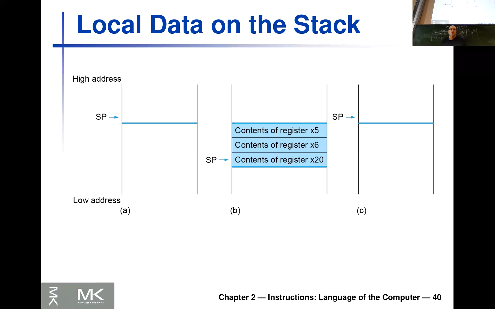
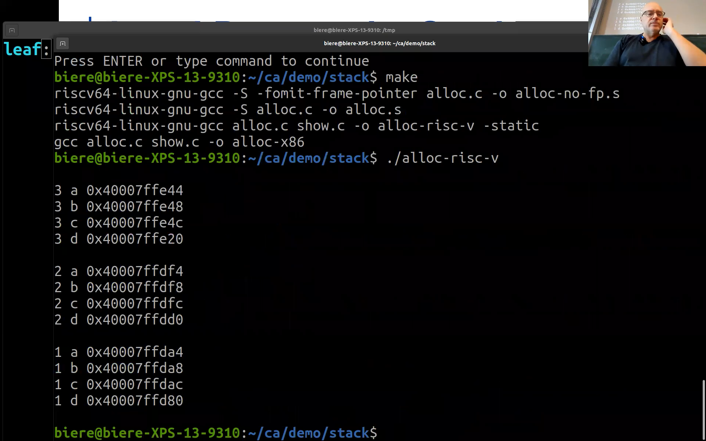
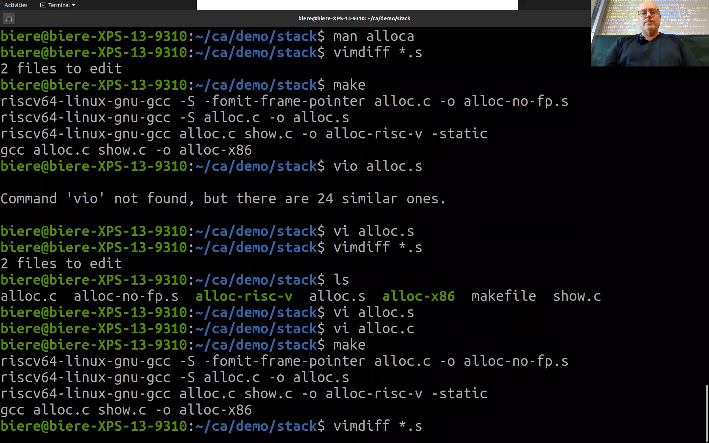
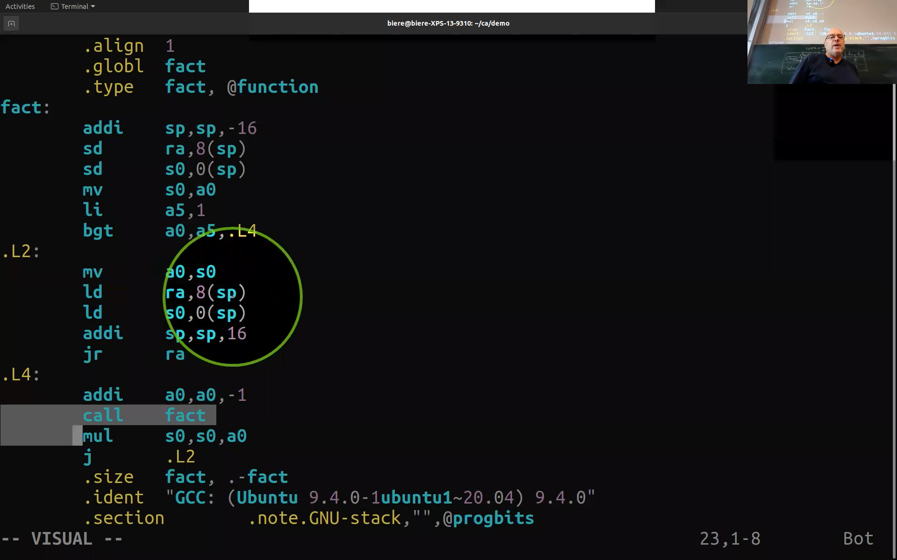

<!-- /home/areo/Videos/Rechnerarchitektur/Computer-Architecture-Chapter-2-2022-11-08-slide-33-to-46.mp4 -->
<!-- /home/areo/Videos/Rechnerarchitektur/_Computer-Architecture-Chapter-2-2022-11-08-slide-33-to-46_imgs -->
<!-- /home/areo/.config/mpv/mpv.conf -->
[toc]
# Tags
basic blocks, less than and gerater equal than branching (more conditional operations), signed and unsigned comparison,
# ==============0:00:00==============
<!-- - `0:00:00`: the cape in the brain so i hope the sound is working today. -->
<!-- - `0:00:12`: for some reason this semester doesn't work stop working and. -->
<!-- - `0:00:18`: where at this sir on. -->
<!-- - `0:00:22`: instruction set architecture or firm of risk five and there was also this discussion and about basic blocks in prey inches which we had in the companion or just went to to earn and to show you this again am i think. -->
<!-- - `0:00:42`: it's this one here. -->
<!-- - `0:00:44`: was it the other one though it was probably this one. -->
<!-- - `0:00:48`: i am no. -->
<!-- - `0:00:55`: and. -->
<!-- - `0:01:03`: and so what you see here. -->
- 
- `0:01:06`: i hope you said it it sir an assembler or code off i think it was some sorting or something anyhow so it was a snoop and there and you see these blocks these boxes and and that's what we call **basic block...**, a sequence of of instructions which in end.
<!-- - `0:01:26`: with a jump or with the i actually am you see these first two blocks that this one doesn't end with a jump but it's. -->
- `0:01:39`: kind of separated because you would also jump to the second block here from this one and so **basic locks is this a term used in compilers to describe pieces of sequential code in the sense of sequential or straight line code without branches and then you would branch out** and.
- `0:02:01`: or maybe you you remember this discussion from go to swear the **structure languages...** so he should have as a structural language aware you have like proper library loops and no go tos and then it's very easy to come up with these blocks and they would also not overlap if you would have recalled tools like which we have in the.
<!-- - `0:02:20`: assembler right you can sort of have to kind of basic blocks completely sort of jumping around and of course if you optimize code this might also happens if the compiler might generate code which doesn't follow this nice picture you see here that you have is blocks of sequence record and separated. -->
<!-- - `0:02:40`: am and that's the the concept. -->
<!-- - `0:02:44`: which is is here on on the slides in to do. -->
<!-- - `0:02:52`: already been my thing here. -->
<!-- - `0:02:57`: alright so so so these compilers issue started this rush language they would have these basic blocks like and so in cnc blast plus it's just this a curly parentheses raid this is a basic block in essence and act. -->
- 
<!-- - `0:03:12`: and and then you jump between them bit with with our jump instruction that's the purpose of jump instruction in our am in our language alright so last time we saw already like a one example i think it was the not equal and the equal and earn an indie equal so prince eco. -->
- 
<!-- - `0:03:32`: you'll hear in french not equal and the idea was that the condition here is encoded in these two letters here. -->
- 
<!-- - `0:03:40`: and the the it's if they're the richest are safe the same contents any branch to this instruction for the equal and here it's like if the different au prince to edwin were going to use this also an am in comparison to zero because that is something which happens very often right so you want to see whether like a counter for instance with josie. -->
<!-- - `0:04:00`: ero and then you would just use here am or like m the x zero richest of the zero register here as our rs to re so you can then immediately compare against zero with this with this and like having this this eg zero hard wire. -->
<!-- - `0:04:20`: two zero and for those of you who remember the vt the only accomplish all the all the instruct all the comparisons were against zero action you would take the accumulator and would compare it against zero larger equal less than like here and and you we have this also be if you just use is it just explained like a. -->
<!-- - `0:04:40`: one of the register here as an egg zero right. -->
- `0:04:45`: and so we are going to to see later and it's it's actually a term when i them the course last year and i realized that it's better to use even in c and c plus plus in a certain idiom i'm going to show you you'll eat later and **because actually these instructions, here this equal and**.
# ==============0:05:00==============
- `0:05:04`: **not equal need it in principle less hardware, they can be implemented a little bit faster than these guys here but we'll come back to this later when we talk about pipelining** and i am so **comparison is something which is kind of a really sort of constant timei, you can**.
- 
- 
- `0:05:24`: kerslake or **compare the individual bits** while **for less than and greater equal then...** you either implement it **by subtracting the two and then looking at the overflow bit** or you need like **a separate circuit which for the less than for the greater equal** then but in principle it works the same right so so this.
<!-- - `0:05:44`: means branch and then the condition here m here is is is encoded here less than greater equal and decided to register you compare in no condition is true so this is less than this one then you would jump to two l one. -->
<!-- - `0:06:00`: right and then we saw already this is this idiom a couple of times or so in the source code you see you have this nice if intended then french or directly bit behind it as a kind of a basic secret base of one line basic lock your question. -->
<!-- - `0:06:31`: just a second i just realized that i forgot to share screen. -->
- 
<!-- - `0:06:40`: okay so we only looked this one can you repeat the question. -->
- `0:06:50`: are you don't need it because or because you see a **less than is the negation of greater equal** or so this is negation of this one and and then **u can flipp the two registers** of course the registers are alike could be arbitrary.
<!-- - `0:07:08`: so you can swap the tool in all different ways. -->
<!-- - `0:07:13`: i. -->
<!-- - `0:07:15`: okay so for those of you listening to the stream or like the recording i just showed this page and this basic clock here in the companion okay. -->
<!-- - `0:07:29`: and. -->
<!-- - `0:07:34`: or aids as i wanted explained this idiom did you see here at the bottom so that shook donkey confused but i want to explain it once or so so you have here desert like in a language in an inner source code language would have if if ace larger than b then a plus equal to one now in and in the assembler code. -->
<!-- - `0:07:51`: gorgeous uses it switched around a little bit so you would check here whether m a x or like b is larger equal than a so we assumed that that bees in twenty three and in as in register twenty two and then you jump over this thing which you kind of half he array writes. -->
<!-- - `0:08:12`: in the source code you have kind of this truck trusted swordsman who swapped your source code versa that something is guided by a condition the while loop it's exactly the same end in assembly don't have deserve kind of straight line code is not structured and then insisted of you you need to denise have the negation here and then jump over this code so that's very common. -->
<!-- - `0:08:35`: alright i write and then i. -->
- 
- `0:08:40`: and as i explained already a couple of times as the other things will be pissed besides this not being structured the simpler the other thing which assembly differs from a higher language even those those some consider c not a higher language em is that he **doesn't have types** write it and while it's **not completely true it has bits, shorts,  words and double words**.
- `0:09:00`: it's in w where it's rates are like **length of bitvectors** but he doesn't have types in the sins of the year object types or something and **not even 'em here signed and unsigned**.
<!-- - `0:09:13`: and and again that for those are mostly programming in java this might not be a big difference but if you look at these two am contents as these two constants in these two registers and in the first one if if it's actually am signed right and this is minus one if you recall because if you're at one to it you see. -->
<!-- - `0:09:34`: then this becomes zero carry zero zero zero character gear carry and at the end everything is zero so that means that's why it's it's negation of of minus one that of once or minus one and and this other causes zero so this is not not a we're sorry this is one here at the end is a one but the the. -->
<!-- - `0:09:54`: bits before the highest the most significant bit here is a zero and end of course if you think of about this as an unsigned add then an x twenty two is of course larger than twenty three re. -->
# ==============0:10:00==============
<!-- - `0:10:08`: so here am sorry i think the the haven't exactly like a it like this right so if it's unsigned this is this an interpretation that these are. -->
<!-- - `0:10:21`: bit vectors encode something in in in not in a to compliment but just as unsigned numbers then of course x x that twenty two is larger however it's signed right then then this one here is is smaller than than that one. -->
- `0:10:35`: i think this is clear and and **for that you need to have then different comparison operators** rate and the the convenience.
<!-- - `0:10:44`: the did the way howard this is encoded is by having the one which is assigned m without any suffix frayed so like we saw before right here was head like. -->
<!-- - `0:10:57`: a french greater equal so this is then sign great so this would mean that these two guys i interpreted as to complement so would be could be negative numbers while if you really want to have the unsigned. -->
<!-- - `0:11:12`: wilson then you need to put the orders you at the end for unsigned and and that's actually very common so there's something mic maybe a thread about smtc empty the severity of people do exactly the same so this is a very common idiom that you put the you at the end if you mean the unsigned and b none you then. -->
<!-- - `0:11:32`: and thus interpreted these numbers here which are compared as as to compliment. -->
<!-- - `0:11:40`: okay. -->
<!-- - `0:11:41`: and and as this example shows you see you would get different results so you need to read the code then of course in a different way. -->
- 
<!-- - `0:11:52`: all right so that's a brings me to do. -->
<!-- - `0:11:56`: and this procedure calling and there have like a lot lots of themost which i want to show you because this is sort of an i would say the most complex part of this of of this assembler. -->
<!-- - `0:12:09`: and while of assembly in general and term. -->
- `0:12:16`: and here is the overall picture and and what wish you would use opposed to the urge to do and and and **this is in a certain sense already part of the**.
- `0:12:28`: **a b i, the application binary interface** because.
- `0:12:36`: well that's what a venue **when you call a library function right in the library function returns then the library function also follows this principle** right.
- `0:12:45`: and **therefore the operating system has this contract with the assembler programs that you should follow this way when you call function**, so if for instance you would only do I don't know an embedded risk five bail bone.
<!-- - `0:13:05`: processor which will really is only programmed in assembler and does not even have a real operating system right then you could of course do differently but most common and you will need to follow this this procedure okay. -->
<!-- - `0:13:24`: and. -->
<!-- - `0:13:26`: just again so now i have this thing properly and. -->
<!-- - `0:13:34`: in the literature but that that subdirectory there's this sir. -->
<!-- - `0:13:40`: here this one which i showed you how to download are also from the get up there last time and it has like very useful information at fault for the lecture that's what i'm going to show it might be times or it's so once again here's a for that part for this part again it's very important to to understand here omg. -->
- `0:13:59`: kind of what the application binary interface interpretation is of of of these registers right so **they're completely flat from a process perspective the only difference is that zero is always zero** right the rest could in principle be used for anything however the the operating system and when you call libraries would require that you've.
<!-- - `0:14:19`: follow here sort of. -->
<!-- - `0:14:23`: this interpretation here and and also at the end there is this color in cali who is responsible for maintaining the value of a trade. -->
<!-- - `0:14:33`: enter and. -->
<!-- - `0:14:37`: so i'm showing you this because there's this m x ten two x seventeen so these eight registers they are function arguments okay am and they're called in assembler a zero to a seven right. -->
<!-- - `0:14:53`: so when you want a corner function you need to put two simply the arguments they are right so if it's in teachers who just put like the integers in this. -->
# ==============0:15:00==============
<!-- - `0:15:01`: and this is the point here are off of this firstly okay then you'll have to transfer the the control to the urge to to the procedure. -->
- `0:15:13`: ams will be going to see these sir instructions in there in a second so you need to kind of jump to this procedure.
- `0:15:20`: but as we are going to later later see we also need to actually return again at the end and am **returning here in risk five means simply jumping to the value stored in a register** and **by default the return address is always stored here in this**.
- `0:15:40`: **register...** r one **x one** that's why it's called here are a right some principle you could use these are this x one as you like but for calling functions you saved sort of the return value usually in this x one
- `0:15:55`: and this is xd part here and of this too and we're going to later see that okay so we're we're actually **jumping to the code of the procedure and saving our own return address which is the current program counter plus four bytes because we have thirty two bit addresses**.
- `0:16:15`: **in this r a** which is x one okay **then we need to acquire space for the like automatic variables** and **and actually also for saving as some additional information** that so like the the the to the topic of today.
<!-- - `0:16:35`: so you need to actually do something because an a frame or an it's the frame of the recursive call frame of a function so when you call a function the function opens up a frame on the stack. -->
<!-- - `0:16:50`: m and then you have some dough. -->
<!-- - `0:16:55`: you need to say for instance thinks you're going to override it as in this table. -->
- `0:17:00`: and then you lose your operation your sorting or whatever em and then you need to place the resides in the in registers for returning it to the caller and as you might might already remember so **only the first two can be used as return values** rates you can actually a return a.
<!-- - `0:17:20`: two yeah people would call it scalar types for instance you could return to ins or to register values or if you want two pointers right in x is ten and x eleven or a zero a one immediately otherwise you need to store somewhere in and let the caller have a point you to the. -->
<!-- - `0:17:41`: log trusting which is return. -->
<!-- - `0:17:45`: okay end then. -->
- `0:17:52`: will do after that we'll just jump to the address which is stirred in x one **in other assemblers it's slightly different so there...** sir.
- `0:18:01`: like a specific x will return and **return**.
- `0:18:06`: **an assembly instruction that also exist but it's a pseudo instruction** maybe i'm showing you this here.
<!-- - `0:18:14`: just for you to do. -->
<!-- - `0:18:18`: right so you are the pseudo instructions and there should be return which of course thorns fine you're right. -->
<!-- - `0:18:28`: and. -->
<!-- - `0:18:32`: and ah yeah we didn't talk about j l r in detail yet but you can see it uses this register x one which we said is the the the register for having the return address and the other two things are zero since like it's simply a special case of this module. -->
- 
<!-- - `0:18:50`: neural instruction is called chump chump and link registered okay. -->
<!-- - `0:18:57`: and and yeah there are only two variants chump with the with the with linking and chump without linking i'll explain this ill in in a minute. -->
- `0:19:13`: alright so this is especially for four is five but you'll maybe i'll buy buy buy this glimpse again on the actual assembler **you see already design and principle we've tried to make if everything comes completely regular right so this only kind of one jump instruction** in it as he does **actually...**.
- `0:19:31`: volume **two** because of this sir.
- `0:19:35`: constants which we talk about in a minute but like in principle there's **only one and it serves both as for calling a function and also for returning** other symbols he would have a separate call and in return assembly instruction.
<!-- - `0:19:50`: okay these are the two which i promised end there and that and so the first it just am if the chumps add to this or procedure and an end or. -->
# ==============0:20:00==============
- 
- `0:20:08`: and **jump to this procedure labor this is kind of actually a pc relative address** and then puts it in the return address into x one and then as we have seen **if you simply specify for instance x zero here then add this would be...**.
<!-- - `0:20:28`: and. -->
- `0:20:30`: and like as **you do need the return address** it trace so it's really just a sort of a chump bitches a call at the same time okay and the alternative here **this is a indirect jump...** and here you take the the register value the the actress which is in 'em in this.
- 
<!-- - `0:20:50`: register you add an offset like zero and where we are talk about this awesome second wider wide scoop to have his opposites offsets here but in principle you'd take an indirect. -->
- `0:21:03`: i caught a chump here so you take the actress the next one and then you jump to that end but yeah we saving the return address in this first argument here which in this particularly example weights **x zero right we we don't use it right it's just like thrown away**
- `0:21:21`: so so this concrete urns assembly instruction really just **looks up in x one the address where to jump to**.
- `0:21:31`: okay **now where's this used...** rate any idea where like em.
- `0:21:37`: this **is called computed jump...** you're done here you see the term.
<!-- - `0:21:41`: right so you you because something which is in the register is computed we can added like you can loaded in whatever any ideas. -->
<!-- - `0:21:51`: while there's one one one down here case in switch statements movie will explain this. -->
<!-- - `0:21:58`: am on. -->
<!-- - `0:22:09`: at so so are you all know or a switch statement right so you you can. -->
<!-- - `0:22:17`: for instance you have this function which takes an argument a and then depending on the value of a. -->
<!-- - `0:22:26`: you you do your. -->
<!-- - `0:22:29`: you're doing the falling you'll return rates up so he could be for instance. -->
<!-- - `0:22:36`: the case two or return. -->
<!-- - `0:22:40`: one case or three return or two and five return three and seven return. -->
<!-- - `0:22:54`: four and you have this default which returned zero right and yet whoops there should be the default. -->
<!-- - `0:23:04`: and i. -->
<!-- - `0:23:07`: now you didn't you of course know what this thing is supposed to depend on the on the source-code level m e. -->
<!-- - `0:23:15`: but how is this compiled rate with a compiler indeed the basically of course you could think of and an an alternative for writing this if a equal to or return one re or else if a equal or two you return a tool and so on right else. -->
<!-- - `0:23:36`: return zero this will be an alternative. -->
<!-- - `0:23:39`: but why is this alternative bad. -->
<!-- - `0:23:43`: well. -->
<!-- - `0:23:46`: if you if you do it for instance for all these prime numbers or until i dunno which which prime number that is but from maybe probably i dunno fifty seven or something. -->
<!-- - `0:24:00`: am. -->
- `0:24:02`: right then **you have a long if then else chain**.
- 
<!-- - `0:24:06`: this is really costly so if you give it like longed are often like a a numbers say of around five hundred or something if you need to go through this whole if then else with his branch instruction we just discussed. -->
- `0:24:20`: wood and only then it would figure out like the return value and **that's why compilers actually do something different...** or they would.
<!-- - `0:24:33`: i am actually have something at which is well of course i cannot do it in in in seat now but it's like a hash of a and a go to address. -->
<!-- - `0:24:49`: right and and then are you this would be at-risk of hash of tool. -->
<!-- - `0:24:57`: and so on. -->
# ==============0:25:00==============
<!-- - `0:25:00`: right so you would get a hash function. -->
<!-- - `0:25:03`: sorry not like that you would get a hash function and. -->
<!-- - `0:25:13`: and er. -->
- `0:25:14`: **and this hash function is made in such a way that it uniquely maps this case switches** rate so you can do that with the some particularly am and am.
- `0:25:24`: then you **only need to compute this hash function which usually can do with a with some few operations** m m **and then you jump simply to this address**.
<!-- - `0:25:36`: at two am to this effort straight so this is a computed actress. -->
- 
<!-- - `0:25:42`: and and term. -->
<!-- - `0:25:50`: and so this is one case that another as situation as luther more questions for one of the police police are asked to another situation which is very common is in another with you you know how sleepless buses compile so quickly plus possess this am. -->
<!-- - `0:26:11`: a class c and then if you have a virtual member function in one raid and or another virtual member function. -->
<!-- - `0:26:21`: but m m to re. -->
<!-- - `0:26:25`: and and then you have a class or should be lower case a class a d which is a public or c. -->
<!-- - `0:26:38`: read and it it would actually override this in one re. -->
<!-- - `0:26:44`: and also this or m two and maybe another class or or ii which also does this. -->
<!-- - `0:26:54`: and when you now have an object of type c read and and you're calling him one what's going to happen. -->
- `0:27:06`: right we know exactly was what what he does for those of you knows the blood vessel this is like inheritance so **it depends on the actual type of c**.
- `0:27:15`: **whether it's d or e and then the corresponding function here is called...** so this is d dot m m one and this is either them and one and how does isn't this now compile ray.
- `0:27:27`: and it turns out of **what all the c++ compilers do they actu lly do something very similar what we saw in the switch statement example with the computed goto** they would ever and **for each class a virtual function member table**.
- `0:27:48`: right **where you simply the address of this m one and m two** re.
- 
- `0:27:54`: so **this declaration here on top even for those of you who know c plus plus even if this is a abstract class so now there's no implementation here so this is only an abstract interface there's no real object of c only objects of d and e exists** and and anyhow sadistic lorraine.
- 
- `0:28:14`: even then you would know that this is these guys here liked this **lowercase c here and this is an object which has a function table where you can look up the address of m one and the address of m two** and **then the class d would store that particular function in it and**.
- `0:28:34`: and and **m two in it and and this class e would maybe add another one** right they could do different things straight so this one could say just x x exam per se or put er.
<!-- - `0:28:47`: here are the that m one right. -->
<!-- - `0:28:51`: while while this one here would say oh i am he i am not and. -->
- `0:28:58`: okay and **so you would actually have a slow of two entries in the table, one for m one and for m two and now what the compiler does...**, it would **when this call is happening here it would look up that table and then because it's m one it would take the first entry load it into**.
- 
- `0:29:17`: **register and then jump to that address** okay so **that's why you need this idea off**.
- `0:29:28`: **indirect jumps, so you take the address of something which you computed here, in this case x one which could be the return address in this case but could be something else and then you jump to it**.
<!-- - `0:29:44`: all right and am at the of the first thing we're going to do is this and leave procedure example and infer that i first have to explain here which i'm the last time i did on the play performed going to do it again. -->
# ==============0:30:00==============
- 
<!-- - `0:30:06`: different calling conventions of. -->
<!-- - `0:30:09`: i know sorry need different. -->
<!-- - `0:30:13`: byte length conventions of a of windows end. -->
<!-- - `0:30:20`: linux. -->
<!-- - `0:30:22`: okay and so on. -->
<!-- - `0:30:26`: okay are are so for those of you on the cc plus plus or or or. -->
<!-- - `0:30:33`: a certain shirt comes first. -->
<!-- - `0:30:37`: and then we would have an int and are usually also signed and unsigned but that doesn't matter with respect to size then we have lol air and then the thing will receive in this light this a long long. -->
<!-- - `0:30:57`: and then when we do here or linux or android or mac or illustrates inches pudding. -->
<!-- - `0:31:03`: this as the most common one here. -->
<!-- - `0:31:07`: and he have windows then there's a slight difference which is annoying. -->
<!-- - `0:31:13`: but because so many people are using of course windows you have to to know that. -->
<!-- - `0:31:20`: and and. -->
<!-- - `0:31:24`: then actually we need to do this twice but have color chalk here problem not great snow colored chalk. -->
<!-- - `0:31:36`: didn't i have to do it differently. -->
<!-- - `0:31:39`: okay so so what i write here is a in each box i write here the the sixty four bit version and later the the thirty two bit version right so this hill hold pictures actually eight interest rate. -->
<!-- - `0:31:55`: and. -->
<!-- - `0:32:00`: and the interesting thing is that c actually did not define extra did the size of these guys so they guarantee only minimal numbers and then we also have for a double and float which are guaranteed and is in a certain sense his strikes are initially they were really machines with sort of like fifty six bits rate is away. -->
<!-- - `0:32:17`: kids nowadays are all machines have powers of two and therefore there's almost no no disagreement here like you see this is of course. -->
<!-- - `0:32:29`: of those one bite ok. -->
<!-- - `0:32:36`: and of course lake for both the sixty four and the thirty two version for short what is it. -->
<!-- - `0:32:43`: any takers yes of course also to like. -->
<!-- - `0:32:49`: the interesting thing here this by the way is also true for unsigned which is the others for a time yet it's also completely there's almost no machines nowadays which have something different so even those he does the c standard and seamlessness doesn't specify. -->
<!-- - `0:33:06`: now this will go is going to be the tricky one okay so we'll do this last. -->
<!-- - `0:33:13`: and these guys are also eight okay. -->
<!-- - `0:33:23`: and this ab ride an hour. -->
<!-- - `0:33:27`: a problem with sixty four bit risk and thirty two betray. -->
<!-- - `0:33:34`: okay so it turns out that on linux this thing is a bite on the sixty four bit machine and and four by on thirty two bit machine. -->
<!-- - `0:33:46`: okay and windows pick this which is awkward. -->
<!-- - `0:33:52`: okay so the discrepancy is is here. -->
- `0:33:57`: and and that's bad because **we then don't have a nice way of specifying a sixty four bit word**.
<!-- - `0:34:05`: read the only way to do it portable way and i'm young and i'm showing this. -->
<!-- - `0:34:16`: this slips the light again so for those. -->
<!-- - `0:34:20`: in the video and recording just look at the slide again. -->
- `0:34:24`: right so **that's why there's long long**.
<!-- - `0:34:27`: because when you translate something into and you want to specify i want to have a sixty four bit risk and i want to have full register values like this arguments there they are like match one to one full register which is sixty four bit how would you do this with this ready. -->
<!-- - `0:34:47`: would meet the right long long then it's the same on all platforms. -->
<!-- - `0:34:53`: and it's worse because. -->
# ==============0:35:00==============
- `0:35:01`: when you want to print these guys with the **printf...** and things which of course you want to do it in one point in your program then they'll all have **different conventions** but i don't touch the snow is.
<!-- - `0:35:18`: or they just decided to do this i have no idea why they didn't decided so it's just like the c standard lifted open and microsoft decided for the compiler he doing there that and the depth is like forty years ago or thirty five years ago now they have to stick to this decision because code will break. -->
<!-- - `0:35:34`: great if you're making this assumption of course and now nowadays the the the. -->
<!-- - `0:35:41`: what you really should do is. -->
<!-- - `0:35:44`: here paul the sky and sixteen teak and there's also a new version of this one sorry the lighting yeah and this is me in a. -->
<!-- - `0:35:57`: thirty two and this is in modern c like yeah it's also already likes quite some time old and by this is not unlike you need to audition to. -->
<!-- - `0:36:10`: headers to do this so it's called you in thirty two and this isn't standard int. -->
- `0:36:17`: **that's the portable way** but it's awkward to write.
<!-- - `0:36:21`: and and he always said so i had i i think i hit the show it because otherwise you might wonder why why are we using here this long long it's just annoying coincidence if you want to make your code a portable from. -->
<!-- - `0:36:34`: or. -->
<!-- - `0:36:37`: when those two to linux. -->
<!-- - `0:36:40`: and by the way so. -->
<!-- - `0:36:46`: and. -->
<!-- - `0:36:48`: java is here. -->
<!-- - `0:36:50`: okay java pick the linux version. -->
- 
<!-- - `0:36:56`: okay. -->
<!-- - `0:36:58`: so with this explanation you understand why this loan long nowadays no no like misinterpretation possible this is just a sixty four bit argument and sixty four bit. -->
- 
<!-- - `0:37:08`: yeah. -->
<!-- - `0:37:10`: and recite. -->
<!-- - `0:37:12`: end or the temper is here like is an m f here is the sixty four bit register and we want to compile this now includes sixty four bit risk. -->
<!-- - `0:37:24`: okay so this means like that's like what this bullet says now we can really say or argue okay yeah one argument is really like one of the sixty four bit versions. -->
<!-- - `0:37:41`: okay and and. -->
<!-- - `0:37:46`: here's the the court so it's not necessarily the same as we going to do. -->
- 
<!-- - `0:37:54`: a generate by by the compiler but like. -->
- `0:38:00`: the first thing which i need to show which which which i need to explain is this thing here so and here as you as you can see the the author of the slice like a petersen here i am your **mixes the**.
- `0:38:18`: **two notions of registers...** we had here in the air here in this overview thing right.
<!-- - `0:38:28`: or it's a stack pointer here is just register x to rachel we already know what x one is used for in the application binary to freeze the return address and this other one here is. -->
- 
<!-- - `0:38:42`: the stack pointer end. -->
<!-- - `0:38:47`: of course i need to share screen again i forgot. -->
<!-- - `0:38:55`: okay. -->
<!-- - `0:39:00`: and so this is x to rate but like yeah the rest of the herb it's using the nun and i said if a b i versions the exterior to extend the one. -->
- 
<!-- - `0:39:17`: okay am now m x five x x six and x twenty. -->
<!-- - `0:39:24`: those are. -->
- `0:39:26`: x five you see the this is a **temporary...** that one and we could actually as i am.
- `0:39:35`: as this procedure implementing this leaf is this assembly code implementing his leaf procedure actually **overwrite as we want** but this but this sir x twenty here like starting from x eighteen to twenty seven a twenty twenty one and twenty two those guys they also have the name s here those guys **have to be...**.
- `0:39:55`: **saved if you're loosing them** okay and what does saving mean well **you need to store them into on the stack** and so and so actually only required is it for for that one this is kind of redundant he would not need to do it because x five points if x six can actually be a r t.
# ==============0:40:00==============
<!-- - `0:40:15`: emperors. -->
<!-- - `0:40:17`: okay what does mean a saving on a stake mean and there's like a another slight for the for the town which explains that so in the old days say i did this on the blackboard but this slide explains it. -->
- 
<!-- - `0:40:30`: the better so so i. -->
<!-- - `0:40:34`: it's kind of the model i'm so sick of the operating system. -->
<!-- - `0:40:39`: of how a process is or how the memory of a process look like and how it is used. -->
- `0:40:48`: okay so yeah if you process your league executing some code and this is the whole memory address space and **in principle it could be...** from zero to i am actually two to the power a sixty four minus one but **it's actually not true because am only forty eight bits**.
- `0:41:07`: **are currently used in today's machine, actually the first sixteen bits are not used**.
<!-- - `0:41:19`: and end. -->
- `0:41:23`: and **the top of this memory space here...**.
- `0:41:28`: **is actually am here this number, this is...**.
- `0:41:35`: **a risk 5 convention** so forty **for x eighty six actually**.
- `0:41:41`: **you would split the memory regions in two parts**.
- `0:41:45`: and **where you would even have here negative addresses** a crisis and **but we come to that later when we talk about virtual memory** so for now let's just assume we have here this is our address space it starts at zero and would **go up to like two to the power fourty eight minus one**.
<!-- - `0:42:05`: that's this number here end and then the stake and which is the program stake where we put our local variables grows downward while the memory which this is this dynamic data. -->
<!-- - `0:42:20`: we're really allocates objects like with malloc and and if you call new for instance for for for sleeplessness those would be put here on the heap and this called up like dynamic data here. -->
<!-- - `0:42:35`: okay and if you are and actually what the operator system would would give you would give you here like the starting point when the process started of this dynamic data and then it has some point the heel which crows upwards air and then there's a library in there which which allocates memory of which gives you a space. -->
<!-- - `0:42:56`: and for which are located but you can use here. -->
<!-- - `0:43:00`: okay so we're not talking bout em as thick in the heap park right and this is really sort of this deck is part of the execution model of the program where rare when you do a function call you put things on the stack and the state grows downwards so you put something and then if you call another function we put. -->
<!-- - `0:43:20`: something else this is the idea of of this model of firm. -->
<!-- - `0:43:27`: of the stick. -->
<!-- - `0:43:32`: okay input dynamic as i said like you there's like where you'd put an earth like dynamically allocated memory like explicitly allocated memory is is put here on this. -->
<!-- - `0:43:44`: on this. -->
- `0:43:46`: he appear okay then down here are two things the most interesting as a programmer you will also realize this there's this some like **initial part which you cannot access actually as the process cannot access this and typically you figure that out if you have a zero pointer and you try to dereference that** and set **then you get like**.
- `0:44:06`: **in c c plus plus a segmentation fault**.
- `0:44:11`: and the **segmentation fault is actually am something triggered by the operating system** which we going to do to discuss also in the lecture which am.
- `0:44:22`: tries to access the sub page here and it's actually play key on purpose **if you try to access this page then the operating system would interrupt the process because it's not accessible and would actually generate an like an exception** and er.
- `0:44:41`: oh it'll heal **in between like where these guys the don't meet there's also**.
- 
- `0:44:47`: **black pages which you cannot access** for instance **if you have a function call which calls itself infinitely often right then this stack would grow downward with each function call and eventually will also run out of space and then you also get a segmentation fault**.
# ==============0:45:00==============
- `0:45:10`: alright and then do a down here **this text means code so assembler code...** or so this is sometimes used on the slights and also in the choir or a synonym for for for court right so here's our **machine code** it's quite text segment here.
- `0:45:28`: in the buff it is **static data, that's like data which you put into your program which is kind of constants, like a set of constants which you put into the program**.
- `0:45:40`: or some **actually the most common usages for instance if you print messages right then this message string is somewhere in your program**.
- `0:45:49`: **and it would usually also be allocated here in the static because at compile time u know this message string** right.
- `0:45:56`: like **if it's a constant message like hello or something and then would be put here as data**.
<!-- - `0:46:02`: okay so this is kind of the programming model off of. -->
<!-- - `0:46:10`: am off. -->
<!-- - `0:46:14`: or of c or c plus plus all all urn languages and even if you would have another language like java or something else and which is not and which is kind of compiled rates like even java has a jit compiler it would need to these these compiled code would need to follow that this. -->
<!-- - `0:46:32`: this convention justice explain. -->
<!-- - `0:46:38`: alright and this is now finally what explains this line rate. -->
- 
- `0:46:45`: what do we do here so we we have our steak pointer right which is kind of the bottom of the stick because it grows downward and now we need to make room and we're making **room for twenty four bytes...**.
- `0:47:00`: and by by twenty four bytes well **because we need to save three things** these are the three things we're saving.
<!-- - `0:47:08`: okay so we're making space for on the steak and then we're temporarily saving here the sir. -->
<!-- - `0:47:14`: have three values and. -->
- `0:47:19`: okay and yes i said as i explained so so **maybe this example should have used x twenty one and x twenty two instead of x five and x six...** because those two guys here.
<!-- - `0:47:31`: a because x twenty as you can see here this is in this range this needs to be saved. -->
<!-- - `0:47:37`: okay while x five and x seven actually do not have to be so to confuse use them as you like. -->
<!-- - `0:47:46`: and but maybe you were lazy or your compiler is dumb and he would say i need to like i need three three registers here x five and extended x five x six x twenty and so and just to be on the safe side and i'm and i'm all i'm saving them so that i later when i see this year at the end. -->
- `0:48:05`: when i return i am restoring them right **i am getting them from the stack before i return**.
- 
- `0:48:14`: okay and this already explains you're almost to the end here well **at the end you also need to fix the stack pointer here back to it's original value**.
- 
- `0:48:26`: by just adding twenty four again **and then do this jump to what you saved here in register x one which was the caller of this function right...** cause it attempts to **jumps to this left example label and puts its own pc into x one**.
- 
<!-- - `0:48:46`: so that's why here this is at the end is is a return and as i explained here this is exactly the sort of instruction we have here re. -->
- 
<!-- - `0:49:02`: okay now what's happening in the middle i mean that's what happens in the middle is just like what you would expect so you take the two arguments this is jane h rate because they're stored in register ten and eleven and iron che are in twelfth and in third. -->
<!-- - `0:49:17`: eighteen. -->
<!-- - `0:49:20`: but this the three missing here i just realized this three missing and em ups. -->
<!-- - `0:49:27`: right so from x ten two x thirteen so extent is g x eleven h x sir twelve i and x thirteen j they're also called a zero a one a two a three right. -->
<!-- - `0:49:43`: ns m. -->
- `0:49:45`: right and so you're just adding here cheap less aged you're adding here i bless chair **you're using these temporary registers which we saved** rate x five and x six and then we're adding and subtracting actually air from the first one the second one so from this sum here the second some here put this in.
# ==============0:50:00==============
- 
<!-- - `0:50:05`: x twenty. -->
<!-- - `0:50:07`: and then copy x twenty back into the recite register this is x ten or a zero re. -->
<!-- - `0:50:21`: once again so extend here is the first of this argument registers and for these eight argument registers and and because you are returning right am at a a in a zero in a one the recite. -->
- `0:50:35`: the okay the is this clear so this is so there are a couple of things why this is and not the cord you would get from when you compile it and one thing i wrote he explains **you don't need to save x five and x six** right.
- `0:50:57`: actually **if we would compile it without optimization all these temporaries would be actually put on the stack this is just convention of a non optimizing compiler right but here it's kind of mixed** and the.
- `0:51:10`: then at **the other thing which is not what you would get is this twenty four...**.
<!-- - `0:51:15`: because part of this application binary interface and will do this in a in the and in a second. -->
- `0:51:24`: it is actually dead and this the **...stack boundaries...** like you select when you call a recursive function the function would have it's own stack and to.
- `0:51:36`: **...this has to be actually**.
- `0:51:40`: **thirty two byte aligned** so **they would not allow that you subtract twenty four or twelve** and **this is part of the application binary interface** rate for the operating system says.
- `0:51:52`: some of them are the the only can **increase by multiples of thirty two**.
<!-- - `0:51:58`: and er. -->
<!-- - `0:52:00`: so if you do this now then let's try to do the wear of my window here. -->
<!-- - `0:52:09`: alright so so i'm now using long and you now not know why write a i can and it was an an is called knysna not whoops. -->
<!-- - `0:52:22`: along a g long h long i won't say because this is a linux machine right so this longest now look at the blackboard is a bite long long. -->
<!-- - `0:52:36`: and and then the same here the recived f is equal to g plus h. -->
<!-- - `0:52:43`: minus am i plus che. -->
<!-- - `0:52:48`: return f. -->
- 
<!-- - `0:52:51`: right this is not the same as if i would want to do it on only one windows i would need to do law. -->
<!-- - `0:52:58`: and now i'm i'm of course like are also are using a sixty four bit version of the compiler and or are into the first non optimized version so this might as s a once again justin orig assembler so the sleeping at least an s. -->
- 
<!-- - `0:53:18`: and and you see actually even more things in and this is one thing i'm going to explain later desisted with the frame pointer so we'll discuss this hopefully today are. -->
- 
<!-- - `0:53:30`: so this as zero is actually the frame pointer. -->
- `0:53:35`: and if you look here at our cheat sheet you see this is as zero or frame pointer and now going to explain this later why this why this frame pointer is a required actually it's not completely required because **you can actually compile without frame pointer** and i'll i'll show you how you do that you.
<!-- - `0:53:55`: you just right omit them. -->
<!-- - `0:54:01`: a frame pointer. -->
<!-- - `0:54:03`: and then you will see that this thing is missing rate doesn't do anything with this as zero anymore. -->
- 
<!-- - `0:54:15`: oh. -->
- `0:54:16`: okay so and because of this frame pointer thing actually this as i didn't check i didn't did anybody pay attention we could look at the video later but but i thought they did **there should have been sixty four** re was it was sixty four **because i omitted the frame pointer this is not legal code anymore** this third incense rate like the the you see.
- 
- `0:54:35`: the different levels of legal legal code as an end **omitting the frame pointer breaks certain things...** very like the **debugging is for instance not possible anymore** and so **for this debugging you would need to require sixty four** so i didn't pay attention but su nodding so this was sixty four.
<!-- - `0:54:53`: but nowadays i don't need to save this the this thing which from yates not on the slights but but otherwise this is almost the same code solve so we could go through this now but but but maybe it's better for you to do you do this or cell-free the checkout you can also delete of course on godwit executive with the way i did sudo need to install it locally but. -->
# ==============0:55:00==============
<!-- - `0:55:13`: it's like cool if you can run the risk wife code on your own machine. -->
<!-- - `0:55:20`: oh yes and then you'll already see like it's using here like sue the instruction even in december raid. -->
- `0:55:28`: this is a **pseudo instruction here**.
- 
<!-- - `0:55:32`: and. -->
<!-- - `0:55:37`: let's see whether it's here she are this one here right to see you. -->
- 
<!-- - `0:55:47`: and by the will of course like give executive return we need to be had before. -->
<!-- - `0:55:52`: alright. -->
<!-- - `0:55:57`: and and yeah here's a picture again of this sir am stack pointer and there was a question before. -->
- 
- `0:56:05`: yes sir the **stack pointer here points to the first saved or last saved it depends on how you do it and actually will later see that**.
- `0:56:16`: **of course like it completely depends on the compiler how the compiler allocates here the things to safe** rate like in hm.
<!-- - `0:56:29`: and and m. -->
<!-- - `0:56:33`: and that's the un. -->
<!-- - `0:56:36`: and. -->
- `0:56:39`: kind of a look at things what happens before **here before calling the function** raid then you can eat **within the function...** when the compute thinks it looks like that and then **after we need to clean** up so we'll **actually just a back track here but we need to restore these values here**.
- 
- 
- 
- `0:56:57`: alright but i think maybe it's the lead me chicks chick not jumping ahead yet sir alex will be come back to this later when we talk about leaf as non leaf function suggested to give you the point of where we are now as **this example was a leaf function doesn't call additional**.
- `0:57:16`: **recursive function** deloitte later actually do what happens is you a function call itself or other functions recursively and that also explains then later why you'll have this this do distinguish between registers which need to be safe by the color and righteousness which need to be saved by the cali by the called function.
<!-- - `0:57:36`: but we'll come back to this later but i'm showing you in our recursive function the only thing i'm showing a reason i was showing you this now in life is because it explains this in a location like a more concretely with an example and also a trust is this a frame pointer thing which is the. -->
<!-- - `0:57:56`: the best place now i think we should earn. -->
<!-- - `0:57:59`: no i thought chef another vendor. -->
<!-- - `0:58:05`: yep. -->
<!-- - `0:58:08`: alright so i'll copy this also later to the cloud but like philologist and. -->
<!-- - `0:58:15`: i am. -->
<!-- - `0:58:19`: have a look so this thing hears it doesn't really have a purpose and it's whites it's it's a bit ot but but it's often good to do these kind of tests right even yourself to figure out how things work ray for 'em of course you have to be careful that the compiler doesn't optimize things away right which you want the test. -->
- 
<!-- - `0:58:37`: would i want to test here is is this recursive function is the f calls itself here. -->
<!-- - `0:58:43`: and it does it recursively until this limit becomes zero you start with three so that's why it would call itself three times rape. -->
<!-- - `0:58:53`: okay and then buy and buy what you are already understand is like every function call would open up such a stick frame rate like off a thirty two bytes. -->
<!-- - `0:59:05`: and third bytes and so on. -->
<!-- - `0:59:09`: and. -->
<!-- - `0:59:10`: okay we could now look at the assembler but what i want to show you is sort of the execution of this thing like like what a what a debugger like you could also the bucket like if you would have a m and debugger which can execute the assembler we could also do it like executing this simpler but the one i want to show you instead is here and that's this is shore line here. -->
- `0:59:31`: am so this thing gets the name where like of a variable m then the limits would it be no like in which recursion br like three to one okay in the end the address of this automatic variable a b c so **what is an automatic variable...**.
- `0:59:49`: it's an automatic variable is **something which you put in a function you need it like everything like a loop index or whatever this is an automatic variable is not on the heap** this thing will actually be **either be in a register or on the stack**.
# ==============1:00:00==============
- `1:00:08`: and **here because i take the address you can't do it actually with the register you cannot take the address of a register**.
- 
- `1:00:20`: so **that why actually compiler will need to put these guys really**.
- 
- `1:00:25`: **on the stack**.
- `1:00:27`: now what what would would the compiler do here right so there's this stuff the other stuff levy would need to save like the steak point that would everybody would need to before it goes into this f it would need to save these three guys who **needs room (one int right is four byte) for twelve byte**.
- `1:00:48`: and so that's what we're going to need to see so is that the thing about like what we're going to see rates are we going to to see this will be **called three times** we'll be going to have these blocks three times and they will be separated by a line of whitespace and m.
- `1:01:05`: and and this would troll go downwards rate like each block see we **don't know where a b c are actually sitting in this frame** right they could be either a b c b a widow nora that's what the compiler decides where to put them into the stick but it's clear that the first block of of call three right with the first with three argument this one.
- `1:01:24`: for this **will have addresses of a b c which are above those with limits two** and those rupee above those mentioned in with one brain.
- 
<!-- - `1:01:36`: is. -->
<!-- - `1:01:44`: ah yes thanks. -->
- `1:01:46`: yeah i did this later so i had mac was banana thought it or i should do this explicitly because i'm alright now and **what did my makefile do here...**.
- 
<!-- - `1:02:00`: i do third three things to be going to look at the assembler code the risk assembler both with and without frame pointer rights but we looked at this already just like doing the same thing again and then i compile into binary leg one for risk five and one forty six eighty six and then we can execute both and you will. -->
<!-- - `1:02:20`: ch needs similar behavior so we can execute the less list stood a native one first read this is on this machine x eighty six. -->
- 
- `1:02:30`: right and interpret this right so this is the three recurrence three to one and this are the addresses of this three or four byte variables on on the stake right in annex eighty six you see it looks like **the first stack frame was at e4, it was going**.
- `1:02:50`: **downward**.
- `1:02:52`: **and then they are just separated four bytes away** rights with be c plus four is easier.
- `1:02:59`: and this is again four bites away re **so this ranges from d c to d seven to e eight**.
<!-- - `1:03:06`: right and the same happens though in theory so the layout should be the same right no no same compiler would you see like the distance this should always be relatively this would not scramble when this is completely clear. -->
<!-- - `1:03:18`: okay i hope this is clear as if this is unclear then then you miss misunderstood some of this sub like is what i said this execution little machine is certain said sense which is behind executing a c programs or like functional unlike programs on on or in the process right now we can of course do the same. -->
<!-- - `1:03:38`: the. -->
<!-- - `1:03:40`: and with this risk five again and why is this working well again i missing this cross compiler so i'm a half he really am. -->
<!-- - `1:03:52`: a sixty four bit or risk. -->
<!-- - `1:03:55`: a binary right. -->
- `1:03:58`: and **i instructed my linux here too and to actually whenever it sees such a a binary to to run simply run qemo** but you can also do that you email yourself and and so on.
<!-- - `1:04:13`: so i can execute this known and it will be then emulated by by this cute emo. -->
- 
<!-- - `1:04:25`: right so so it looks the same except that the location is slightly different as i explained before so on. -->
- `1:04:32`: in linux as **on x eighty six you start higher** right **while for this risc 5**.
- `1:04:42`: **we are starting the topmost memories lower**.
- `1:04:46`: and **then a b c are allocated here in the same order** right like **but this is probably gcc**.
<!-- - `1:04:56`: i. -->
<!-- - `1:04:59`: okay everything clear so sosa with doing two now two modifications to this thing if if it's not clear i should we should take questions now. -->
# ==============1:05:00==============
<!-- - `1:05:11`: okay so the first interesting thing is what happens if i put here parenthesis. -->
<!-- - `1:05:19`: okay maybe i'll shoot them put them here at the beginning rate to make it more clear. -->
- 
<!-- - `1:05:34`: okay what's happening here is ah you're you're you're calling this function right and then and the compiler sees okay i need to have an automatic variable as it will be saved on the stack then there's a new proc. -->
<!-- - `1:05:49`: and in this block you have a variable d. -->
- `1:05:52`: but **after this block this variable b is gone** right.
- `1:05:57`: and **after this block you cannot use b anymore**.
- `1:06:00`: and that's why **the compiler would automatically use the space used for b for c then because b is not needed anymore** ray.
- `1:06:08`: so i hope this is not working so i tried it at home and not on this laptop but it should work yes it works re why do you see that it's working everybody sees that whites working rubbed because these guys have the **same address** right busy.
- 
- `1:06:24`: okay so so this leads us already towards this why **why we need the frame pointer why want the frame pointer** the rates so rights of the compiler actually am a kind of can use this deck space even within one function call with a stake downward right.
<!-- - `1:06:45`: right if i do. -->
<!-- - `1:06:51`: could more he arrived i could tear or two. -->
<!-- - `1:06:54`: the d in addition ray. -->
<!-- - `1:06:59`: then suddenly this block has is the eight bytes. -->
<!-- - `1:07:04`: and then they're gone again so the strike crows downward and then after this block for their four bytes which i don't need anymore. -->
- `1:07:13`: ah okay so that means an actually **how do you now simply access those variables** rape of from both from the compiler maybe elsa from the bucher if this thing is executing you **need to know where they are on the stack**.
- `1:07:31`: and and the argument then is yes **for this automatic variables and you simply count in the stack frame from the uppermost address downwards** so as could be i think it was the year it was the opposite now in the.
<!-- - `1:07:50`: the. -->
- `1:07:53`: in the in this one here this was the highest one writes **c was the highest one and a was the lowest one** but **this way you can access this guys**.
- `1:08:06`: i am **always relatively where the stack pointer when you started the function** right.
- `1:08:12`: and **that's going to be the frame pointer**.
<!-- - `1:08:16`: i. -->
<!-- - `1:08:18`: want to show you instead of that or something else which makes this even more clear. -->
<!-- - `1:08:26`: am by the way in c plus plus one one really cool thing about simplest buses that you can put here an object here or on the stack so this is not as just like this is not sleeplessness but just for you the explain. -->
<!-- - `1:08:43`: i. -->
- `1:08:44`: and the **memory for this object will really sit on the stack, not on the heap**.
- 
- `1:08:52`: and and then **later when the function returns the memory will be just relocated, popped, you don't need to call a free function or nothing** right no delete operator but that's a that's a one nice.
<!-- - `1:09:08`: kind of feature of c plus plus which in cs if you can search for you in a second hollywood regency. -->
- `1:09:15`: **in c there's something...**.
<!-- - `1:09:21`: is called from. -->
<!-- - `1:09:28`: alec a. -->
<!-- - `1:09:36`: and then. -->
- `1:09:38`: yeah **this is no of course like already a pointer**.
<!-- - `1:09:44`: in to. -->
<!-- - `1:09:48`: there are of course any to burn. -->
<!-- - `1:09:51`: oh. -->
- `1:09:56`: **and this allocates memory on the stack**.
# ==============1:10:00==============
- 
- 
<!-- - `1:10:02`: right. -->
<!-- - `1:10:05`: and. -->
<!-- - `1:10:09`: you see this the pointer would then exactly be here on this or on this one the subsequent a mistake somewhere further down. -->
- 
- `1:10:22`: alright i am so so what really get like you could also put their legs like a killer by the whatever **so what you really can do you can sort of put something on the stack which if you return from the function would then be deallocated**.
<!-- - `1:10:41`: okay. -->
- `1:10:43`: so the yellow a function allocates to the given argument the fights in the stake frame of the quarter and this this **this is of course extremely cheap because you just need to decrease the stack pointer** array.
- 
- `1:10:56`: the answer is that **you shouldn't do this excessively because there's a limit on the number of the size of the stack so it's actually megabytes not gigabytes** so if you do this to the extreme you will actually run out of stack space but if you don't really have recursive functions this might be something which is nice.
<!-- - `1:11:15`: as an nc blastoise you get it for free as i showed you re is in surplus was just need to put the option like the c object it would be put everybody put actually uncle on the stick. -->
<!-- - `1:11:27`: alright. -->
<!-- - `1:11:29`: so now onto the thing would be frame pointer and for that with just a n and look at the a the difference between the two. -->
<!-- - `1:11:44`: between the two our assemblers generated rates are this is requires sixty four bit and it was compiled with his makefile it's actually now combined with his d thing in it so that's why. -->
<!-- - `1:11:56`: and. -->
<!-- - `1:11:59`: oh. -->
<!-- - `1:12:03`: maybe m. -->
<!-- - `1:12:06`: something's not right there here. -->
<!-- - `1:12:12`: oh yes this is probably because then. -->
<!-- - `1:12:23`: no shit half the difference would shine think. -->
<!-- - `1:12:27`: why is it not showing for the f. -->
<!-- - `1:12:31`: okay. -->
<!-- - `1:12:35`: i'll i'll do it manually the difference so we do alec m s and then another window with the. -->
<!-- - `1:12:43`: look no frame pointer history. -->
<!-- - `1:12:52`: k. -->
<!-- - `1:12:57`: this is the. -->
<!-- - `1:13:00`: no frame. -->
<!-- - `1:13:02`: what i don't understand oh it's because of this alec may be our case i should not should not have done this this version with the outlook sorry about that so he probably needs the bead the frame pointer here for it. -->
- 
- 
- `1:13:16`: yeah ok this was my buck okay so the **problem was i added this alloca and because of this it needed the frame pointer**.
- 
<!-- - `1:13:26`: great but i wanted to show you the effect of with and without frame pointer where this allowed am ok so so on the left you see the version without frame point the right so that this does these two lines you're missing. -->
- `1:13:40`: in the riot you see the version with frame pointer and again **s zero is this framepointer register** as we discussed before it so we still have the.
<!-- - `1:13:51`: can you cheat open i think and where it said says offering pointer here x eight. -->
<!-- - `1:14:01`: and to e. -->
- `1:14:10`: and and **this points actually to the stack pointer but like you see what is it sixteen bytes below**.
- 
- `1:14:21`: and the sixteen bytes offer the return address and for the stick pointer itself ray but **it's the start of the automatic variables in the code**.
- `1:14:32`: and and **and then you could access these automatic variables relative to the frame pointer, like because that one would not change if you allocate things below because you always point the top of his first variable which is automatic variable? which is on the stack**.
<!-- - `1:14:51`: okay n but otherwise it is really the same except now also for the main program there's like no no frame pointer. -->
# ==============1:15:00==============
<!-- - `1:15:01`: all right so that's what i wanted to explain with this example. -->
<!-- - `1:15:08`: so i read so this isn't a little bit too simplistic here the and there's like stuff on top like the return for us and also the stack pointer is safe and the frame point a with point here to this first one actually would point one one a buffet fine i am not mistaken i'd like. -->
- `1:15:28`: **stack pointer is clear so it points the last register here, last thing which was allocated** for **frame pointer i think here like just above the first automatic variable**.
- 
- 
- 
<!-- - `1:15:45`: all right yes question. -->
- 
<!-- - `1:15:54`: that's that the top topic now so it this topic excellent. -->
- `1:15:59`: okay so so but your like question was what's the **difference between temporaries and non temporaries...** and that that he can only see if you really think about lake and leaf as as non leaf procedures so as those are basically and.
- `1:16:13`: a short question to this rate but you will see later whites the case is is **short answer is...** and if you don't have really a very deep recursive calls you can safe.
- `1:16:25`: do you can **save some work** by by by **using sort of** an.
- `1:16:35`: and the **the leaves... like having temporaries only** which still **do not need to be sort of restored when you go back to your parent** okay and if you have sort of many sort of like leaf functions that's the the op the same as saying there are not many deep because of cause **then you save time by...** by.
- `1:16:54`: **just using those a temporaroes** ease.
<!-- - `1:16:59`: on end and then of course like an engineering compromise how many temporaries you have and how many safe to have but before you'll be as also in a in a certain sense and. -->
<!-- - `1:17:13`: yeah this is the the the reason why we're doing this and now i need to of course explain this in in in detail how it actually works and then of course these are the tradeoffs how many temporaries you have and how many are safe to have that says this design principle but you can see already from the t. -->
- 
<!-- - `1:17:30`: cheat. -->
- `1:17:32`: if i recall correctly that **these are three** and then **all of those guys are also temporaries** spread because **we can just for reusing them** said these are **another twelve** three-plus wealthy fifteen plus **these four** (--> 19).
- 
- 
- 
- 
- `1:17:51`: so it's **half of the registers are kind of registers** spray.
- `1:17:57`: and yet **little bit complicated because the arguments...** write the arguments and are also kind of completely you cannot is a caller assumed that the i did they are really like in the same class here as the the temporaries.
- `1:18:15`: so **when you as a caller call a function you put stuff into the argument registers, then the called function can do with these arguments what it wants** right in **the first two would even be used for returning results**.
<!-- - `1:18:32`: and pin. -->
<!-- - `1:18:38`: rk and. -->
<!-- - `1:18:40`: and the. -->
<!-- - `1:18:42`: simplest way to look at that is from this function and i'll do. -->
- 
<!-- - `1:18:50`: and. -->
<!-- - `1:18:52`: i'll show this to coach. -->
- `1:18:55`: in a minute and and so it's like a factorial there's a **bug it has to be large less than two**.
- 
- `1:19:06`: and **because otherwise you would always**.
- `1:19:09`: **return at the end zero**.
<!-- - `1:19:12`: am but like for the compilation this doesn't matter right to the and while the optimizer could figure out that it's zero then at the end and return always a constant zero. -->
<!-- - `1:19:23`: and. -->
<!-- - `1:19:25`: and and. -->
<!-- - `1:19:28`: there's only one argument for it that's x ten or a zero and and then we're doing this test and here is like the the code from the slights widow or want to do this in real and. -->
- 
<!-- - `1:19:44`: then we'll we'll see how it really works. -->
<!-- - `1:19:50`: so i don't think i have this here though i just tweet. -->
<!-- - `1:19:57`: did it last time also for effect. -->
# ==============1:20:00==============
<!-- - `1:20:01`: the toil along and if. -->
<!-- - `1:20:06`: if endless then to return in airs and end times. -->
<!-- - `1:20:13`: elsa return in times for trial of in lines one right. -->
- 
<!-- - `1:20:22`: and if we are compiling this now with our sixty four bit compiler. -->
<!-- - `1:20:29`: factorio and m s n all i'll first show you the optimized version. -->
- 
<!-- - `1:20:38`: and. -->
- 
<!-- - `1:20:41`: then very getting this so a zero right x ten is sir. -->
<!-- - `1:20:46`: it is sir. -->
<!-- - `1:20:51`: is the argument in and we're we're villa we're moving into and a five and a denville the loading actually. -->
- `1:21:02`: if you're setting both a zero and a three here and to the constant one and **we don't need to save anything here because...** this a zero and a three here and you see be saved is you're here in a five and is **a three here is...**.
<!-- - `1:21:22`: and. -->
<!-- - `1:21:24`: and this a three here is. -->
- `1:21:31`: sorry this a three here is **also a temporary so which doesn't need to be saved like all the argument regiersters are tempories** and right and envy have fuel a loop in to do if if this is already one here is a five then we're jumping down at so it is less equally than then.
<!-- - `1:21:51`: i am if a five here is less equal then then is this. -->
<!-- - `1:21:59`: athens than zero sign trade. -->
<!-- - `1:22:02`: sorry no i'm not since less equal than one so i'm not mixing up also. -->
- `1:22:08`: so this is a zero this is one now right and i'm chicken here whether a five year is is less equal than a than this a zero then i'm chomping here to this one and yeah and i need to kind of a safe the recite heel which is **accumulated a five in a zero**.
- 
<!-- - `1:22:29`: otherwise i'll and i'll do here a loop okay and now the question is where is actually now the recursion gone. -->
<!-- - `1:22:42`: okay so so without going into mystical rates of like what's going to happen years we are some tests which we just discussed publish would not have done it but like with just jumping he had this return thing otherwise we having here a loop so this l two here was to the c o two. -->
<!-- - `1:22:59`: until we're done and and return. -->
- `1:23:03`: okay so **what's happening here is tail recursion optimization...** so the.
<!-- - `1:23:13`: and this mighty vacation here is an i. -->
<!-- - `1:23:19`: yeah. -->
- `1:23:22`: is done after the call to the factorial but actually **because we can use associatiry and commutativy of long integer multiplication, the compiler figures out that he doesn't really have to do a recursive call here, but he can just do the whole thing as a loop** and that's what it is.
<!-- - `1:23:41`: acne gets here so that's why and we won't see any explanation of this thing if the two minus or three but with minus oh one we should. -->
- 
<!-- - `1:23:56`: i. -->
<!-- - `1:24:00`: i have a real. -->
- 
<!-- - `1:24:02`: i have a reel of recursive call here's the the. -->
<!-- - `1:24:11`: the thing was saying see the the the the recursive call which which was not there in the m. -->
<!-- - `1:24:18`: in the previous verse great with which was not the taylor the presumption was tailored optimization or optimized through the compiler so that the recursion was really gone. -->
- 
<!-- - `1:24:28`: now do if you don't disable data optimization it will really do recursive call in now we can look at this which is sir. -->
<!-- - `1:24:37`: comparable here to that one but like a slightly more compact because it was optimized. -->
- `1:24:48`: okay and and so let's now have a look at the execution of this non leaf function right **now it's a non-leave function because it does not have this loop in it** and we need to allocate as thick a of size sixteen bytes and we're saving the return address.
# ==============1:25:00==============
<!-- - `1:25:06`: on the steak point right because x one here. -->
- `1:25:11`: let's see this is nuts and this is also not saved right but zeit **you have to save it when you when you call another function as a caller** because factorial calls itself right **it needs to save it's own recursive return address**.
- 
- 
<!-- - `1:25:31`: okay so so here they return it for us which the color of the current invocation. -->
<!-- - `1:25:38`: still a puts there and in which you still need venue call here recursively the fact here needs to be saved on the stack that's what this thing does. -->
- `1:25:50`: and er yeah and that's the frame pointers so **if you would**.
- `1:25:55`: **also remove the omit frame pointer, then in principle this does not have to be saved**.
<!-- - `1:26:01`: alright and then there's this logic which we don't want to discuss much like how how this victoria works rates dislike 'em to like some. -->
<!-- - `1:26:10`: comparison and the edition and there's some multiplication somewhere yeah here's his right application and term. -->
- `1:26:20`: and right **so here for instance you see that this thing here multiplies the result of these like child factorial here which is returned here a zero and multiplies it by s 0 which is missused** rate but but anyhow so there's some logic here and in.
- 
- `1:26:40`: what i want to say here arab wonder what is explained here **so this line here this j r air r a is this return right this is this pseudo instruction which just returns from the return address register** and **here we're increasing this stack pointer but need to load back**.
- 
- 
- `1:27:00`: **these registers which we are going to use in the caller** right and this is **in this case is the return address and the frame pointer** return address and frame pointer.
- `1:27:15`: why did the other one **like this a five year this is a temporary** and this is what you asked for **this one is a completely free to use because you're not going to use it right after the call here you're only going to use a zero, if this a five here would be needed after the call you also need to save it**.
<!-- - `1:27:34`: disabled that's the point. -->
- `1:27:39`: okay so wake up this wretched to hear a five for free because it was temporary and we don't need it after the call and and **the a zero here will be over written we're just going to accumulate here in s-zero our result**.
<!-- - `1:27:56`: okay. -->
<!-- - `1:28:00`: so maybe like like i started like two minutes later like mitch's lake. -->
- `1:28:06`: stop the screen sharing and then try to **explain this thing**.
- `1:28:13`: **once more...**.
<!-- - `1:28:22`: okay so hm. -->
<!-- - `1:28:24`: right so you have here a calling function factorial array and and this as a stake pointer and as another freak toil and has it's own stick pointer. -->
<!-- - `1:28:36`: and ah then if if this thing returns rates and if you've got come back here say this and and and and maybe this thing here is called a form here. -->
<!-- - `1:28:50`: then do anything that you need like from. -->
<!-- - `1:28:54`: from here to here. -->
- 
- `1:28:57`: all of **which needs to be active after the call that of course you need to save as a caller** but **everything which is not needed which is kind of only used your internally either in this part or in this part, you can temporaries for that**.
- 
- `1:29:15`: and **of course you run out of stack space like if you have fifty registers (you cannot put them all into this that frame)?, then you need to put them on the stack anyhow**.
- `1:29:29`: okay so so the basic ideas **at the leaf you just want to use as many temporaries as possible because those you just can use, override work with them**.
- `1:29:38`: **and only those things like which we see her in the background this r a that one the return address needs to be saved**.
- `1:29:48`: **if you're if you're across this call here because you need to return yourself here**.
- `1:29:55`: and and maybe also other other things like a wood shop and the compiler then would need to save anyhow so there's a **tradeoff between**.
# ==============1:30:00==============
- `1:30:07`: **making the leave nodes as fast as possible while the non-leave nodes should not be required to save too much**.
- `1:30:15`: too much so and **that's why you need to split these things into roughly halfe, things which need to be saved and things which do not need to be saved**.
<!-- - `1:30:28`: all rights i think this this closest the the part on. -->
<!-- - `1:30:32`: procedures unless i have not. -->
<!-- - `1:30:36`: forgot something though i think that's it. -->
<!-- - `1:30:40`: alright and next week we'll talk about like bytes in the data and things like that because thursday is an exercise okay see you next week. -->
