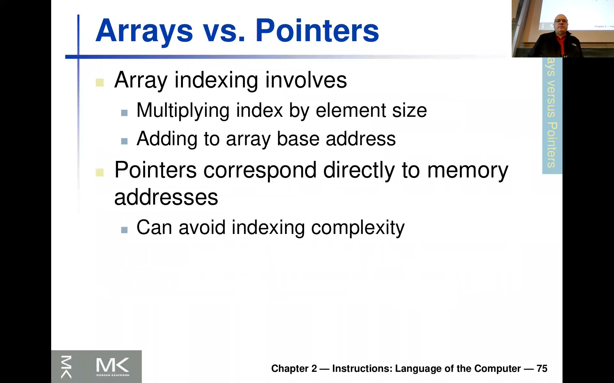
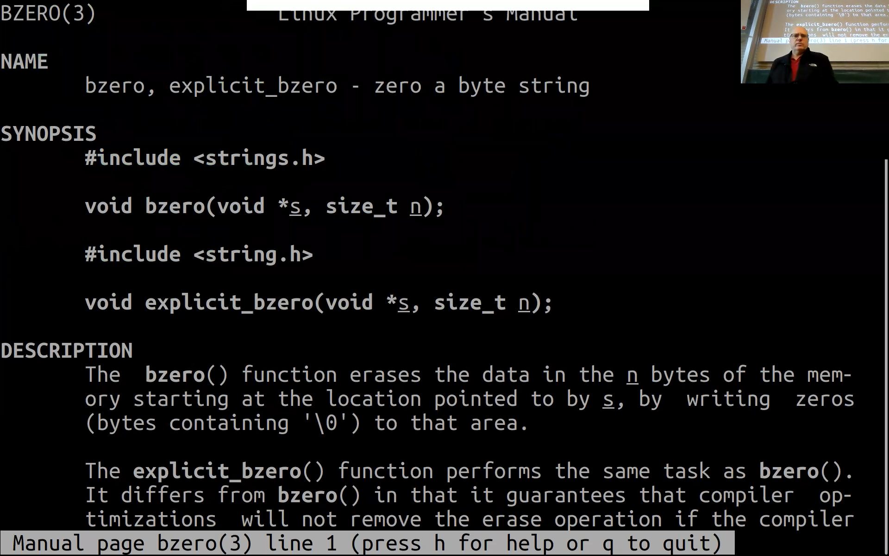
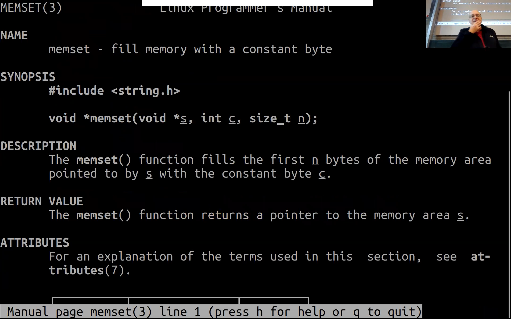
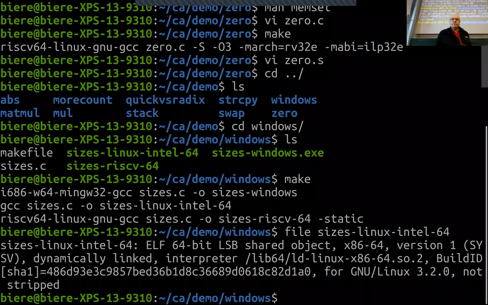
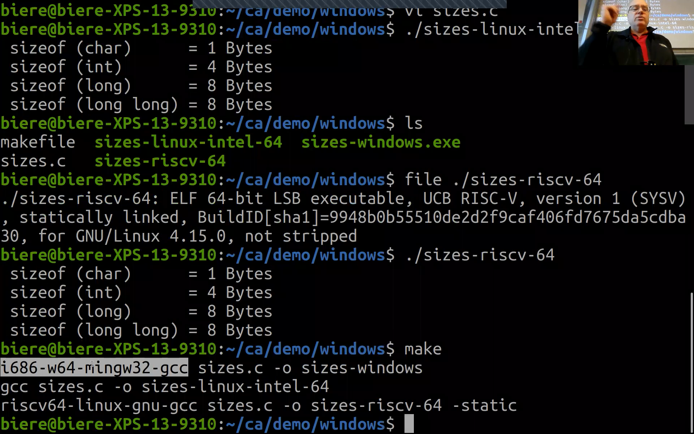
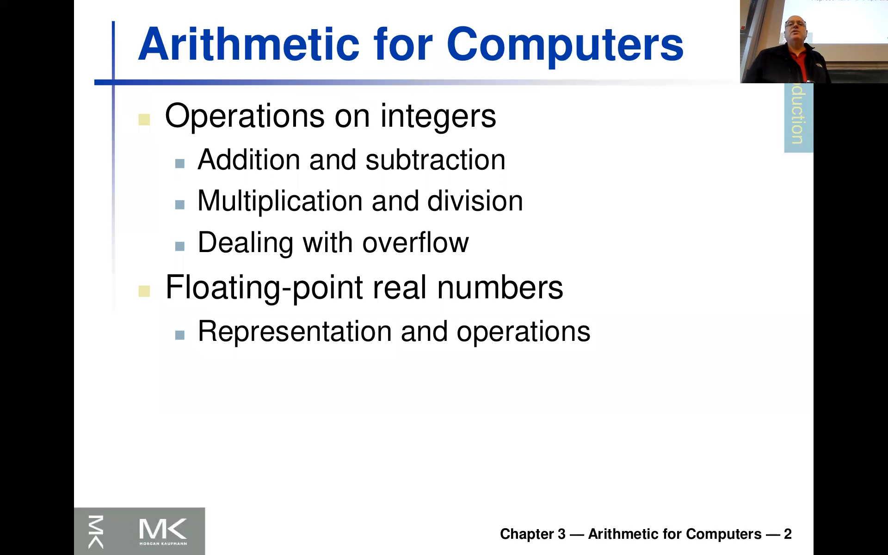

<!-- /home/areo/Videos/Rechnerarchitektur/Computer-Architecture-Chapter-2-2022-11-17-slide-65-to-92.mp4 -->
<!-- /home/areo/Videos/Rechnerarchitektur/_Computer-Architecture-Chapter-2-2022-11-17-slide-65-to-92_imgs -->
<!-- /home/areo/.config/mpv/mpv.conf -->
[toc]
# ==============0:00:00==============
<!-- - `0:00:00`: the key so on i explained about the linkage last time and and. -->
<!-- - `0:00:18`: this is is liquid left in this term in this a slight set of chapter two so i'll want to go over that briefly so first of all there is some something if you have an interpreted language which originally was planned as an interpreted language said this one or python then you have another kind of. -->
- 
<!-- - `0:00:38`: one level between what we see here on the left and here before am so there's literally em. -->
<!-- - `0:00:49`: am also compilation but then and this compile thing is not really like and am met for further machines is not like the architecture of the processor you could in principle and i think that's what they originally wanted when they invented this java also have. -->
<!-- - `0:01:09`: and a processor which would read that despite calls of java or the old days there were machines which could execute lisp for instance or porlock natively so you could have really am hardware here. -->
<!-- - `0:01:26`: and but this does not seem to be commercially viable and i think the reason is because maybe the market even for java is too small to pull the processor which can only execute java by cordray. -->
- `0:01:40`: and and so that's why i am even though maybe this intermediate them level here is java byte code test this flavor off a processor that offer over assembler it's not and it sir actually it's a little bit higher abstract but he could be on **it's almost like a**.
- `0:02:00`: **assembler** end **it's actually interpreted** so this is **done in such a virtual machine** rate so what you really do is you implement sort of a **virtual processor which executes this byte code**.
<!-- - `0:02:15`: am. -->
<!-- - `0:02:17`: however even when they did this. -->
- `0:02:22`: thirty years ago i wrote i was actually at cmu when bin java was kind of promoted by sun back then and there and there was a big lecture by one of the inventors like claiming java will be sort of the next thing and it **will be faster than c this was his most main point**.
<!-- - `0:02:42`: and then this argument is is probably refuted but er you see it here still on the left his argument which he gave actually am thirty years ago. -->
- `0:02:55`: that thirty twenty five years ago and this is this **just in time compiler** the bite basically the idea is you're **you're compiling into something like a ssampler** and then it's like of course represented in in binary.
- `0:03:09`: and **then instead of interpreting like reading byte by bite** doing what this thing is supposed to do in your virtual machine it would actually then **translate this pieces of byte code into real machine code**.
<!-- - `0:03:27`: end earn. -->
- `0:03:29`: does he have **kind of another compiler here which takes this small virtual assembler and translates it into a real assembler** the right and **down here then you will see the steck from the previous slide**.
- 
- `0:03:41`: and **the main argument was[...]** this one so you'll only compile those things which are hot are actually a son had this sir.
<!-- - `0:03:51`: i actually made this trademark and it's not oracle. -->
- `0:03:55`: we called it **hotspot compiler** this was the first name of this thing and this already tells you the the main idea here so at runtime right you can **monitor how much time is spent in which part of the code** trade and **then you would only do this just in time compilation for that part which is hot** rate which **is executed...**.
- `0:04:15`: **often**.
- `0:04:16`: and and then and then **was the reason why twenty five years ago they claimed that this would even be better than like the compilation we've looked at before it's because[...]** you could em then even look at sort of like maybe lang pieces of program called witches are executed very often and.
<!-- - `0:04:37`: and in compile them more optimized for the specific way they are used re princes it might be that this and if case which is executed ninety nine percent of the time and in that particular case a list of one one particular variables of his concert. -->
<!-- - `0:04:52`: okay now you what you could do is you could earn a compile only that part which of the print right to actually partially compile the program. -->
# ==============0:05:00==============
<!-- - `0:05:02`: and this is the idea with this just in time so the only kind of during runtime start compiling some part of the code in there could be basic blocks that we already saw but there's something else what if this kind of traces of this kendall spent multiple basic blocks where you would take like some execution the basic block on net. -->
<!-- - `0:05:21`: if another one and then you can actually inline those. -->
- `0:05:25`: and and and even here you see set aside if an effect of that if **they could even sort of link in the code[...]** you see we saw this on the previous slide here this code is always separate from this code into dynamic linking.
<!-- - `0:05:41`: ray this was the library code even if you kind of linkage to then yet there's a streak of waiting too but you can never inline that code right he cannot inline that code into that one and therefore making the maybe the the court that the comp the portal called code more compact while while here you can read because everything is anyhow virtual right. -->
<!-- - `0:06:01`: to the library code and the other code and then at runtime you see oh this guy calls always this goes very often to let me just inline that. -->
<!-- - `0:06:10`: and that was the promise back then bye bye bye son engineers it it's as as i i also thought it's possible but like it's not completely true so like usually if you carefully m half from some high-performance serve it in as if a high performance application and you want. -->
<!-- - `0:06:29`: two. -->
<!-- - `0:06:31`: i get it very fast on java you will have a hard time and of course like for compared to somebody working directly sort of closer to the machine cnc or not so i would they would say you usually will not be able to get close to a factor of two something often often slower yan and the python is even worse than this but it's low. -->
<!-- - `0:06:51`: like similar things apply here so people actually want to do the same so they want to to compile fence python or javascript javascript this was a very important application and also in this way right so this idea is not that the site gives you like effect or ten improvement but you don't get close to that of what you what you want to. -->
- `0:07:11`: expect any other source i want to mention here that sort of what we're doing now **in the rest of this class were looking really kind of at the interface of real assembler vs processor but the same concept exists like one level up for this interpreted languages**.
<!-- - `0:07:31`: all right and er yes er and this inlining m i i is explained here maybe with this this one example series so this is from a swap of two elements which. -->
- 
<!-- - `0:07:47`: am. -->
<!-- - `0:07:49`: and like an eraser you have this array and you want to swap nice to think so i think i have put the code also on the on the. -->
<!-- - `0:07:58`: on the next cloud but i'm not sure i want to. -->
<!-- - `0:08:01`: really a demo it here because it's like not not much different from what we saw before and we'll have some more tim was later and so on. -->
- `0:08:10`: greater the swaps to elements in the array talk to elements at the position key nk plus one end and **it's used here in a sorting routine in this one here** okay at **in this loop** right what i just explained with this sort of **inlining is very important here[...]** re.
- 
- `0:08:30`: because the compiler really wants to sort of not really a call every time this dysfunction with his stick frame frame point of what we did before but kind of delight there have put this coat then a really flattened this coat and and really sort of plaque in the the definition of swap inside of the library then **compile this swap**.
- `0:08:50`: **into one assembler block** work.
<!-- - `0:08:53`: okay and not call the swap of course you can call it in then you need to do this this thing he with the saving registers and everything great that's like wasted cycles. -->
- 
- `0:09:04`: and **if you compiled without optimization this would actually happen**.
<!-- - `0:09:09`: re you would call dysfunction for here swap all the time but is of course way better and this is a typical example we're going to later see another more prominent one this this matrix multiplication where instead if this is the sort of the thing which is executed most often write clearly here and in that one you don't. -->
<!-- - `0:09:29`: one to one call every time and to set up this called stakes and everything. -->
<!-- - `0:09:36`: okay and then. -->
<!-- - `0:09:39`: right and and and now you probably know why right because you want to avoid this or this code here for the for the saving and restoring the registers and yeah and then add the other thing which which are the other reason and this is what i said this was the promise by by i think he was caught that he called gosselin in twenty five years. -->
- `0:09:59`: go for java well if you think about you see this **code here is maybe very generic but if you plug it in maybe here into the loop you have lots of different instances and maybe there are other opportunities for optimization** is n**ot just that you avoid the call** but may.
# ==============0:10:00==============
- 
- 
- `0:10:20`: other optimizations possible there was the promise back then and yeah **if you could do this across dynamically loaded libraries this is what the jit compiler allows you that was really appealing**.
<!-- - `0:10:35`: and then yeah so so i think this concept is interesting like your java promised if needed not really completely deliver in terms of speed there are other reasons why java is good and still survives but that was not the kind of killer argument for java that you're faster than c. -->
<!-- - `0:10:54`: c or c plus plus. -->
<!-- - `0:10:57`: end am. -->
- 
<!-- - `0:11:01`: okay so. -->
<!-- - `0:11:03`: one more look at this compiler and. -->
- `0:11:08`: and naps a a you can earn and you can chew it lately the **parameters for the compiler you can play with** end end or.
- `0:11:19`: this **inlining we just talked about is of course something now done aggressively by compilers** 'em what was also pretty interesting as you write if you implement c plus plus the most general way is like in java right there the methods directly in the class definition and then these methods actually didn't need to be an inlay.
<!-- - `0:11:39`: lined so so kind of simpler processes already built into the language that you should do that and in that slight then used by are already here by of course like a one so this is the optimization liver and then in and so what you see here is as an example is this sir. -->
<!-- - `0:11:59`: i think it's his sorting benchmarks end in like four four one one particular herb sorting though. -->
<!-- - `0:12:08`: array which is sorted end. -->
<!-- - `0:12:13`: and it's an old compiler and odds are machine actually from a modern twenty years ago and this one here is the the default performance right there in the performance is measured in seconds like walker of time and then if you switch on optimization with the compiler into some of these tricks like we just discussed. -->
<!-- - `0:12:31`: it goes up to one. -->
<!-- - `0:12:34`: the like are almost factor two point five end and so on end and then to one. -->
<!-- - `0:12:42`: and like stays there actually there's there's like or not like because the program is so simple like a o three does not really give you much however what's what's happening here like an absolute performance is that the m or the instruction count goes up so all three would be more aggressive sort of maybe enrolling. -->
<!-- - `0:13:01`: the law bright in is through some more specialization rate because it is good to cases and then duplicate the code for this case and that one and then the optimize it that's why am the instruction count them could actually go up and are yet clock cycles against minimally down right from one level to the. -->
<!-- - `0:13:21`: next one so in in my earn kind of programs m this is slightly more pronounced i would say like ten to twenty percent and the reason for that is because then of course like i'm i'm trying already to to help the compiler right then and the old one does not take the opportune. -->
<!-- - `0:13:41`: need to help the compiler to optimize so much and yeah. -->
<!-- - `0:13:46`: and then the the the clock cycles per instruction at but at this is an old machine rates there where you could the compiler would know more about the machine than nowadays. -->
<!-- - `0:13:57`: i am would them. -->
<!-- - `0:14:00`: there would also go down slightly with his o three so anyhow so what what what what what this survey or experiment shows is the metrics we learned i think it was this that in the first week matures gave this this sir. -->
<!-- - `0:14:14`: m. -->
<!-- - `0:14:16`: this part these metrics could be misleading right because you would have of course you would need to switch an optimization end and air in order to to you get different in behavior so the compilers important air for performance serb measurements of this machine. -->
<!-- - `0:14:36`: in optimizations and of course like that's what i just said rate so. -->
<!-- - `0:14:42`: if you pig to this implement the same thing no inch of our right in and then you compile a compare it to to the c version then you get said if m. -->
<!-- - `0:14:53`: with his bubbles are actually pretty goods them a blake a performance with this sir. -->
# ==============0:15:00==============
<!-- - `0:15:01`: jit compiler right is hotspot compiler or the almost match the optimized c version. -->
- `0:15:08`: okay is it interpreted you like really like effect of ten small purse lower light are actually probably more than a factor of ten so he doesn't really say precisely am okay so this is typically rates are likely to have a **scripted or interpret thing it will be at least vector ten slower than**.
- `0:15:28`: **the compiled version** and then if you use a virtual machine it still sort of not as good as if you would just just a second or if you would from compiled with optimized sql is the of.
<!-- - `0:15:52`: ah which compiler is used is ok all of our yell i'll come back to their question what the compilers also differ yeah that's actually also important but there's like a good use to that so i'll tell you in a second. -->
<!-- - `0:16:05`: i am however and then look at the second one this was bob resort and this this bubble sort here is then. -->
<!-- - `0:16:13`: am is of course bad right as you all learn the algorithm course is quadratic if the implement the same benchmark that you see like it's a bit cheating a bit so you would like really normalizing it doesn't make sense because there's laker that the epa like a difference in everson between these two which quote crossed by this site. -->
<!-- - `0:16:33`: of the array array it's not just that if a constant the difference were here you would would assume that this artist constant like them would not change if you're at a sought more or less the. -->
<!-- - `0:16:46`: the of the earth numbers re. -->
<!-- - `0:16:51`: anyhow so it's it's it's kind of comparing and ypres and oranges little buidling venue kind of look at these two things in particular this last one here and there but but yeah it's okay for the same sized array rate which which i don't know it at the moment but like you take the the the debate as base. -->
<!-- - `0:17:10`: lang you take the c or the anonymous sea end m. -->
<!-- - `0:17:15`: and here suddenly you see a big drop this is again em like close to affect ten and this is properly fixed or fifty or so and the reason here is well because earn when you do this procedure calls right what you need for a quick sir chris hoy is recursive this is way more expensive for this virtual machine. -->
- `0:17:35`: keen for the script the things than than if you would do what the be sold what the process really can do right like the saving in this registers an end so because you **need to sort of restore the virtual machine state instead of restoring just this processor state** may be the best end also the **processer is of course optimized for calling**.
<!-- - `0:17:55`: ling. -->
- `0:17:57`: **functions and returning** rate this is even in the act like me be disgusted rated like **this ijlr instruction is optimized exactly for this purpose**.
<!-- - `0:18:08`: okay so so you see see that the point here yes are there it's possible to get almost as fast java ee a program running as the optimized c code but only in very specific circumstances were actually yeah maybe you don't really use the full power. -->
<!-- - `0:18:27`: of of java anyhow right because it's just a puppet saw with the integer arrays. -->
<!-- - `0:18:34`: and right end in and so here is the speed up or versus the the public saw the kicks-off with this the publicise speed up end and it's also clear that sort of 'em. -->
<!-- - `0:18:49`: you get like a huge improvement just because of airbases so it's ever seems most important to you this is the lesson second one is still sort of language okay now back to your question what about compiler yeah of course compiler makes a difference of when i was convinced there was actually on the same floor a group from oracle. -->
<!-- - `0:19:09`: a building this next generation java compiler for for oracle. -->
- `0:19:15`: enter they want to beat of course this hotspot compiler and they're making progress of course they also improve sort of java compilation jit compilation they have a **trace compiler** that's what i mentioned before not just like the spaces blocked sinks am four and gcc m.
- `0:19:35`: as a four foot four c it's actually am a pr it was pretty stable so on in the old days like **intel compiler for instance was slightly better for high performance computing** am but nowadays and i would claim that everybody is kind of using gcc.
<!-- - `0:19:55`: this is completely true that just ridden before for some time. -->
# ==============0:20:00==============
- `0:20:00`: so **gcc became sort of the standard and it's a and kind of the most that produces the fastest code** except of course like **people move to this llvm infrastructure origin the four am came out from a project and was used in apple and now it's also like available the like here**.
- `0:20:20`: r and d to actually exchange ideas and em but by my personal experience for this like high performance stuff i'm doing is that the **gcc is usually like like maybe five percent better** rates it seems that this and all three are optimization which has been there for a long time gives you a little bit mischievous.
<!-- - `0:20:40`: and but it's not like you need to have an entire compiler to get the best performance or microsoft compiler. -->
<!-- - `0:20:48`: let the good news rates it seems like everybody's is now. -->
<!-- - `0:20:53`: getting to that that compiler. -->
<!-- - `0:20:58`: alright. -->
- 
<!-- - `0:21:01`: okay so you cannot do this in isolations of course you need to look at harrison's unity to look at languages and in turn. -->
<!-- - `0:21:11`: yes and and yeah this is the second point this optimus the effect of compiler optimizations is also depending on on which algorithm is you if you are using and maybe if you take one one thing away from this class is to you get a feeling like what's like happening down there at this some interface between the pros. -->
<!-- - `0:21:30`: besser and the assembler then this will kind of make you a better programmer because you can of course like in terms of producing faster code because you can take into account what's like supposed to happen on the low level. -->
<!-- - `0:21:46`: alright. -->
- 
<!-- - `0:21:49`: am yeah there's one thing a witch and. -->
<!-- - `0:21:53`: warehouse i have a demo and this is erie where this pointer am so. -->
<!-- - `0:21:59`: and then yeah probably i mentioned this twice already but this is kind of one of the main key points in this them. -->
<!-- - `0:22:08`: i fought for c actually that because see it c kind of had this invention the sort of an erie is the same as the point you're actually seeing technically you can actually without cost user of an airy valuable as it is a pointer and in vice versa. -->
- `0:22:24`: and and and then of course **on the assembler level pointers is all there are right there no arrays** just have pointers so that's why there's a kind of a mapping from a form pointers to.
<!-- - `0:22:38`: and to to erase array end em i've showed you already this string copy last time i saw you one more so it has the same flavor so all alpha demo with it and there's one more point you will you're going to see in a minute okay you remember the string copy thing this was this thing where we. -->
- 
- `0:22:58`: take took purchased like in a string despite from one array end to the other one and then **the unoptimized version would[...]** always add the base address of the array add the index like here's an index and then look up in one array and take the base address of the other array plus the index ok.
- `0:23:18`: and then store it or opie and the **better version you did the following[...]** site would have a point in both a race and then both a race which is both pointless would just walk the race and then you'll you avoid an editing like this this sir is adding instruction like the adding the debate.
<!-- - `0:23:38`: nice address of the every plus the the i. -->
<!-- - `0:23:43`: and we're going to see the same here with this one but i'll also your demon with this because that's like em. -->
<!-- - `0:23:51`: you can of course like also go back to the slides if you want to do this. -->
<!-- - `0:23:56`: alright. -->
<!-- - `0:24:03`: so it's a saw on the slides it's called a clear i call it a zero and are because of zero out from the memory em there's actually one am. -->
<!-- - `0:24:15`: ah sorry there was a p zero. -->
<!-- - `0:24:19`: the function which exactly does the same in a certain sense it. -->
- 
<!-- - `0:24:27`: and the. -->
<!-- - `0:24:29`: that's why i quoted zero and m. -->
<!-- - `0:24:33`: right so it looks like that. -->
<!-- - `0:24:37`: he already have the worst in which. -->
<!-- - `0:24:40`: as i changed changes in this complete away when i put the forty two there the ceiling minute. -->
- `0:24:48`: ok computer puree and maybe already late by seeing the sequel you know like what because you were him from the stream copy what what the compiler with turin said **would not add always in the loop the i it would[...]** really compute the end than the beginning.
# ==============0:25:00==============
<!-- - `0:25:03`: and then em increment this point up by four here. -->
- `0:25:09`: and input a zero there ray is he already this optimism this is what the compiler flickers all gray so it's good enough to do this of course m m s as i said before or that **it would be better to do something like that** or an equal a a plus in and or not.
<!-- - `0:25:28`: what's the story he different from bend. -->
<!-- - `0:25:33`: and the people as plus. -->
<!-- - `0:25:37`: right so this is like the kind of if you program it you this is what the compiler does for you this is the better way of doing it right i think you understand now why why right because er yeah and then and this is the thing i'd say is a set say now the third time this people ask us is the release of the. -->
- 
<!-- - `0:25:56`: the invention of c or over kind of assembler because this people hospice and has the memory address and increments it by four why does it know that it imcremented by four well because integers are four bytes ray. -->
<!-- - `0:26:12`: in the assembly instruction you'd just need to make sure that you add immediate for writing not immediate one. -->
<!-- - `0:26:20`: while here if you really would implement this in assembler right you would increment one but then you'll need to add it to the basis for a unibody didn't need applied multiplied by four and edit the base address of the array. -->
<!-- - `0:26:33`: alright so or so. -->
<!-- - `0:26:36`: now what do we get if ye are compiling what do you think. -->
<!-- - `0:26:42`: what i hope is worse because otherwise i need to go to my office machine because i did this before. -->
- 
<!-- - `0:26:48`: oh there's no loop at all re. -->
- 
<!-- - `0:26:52`: you see what's going on. -->
- `0:26:56`: the compiler did something completely weird it **calls a function instead[...]** ray.
<!-- - `0:27:04`: and. -->
<!-- - `0:27:08`: a a a zero remains the same a zero is sir. -->
<!-- - `0:27:12`: the address of the array right. -->
<!-- - `0:27:15`: a one becomes from a zero and a two is sir two times shifted a one. -->
<!-- - `0:27:25`: here's what i said anybody understands what's going on well let's have a look at memes said. -->
- `0:27:34`: yeah **memset is a function[...]** implemented in em like it is it's a library function right so in principle it's in the in the library and actually it's like with a string copy the compiler would would probably not what it has this is one important one so it might actually.
- 
<!-- - `0:27:53`: the really produce specific code just for this function instead of calling it so memes it is a standard function like one of these this a very low level functions with shrimp just takes a point to start. -->
<!-- - `0:28:09`: and the number of bytes to this end here's bytes not not words remember we shifted this thing by two later we might apply before. -->
<!-- - `0:28:19`: because we gave the number of integers in this this array. -->
<!-- - `0:28:23`: so now we need to have four times more bytes zero out instead of in ok and then here is m. -->
<!-- - `0:28:34`: this is a little bit misleading but this is a character ready to bite right this is just like because it's like legacy so so it says an inch for another bite is from his argument. -->
<!-- - `0:28:48`: okay so that what this this function does irk you see what it says description it fills a kind of starting from here to here in bytes by zero the compiler just figured out that your code actually. -->
<!-- - `0:29:01`: and thus this rate and the reason is because it's soul soul common idiom also like if you think about what some of you program in c plus plus rate he writing c plus by some strange code which would end up filling memory by zero was re because you do a complex truck or whatever you say then might still like the compiler might behave. -->
<!-- - `0:29:21`: to figure out oh i can just call this a meme set and then what's actually happening and we're doing to this discuss it us in this lectures. -->
- `0:29:30`: this **memset is specialized for every architecture[...]** for instance this machine is the only machine i have has this avi exe file from the twelfth air which is sir which into five hundred twelve bits are a like in one with one one actually an assembly instruction zero.
<!-- - `0:29:50`: our the copying so we're going to look at this in the context of metric because in principle the compiler could now take this man said and figure out oh and this machine i can to five hundred twelve bits. -->
# ==============0:30:00==============
<!-- - `0:30:03`: in with one clock cycle it's not really wants but in principle one or two. -->
<!-- - `0:30:10`: unless of course we fostered in our implementation which would go there and like four bytes and put a zero or in all these the default implementation of that one which causes one byte by one and input the zero in your rates are like five hundred twelve at once is better. -->
<!-- - `0:30:26`: okay and then you guess what why i did this sir forty two re. -->
<!-- - `0:30:32`: this is not zero anymore just put forty two everywhere. -->
- 
<!-- - `0:30:39`: yet and when i did it on my office my senior she does it figured it out he could also use this meme said. -->
- 
<!-- - `0:30:46`: but this is not built into the compiler. -->
<!-- - `0:30:49`: redundant and then of course like think about it like that like this effect you will only see if you look here at the simpler rates or for some reason your program could be five times faster and you have no idea why. -->
<!-- - `0:31:00`: so so social you need to look look into this thing or you'll at the very. -->
<!-- - `0:31:05`: nor will ever. -->
<!-- - `0:31:08`: alright. -->
- `0:31:13`: and and **you see already this is the point version[...]** re because if it's for not one enter it also compiles or if **a five is the end** ending is thought in this temporary five
<!-- - `0:31:29`: alright. -->
<!-- - `0:31:32`: okay this is what i wanted to to discuss about this i think. -->
- 
<!-- - `0:31:38`: yep any questions to that part. -->
- 
<!-- - `0:31:44`: and anyhow it's also it's really a highly recommended that you play with something like this right he can do we can really do simple dumping if you're if you have installed or a cross compiler it's it's like idowu it may be more convenient to play and goodwill because of the dare you see exited. -->
<!-- - `0:32:02`: two things are on both sides and you can change a little bit in desert like so i just am at play a bit with this got pulled this is my recommendation here are like if you want you can also gleefully like idol here with the. -->
<!-- - `0:32:18`: am. -->
<!-- - `0:32:22`: with his cross compiler. -->
<!-- - `0:32:27`: okay. -->
- `0:32:29`: and now we get to a point there and i want to talk a little bit about the **history of instruction architectures[...]** and m.
<!-- - `0:32:44`: it's already in explained this mips and is the er. -->
<!-- - `0:32:51`: am commercial like it was was the first implementation of this risk idea actually by the two guys there for who are the authors of our book we're using end them. -->
<!-- - `0:33:03`: i am. -->
<!-- - `0:33:05`: and this sir mips like and was used in many places so so it was. -->
<!-- - `0:33:12`: and an architecture you have the four kind of embedded in processors and i learned that for investing western digital had all their hard disks had a mips processor in it so this is like very common like like you see like maybe for washing machine you don't need the mids. -->
<!-- - `0:33:32`: a real processor may be like a microcontroller is enough but for the artist you want to have a new possessory that the nanny would have used that one for instance and in particular for thirty two bit applications. -->
<!-- - `0:33:47`: and to do so so it was kind of followed this principle the generated by these guys like keeping things reduced like a simple one the ordinal optimizing the instruction set architecture them to to to enable. -->
- `0:34:07`: **enable fast hardware...** where instead of like in the old days i explained like it if i b m times it was important to to have an assembly such that the human could write it like this is not necessary because **...you can use the compiler**.
<!-- - `0:34:23`: so this was the the em the idea of this mips so this thing is commercial so this is why i wanted the pointed and commercial means it's not a free. -->
<!-- - `0:34:34`: it's not a free architectural you cannot use it you need a license it actually just in order to sort of implement hardware implementing this you need to licensee and this is different for risk-free and it's also the the big opportunity of this risk five. -->
<!-- - `0:34:50`: am but of course both acronyms have a play a little bit with the with this one has of course the m million instructions per second in it rate which is the face of that really like the main purpose of this mips processor was never meant to be a high performance processor. -->
# ==============0:35:00==============
<!-- - `0:35:10`: i am. -->
<!-- - `0:35:13`: this reduced instruction set architecture and i dunno why they have the make it's imminent risk like the that something is dangerous. -->
<!-- - `0:35:25`: am ok anyhow as i saw it so mips is kind of in in spirit the predecessor of risk except that it was common for right until today am and now many companies are actually thinking about moving towards risk five because it's open rate so this investment. -->
- `0:35:45`: **western digital really announced[...]** that they move all the hottest to his pipe besides and others are doing the same like.
- `0:35:54`: and even **intel[...]** as i explained has this new fab in in mcavoy they want to have or offer risk five am decides re so also the the idea is like having a european version rates like a completely free one.
<!-- - `0:36:13`: and but it's very similar in a but they're like a subtlety of subtle differences which you saw already so i'll spell i'll explain that in in a minute more were sort of this risk five is even better in in in in these principles of being said if allowing optimized hardware raid. -->
<!-- - `0:36:34`: and ten years that i get different am i. -->
<!-- - `0:36:40`: here they are different conditional branches them in are in risk five they're there like this m and m you need to make a yet there is like less game and there's also this is set this actually existing risks over think we're going. -->
<!-- - `0:37:00`: to talk about this later. -->
<!-- - `0:37:02`: alright and here you see d. -->
<!-- - `0:37:05`: kind of the m what you looked at already at this machine encoding of the sender and which is of course part of the architecture and and. -->
- 
- `0:37:20`: em yes so so we we see for instance that the **immediates are all up here in riscv[...]** and they explained this already so you want to have this sign bit obvious you're at the same position.
<!-- - `0:37:32`: and adam was not the case here for mips and erp and but is very similar otherwise right so you have for this resource and a one difference i think where can i pointed out them is that these registers are always at the same same space ray and. -->
<!-- - `0:37:53`: right so this already very similar and and now the question is what did the other stu likes of this mips i i think when doesn't have an ear there but i think it's like from the seventies eighties and. -->
- 
<!-- - `0:38:12`: and there's of course the most important and that the instruction set architecture which is the one buy into and. -->
- `0:38:20`: it's **not the oldest one the i b m as we discussed is still in use today**.
<!-- - `0:38:26`: i am and it started there in in in nineteen seventy four or we're going to have fifty use actually i just realized that very soon in them. -->
<!-- - `0:38:39`: this was an eight bit microprocessor and then the thing which why this call was x eighty six. -->
<!-- - `0:38:46`: or is from seventy eight so in six years we're going to do fifty years of that and that's because it had this a sixteen bit version three so eight pid controller and is he all registers are a bit what can you do with this. -->
<!-- - `0:39:03`: okay but but maybe for some application that's enough right also your memory can also only be address space of two hundred and fifty six mi. -->
<!-- - `0:39:12`: and sixteen was already made way bigger this is sixty five thousand six hundred and thirty six a memory address and so on and and the name from addis eighty six years still sort of flake i used until today and then three years later and two years later so i can compute. -->
<!-- - `0:39:32`: they em added floating point coprocessor that's also pretty interesting so the seventies serve as we're going to discuss and maybe maybe not today but next next a beak m. -->
<!-- - `0:39:46`: floating points is something which it has always been important actually the first computers lake close to the second world war were used for numerical computation rate and so floating point was always like one the very beginning of computers floating point was there but people did not agree on common forwards until like the late seventies. -->
# ==============0:40:00==============
<!-- - `0:40:05`: and to around that time also geared the floating point processor core processor came out so what happened they would put two chips on the board and and actually when you wanted to a floating point addition you would ask through some busts or whatever over the main board the other processors compute these two. -->
<!-- - `0:40:25`: things there was of course lol but this is the sort of still far he was still foster like doing it this way then then computing the floating points in software. -->
- `0:40:37`: and then around eighty two came kind of a kind of the real pc which is the serm or two or eighty six and this had been at twenty four i am a bit address and mm you this **memory management unit[...]** so we're going to talk about this later this is an isolation of.
<!-- - `0:40:57`: processes like a virtual memory. -->
<!-- - `0:41:01`: it added it had a strange segmented memory mapping which i always forget how it really works and then i look at it and then forget it again so it has from back then there's like as a a segment segmented way of addressing memories and then so. -->
- `0:41:17`: a **twenty four bit are sixteen megabyte** ray in there.
- $2^24 = 2^20 \cdot 2^4$
<!-- - `0:41:26`: and and here in in am eighty five they finally did something which is milk more closer to this mips machine which was probably also around that time this asserted to beat worship version and that's called an i a thirty two and term. -->
<!-- - `0:41:44`: and this is the original and i am into architecture like which has been in use for for many years and to. -->
- `0:41:55`: alright **then[...]** it's a in in a hurry and roughly when i started actually the study around that time here and they came up with this for eighty six and this thing here now took ideas mostly from ivy and from this super computers and actually pioneered.
- 
<!-- - `0:42:14`: by other companies motorola in the us. -->
<!-- - `0:42:18`: and er i be empowered pcs them ready took like ideas from. -->
<!-- - `0:42:27`: high performance could have like supercomputers and put them into sort of pcs in consumer products and that's pipelining so this is the first thing we're going to look at them in the kind of real internal architecture part of his class then of course and caches like there's a level one cache. -->
<!-- - `0:42:47`: nt am floating point unit is also in the in the same die the same processor. -->
<!-- - `0:42:54`: and they had like come like the competitors there were like a couple of companies implementing this architecture. -->
- `0:43:02`: ugly one and wear headset have some connection to central it was to spot back from intl like last year there was as like currently there was only **three left[...]** the empty sent over in the indian and then the third one in texas was just bought by into.
<!-- - `0:43:21`: last year. -->
- `0:43:24`: alright and then pentium the first pentium and we'll talk about pynchon back next week to em so this is a super scale are **super scaler[...]** is is a very you have a multiple xxii houston units are like for instance you can have two editors and you add like two numbers in parallel.
<!-- - `0:43:41`: and and there was something already back then and i think there's another slight and little i'll come back to that because i mentioned the really this is multimedia extension that's what the what they called it back then. -->
<!-- - `0:43:56`: and around. -->
<!-- - `0:44:02`: are they kind of sometimes called streaming units of the architecture or like the if your rp alfred show you this so you can do this also on on your machine to check what what you have if you do ls cpu. -->
<!-- - `0:44:17`: then you will get here at the end. -->
- 
- `0:44:21`: some **flags which say what kind of a instructions the cpu allows** in and you see here like this **avx and their different versions** that slightly sir **multi media extensions this processor can do actually**.
- 
<!-- - `0:44:40`: enter. -->
- `0:44:42`: yeah **and then[...]** pentium pro was was like a different em micro architecture and while we are i dunno i didn't read that one but here the the idea i think is that they saw that this risk machine in the nineties in particular sun and all the other companies had like a very successful at.
# ==============0:45:00==============
<!-- - `0:45:02`: the build fast processes and they took some of this idea insight to entered so they realized we want to stick with this like from the seventies old an instruction set architecture but we still want to have the benefits of the offer 'em kind of a reduced instruction set said if you have a simple. -->
<!-- - `0:45:23`: the science of it to to make the harper simpler in this way faster. -->
<!-- - `0:45:28`: and it started here with with these guys with incl here okay this is it this is called streaming seemed the extensions but it goes into the same idea we are as here so so this mm x was really used for games in four or doing projects faster so you can think of this serve. -->
<!-- - `0:45:47`: for instance. -->
- `0:45:49`: **natively computing with pixel values in a parallel fashion or something**.
<!-- - `0:45:56`: and yeah and then another step into this direction of making the internal architecture simpler was there the pentium four in around two thousand and again a new set of streaming like the vector instructions they also sometimes called. -->
- `0:46:14`: and and **now comes the fun part[...]** which i want to point out m.
- 
<!-- - `0:46:20`: am actually internet it's one am. -->
<!-- - `0:46:24`: the the process hurt and i forgot how his quote was called there a sixty four bit processor. -->
<!-- - `0:46:31`: and a dead one completely for itanium it was called maybe you heard about itanium. -->
<!-- - `0:46:37`: some people realize that twenty years ago that you should move to sixty four bitrate like thirty two bit like like the move you see from eight to sixteen to thirty two and now in in around two thousand a little later everybody realized we need to move to sixty four bit. -->
<!-- - `0:46:52`: i also buy the wake up like back then at that time the first access to the machine with a sixty gigabyte memory which was not possible so did the machine. -->
<!-- - `0:47:02`: and an entire set like the weird we're going to change the architecture we were going away from x eighty six so they came up with something we're going to look at this later for a very large instruction word idea which was implemented in itanium processor. -->
<!-- - `0:47:21`: but this commercially completely failed it's very funny as a dick for some years ever was sally was selling machines with this but now i think they are completely out of business or maybe they're flame some legacy machines there and amd said a kind of bouquet were just. -->
<!-- - `0:47:40`: it's like sticking to this x eighty six it's a beta adhere to change the architecture i was just extending it. -->
<!-- - `0:47:48`: and they were successful and it's very far from funny that sort of this new architecture is now called the mv sixty four. -->
<!-- - `0:47:56`: and then intl of course gave up and also adopted the compact competitors architectures for it's own one. -->
<!-- - `0:48:05`: and. -->
<!-- - `0:48:08`: for its own array processors and and it's a source of whatever the story here is that this serm architectures live a long time right and the main reason is you have these old programs who run now and maybe in ten years or twenty years would still run and if you change the architecture and. -->
- `0:48:27`: it's it's completely up to you after we kind of recompile everything whatever now guess what like there's accompanies i see a **mac apple laptop...** up there who who **who actually dared to do that they completely moved from powerpc to intl then to arm**.
<!-- - `0:48:47`: arm now and now the now that now they're in at arm and they even doing their own arm beside the only reason why applicant will it because you could buy everything from them right so so everybody has to now recompile software if you want to run it on on this new machines. -->
- `0:49:06`: but for this certain **other business it seems then you see a like a legacy's more important then said of innovation and maybe even speed** and you put the effect of this that into puts i dunno ten thousand engineers and trying to height add to the depth to their old legacy.
<!-- - `0:49:27`: architect and internally do something very complicated just to learn to get this kind of legacy continued and that they can afford it because they they have the biggest market share but now is the time versus the risk and then to have completely changed the picture here and. -->
<!-- - `0:49:46`: do any is this it's why am i explain this the other part via spend this year you see like **every like generation there they have a new streaming version**. -->
<!-- - `0:49:58`: i liked air and the reason for that you can imagine is because like there was more need for media like videos in particular the like over the years i think this is around the time where youtube youtube came around re enter m. -->
# ==============0:50:00==============
<!-- - `0:50:17`: and so this continues in nowadays are they tried to use this also for machine learning even though their day even to specific instructions. -->
- `0:50:30`: okay in the end is is sort of technical elegance is not different from from market success and the **cool thing about risc five is that this might change** rates or maybe in ten years we'll see the dominance men and maybe of the the risk wife or at least architecture.
<!-- - `0:50:46`: and anyhow as you see a little bit of that sauce as a mixed slight i'll i'll i'll i'll admit that yes as i said like lot of his completely forget all these details because i'm not programming on the level of an x eighty six i'm just looking at assembler code. -->
- `0:51:02`: and so it has a **complex setup[...]** and **here this segment pointers for instance they are due to the segmented architecture of this 286** sir what was it two to eighty six and earn it and then they're like urban **when they moved to thirty two bits they had like these guys**.
- 
- 
- `0:51:22`: these guys raid and er there's like a something we don't have and risk five there's a **specific register which has conditions[...]** so maybe we'll see this in some theme was later.
- 
- 
- `0:51:36`: so in x eighty six m and n like like vincent at an ad operation or something else could have a side effect setting one of his bits for instance overflow or carry out whatever then the next assembly instruction can read that bit so in some sense **the add instruction not only changes the**.
- `0:51:56`: **the destination register but it also changes some flags** ray.
- `0:52:01`: am i **in riscv u don't have that they did this on purpose you have to really compute it** and this of course makes things very complicated and if you think about for instance.
<!-- - `0:52:17`: yea and while we'll talk about this x little use of zoo's excuse a chord with a system called ray you also need to clear the skies of course raid so you have like not just the register but you also have this this flex which needs to be preserved through interrupt then whatever. -->
<!-- - `0:52:36`: it just makes things way more complex if you have kind of another instruction as a result of another place in the in the processor and getting the result of that of something then not just this target exit registry. -->
<!-- - `0:52:52`: and em they haven't way more complex m m s l address caught and so they can em. -->
- 
<!-- - `0:53:01`: or do i am all what's what you have here so memory and register as source and as as as as sir. -->
<!-- - `0:53:10`: his target rate. -->
- `0:53:12`: and that's something we can't do so in **in this risk we always have to load then work with it and store it** here **in x eighty six is way more complicated and this makes the assembler programming simpler if you would do it as a human**.
<!-- - `0:53:31`: as compiler is not really that much different. -->
- `0:53:34`: but he makes like **implementing the thing of course way more complex**.
- `0:53:40`: and they also have one thing which is kind kind of interesting **they have a**.
- 
- `0:53:46`: **a scale here...** right so we have **we had only offset like here this displacement plus the r register** which is true but they have something they would take the index register and then scale it you see **the example we just had with a zero would then be done with one instruction[...]** because you take the b.
<!-- - `0:54:06`: bait the base address of the array. -->
<!-- - `0:54:10`: you take the index which was our eye not the p right not the pointer but the index and then you scale it by yeah like four because if in teachers you have kind of inborn instruction. -->
<!-- - `0:54:23`: i was very aware we had to send have move this to to this thing with a pointless re. -->
- `0:54:29`: but now comes the real part grade **this thing will not be executed in reality on this machine because it will be compiled in an internal format which is similar to what we do anyhow and then execute it** right by so that's why **it looks nice but it's just legacy** re.
- `0:54:48`: oh there was another one yeah **you can even do this complex one[...]** and you can do a base address plus an index like we see you in tim's injury than you would if scale is to it sir and he ain't an end to an end and even discern his placement is offset.
# ==============0:55:00==============
- 
- 
- `0:55:09`: and the result of that and because of all this evolution is that **these instructions have different length[...]** three.
<!-- - `0:55:16`: and this makes it even more more complex are they what they have is nippy quixote coding part of this entire process is one of the most complex part they have because they have this strange arbitrary linkedin that arbitrary links i think longest twenty bytes long or something see if they're actually instructions which i think are one byte but i don't know then you have to. -->
<!-- - `0:55:36`: prefixes and unlike previous six four and for locking in for the length thread till you have like bites which tell you the next instruction will be longer are you going to lock it. -->
- `0:55:50`: okay so you can really think of **intel as having kind of a real stream of arbitrary length instructions**.
<!-- - `0:56:00`: alright so. -->
<!-- - `0:56:03`: that makes it it really complicated also to understand and from there. -->
- 
<!-- - `0:56:11`: and yeah i think i said this all already worried so. -->
- `0:56:18`: **internally it would have translate it anyhow to something simpler** and unfortunately we don't know anything about the internal micro architecture of of into what they're really doing.
<!-- - `0:56:30`: and let's us a little bit unfortunate or maybe you heard about the spectre and meltdown things way so those guys who did that they really hit through without knowing how how it's working it'll kind of try to understand what entered internet is doing in order to use the side channels and the same is true for us programmers right soso because of the. -->
- `0:56:50`: **riskv i can really see i can see what the processor would do**.
- `0:56:56`: **but in intl it's more i have to guess and it's really sometimes you look at the assembler have no idea why this is so slow or why there's something** right because you **don't see the internal micro architecture**.
- `0:57:08`: and unless of course **also bad for a kind of a compilers, they don't really have a model of the internal architecture they also have to guess**.
<!-- - `0:57:18`: this brings us back maybe to your questions of a couple of usable go into new of course like what the intel microarchitecture was in they could then they're like implement in the compiler something which optimizes the thing that you would not see but it was a big case split because they have to do it for all this different than was he like. -->
<!-- - `0:57:38`: what would you do if you're if you want to run this on unlike on an intl machine which is fifteen years old and now in a new one. -->
<!-- - `0:57:47`: and of course like then you can compile for the new one of the old one but the basic idea is you want to make this process is so fast that it would execute like this anyhow a fast rate then am. -->
- `0:58:00`: in **in risc...** little slightly different **there you can really sort of reader from the assembler instruction kind of the complexity of this thing**.
<!-- - `0:58:11`: okay. -->
- 
- `0:58:16`: am yeah this one we already saw in the am now we didn't see that the explaining commemorate this **load upper immediate for registers...**.
- `0:58:31`: this was also the step beef example in the exercise room and **the same is needed for pcs for jump because you want to make a jump which is long**.
<!-- - `0:58:43`: and and that's the same thing here. -->
- `0:58:46`: at **this one[...]** we saw on the mips thing am in m a as i said an x eighty six am like setting this flags in this flag register is implicit but it can do it also explicitly you can say set the the zero flag for us.
- 
<!-- - `0:59:06`: since based on on on something. -->
<!-- - `0:59:11`: and. -->
- `0:59:13`: and it's the same now for a for risk five so what does this thing do **set less than[...]**.
<!-- - `0:59:22`: while it **compares the two source registers**. -->
<!-- - `0:59:25`: and if if the condition mate is true it puts a it's a one into the target register and destination register the kids fault the goods as your writer is kind of. -->
<!-- - `0:59:39`: the thing was like an interlude you to implicitly with his flexi with just to explicitly maybe we saw it even in a demo already. -->
<!-- - `0:59:49`: okay then. -->
- `0:59:52`: at of words and i'll have prepared one team or where we need that later for the multiplication and we were making it today as so you can and and i think the reason there is and **this is for a sixty four bit machine, on a sixty four bit machine maybe you have a faster**.
# ==============1:00:00==============
- 
- `1:00:12`: **multiplier which only multiplies two thirty two bit numbers this is faster than multiplying two sixty four bit numbers[...]** of course you could multiply the two thirty two bit numbers with a sixty four bit multiplier and then take out the smaller thirty two bit.
- `1:00:29`: but that's a you still would need to have the hardware or use the hardware for the the expensive heart replaces the forbid **maybe that one takes two clock cycles while the other one takes one** re and that's why i want to give this opportunity to the compiler that detailed the harper by the way i'm only interested in the thirty two bits.
- `1:00:49`: and yet the **same is true for the shift words?[...]** and.
- 
<!-- - `1:00:58`: not sure like laden prepare the sake i could show you harper for shifting but like i think i did descended digitally sign course i'm not doing it here so shifting hartford this is called firms who can google it is bearer shifter. -->
<!-- - `1:01:11`: sir. -->
<!-- - `1:01:13`: and dwight in the heat is locked in. -->
<!-- - `1:01:18`: so when you do this for thirty two bit you only have five heat. -->
<!-- - `1:01:24`: he would flee for sixty four bit it's a six way you sit safe sort of like one one layer and that's why it's faster to do like that too was thirty two bit gift. -->
<!-- - `1:01:42`: alright. -->
<!-- - `1:01:45`: then and i mentioned this already and a couple of time and so there's the new see sources in his documents he does the bass thing which is really just the integers so we looked so far and term. -->
- 
<!-- - `1:02:02`: then arm the processor can support mighty but things like er. -->
<!-- - `1:02:08`: the mighty play application division and remainder this is all kind of you in this em and this is all integer rates of not floating points which is like thirty two bit or sixty four bit then we saw this atomic operations rate ld in se re. -->
<!-- - `1:02:24`: then an f stands for single precision floating point so this will be the topic next week and be for double precision sixty four bit floating point nc was this thing of which like some one of you asked also last time so there's like one version which has only sixteen pit instructions. -->
- `1:02:44`: but if there is truth straight there was a number of righteousness is is is is sir smaller and it's like a meant for yeah **for embedded systems where's you don't need an address space of thirty two bit like sixteen is enough**.
<!-- - `1:03:00`: like for this point for instance i'm pretty sure sixteenth in the in term. -->
<!-- - `1:03:07`: okay and then and so you see like the real architecture is between thirty two and sixty four or maybe the c then any combination here rae i'm in fmd doesn't make sense to combine and and so. -->
- `1:03:24`: you see like if this would be around rs five processor like **linux would here also these flags** ray would say i can support this instruction this instruction synthesis.
- `1:03:40`: and of course like if you compile ab you will need to take this also the current rate because you **cannot generate a double floating point instruction if the process doesn't have floating points then you would need to that in software**.
- 
<!-- - `1:03:58`: alright yes fallacies so that's like a common theme in this a slide set which yeah i think we saw a couple of them so one is sir. -->
- `1:04:10`: and i think this is clear like this but this is the old story of this risk the **promise of risk was you simplify the instruction and this actually gives you opportunities for higher performance** in not like them what's written here this is the fallacy is.
- `1:04:30`: they have **powerful instructions then you get higher the performance[...]** and and.
<!-- - `1:04:36`: actually the only reason why whites still like this is because at first the fall into has this huge huge number engineers doing that right for us. -->
<!-- - `1:04:47`: and because of this market share and you want to keep xavier seeks alive. -->
- `1:04:54`: and yeah none offers like **assembly code for high performance[...]** is not true or add that sir of course clear to everybody but still i claim that you want to understand hall how kind of your program gets translated into assemble and then is executed on the processor to get the feeling like.
# ==============1:05:00==============
<!-- - `1:05:13`: maybe this at one point something which's am not matching what you expect and therefore you get a performance depression. -->
<!-- - `1:05:24`: alright. -->
- 
- `1:05:27`: yeah **this is a interesting one[...]**.
<!-- - `1:05:30`: this is the number of instructions in the x eighty six this was around like. -->
<!-- - `1:05:38`: the the x eighty six re the nineteen seventy eight was this first eight or eight eighty six re and you could just count the number of instructions am at it let us go up exponentially by dislike quite remarkably would you go from low hundreds to now. -->
<!-- - `1:05:58`: now one one one thousand four hundred and and for instance if you would want the writer to will retreats x eighty six binaries. -->
<!-- - `1:06:09`: read it it's really scary rain you would need to read in principle all is different the instruction thousand five hundred. -->
<!-- - `1:06:17`: but i guess what is the largest part of this. -->
<!-- - `1:06:23`: while i hinted it at this is this almost all these variance of seemed the instruction instructions the single instruction made within this vector like the avi exe is streaming the multimedia instructions because like they came up with you and your ones and then you could always claim oh i'm adding that one and then a year maybe my games or my videos. -->
<!-- - `1:06:42`: or foster ray. -->
- 
<!-- - `1:06:48`: okay ah yeah pete for us sets also interesting em but i explained this with his plus four and plus one a key. -->
<!-- - `1:06:57`: and this is what i want to want to and. -->
- 
<!-- - `1:07:01`: one to skip or a tip these design principles before we move to chapter. -->
<!-- - `1:07:07`: air three is around me. -->
<!-- - `1:07:11`: simplicity favors regularity this is the promise they did in the eighties with this risk and i think they are right the only reason why why we don't see it is and so clearly is because the into puts a lot of effort in in in hiding the the success story. -->
- `1:07:32`: they're behind democracy microarchitecture bringing them a pop machine with risk five we're seeing this and you need **good compromises like we saw already like there was this a twelve bit immediate then sometimes you need a twenty bit immediate** and whatever these are the compromises right.
- `1:07:50`: and last but not least it's very important here that you need to look at the whole stack 'em at what the compiler is doing the assembler in **hardware we haven't done yet in the class[...]** and as i said raid there's going to be another level below the assembler and that lever.
<!-- - `1:08:09`: a serb even harder to kind of understand but what we'll look at trying to get into this and optimize this is the part of the art inner architecture of a processor. -->
<!-- - `1:08:20`: of this sir class. -->
<!-- - `1:08:24`: alright so all switched into the next chapter or any questions here this is the roots moist article. -->
<!-- - `1:08:37`: is. -->
<!-- - `1:08:50`: oh. -->
<!-- - `1:08:55`: oh this is this is written in the in this sir. -->
<!-- - `1:08:59`: you can get it with this command file writes others like them yeah maybe i'll show you this even with the. -->
<!-- - `1:09:07`: the thiemo then. -->
<!-- - `1:09:12`: so i also have started this one and if i do a sizes sir. -->
<!-- - `1:09:21`: come on. -->
<!-- - `1:09:24`: should say linux. -->
<!-- - `1:09:29`: glam miss type something no okay then. -->
- 
- `1:09:37`: oh he doesn't say abbott but like for the others for for arm it would save any obviously **it's encoded here in kind of this most standardized...** then.
- `1:09:48`: **you can think of this as almost like a container this elf format is like a format contains like different parts of your program and it's shared? it's dynamically linked there** are many they're making lean tier end and it's them.
# ==============1:10:00==============
- `1:10:09`: **and here is like the architecture so this is a m d sixty four**.
- `1:10:16`: and and so that **this information is here in the file** re in term.
- `1:10:25`: **there's even like a technical issue here when you compile something you might need to implement it for several different processors supporting this or that** rate and **there's this concept of fat binaries where you put sort of different versions of your code or like some subroutine**.
- `1:10:42`: **for instance the multi media library would have different sub routines, one which would only work on that machine which is the 80x512..** grade **but on my office machine which doesn't have that only the avx256 it would use another** one **then there's a switch in the program which would try to get from the processor which**.
- `1:11:02`: **version it is but you can imagine this is really complicated** re and **so by default this would not happen that you would compile in this specific code because it requires actually some low level tinkering so you need to sort of in your program make this case with explicit stuffing automatic**.
- `1:11:24`: yes sir yang by default not using is actually for this matrix multiplication the more we're going to do like maybe two weeks so you will see this again for this matrix multiplication so **if i decide to compile it for this laptop with specific architect flags then you can only execute it there, if i run it on my desktop it will fail...** newfane.
- `1:11:43`: great **because i hard-coded the use of one multi media instruction there**.
<!-- - `1:11:49`: and that's the same of course with the sir. -->
- `1:11:52`: risks risk five thing and of course there's the **most bcommon one which is this the one will which has multiplication doubles...**
<!-- - `1:12:04`: yeah. -->
- `1:12:05`: **locking it has everything[...]** re this is the most common one and so if i use this sir yeah less like like like this one here there is five one.
<!-- - `1:12:19`: so why doesn't it do my top here for some reason doesn't do the top or so. -->
<!-- - `1:12:27`: i am. -->
<!-- - `1:12:30`: no he doesn't say here a bit but but but but in principle this this is the default version which would chase me before the train. -->
- 
<!-- - `1:12:40`: and so in prison you can get it like through his calls from the processor and then that's what your library would need to do but it would need to compile for everything separately. -->
<!-- - `1:12:55`: alright so this is the as standard a problem yes. -->
<!-- - `1:13:01`: hmm maybe since i met at this thing i'll show you the steamer symbol that so i promised this before but i didn't prepare it so now it's on us on the web so this is remember when this table of different sizes and so anxious did this or. -->
<!-- - `1:13:19`: programme here right which which tenor rip right this was the table here which generates this different byte numbers for different types. -->
- 
<!-- - `1:13:30`: and i'm right so we're just printing the size in bytes off and like one char one in one long one long long. -->
<!-- - `1:13:40`: clear bright and earn. -->
<!-- - `1:13:44`: if i do this year when the sixty four bit linux machine it looks like like i said re. -->
<!-- - `1:13:51`: it's like a char is one bite and in this four byte and then this is kind of ambiguous thing same practice in cnc blast was the compiler could that the standard doesn't really say anything about the length of the skies when a minimal sizes or something like since eleven or something but am. -->
<!-- - `1:14:12`: so he could he presumably anything but this is the kind of most most reasonable way nowadays with sixty four bit machines and term. -->
<!-- - `1:14:23`: this service. -->
<!-- - `1:14:28`: this size is risk of the risk five thousand which i compiled to write so this is really a risk five binary and if i run it like this it will call q emo and run it writes it's like really executing a virtual the risk life it's the same. -->
- `1:14:47`: but now if i do it **with windows...** or in this i maybe you saw how i did this there's also one.
- `1:14:54`: a **nice cross compiler for linux which is mingw**.
<!-- - `1:14:59`: gw and that **you can really natively run the result on windows** and to earn this of course i think i didn't do this so you could in principle also make it executable like with q emo but there you just need to to run em. -->
# ==============1:15:00==============
- 
<!-- - `1:15:18`: irvine this compile the version in there you see the main difference rate that this is what i wanted to show you. -->
- 
<!-- - `1:15:27`: okay end. -->
- 
<!-- - `1:15:31`: right so so anyhow so this is what i was was missing is at the most who wanted to this year he went to be well aware of that one. -->
<!-- - `1:15:40`: okay now now to this chapter then no more questions. -->
- 
<!-- - `1:15:51`: oh okay arithmetic for computers this is actually dear to me so you will see so i worked on this and they continue on actually verifying this stuff which is pretty interesting actually hitting this for awhile and then and this also challenge and the pension back. -->
<!-- - `1:16:09`: maybe a reference already is a prime example why why you want to do this. -->
<!-- - `1:16:16`: and tim but for that i'll first need to explain it's limits i'm going a little bit faster as i know like some of you are are new and haven't seen the digital design course but then i gave his course at this one here last year i didn't realize that most of what i talked about in this part were. -->
<!-- - `1:16:36`: was already or at least touched upon in the visual design course and technician formatting will be live with foster now and if i'm too fast then those who haven't seen any basic computer arithmetic they should just stop me now or i'll explain in more detail. -->
- 
<!-- - `1:16:55`: okay so you all know how it works in principle so like you have bid strengths and they represent numbers and then you have two compliments and then. -->
- 
<!-- - `1:17:08`: and and you just like kind of an editing like almost you do in school or for decimal numbers or you get carys or like here's a carry for instance rate and the service carries your generated because one plus one plus this carry gives one and so like ivan overflows to this one. -->
<!-- - `1:17:28`: the flow is carry them goes here and then one then zero blasio plus this character is one but then he doesn't produce a carry right so this is like you should all be aware of that so i'm not going to explain this in detail. -->
<!-- - `1:17:41`: negative numbers use this trick with the two complement rate. -->
- 
<!-- - `1:17:48`: i'm. -->
<!-- - `1:17:50`: so to complement we're going to look actually at at two more ways of doing negative numbers the interesting thing in floating points they do not use to complement into use to other ways of making negative numbers and we're going to have to look at that but this is the classical read yet everybody understands that one right to call. -->
- 
<!-- - `1:18:10`: agreements i'm not going to them to explain this. -->
- `1:18:18`: all right now man one one thing which which brings me back to the **simd instructions** us i think like **eighty percent of this increase was really only due to the simd instructdions** and within a minute why why why why they are white as a potential rate for generating lots of instruction.
<!-- - `1:18:36`: so the sim the instructions of this ideally have slight data which is for instance pixels or redfin a blue colors rate like two hundred to a two hundred fifty six values each that just three bytes you have lots of them because they want to do what meteor or wanted to games. -->
<!-- - `1:18:53`: okay and then and. -->
- `1:18:55`: they come like this once while rgb become **always like come in arrays...**.
- `1:19:03`: **like you would have pixels or whatever**.
<!-- - `1:19:07`: and we'd have pixels of like an eight byte which like a red value for instance or a bytes of a m of green value and then what you do here and then that this term here of single instruction multiple data. -->
<!-- - `1:19:25`: and. -->
- `1:19:28`: you **have these some vectors of say red and you want to do the same operation of all of them in parallel[...]** okay so you want to surf take for instance two such rectors and you're at them or take the average of whatever.
<!-- - `1:19:43`: alright so not just like one individually but like each one imperil. -->
- `1:19:48`: and **if you do this on a classic computer[...]** you would need to write dinner what do you take is one byte you load the other bite your editor better into store despite then taking that one right now if you have and **for instance on a sixty four bit machine[...] maybe you could like load eight of these in parallel, add them all in parallel**.
# ==============1:20:00==============
<!-- - `1:20:09`: and write them back. -->
- `1:20:12`: and **this simd is just extending this to larger bit witdh** rape like the **originaly it was one hundred twenty eight as i said this machine has five hundred twelfth**.
- `1:20:22`: it's actually pretty interesting so you know that **the newest generation of the intel architecture this i thirteen got rid of this avx five hundred twelve while the newest version of amd which is three weeks old actually also supports it now** so the and the a m and the and the intern.
- `1:20:42`: version **the argument was for intel[...]** this they have this power in deficiency course and this efficiency course they're like not as efficient right there like more power than the list they save power and they were kind of more on on sort of low frequency thanks and those guys don't.
<!-- - `1:21:02`: perhaps this five hundred twelve bit instructions natively and now if you execute code and set process of which has to course one which can do five local within the other one not it's bad right and so that's why into the abolish completely this a while a indiana with their newest the flexi series like this said. -->
<!-- - `1:21:22`: even seven thousand if introduced it so they can do this now. -->
- `1:21:29`: was see what the history without maybe into the internet we thought was a go back in and supported completely and so **five hundred twelve**.
- `1:21:37`: a **means that you're having[...]** am.
<!-- - `1:21:41`: i do. -->
- `1:21:44`: sorry like founder of the divided by the by by eighties what like sixty four right now. **512 / 8 is what? (64)**
<!-- - `1:21:52`: about sixty four. -->
- `1:21:54`: six what is the debate that **two to the power nine** am to two **...two the power of six...** rates sixty four years or so **...sixty four times eight...** so **you have sixty four bytes in parallel[...]** array of one this machine.
- `1:22:12`: where you can do this in one clock cycle by **taking the average of sixty four red values**.
- `1:22:20`: and but **you might want to do lots of different operations their first of all you want to do 8 bit maybe sixteen bit maybe thiry two bit** italy **this thing is actually allowing to do you multipication in parallel so sixty four bit**.
- `1:22:35`: **so six? sixty four bit multiplication can be done in parallel**.
- `1:22:40`: **if this thing has six multiplayer units** in turn pink.
- `1:22:48`: so you have a variance there and the other variance is **it's not just addition multiplication[...]**.
<!-- - `1:22:55`: but masking then there sir this thing are we also going to see as you take one like for instance data like one constant like pool and you want to put it in every bite. -->
<!-- - `1:23:08`: of this five hundred cloth re. -->
<!-- - `1:23:11`: all you want to put it in every half word or you want to put it so so that's why why suddenly the assembly instructions would. -->
<!-- - `1:23:19`: i would allow you to lots of opportunities for me to play extending the instructions said er yeah they also have decelerating things because in pixels right like you don't want to overflow. -->
<!-- - `1:23:31`: so if you refill for instance like at something and then it gets white and then shoots the white but not overflow the same. -->
<!-- - `1:23:39`: yeah. -->
<!-- - `1:23:41`: this is the thing with a they they did for this particular application. -->
- `1:23:47`: and that **is not clear whether this was a good idea right because then you need to support this**.
- `1:23:55`: okay now i'm running out of time so so so we looked at the **simd thing and this explains already from the last elector why there was such an increase of the last chapter that they lead the increase in the number of instructions**.
- `1:24:13`: what i'm going to show you next tuesday is like how this heart is really working even though part of it there should be known from the pitcher design course but also you some sort of like moe some more and deeper insights may be and for those who haven't been to this design courses will be you.
- 
<!-- - `1:24:33`: and alright so we're going to do multiplication addition then division of integers so this is in teacher multiplication but then removing two floating points allowed to explain in detail floating point. -->
<!-- - `1:24:48`: and and it's actually may be even more interesting than this impedes your stuff because and the field of floating point is changing again until you i'll explain on tuesday why it's changing and why it's interesting also for you to kind of firm understand like what's going on there. -->
# ==============1:25:00==============
<!-- - `1:25:08`: and add so i'll explain that in an untrusted okay seal on tuesday then. -->
<!-- - `1:25:14`: for. -->
