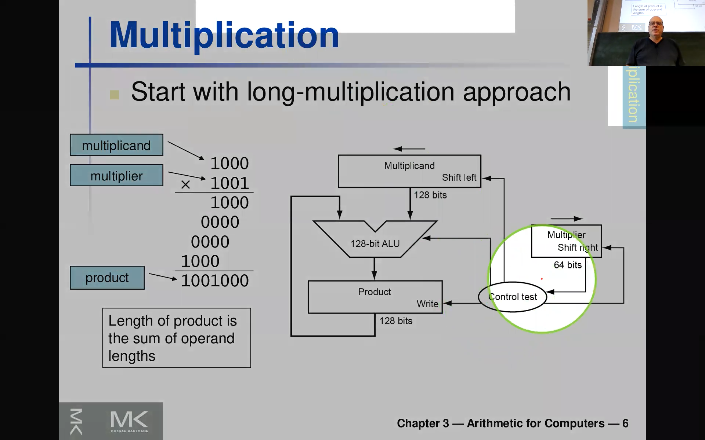
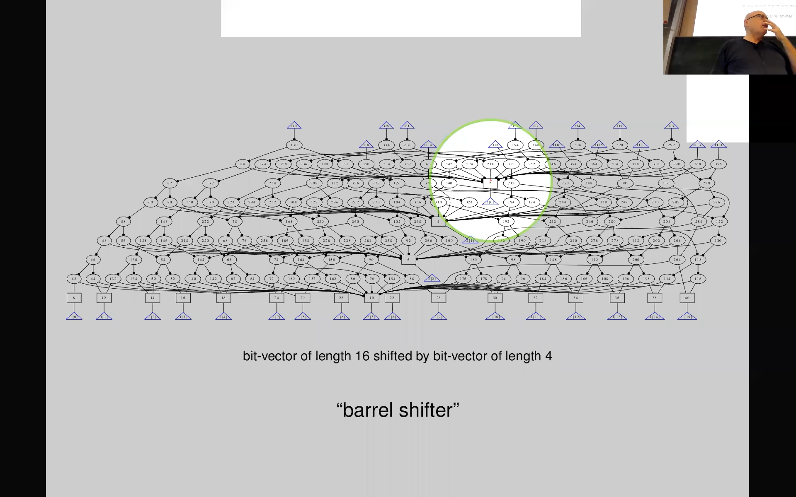
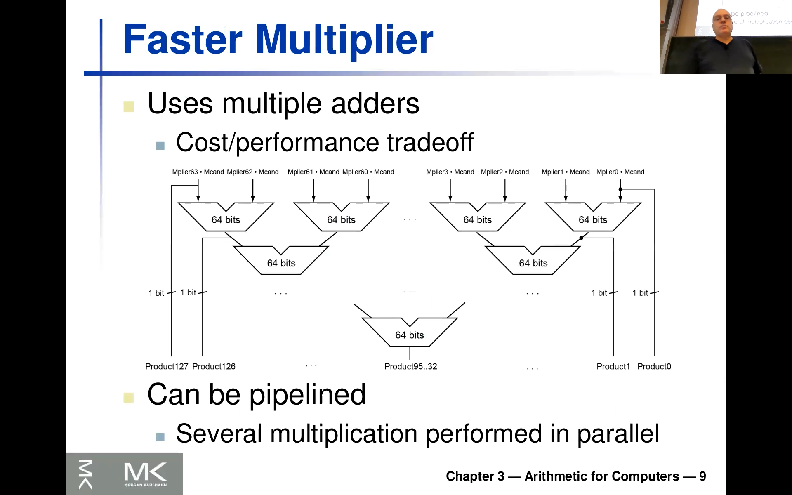
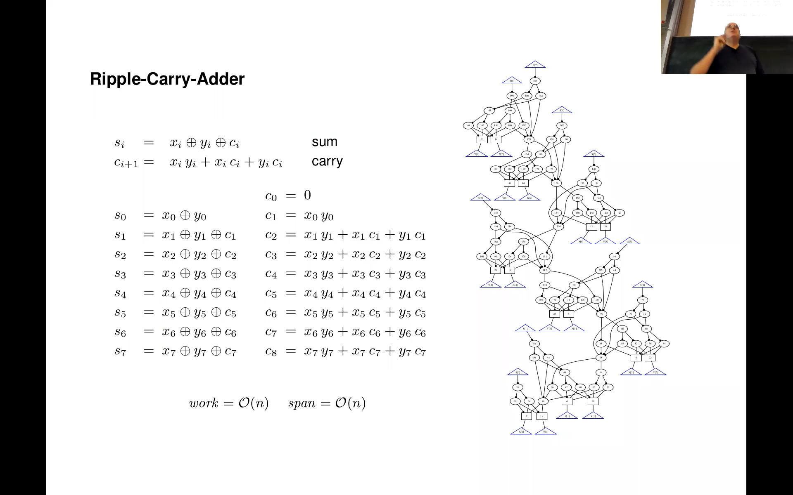
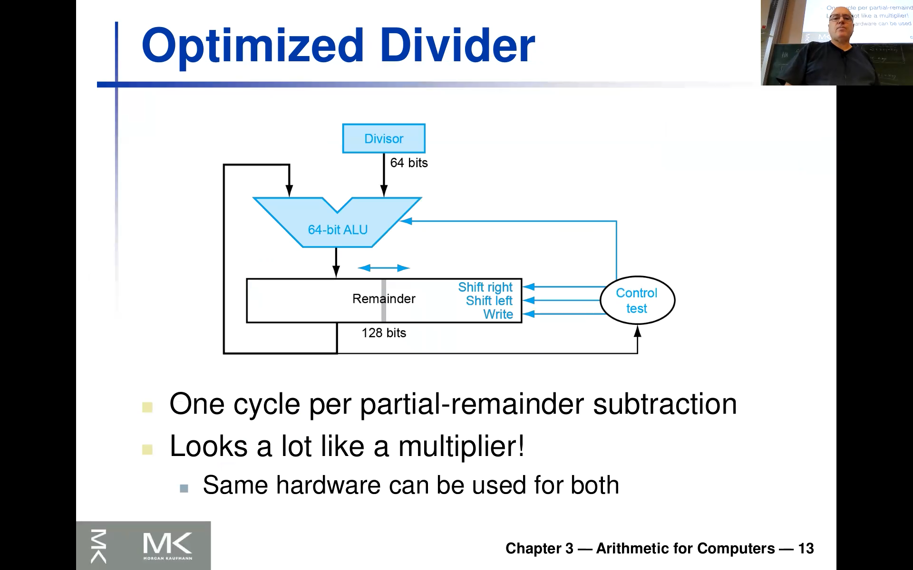

<!-- /home/areo/Videos/Rechnerarchitektur/Computer-Architecture-Chapter-3-2022-11-22-slide-01-to-15.mp4 -->
<!-- /home/areo/Videos/Rechnerarchitektur/_Computer-Architecture-Chapter-3-2022-11-22-slide-01-to-15_imgs -->
<!-- /home/areo/.config/mpv/mpv.conf -->
# Tags
Wallace Tree
[toc]
# ==============0:00:00==============
- 
<!-- - `0:00:03`: alright so and we enter it at least from my perspective pretty interesting. -->
<!-- - `0:00:11`: part of the lecture so this is computer arithmetic and i'll show you some. -->
<!-- - `0:00:18`: some details about this and of course assuming that most of you will have seen this before so i hurried to this is the integer addition you just do this with bit by bit and just for terminology so in teacher here means. -->
- 
<!-- - `0:00:38`: that you're not using a floating point but as well as maybe something else like like a m. -->
<!-- - `0:00:46`: beat level circuits or maybe even pulling humans so we want to a kind of. -->
<!-- - `0:00:52`: look at this this case where we have like to compliment or or just unsigned words and want to add them into arithmetic with him writer as i don't need me to explain how this in in principle works in subsection works almost the same am so i. -->
- 
<!-- - `0:01:13`: there's sir a case we're going to look at later a bit it's this overflow rate and you can actually look at just the sign bits to determine whether there's like an an overflow and. -->
<!-- - `0:01:26`: i. -->
- `0:01:28`: the interesting thing is that the **addition operator is the same for**.
- `0:01:33`: **unsigned and**.
- `0:01:36`: **signed**.
- `0:01:38`: though numbers so if you would use crc plus the **signed or unsigned this will compile actually to the same**.
- `0:01:47`: **assembler instruction**.
<!-- - `0:01:50`: for the division in to do and remainder it will be different as as you're going to see and. -->
<!-- - `0:01:59`: i. -->
<!-- - `0:02:01`: while when we load later the floating point you also will need to to look at the sign bits but in principle for now this is our basic building block you must have seen this in other courses it's just like a big editor and and then last time i i stopped i stepped over this. -->
- `0:02:20`: the part a little bit so we come back to this later so there are the seventies instructions there **is sometimes also called vector instructions or..**.
- 
- `0:02:29`: **avx**  i think is the official term for that.
- `0:02:36`: and the **basic idea is that[...]** you would have.
<!-- - `0:02:40`: in a register like in the pit victory you would have. -->
<!-- - `0:02:46`: multiple data pack packed into one worried and then you need like you have instructions which work on this pic data on this this is why it's called streaming rates we have like a stream of let's say eight bytes which gives you the sixty four bit and then you would want to. -->
<!-- - `0:03:03`: work on despite individually. -->
<!-- - `0:03:06`: and you can implement of course an edr hardware which would do this sort of for each of these bites it separately and. -->
- `0:03:17`: it's all actually i was also on the bid level just need some rewiring rights with the only difference between adding is to sixty four bit numbers in and eight eight bit numbers is that like this **individual carries** rate between this eight bit boundaries would not overflow right simply cut them out.
- `0:03:33`: and the real reason they did this was because they wanted to do it for **one hundred twenty eight bit this was the first thing when the first time they did this** and now as i explained **we are  at five hundred twelve bits** of this machine is five hundred twelve bits which is so that means it can do.
<!-- - `0:03:53`: am eight am. -->
- `0:03:56`: **eight sixty four double operations** which we're going to see a cleaner demo **in parallel** right in in kind of it's **not really true one clock cycle but in one assembler instruction** you would **add or multiply eight doubles**.
<!-- - `0:04:11`: and. -->
- `0:04:14`: eight tablets which take sixty four bits and of course the **same is true for integers this came later and so on** end and they also yes so here's like ocean they will called a multimedia extensions of interviews somewhere for the prince whom with the recalled mm excitement **whenever you see like mm x or avi x or simd**.
- `0:04:33`: **or vector or streaming right these are all synonyms**.
<!-- - `0:04:39`: and am. -->
- 
- `0:04:41`: but you come back to this later in the in the demo but for now i'll just show you sort of like a simple sequential away off of doing.
<!-- - `0:04:51`: multiplication but this just explains in essence what you know from from school in a in in a sequential. -->
# ==============0:05:00==============
- `0:05:02`: tennessee correction which state machine and you see here and **there's a control.[...]** here and this control actually **has a state in it** and and you would just kind of implement this loop you would need to do when your **shift sort of one of the multiplicants like...**.
- 
- `0:05:21`: **n times if you have n-Bit input** and and **that state machine would just coordinate this it would internally just shift and add**.
<!-- - `0:05:32`: and and then add then in addition you see like at every this is different from one you do it on paper it would not add all those guys in parallel right it it would tear always use this this surreal use this shape this v here and says this is a editor or arithmetic logic unit. -->
<!-- - `0:05:51`: you might also have floating point addition whatever in it so like something complicated in em. -->
- `0:05:57`: it would **reuse this adder actually as many times as you have here rows**.
<!-- - `0:06:03`: an and and. -->
<!-- - `0:06:08`: we're going to look at. -->
<!-- - `0:06:10`: at ways to optimize this and all show you that today. -->
<!-- - `0:06:20`: okay am the. -->
<!-- - `0:06:25`: and so. -->
<!-- - `0:06:28`: last year i showed like half adders and full adders and things like that but i'm going to skip that for today so because like most of you have have seen this in other causes at least i was teaching it in the teaching design introduction course anyhow so i'm not showing you how haul kind of the starting point of how to implement this but i showing you now something more advanced. -->
<!-- - `0:06:49`: and explain this into it in a little bit more more more detail i'm so so so in principle when you include implements. -->
<!-- - `0:07:02`: and. -->
<!-- - `0:07:06`: and em like in a multiplayer raid your you can do. -->
<!-- - `0:07:13`: the reason the bit level with looking here at this sir. -->
<!-- - `0:07:19`: free mortimer. -->
<!-- - `0:07:21`: looking here at this e g data structure so this is like a bizarre place where i want to introduce you to this ai cheese. -->
- 
- `0:07:31`: so this **aig data structure** which came out actually off out of em.
<!-- - `0:07:37`: i am so into this kuhlman who have worked back then at ivy m and a pioneer like icu shaking in the nineties so thirty years ago almost end. -->
<!-- - `0:07:49`: then this paper here is is kind of the summary of this sir. -->
- `0:07:55`: all of this effort here in in i b m and basically is an edgy such as mid level circuits rate so you've seen this before so single beds as **this wires here on the right this is an aig[...]** have single bits and they're only kind of two interesting parts here so one is this circle here so the sir.
- 
<!-- - `0:08:15`: urkel is an and gate and it's anc and kind of the only real em operator in this area geez so this is the a part in what's the a part while the ai part artists black dots so these black dots are just negation three and you might have seen it in other representation that the dots are closer to. -->
<!-- - `0:08:35`: the gate or to the input rates of interest negate what's coming in. -->
<!-- - `0:08:40`: and the reason they're put there in the middle is because these edges half and do the following so they they actually are implemented so these wires are are really just pointers in your memory in a certain sense you have a pointer like in the croft implementation to this the end object right in but you can. -->
<!-- - `0:09:00`: also just kind of negate this pointer in constant time actually dessert it's called beat stuffing you put a bit into into this pointer you can also use lumbers of course if you wanted he put those notes in an array but the the ideas that said if you're you're a big lever circuit or aids ari. -->
<!-- - `0:09:21`: reference by numbers indices are pointers and and then you can color them you can give them an attribute end and you only need one which says this thing is negated or not pray and and thornhill for instance you see this to end its here they they are half here as one child. -->
<!-- - `0:09:41`: something which is not negated rain while on the other side they have yeah this guy has to lift the eggs negated while this guy here has the eggs are not negated great and it's actually pretty simple to work with them so they're they're they're they're the reason why of why people use their midst because it's it's very generic in. -->
# ==============0:10:00==============
<!-- - `0:10:01`: a very simple estate have said if the simplest basic form you can do in a then you talk about sort of gates about the middle every circuit. -->
<!-- - `0:10:10`: intern right so here you see the translation of the circuits yoked to the right. -->
<!-- - `0:10:17`: do you see you just need to do a lot of the morrigan which you might actually know how to do this right so you put just yet his circles are n gates right so this dessert in essence three n gates rates are on the right you see kind of the direct translation of this croft but then you need to put lots of negations and then you can do the morrigan. -->
<!-- - `0:10:37`: as you've learned in in in other courses and you would get this formula here which is of course the xr so this is the xr years and the a g. -->
<!-- - `0:10:47`: and. -->
<!-- - `0:10:49`: why are people using this well it's it's kind of you see that if you want to heaven as simple as possible format force for forbid levers circuit you only need like one operation and maybe negation array and then people stick sticks to this one and end yeah the real reason is because i all over some sbi. -->
- `0:11:09`: become much simpler so you don't **run some sort algorithm on top of this circuit then...**.
- `0:11:17`: **you just have to care about this case right n gate or leaf** leaf is a actually a valuable input for a constant and you'd need to care about negate rates or the air races are way simpler if you do it like that.
- `0:11:30`: am and this is the reason why actually people use this is his **exchange format** and er.
<!-- - `0:11:39`: am kind of it was put up for post here in two thousand and six by by this guy from berkeley this is so or break in is kind of the. -->
<!-- - `0:11:50`: one of the most important people in in this circuit synthesis domain so he's retired and are like i think he must be around eighty now and he pushed the synthesis of harper like this was his invention and elements cinco is his post toxins a long time then he has been working on this tool a b c. -->
<!-- - `0:12:10`: which is kind of an academic version of a synthesis tool and so they're kind of still doing like this work even though the synthesis was done in the eighties so we earlier and because of that actually i proposed to to make a formal format in two thousand and seven and since then it's actually used by computations and. -->
<!-- - `0:12:30`: yeah also the companies in a b c are using this format but but the format itself is now not the the topic here but they're sick whereas you can imagine this there's a very simple format which describes the cirm a i g s and therefore this eg self as a kind of a vehicle for. -->
- `0:12:48`: for him it shake changing circuits and i'm explaining this edges because i want to show you know multiplayer circuitry or on the pic lever right we're now going to the bit level and look at how such a multiplier circuit would actually look like so **the one you saw here on the other slide set this is too simplistic so this would be a sequential multiplier**.
- 
- `0:13:09`: layer and and it would meet of course like you see this this loop needs to run like four hundred of what let's say a sixty four bit multiplication because if you have a sixty four bit multiplayer which is our kind of risk at fife multiplication in over in nature.
- `0:13:29`: the **the end result will be hundred twenty eight bits long** right to sixty four bit multiply gives hundred for the ids and then if you think about like here this will be a **need adders which are one hundred twenty eight bits wide**.
- `0:13:43`: and you need like sixty four looper yeah i would i could don't call it clock cycles but **in principle you would need to go through this loop...** hundred twenty or **sixty four times** ray and this of course **way too long[...]** if you're if you do multiplication you don't want that the **processor stalled for like let's say sixty four cycles**.
<!-- - `0:14:03`: else there will be **way too slow** and that's why this is of course not the the real implementation of what we're going to look at this later so all just like what's the size of this thing. -->
<!-- - `0:14:16`: even if you think you'll remember so we're going to look at real em editors in in a second but like what's the size of this circuit like how many transistors do you need for that this one any any ideas and for that of course he would meet how many and what's the size of this a new of course in terms of bit with so i want to know for an equal thirty two. -->
<!-- - `0:14:36`: for n equals sixty four and four it is a v x year you see it's it's **five hundred twelve** re. -->
- `0:14:44`: yet yeah but so **this adder...** issue recall the editor **is actually size linear** right if you kept look or think or remembered is kerry aim stuff and this full eder stuff rates so it's just these edge these these **additions...** would just tripple down and **it's a linear thing** so this is actually not that big.
# ==============0:15:00==============
- `0:15:03`: aid and we will see like allergies in a second so that's actually pretty cool so **this thing is linear in the number of bits** **the other multipliers we're going to see are actually quadratic in the bit width**.
<!-- - `0:15:19`: and that's already for thirty two bit like ranges than in the thousands of off of gates actually in for sixty four like in crows quadratic leads is way more re it's like four times larger. -->
<!-- - `0:15:32`: and so on. -->
<!-- - `0:15:35`: like around like ten thousand or more like a **five digit number of gates** and then of course like if you want to do this for sixty four bit if we said legs around ten thousand or more for like for this easy exp that a streaming architecture it will be really big free. -->
<!-- - `0:15:53`: and and that's sort of the big advantage of this simple thing and m. -->
<!-- - `0:15:59`: what's also very funny even in in the earlier risc machine so in the nineties when i have i like work on spite like machines they would not have an air actually. -->
<!-- - `0:16:12`: they would have a multiplication but they would not have a division rate we're going to look at the mission later but it's exactly the same so they tried to save space on the on the on the chip for the same reason for division then if you would. -->
<!-- - `0:16:26`: compile a program which has had the division in it they would actually implemented in software. -->
<!-- - `0:16:33`: and then of course this will be one hundred times lower than than than if you would tether hardware for that. -->
<!-- - `0:16:40`: okay so this is the m n. -->
- 
- multiplier x mutiplicant = product
<!-- - `0:16:44`: the sequential version the only benefit of it is kind of it mimics what you know from school it is like peak because a certain small rate gets the advantage. -->
<!-- - `0:16:56`: alright. -->
<!-- - `0:16:58`: and so here are these eder snow i promised so here's a forbid eder in this a a g format and you can see somehow how this sub extends rates you can now just copy the same thing and you get a sixteen bit editor and and you'll also see as so this is like. -->
- 
<!-- - `0:17:18`: that needs around like five or six five fish six ish am and gates four per each for each input battery. -->
<!-- - `0:17:30`: so for thirty two bit it's like two hundred or something and er. -->
- `0:17:36`: right you know how this extends so i want to show you already like and you see this am this exile here and this actual curse your all the time because if you recall that the **output here is just the sum of these two input bits and here's another xor** so this x or.
- `0:17:56`: an actual curse but **then you see here an xor and here's another one...**.
- `0:18:02`: **which sums up these two bits plus the carry which comes from this one right and so on** so **you always get kind of the carry which goes up here in this line and you need to add it with the result of xor in these two guys** rate and and **this is already an optimized version where sort of this thing here is a there's a kind of a trick which i don't explain now..**.
- `0:18:22`: like **it uses like one gate less than sort of the most natural one**.
- 
<!-- - `0:18:29`: i'm here like just to sort of give you another example which is interesting from from and even from this class perspective in addition design course it might be even more interesting. -->
<!-- - `0:18:44`: so this is the shift. -->
- `0:18:46`: and again i could ask what's the complexity of this thing and yeah so what's shifting right you think for instance in this case it's sixteen bits or so it fits on the slight **if you want to do thirty two bit you need like one wore the same size doubles in width** and **height would actually only increase by...**.
- `0:19:06`: **one layer**.
- `0:19:08`: ok this already answers my question so this is n log n in re **so the width of this circuit is if you have n bits and then the height is log n** rate and and you see already least **these guys here with a lot of fan out...** this is called fade out like the usage of disguise these **are** of course the **bits of the shift...**.
- 
- `0:19:28`: **amount[...]** rate and you have you for the sixteen bit mit player we have four bits right because we can only shift by up to sixteen which is encoded as a forbid number and these are the four bits.
- `0:19:42`: and then basically you see this as a thus arithmetic the following so you just have a shifting by one right then you can shift by two then you can shift by by or eight depending on this pizza it's italy only an if then else **all these guys here are just if then else** rate.
- 
- 
- `0:19:58`: so they say **if this shift bit is true then take this left thing if it's false take this right thing**.
# ==============0:20:00==============
- `0:20:06`: okay so i am you see the thing is **in hardware[...]** very actually while **not linear** in it like the rebel carry at a resolve before minutes the them and look in em but it has this nice m.
- `0:20:23`: property that the the **delay here...** said of the time it takes you're getting from the input to the output is **log n** which is that the number off and which is of course good rates so **even for five hundred twelve it's like nine layers** rate so you would need to go **maybe go through twenty gates** and then.
- **input is at bottom, output at the top**
<!-- - `0:20:44`: you can count yeah for twenty bill gates if i need like a i don't know like ten picosecond for every gate or for earth and then you can multiply this by this layer and then you get kind of the time it takes for this circuit to to settled right so it is a smaller does the circuit is as better it is to that is. -->
<!-- - `0:21:04`: foster kind of you can clock the the the the the the the processor or the the the the circuit which is which uses this this circuit company. -->
<!-- - `0:21:16`: alright now and. -->
<!-- - `0:21:19`: let's look back again at a multiplication so here's like one example and the only point i mean you know all of that right to just put a put this guy here and as many times as you have once here the obvious shift by like the appropriate position of this one here in and then you're at. -->
- 
- `0:21:39`: this up and you could do this as a human you could do this in or worried and we're going to see how this is done in hop entitled to enter the only purpose of this light is that you can it's kind of obvious right so **what's the maximum number of ones here in one column** well then it's **of course n**.
- `0:21:59`: right like here there could be in ones right if this is all one then there would be in once here and **even in carry...** so it would be even the fact **it would add up five of these ones** so that means white is **carry here is not binary anymore** ray.
- 
<!-- - `0:22:16`: this is the the important point i wanted to make. -->
<!-- - `0:22:21`: and. -->
- `0:22:25`: alright the lenders artist for url like these multipliers can have for different structures like so **you know this partial products** sosa partial product means you just take them so **p three one means you take bit three from a from the first multiplicant and bit one from the other one...**.
- 
- `0:22:43`: the one right **and we do an and between these guys** disguise.
- **es spielt bei FA bei der Verwendung keine Rolle, welches der 3 Inputs eigentlich für das Carry vorgesehen ist**
- `0:22:47`: and this just **gives you this matrix (new_16)** if you think about it re.
- `0:22:52`: end and then you can kind of connect this half and full address which you should know to to get a multiplier and that this is **another one...** right so it's like the almost the same and so you're kind of **this is a carry safe adder** where you kind of get the uk.
- `0:23:12`: have a **postpone the addition** here you liken of **here (left top): ripple the carry always to the left**.
- `0:23:19`: **here (right bottom): you postpone it for the next row...** right **to add up the the carry** and that's all that's all correct risk believe me and is he like in the notes even worse worse year with something i did not experience so here like you see this looks really struck a very a very consistent so the **here (top, left): second bit here in essence does...**.
- `0:23:39`: **not change[...]** rates it's like a p three two p two two p one to p zero two but this is arbitrary this is just like how we humans do it so you go back to this some metrics **what you could do is you could actually permute within each column these numbers in an arbitrary way...**.
- 
- `0:23:59`: way **this partial products** is free.
- `0:24:02`: and and **that gives lots of possibilities for these multipliers** and that's what we're going to look it up now so here's an mit player.
<!-- - `0:24:13`: in an oops. -->
<!-- - `0:24:17`: in our. -->
- 
- `0:24:19`: a bit vague bit vector solvable lecturer and associates turned around so it's important to understand like in the previous light rate like when you do it on paper you compute downward **here it computes upward** i hope you this is clear and then this thing here you see this should you remind me mind mind you have something with is the carry chain.
# Ab hier geht freesytle
- 
<!-- - `0:24:39`: in great. -->
- `0:24:41`: **this is the carry chain** already starts here and goes up here and then goes here like the last output the most significant bit is then dependent on on on on this.
<!-- - `0:24:56`: carry chain and then. -->
# ==============0:25:00==============
<!-- - `0:25:00`: sorry. -->
- `0:25:03`: right in the the the i the reason for that is no matter which of these architecture news **this last row here really needs to have like take all the carries into account**.
- 
<!-- - `0:25:16`: okay so this would be like a a simple at actually too trivial multiplayer what's the problem with this thing. -->
<!-- - `0:25:24`: i think about like like extent this to our sixty four bit risk wife machine. -->
<!-- - `0:25:31`: yes. -->
- `0:25:35`: yeah so it gets be a really big that's the correct answer so actually the the it sixty it is always **quadratic** that is **no way for doing like a non quadratic multiplier like for one clock cycle** said you see in the **even the other one, the sequential if you would wait for sixty four**.
- `0:25:52`: **cycles and unroll this loop you, would also get sixty four times sixty** four a there's like no no eggs and there's actually no way of getting it.
<!-- - `0:26:02`: below are critique. -->
- `0:26:07`: no the the worst thing here is is not actually the gore tragic this is somehow right we have moore's law transistors why why don't we spent like these transistors for multiplayer and that's actually what happened in this cheaper use rate they just put lots of mighty pliers into the cheaper you know the the the **problem is...**.
- 
- `0:26:26`: the **delay again** rate so so so you need to think like when is the result which are computed in the **most significant bit is the worst thing** ready no metal you see which architecture you you do the seeds to in or to to admit minus two or something right.
- **im linken oberen ist HA FA FA HA in der ersten Reihe bereits die zweite Reihe der richtigen Multiplikation, wenn man auf (new_23) schaut**
- `0:26:43`: i'd say you can only compute here this thing after waiting after this toggles now **if you think about like thirty two multiplayer it's like it would need to have like sixty...**.
- `0:26:56`: **gates or so** raid or like sixty likes or gates and.
<!-- - `0:27:03`: like sixty four bit it's like hundred and so maybe three hundred gates and this is too slow because he can see three hundred times let's say ten ten pico seconds that's already like cut gets close to sort of like like what what you actually can afford as a clock cycle re time. -->
<!-- - `0:27:22`: so so the delay here is the problem that you really have to kind of go through and these wires and you see something might change here and at the end influence the sky and now what i'm going to show you is like what's a what's really in these machines. -->
- `0:27:38`: there are **multipliers which actually at the end have logarithmic...** like the bearish if the rate of reloader rhythmic **delay** and it's pretty surprising that this is possible.
- both multipliers have logarithmic delay
<!-- - `0:27:52`: and that's what i'm going to show you. -->
<!-- - `0:27:56`: next. -->
<!-- - `0:27:58`: okay but m. -->
<!-- - `0:28:01`: am. -->
<!-- - `0:28:03`: this is another this is the one from our m s m soul which can can produce like these a geez this is another one we got from a more industrial context and and and this i'm showing you this one because he is he even though like zoomed out and you see the o-ring the flavor right so here you have these role. -->
- 
- 
<!-- - `0:28:23`: does and you need to kind of pass this sir. -->
- `0:28:27`: and a virus or along so this is the carry safe version rate so so **here (pic1) it's actually kind of linear and then at the end you have this last row...** in the previous leg schematic capture this was the **there you have also the the carry chain (pic2 at the top)**.
- pic1
- pic2
<!-- - `0:28:47`: and. -->
- `0:28:48`: and and now the interesting part is there to two **two things how you can make this logarithmic** so the first one is actually simpler even though you might think it's more complicated it's.
- `0:29:02`: how to **how can i make this log n this lower part (pic1)**.
- `0:29:07`: so this is called a **partial product accumulation...** rates **you have this partial products in your matrix and then you need to add them up**.
- `0:29:15`: and this **partial product accumulation is actually pretty simple to to make log n** saw i'll show you this is actually us in this lie original slight set and the **tricky part here is to make this adder here (new26) on top log n**.
- `0:29:35`: and then i can already tell you i think i have a picture for that the interesting thing that the trick is an doubt yeah **explain this trick down here(pic3)...** since it **uses kind of a tree idea** that simple does this idea this **this one top (pic4) is actually not that trivial** i'll show you how this works and the other thing you see here and this is why.
- 
- pic3
- pic4
- `0:29:54`: i switched the slide is he suddenly **this thing (pic4) is quadratic...** right so **this is upper triangular matrix so it's quadratic...**.
# ==============0:30:00==============
- `0:30:00`: **this is not bad because you see down here we already paid a quadratic number of gates, now we make this final stage adder, the one which had this line...**.
- `0:30:13`: **we make this in a quadratic circuit...**.
- `0:30:15`: **again from a linear delay into a logarithmic delay** in that's that sir and like an interesting tradeoffs of your trading you see **we have already part of the multiplayer is quadratic**.
- `0:30:29`: **it's adding up this rows in the end we need to kind of finalize everything in this last carry chain and that was linear in the slow multiplier but we can of course spend like quadratic space there, quadratic many of transistors...** the pieces.
- `0:30:50`: double the heat of the circuit **if we can guarantee then that the overall distance from the button to the output is logarithmic**.
<!-- - `0:31:00`: and i'll explain this in the next light said in this prefix a slight said. -->
- `0:31:06`: okay so this is the goal so we're having here **this (pic5) is the carry save adder which already uses this trick i showed you here (pic6, bottom right)** right so this is kind of gives a nicer structure and then this one am but it's **still sort of linear right the number of bits up here (new28) like the rows...**.
- pic5
- pic6
- pic7
- `0:31:26`: **are linear...** and and **we turn this into a logarithmic computation**.
<!-- - **then in addition we turn both row adder and long final stage adder for carries into logarithmic circuit** -->
- `0:31:32`: and to **and then in addition we turn this long final stage adder which needs to collect all these carries...** here we go back here in **it needs to collect all these carries which come from the upper row right and add them together** so **this line here is then the second part we're going to optimise and...** put your general.
- pic8
- `0:31:52`: **generate a logarithmic circuit** for it.
<!-- - `0:32:00`: alright. -->
- 
<!-- - `0:32:05`: and i'll show you first because this is on on this slide set. -->
<!-- - `0:32:10`: the idea here. -->
- `0:32:13`: which is this meant movie silence lies called **wallace tree** re so so this is the guy who first published about it so this was all like in the sixties or even earlier last century and you see the idea here kids it's a **general like a parallel programming trick** right how can you turn like for instance some.
- 
- `0:32:33`: showing up in **numbers...** how can you paralyze it so that it it can be **summed up in logarithmic time**.
- `0:32:40`: why you **just put a binary tree**.
- `0:32:43`: read **instead of adding always like the previous result with the next numbe, you just add pairs** then you take the you have then edit pearce rate and **then you take the result of adding those pairs add those together...** then added like ford numbers **and so on** break and then you're done in logarithmic number of steps right so here you need like five aiders.
<!-- - `0:33:03`: have a hate of five for sixty four bit. -->
<!-- - `0:33:06`: okay this then as i said this is trivial it has this term here in this computer architecture of arithmetic circuits it has this term abolish trees have an ever you see this this is the earlier but it's a very general principle. -->
<!-- - `0:33:20`: and and. -->
<!-- - `0:33:24`: i'll show you this again now in this other slight said and then with that you do this opposite of wrong slighted. -->
- `0:33:32`: with **with that you do this to propagate and generate** foot for that one i have a slight as as another slight set which is also on the.
<!-- - `0:33:41`: if i would have it here think i have it here yes but in the. -->
<!-- - `0:33:46`: in the m. -->
<!-- - `0:33:52`: one. -->
- 
<!-- - `0:33:55`: on the next cloud it's in the same directory. -->
<!-- - `0:34:00`: okay in the end the the reason i'm showing this to us because em and as i think i mentioned this before **in linz i had a parallel programming course** which i don't have here so it's like it was a mandatory master course actually and they. -->
<!-- - `0:34:17`: and. -->
<!-- - `0:34:19`: part of the theoretical point. -->
- `0:34:23`: and like arithmetic part i'm going to show you now because it actually solves this problem we have free **once again so we have this carry safe adder like there was this block at the bottom right and that one we just turn into a tree** right that's easy so this **lower part we just compute with a tree**.
- `0:34:41`: and **now at the end we're having like the bits which come from the bottom and always carries and now we need to add in this carries**.
- `0:34:52`: and **we're going to do this with this...** one.
- `0:34:56`: or a **parallel like generic parallel computation trick** i'm going to to show your witches.

# ==============0:35:00==============
<!-- - `0:35:03`: used here to to speed up this. -->
<!-- - `0:35:07`: and multipliers. -->
<!-- - `0:35:13`: but ultimately there are of course there's a point of talking about pill over some sexually later and we'll talk about this more in the in the course or because you think about it i mean this is like or maybe important principle harper is only there to to paralyze the work and if you think about. -->
<!-- - `0:35:29`: lots of things like edition and whatever. -->
- `0:35:33`: do you see you you parallelize adding those individual bits by one assembly instructions then for you in the **hardware paralyses for you something for which like your software would take lots of steps**.
<!-- - `0:35:47`: and and that's why i when we talk about computer architecture it's also important to talk about the parallelization concepts in the book also has this are closer to the end. -->
- `0:35:59`: alright so i'm i'm i'm not going to do **amdahls law** and things like that for you and believe me discuss this a little bit briefly earlier but like one thing which i want to show you is is this concept work in spain now use their started it in it probably for some time.
  - amdahls law has some connection here
<!-- - `0:36:16`: and i liked this terminology so lake in. -->
<!-- - `0:36:20`: do a favorite buy buy buy some literature not all are parallel computing courses or if you go in your web would would use these two terms but i think they're really easy to grasp and spitz mix frame it so so so assume you see this could be a surrogate and. -->
<!-- - `0:36:39`: you will later see this term actually comes from scheduling like you want to schedule working or schedule your studies rate and er. -->
<!-- - `0:36:49`: i. -->
<!-- - `0:36:51`: so it's kind of this thing is a data dependency in a certain sense or is it the patents since you for chops were who needs to be done right so this job needs to be done before this one could start because it needs that input. -->
- `0:37:03`: and then **work...** of course means so you think about in terms of i dunno like like people working together and is simply the **sum of individual jobs you need to do**.
<!-- - `0:37:18`: it's all like the number of if you want to vengeance statements in order to execute it so if like you can only do one trop and you have to do this the oath whole thing yourself then the work is is is that. -->
- `0:37:35`: okay and and now earl **what's span...** while as i said this comes from scheduling so spend a third of 'em the **longest path here in this particular choice of solving this problem** or solving this popular right it's it's gives.
- `0:37:53`: **gives you a limit how fast can you actually solve this problem if you would have as many people as you like** re.
<!-- - `0:38:01`: and that span so. -->
<!-- - `0:38:05`: okay and it's important also to note and we're going to see this on the next slide this is just sort of four one errors right this is for one execution like let's say you have won over some and you have a sequential one and then you can compute the work and now the question is if i kind of tried to paralyze it what would be the maximum so. -->
- `0:38:24`: if this looked the smallest execution time i can get and if you look you carefully read so so you only need to execute the actually three things in parallel array so i did this the only kind of three processors here **with three people you can achieve the maximum span you don't need to throw five people at it**.
<!-- - `0:38:44`: so that's why why this work in spain is is is really nice concept and and and. -->
- `0:38:53`: okay and and so **when you want to paralyze it you want to reduce here the span**.
<!-- - `0:39:02`: and then there comes m m does law and all all i'll not. -->
- 
<!-- - `0:39:08`: i want to talk about this one so but but the the the thing i want to explain to you is this. -->
- 
- `0:39:17`: **prefix algorithm** over some which part of it half of it to you i've already seen this is this idea with a tree and and you see here like it's the same problem in essence so actually the personal computing course i use the same problem so you want to sum up.
<!-- - `0:39:32`: and numbers like eight here and if you do the base of the simple algorithm like you see you should take this crop here then work is equal to span in both linear right and that's why you don't really have a speed up which is the at the the er the er sorry the work divided by. -->
<!-- - `0:39:53`: the spain. -->
<!-- - `0:39:55`: maybe i should show this. -->
- `0:39:58`: the speedup achievable **speedup is the work divided by the span**.
# ==============0:40:00==============
- 
<!-- - `0:40:02`: alright but buddies playwright so you don't have any speed up you just taking you can throw in process just like even a processor said this but you don't gain anything right. -->
<!-- - `0:40:13`: and now the way to make this faster and and is using associativity here for this number problem right and and and as such activity means it doesn't matter that you do x one plus x two and then x three and then explore know you can. -->
<!-- - `0:40:33`: one x x two first and x three x four and then at those two up this is true for. -->
- `0:40:40`: for our integers **for floating point is actually not true** as we're going to see later and therefore dismiss this thing what i'm showing you and has to have of course consequences if you want to apply it to two floating point computation but like for now let's just two integers where we have associativity of addition yeah and then we can read.
<!-- - `0:41:00`: group the whole computation like this re. -->
<!-- - `0:41:04`: end. -->
- `0:41:07`: and what's the **height...** of this thing the span is **red line, it's logarithmic** of course to three because we have eight raid and wifi add sixty four bit numbers it would be six ray if he had thought wasn't numbers we can do this in ten steps **how many processors would we need then...**.
- `0:41:30`: **for thousand...** is yes **five hundred twelve** around right is all because this first thing here needs like five hundred re so the two to achieve optimal.
  - **weil man auf der obersten Baumebene mit den Blattknoten immer zwei miteinander verrechnet und die Anzahl l dieser Blattknoten ist ja genau die Anzahl Zahlen die man ingesamt miteinander verechnen will. Das ist die Ebene, welche am meisten Berechnungen benötigt**
  - für 8 sind es 4, weil 8 / 2 = 4
  - oder anders ausgedrückt $(2^3 - 1 + 1) / 2 = (7 + 1)/ 2 = 4$, Höhe ist 3, weil die oberste Ebenen keine Berechnungen sind, sondern die Operanden
<!-- - `0:41:41`: optima and spain which would be a ten **four thousand** twenty four need five hundred for free and then of course you could think okay maybe five hundred for with the image maybe i only want one to have hundred twenty eight what would i need then right so you can think to do these trades off in of course that's what they're doing for this a multiplayer implementation is full. -->
<!-- - `0:42:02`: okay and the other thing which is may be interesting so if if if i would do the more theoretical part i'll i'll i'll would ex go more into this what's the optimal speed up you can achieve for such things well what you can hope is a kind of. -->
- `0:42:18`: or you don't get almost you don't get linear speed up right like you throw in processes it and get like are you going off one rate but **you can hope that it takes only log n time**.
- `0:42:33`: okay so this is sign that kind of for kind of a rhythmically the **best speed up you can get like in n over log n** and there's a whole kind of theory about like parallel complexity which says something is paralyzed but if you achieve such a speed up you can't get the logarithmic like you you can you can never.
- `0:42:53`: like me **don't assume you get sort of ideal speedup of n** this is too too much but you can get a speed up which is like **logarithmically of from the linear speedup**.
<!-- - `0:43:07`: okay now the main point and this will lead us through this are an apparent competitions of what you see here on top this was just our tree based computation of the summary. -->
- 
- `0:43:22`: now it turns out this is an it has different names so **prefix or scan algorithm**.
- `0:43:27`: now with computing you see that the **spec of this thing was i need to compute this last thing this was the spec the sum from one to eight**.
- `0:43:35`: i would ignore the rest rate and now i'm **turning this algorithm into one which not only computes one to eight but actually computes all the prefix sums** okay.
<!-- - `0:43:49`: instead of computing one result i'm computing end results. -->
<!-- - `0:43:54`: the some from one to. -->
<!-- - `0:43:56`: i number right. -->
- `0:43:59`: and you see part of it we did already like is he like it this will be have some one one which is the first element then we added up these two guys and and then the edit up here like the first four and then the fourth aide said like the **powers of two we have already** another question.
- `0:44:19`: this can be **also cheaply get the other guys**.
<!-- - `0:44:23`: and it turns out yes because you can always kind of you have fewer on top always the thing you need to to fill this up and get for instance from one to three re. -->
<!-- - `0:44:34`: end. -->
<!-- - `0:44:37`: okay because you're the one on threes i easy right you already have this one two two and you just ate three am and and here's like one to five. -->
- `0:44:47`: okay so this lowell part is is just filling this up so that you'll get all the in numbers nuts and not just the sums and not just the powers of two and you **can do this in parallel**.
# ==============0:45:00==============
- `0:45:04`: **and it also only needs log n computation time** parallel computation time for **so the span of this thing is logarithmic**.
- `0:45:20`: okay so what's the **general principle of this** while we have an operation which we need to kind of compute on an n objects so we **actually we're going to do ors and ands later for this multiplayer**.
- `0:45:34`: and er **but there's addition** and **we not only want the total sum but we want to have the prefix the subsets of all the sums up to a certain point**.
<!-- - `0:45:47`: now this trick here this ogress min gives you the ability to do this in. -->
<!-- - `0:45:54`: am **logarithmic span** right to the **height of this thing is logarithmic** of course you **need then n processors** rated so like you **don't really safe in space** it will be **n log n in space** like the work will n log n but the m. -->
- `0:46:11`: say the work monopoly and look in the kind of the space the **visual space will be n log n** you only eat in computation so the **work is actually n** and the **span is log n**.
  - span = height
- `0:46:24`: okay now **if we apply this trick on a reformulation of the ripple carry adder...** which are already like i i skipped it was the last slight cold compacted this **then you'll get...** like.
- `0:46:37`: **a fast multiplier, because this final stage adder would then also only need to have like a span of logarithmic** rate.
<!-- - `0:46:45`: and and that's then at the end gives you a fast multiplayer. -->
- 
<!-- - `0:46:52`: so so this is the ripple carry adder and you see her here already on the right the a which does this are really in a linear way re. -->
<!-- - `0:47:06`: and. -->
<!-- - `0:47:09`: i used here not the compact version so this is the worst you get when you were computing here the carry you see as an ord between three pairs of up to three and three remember that the carry out offer of a full eder. -->
<!-- - `0:47:28`: i took here. -->
- `0:47:31`: it's just like **if two bits are trotted right then there's carry**.
- `0:47:35`: **if three bits are true then too great but at least we have to be true** and the simple version of writing it down is this one here.
- `0:47:45`: so **this is different...** here from absurd midst of course the wrong slide set **from the one we had here**.
- `0:47:58`: i hear as i sit like **here some trick going on to reduce the number of gates...** and in **this part here**.
- `0:48:07`: heir **of the xor is...** reused for or maybe i should show it here so this thing is **reused to compute the carry** and it's like it's reused here **and then you have this and gate to compute the carry** and em.
- 
- `0:48:23`: so **this will be sort of than the simple natural version of implementing a ripple carry adders with full adders** rate you would get his circuit slightly bigger as i said like **one more gate per bit or so**.
- 
<!-- - `0:48:37`: okay so **he are like ors and here are xors this gives the sums and this computes the carries**. -->
- `0:48:44`: but you see this is linear so so we take the **span is linear** and it takes long long number of cycles to do this you want to **now use this trick off the prefix algorithm...**.
- `0:48:59`: **to compute this faster...**.
- `0:49:01`: the main trick actually and this is a little bit strange is the first turn this into a chromatic sized formula this is the linear formula is as you see read you can write it down even for sixty four bits on one slight then **we are turning this now into quadratic version**.
<!-- - `0:49:20`: the ocean. -->
- `0:49:22`: **but then make sure that the computation of this thing has a span which is logarithmic** ray to be making the **computation way bigger we increase the work**.
- `0:49:32`: **but we are reducing the delay**.
- `0:49:36`: and the **trick here is...** maybe you've seen this before is **using this propagate and generate idea** so i'd like you to **instead of computing the carry and the sum output as we did on the previous slide we introduce these two hyper functions** so this is just a prop.
- 
<!-- - `0:49:55`: brigade one of the two bits off of the two. -->
# ==============0:50:00==============
<!-- - `0:50:00`: eden's is. -->
- `0:50:02`: is true right at this position and this is just the end between the two and this says okay if **if both of them are true then i'm actually going to generate...**.
<!-- - `0:50:15`: and. -->
- `0:50:17`: sorry **a carry** and this assess **if one is true then of course i will propagate the carry if it comes in and is true** industrial.
- `0:50:27`: and then **with this propagate and generate idea you can redefine the c like this** right it's the **same c as here (Ripple-Carry-Adder), the same sequence of carries but is computed differently** like it's computer with his generate and propagate right so **either there's a carry generated at this position so the two guys are true**.
- 
- `0:50:48`: **or it was previously generated before and it's propagated because one of them is true** mistral this is a simple recursive definition.
<!-- - `0:50:56`: okay and now comes this trick i mentioned now you turned this into critics formula you see it here in the bottom. -->
<!-- - `0:51:04`: okay. -->
<!-- - `0:51:06`: is it really quadratic. -->
- `0:51:10`: actually the **last line is quadratic** already re the **whole thing is actually cubic**.
<!-- - `0:51:19`: okay end em. -->
- `0:51:24`: now **how can we turn this thing with a prefix idea and the prefix scan idea into something which can be computed in logarithmic time** that's the that's the point rights of our problem is was before the d **c eight here has a span of...**.
- `0:51:43`: **an eight** and **we want to turn this into something which is has span of like log n** in like a year he have with slow low numbers of course the constant ok in the trick is as follows right to see here are the skies here which increase rate the sequences.
- `0:52:03`: propagates like you propagate one to use it even make sense you **generate a carry here at the the last position and you propagated all the way to bit eight** right and **you just write this down for all possible places where you can generate a carry** ray.
<!-- - `0:52:23`: completely. -->
<!-- - `0:52:25`: intuitive actually. -->
- `0:52:27`: then **this plus here is an or so it says like yeah one of these cases has to be true**.
- `0:52:34`: so now **where are our associative operators we need...**.
- `0:52:45`: yeah it's it's it's really simply here it's so we need to compute you see like the **prefixes go slightly in the opposite direction** rates of you need to have a prefix computation of p one and p tool p one and p to m p three rates of you **need to compute this sequence of ands**.
<!-- - `0:53:03`: of aids rate is likely to some so he chose to an end of these guys. -->
- `0:53:10`: but we're not done yet or **for the or we have to do the same...** rate for the orbi **also want to have a logarithmic computation**.
- `0:53:18`: okay so but the debt for the **for the or that's kind of the same trick we used for the wallace tree** but for this prefix here **for this prefix we need to actually use this prefix algorithm, this scan algorithm then we can compute like these guys all in parallel** all.
- 
- `0:53:38`: in parallel **because of this algorithm here** so **the sum is now a sort of these products right of the propagate**.
- 
<!-- - `0:53:47`: the things **we can do this in parallel**. -->
<!-- - `0:53:52`: sorry wrong direction. -->
- `0:53:58`: end him yes and then this gives us a spin of lock and so **we're willing to pay a work price which is quadratic before it was linear**.
- `0:54:09`: **but the span reduces to logarithmic** right by **before both span and work were linear** rates so **we didn't gain anything we didn't get any speedup**.
- 
- `0:54:20`: **now we get a speedup of an n square divided by log n** and more important and we're actually the the span which is the the absolute like parallel wall clock working time of this thing goes down from linear to logarithmic and that's why we can do it for five hundred twelve bits like in this machinery.
<!-- - `0:54:43`: okay. -->
- `0:54:47`: and **this is then how it would then look like** this carry a look ahead at her and would tear for quadratic sized editor writes at his final stage edit would suddenly become quartic many gates greg many are transistors but you are happy with this because you're getting like from linear to like.
# ==============0:55:00==============
- 
<!-- - `0:55:05`: locked in a delay. -->
<!-- - `0:55:09`: so so in total it means you double the size of the multiplayer right in terms of of transistors and m but you get like the the depth of this thing goes down from linear in the number of inputs to. -->
<!-- - `0:55:25`: and inputs bits to lock in. -->
<!-- - `0:55:31`: alright so. -->
<!-- - `0:55:35`: i hope like you took something away from that so i want to show you now i am. -->
<!-- - `0:55:44`: as something which is related to that so so we actually do. -->
<!-- - `0:55:51`: is he like when you look at these two circuits. -->
<!-- -  -->
- `0:55:55`: and this is not all right so **there's like actually one common trick which is called boot reencoding which reduces this lower part by a factor of two** which is cirm also done all the time and and **then in addition you would do the additional trick** so so this is complex ray.
- 
<!-- - `0:56:14`: and the cirm arithmetic circuits are actually really error prone and you might be you might have seen the er this issue with the with the circuit. -->
- `0:56:25`: an inform of this **pentium bug** embarked which you have probably heard about.
- `0:56:30`: this was a a back in the nineties of which **intel** head so they **they got one of their divider circuit wrong** and the.
<!-- - `0:56:41`: ns. -->
- `0:56:43`: so i i will explain in detail like what did **they do an approximitive divider circuit[...]** where they actually are in order to ox also reduce the spain to one they compute some only only approximate values and then later at the very end need to fix it so it actually very similar similar to this one.
<!-- - `0:57:03`: except at the end you need to fix values and fixing these values was pre computed and written into a file and this file was truncated when they gave it gave this sir. -->
<!-- - `0:57:16`: ah to production. -->
<!-- - `0:57:19`: and they are actually they did some simulation on on on the resulting get the big level circuit but it is too complex so they didn't try everything am and and so this truncating this table or fixing the results was not detected throwing 'em like testing. -->
<!-- - `0:57:39`: and why did recited that sort of you could add like to numb with divide two numbers in excel and you would get completely insane results and inter decided to withdraw actually all these pencils in which it was and it costed them actually half a billion like this was in ninety five. -->
<!-- - `0:57:59`: so now you should think about it this would be way more nowadays. -->
- `0:58:04`: one could even probably claim that the company would go down if they would get into the same situation now of course **they now have measures to avoid this[...]** they have proactive measures and they also have some ways of sort of disabling you see they can just load up new microcode which would make the chip slower avoid this complex.
<!-- - `0:58:25`: i am computation or it would check like a letter like if you do a division rate you could ask the compiler to check whether it's the would use arguments which are buggy. -->
- `0:58:38`: so there's leg or some mitigation for that but in principle it would be really costly that's why since then intel and nausea are all the other companies are **using formal verification** in particular for for the sir circuits.
<!-- - `0:58:54`: and that is non trivial as you can see so soul. -->
- `0:58:59`: and **if you double the size of this thing to sixteen bit** and in with if you said it's it's it quadruples rate because it's clear where to take four of the screens.
- 
- `0:59:12`: then **until a few years ago it was not possible to verify that these are computing the same things[...]** and i have reason why why this was not possible was because.
<!-- - `0:59:27`: well if you could kind of really am. -->
<!-- - `0:59:32`: at pool forest the computer likes kind of work with mighty players you might also be able to affect the right because mighty players can also be used to implement a r is a good analysis of what a good cookbook written. -->
<!-- - `0:59:46`: and so mighty layers are actually not that simple to do to hindu from a formal perspective they have to be because otherwise you would be able to factor numbers easily am. -->
# ==============1:00:00==============
<!-- - `1:00:00`: there but there were a couple of people who use them a new form of computer algebra for that and we also work on this and i want to show you that. -->
<!-- - `1:00:11`: and. -->
<!-- - `1:00:12`: and. -->
<!-- - `1:00:18`: one yep. -->
<!-- - `1:00:20`: because then daniela my student actually she won the the best phd price in austria germany and switzerland last year for this work and to us another price so this is the gay he plays which was. -->
- 
<!-- - `1:00:39`: and. -->
- 
<!-- - `1:00:41`: which it was awarded there last year last september not this year last year september to her and it uses computer algebra and i want to give you like or as as a very tiny idea of of the basic. -->
<!-- - `1:00:56`: what we did there and and which led to this this. -->
<!-- - `1:01:02`: the sort of product i'll i'll i'll use the play coil last year we also had a night a part of the exercises was was on that but like i'll just show you like a very prey from. -->
<!-- - `1:01:14`: a preferred year ha ha ha this is forty from for this i need to stop. -->
<!-- - `1:01:20`: sherry. -->
- `1:01:24`: ok **computer algebra** was the most of you have probably not seen anything about this also as a computer algebra is like talking about pulling normal rate has anybody seen computer algebra tools not not not in reality or so this is some some older older m.
- `1:01:42`: the idea end and so you **use kind of a computer program to do mathematics like in particular like discrete mathematics but also like you can do differential equations** whatever and **now we are doing to discrete and actually polynomials** your myths.
<!-- - `1:01:59`: and then. -->
<!-- - `1:02:07`: yep and the f. -->
<!-- - `1:02:11`: the key idea was if you have two bits rates and this is an x or and you some some them uprightness is the sum output and and this is the carry which is simply. -->
<!-- - `1:02:23`: x and y and and this year maybe i should still to logic here. -->
<!-- - `1:02:31`: and. -->
<!-- - `1:02:36`: and em. -->
<!-- - `1:02:39`: right so this almost looks already like like something with a a numbers and so we turn this year into a now of course this is kind of logic. -->
<!-- - `1:02:51`: and. -->
<!-- - `1:02:53`: and this is now. -->
- `1:02:56`: like pulling humans and **we're going to actually work in a ring of polynomials with integer coefficients...** and er.
- `1:03:04`: **and over some variables** also kept this is a capital x which says like x and y y are coincidence hearings and other three.
<!-- - `1:03:15`: okay so we're kind of now instead of the xr we're using here this edition here. -->
<!-- - `1:03:26`: with this ring and you will see in a minute like i am these coefficients and then of course the end here is just as i kind of already slipped it is just a multiplication. -->
<!-- - `1:03:40`: and. -->
<!-- - `1:03:44`: now here's a look at or think about this or this edition here over the. -->
<!-- - `1:03:50`: the integers right. -->
- `1:03:53`: he not doing what to write if this would be more to this would be all fine but if you think about the teachers mister **numbers together could actually get two[...]**.
<!-- - `1:04:02`: but of course the carry out is not to it's only zero in one. -->
- `1:04:07`: and and that's why you need to put the **correction term which removes the case when both of them are true** right.
<!-- - `1:04:17`: and then suddenly this thing here is really like if you look look at it carefully if you i am start within a x and y beings you're in one then this thing on the right is also sarah in one. -->
<!-- - `1:04:29`: uk. -->
- `1:04:31`: and here's a completely clear **if you have a multiplication between zero and one it's either zero or one** right in it it actually models the end.
<!-- - `1:04:41`: okay so this was the the half adder. -->
<!-- - `1:04:48`: and for the full edr we could do exactly the same. -->
- 
<!-- - `1:04:54`: and. -->
<!-- - `1:04:56`: now this es is equal to something we are going to write it down or actually in the following way we're saying that there's like this s here is equal to what we have you on the right hand side. -->
# ==============1:05:00==============
- `1:05:11`: and then say we're **only interested in zeroes of this polynomial** pray.
<!-- - `1:05:24`: two x y. -->
- `1:05:26`: okay so what so **this is how we turned now...**.
- `1:05:29`: i'm **looking at gates into looking at polynomials** yeoman so so he writes will be said like this this awkward gate which is equal to this expert which we can kind of interpret here also over this pulling the normal expressions but now how do we characterize that this this while will will.
<!-- - `1:05:49`: say **we're looking at roots of this polynomial** normally that many you remember of that like finding woods off of a simple pulling your moral rights in school you had this one. -->
<!-- - `1:06:04`: right. -->
- `1:06:07`: words of paul finding the rules of polygamy something like very old in in income in in mathematics so now alike **we chacacterize our circuits by looking for roots of polynomials** ahmed's writing that down here would be caixin why.
- 
<!-- - `1:06:27`: i said this to put in yeoman's would characterize our half operator. -->
<!-- - `1:06:35`: now the thing which and what you would really do here is you would kind of take the sum. -->
<!-- - `1:06:44`: am. -->
<!-- - `1:06:48`: not sure i can see your conceit but partially so i don't want to go back to the the the screen sharing but if you remembered this wallace tree based carol to look ahead multiplier. -->
<!-- - `1:07:01`: now these are like n gates or so and other odis in this inverter rate is of course lake simply one minus. -->
- `1:07:13`: one minus the input and they can all be represented here by by such putting your midst and now the decline of **the only thing you need to do is in order the show in principle that these two are the same you take the outputs** rate the guys on top.
- `1:07:29`: and do **you always replace sort of these gates by the right handside**.
- `1:07:37`: **and when you do this for both in parallel, starting with the difference in principle the results should be zero at the very end.[...]** and it turns out this is true right but unless you do so there's some sophisticated tricks and this is the the which i'm not going to explain.
- `1:07:56`: the the main a part of her thesis of the nila thesis is that like you **you need to do in such a way that the intermediate results don't explode** right **if you do it stupid way and you kind of replacing always something with something with something it just gets also exponentially bigger**.
<!-- - `1:08:16`: and am. -->
<!-- - `1:08:20`: sorry. -->
<!-- - `1:08:22`: he took it in my know alright so the. -->
<!-- - `1:08:27`: full editor now that was until a post showing you now. -->
<!-- - `1:08:31`: maybe already a hint what why this is working in this is stu to do. -->
<!-- - `1:08:37`: i like sort of a compact way of doing exactly this characterization with a debris box here this is our holy normally characterization of a half at all right so it's just as these two polynomials. -->
- 
- `1:08:52`: **into one polynomial** nd the trick here is to simply say and to see a plus s is equal to i explain why.
<!-- - `1:09:04`: and then the single equation rate. -->
<!-- - `1:09:10`: you can replace these took two polynomials by this one. -->
<!-- - `1:09:15`: so if you look at the olympic if you think about it great and that's very elegant rate. -->
<!-- - `1:09:24`: and now for the full edric so i'm not going to ride the logics here great there's also a s s a c so the s right on the s because the as a simple for the logic but not for algebra so it's explicit wipe was set and then the carries more. -->
<!-- - `1:09:40`: complicated right they need like three inputs and you complete the sum and the carry for three inputs that's what we head like in the picture if you'll recall re. -->
<!-- - `1:09:50`: i am. -->
- `1:09:54`: read the **full adders have three inputs and half adders have...**.
# ==============1:10:00==============
- `1:10:00`: the **only two inputs**.
<!-- - `1:10:03`: okay and. -->
<!-- - `1:10:09`: **the characterization is as simple as this one for the**. -->
- `1:10:14`: half adder and **it's just you have here on the right handside three numbers** right.
<!-- - `1:10:21`: chrysler ex winds it so this can be three at most explicit white plus three that and that's equal to the sum output bit last two times the carry. -->
<!-- - `1:10:35`: yeah and this actually was seen by some researchers from michigan and they were like really inspired us in others and therefore we were able to use this to sort of compactly do this reduction and at the end really verify like a two thousand bit where multipliers by complex one. -->
- 
<!-- - `1:10:54`: so we can really verify here. -->
<!-- - `1:11:01`: sorry now i got the wrong one. -->
<!-- - `1:11:05`: is one we can verify this this guy for instance to be correct even for two thousand bits which then will be this guy will have two hundred million i certainly two hundred million two million and gates. -->
<!-- - `1:11:18`: and it's him in a matter of of seconds actually. -->
<!-- - `1:11:23`: and yet before your company's yes question. -->
<!-- - `1:11:34`: yep. -->
<!-- - `1:11:39`: so the lower one is the full letter me. -->
- 
<!-- - `1:11:46`: in last year like in for instance we did in the exercise that he knew some substitution for a very simple one might like to beat editor or something write a two bit multiplier. -->
<!-- - `1:11:57`: by wilt we'll see whether we're going to do that. -->
<!-- - `1:12:00`: okay i know i need to start sharing this cream again. -->
<!-- - `1:12:15`: she. -->
<!-- - `1:12:17`: yeah so this let me now explain like like what companies are doing or has been doing until now and then. -->
- 
<!-- - `1:12:24`: and what's up next so the un. -->
<!-- - `1:12:29`: i. -->
- `1:12:34`: so what they did in the nineties was they realize they can't have this again rate like an arithmetic unique failing rate like one corner case in this said **if you have two sixty four bit multiplyers you have two to the power one hundred twenty eight possible input pairs**.
<!-- - `1:12:50`: if it breaks for one will be really bad. -->
- `1:12:53`: and so and so they really be formally verified that back then but what they did is they put like people and they did the automatic fuel not automatics or **techtical theorem proving** where you really have to sort of you need to now go into this circuit and figure out okay so this part does that this part of the state and if i added like that then you i can show a case of the.
<!-- - `1:13:13`: the following memo whole tray and and so it's a very tedious process rate and if you change something it will not work in term. -->
- `1:13:23`: so **they don't have any automatic technique until today to verify these arithmetic units[...]** and it's really a pity uri and and.
<!-- - `1:13:37`: so they have to you sir are automated theorem proving now and the methods of daniela and others actually there social work by by christopher nolan others on that and this is working on this kind of clean mighty players who see here's a few. -->
<!-- - `1:13:56`: able to cut out this multiplier from the process of description. -->
<!-- - `1:14:00`: and give it to these tools it will just automatically move it correct and would actually produce a proof that you can check independently but if you will have something complicated so that you cannot really extract this might apply or like a you see an eel you might be might have a strange sham control sickness as you might recall from the eighty. -->
<!-- - `1:14:20`: and then it's actually difficult you still need some manual effort rate to extract that the multiplier so this is kind of now what's the next step to kind of and also to create these methods into sort of a complete automatic flow. -->
<!-- - `1:14:40`: okay. -->
<!-- - `1:14:42`: that's what i wanted to say here so now you should like see like them in a little bit more detail how the serm. -->
- 
<!-- - `1:14:51`: and mighty players really work and it also gives you a little bit of feeling about like what we're doing here when we talk about the interface between software and hardware were actually trying to sort of. -->
# ==============1:15:00==============
- `1:15:04`: **hide parallelization under the hood** tree and of course the narrow clever like a arithmetic circuit engineers and processor designers who who sort of **use parallelization...**.
- `1:15:19`: **to speed up your kind of programs which you started with maybe in a non parallel way** rates like **you have a non parallel program and then the hardware below is parallel and tries to speed up your program to parallelization** ray and this is one example and we're going to see more like pipelining which will be next.
<!-- - `1:15:39`: chapter is also like exactly going to this direction and there's another thing which is out of order execution which also works exactly in this direction. -->
<!-- - `1:15:49`: so the harvard as a lots of effort to parallelize your stuff re and this is like what begin by by by doing sophisticated like computer architecture and in this case arithmetic circuit verification. -->
- 
<!-- - `1:16:04`: okay now back to our risk five so so so so he. -->
- `1:16:11`: one important thing and but readable google mentioned in layers is you see these multipliers and dividers and whatever are are complex and it looks like you don't really get them completely for free and this is true so **you will not usually get like a multiplication done in one clock cycle** so they would **actually need two or so**.
- `1:16:31`: **while an adder can be done in one clock cycle** and is explained in his spike machine i worked once division was.
<!-- - `1:16:39`: not interval in in hotbed all right so you would actually pay hundred clock cycles for this thing. -->
<!-- - `1:16:46`: and so it's important even when you write like a high level program to to know like what would actually at the end the processor. -->
<!-- - `1:16:56`: do rate and term. -->
<!-- - `1:17:00`: multiplication is the first thing which is kind of needs some tricks to to make it fast and your division is similar. -->
<!-- - `1:17:10`: okay so here are the m. -->
<!-- - `1:17:15`: and the operator said it just called a mile and a mile age and i'll have heard that also demo which i think will with this demo will enter the end. -->
<!-- - `1:17:32`: nope. -->
<!-- - `1:17:32`: this was wrong. -->
<!-- - `1:17:43`: alright so very simple once a witch's doing. -->
<!-- - `1:17:50`: bert. -->
<!-- - `1:17:53`: and multiplication and you already see like william i'm showing this demo because it has again this flavor of yeah we need to **think about types when we do this**. -->
- 
<!-- - `1:18:06`: and i. -->
<!-- - `1:18:09`: so. -->
<!-- - `1:18:11`: like first line right so this is a linux machine so so this long here is of course. -->
<!-- - `1:18:17`: sixty four bit is unsigned in this end are both thirty two bit in it's. -->
<!-- - `1:18:23`: just for you to to explain that the input is thirty two bit of this multiplication the output is also thirty two bit the multipliers we saw before and a slight. -->
- `1:18:35`: **have two n bit inputs and produce two n outputs** rate.
<!-- - `1:18:42`: remember like there was this under twenty eight bit adder because we had to multiply to sixty forbid numbers. -->
- `1:18:48`: so on **in real assembler usually you get...**.
- `1:18:53`: am **like thirty two bit**.
- `1:18:57`: **registers and you produce for thirty two bit registers**, **in almost all modern processes this as a way to get the other thirty two bit like the upper part** three.
<!-- - `1:19:10`: and but if you write it down like this rate like your c program or java or whatever and you'll say eight times be here. -->
<!-- - `1:19:19`: the result will be of the same size as the input rate. -->
- `1:19:26`: and now comes the interesting question **this would be like a nice oral exam question...**.
- `1:19:33`: **what would be compiler and processor do differently for these two functions[...]**.
- `1:19:48`: yeah it actually tricky so i'll likely looked at this so i actually also thought like you need like two different modifications because one is sign for it the other one's not but it turns out that that **both of them are really the same**.
# ==============1:20:00==============
<!-- - `1:20:03`: and. -->
<!-- - `1:20:06`: she sorry and if you look at the assembly code. -->
<!-- - `1:20:14`: right here's the the introversion and the unsigned version. -->
- 
- `1:20:20`: and as you can see it's the same rate so **it's like word remember that was the thirty two bit restriction on the sixty four bit risk** thing i'm compiled now cross compiled.
- 
<!-- - `1:20:31`: they're really doing the same way this is a bit surprising. -->
- `1:20:35`: right so is there a difference between signed and unsigned is that **one is two complement the other one not** right.
<!-- - `1:20:43`: but **if you think about it carefully, you realize it's really the same**. -->
- `1:20:50`: **because you just truncating and then the sign bit doesn't really make any difference**.
<!-- - `1:20:57`: here's the sixty four bit version right without the w also completely here right so this is sixty four bit assembler like the registers here sixty four bit. -->
<!-- - `1:21:09`: and of course also the unsigned version is the same. -->
<!-- - `1:21:14`: okay not yet right so coming back to. -->
<!-- - `1:21:19`: to this he had dared like the same am. -->
- `1:21:26`: this was the short version i forgot to show you and these **short version[...]**.
<!-- - `1:21:33`: this is sixteen bit. -->
<!-- - `1:21:37`: and here's interesting because you're this thing here doesn't make a difference between the input being assigned or an or not signed. -->
- 
- `1:21:50`: while and while here a unit in the **signed version...** this is short here it's like there's no sign missing you need to have the **arithmetic right shift this does the opposite of sign extensions it pulls in the one** ray.
- `1:22:09`: while here **for the unsigned one you will actually shift it logically like you put in a zero to the right** less than the difference.
<!-- - `1:22:23`: okay and. -->
<!-- - `1:22:31`: so that's it that's quite ever seemed to understand like what's going on there. -->
- `1:22:36`: but at the end it means that you actually **only have one version for both signed and unsigned** right you **only need to have a double word like a sixty four bit version and a thirty two bit version**.
<!-- - `1:22:50`: and and. -->
- `1:22:53`: **and then are these additional we don't have it here like assembler instruction which will give you the upper half** right.
<!-- - `1:23:01`: sorry. -->
- `1:23:04`: because **if you mulitply two sixty four bit numbers in principle you get a hundred twenty eight bit number...**.
- `1:23:10`: but usually if you write it down like we did here and see that you actually only have only this lower part but then a while **for like particular applications where you need to sort of for instance long digit computation**.
- `1:23:27`: **you would also need the result the sixty four upper bits and for that you have a special operation which is this h here** and and **there you suddenly see a difference between assigned in the unsigned version**.
- 
<!-- - `1:23:43`: okay. -->
- `1:23:45`: but **if you restrict yourself to the...**.
- `1:23:48`: like **lower part there's only one multiplication**.
<!-- - `1:23:56`: so the division m i mentioned already the pinch impact this was actually for a division circuit and it almost works the same rate so you also get like from school you remember that there's like this. -->
- 
- `1:24:09`: you you're you're **you're getting this one number the[...]**.
<!-- - `1:24:13`: the. -->
<!-- - `1:24:15`: a dividend and you know sorry the the visa and you try to fit it into the rest okay and then you subtract or not subtract like in binary simple you either subtract zero or you just subtract the visor end and if you're if it fits straight. -->
- `1:24:35`: then you get a one if it doesn't fit and you get a zero and **then there're like two versions here in this slide set[...]** which says okay so i as a cyclic anyhow.
<!-- - `1:24:45`: and if i get an underflow that means i should have put a zero there then you'll cover up for that in the next stay upright so it's slightly more compact m circuit and and the. -->
# ==============1:25:00==============
- `1:25:01`: and for **this guessing whether it fits or not right for that you would actually need to sort of have a comperator** right that what you don't need for the mighty player for the multiplier remember you just add up those lines right no matter what you for the for the vision circuit you awesome remember me from school this was the heart.
- `1:25:19`: cartwright guessing whether how often does it fit into the leading remaining thing in to like urban **when we work in decimal you also need to guess the number right but here it's just zero one, does it fit or not** and in hotter this means you **need a comperator right need to compare the the first n bits**.
<!-- - `1:25:39`: with the partial result accumulated result and that slows down of course this divider right. -->
<!-- - `1:25:47`: for the mighty blow you could just add up those rows for the further the divider the first half this sub step though you need to compare whether this the visser here fits into the rest ray and this comparison step it's like another delay. -->
<!-- - `1:26:05`: that's why division is more complicated or like more costly. -->
- `1:26:14`: alright and here's the **sequential version** which i think is clear to almost everybody and.
- 
- `1:26:23`: and here's **this is already like one way of speeding up things a little bit[...]** so you subtract any haul but then you're.
- 
<!-- - `1:26:33`: and restoring in the next step as you subtracted and you should not have obstructed so this gives you sort of a slight the speedup. -->
- 
<!-- - `1:26:43`: okay then also space wise you can reduce reuse. -->
- 
- `1:26:49`: breathes that then and yes then errors like this **srt division[...]** which was the one which was buggy in the pentium right which i explained already briefly so.
<!-- - `1:27:01`: so there are additional tricks to kind of predict whether you should subtract an ok right and any can do exactly the same kind of parallelization we did for the multiplier for the part that you predicted and then at the end you make a make have an arrow and you need to fix it spray and and this fixing was buggy in the pentium. -->
<!-- - `1:27:21`: buck. -->
<!-- - `1:27:24`: yeah and here i need to say ah we're cut kind of at the beginning of trying to formally verify this at this stuff so there's like first results by by actually alexander cornell got a student of crystal shall here. -->
<!-- - `1:27:40`: also verify these guys. -->
<!-- - `1:27:43`: and at this company i mean fully automatically at these companies they would just do this in a tedious sort of like step by step way because they know how to make la how this divider was sir was sir implemented and and so on. -->
- 
<!-- - `1:28:01`: okay so now an aside two minutes later let me just take these two more minutes and we can do the same tricks i didn't prove opera provide the more but you can also try that. -->
- `1:28:12`: for a **division and a remainder[...]** in there as i already explained before there there is assigned in an unsigned version.
- `1:28:23`: and the interesting thing is now of course like i forgot what what is what but the are like different programming languages use actually different remainder computation like in c of us is the percent sign right for them what operator and **you can actually do it in different ways...**.
- `1:28:43`: **in a signed and a non-signed way...** and.
- `1:28:48`: **and hardware nowadays implements both** pray for for these two languages and so the **standard way is the unsigned here**.
<!-- - `1:28:58`: **at least for c i think** and then like i think for python it's it's this one but i would need to check side i forgot which language has what. -->
- `1:29:07`: okay so **for multiplication[...]** just to revisit this if you have the same size input output rate there's no difference between signed and unsigned upload there's only one multiplication instruction.
<!-- - `1:29:24`: if you want to get the upper half of the result of the multiplication then you need to suddenly also talk about scientists okay this release 'em ha at h u and h su re. -->
<!-- - `1:29:40`: and i. -->
- `1:29:44`: but **for division and remainder[...]** you need to make up your mind right to the compiler will i didn't prepare a demo but you could try to do this yourself me you incorporate like a do the thing with vigil with the with the multiplication rate and put it with the division and then you will see different and division and rim.
# ==============1:30:00==============
<!-- - `1:30:03`: senior operators. -->
<!-- - `1:30:05`: as i forgot to mention here so you need to like maybe it's in this picture here so there's like a sign it's not here not here so you need to kick this is the unsigned version so for the division you need to care about the sign thing. -->
<!-- - `1:30:19`: all right ah overflow and don't like divide by zero yes so that's actually an interesting em this is something which later will do will be a problem when we talk about pipelines rate so you can get into arithmetic you. -->
<!-- - `1:30:37`: you need a division by zero which would then trigger some ecl interrupt or something right. -->
<!-- - `1:30:46`: and this is one case visit of internally in the process of somewhere. -->
<!-- - `1:30:52`: you get an arrow sort of it's not external. -->
<!-- - `1:30:55`: and you need to propagate and handle it. -->
<!-- - `1:30:59`: the. -->
<!-- - `1:31:01`: properly that's the first leg not the case for the other operators for for for multiplication and the other three. -->
<!-- - `1:31:12`: alright so that closes the topic of integer arithmetic and then we're going to talk about floating point next week and there's lots of some quite interesting. -->
<!-- - `1:31:29`: ideal points to be made in particular these floating points as already as a teaser is getting more traction now because of this some machine learning and you want to not use maybe the default floating point numbers so that's why it seems to me that clearly you want to get. -->
<!-- - `1:31:48`: sort of more understanding of this sir floating point numbers nowadays like five years ago this was probably not as necessary because like people are using different floating point formats for different learning tasker there's even specific carville exactly for this purpose and so on. -->
<!-- - `1:32:04`: okay so then see you next week. -->
<!-- - `1:32:08`: and. -->
# Wiederholung Addierer
```
   a
   b
-----
co0s0

ab|co0s0
--+---
00|00
01|01
10|01
11|10
```
- co0 = a and b
- s0 = a xor b

```
  a
  b
  ci
----
co1s1

ciab|co1s1
---+--
000|00
001|01
010|01
011|10
100|01
101|10
110|10
111|11
```
Beobachtung: für ci==1 ist es so, als würde man co0s0 inkrementieren. Hierfür reicht allerdings nicht ein Halbaddirer aus, da dieser nur 2 Inputs miteinander addiert, es aber 3 Inputs gibt. Man setzt daher einen zweiten HA mit s0 und ci als Input ein. Für s1 liefert der zweite HA bereits das gewünscht Ergebnis, aber für co1 muss dafür gesorgt werden, dass sowohl im Fall, dass beim zweiten HA ein Übertrag entsteht oder wenn der erste HA bereits einen Übertrag hatte, co1 auf 1 gesetzt wird
- das ist einfach nur die Umsetzung von a+b+ci oben und beide Möglichkeiten wie ein Übertrag enstehen kann müssen entsprechend behandelt werden
- ob die beiden Überträge am Ende gexort oder geort werden spielt keine Rolle, da es sowieso niemals vorkommen kann, dass beide HA einen Übertrag haben
  - beim zweiten HA kommt es zu einem Übertrag, wenn s0 und ci beide 1 sind
  - beim ersten HA kommt es zu einem Übertrag, wenn a und b beide 1 sind
  - wenn der erste HA einen Übertrag hat, bedeutet es für den zweiten, dass s0 0 sein muss es somit beim zweiten zu keinem Übertrag kommen kann
  - wenn der zweite HA einen Übertrag hat, bedeutet es für den ersten, dass bei diesem s0 1 ist und es dafür keinen Übertrag haben kann. Bei HA kann es nicht vorkommen, dass co0s0=11, wie man an der Tabelle oben sieht


- es spielt bei FA bei der Verwendung keine Rolle, welches der 3 Inputs eigentlich für das Carry vorgesehen ist
- der FA kann 3 Inputs zusammenrechnen, daher sind die möglichen Outputs 00 01 10 11
- der HA kann 2 Inputs zusammenrechen, daher sind die möglichen Outputs 00 01 10
- angeordnet werden sie in einem 4-Bit Addierer als:
  - FA FA FA HA, wobei man allerdings meistens FA FA FA FA herstellt und das carry vom letzten FA unberührt lässt, sodass man Addierer zu größeren Addierern stacken kann


4-bit Ripple Carry Adder


# Binary Tree


# Wallace Tree
- A Wallace multiplier is a hardware implementation of a binary multiplier, a digital circuit that multiplies two integers. It uses a selection of full and half adders (the Wallace tree or Wallace reduction) to sum partial products in stages until two numbers are left. Wallace multipliers reduce as much as possible on each layer, whereas Dadda multipliers try to minimize the required number of gates by postponing the reduction to the upper layers.
  - https://en.wikipedia.org/wiki/Wallace_tree

# Prefix / Scan algorithm

  - https://en.wikipedia.org/wiki/Prefix_sum
