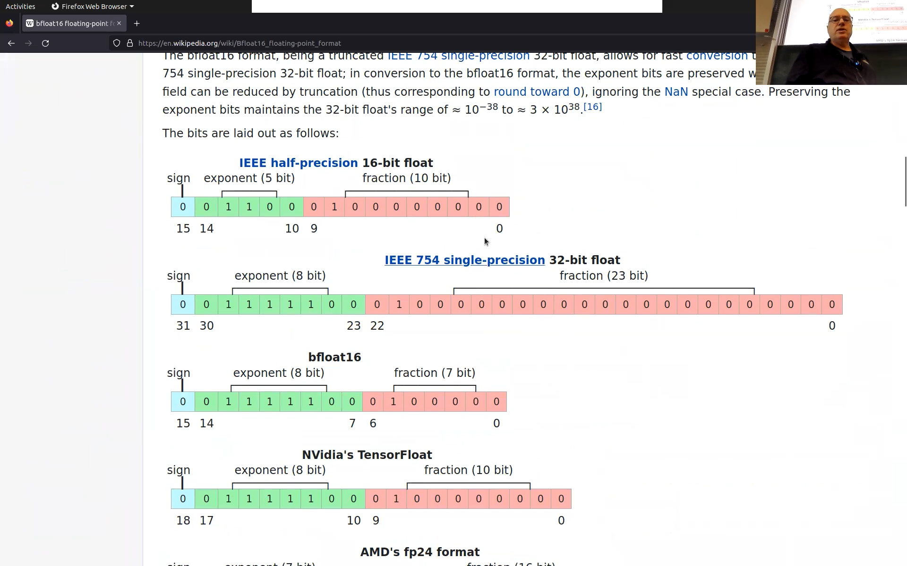
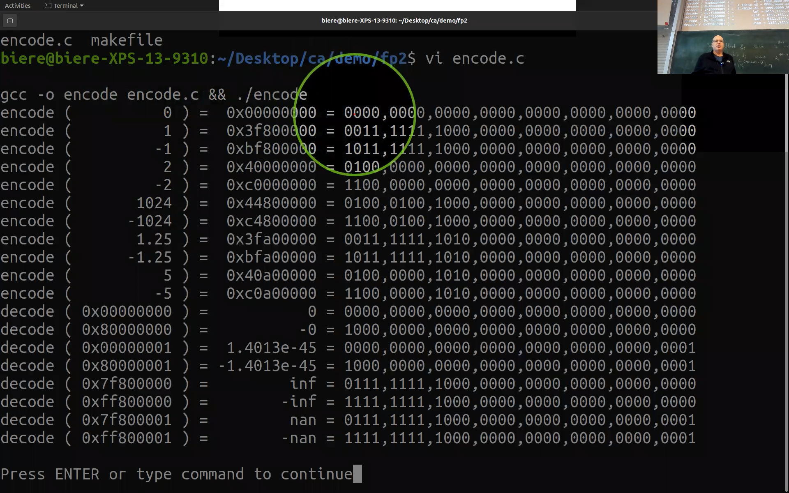
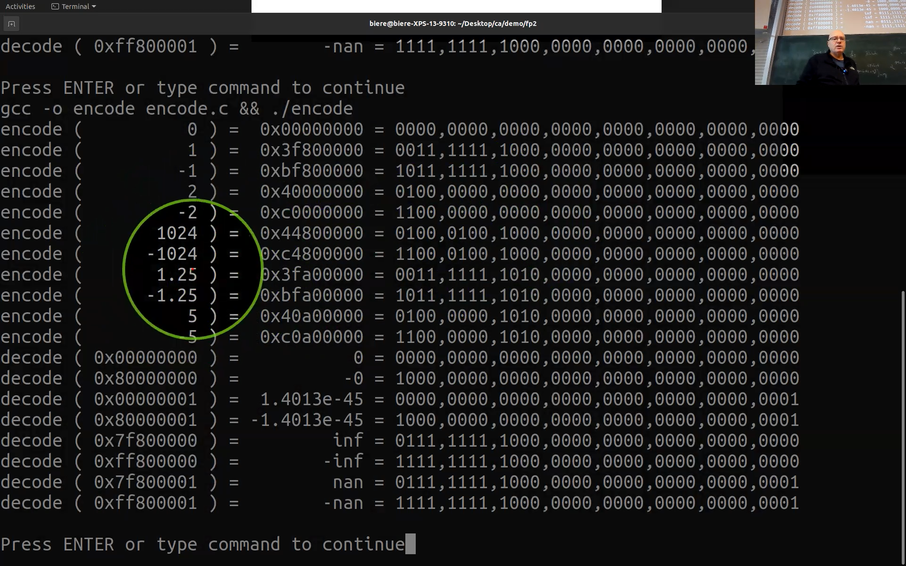
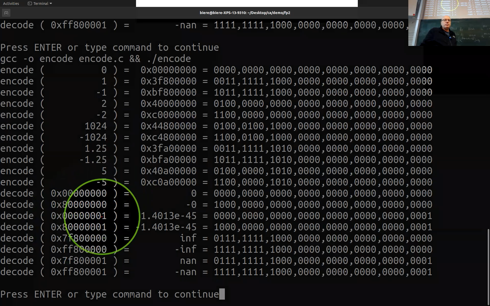
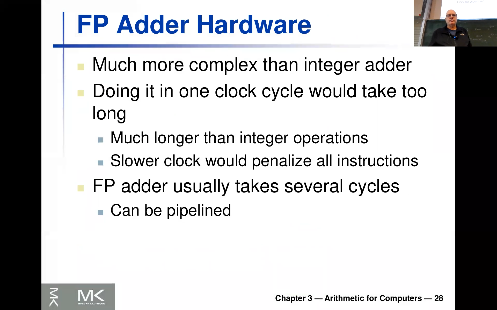
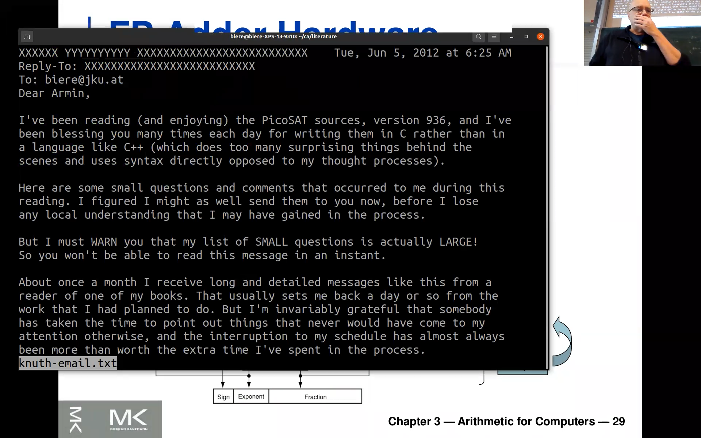

<!-- /home/areo/Videos/Rechnerarchitektur/Computer-Architecture-Chapter-3-2022-11-29-slide-16-to-29.mp4 -->
<!-- /home/areo/Videos/Rechnerarchitektur/_Computer-Architecture-Chapter-3-2022-11-29-slide-16-to-29_imgs -->
<!-- /home/areo/.config/mpv/mpv.conf -->
[toc]
# ==============0:00:00==============
<!-- - `0:00:00`: the okay in this and sharing the screen. -->
<!-- - `0:00:10`: the today wherever a pretty at least for me exciting that the arab lecture i mean like also probably on thursday so it's it's about floating points and and i took the ch. -->
<!-- - `0:00:30`: chance last year when i taught this course for the first time and to to really look into how this working and so on and i also tell you something about why it's so interesting to look at this again and. -->
<!-- - `0:00:46`: the. -->
<!-- - `0:00:49`: the show is about floating points or so and so i i really wonder like how many of you will have seen like floating point in detail like like there's one person like did you work with the like. -->
- 
<!-- - `0:01:09`: looking at the representation everything or was it more like just pure curiosity or. -->
<!-- - `0:01:16`: the okay exactly so this is what we're going to do so the answer was yes he executive this at an end i also why it was chosen like that which is actually pretty interesting and i'll show you. -->
<!-- - `0:01:36`: and like from the companion there is a key the move is below just a second from the companion there's a arm. -->
<!-- - `0:01:48`: a history on this also here in chapter thirty three. -->
<!-- - `0:01:53`: this one i think. -->
- 
<!-- - `0:01:56`: and so this one you can also get from the publisher's homepage and it's it's really interesting said as some sort of 'em that they are like first of all you will see this goes back to like almost the time m end of the second world war where people use computers actually for numerical calculation like. -->
<!-- - `0:02:16`: one motivation was computing like logistics and and there but also maybe like some numerical simulation of actor know like that or something with weapons so so so so bad logistics was probably the more more important thing and for that they would use some a simplex algorithm end to things like that and for opt. -->
- 
<!-- - `0:02:36`: musician. -->
<!-- - `0:02:38`: and and so did the very first computers actually hit already floating points which is kind of amazing nowadays. -->
<!-- - `0:02:44`: and though ah and then there was lots of disputes you can read it read this are also up here so i'm not going to tell you about that so this is in detail so so so and only then in the in the m l seventies sixties and they actually started to think about like we should ever have one they. -->
- 
- `0:03:04`: the **standardized format for that[...]** and end end are why why do you want to have a format which is standardized well first of all for exchanging data right like if you have different floating point representation and you exchange data people would mean different values but also for the program's rates or if if programs would work with one represented.
<!-- - `0:03:24`: patient he might not work with another one because they give different results so that's why standardization of floating point is actually. -->
- `0:03:33`: important an end to that happened with this **i triple e** what is **seven five four standard** and it took like a like very long actually to do this and and yeah so in the eighties into the deserve which we discussed already deserve.
- 
<!-- - `0:03:51`: am. -->
<!-- - `0:03:53`: how was he called like a second a chip core processor was called the eight eighty seven end. -->
<!-- - `0:04:02`: but internally they actually work with more beats and damn am anyhow so i'll show you something more and so it took quite some time until it really became formalized and there's liquor this old version which are almost everybody and implements in it has been updated liked i think ten years ago. -->
- `0:04:21`: like twelve years ago right so this one here **this is the standard which kind of now everybody adheres to** say it's actually pretty late if you think about it right computers were around like a what is it nineteen forty six and they had floating points but **only now people started to...**.
- 
<!-- - `0:04:42`: and that is said if. -->
<!-- - `0:04:46`: am. -->
- `0:04:47`: **standardize it** and and we're actually at at a similar situation now and they want to show you this because this is one of the motivation why this topic is so so interesting and so i'll do.
# ==============0:05:00==============
- `0:05:02`: so if you do a google for **brain float**.
<!-- - `0:05:06`: he would get to this cervical pdf page and outcome. -->
- 
<!-- - `0:05:12`: and and. -->
<!-- - `0:05:15`: this came and around actually it was invented by a by yet sorry but that air by. -->
- 
- `0:05:27`: **invented by google**, **when they did this tensor...**.
- `0:05:32`: nope **like accelerator units which were used in alphago...** and and so they have this a special so i hope we're going to look at these certainty units at the very end and.
- `0:05:45`: and **they came up with a compromise[...]** because they figured out well first of all you don't need all these thirty two bits which are usually used for floating points and the use of quite some harper and so so maybe you remember we discussed this last time a multiplayer is quadratic in the input betray.
- `0:06:01`: so a **sixteen bit multiplier is four times smaller, is four times less transistors than this thirty two bit multiplayer or like even sixteen times smaller than the**.
- `0:06:17`: the the **sixty four bit multiplier like in terms of transistors** ray and if you wanted to do like a like big set of networks neural networks maybe it's better to spend your hardware resources which means your transistors and wisely in the white this.
<!-- - `0:06:35`: so the effect afford it which you don't need or even even factor sixteen rain and and because every transistor of course needs like a power into you you wouldn't like have forced the the chip size in in and and by the way the same is true for cheaper used this happened already twenty years ago so the initial suit cheap used. -->
<!-- - `0:06:55`: were made for games like pro perfect application readable floating point was not important so you only had single floating point which is thirty two bit and also big then and even nowadays these cheaper use of my mainly made for a single precision floating points because you saved just the factor of. -->
<!-- - `0:07:16`: of area arrived a factor of four in times of of the transistors if you implement like mighty pliers for thirty two bit instead of sixty puppy. -->
<!-- - `0:07:27`: and i'm not sure now now a days because they just improving this and also cheap use are used more and more for for it in. -->
<!-- - `0:07:38`: neural network computations in and so they want to be flexible and they might invest this fact the four of transistors for four is really doing also fast a double precision and but but but like the double precision unlike a float of floating point operations per second was way smaller for. -->
- `0:07:58`: four of the tp used and the single precision anyhow so the the reason am i wanted to show you this one here is we're going to look at these two so **these two are on the slide set** and and i'll explain this in detail and.
- 
- `0:08:16`: so this machine here can also do these guys natively so there's like multiplier eder whatever like some more operations for these two formats am but really what i want to have the real reason i'm showing you this wikipedia page is because a wall is changing of course all the time so that's why i don't have it on the slightest because there's this phase this **binary float.[...]**.
<!-- - `0:08:36`: which we going to discuss in more detail and that was the one which was in the cpu for the stenzel. -->
- 
- `0:08:44`: processing unique from google which was used in alphago and as you can already see here the **green part here is the same[...]** as for the serb a thirty two bit version but the **red part is way smaller[...]** right and and and this is a design decision and it has to do with the with the.
<!-- - `0:09:04`: usage of this floating points actually i can tell you this already now. -->
- `0:09:09`: i am so this exponent as you probably know from school from using a **calculator this is format where you put an e for the exponent** rate and in here for this brain float it was decided that the **exponent is more important than the mantisa...** i'd like **which is the precision** right you only have actually only very few bits.
- `0:09:29`: afford as ditches but the exponent is much bigger re in em i think the **reason for that is[...]** a bet in most of these machine learning applications maybe some of you know this already you always or usually have 'em you take the logarithm of of of of the loss rate to the last funky little over a minute.
<!-- - `0:09:49`: then if you think about it was the lager racing over floating point while it's it's the exponent theory. -->
<!-- - `0:09:56`: and so it they saw us in a certain sense this as to me it makes it completely sense that there are applications where you want to focus on the exponent. -->
# ==============0:10:00==============
<!-- - `0:10:04`: i have more precision in the exponent and have what way much wider exponents then then for the fraction re. -->
- `0:10:13`: and so rights are **two things came together[...]** first of all exponent is is for some applications in particular machine learning way more important than than at the the fraction.
<!-- - `0:10:26`: we looked at this in detail at the minute and then second it uses of course also way less transistors rights issue cut it by half you use it losing less four times less transistors for the multiplier and even maybe you can do the multiplication faster rate like the the heat of the multiplier equal. -->
<!-- - `0:10:46`: down the picked up too. -->
<!-- - `0:10:50`: okay and and you can also see that this is i think last time i showed this last year and i showed this or they didn't have these other two in there yet. -->
- `0:11:01`: so this is a debate rate which one is going to be standard these lower ones are not standardized rate that exist in some hopper and so i chose right that **this b load is supported by[...]** an extension on into a which is called avi x five hundred twelve.
<!-- - `0:11:19`: b b f sixteen re i this last time when you go through your look at your processor what it can can do. -->
<!-- - `0:11:28`: and so it's not clear who's who's going to win. -->
<!-- - `0:11:32`: for the m. -->
- `0:11:35`: **exercise and also the exam[...]** and also like we have a very nice implementation of even a beef lot eight rate half the size of these people at sixteen so this doesn't really exist somewhere on the web but we thought it's very cool because even for sixteen you see many of the work with this is a bit hard but if working with eight bit.
<!-- - `0:11:55`: you can do in paper and it also shows all the problems you would have right and that's why we have an a nice webpage or there was an a a bachelor's project by a by a somebody in our group who. -->
<!-- - `0:12:13`: we implemented like an editor for that and we going to do look at this probably on thursday not today. -->
<!-- - `0:12:20`: okay so so this is motivation so this thing is changing again right for these guys existed like sixty years ago and to the more than sixty years ago almost eighty years ago in into and they were not standardized and there was a big chocolate to standardize them. -->
- `0:12:38`: and and you will see actually discontinued until around two thousand and ten were sort of like people did not necessarily support the standard and the talk about this oscillator and now it's it's it's kind of breaking up again rate so it's very likely that you **will need to sort of really look carefully in what floating point...**.
- `0:12:58`: **hardware your program compiles to in the future**.
- `0:13:03`: there's also something i'm not going to explain this another proposal is this pause thing where you numbs but i don't think there's hardware for this but it's like a very interesting concept so this is actually a little bit younger **there the size of the exponent is even not fixed** right so he you see green red.
- 
<!-- - `0:13:23`: and the exponent is always fixed as is his constant precision for this other guys you can have and like varying an exponent size. -->
- `0:13:35`: and maybe this one will be the dinner rates and so might mike up feeling is this is like even better formed these machine learning applications than this one ne the only advantage of these guys which have this fixed rate and and and green heart and also the sign the blue part is that of course like **for hardware it's way easier**.
# Ab hier freesytle
<!-- - `0:13:55`: we've discussed this before right you have this field and you can extract things. -->
<!-- - `0:14:01`: alright so this is the motivation but now let's go back to the slight said so once again you all know the floating points rates we have. -->
- 
<!-- - `0:14:14`: the decimal point here. -->
<!-- - `0:14:17`: the rates of just want to make you aware again then that in in a non metric like like in u s and the local for this is not a comet but it's like a potter a dot right just to be sure if like sure. -->
<!-- - `0:14:35`: and and the comma doesn't have any meaning there except maybe like clustering digits end. -->
<!-- - `0:14:44`: okay so this is a decimal number as you know and then what's what's a floating point while this this point your floats that means you also have an exponent and ride you all know it from your calculators you can also write this these three numbers with the with and he just put the decimal with a with a fracture. -->
# ==============0:15:00==============
<!-- - `0:15:03`: right and then you put an e and then in the first case last fifty six and in the second case. -->
<!-- - `0:15:10`: and a minus sir. -->
<!-- - `0:15:13`: he minus four and so on right so i think you all know that and now in hardware of course there are also proposals for resistance by the way but like we stick to binary systems ie the the base for the exponent is is of course two and martin rate it's not a decimal exponent but it's a binary spoke. -->
<!-- - `0:15:33`: re. -->
<!-- - `0:15:35`: and furthermore and this already like if you go if you think about the wikipedia entry rate this is a generic format re so you would have here the fraction. -->
<!-- - `0:15:48`: and the wise are are the exponent of course the fraction is represented as a is a binary seville need to talk about whether it's to compliment or not no it's just unsigned and and this exponent is signed but it's like in like a third encoding which we haven't seen yet then the sign of the. -->
<!-- - `0:16:08`: whole. -->
<!-- - `0:16:10`: that number is given as extra bit so this is called sign magnitude representation so that means you have one bit which tells you this that to take the number and then either negated or not. -->
<!-- - `0:16:23`: and you will see later one outcome of that is that if you would do this with unsigned numbers you would have two zeros right. -->
<!-- - `0:16:30`: like dessert like one bit zero in one at the beginning and the rest of the zeros we have two zeros and that's actually true for floating points we have a minor civil in the plaza you will see that. -->
<!-- - `0:16:42`: okay and and then here these wise as they can be negative frites so as you see here on top but there's a special actually a biased representation so it's not you could use to complement theory. -->
<!-- - `0:16:57`: but they prefer not to use to complement by the biased the representation. -->
<!-- - `0:17:05`: okay end. -->
<!-- - `0:17:08`: yeah you even have an intuition why they used the bias from presentation and. -->
<!-- - `0:17:13`: but we'll come back back later to that when we talk about the the flow diagram of like like a floating point arithmetic unit okay so this is awesome. -->
<!-- - `0:17:23`: yeah one thing i forgot to mention here is this one here. -->
<!-- - `0:17:29`: you always normalize this is called normalization the floating point in such a way that you shifted such that there's a one at the beginning ray. -->
<!-- - `0:17:38`: and a later we'll discuss actually about this special case these are called the nice numbers where there is kind of nother one the array is zero but usually you just shifter or you use humans not zero the number right and and then you shifted instead to the one like the the leading one just before the decimal point. -->
<!-- - `0:17:58`: okay and the point is then then you can drop it as if you go back here to the wikipedia so you need to think about sort of this is the the fraction this red part is the x ray in and there's a one here in front you always need to think of one because this one one is. -->
<!-- - `0:18:18`: implicit is one point and then this fraction here re times this is the y here times the the the the exponent which is encoded here but we'll talk about this in a minute like because it can be negative then the whole number is also like either positive or negative. -->
<!-- - `0:18:39`: okay so so should be or not to complete the complicated. -->
<!-- - `0:18:48`: right so you are on top just for you to remember that like also in decimal you can talk about normalized in non normalized numbers rate one the normalized one just has a single digit before the decimal point and the other one has either zero or like something which the consists of multiple pitches. -->
<!-- - `0:19:09`: and yeah as i said like this took a while to be standardized and and you look can read up the the history in two thousand and eight it was kind of an extended and this is the current version but it's like only eat like additional one. -->
- 
<!-- - `0:19:26`: sizes were actually introduced into them probably more operators so the same principle this this version from an eighty five is the one which is now in all your machines and phones and whatever. -->
<!-- - `0:19:42`: and the most important thing and so even if you haven't heard it then of course like i was too fast with my motivation. -->
<!-- - `0:19:50`: are these two for ab formats rates or is the single precision and these are also sometimes called only floats like f so in the risk five for center they get an f in the name of the assembly instruction while these guys here are. -->
# ==============0:20:00==============
<!-- - `0:20:10`: w and that in in seat they would have so i should use the whiteboard prevent. -->
<!-- - `0:20:21`: and in cd with colby float and double pan and the examples were going to do will also do that so let me just like show this them. -->
<!-- - `0:20:31`: right so so this is the er. -->
<!-- - `0:20:34`: thirty two bit via other version and and this is the er. -->
<!-- - `0:20:42`: a single precision. -->
<!-- - `0:20:45`: a sixty four bit so this would be like a it's called single precision. -->
<!-- - `0:20:51`: and this is naturally called a double precision and and you can think of this as thirty two bit. -->
<!-- - `0:21:00`: and sixty four bit. -->
- 
<!-- - `0:21:05`: okay great end them so. -->
- 
<!-- - `0:21:10`: once again back to the wikipedia is the first one is. -->
- 
<!-- - `0:21:14`: sorry we only have this the sixteen bit here. -->
<!-- - `0:21:19`: this also exists but is it's rarely used it's like only use your motivation so that the two things which you'll usually half on your harbor is deserted to pittman abortion which is the small one with the single one and and then there's one which has eleven bits for green part in fifty three bits for the red red part rain. -->
<!-- - `0:21:39`: so like twice as big. -->
<!-- - `0:21:42`: but we'll talk about this and anyhow. -->
<!-- - `0:21:47`: okay and it was really developed in response to the versions of this representation but this continued actually for a long time so i'll have a a small annex taught to you that to you later end and add because i. -->
<!-- - `0:22:06`: actually even like fifteen years ago it was not clear that you can trust your compiler and computer to really like adhere to the standard rate to the standard really says if you have these two numbers like as bitstream thirty two bit and you might apply then that the guaranteed result is that one ray. -->
<!-- - `0:22:25`: and and that's really cool that we have this now like i'll throw you later and it'll be what why why i was really happy when i realized that and am. -->
<!-- - `0:22:36`: we're still even today like issues with this maybe we can talk about this some too. -->
<!-- - `0:22:43`: okay so once again here is the overview no more am or on a template you'll you'll have the same coding here. -->
- 
<!-- - `0:22:53`: and and the sign bit there this is this s rate is zero then it's a positive number if it's one it's a negative number so this is called sign magnitude representation for integer numbers he would not use if he would always use to complement rate. -->
<!-- - `0:23:13`: the member were wise to complement an. -->
<!-- - `0:23:16`: better well because you can use exactly the same error for both rate was four for the unsigned in for the seinfeld if you have her sign magnitude you would need to sort of like first check is one positive the other negative okay so that's more complicated but if you able to complement representation for integers. -->
<!-- - `0:23:36`: and the edr works exactly the same for the site and for the unsigned rate that's also why our assembly instruction only have one ad right they don't have to. -->
<!-- - `0:23:45`: and and it's like a very good put forward for floating points you need to take this sum into account and and they do this and as separately. -->
<!-- - `0:23:59`: and okay. -->
<!-- - `0:24:02`: then the m and significant trade this is the fraction sometimes also a significant or a mantissa so these are the three names for it's a significant fraction then sorry it's not like here in this slide set and also in some literature there's there's the. -->
<!-- - `0:24:22`: it like the significant is meant to be the friction plus the one re because there's almost meant to be of a one infant. -->
<!-- - `0:24:32`: while the fraction is only the thing after the decimal point right. -->
<!-- - `0:24:37`: and that's the thing you're you're going to have to represent here in a in your pit vector right so this is the fraction plus one then gives the the significant because this one here's this hidden bit we talked about. -->
<!-- - `0:24:52`: okay now let's see what about em. -->
<!-- - `0:24:56`: the exponent rightfully so as i said the whole number is positive and negative the floating point number given by the sign bit is very simple you just look look at the most significant beating do you know what it's it's a minus negative or positive number. -->
# ==============0:25:00==============
<!-- - `0:25:10`: but the part at the exponent rights of the soso you see like on your calculator it looks like he and then there's a plus or minus in some number right and this plus and minus. -->
<!-- - `0:25:21`: then he minus fifty six for instance a ten ye. -->
<!-- - `0:25:25`: and pfeiffer so how is this minus m. -->
<!-- - `0:25:31`: an encoded and here the decision was to do a biased representation which em looks as follows so you you define a bias and then everything and at that a bias or higher is. -->
<!-- - `0:25:51`: positive in everything below that biases negative brain so you kind of always at this bias to your a number ray of light sorry you use abstracted break your positive number and no three years of you you edit rate so if a positive number for instance zero then it's good. -->
<!-- - `0:26:11`: just going to be that bias if it's one then it's bias plus one right if it's minus one is by his minus one. -->
<!-- - `0:26:19`: and then you see that you're down already and they. -->
<!-- - `0:26:25`: the convention for the standard formats right for single position with the with the eight bits m. -->
<!-- - `0:26:35`: or exponents and for double precision with eleven what's the bias and you see down here it's hundred twenty seven forty eight bits empire it sir thousand a while this is to desert title here this will be two year two three four eleven bits. -->
<!-- - `0:26:52`: so what your how you define it read the bias simply is. -->
<!-- - `0:26:58`: i. -->
<!-- - `0:27:02`: i talked to the power off and. -->
<!-- - `0:27:06`: and. -->
<!-- - `0:27:08`: exponent pits. -->
<!-- - `0:27:11`: exponent bits. -->
<!-- - `0:27:13`: minus one k and then the whole thing minus one. -->
<!-- - `0:27:20`: so and and four does seem to have precision you have and we had like eight bits right like it's here so that's why it's like two to the power seven minus one to one hundred twenty seven okay. -->
<!-- - `0:27:34`: so this one would be the power eight minus one minus one equal to one hundred and twenty seven and this dublin would have a bias to the port and eleven minus one minus one which is thousand twenty three. -->
- 
<!-- - `0:27:52`: okay that's why there's a typo. -->
- 
<!-- - `0:27:59`: okay. -->
<!-- - `0:28:03`: right so so you understand the being quoting sanchez said if i like the the smallest exponent is always zero right and it's kind of minus the bias rate. -->
<!-- - `0:28:18`: okay so i'll i'll explain you later why why why what what sort of what's my understanding why they chose that but em maybe already now is a hint. -->
<!-- - `0:28:30`: you can build the faster compare compare it though if you're using this version instead of her two compliments portion. -->
<!-- - `0:28:39`: because the you can just to earn an unsigned comparison right. -->
<!-- - `0:28:44`: if you have despite wilson to know where the one number is smaller than other one and you need that for for shifting later. -->
<!-- - `0:28:51`: okay. -->
<!-- - `0:28:53`: end and yes all all going to explain both of them and when then later in the demo i'll just show you the the float because it's like smaller and then later we also have some educational webpage which we're going to discuss proliant thirsty because it's about rounding where we showed you this a beef load aid. -->
- 
<!-- - `0:29:13`: eight but the principles are all the same and and that's why i said if you just need to get rid of these numbers and then match it to this template. -->
<!-- - `0:29:27`: okay so first of all and not all are biases as sorry not all exponents are actually kind of a real exponents of of real numbers and so the largest and the smallest one are reserved and we're going to see the. -->
<!-- - `0:29:44`: the special cases sir. -->
<!-- - `0:29:47`: am a later right and and break and then the bias notation as i said already so if you have them here like for instance in the single precision version. -->
# ==============0:30:00==============
<!-- - `0:30:00`: the the first and the smallest exponent which is not zero which is illegal one you see this one would have m is not needed we'll talk about that later is then there you have a one and then you need to the subtract the bias which was on the twenty seven and so so actually the smallest exponent in. -->
<!-- - `0:30:21`: is that due to the power minus hundred twenty six the smallest number them. -->
<!-- - `0:30:28`: within the length of number with the smallest explain this to his his his his his effect or two to the power of one hundred to minus one hundred and twenty six. -->
<!-- - `0:30:43`: ok end end end and therefore this one here is the smallest number right where everything is zero except this bit here a king. -->
<!-- - `0:30:56`: and you can and i actually didn't do this and the theme was we can do this later life and and we can actually also print this number which is the smallest one so it's it's a a so here on the pages claimed one point to tend to the power minus a thirty eight. -->
<!-- - `0:31:15`: maybe for those of you who are not like family with this you know how to where you can roughly get from the exponent here from the decimal exponent two to that one. -->
<!-- - `0:31:27`: you see this minus thirty eight. -->
<!-- - `0:31:30`: how do we get to from minus hundred twenty six years. -->
<!-- - `0:31:35`: yes times three so you haven't know if you don't know this trick like you can get from the decimal exponent to the binary one by roughly multiplying by three of course not not precise but it's it's roughly that are so insanely certain sense while you can think of it as as as a as a rule of thumb because you see a. -->
<!-- - `0:31:55`: eight is three bits and if it is this is the closest number to ten right and so that's why it's a factor of three roughly okay. -->
<!-- - `0:32:10`: and the largest value yes question. -->
<!-- - `0:32:24`: okay so so the and yes also you use abstract the the you take the number which is their right le misses the encoding and then in order to get back to the original one you need to subtract the bias ray. -->
<!-- - `0:32:39`: the opposite if you dig like you should take a an exponent like zero for instance then you need to add the expert advice so this is like decoding weather's encoding it's tricky actually also in the demo i mixed them up so i i've also regulated the demo video decode and include but of course rated if it goes in one direction you're subtracting. -->
<!-- - `0:32:59`: the one he had and am. -->
<!-- - `0:33:04`: and in order to remember how how this is done this this misrepresentation of negative numbers again i think about this trick so this became becomes later a more clear you want to make the comparator for this exponents a fast because it's is actually the very first thing you need to do when you add the almighty lay floating point me to compel their expo. -->
<!-- - `0:33:23`: conant. -->
<!-- - `0:33:25`: and a competitor for unsigned numbers is faster because poseidon unless you first need to earn either am or to explicit a check for the sign bit right leg and if then else but all you need to really subtract alpha values unsigned you see like if ever unsigned number. -->
<!-- - `0:33:45`: it's very easy to compare like they're the size but whether one is bigger or what are the other one right. -->
<!-- - `0:33:52`: and okay this is the reasons are why you have this biased negative. -->
<!-- - `0:34:00`: number representation for the exponent at least i think so there's like will not not a real description but this is like the most natural argument. -->
<!-- - `0:34:11`: okay then then vice versa here's the largest value right and here we see it again your question so you just take the largest one is two hundred and fifty four and not fifty five because this will be the the old one here and you subtract a minus m. -->
<!-- - `0:34:27`: under twenty seven and sold plus hundred twenty seven st the largest exponent. -->
<!-- - `0:34:36`: i think i haven't figured out if one one of you figures that are there i'd be curious to to know white why they didn't do the you see for me the the most natural thing would not do this minus one right but maybe the the intuition was that for this and for that by. -->
<!-- - `0:34:55`: bias rate like the making the bias one smaller that the range of positive numbers is like one exponent larger array maybe there was a reason but i don't i don't have any other explanation for that but that's how how people decided to do it. -->
# ==============0:35:00==============
<!-- - `0:35:12`: okay. -->
<!-- - `0:35:15`: i saw this first part is completely cleared if you have this bias thread you want to have it half half with y minus one that's i dunno. -->
- 
<!-- - `0:35:24`: the only explanation is what i just gave. -->
<!-- - `0:35:27`: okay and then you have a similar like it's then plus thirty eight. -->
<!-- - `0:35:32`: and for double precision it's the same and that's actually something important so i'll show you this later in a in a program of mine to get like a rough idea and how how much that is so this is doubly right this is just the default floating point you're going to use in in. -->
- 
<!-- - `0:35:51`: in software since your sixty four bit version and and a year on on these processors this is also fast on as i said like on cheap you may be not right maybe in the meantime it is but anyhow so this is your default floating point the second one the sixty four bit. -->
<!-- - `0:36:11`: one nice thing about it it has a fifty three. -->
<!-- - `0:36:17`: their a fraction bits so that means it can really hold a full thirty two bit unsigned number ray. -->
<!-- - `0:36:28`: and that was one of the reasons for instance the javascript designer actually had as initial as as number format for these tablets re so they actually the new in javascript at least the set of the full version can be compiled use of like an integer you'd be likely be represented. -->
<!-- - `0:36:46`: as a floating point. -->
<!-- - `0:36:48`: and in order to like not like you see if you only have twenty three bits for that. -->
<!-- - `0:36:54`: you would actually already for like a sixteen. -->
<!-- - `0:37:00`: million. -->
<!-- - `0:37:01`: they're having a wolf laurie while here like with a w we get until like to the power of fifty three or fifty four actually. -->
<!-- - `0:37:12`: and let's let's uh let's a good compromise rate that's a good to remember too this is one one thing one comment i want to make the the other one which is sir. -->
<!-- - `0:37:23`: interesting such as think about like a roughly the number of. -->
<!-- - `0:37:28`: a bit seer so he does visited the biases correctness he can see the number of bits here. -->
<!-- - `0:37:35`: it is roughly like three hundred the decimal number in salem not net number of bits is of course like a thousand and the. -->
<!-- - `0:37:44`: the decimal numbers around three hundred train plus and minus two hundred eight. -->
<!-- - `0:37:51`: and so if you're doing some sort of like double floating point computation and you're risking overflows that's what i'm going to show you maybe this is the kind of range i need to be careful ray fins you should not multiply two which are then like one hundred fifty or more because you might get an overflow array. -->
<!-- - `0:38:12`: i. -->
<!-- - `0:38:14`: okay. -->
<!-- - `0:38:18`: and and. -->
- 
<!-- - `0:38:22`: yeah that's like what we just said with this says zero point of the effect of three once again and so i have here an example but instead of doing and the example i'll show you this with real quote because it's more fun to actually really do this precisely as. -->
- 
<!-- - `0:38:41`: and and you can later read the slides of course if you or i mean like best thing is you run the demo which i've put us on the next cloud yourself and and modify it and see like what you get as a result. -->
<!-- - `0:38:55`: alright so. -->
<!-- - `0:38:58`: i hope i have it downloaded because by i did this home and then realized this morning in the office then they forgot to push so i actually implemented the thing just again but. -->
- 
<!-- - `0:39:13`: was not too complicated so i first need to explain that the c program a little bit before i show you the the demo. -->
<!-- - `0:39:23`: i right so here are disk encoding to decode we just discuss the uglier the really dumb version so and a really nice version would be to extract the you see this they're going to use floats here like the the eight bits of the exponent. -->
- 
<!-- - `0:39:41`: the twenty three bits of the mantissa really print them somehow the numbers rate this is what we are really going to the bit but what i do instead is i first and convert the the float into a bit vector and this is little bit see hiking so i'll i'll i'll explain this in a second desert to these two lines. -->
# ==============0:40:00==============
<!-- - `0:40:00`: the. -->
<!-- - `0:40:02`: and then just print the bits of the decoded or encoded thing and so the the decode function takes a bit vector and like thirty two bits re you and interprets it as a fluid how does it do it and that's the the sea hiking so it just takes the address of of this variable rate the. -->
<!-- - `0:40:22`: on the. -->
<!-- - `0:40:24`: i am. -->
<!-- - `0:40:26`: up up up in a register at this point so you need to put it properly onto the stack rate so you put sort of these thirty two bits of your unsigned. -->
<!-- - `0:40:35`: a word argument on the stick and then you say okay this is by away. -->
<!-- - `0:40:41`: or i interpreted as a floating point so i ticket the pointer to this thirty two bit unsigned and interpreted as a pointer to float the wishes of the same size this is why the compiler does not break if you wanted the week with w if it's a bit more tricky right we discussed this before or because of these issues with. -->
<!-- - `0:41:02`: sixty four bit unsigned it gets more like tricky so that's why doing the float here because the float years of a thirty two bit and the unsigned is also also sir elvis thirty two be ok and then i just interpret this to see these bits which are constructed our tree likely will see the constants for the day. -->
<!-- - `0:41:21`: known as a float. -->
<!-- - `0:41:24`: okay and and then of course i'm lazy then i'm just using here it's this sir ji here the print if the kind of print or pretty print the full floats. -->
<!-- - `0:41:37`: ok this will print me here the decoded version of this picture this image printed thirty two bits and here's the opposite so this is why it's called encode so i'll take the floating point kind of seemed an ascii string sort of by the compiler which i give fierce argument to this float and i encoded here. -->
<!-- - `0:41:57`: i take it like because the compiler does did this for me am and encoded into a thirty two bit vector. -->
<!-- - `0:42:05`: and then our princess ray is actually the same so you will see them and then at the end yeah this is a little like him just printing all the thirty two bits ray with the or some spacing in between so you don't need to look at this for now okay and now comes the interesting part right. -->
- 
<!-- - `0:42:25`: so i'm just encoding some floating points right in reality the compiler will do it you might wonder you see here's have a zero but the compiler realizes that the argument of encode is actually a float and so will first internally convert the sierra strengthen and in a in a. -->
<!-- - `0:42:45`: a floating point re. -->
<!-- - `0:42:48`: here of course like it it's a floating point constant anyhow hallway. -->
<!-- - `0:42:53`: mccain and so you should think in terms of testing you see these are some some interesting corner cases rate so so yeah i want to encode zero i want encoding one oh let's see what what does it do refer encode minus one then i do another a power of two likely to powers of two two and then thousand twenty four and then call. -->
<!-- - `0:43:13`: them positively negatively yeah and then i encode a number which and the next one is ordered to which we will see later has a precise encoding into floating point rate because this is one plus one forthright this is a precise encoding if i would do something else it might like like a points in three. -->
<!-- - `0:43:33`: fifth or something or might not have it right or one point three or something. -->
<!-- - `0:43:39`: and analysis so yeah i picked this on purpose because it's er and the same is true for five right that's also has a precise encoding into bits. -->
<!-- - `0:43:51`: okay now here i do the opposite so it just to take arbitrary enter of course this is what what i want to teach you like how to get from this encoding pick to floating point where they take religious thirty two bits. -->
<!-- - `0:44:06`: and interpret them as float then a print afloat. -->
<!-- - `0:44:10`: okay now of course later and so this is why please do it or try to play with this raid compile this program yourself and and change some bits here. -->
<!-- - `0:44:24`: okay end them. -->
<!-- - `0:44:28`: if i compile it then i'll get this output here and. -->
- 
<!-- - `0:44:35`: so let's go through this. -->
<!-- - `0:44:41`: okay so here comes the first part which i did not explain yet but it's like one of the special cases we said that and the eight bits of the exponent if they're zero then this not illegal number right. -->
- 
<!-- - `0:44:57`: this is almost true. -->
# ==============0:45:00==============
<!-- - `0:45:00`: okay but zero is kind of a of course like a leading number but it's still kind of not a normalized number rights to the normalized number rate. -->
<!-- - `0:45:11`: and so the serm exponent zero is reserved for those numbers which are kind of not normalized which don't have this one before the decimal point. -->
<!-- - `0:45:22`: okay in and that is really cool if you think about it though to have the zero like that why well because like in operating systems we will talk about this later when we do virtual memory and it's very fast initialized like my gigabytes of memory just by zero without really touching all the power. -->
<!-- - `0:45:40`: pages. -->
<!-- - `0:45:42`: and if you want to have an id for this gigabyte of ram. -->
<!-- - `0:45:49`: doubles or floats frame zero initialized then the operating system just gives you this for free rate so zero like a zeroing out the memory and then interpreting it as floating points just gives you an area of zero floating point number three so that's why this is a. -->
<!-- - `0:46:08`: very good choice then the encoding like this right you agree. -->
<!-- - `0:46:16`: okay now and next line so here's tricky wise there's a strange bit here or like in this and so these four bits are sometimes called nibbles rates or you need to interpret four bits then as half a byte so the foot this is the first that the most significant byte here is. -->
<!-- - `0:46:33`: least eight these eight are the next two most significant bite and tear these eight here are the least significant by three. -->
<!-- - `0:46:45`: and and we do have this on our wikipedia rates it's this thing here. -->
<!-- - `0:46:53`: and if you look carefully you see this thing here this lot least significant bit of the exponent sticks into this nipple here right in this too didn't this other pirate raid. -->
- 
<!-- - `0:47:07`: because you see like a twenty four is here the boundary where the new bite starts. -->
<!-- - `0:47:14`: right the byte goes from be twenty four to bit thirty one. -->
<!-- - `0:47:19`: and twenty threes unfortunately then the one below that bite so that's why we have here this one here's is the least significant bits of exponent ray. -->
- 
<!-- - `0:47:32`: okay so the exponent here ends here at this column here right fright after the the comma put the array right to the comma this is the the the least significant exponent bit in the most significant exponent with is the second pity of the second column here re. -->
<!-- - `0:47:50`: and the first column is of course the the sign bit so that's easy right whenever you see here assign or here or here you will like a minus for instance or here minus you will have here. -->
<!-- - `0:48:03`: i a one because it's assignment magnitude the encoding okay so once again so this is a bit tricky here when you read the serb bit the sign bit and incomes a bit of exponent but it's like you see it's it's a bit hot so you keep venue points and look at now this hexadecimal number here. -->
<!-- - `0:48:23`: it would be more better if the exponent would be the first eighty three. -->
<!-- - `0:48:29`: because then you could read off the exponent almost as israel but now it's at the the zero a bit here's nice to hear this would be eight and this is for their missing here re. -->
- 
<!-- - `0:48:43`: and and so what's left here are our seven am bits year one two three four five six seven which are all one. -->
<!-- - `0:48:53`: so so this is just like one under twenty seven right. -->
<!-- - `0:48:59`: and one on the twenty seven minus the bias one hundred twenty seven gives zero. -->
<!-- - `0:49:06`: so this is why you see this all bits one except the first two here is just. -->
<!-- - `0:49:15`: an exponent of zero so he lost zero re. -->
<!-- - `0:49:20`: okay. -->
<!-- - `0:49:24`: okay so in order to decode it you need to kind of and yet lately let's have a look for instance here at the sam yan na na i continue as as one now the the minus one is of course trivial it's the same as this one here ok. -->
<!-- - `0:49:39`: and just this first bit flipped. -->
<!-- - `0:49:43`: so so just as ascending to check why is this fraction all zero right so this is the twenty three bits of the fraction. -->
- 
<!-- - `0:49:52`: yes. -->
<!-- - `0:49:54`: yeah. -->
# ==============0:50:00==============
<!-- - `0:50:04`: fractions yes exactly but there's likely that the main point i wanted to make us think about again about this hidden bit. -->
<!-- - `0:50:11`: right so like in in a certain sense this is one point zero zero zero zero re the one would be like exactly here where else where the least significant bit of the exponent is but it's not trolling rate it's hidden is always one except for those numbers which after exponent all do it. -->
<!-- - `0:50:33`: okay that clear rates so that's why why this all zero here xd includes one in not always zero re because there's this hidden bit in front of it. -->
<!-- - `0:50:43`: and then you just have to to the power zero. -->
<!-- - `0:50:48`: and that's of course and then one one times one is one. -->
<!-- - `0:50:55`: alright and now you see like what what about two okay. -->
- 
<!-- - `0:51:02`: while two is just one times two to the power of one okay so again likely have all zeroes because one point zero zero zero is our one. -->
<!-- - `0:51:12`: we need to multiply it by an exponent which is. -->
<!-- - `0:51:16`: one right. -->
<!-- - `0:51:18`: helps sorry. -->
<!-- - `0:51:22`: eh ok it was neglected to compile again am am. -->
<!-- - `0:51:29`: okay so so that means actually what we need here is one hundred and twenty eight raid. -->
<!-- - `0:51:35`: because if you take one hundred and twenty eight in the subtract under twenty seven we get one put the pole one is two two times one gives two okay. -->
<!-- - `0:51:47`: and and so on right so now we can probably do it but i won't do it so this is something more fork for like on paper or for exercise the wife thousand and twenty four like that right with the reasoning which i said okay this is the precise number just a single bit and we need to put the exponent them. -->
- 
<!-- - `0:52:05`: then at a certain place ray. -->
<!-- - `0:52:11`: okay rights when you need to encode ten here somehow to figure out that this thing number here sickly ten in despised for representation. -->
<!-- - `0:52:22`: alright and now i'm here and what about this thing here one point two five. -->
- 
<!-- - `0:52:30`: while you think about one two point two improver is one plus one four so it's something like one dot zero one re. -->
<!-- - `0:52:39`: and this is exactly this year this is this sir cyril one here zero one one the one is hidden right one dot the one. -->
<!-- - `0:52:50`: or do you need two bits true. -->
<!-- - `0:52:52`: four four four one point two five and you see the same is true for five five has four in one true as bit one zero one. -->
- 
<!-- - `0:53:03`: if he normalizes the first one is is hidden and the one in code zero in one side so this is why the fraction here of these four lines years on the same rate. -->
<!-- - `0:53:17`: only the exponent is of course different. -->
<!-- - `0:53:23`: there are other prices this part should be in. -->
<!-- - `0:53:28`: not that complicated but of course you need to understand these different ways of an encoding like positive negative numbers and yeah i know it's awkward that the boundary he is a disparate maybe yeah i dunno like maybe the having assigned me the most significant is easier so. -->
<!-- - `0:53:49`: other questions on this one. -->
<!-- - `0:53:51`: then then i'll move onto the the the lower part so so so maybe i showed the program once more. -->
<!-- - `0:54:00`: okay so it's all to have this hex constant here this is in eight or the hexadecimal color numbers which is like four bytes. -->
<!-- - `0:54:10`: enables the king. -->
<!-- - `0:54:13`: and when i compile and and run it it will just receive print this number here again. -->
- 
<!-- - `0:54:23`: then i kind of you see it is like i put it into some memory and then i read it as if it was afloat okay they just take this bitstream. -->
<!-- - `0:54:34`: now give it to my pretty printer and a pretty printing out the coats for me this thing into a real floating point numbers right and you see what's happening so so this you could put any bitrates if this is what what i said like it's very instructive if you do this later you just play a little bit change some bits here and see like. -->
<!-- - `0:54:54`: though i understand what's happening yeah here in may here it's clear of course what's happening right this is just the same as this one okay and that's what's happening here eh. -->
# ==============0:55:00==============
<!-- - `0:55:08`: alright now let's look at the first two and this is already like it'd be like a special case yeah zero is a special case which we had already right but what about if i flipped the first bit of zero. -->
<!-- - `0:55:21`: hey. -->
<!-- - `0:55:23`: well then it remains an illegal number like and be normalized numbers caught because the exponent is still zero your fraction is zero and then there's like this special case yet and it's a negative zero right that's actually what my print of actually he caught for me anyhow it's a negative zero. -->
<!-- - `0:55:43`: so why would you want to have this am and is also explains a little bit why this sign magnitude representation for the floating point having the singer pit in front makes sense to think about some sort of like limit computation rain. -->
<!-- - `0:55:59`: and it's always like something which goes to zero re. -->
<!-- - `0:56:04`: and maybe then you'll you want to sort of say if you might apply this thing always by sort of zero point nine at one point it takes exponentially goes to zero. -->
<!-- - `0:56:14`: uk and then of course it should go to this era this is the first theory but now what's the opposite you start with minus ten and then you mighty polite and by and by zero point nine right every time. -->
<!-- - `0:56:31`: and then you seen rarity this number would never be zero rain. -->
<!-- - `0:56:36`: because meaning the real numbers or with arbitrary precision numbers rate and so now what's happening in this process this thing which has get like very close to zero at one point would be zero but you say it was approximated from minus. -->
<!-- - `0:56:51`: said will actually become than a minus zero because it makes it makes actually even sense to like you have a computation which which reaches the in one who changes minus one. -->
<!-- - `0:57:05`: okay now on to the next one those are particularly interesting you see now i'm changed flipping just a single bit here. -->
- 
<!-- - `0:57:15`: okay tested the least significant bit. -->
<!-- - `0:57:21`: but i'm keegan keeping the exponent the normalized rates so this is kind of illegal and these are called the normalized numbers so these are numbers which have their exponents zero. -->
<!-- - `0:57:35`: so they don't have this one point something so they interpreted as having a zero there they called the normalized numbers so this is the exception where you say these numbers have them have a zero kind of before the fraction. -->
<!-- - `0:57:52`: and yeah and then you have of course like to to the power from like mad mantissa like a fraction bits of these numbers. -->
<!-- - `0:58:01`: and and the reason for this is similar to what we just discuss with his approximating the the zero from above or below right the alternative would be a case as soon as you you will get an underflow write your number cannot be represented like it would be the result of too slow or too small right to be to have an oven. -->
<!-- - `0:58:21`: this hidden one in front of it right because you might have played again by zero point nine. -->
<!-- - `0:58:27`: and then you get one one choice implementation choice would be or i can just make this array. -->
<!-- - `0:58:34`: but they decided not to do it they said okay even for those numbers where the where this this hidden bit is not one you want to distinguish them in this endeavor but in the size right. -->
<!-- - `0:58:48`: and that's what you achieve with this and that the normalized number so you can have like sort of even said if below the smallest we saw on the slide like this what was it like minus ten to the problem minus thirty eight. -->
<!-- - `0:59:01`: we can still have like even smaller numbers and and here's the here's the smallest number were sort of the exponents years is zero. -->
<!-- - `0:59:12`: and em. -->
<!-- - `0:59:15`: am and the m. -->
<!-- - `0:59:20`: it is the hidden bit is assumed to be false here like zero and then you get this number if you computed you seen this is smaller than our ten to the power minus thirty eight. -->
<!-- - `0:59:32`: so that means when you go click get closer to zero you have a range of numbers these the normalized numbers which are i am a specialist so they kind of not zero yet but he cannot like exponentially scale easily by changing the exponent the exponent is fixed to zero but you can always get still slower the closer to two zero. -->
<!-- - `0:59:54`: okay so this was an enormous so this this fall here are the normalized numbers they called the first these two are kind of natural the zeros are this is a bit odd rape but it's like part of this floating point standard. -->
# ==============1:00:00==============
<!-- - `1:00:11`: and yeah i'll show you later some issues with hardware. -->
<!-- - `1:00:18`: with these guys and write unity and implement them yes. -->
<!-- - `1:00:23`: the i know this is because your if the exponent is zero then it's the normalized number and if and then is always zero this is the simple rule right it. -->
<!-- - `1:00:44`: the exponent if it's all zero you have the normalized number so the hidden bit is zero that's the the rule. -->
<!-- - `1:00:51`: i alright and then we have two infant infinities rate so they just have the largest exponent so maybe you can now train yourself that this this thing is actually the the eight bits which is the largest bits for the for this bias representation of the exponent right side. -->
- 
<!-- - `1:01:10`: seven f eight. -->
<!-- - `1:01:13`: hey this is just like a two hundred and fifty five but shifted by one. -->
<!-- - `1:01:21`: and and then there's of course a negative version of it as well where even the first bit is is is one right in this way you get like a minus infinity plus infinity array to and this is the pattern right so this is this eight bits of the exponents are on one like the highest illegal value. -->
<!-- - `1:01:42`: and then you have here the and the zero and one and infinity is kind of well as you might apply something with infinity it becomes always like again convenient right. -->
<!-- - `1:01:54`: and so on. -->
<!-- - `1:01:57`: i. -->
<!-- - `1:01:59`: and this is like how you handle overflow rate because right if your take the maximal a representable number ten to the plus thirty eight and you you add something to the table overflow and then it becomes infinity. -->
<!-- - `1:02:15`: and now you paid attention am. -->
<!-- - `1:02:20`: and the fraction here's all zero right. -->
- 
<!-- - `1:02:24`: now in principle one could do the same thing like wanted here on the other side right closer to zero and also use this if you have something which is some sort of nonzero there is a slightly bigger infinity than ray but this doesn't make sense that that's why the designer decided everything which. -->
<!-- - `1:02:43`: which is a has a has the largest exponent like bitwise. -->
<!-- - `1:02:50`: and has. -->
<!-- - `1:02:52`: here zeros in it that's not in that number right. -->
<!-- - `1:02:57`: and and. -->
<!-- - `1:02:59`: not a number can happen for instance you should take square root of minus one or if you do. -->
<!-- - `1:03:05`: depending on your architecture here divide by zero re and you get like a not a number and that's like also pretty tricky so fling points leonard has even the set rates have quite a bit some but everything which has here like once anyone here that's not a number. -->
<!-- - `1:03:25`: and and is precisely defined what's happened if you might apply things harry. -->
<!-- - `1:03:32`: md and i think that you can easily figure out like what you want here like mighty playing another number with something of course gives another number right. -->
<!-- - `1:03:41`: plus infinity times minus infinity probably keeps not a number right because you don't know which of the two is going to write and so on so he just this is the most sensible way. -->
<!-- - `1:03:53`: and and the thing i'm going to explain in detail and on thursday it's also with the bachelor sees the project he had. -->
<!-- - `1:04:04`: and his rounding that's actually pretty tricky here and and we're not going to them did they took us to discuss it today in in in detail. -->
<!-- - `1:04:21`: okay so-so on his lights where he'd be going to again over this and then then then published take questions on this some representation. -->
- 
<!-- - `1:04:34`: okay so so this was the trick with the how you'll get like from such a bit to the un. -->
<!-- - `1:04:42`: and so this is the the encoding part read manually now and and then and this is the decoding part we also did rate so so we don't do it again here like an honest lights you can do look at this later but it's the same as what we just did like with the program. -->
# ==============1:05:00==============
- 
- 
<!-- - `1:05:01`: and then he had this the normalized numbers right. -->
<!-- - `1:05:05`: said it as you asked rates so it's at least the normalized numbers you just read the exponent if it's all zero it's the normalized number right if it's all one it's either infinity or not a number but if it's all zero to the normalized number which means that this or you have a zero here right this was your question. -->
<!-- - `1:05:27`: and am. -->
<!-- - `1:05:30`: okay and we also have these two numbers that is two zeros which we saw already right because there's a sign with you in front. -->
- 
- 
<!-- - `1:05:39`: and yes this was a discussion with another numbers and infinities like the the largest exponent the bitwise is two hundred and fifty five for floats and. -->
<!-- - `1:05:52`: the friction is zero and then his plus minus them infinity and you can have crazy like without sort of is he have your kind of everson l let's say metrics multiplication whatever and if for some reason you get an overflow this thing would just continue computing would at the end at one part maybe have a. -->
<!-- - `1:06:10`: infinity or whatever re. -->
<!-- - `1:06:13`: a pleasant zero times infinity is also not not a number ray. -->
<!-- - `1:06:18`: i. -->
<!-- - `1:06:20`: yeah and then you have all this in the undefined resized he would always become not a number. -->
<!-- - `1:06:27`: and what's kind of interesting if you really do sort of and control software and embedded systems for instance some of you are in this embedded systems serve bachelor master. -->
<!-- - `1:06:39`: and you're remodeling some some real let's say some filter or whatever some control over iverson you would of course implemented is floating points rain. -->
<!-- - `1:06:50`: but then you need to make sure that your everson never gets into this not a number thing right or not into infinity war plus infinity because otherwise your hardware would to something completely strength free and so at that point when you get soda from the mathematical model into floating points you need to actually think that you're not getting over. -->
<!-- - `1:07:10`: source. -->
- 
<!-- - `1:07:15`: rk and. -->
<!-- - `1:07:18`: so now we're ready to to look at them and a rhythms as i said the the actual rounding in detail we're going to the on thursday but like hey i'll show you frist and. -->
<!-- - `1:07:34`: how in principle it works and then i'll show you this anecdote i was mentioning before. -->
<!-- - `1:07:44`: so as of actually doing arithmetic though the quest is pretty simple so you just need to align the. -->
<!-- - `1:07:50`: the decimal points re. -->
<!-- - `1:07:52`: so look here you have here two decimal numbers. -->
- 
<!-- - `1:07:57`: and like one is like a a e one right the other one ie minus one okay and if i want to add them as you did in school raid europe you just have to align them that means you take the smaller one and and shifted. -->
<!-- - `1:08:15`: to to match the same exponents in this case right because the data the difference between these two exponents years to need to take this in in in absolute value smaller. -->
<!-- - `1:08:29`: number here and a divided by up by hundred right so shift the exponent here by by two by so adhered to with shifts here this number here into zero point zero one six fray then you have the same exponent and then you can add a with your. -->
<!-- - `1:08:50`: the ordinary an ordinary at a right that's what what everybody knows how to do. -->
<!-- - `1:09:00`: and but now comes the tricky part you need to round somehow and in addition you need to normalize right because this is snow. -->
<!-- - `1:09:11`: another real overflow but like the etiquette carry right in our decimal numbers here it's like a one. -->
<!-- - `1:09:19`: and so we get lectin right nominee to normalize again. -->
<!-- - `1:09:26`: so that's also simple we just shift this thing this one this one digit rate to the so the increase here the exponent by one from one to two and chief this whole thing to the right. -->
<!-- - `1:09:41`: okay now comes the tricky part which is set we're going to do on thursday. -->
<!-- - `1:09:46`: okay i need to get rid of this last digit because you see i have only like let's say twenty three or fifty three bits. -->
<!-- - `1:09:54`: now i need to round. -->
<!-- - `1:09:56`: and and and that's actually one of the non trivial things about floating point in general in using them and also implementing them so so we're looking at implementation and i'll also show you. -->
# ==============1:10:00==============
<!-- - `1:10:10`: at the. -->
<!-- - `1:10:12`: and how how how what kind of effects you have through that. -->
<!-- - `1:10:20`: okay in the end. -->
<!-- - `1:10:23`: this is the same for binary right works exactly the same way so there's like no or no difference right so you just like i have ben as a base too. -->
- 
<!-- - `1:10:33`: your bitching is always one right ok but now you you would say okay you explain to us this the normalized numbers yeah exactly for the normalized numbers you need to be have a separate implementation likely so i'll have a paper also uploaded into nextcloud where some there's a nice paper from some i-beam engineers not too old. -->
- 
<!-- - `1:10:54`: where did they go over the history of implementing the ser and the normalized numbers but if they are not the normalized rates are they both like to have a one here in front of the decimal point right into the executive same so you just make these by shifting and now shifting is also really enough. -->
<!-- - `1:11:14`: hardware shift rates so this guy here and and and needs to i'm sorry miss this is the smaller one so this needs to be shifted also to the buy one position rates of nice bits these three bits here get to one one one zero drops out. -->
- 
<!-- - `1:11:31`: again like me to refer to next thursday. -->
<!-- - `1:11:35`: what really happens with this this euros there's extra difference if there was a zero or one. -->
<!-- - `1:11:40`: i am. -->
<!-- - `1:11:42`: and then you just take the other with this we saw last time right and you're at least two things together. -->
<!-- - `1:11:50`: and. -->
<!-- - `1:11:54`: now you can get our also an underflow like like what we have here and you need to do normalize again rates will need to shift this thing here to the to the before the decimal point then increase the exponent m. -->
<!-- - `1:12:10`: accordingly and air and at the end you're getting here are this number and i think here because are precise and there's no rounding happening really that's the the correct answer i think like the really precise answer or arbitrary precision concert. -->
- 
<!-- - `1:12:33`: alright yes question. -->
<!-- - `1:12:38`: yep so this yet you always shift the small numbers just for the for the recording and remember so we're going to actually look at this next slide here. -->
<!-- - `1:12:47`: you need to figure out which is the smaller one first rate because you don't know right like these numbers are the righteousness of your risk five. -->
<!-- - `1:12:56`: and then you're giving to this a floating point harper and then the arisen as described needs to execute and you need to figure out which one is the smaller and and as i said this is what i why i said like why they had this why i think they did the biased. -->
- 
<!-- - `1:13:13`: implementation of this exponent biased encoding because this is the very first thing it's happening is called small ala you here. -->
<!-- - `1:13:23`: it's helping you see like if you look at remember like what's important for hardware right you need to look at the delay like the longest path in the execution yeah his those are some big arrows but like forget about them for now we've completely clear that this this is under hot on the longest path right this comparison of the exponent. -->
<!-- - `1:13:42`: is it just those also like the asked rate and that's why i think they picked the business of biased representation so that this and you can be made a smaller right. -->
- 
<!-- - `1:14:00`: and of course you need to do such a prefix computation the disgust before right like a comparing the competitor or circuit can of course be implemented bit by bit almost like in a ripple carry adder but that's too slow right you really want to have there very fast. -->
<!-- - `1:14:17`: small a you you cheap of course you can just put in the subtraction here right and look at the carry out like whether it's to check with which one is bigger. -->
<!-- - `1:14:29`: but like you probably want to have their unlike something which has this prefix pro construction we discussed before that this theories like nonlinear in the bequeath of the exponent or even if it's just eight or eleven okay the what really want to make this as fast as possible. -->
<!-- - `1:14:50`: okay and then. -->
<!-- - `1:14:52`: are you comparing these exponents that's what we just this the set rate then you will get the difference in exponent and then this is used for shifting one of the tool to the right right you'll need to kind of check here in the control which of the recite of the difference whether it's negative or positive right or whether the comparison is says wander. -->
# ==============1:15:00==============
- 
- 
- 
- 
<!-- - `1:15:12`: the first one is smaller and then depending on that one you either take the re the first. -->
<!-- - `1:15:19`: a floating point here to the left or the the second one to the left and vice versa right the other one to the right. -->
<!-- - `1:15:29`: and then you'll always shift the first one right this is just like that so you have the shifter only in front of one of the guys. -->
<!-- - `1:15:38`: enter am right then you have the shifted thing then we can do the yeah here the shift amount is also determined he of course from this difference re. -->
<!-- - `1:15:48`: and and. -->
<!-- - `1:15:51`: and again here rates are so so this would be a bit eleven bits the sheep the pound would would be three in here for bits rate so the shifter we also looked at this and this bearish if the meteor would have liked them like the heat of war three. -->
- 
<!-- - `1:16:10`: okay and then you can really do the arithmetic like let's say the addition of the floating point that is happening here in the big ale you right. -->
- 
<!-- - `1:16:20`: this was this is the thing where we said like white pays off to look at sixteen bit floating points instead of thirty two because here right this crows contract issues to a multiplier between two guys. -->
<!-- - `1:16:35`: oh and if you have here sixty four bit it's like sixty four times sixty four re or if you like in this machine you can have even five hundred a portrait is really big one if you really want to do implemented like this but at least sixty four bit machines is now even in your fallen theory. -->
<!-- - `1:16:54`: this is why this thing is called big l u and this is a small one because it only compares like these these guys the way smaller. -->
<!-- - `1:17:04`: but okay and now you'll need to i am actually an editor do some cross processing right so you need to do a shift left or right or overflow or underflow right both can happen maybe i should go back here this was an under-floor ok. -->
- 
<!-- - `1:17:23`: because the result of the error here was you see it was too far to the right while while here it was an overflow ray like the pitches by two digits before the decimal point or so you can shift to the left or right. -->
<!-- - `1:17:42`: so that's what what what this does here are okay and then there comes the rounding hardware as i said like this actually pretty involved and i took the opportunity last year and when i gave this course first time to really look into this so this is not in his lights all lips extremity. -->
- 
<!-- - `1:18:00`: cereal and but we also have now this bachelor thesis i hope you you will like this. -->
<!-- - `1:18:08`: alright so we're going to look at this in more detail on on thursday so i'll want to finish with an anecdote which. -->
- 
<!-- - `1:18:24`: so. -->
- 
<!-- - `1:18:26`: you know don clouseau i got this email like in two thousand and twelve from from somebody claiming to the pollutant he was really good uncle so he looked at my my sat solvers he wrote actually later book wendy sat solvers. -->
<!-- - `1:18:38`: and. -->
<!-- - `1:18:40`: you see i get this email out of the blue was kind of strange and he gave me a clear forty two forty eight questions right to the source code i was writing and. -->
<!-- - `1:18:52`: and for the first one here. -->
<!-- - `1:18:55`: is related to our election that's why i wanted to shortage to this one okay i i read it to you i find it interesting or worthy that you decided to implant your own floating point routines like in assets over this was around two thousand and eight then i implemented this i didn't rely on my hardware rights is just fourteen years ago i actually employ. -->
- 
<!-- - `1:19:15`: lamented the a software version of the everton which saw right. -->
<!-- - `1:19:20`: and i. -->
<!-- - `1:19:22`: and he actually ink intake later in all this he did this to read and there the the reason was this was of course like in the sixties or seventies rate because back then there was no hotmail which would implement the floating point like you see as you would like so the like every compilation would give you in a different part with. -->
<!-- - `1:19:42`: besides and he wanted them to their site have taken logic to always look the same rate no matter what computer you used. -->
<!-- - `1:19:51`: and am. -->
<!-- - `1:19:55`: and that's why he also did this so in the original take there's a software floating point in it rates whenever you do a floating point addition you will take this bit we're just take them apart as we did and you just implement the arisen which is detroit this way you are assured that whenever you come you use the floating point like we're putting the a somewhere on your page will always a. -->
# ==============1:20:00==============
<!-- - `1:20:14`: end up in exactly the same sparkly. -->
<!-- - `1:20:19`: and and and and the reason is even worse and this is like this did this this point here and it's actually. -->
<!-- - `1:20:27`: the reason i did this am in. -->
<!-- - `1:20:31`: around that time so like between two thousand and two thousand and ten i would say and you could not really for sir are also an ad like machines to really execute the floating points always in the same way and there's like a very nice story from from one of my colleagues nicholas in on this so he compiled his. -->
<!-- - `1:20:51`: his sats over back then like this was this from the poultices and five and he and executed it on on linux the same and the same binary on bsd ray he gives what the floating kwan gave different recite and the reason was because on bsd it was default back then and too. -->
<!-- - `1:21:12`: the floating point unit of the x eighty six into the more to internal use eighteen pits for the french okay because the original and interdesign had internally more bits for the fraction than actually would show you to the top to the usury. -->
<!-- - `1:21:29`: while on linux and windows they add like the compiler forced it to the stick to the this format with his customary you take the same binary ok you run it on the same machine but depending on the operating system under the receipts it's a is a bit in the system. -->
<!-- - `1:21:49`: you get different results and then of course if this floating points are used to compute jurisdiction or something right you get completely different results for one execution of the same binary right which is otherwise completely deterministic just to this effect. -->
<!-- - `1:22:08`: okay and then he goes on yeah i was not precise enough i lost some pits when i did this rate like yeah and then i don't have time today but you can also go to my peak was at the source code and look at this a floating point. -->
<!-- - `1:22:24`: implementation and to which also knuth read and then he found some. -->
- 
<!-- - `1:22:32`: yeah so so so you see like you just can't do the same thing which is the hardware does like in software re this is your fallback and i also needed not all optimizations i could spend also more time or more space for the exponent because in this application it was better right through to spend more space for the export. -->
- 
<!-- - `1:22:52`: alright so that i think like and if there are no more questions because this will take some time to go this discord but there's like for instance m a and eder and and if you wanted to read that this odysseus follows exactly the the thing we we we saw here on which is almost still visible here. -->
<!-- - `1:23:11`: but i don't have time to go to the se it's not really complicated right and this will execute and all machines in the same way so this was the reason back then. -->
<!-- - `1:23:21`: and it might be still interesting for you to to think about this because for some of these formats we discussed this unit for instance there's no heartbeat array they only exist actually in such a such a form and rate like in a software library. -->
<!-- - `1:23:37`: and if you want to play with something like that maybe you want to also understand this okay. -->
<!-- - `1:23:43`: all right so it's a normal questions. -->
<!-- - `1:23:48`: alright so so if you and so it's really fun and playing with his bits with the floating points will have a look at this demo with a recording and encoding and and executed put some steep bits in it and see what you understand if you change this bitter this one that's a really like a useful soul alright. -->
<!-- - `1:24:07`: then no more questions i see you on thursday and we'll talk about rounding then ok then bye. -->

# Binary Fractions
- 
- 
- https://www.electronics-tutorials.ws/binary/binary-fractions.html

# Timestamps
- 0:16:00
- 0:16:14
- 0:17:01
- 0:17:40
- 0:19:35
- 0:20:03
- 0:23:05
- 0:23:14
- 0:23:42
- 0:23:49
- 0:24:21
- 0:25:46
- 0:26:55
- 0:27:53
- (0:28:03)
- 0:28:30
- 0:31:16
- 0:31:53
- 0:33:04
- 0:33:26
- 0:34:44
- 0:36:25
- 0:37:24
- 0:37:53
- 0:38:22
- 0:39:32
- 0:40:49
- 0:40:53
- 0:43:22
- 0:43:57
- 0:44:48
- 0:45:27
- 0:46:24
- 0:46:31
- 0:47:26
- 0:48:24
- 0:48:33
- 0:49:45
- 0:55:17
- 0:55:44
- 0:57:28
- 0:58:09
- 0:59:32
- 1:00:43
- 1:00:54
- 1:01:15
- 1:01:48
- 1:02:01
- 1:02:25
- 1:02:43
- 1:02:58
- 1:03:24
- 1:06:04
- 1:10:33
- 1:11:29
- 1:11:54
- 1:12:47
- 1:13:05
- 1:13:46
- 1:14:01
- 1:14:06
- 1:15:13
- 1:15:29
- 1:15:43
- 1:16:02
- 1:16:20
- 1:16:54
- 1:16:30
- 1:16:54
- 1:20:56
- 1:23:26
