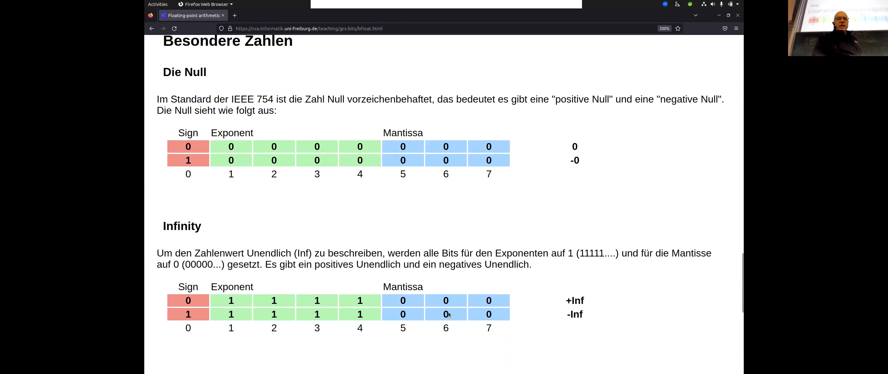
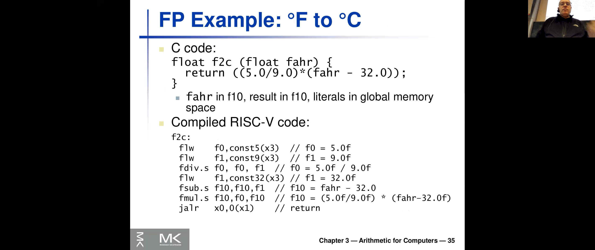
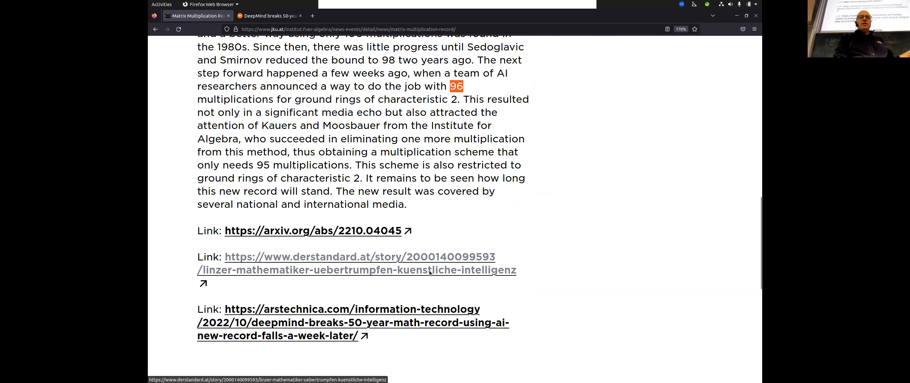
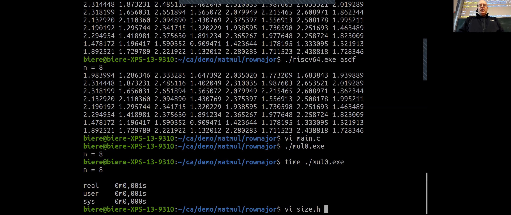

<!-- /home/areo/Videos/Rechnerarchitektur/Computer-Architecture-Chapter-3-2022-12-01-slide-30-to-39.mp4 -->
<!-- /home/areo/Videos/Rechnerarchitektur/_Computer-Architecture-Chapter-3-2022-12-01-slide-30-to-39_imgs -->
<!-- /home/areo/.config/mpv/mpv.conf -->
[toc]
# ==============0:00:00==============
<!-- - `00:00:01`: tangier the screen. -->
<!-- - `00:00:10`: okay so what was missing today is. -->
<!-- - `00:00:16`: oh sorry last time was discussing the rounding in this will be a major part of today's lecture and also. -->
<!-- - `00:00:28`: i'll talk about matrix multiplication this is the plan for today. -->
<!-- - `00:00:33`: okay so so remember. -->
<!-- - `00:00:36`: you need to kind of have these numbers in there and and and their exponents usually differ so one needs to be chuffed shifted end and the normalized that means they usually would need to have an oven at the at the det the single digit before the decimal point this is called normalization and then. -->
<!-- - `00:00:56`: you cannot add them because they're like half the ones at the same place but the different exponents will you need to shift one actually you you shift this the one with a smaller exponent to the right side loses then digits and then you're at the sing in the speak a new here and then two things might happen that might. -->
- 
<!-- - `00:01:16`: be an and an underflow because while we do subtraction with this thing too so this is actually what i'm going to show you later on the blackboard or edition and then there might be an overflow the overflow will only generated most one carry digit rate and then you need to either shift to the left a multiple times or two. -->
<!-- - `00:01:36`: the right just once okay in and then you end up with to differ temporary result which might have more digits and then you need to round and that's exactly the kind of the real sort of pitfall for the serb floating points and i'm going to explain how plane how this rounding really works because it's really cool to to understand. -->
<!-- - `00:01:56`: and and there are also some tradeoffs and engineering tradeoffs which are interesting so that's what i'm going to explain. -->
<!-- - `00:02:05`: okay but before we do that i want to. -->
<!-- - `00:02:09`: oh let's do this first the rounding and then i'll i'll talk about the or the multiplication because that leads better to the add to the m. -->
<!-- - `00:02:19`: the matrix multiplication already now i can show you these two slides so it works the same way you can do it in decimal you can do it in in binary and in essence the only thing which differs year's venue instead of adding the two numbers you just multiplying them see it to the big ale you will then be a multiplayer so that's why this is a arithmetic logic unit then. -->
<!-- - `00:02:39`: not just an eta right and and so. -->
<!-- - `00:02:43`: so this thing then just adds or might applies or does something else with one of it's search operations raid. -->
<!-- - `00:02:50`: and then but the rest is the same and so the rounding part and the shifting party only difference of course is if you might have led to numb right then there might be a much bigger overflow than than than just one single bit. -->
<!-- - `00:03:08`: okay and what i'm going to show you now like in in three parts is a rounding scheme so there's also an on the i don't have it open yet on this sub. -->
<!-- - `00:03:22`: and carpets like a a description i found at the other a this is the most precise corruption i found i found it on stackoverflow of course and i couldn't find yet as some other flex a little lecture notes and and i also looked up it in the papers but in pay. -->
- 
- 
<!-- - `00:03:42`: basically way more complicated so i'm going to to explain it here with the with this example here which is also in the notes but i'm going to do it on the blackboard so with that i stop. -->
<!-- - `00:03:53`: sharing and since my mic is where a king should for the first time really work ok. -->
<!-- - `00:04:06`: okay so. -->
<!-- - `00:04:09`: we're going to subtract two numbers the same works for addition and as i said also for. -->
<!-- - `00:04:18`: multiplication and at the end you have a a temporary recite and you need to round it and then we're going to. -->
<!-- - `00:04:29`: i do this so i'll put here the example on the whiteboard but a while maybe i should keep it i see myself. -->
<!-- - `00:04:40`: okay so so what we're going to do is we're taking two numbers like a one one one and we have an exponent or which is two to the power five. -->
<!-- - `00:04:53`: and then there is going to be actually similar to all praying fluid format we're going to discuss later so there's this preformed foam afloat format which we discussed already last time in reality they started with sixteen bits for the lecture and the exercise we doing four or eight bits actually people also use this already in practice spray and then it has five. -->
# ==============0:05:00==============
<!-- - `00:05:13`: life. -->
<!-- - `00:05:14`: exponent bits and three. -->
<!-- - `00:05:18`: significant like fraction of it's ray and then you have this hidden one bakery and this exponent would be actually encoded in five bits rates of like five is of course will vary enough and from there won't be going to subtract this one i hope i got the right number but i think we'll manage. -->
<!-- - `00:05:38`: anyhow and and this is one. -->
<!-- - `00:05:44`: okay so this is two point two five actually in the the upper one is thirty two if you if you converted back to the symbol. -->
<!-- - `00:05:54`: okay and then you'll remember when the first thing we're doing is weakening to align the exponent right like what do we need to do well the second one is smaller and and so in order to do use are a big elul we need to shift this guy if the smaller one the forward to the right. -->
<!-- - `00:06:13`: okay and if he would now have arbitrary precision right or what we would do is so i keep the decimal point but it's kind of irrelevant at this point and then this is shifted to the right so it would really have the zero one here a. -->
<!-- - `00:06:32`: and of course you can you making heaven zero is here. -->
<!-- - `00:06:37`: unless of course not what the hospital will do but this is just for explanation explaining it it is now okay and then we subtract this thing in the fight i and i need to peak again to one minus a one to zero gets one within no overflow and and a zero. -->
<!-- - `00:06:56`: right to earth one two zero minus zero eg is one with an overflow you subtract one again and then subtract one again and and think i had this it's it's like this and then from here to here. -->
<!-- - `00:07:16`: and like that but i might so i'll peak in my a model solution because i'll or may not be able to do this correctly so substratum is a bit is a bit tricky like i missed one one re. -->
<!-- - `00:07:31`: yep this one of course yeah. -->
<!-- - `00:07:35`: okay. -->
<!-- - `00:07:38`: and yeah there's something like or like what is it like a twenty nine point seven five or something very. -->
<!-- - `00:07:46`: and and. -->
<!-- - `00:07:50`: okay did i get it right yes. -->
<!-- - `00:07:57`: but our position and i'll put your line is actually only that one raid and and and so i. -->
- 
<!-- - `00:08:08`: we need to actually get this number back into this left side and what's the first thing we need to do while you can peek on this lights but just the first thing you need to actually normalize this number again ray because he is zero rain so so this was two to the power five. -->
<!-- - `00:08:27`: and now we're doing here. -->
<!-- - `00:08:31`: left chieftain ice getting tricky. -->
<!-- - `00:08:34`: it's one on one okay so this thing drops here. -->
<!-- - `00:08:39`: and we still have fewer d. -->
<!-- - `00:08:44`: this one and am. -->
<!-- - `00:08:50`: this is now two to the power four because we need to be shifted it to lift. -->
<!-- - `00:08:58`: so this is like the normalization right. -->
<!-- - `00:09:03`: and now we need to round in here's the question how we should round. -->
<!-- - `00:09:09`: any idea. -->
<!-- - `00:09:13`: yes yes you. -->
<!-- - `00:09:16`: yeah exactly around upgrade so so because this number has one so you really want to to round up here so so this is what you want to do and can kind of forget this part so this would be the result. -->
<!-- - `00:09:35`: and that would be twenty nine or twenty nine right or that i think yes. -->
- 1 * 2**4 + 1 * 2**3 + 1 * 2**2 + 1 * 2**1 ❯ 30
<!-- - `00:09:45`: okay and so. -->
<!-- - `00:09:48`: not when twenty nine to the power four. -->
<!-- - `00:09:56`: oh because we are to the poll for years i wouldn't think like it's too it's it's one lists yeah what whatever so we need to i don't want to compete back anyhow so this is how it works right so because this thing here is larger than if you think about it. -->
# ==============0:10:00==============
<!-- - `00:10:13`: point five freight. -->
- 
<!-- - `00:10:17`: okay now this works nicely if you have only like three rate and then you would need to add it most calle here about three bits as well rain. -->
<!-- - `00:10:28`: maybe plus minus one rate depends on the carry here rate but clearly not more but if you have a sixty four bit machine raid or this machine has five on the twelve. -->
<!-- - `00:10:41`: you would have like twice as many digits read and linder this thing is my minus you just doubled the circuit but if it's a multiplayer you're a quadrupling it so clearly you don't want to work with twice the. -->
<!-- - `00:10:55`: precision ray. -->
<!-- - `00:10:58`: and so that's why i am actually what the hardware does is kind of when it computes this recites it it truncates actually this to only three bits here so these three bits are called dear s for the it. -->
- 
<!-- - `00:11:17`: round and sticky. -->
<!-- - `00:11:23`: okay end rights so if you're a new i should remove this box so what's happening afford the normalization years that this kind of shifts you to the left. -->
- 
- 
<!-- - `00:11:38`: okay and only the r and s bit are actually used for the rounding ray. -->
<!-- - `00:11:46`: i. -->
<!-- - `00:11:48`: so like only in this case where you have to lil really do the left shifting like because you need to normalize here for this obstruction. -->
<!-- - `00:12:01`: okay so what are you going to do is we abstract this whole like sixty four bit. -->
<!-- - `00:12:06`: recite here to only three bits. -->
<!-- - `00:12:09`: and use these three bits in such a way that that actually the rounding works as if you would have all the sixty four that's the idea. -->
<!-- - `00:12:19`: or you could actually do it differently so this what i am explaining here says one way of exp implementing it that's like what what's usually done in hardware was really then of course you don't know ray because sir but this is at least if the idea of sort of the floating point standard says only you need to kind of do this like as if you would have this completed. -->
<!-- - `00:12:39`: a precision and then you would round to the nearest something re which is in this position here in this gif spits an implementation trick to avoid having the full editor working on all the pits. -->
<!-- - `00:12:54`: now i need to explain so you can already see why you need the rp great because you need to have this. -->
<!-- - `00:13:01`: left shift by one for the eder. -->
<!-- - `00:13:04`: the s bit is the followings are the s bit that makes sure that if you have it i'm like cheating in the bitter lake assuming you have a very long sixty four bit number and there's a one at the very end re. -->
- 
<!-- - `00:13:18`: and then getting to the situation that you're having your the the the round pit at one point zero so this is the tricky part this is known of course not the correct. -->
<!-- - `00:13:30`: abortion but if you have one zero here right then then it's a tricky part. -->
<!-- - `00:13:34`: because you add zero point five the you should round up or not and therefore this bit which is far at the right tells you whether you should round up or not re. -->
<!-- - `00:13:46`: and that's needed the purpose of the sticky pizza the sticky bit is kind of the the order of all the bits you lost. -->
<!-- - `00:13:53`: writing this abstraction from going from sixty four bit two to three beads. -->
<!-- - `00:13:59`: right just said that's why it's called sticky rape you kind of shift to the right and whenever you see one you you flip this sticky beta one and you keep it at one so it's the aura of all the others. -->
# Ab hier Freestyle
<!-- - `00:14:10`: okay and that's why if there's a one we have at the very end but the rest is like like before you will be your chef year one and then you know that you need to round upright and if it's a it's a if this is also zero so you get to the situation we have here while it's not the one which is in this computation but when you have this did. -->
- 
<!-- - `00:14:30`: this one then then they're like an additional important thing they need to mentioned like ground zero and around the upfront infinity so there are a couple couple of modes and this is the discussion we were going to have next. -->
<!-- - `00:14:44`: okay so so once again so you so you need to have this guide bit at least for edition and for for this obstruction because you need to shift this and then you need the wrong pit which tells you here for the subtraction. -->
# ==============0:15:00==============
<!-- - `00:15:00`: whether it's zero point five or not like you hit zero the wrong could you going to run down anyhow re this question. -->
<!-- - `00:15:19`: yes as a yes a source of authority subtraction it's also like a like this that you would. -->
<!-- - `00:15:26`: and you cannot get like to the to this when you subtract you will always hear like a a one one one if this becomes zero be critical because it has the cancel harry. -->
<!-- - `00:15:37`: so that's why you only need to you will always have a one here so you will always need to cancel em. -->
<!-- - `00:15:44`: do you need to only shift once for the edr in my head for the for the for the subtract her. -->
<!-- - `00:15:54`: but yes this is completely true so the intricate details of this are of course very difficult so this is just the basic idea of end end this carpet idea is of course you know here for this obstruction works and also for the app i'm going to show that it works perfectly. -->
<!-- - `00:16:12`: okay so the view from the stand that really doesn't talk about guard pits at all so just mandates that you you get to the nearest one so if you're going to verify such a circuit you will have to talk about actually like arbitrary position numbers. -->
<!-- - `00:16:29`: and then figure out what's the closest like a sixty four bit presentation re. -->
<!-- - `00:16:36`: and then here's like a way how to implement the trade and maybe there's other ways but this is like what you find so so i didn't have i cannot show you but i i studied also there's a floating point handbook which is just six years old which also discuss it this length but he'd like his on page fallen fifty re. -->
<!-- - `00:16:55`: so this is really like if you really want to do this precisely you have to. -->
<!-- - `00:16:59`: i. -->
<!-- - `00:17:01`: two lots of moth and by the way left after all the loser for other floating point operations which are in hartville but join the i tripoli standard which is square root and which is for instance inverse in division so it's like niches so this is just a simple case. -->
<!-- - `00:17:15`: did you get the basic idea what you could do here in hardware you attract the spits he had just as three and then this way you make sure oil you convinced yourself that these three bits i'll ever accept accept capture exactly the the precision mandated by the standard. -->
<!-- - `00:17:34`: alright so this is the first part i wanted to show and then since we're edit because i talked already about this let me. -->
<!-- - `00:17:44`: i do have some more space here. -->
<!-- - `00:17:47`: and we also have this on on this app i'm going to show so there's lake material also additional one. -->
<!-- - `00:17:53`: i. -->
<!-- - `00:17:55`: is it what you answered this was just the thing you learn in school rain. -->
<!-- - `00:18:01`: and it's a it's actually called around up right. -->
<!-- - `00:18:06`: but there are many other ways of rounding one is of course always run down so here is your point five few he ran on actually that's what we had for grades in austria said wood that was very nice like if one one of you would see one the other one to use to get a warm drink to see the arguments it's round down. -->
<!-- - `00:18:26`: in school you usually do round up in reality these machines do something else i'll tell you what they're doing and then you will see later it's called around to even bitches is the most complicated one the others which are similar to round zero and around up are variances where you flip it depending on. -->
<!-- - `00:18:46`: the design bit is that we didn't see the sign bit here right the sign bit his ear in addition zero. -->
<!-- - `00:18:54`: whether the sign be the zero or negative. -->
<!-- - `00:18:58`: and then you could flip you see rounding to zero whether you on the other side this is called rounding to plus infinity or rounding to minus infinity. -->
<!-- - `00:19:08`: see now no four okay. -->
<!-- - `00:19:11`: that one more and the one of them's i think never used is the round two two ot and the other one is round two even in the round two even is the real one which is seen hot there's also a tribute i want. -->
<!-- - `00:19:26`: an end and so it's very funny that they did this round to even because it slight makes thoughtful way more complicated than us only to explain this now to you and so the the question is what why why you want to do this. -->
<!-- - `00:19:40`: okay and in the best argument is the following to assume you have like lots of numbers which are am at zero point five for instance you not need to round them upright so think about that if you're taking the the efforts a result of an exam but only rounding interval and like to non-french report. -->
# ==============0:20:00==============
<!-- - `00:20:01`: all you you round first let the friction parton been round the average later re. -->
<!-- - `00:20:06`: and so if if if everybody gets gets a one point five right. -->
<!-- - `00:20:13`: and you would do the usual round up ray. -->
<!-- - `00:20:17`: and then maybe those like the one one more so right then everybody would get the two except this one personally. -->
<!-- - `00:20:26`: and so the is the average in one way would be to the other way it would of course be one right. -->
<!-- - `00:20:35`: clear i'd say she first round and okay so so the point is that if you have lots of numbers where is if you have a affectionate part a which is a close two point five you might you might have. -->
<!-- - `00:20:52`: like the principle error which always goes for instance upward and and and for banks for instance this is also pretty bad but because they will always round upward very. -->
<!-- - `00:21:02`: and and so and that's why they came up with a way of typewriting differently said if tie-breaking on on the number which kind of said if sometimes around stones and sometimes rounds up this of course better re because you didn't didn't averages out and how would you do this world a simple scheme is while you look at this. -->
<!-- - `00:21:22`: the number of and if it's even and you had one point zero urinetown then if it's ought you round up. -->
<!-- - `00:21:32`: okay very simple isn't a very nice trick it's called actually a bank or surrounding for for some reason so like you can find it an m so it kind of averages the error it's like an ability into into our machines to average the arrow for the floating points if you sum up lots of numbers. -->
<!-- - `00:21:52`: and yeah a good example is also if you take i think like if you google for to find some explanations in those papers there's a paper from the eighties which explains this and. -->
<!-- - `00:22:05`: it would for instance take his years of numbers and always subtract the same number for grade and and and and dale you get and the other and the numbers are a random right and if you always round up you will kind of overestimate the the the the era. -->
<!-- - `00:22:22`: and if this even thing it's really just like he is more numbers you have in his if is this last digit is assumed to be random you actually getting close to the real average. -->
<!-- - `00:22:33`: i think you'd get the get the idea so this banker surrounding all round to even. -->
<!-- - `00:22:42`: and but there's like one problem can you see the problem. -->
<!-- - `00:22:49`: what so what do i get if i would have for instance this one here. -->
<!-- - `00:22:59`: what's the result of rounding to even. -->
<!-- - `00:23:06`: well you need to round upgrade. -->
<!-- - `00:23:10`: so you actually get one zero zero zero zero ok and this guy's not normalized anymore so you need to do a second normalization step. -->
- 
<!-- - `00:23:22`: and people were willing to pay to pay for this said the hotter actually needs to normalization steps because of that. -->
<!-- - `00:23:30`: one here which we saw as in this example like because we had an under-floor or like you you only do addition we have an overflow and a. -->
<!-- - `00:23:41`: and then another one after the rounding right. -->
<!-- - `00:23:49`: okay so that's that's what i wanted to show you now i'll go to show you our app which actually will be attributed last summer. -->
<!-- - `00:24:00`: semester on as a bachelor project. -->
<!-- - `00:24:05`: so you find it a bit hidden on our web page. -->
<!-- - `00:24:09`: so there's like. -->
<!-- - `00:24:13`: now i need to share create again sorry important. -->
<!-- - `00:24:18`: where's my psu there. -->
<!-- - `00:24:27`: and then you have some other teaching tool but we only put these two guys on it and it's hidden because this is doesn't have a linkage of initiative because if you click here in teaching you will just get the lectures rate so and so you need to remember that it's here but we put up sorry this was the wrong key. -->
- 
<!-- - `00:24:48`: okay and it's in german so apologize but but i think the justice was clear so so at one point you're going to translate this but it's like just finished so that's why and. -->
# ==============0:25:00==============
- 
- 
<!-- - `00:25:03`: right so so the the important part is also clear from the. -->
<!-- - `00:25:09`: a german rates this was what a what a a. -->
<!-- - `00:25:12`: said before also it's not five bits four bits of course because four plus three plus one is eighth rate am and this is the beef load eight and you see kits you see it follows this tradition of beef load sixteen of of making the mantissa small away trying to keep the exponent. -->
- 
<!-- - `00:25:32`: but like you see now there are only three bids left this is exactly what we did here in in this example. -->
<!-- - `00:25:39`: and we did not invent this beef loot aid because actually existed in the literature but is rarely there but like for our exercises it's way better and also further because this is something you can do on paper re. -->
<!-- - `00:25:51`: and it's also one bite rate. -->
<!-- - `00:25:54`: and. -->
<!-- - `00:25:58`: right and the the real hardware is of course doing this thing at the bottom so if you think about sort of why we need the stickied beaten everything of course you would need to think about. -->
<!-- - `00:26:09`: this. -->
<!-- - `00:26:11`: format because he'll reach a safe one betrayed that's not really useful. -->
<!-- - `00:26:17`: and but of course we use it as an explanation ray and yeah he is also leg in his description of all the the the special numbers we said before like it's these most important the normalized number which is the zero then you have infinity and then another numbers which have the same highest exponents as. -->
- 
- 
<!-- - `00:26:37`: infinity and the month were like a non zero mantissa and at the end again the normalized numbers which are as the zero have their exponent zero but then here are some. -->
<!-- - `00:26:50`: i like em nonzero bits and and these are as we discussed already last time below sort of in sort of the the kind of the one with the one here at the front with a norma la the normal numbers with the one here different smallest number you can represent and then you can stay. -->
<!-- - `00:27:10`: get like smaller ones which allow you who sort of and distinguish them from zero and because they added exponent for those is of course fixed rate than they actually are sort of the the range what the that day in court is is changing said if you think about sort of what's kind he would look at. -->
<!-- - `00:27:30`: the dot straight in the real space what the floating points are then instead of this would some somehow get the line rate which would be kind of smooth then if you get at this point to id the normalized number state the slope of this thing would actually be like a going downward raid a so-so actually. -->
<!-- - `00:27:50`: this kind of very unnatural in a certain sense from an american perspective re so you get nice or kind of smooth scale until you get to the normalized numbers and then suddenly said if a different regime states where the the the numbers. -->
<!-- - `00:28:05`: i have flown a different like the distance between the numbers suddenly has a completely different shape. -->
<!-- - `00:28:13`: okay and then. -->
<!-- - `00:28:16`: here's an explanation of the trs bit again. -->
- 
<!-- - `00:28:19`: i know. -->
- 
<!-- - `00:28:21`: which. -->
<!-- - `00:28:25`: which is explained for all the different versions of the lake for where you could round up this is the first table and four where you can round down this is the second tip and and then at the end this is the most interesting part you have this tier s. -->
- 
- 
- 
<!-- - `00:28:43`: that is javascript this was kind of put the shallot crisps javascript based them. -->
<!-- - `00:28:50`: the mentation and yeah so all i'll show you some examples and and so you see here the some examples raid so there's some you know we got to the normalized numbers which need to be edited read can also choose whether you want to add or subtract and and so on. -->
<!-- - `00:29:10`: on. -->
<!-- - `00:29:12`: and and this is by the way the first time we're going to shoot to use it in this class so. -->
<!-- - `00:29:20`: the student actually admitted she tried hard to get disc right but it might not be correct like if their b ufa find bucks by playing with this please let him though he does things and get up so he can actually also get it. -->
<!-- - `00:29:34`: and i want to also show you in numbers and there was an int overflow right there's lake so you see like kind of all these different versions this is already cool but what's even better here let's for instance have. -->
- 
<!-- - `00:29:49`: and this one here you get the explanation but this is only in german at this point of what i'd also didn't play port drain. -->
- 
- 
- 
<!-- - `00:29:59`: so yet so this is a very similar thing what we just had ray and and then right here in it would. -->
# ==============0:30:00==============
- 
<!-- - `00:30:10`: this is the result. -->
<!-- - `00:30:14`: okay and yes i say it's it's instructive to play with this and we're going to do exercises on this and also do a simple version of this in the exam rates are like was just this a bits it's it's feasible to do this manually. -->
<!-- - `00:30:31`: alright so. -->
<!-- - `00:30:34`: hmm. -->
<!-- - `00:30:36`: then i have this paper or wanted to show this one here so i found this is actually easy from two thousand and five in terms of computer architecture this is of course pretty recent not like but it talks about likes things which happened at i b m glycerol i b m guys. -->
- 
- 
<!-- - `00:30:56`: like since the eighties in this explained like i am was the main driving force in this sir computer architecture because they implemented this super computers this i-beam three seventy and and and and all of that stuff then later only came to the other processors right so that's why you're you see. -->
<!-- - `00:31:16`: and this is a very good example and and this thing is about like the issues you have if you now in addition to what we did here also have demobilized numbers right then you start here with something which is. -->
<!-- - `00:31:32`: doesn't have a hidden one and and this thing. -->
<!-- - `00:31:38`: as the problem that you first have to kind of works with mixtures you have to first figure out is it the normalized numbers or is it not at normalized numbers then you need to set up a special cases for one floating point st normalize the other one not re then it might of course happen this is how the key. -->
<!-- - `00:31:58`: i'm into the existence usually you do an operation and later you'll have to figure out oh this is now becoming the normalized number or the other way around right you might get an overflow by adding to the normalized numbers and you get a normalized one back. -->
<!-- - `00:32:12`: and this adds in front of the floating point hardware and at the end are actually pretty cool complexity and and so i've put this us in our hour. -->
<!-- - `00:32:24`: continue in our literature a sub folder and and and you see here are also some more explanations so you you kind of really get like what what is this trucker to get this right and there's also like some pictures of i b m hardware how how it is. -->
<!-- - `00:32:44`: this one day we probably a lot allowed to share how this is really done and what yoke also can see this was a was the scene of nine ninety this is a super computer while like that david to this floating point of course not. -->
<!-- - `00:32:59`: in a single cycle right because you have too much hardware and too much going on in. -->
<!-- - `00:33:06`: in the intermediate steps re. -->
<!-- - `00:33:09`: and so they would actually have kind of the floating point he had you sitting there getting to and getting to operations and then the rest of the processor needs to wait until it's finished of course that's what not what re processes what do you have first of all pipeline that's what we're going to discuss in the next slides. -->
<!-- - `00:33:29`: set 'em and in addition also do this out of order execution which are only briefly mentioned so we don't have time to completely go into this where you would have say the floating point hardware thus the six cycles here those five cycles and then you could already do some other stuff like moving data from one rest just another one or. -->
<!-- - `00:33:50`: loading from the memories you would have actually meant multiple things working in parallel. -->
<!-- - `00:33:55`: and then in addition this thing is a pipeline itself so you could have like two floating point additions going into this thing and and and a. -->
<!-- - `00:34:07`: like. -->
<!-- - `00:34:09`: bubbling through this pipeline but that's something we're going to discuss in the next slide set right end and yes also power three was kind of like before two thousand and in power for his his more recent and yet so the other reason. -->
- 
<!-- - `00:34:29`: i'm going to show you this and that's also pretty interesting is m. -->
<!-- - `00:34:34`: if i search for pattern you would see that actually almost all the literature here. -->
<!-- - `00:34:42`: these are pedants are referring to worry so all these advertisements are equally patented. -->
- 
<!-- - `00:34:49`: okay that means like they invented this some worried i b m and then he figured out yes we're fine since i'm pretty sure there's a pendant on this trp so i didn't check re. -->
<!-- - `00:34:58`: and and so some points you cannot be the processor using this particular idea of handling the or everything which is described in this paper because the pedant detroit. -->
# ==============0:35:00==============
<!-- - `00:35:09`: then if i am i then figures out they might sue you however and this the the the real reason i'm showing you this is look at the. -->
<!-- - `00:35:18`: years when this pattern was current it and most of them have been. -->
<!-- - `00:35:24`: last century of course there's some newer ones but. -->
<!-- - `00:35:30`: this one for instance the paper he has probably hear about this pattern theory. -->
<!-- - `00:35:35`: but this is also quite quiet so the most important patent are actually have been done last century and patents or stop being that don't need to beat a. -->
<!-- - `00:35:49`: a like a bought or licensed when it's like after a certain time and is twenty five years okay so so most of these pedants you can now use in your risk five because there actually are not valid anymore. -->
<!-- - `00:36:04`: and the reason i'm just saying this is this is one of the reason why actually we're doing this risk five and why there might be a revolution ahead rate in open source architectures because now you can just use these pedants raid as you like. -->
<!-- - `00:36:20`: and yes as i told you the n pedersen like one of the two guys who who wrote this book kate he gave. -->
<!-- - `00:36:27`: it took when they got the tween award he gave a lecture saying the golden age of computer architecture and this thing with patterns is is is one of of the reasons why suddenly this is completely open right. -->
<!-- - `00:36:40`: of course you still need to be careful because they might like an i b m and all the others literally trying to pattern continue to pedant but like you could just use these guys these old pedants of course now. -->
<!-- - `00:36:53`: okay so that's why i wanted to show you this paper so this is only about like the issues when you need to now take this scheme and then put on top the normalization rate and this one getting already complicated and yeah. -->
<!-- - `00:37:15`: okay now back to the. -->
<!-- - `00:37:19`: slights so we did this that he discussed this already and the. -->
<!-- - `00:37:26`: education works the same way and and and. -->
- 
<!-- - `00:37:31`: yes we just saw there's like multiple cycles this is usually pipelined and but the idea of piping and white works will only become completely clear in the next lecture and there's like additional operation besides addition subtraction multiplication like division of course that the inverse of africa indescribable would end there. -->
<!-- - `00:37:51`: also precisely defined in the standard rate so you should do square root for instance you should nowadays get back in principle on all hardware on your phone the same bits. -->
<!-- - `00:38:05`: that's pretty pretty cool. -->
<!-- - `00:38:10`: alright. -->
<!-- - `00:38:14`: ah yes so it so the rights are the only. -->
<!-- - `00:38:19`: edition in a sort of parallel issue for mighty players is because you need to em. -->
<!-- - `00:38:25`: mm at them of course the the the. -->
<!-- - `00:38:29`: sorry nyt you need to add the exponents and you need to multiply the significance re the fractions. -->
<!-- - `00:38:40`: okay now let's let's have a look at at our assembly instructions and they made a very similar array of design as actually back then x eighty six were going to you look at this actually. -->
- 
<!-- - `00:38:54`: next. -->
<!-- - `00:38:56`: i said he just said ok we have our standard. -->
<!-- - `00:38:59`: or registers of it you know like x zero two x thirty one and then we're just adding floating point registers in addition ray so in a certain sense it's this older deal of x eighty six letts heaven he was back then it eight thousand eighty seven core processor which has additional hardware. -->
<!-- - `00:39:20`: then sisters enriched as the floating points of course you need some way of getting data out of the sky out into the retinal which registers and em. -->
<!-- - `00:39:30`: and that's what we're kind of a half he had his load and store instructions but otherwise the whole floating point is just happening in these floating point purchases in the it's in a certain sense also completely cure right because yeah you doing something with floating points you might have lots of them's think about like gaming or or some wii. -->
- 
<!-- - `00:39:50`: videos of whatever and this data is kind of the data flow of these floating points this is kind of within them bright usually you don't have lots of faith that like things which go begin force. -->
# ==============0:40:00==============
<!-- - `00:40:03`: and. -->
<!-- - `00:40:05`: there's there's one difference though which might be interesting later when we talk about caching and i'll and i'll. -->
<!-- - `00:40:16`: i sure you'll maybe have a today already some preliminary preliminary preliminary ideas from that and because the some floating point data usually comes in huge amounts and so they would have often dedicated support for faster loading like a. -->
<!-- - `00:40:36`: into this sub floating point registers and then you can misuse this also for for other like memory intensive operations. -->
<!-- - `00:40:47`: okay but the principle is clear teachers get like trade thirty two additional registers again completely orthogonal again only five pits rate for source and forth destination. -->
<!-- - `00:40:59`: and you'll have two versions of the operators and single and double precision and you can already imagine why because the multiplayer is of course like four times bigger for the sixty fourth and the thirty two and so so maybe you would have actually away off. -->
- 
<!-- - `00:41:19`: of speeding up the pipeline by sing for single precision that's why it is pitted actually into two. -->
<!-- - `00:41:27`: different. -->
<!-- - `00:41:29`: the instructions. -->
<!-- - `00:41:31`: and also you're not here but on the on our cheat sheet on this thing here. -->
- 
- 
<!-- - `00:41:40`: right so you have here and the sir multiplication instructions and is like leg one for sinking in and there's and another one for for for for doppler right. -->
<!-- - `00:41:54`: and. -->
<!-- - `00:41:55`: yeah. -->
<!-- - `00:41:58`: so there's like additional ones which i important if you read will's caught so you need to convert. -->
- 
- 
- 
<!-- - `00:42:06`: and yet you liked what i did here in head right that this is what did i say thirty two but the bitterness of course not like to compliment thirty two bit and you need to convert like you have or need some hardware which does this conversion rate. -->
- 
<!-- - `00:42:22`: getting a liga a floating point representation into integers and then there's the you see an unsigned version. -->
<!-- - `00:42:32`: a course of course you also need to have an. -->
<!-- - `00:42:35`: the equality which sets the register here to whether these are equal or not and and oh sorry this one i i actually never saw don't know what this classifies a concede yet alright but the rest is like very common rate so you have a subdivision. -->
- 
<!-- - `00:42:55`: shin square root and so on. -->
<!-- - `00:43:01`: this one going to see later this is particular needed for matrix multiplication we'll talk about this later so this matrix multiplication is the prime. -->
<!-- - `00:43:10`: i benchmark but also has many applications for most of machine learning is likely just muck respond vacation and there's like one operation which thus decide if the hotspot in matrix multiplication is mighty black eye mighty blind to numbers and adding it to a third one accumulating in another one so we'll see. -->
<!-- - `00:43:30`: this in more details as soon and that's why you want to have here. -->
<!-- - `00:43:36`: actually em. -->
<!-- - `00:43:39`: m. -->
<!-- - `00:43:41`: this specific one cycle operations the give the author a chance to make this thing very fast because this is how you sell sort of processes these days that your fascia on this am operation. -->
- 
<!-- - `00:43:58`: all right and i think i mentioned all of them so this came as as you see very simple you just have this s for a senior position again in in in c it's called float rate while this double precision is called double so one could so this is why you need to kind. -->
<!-- - `00:44:16`: think of this as as a synonym for like four f rightful float as if you use printf it would be f and not. -->
<!-- - `00:44:24`: the g actually so anyhow so this is the. -->
<!-- - `00:44:28`: single in debate means thirty two or sixty four bit floating point. -->
- 
<!-- - `00:44:35`: okay and then you can can see for instance this code but i'm not good demoing it so i'll show you another one which i think is more interesting is his matrix multiplication i was talking about. -->
<!-- - `00:44:46`: okay so you need to have you have this a specific memory or an. -->
- 
<!-- - `00:44:56`: am sorry the memory instructions for reading from memory into such a register and as we cannot read from a floating point register into another register in an ordinary register but like you can go through the stack or through some or all of our like. -->
# ==============0:45:00==============
<!-- - `00:45:15`: yeah. -->
<!-- - `00:45:17`: the touristic authors a mother heap memory okay end writes it is just reads here from this address starting register the offset from this address at this concert five position from an indie integer register ie a day from memory this a floating point word. -->
<!-- - `00:45:37`: hmm okay i. -->
<!-- - `00:45:43`: it's actually gets a little bit tricky if you talk about thirty two bit risc five quote that is m. -->
<!-- - `00:45:50`: am sixty fourth. -->
<!-- - `00:45:53`: bit brisk five a code because the application binary interface right. -->
<!-- - `00:46:01`: has of course ready to be done a thirty two bit machine so a zero is like thirty two bit and er. -->
<!-- - `00:46:10`: and therefore you might need to if you get a w right on the thirty two bit machine you need to break it into two parts on the thirty two bit machine so that's like it's a little bit tricky but otherwise it's very similar in both versions. -->
<!-- - `00:46:24`: but i'm not sharing this now as he can play with his yourself. -->
- 
<!-- - `00:46:29`: okay now what i'm want to spend the rest of today is this matrix multiplication and i motivated you already with the importance of this for machine learning and for liking numerical applications and since of course the crew. -->
<!-- - `00:46:48`: round and. -->
<!-- - `00:46:51`: a building block of many programs. -->
<!-- - `00:46:55`: and this one here is called. -->
<!-- - `00:46:59`: i forgot of course the acronym but there's something which is called the gym doubly and the gea don't know. -->
<!-- - `00:47:09`: analysis this is the sir important party of and this is like one net in the name of a benchmark which is in essence this one so you take two mattresses a and b and you put them into one of the result metrics see ray and why is it so cool well because while you learned this. -->
- 
<!-- - `00:47:29`: these are of course before it's a cubic algorithm this one in end the dimension of the mattresses. -->
<!-- - `00:47:37`: and cuba is good for benchmarking right because you can have small numbers and he gets already bad right so a cubic air grissom four or four thousand is already not that simple and four million it's impossible perry and so that's why cubic is good for benchmarking and you can of course then put. -->
<!-- - `00:47:57`: this on the clothing clustering with bigger and bigger souls that's why i'm actually picking this is kind of a standard benchmark is good. -->
<!-- - `00:48:05`: but it also has lots of applications. -->
<!-- - `00:48:11`: but i have another want evasion which i found find even. -->
<!-- - `00:48:15`: a much cooler and i'll show you. -->
<!-- - `00:48:20`: okay. -->
- 
<!-- - `00:48:25`: so if you google here for em. -->
<!-- - `00:48:29`: the man the chorus who still actually my co-author and he was also supervising and daniela of which i mentioned already before her who won this. -->
<!-- - `00:48:41`: get key place last year for best dissertation in germany and austria and switzerland and he actually came in and used the system roughly a month ago. -->
<!-- - `00:48:51`: because he was beating google mind ok google brain and to maybe you saw that one that of course made even bigger splash right then whether you saw that. -->
- 
<!-- - `00:49:07`: and it was about metrics but jesus look i'm going to tell you this story not because it's a very good motivation for that so it's matrix multiplication is which is dead end. -->
<!-- - `00:49:19`: and they used actually i fargo the idea of alphago to improve on matrix multiplication weiss what weiss that right well because if you'll fix the size of the matrix like earth three for instance. -->
- 
<!-- - `00:49:33`: or maybe you need less floating point. -->
<!-- - `00:49:37`: multiplication because the floating point multiplication is a thing which takes long time right because the process has six cycles of whatever right then you cannot get away you need the six cycles and also hardly arises you think about it if for instance you would want to have a three by three matrix at which can be used for instance to implement some filters you will want to have this modest number of. -->
<!-- - `00:49:57`: of yeah sort of pair wise multiplications of numbers in this matrix. -->
# ==============0:50:00==============
<!-- - `00:50:03`: am and furthermore or maybe you've you've seen this before you can take a really big metrics like a lake thousand by thousand metrics and put it into four five hundred mattresses. -->
<!-- - `00:50:15`: and they might applying these then you get a two by two metrics actually. -->
<!-- - `00:50:21`: and then you can use of course the same number of medications you need for two by two metrics re so if you get an improvement on three by three or four by four. -->
<!-- - `00:50:31`: you're actually am like complexity in terms of all calculus goes down for big mattresses because he can implies this trick. -->
<!-- - `00:50:40`: so that's why the question how many medications do i need to multiply say a four by four mattress is interesting and google had thier breakthrough the claim because this was for long time hundred five and then the the applied machine learning on it. -->
<!-- - `00:51:00`: and actually get to. -->
<!-- - `00:51:03`: i said before there was somebody with hundred a eight or so's stories on on the page of of of minor sorry. -->
<!-- - `00:51:13`: he hips there. -->
<!-- - `00:51:18`: and. -->
<!-- - `00:51:20`: seedless hundred twenty five multiplications and then it was for long time and then in ninety eight it was hundred end and this was like that and. -->
<!-- - `00:51:31`: then somebody recently reduced it by two more and now the google ai team reduced it to a ninety six. -->
<!-- - `00:51:42`: but there's truth to this and i'll explain interest in a second which is also related to what we discussed before and this was the reason why manual actually nice peachy student founder. -->
- 
<!-- - `00:51:54`: a better way so so so you want to have like a said of that you want to multiply five by five mattresses and you want to sit if they do not do this this follow but you will just want to reduce the number of multiplications you need rain. -->
<!-- - `00:52:10`: and. -->
<!-- - `00:52:13`: and so you want to have the scheme which which needs the least amount of of of multiplications and one way of finding such a scheme is to say okay if this matrix multiplies say real numbers or integers it should also multiply. -->
<!-- - `00:52:32`: zero and one correctly there are actually zero in one is you always take more to write you think of it as in teachers but you take one too. -->
<!-- - `00:52:40`: and then some as as we discussed before trust x or rents are very simple and the multiplication is an the end so you didn't ask how many and operations do you need together with x ores to compute like mod to matrices of size five by five. -->
<!-- - `00:52:58`: and that's a simpler problem of course but in the past work of manual and also some other co-authors of mine this was enough to find better schemes re because er or like not better schemes the actually didn't find better schemes until until this work he found alternatives because the world was some sort of standard. -->
<!-- - `00:53:18`: came in the literature and they found alternatives right which work differently and they found it by looking at the mod to version of this. -->
<!-- - `00:53:28`: and then. -->
<!-- - `00:53:30`: this google ai team. -->
<!-- - `00:53:35`: did this to rights of the are supplied it to two if the like a model towards is at two or f two conical roughly two equations so just think of it as a exorbitant ants. -->
<!-- - `00:53:49`: but before of course and you find the solution model or two and then we'll need to and this is what money is expert in lift this to the real case ray and he uses computer algebra for doing this and he was able to do this in all the the past he found different schemes for three by three equally you sat solvers for them and but but they found this and then they lifted it to. -->
<!-- - `00:54:08`: the general case and also this way they showed okay you can do it for wheels and you can also do it recursively for mattresses instead this way speed up metres by duplication of pic mattresses spray. -->
<!-- - `00:54:22`: another reason to impress or disturb my thing of course they use lots of power to to learn like networks for trying to find better. -->
<!-- - `00:54:31`: better versions in the found one after lots of computation but that one did not lift said it could be proven that this is not a correct scheme if you applied to. -->
<!-- - `00:54:45`: like a real numbers sprite or tablets. -->
<!-- - `00:54:48`: or recursively mattresses so they follow the news came with with google's deepmind they had actually as a as you saw like a nature article on this one too this was mid october so not long ago. -->
# ==============0:55:00==============
<!-- - `00:55:01`: okay and this was the first times somebody actually found the scheme so this was really surprising so did at google deepmind neural network thing found the scheme which nobody else found before but it did not lift too. -->
<!-- - `00:55:15`: or to to the to the the really interesting case. -->
<!-- - `00:55:19`: and then model one week later took the the the the approach of google and found one with one less so that's why he has here like a week later he published and of course the paper which you find also cited here on this page and the same picture here of course and. -->
- 
- 
<!-- - `00:55:39`: and he was beating googling disregard but this is a fun study read siddiq did the machine learning found like once cambridge did not lift and then he looked at it and was able with his computer algebra to get even one one less multiplication and this one does not lift re so change is now to get like one of these two like an alternative for. -->
<!-- - `00:56:00`: sixty nine of fifty ninety five to lift to to the release so this is pretty cool it just happened like i was actually december nine then of course this was a big rant on twitter and everything because you see like a like a human intelligence strikes back or buses machine learning anyhow so it was actually more like a both of them have to. -->
<!-- - `00:56:20`: to get this beside okay so this is matrix multiplication so you can see this is still very hot and yet the google remind team spent probably quite some resources to get this nature article and then micro leak here actually trump them. -->
<!-- - `00:56:37`: a week later and and so so this is the second motivation why. -->
- 
<!-- - `00:56:43`: matrix multiplication is. -->
<!-- - `00:56:46`: interesting okay but they're now going to sit look at it from the computer architecture perspective like what sort of so different the interface between the processor and here software what what you need to know and what is important rates are like learning about how computer architecture work with. -->
<!-- - `00:57:06`: without sort of knowing the tricks like how to get something like this fast which is the prime benchmark is kind of not really. -->
<!-- - `00:57:16`: useful okay. -->
<!-- - `00:57:18`: it also gives us another way of studying prescribed for simpler. -->
<!-- - `00:57:25`: okay i think i don't think i have to explain this arisen can write so i'll just show you this again in in real court. -->
<!-- - `00:57:34`: so this is also on the. -->
<!-- - `00:57:38`: so maybe i'll move this if i'm able to. -->
<!-- - `00:57:42`: to the right. -->
<!-- - `00:58:20`: out to you i didn't know that one that's great thanks. -->
<!-- - `00:58:24`: can you save the corti. -->
<!-- - `00:58:28`: okay api. -->
<!-- - `00:58:32`: okay so so first of all. -->
<!-- - `00:58:35`: you need to to know this concept of. -->
<!-- - `00:58:39`: yeah. -->
<!-- - `00:58:41`: row major and canals do the sharing here or not. -->
<!-- - `00:58:46`: the sheer. -->
<!-- - `00:58:52`: hmm i have no idea. -->
<!-- - `00:58:55`: how to get back to the. -->
<!-- - `00:58:58`: the other one does anybody remember the key for for sharing was not re. -->
<!-- - `00:59:12`: so i can only mute myself but like. -->
<!-- - `00:59:18`: yeah exactly it is what i meant maybe it's because this is fullscreen so i could just go away from all everything which i have open know. -->
<!-- - `00:59:30`: hmm. -->
<!-- - `00:59:34`: or it's on the other desktop what about that. -->
<!-- - `00:59:38`: no there's no other desk to peer. -->
<!-- - `00:59:43`: hmm ok fine i'll break the recording i'll just have to add two recordings with a bud that legit i just stopped now and started again okay sorry about that. -->
<!-- - `00:59:54`: and. -->
<!-- - `00:59:56`: because i can quit right. -->
# ==============1:00:00==============
<!-- - `01:00:00`: settings. -->
<!-- - `01:00:15`: yeah but they don't give me pick my. -->
<!-- - `01:00:18`: a control. -->
<!-- - `01:00:21`: okay i'll quit the zoom now and swiss started oh okay i'm back okay great. -->
<!-- - `01:00:32`: did mathias do that. -->
<!-- - `01:00:34`: i'd s o e point is i s okay that's the thing thank you okay then we're back. -->
<!-- - `01:00:43`: and i wanted to stop shares cream but i will not stop share right so all right because i need to get the blackboard for second that was the whole reason why we got into this trouble. -->
<!-- - `01:00:58`: okay so. -->
<!-- - `01:01:02`: what you see saw on on this coat is actually roll major and this is like what you learn anyhow i usually so you have a matrix then enroll major. -->
<!-- - `01:01:16`: means. -->
<!-- - `01:01:18`: did you order. -->
<!-- - `01:01:22`: kind of in in this order here array. -->
<!-- - `01:01:27`: and i have this light arrow here which says yes so if you're going to this place you're going to you're an n and this is the order in which the debates in every case are put into memory rate. -->
<!-- - `01:01:40`: rightly said he feared the tablets rate for. -->
<!-- - `01:01:43`: the metrics of six. -->
<!-- - `01:01:45`: in case this is the first double second third fourth fifth sixth seventh eighth ninth ray the row major and you of course you know what column majors it just does the opposite but it's important to have this in mind when you talk about now desired rhythms it turns out that the best ways actually columb major which elsa didn't. -->
<!-- - `01:02:05`: no before i looked at this benchmark more closer. -->
<!-- - `01:02:13`: right. -->
<!-- - `01:02:16`: okay and and but we're looking we will look first at the more natural one the the the. -->
- 
<!-- - `01:02:25`: a roll major which is the one which you would get automatically in c by the way right so that's why i and other languages so language usually languages would always choose the left one which is maybe because we as humans are in reality when we get t taught in mathematics but this we do this. -->
<!-- - `01:02:44`: for major re. -->
<!-- - `01:02:46`: also by the way right so if you think about it. -->
<!-- - `01:02:50`: you put always there that this isn't mathematics or like in our case we would do i j right. -->
<!-- - `01:02:59`: and he will always think of this is the ic the the role and this is the column and and and also you should think of these two guys as digits ray. -->
<!-- - `01:03:10`: then you see like that the role has slicked his lexicography fleas stronger so this is why i sort of as humans we would usually do this one. -->
- 
<!-- - `01:03:22`: and the first time yeah and i feel like i will only do column today and then row matron next week and so will only to grow nature this week and column nyc next week. -->
<!-- - `01:03:40`: so we are going to to to stick to this one first. -->
<!-- - `01:03:44`: alright and now i can do. -->
<!-- - `01:03:48`: here we go to the demo and i'll put matrix multiplication and open a terminal and going back to full screen. -->
- 
<!-- - `01:04:02`: and i'm not moving this thing okay maybe this one here. -->
<!-- - `01:04:12`: okay and so is this thing you find also there on the on the area so i didn't put the link yet this is the link from from the page of manual about this but you will find it just googling his name into a metrics. -->
<!-- - `01:04:27`: multiplication and to. -->
- 
<!-- - `01:04:30`: okay and there's this raw major which i want to show you first. -->
<!-- - `01:04:35`: am. -->
<!-- - `01:04:37`: sorry did. -->
<!-- - `01:04:40`: the columb major risky chauffeurs. -->
<!-- - `01:04:43`: no i think. -->
<!-- - `01:04:45`: where is my. -->
<!-- - `01:04:49`: odious column major. -->
<!-- - `01:04:58`: highest so i put the python script here right so so so i do have a higher so sorry this is because it's green so that's why i didn't see it sorry about that so the first thing i want to show you is this the python version of this problem re. -->
# ==============1:05:00==============
- 
- 
<!-- - `01:05:15`: and and. -->
<!-- - `01:05:18`: this also makes clear that python has enough dusts row major right. -->
<!-- - `01:05:24`: and the bench mike. -->
<!-- - `01:05:26`: that's not only consists of this for loop but you also need to generate some numbers free. -->
<!-- - `01:05:33`: and then the critical part here because we doing some performance evaluation here. -->
<!-- - `01:05:39`: this is a whole subject on it's own but like all to only little bit here in this class even though like particular computer architectures is very well suited for explaining performance evaluation right so this is the main parameter with half the size of metres and you see down here right this thing is cubic re. -->
<!-- - `01:05:59`: and if you do this for the deserve metrics it should take like. -->
<!-- - `01:06:05`: three seconds for this thing. -->
<!-- - `01:06:09`: in python and this machine of course the zoom running some video encoding whatever so this is not precise but i wanted to live life the most i could do it on some other machine. -->
<!-- - `01:06:19`: okay and knowledge stored in c. -->
- 
<!-- - `01:06:25`: how does it work in c it looks like that right. -->
- 
<!-- - `01:06:29`: and and. -->
<!-- - `01:06:31`: i need to explain a little bit i'll do it later when you talk about risk wife but i'll just put the multiplication it says here in this library keep it as it can see as a globally defined function so that means i'm going to link against it through the main program and then in the main program i'll i'll just call it ray. -->
<!-- - `01:06:52`: here. -->
- 
<!-- - `01:06:54`: and later in that series the mind explaining it were actually using assembler code directly hand written risk five for simpler code. -->
<!-- - `01:07:04`: with the same name. -->
<!-- - `01:07:06`: and liquid against the c program re. -->
<!-- - `01:07:09`: so that's why it's like two files one will be later be complete assembler ray it will just replace what we did see her down here as arcane and that's i think pretty cool that one can do this but otherwise you see there's no suit no big surprises there's like some in it and that's in the library and that just initializes the the. -->
- 
- 
- 
<!-- - `01:07:29`: metrics with a random number and yes and last year i figured out. -->
<!-- - `01:07:37`: you need to set the deceit actually explicitly on one combination i think like thirty two beat whatever like the library at one version of the operating system did not initialize it so that's why i do it explicitly so i initialize the random seed. -->
<!-- - `01:07:57`: okay and this is the only quadratic grade so the whole execution is dominated by the cubic part. -->
- 
<!-- - `01:08:06`: already for two hundred and forty initialisation is just sort of one hundreds of one percent of the whole thing. -->
<!-- - `01:08:15`: okay now and whenever you do something you need to offer before the performance evaluation forced me to make sure it's correct as i think i explained this before for some companies this actually not true performance is more important than correctness but for something like that you first want to make sure that your multiplication is correct. -->
<!-- - `01:08:34`: and i show you this with them. -->
<!-- - `01:08:38`: compiling this earth thing and it works like his philosophy so just take the c program here and it with three different optimization levels it just again to tell you the story about optimization levels are very important here and you need to understand what the compiler is doing equally what the compiler is doing is pretty tricky we're going to look to see. -->
- 
<!-- - `01:08:58`: this later. -->
<!-- - `01:08:59`: and then there are some. -->
<!-- - `01:09:03`: edwards meek. -->
<!-- - `01:09:06`: optimizations i might not talk about this today and even not next week because this has to do with caching in memory so we'll talk about this maybe later. -->
<!-- - `01:09:18`: this already gives you effective three but like whoa alex when when you talk about caches is like a chapter five then what we'll talk about that and so we come back to this example. -->
<!-- - `01:09:30`: and then i. -->
<!-- - `01:09:33`: and you see here this is just a linking so you link these different modules together and then at the very end this is what i promised there slim hand written risk five code i did and will also look at it we just can link to the restoration of course i cannot executed on this machine but i can run in the emulator. -->
- 
<!-- - `01:09:54`: that's pretty cool restaurant i'll be have this one benchmark like they have different levels of interpretation right so this risk five code is cheated also interpreted then you have python you so i took three seconds for two hundred forty with python. -->
# ==============1:10:00==============
<!-- - `01:10:10`: alright and the actual size fought for all the c code and the assembler code is so dispatch here takes the article by disband then you talk the there's the size thing which has nothing else but the the size of the metrics in it and i'll also. -->
- 
- 
<!-- - `01:10:29`: you know the smallest one. -->
<!-- - `01:10:31`: because that's what we need to convince herself that this thing is correct. -->
<!-- - `01:10:36`: as you can imagine when i did this last year this thing took quite some while to get like everybody to agree to produce the same result and in reality of course this is not enough what i'm doing but like a then. -->
<!-- - `01:10:50`: put an arbitrary i can mend it will just print the metrics rate there's also like a prince it's like prentice study barking. -->
- 
<!-- - `01:10:57`: okay and if i do the the risk five version up sorry. -->
<!-- - `01:11:03`: let me try to do that. -->
<!-- - `01:11:05`: this one. -->
<!-- - `01:11:08`: again and and then the risk five parisian. -->
<!-- - `01:11:13`: i didn't tried this morning before i came here so i hope it's a. -->
<!-- - `01:11:18`: working he produces exactly the same result the train is quite amazing if you think about it what what's happening here right so we have this risk five which i'm going to show you a code assembler code we will link it against with our cross compiler to produce some static binary. -->
- 
<!-- - `01:11:38`: which we then emulate with his q emo. -->
<!-- - `01:11:42`: and this thing actually gives exactly the same floating point numbers right so this is you see this is proof enough for me i mean it's it's like there's no there might be legs with some subtle arrow but looking at these numbers and they they look the same rate of course like invalid you shouldn't do that you should write a script which really checks but just for for the sake of this. -->
<!-- - `01:12:02`: and. -->
<!-- - `01:12:05`: i lecture right so this is the recite and as you can see if there's like something argument given it just prints the metrics. -->
- 
<!-- - `01:12:17`: okay yeah and his printing of course you see and this is in the library that again has our decoder in print f which is another story re print because that you need to take this format we had before and decoded into x s key and this has to be precise. -->
- 
<!-- - `01:12:35`: and then also on the emulators for the same library so it's actually pretty amazing that you just look at these two texts in it does the same thing comes out. -->
<!-- - `01:12:43`: and also think about like the story i told you about knuth yes over and over the position that everybody leg increases we should have the same recite. -->
<!-- - `01:12:53`: okay now comes the interesting part so we're now going to run the an optimized version. -->
<!-- - `01:12:59`: with n equal to eight that's of course a silly so we should at least do the aversion we had with python which was. -->
- 
<!-- - `01:13:08`: a two hundred forty. -->
<!-- - `01:13:11`: and. -->
- 
<!-- - `01:13:13`: so re re compile and just a. -->
<!-- - `01:13:17`: sorry this one here. -->
<!-- - `01:13:20`: and you can you can see this is way faster than than the python version so. -->
- 
- 
<!-- - `01:13:27`: yep perfect or five hundred or so. -->
<!-- - `01:13:30`: re not of five hundred it's like victor fifty rank fifth of fifty grey. -->
<!-- - `01:13:37`: and he should start optimizing of course again if you performance evasion will need to repeat this a couple of times in a on a non busy machine and take the median but i'm not doing this now. -->
<!-- - `01:13:50`: but because the results are are so obvious right so am running a tea of forty or so this thing gets lake and nick depending how you count idol thirty percent slower or like the other one is is fifty percent sorry it gets saved since foster or the other one is the fifty percent slower. -->
<!-- - `01:14:09`: this was with optimization level two. -->
<!-- - `01:14:14`: and this is a sorry one and then optimization level two gives you this peak boost and we're going to talk about this actually. -->
- 
<!-- - `01:14:23`: later maybe today because it will actually introduce these streaming and streaming operations into the binary kind of automatically without you doing anything said and the reason for that is because this is the prime benchmark and compilers are tuned for that did you see oh this is. -->
<!-- - `01:14:42`: matrix multiplication let me use ok. -->
<!-- - `01:14:46`: and that's what happening and it's also makes this part of the lecture bit tricky because you really need to dig deep what's going on right. -->
<!-- - `01:14:54`: say this is affected too this is quite quite substantial and will going to crank up now the end because it gets more interesting yeah and then with a three it's actually not much faster. -->
# ==============1:15:00==============
- 
<!-- - `01:15:07`: yeah they actually slower for this modem number i think maybe it's lower because the code is bigger but ok now let's let's get to something more more interesting then. -->
<!-- - `01:15:21`: for an eighty what do you think would be the time now. -->
```python
# CA:
x1 = 1
2*x1 == 2*x1
(2*x1)**2 == 2**2 * x1**2
(2*x1)**3 == 2**3 * x1**3

# ESE:
v=1
(v/2)**2 == v**2/2**2
```
<!-- - `01:15:24`: just for checking whether you follow the. -->
- 
- `01:15:29`: **would be good exam question by the way** yes.
<!-- - `01:15:33`: yes a times rates so like if this was now zero point three or something it's like two point four so. -->
<!-- - `01:15:42`: and a. -->
- 
<!-- - `01:15:50`: this is of course way faster yeah so it was still point zero solves it is ten times bigger right so you said aids rate but it's roughly ten times slightly less so it makes sense rates are roughly eight times bigger if you do this with with a python just as a sanity checking. -->
<!-- - `01:16:08`: right a four hundred eighty. -->
<!-- - `01:16:15`: now come on. -->
- 
<!-- - `01:16:22`: what would you guess there was three seconds. -->
<!-- - `01:16:26`: yeah twenty forsaken so sorry so so so really like it is your only language is nothing no no magic here read and write so this one was zero point two and the other one would be twenty four so now we really add to it the effect her two hundred a hundred modern hundred re. -->
<!-- - `01:16:46`: but we're going to improve on this of course rate like that's the main point of this part like to write at twenty eight. -->
- 
<!-- - `01:16:55`: okay so there's a difference for stuff like that you don't want to use python for that and that's why people of course don't use python they use numpy awesome library right is it the only one you'll want to do this fact one hundred right. -->
<!-- - `01:17:06`: ah okay am. -->
<!-- - `01:17:09`: so next thing and this is what i wanted to show about and. -->
<!-- - `01:17:18`: this now let's go to the er. -->
<!-- - `01:17:21`: assembler. -->
- 
<!-- - `01:17:35`: yep let me do it the other way around. -->
<!-- - `01:17:45`: okay so on the right. -->
- 
<!-- - `01:17:48`: you see the the secret we're going to do and the first thing i need to explain is look at those blackboard what does the compiler really do here. -->
<!-- - `01:18:00`: well and because it's a constant metrics rate you see. -->
<!-- - `01:18:06`: it really knows this is a stick that the a's appointed here to disarray and and to get to this sir. -->
<!-- - `01:18:15`: first element from the second roll he just at the size plus zero. -->
<!-- - `01:18:20`: okay so that means what you could really write down here and that's identical it is. -->
<!-- - `01:18:28`: end times i. -->
<!-- - `01:18:33`: last time i did it on my. -->
<!-- - `01:18:35`: office desk and it's way easier to type than standing here and not too in. -->
<!-- - `01:18:53`: right. -->
<!-- - `01:18:55`: and but of course this doesn't work if if if these guys here are are represented like that so you need to really have it repaired presented here as a. -->
<!-- - `01:19:09`: as this re. -->
- 
<!-- - `01:19:11`: but this is like what internal the compiler would do right. -->
<!-- - `01:19:16`: okay i think you get the point right. -->
<!-- - `01:19:19`: and of course eclipse will produce exactly the same code so from compiler perspective it looks identical if i would use just appointed to this big array of consecutive race and and use of course what's this one while it would just flip the while i had this thing so maybe. -->
<!-- - `01:19:38`: i'll go back and. -->
<!-- - `01:19:43`: it would just flip the roll off of iron che right. -->
<!-- - `01:19:48`: that's roll major i saw a column major would be this. -->
<!-- - `01:19:53`: okay. -->
<!-- - `01:19:55`: so that's important and when we do assembly of course we need to know that rattling lead because. -->
# ==============1:20:00==============
<!-- - `01:20:02`: and the interesting thing is that the assembler actually does this incorrect type ii on top right the one which did not compile. -->
<!-- - `01:20:15`: fret if i if i had this and i oppressed and make it did not compile because it it would not be adopt when i write it down this doesn't work right because it's double it's just a single array while while the the argument is a double array but the only similar i'm just doing it because they know the compiler would actually into. -->
<!-- - `01:20:35`: reprinted the same way and this this is why working. -->
<!-- - `01:20:40`: alright so so let's just go back. -->
<!-- - `01:20:44`: what we do here. -->
<!-- - `01:20:47`: okay then we get to hear the constant so this is just our. -->
<!-- - `01:20:52`: hmm okay this is our eye. -->
<!-- - `01:20:58`: this is r a j i think the book or x eight nine not us all right like something the t t temporary registers and this is r a k. -->
<!-- - `01:21:12`: okay and then retake here the actress of an. -->
<!-- - `01:21:18`: at. -->
<!-- - `01:21:20`: would you take the m. -->
<!-- - `01:21:22`: we think i'll take as sorry we take k. -->
<!-- - `01:21:29`: series three is the size the end so we take in and mighty blade by i install this in in t five. -->
<!-- - `01:21:37`: m m this and then add here our t one so this is exactly what what i have here. -->
<!-- - `01:21:49`: this is tooth three n times i plus jay ray. -->
<!-- - `01:21:57`: this was the address of the first element of of the matrix so he not here a one one row below. -->
<!-- - `01:22:07`: and times i asked che. -->
- 
<!-- - `01:22:11`: then what's this. -->
<!-- - `01:22:24`: any idea. -->
<!-- - `01:22:26`: while we want to exist in this era you're right and that's like and you see. -->
<!-- - `01:22:32`: here at the picture one two three four but it's actually in bytes it's zero eight sixteen twenty four so i just need to now take my my i plus j and multiply it by eight so instead of multiplying this is like what compilers always do is like shifting because it's faster i to think about in hartville. -->
<!-- - `01:22:53`: you have this barrel shifter does of course way cheaper than the multiplier and so that's why you would actually do hear this sir. -->
<!-- - `01:23:01`: eight times. -->
<!-- - `01:23:04`: right this this thing above. -->
<!-- - `01:23:07`: and. -->
<!-- - `01:23:09`: then what's this while now you get the offset so we take the the argument which is a is a source to see right it's the it's the c is here a two because a zero is a up up is a one is b and. -->
<!-- - `01:23:29`: a two is c so we take simply take the address of the reciting metrics. -->
<!-- - `01:23:36`: and add to it now our this is the bite bite index of off this thing. -->
<!-- - `01:23:45`: okay so the number of the item or the address of all. -->
<!-- - `01:23:52`: this is the m kind of see. -->
<!-- - `01:23:54`: i. -->
<!-- - `01:23:57`: j. -->
<!-- - `01:24:03`: alright maybe i'll put it here to have better and then i just loaded like f zero is c i trait. -->
<!-- - `01:24:12`: okay. -->
- 
<!-- - `01:24:17`: and this is actually already an optimization which the compiler would also do missiles for you to adhere it would of course but did you see how powerful the compiler is rate it would do this anyhow. -->
<!-- - `01:24:32`: so i call it the same names they call it c c. -->
<!-- - `01:24:39`: a i j. -->
<!-- - `01:24:44`: right and then instead of doing this all the time the referencing this thing i just do this and at the end i'll do see i. -->
<!-- - `01:24:55`: ha equal. -->
<!-- - `01:24:59`: alright. -->
# ==============1:25:00==============
- 
<!-- - `01:25:01`: so so so what i to but this is important here despite drain so you should know how good compilers are and you know that you don't need to program this but adjusted because the compiler will do it for you in the image maybe if it's really the hotspot of the obligation you want to do a sanity check and check the assembler later. -->
<!-- - `01:25:19`: but here you see. -->
<!-- - `01:25:21`: so so so for instance and he is completely clear the compilers will do this because this is the hottest thing and benchmarks read like i did this anyhow he and my assembly because it's the more natural thing to just keep this temporary here. -->
<!-- - `01:25:36`: okay. -->
<!-- - `01:25:38`: and. -->
<!-- - `01:25:41`: eh and then we need to do address calculation for a. -->
<!-- - `01:25:47`: am. -->
<!-- - `01:25:48`: this is the same and so this is b for being the same way rate like its are now doing this thing here. -->
- 
<!-- - `01:25:59`: okay. -->
<!-- - `01:26:02`: the actress like a buff and then you also do this shifting ready to take three instructions for doing that and then your story tear into into f one so we're now having. -->
<!-- - `01:26:14`: from here this is if one is equal b k j of course you need to get like the right indices here eight to get this working and then at the end you see already it's exactly the same so if two will be a capital a what do we have i. -->
<!-- - `01:26:34`: k. -->
<!-- - `01:26:36`: heir to. -->
<!-- - `01:26:38`: did the buck introduced the buck here. -->
<!-- - `01:26:46`: alright and then. -->
<!-- - `01:26:49`: you see. -->
- 
<!-- - `01:26:51`: the is like the hottest the hotspot of this whole routine which simply takes a does this line right. -->
<!-- - `01:27:00`: and this is the the instruction i i mentioned before this mighty plane and instruction there's like one specific in almost all processes which does exactly this because this is at the heart spock have met with multiplication. -->
<!-- - `01:27:13`: so it accumulates. -->
<!-- - `01:27:16`: so it just takes two number and accumulates in the third registered the the the the the medication and i didn't do this here or manually maybe i should try next time or you can try whether you can use the f model at operation actually. -->
<!-- - `01:27:33`: and of course like this might be an extension rate so it might not be there for all the implementations. -->
<!-- - `01:27:41`: yeah and then the rest is pretty clear right then you do this index loop you have your three loops that these three labels. -->
<!-- - `01:27:50`: okay end. -->
<!-- - `01:27:53`: just to show you this thing really compiles this this risk five code and links against our main library and we can executed now now the time i don't remember but like yes it's one point seven so the other one was zero point to rey section of bandits just affect her eight slower. -->
- 
<!-- - `01:28:13`: then the the so one awkward off making to python is not the order of magnitude just to give you such of rough rough idea java will be around this thing actually we could try it with java maybe here not because the shallow compilers optimize for that so it would also like turn this into reliefs efficient assembly code but sort of enjoy. -->
<!-- - `01:28:33`: i know you saw this with his quick sort read let's keeps you fit or thin. -->
<!-- - `01:28:37`: so any also interpreted code is affected ten slower for sure but if you do some scripting on top like javascript or python it's another factor ten that's important. -->
<!-- - `01:28:49`: but he can improve this even further but that may lead me to wait. -->
<!-- - `01:28:55`: until next week i think i showed you everything at which i wanted to see to show you for this no i one thing i wanted and wanted to mention just for you to to understand if you play with it so if you really look at this risk five chords first of all this works exactly the same for thirty two bit i don't have a clue to become. -->
- 
<!-- - `01:29:15`: by law any more here but you could do it with a thirty two bit while i have a compiler but i cannot execute it anymore that's my problem the day the way how your end to get the thirty two bit. -->
<!-- - `01:29:28`: also executable is you need to build the compiler yourself raid he cannot use the sir. -->
<!-- - `01:29:34`: this arguments i showed you once and i didn't want to it it's it's actually way too complicated so for. -->
<!-- - `01:29:41`: combination takes half an hour and you need to get the right tools to do that so that's why i don't push this on you but also so i could dimly also with the thirty two bit compiler and it would do exactly the same also the test would be exactly the same it would be slightly slower because registers are smaller. -->
# ==============1:30:00==============
<!-- - `01:30:00`: with the emulation. -->
<!-- - `01:30:02`: yes that's the thing what i'm why why i'm showing you this is there's this constant enright. -->
- 
<!-- - `01:30:09`: and that's now of course in the sampler file and i did it actually everywhere right so i included the size that age and this thing was real like if you would have written four hundred eighteen all the files and also need to do this fear for this a similar file and that's why i have this sir. -->
<!-- - `01:30:25`: you see if her to make it will first to dispatching thing and the patching does nothing else but take the assembler file here and put the right number in it and it needs to it actually it from. -->
- 
- 
<!-- - `01:30:40`: yet at a at two places there was another one. -->
<!-- - `01:30:46`: this load immediate raid yet they are sorry and hear this one yeah this is what i wanted to show you now i forgot as we have one more minute hopefully your mind. -->
- 
<!-- - `01:30:59`: i said hmm maybe it's just the interpreter array so we could of course simply to do. -->
- 
<!-- - `01:31:09`: kind of to the cheating ourself re. -->
<!-- - `01:31:12`: like take think about what cute emo is doing cute emo reads this binary then reads this machine encoded assembler ribot and i did will turn it into something real executable in x eighty six but this thing because it's still interpreted or it's it's not as heavy optimized as if you have the full view. -->

<!-- - `01:31:32`: right like at source-code lever. -->
<!-- - `01:31:35`: and so the question is kate can't you take this a simpler court turn it sort of mainly into c code. -->
<!-- - `01:31:45`: okay and then let the compiler loose with his optimization on this coltrane. -->
<!-- - `01:31:52`: okay so see this this and the right to see my mainly risk wife called on the left u c c code which is completely trivial to generate free because you'll know exactly the thirty two bit stuff sold sir. -->
<!-- - `01:32:06`: okay. -->
<!-- - `01:32:09`: and we can also run this one this is the simile a call it simulation and you see it's also slower but not much then. -->
<!-- - `01:32:20`: or no it's not slower actually. -->
<!-- - `01:32:22`: so same speed as if our native thing so it's really like the the fact that n is only through q e more here not light because we have a different sort of i dunno like that that my assemblage bed or whatever it's really the cute emo. -->
- 
<!-- - `0t:32:40`: alright and then next week we're going to do this sam column major which is quite interesting so i didn't notice when that prepared this demo last year it's it's quite intriguing that so disliked the main benchmark for for all these processors has this twist and color majors better. -->
<!-- - `0t:33:00`: and then this thing with a caching which is also in this code but am not discussing it now this is this and block but of course you can peek to read already and that will be later but we're going to look also at the streaming instructions which you see her here already in not here in this thing because. -->
<!-- - `0t:33:19`: this is another level of improvement and we're going to do the social next week so the normal questions and thank you for helping me out with buttons but i didn't i had to stop the thing anyhow. -->
<!-- - `0t:33:32`: and the seal in a week so i. -->
<!-- - `0t:33:44`: ah he started sharing them was the point. -->
# ToDo
- die Sache mit doppelte Zeit, aber *8
- auf dieser Float Webseite da nachlesen

# Timestamps
- `00:01:14`
- `00:02:37`
- `00:04:54`
- `00:05:12`
- `00:05:44`
- `00:06:37`
- `00:07:58`
- `00:10:07`
- `00:10:35`
- `00:11:40`
- `00:12:01`
- `00:12:20`
- `00:12:30`
- `00:12:47`
- `00:12:54`
- `00:13:04`
- `00:13:47`
- `00:14:44`
- `00:15:06`
- `00:17:56`
- `00:18:28`
- `00:18:38`
- `00:19:12`
- `00:19:41`
- `00:21:19`
- `00:21:35`
- `00:21:46`
- `00:21:54`
- `00:22:35`
- `00:22:42`
- `00:23:15`
- `00:23:18`
- `00:25:40`
- `00:25:59`
- `00:26:03`
- `00:27:20`
- `00:31:20`
- `00:33:20`
- `00:34:18`
- `00:35:37`
- `00:37:54`
- `00:38:20`
- `00:38:47`
- `00:39:10`
- `00:41:00`
- `00:43:16`
- `00:44:15`
- `00:45:02`
- `00:45:02`
- `00:45:43`
- `00:47:13`
- `00:49:38`
- `00:49:27`
- `00:50:04`
- `00:51:41`
- `00:52:22`
- `01:01:01`
- `01:01:13`
- `01:02:48`
- `01:05:16`
- `01:05:38`
- `01:05:39`
- `01:11:25`
- `01:14:26`
- `01:15:07`
- `01:15:21` how long does it now take, how much faster
- `01:17:57`
- `01:19:33`
- `01:20:04`
- `01:20:43`
- `01:22:40`
- `01:23:21`
- `01:25:02`
- `01:27:23`
- `01:27:41`
- `01:29:47`
