<!-- /home/areo/Videos/Rechnerarchitektur/Computer-Architecture-Exercise-01-2022-10-27.mp4 -->
<!-- /home/areo/Videos/Rechnerarchitektur/_Computer-Architecture-Exercise-01-2022-10-27_imgs -->
<!-- /home/areo/.config/mpv/mpv.conf -->
[toc]
# Tags
# ==============0:00:00==============
<!-- - `0:00:00`: the game. -->
<!-- - `0:00:07`: it was that nobody was doing the dishes and four people were just watching the recording and just predicting the exercises when the sherry was cream and particularly the ear buds if you are remote you can just punch out. -->
<!-- - `0:00:27`: should just work when i'm writing on the morning. -->
<!-- - `0:00:31`: the first exit island. -->
<!-- - `0:00:34`: the way were putting the. -->
<!-- - `0:00:40`: and one of the cases where it's mostly the morals. -->
<!-- - `0:00:45`: do you have any exercise is better to have an injury so does anyone want to suggest doping yes. -->
<!-- - `0:00:54`: i asked mayor. -->
<!-- - `0:00:56`: let's ask the vacation so asked the agents those are long but younger. -->
<!-- - `0:01:09`: the glue. -->
<!-- - `0:01:15`: you can go wrong but it happened just two years ago in the winter. -->
<!-- - `0:01:20`: the. -->
<!-- - `0:01:22`: the. -->
<!-- - `0:01:26`: will you through. -->
<!-- - `0:01:29`: the anatomy that opened the room the faculty enrichment bullet ended the review and instead. -->
<!-- - `0:01:41`: it was the devil somewhere and sonia medical operations on the computer. -->
<!-- - `0:01:53`: any other obligation model. -->
<!-- - `0:01:57`: and as is the air isn't any. -->
<!-- - `0:02:04`: the space there isn't really on the climate wire boy who don't want to prove that when you click on the button the immediate effect of just blew me away already know how to me. -->
<!-- - `0:02:18`: the signal goes through the wire and then the signal the ones he wanted to go through the computer looking for the master. -->
<!-- - `0:02:27`: you don't want in the day when the implicit know and there's always the punishment windows and things are hoping and then to get rid of it. -->
<!-- - `0:02:39`: yes or no. -->
<!-- - `0:02:41`: homeowners it's over. -->
<!-- - `0:02:44`: or. -->
<!-- - `0:02:49`: same kind of applications a few years back there was the eagles were huge. -->
<!-- - `0:02:56`: i cannot prove the absence of occupation so that was a case where you could it was your turn is referring the car which was a very bad program and in some cases you couldn't the branch one stopped responding. -->
<!-- - `0:03:14`: the calibration and what you had to do was to stop raging inside drinking again which is exactly the direction the guy trying to break it just so happened to be us and everything. -->
<!-- - `0:03:30`: the tacos but it was somebody to program that they couldn't pull that it didn't have and you don't so they lost the process. -->
<!-- - `0:03:43`: from the applications. -->
<!-- - `0:03:46`: this was our. -->
<!-- - `0:03:48`: jackie was a simulation history. -->
<!-- - `0:03:51`: sobbing. -->
<!-- - `0:03:56`: the atlantic stopping them of all the wrong decisions on local concerns is. -->
<!-- - `0:04:08`: i think it. -->
<!-- - `0:04:10`: it wasn't long ago that was in the fall when the simulation was a little fine grinding on and so then it exploded. -->
<!-- - `0:04:19`: because said it was not finding out that they missed this book of when there was too much pressure then the boy situations. -->
<!-- - `0:04:31`: similar actually to whether the focus on the game ended it has been said and also dead when rain or something when the baseball and the road when putting in case you want to have another position and the ornl. -->
<!-- - `0:04:48`: last year the senior so this doesn't happen as expected them. -->
<!-- - `0:04:57`: is there another vacation. -->
# ==============0:05:00==============
<!-- - `0:05:01`: changing is regional reputation. -->
<!-- - `0:05:12`: so you read the context of british reputation it's also a question of who's passionate about it. -->
<!-- - `0:05:18`: i mean there is a story the balkans in the us is on the eighties where the picture is the launch of the us and the person who saw it says he didn't launch it and it turned out that it was just the start of the. -->
<!-- - `0:05:38`: the because. -->
<!-- - `0:05:41`: and if he hadn't basically all written into the blockchain system but given the context of your vacation you don't want your muslim sentiments located his people would start to sell the moral is she. -->
<!-- - `0:05:59`: yes in the digital locksmith room. -->
<!-- - `0:06:09`: booming digital locks are probably reading on amazon the club. -->
<!-- - `0:06:21`: mercury which is complaining about the dimension. -->
<!-- - `0:06:26`: with a better looking on. -->
<!-- - `0:06:32`: i know it's better maybe it would move less though either remove this is my home the bottom. -->
<!-- - `0:06:38`: is the. -->
<!-- - `0:06:40`: construction plans yes that's the true. -->
<!-- - `0:06:55`: also property was the same for water as august actually. -->
<!-- - `0:07:01`: there's someone asking if the recording will be available us it wouldn't be debated. -->
<!-- - `0:07:07`: thank you. -->
<!-- - `0:07:09`: then yes financial obligations of rules. -->
<!-- - `0:07:14`: you grow up. -->
<!-- - `0:07:15`: i heard about the originals of crypto monies which were basically people managed to steal money or to make money out of the room but something you already want to volunteer anything. -->
<!-- - `0:07:31`: yes okay. -->
<!-- - `0:07:34`: anything else is a natural response. -->
<!-- - `0:07:40`: was he able to give use a construct robotics. -->
<!-- - `0:07:52`: rats. -->
<!-- - `0:07:57`: okay. -->
<!-- - `0:08:01`: i think that the older the kids. -->
<!-- - `0:08:03`: she cheat annual thing. -->
<!-- - `0:08:06`: this got engaged. -->
<!-- - `0:08:10`: whether it's new orleans or the other way. -->
<!-- - `0:08:14`: the falcons probably doesn't matter. -->
<!-- - `0:08:21`: president or something like that positions are involved. -->
<!-- - `0:08:26`: was his last message the message is. -->
<!-- - `0:08:37`: through the message recovery mega company usually system for the originals. -->
<!-- - `0:08:46`: the page for example there is political will be just a distributed road that doesn't matter but yeah communication you want to live in. -->
<!-- - `0:09:01`: this is nuts i want. -->
<!-- - `0:09:08`: yes and in general engage. -->
<!-- - `0:09:12`: i mean the game is very annoying but it's not want to bet. -->
<!-- - `0:09:20`: also generally get it. -->
<!-- - `0:09:23`: where to begin visiting themselves on the days you need rest. -->
<!-- - `0:09:29`: you're missing the corridor too bad news and the uk. -->
<!-- - `0:09:45`: okay i have a question. -->
<!-- - `0:09:49`: the wife is likely going to go book regulars. -->
<!-- - `0:09:56`: so you already operating systems on your. -->
# ==============0:10:00==============
<!-- - `0:10:01`: would you move before retiring. -->
<!-- - `0:10:06`: the years we were kind of operating systems. -->
<!-- - `0:10:11`: the. -->
<!-- - `0:10:15`: which is the kind of things are awesome also something where you want to have some guarantees a little unsurpassed enough. -->
<!-- - `0:10:22`: so yeah this is incredible pieces when you're the reason and nasa has every day even on the truly demonic programming record diesel digital cinema systems to check the resistance to hold a bunch do with strikes or changing situation and if it happens response. -->
<!-- - `0:10:43`: i won't give it up which is also why you have some republicans on the gun which could stop the takeover. -->
<!-- - `0:10:54`: the ethics which go both ways depending on the items in it. -->
<!-- - `0:11:01`: this. -->
<!-- - `0:11:03`: who's question. -->
<!-- - `0:11:05`: i thought attach. -->
<!-- - `0:11:08`: suppose by the hour. -->
<!-- - `0:11:11`: what. -->
<!-- - `0:11:13`: just a guess. -->
<!-- - `0:11:18`: it depends whether anyone uses it depends on the product ready to go if you're designing a nuclear warhead rebuilt the accident. -->
<!-- - `0:11:31`: yeah the. -->
<!-- - `0:11:34`: it just sort of stopped i mean. -->
<!-- - `0:11:38`: sorry about the place erase it. -->
- 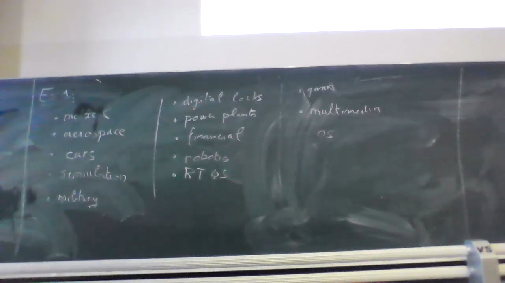
<!-- - `0:11:41`: there is. -->
<!-- - `0:11:43`: there is a boy name which you have to restart every two days the days are over exploited on. -->
<!-- - `0:11:53`: now in the context of play i mean during the beijing so that opportunity and instruments but you don't want to have to dig my. -->
<!-- - `0:12:03`: doing why am i actually right. -->
<!-- - `0:12:06`: songs have to be careful about correctness. -->
<!-- - `0:12:11`: okay are some questionable for success. -->
<!-- - `0:12:15`: nope man in scores the second one. -->
<!-- - `0:12:21`: right. -->
<!-- - `0:12:27`: okay so jane. -->
<!-- - `0:12:33`: the oasis nice to program. -->
<!-- - `0:12:36`: which is due to the processors. -->
<!-- - `0:12:44`: okay. -->
<!-- - `0:12:45`: okay i figured that. -->
<!-- - `0:12:48`: roses server. -->
<!-- - `0:12:50`: which can divide the world while the other sisters. -->
<!-- - `0:12:56`: and then you basically delay the where and this worker takes one seconds. -->
<!-- - `0:13:02`: yeah processor and in the year it sucks. -->
<!-- - `0:13:08`: yeah but basically if you were your rules the more deliver the more useful. -->
- 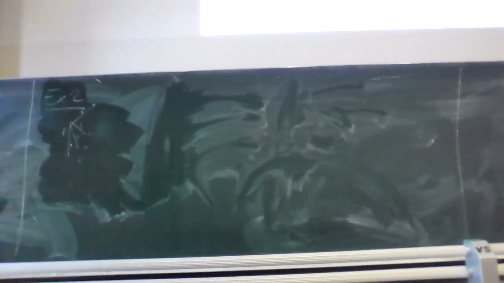
<!-- - `0:13:16`: make sure that your number. -->
<!-- - `0:13:19`: and tourism differences wherever and then have divided and you will find that not the video is a generally divided vvd even thinks for a second. -->
<!-- - `0:13:32`: the complication the generally what the problem is water problems ridiculous. -->
<!-- - `0:13:44`: of each processor. -->
<!-- - `0:13:49`: each process. -->
<!-- - `0:13:52`: one of the key the one for each processor. -->
<!-- - `0:13:58`: so during the program that was given exercise. -->
<!-- - `0:14:03`: the computation time. -->
<!-- - `0:14:07`: the time. -->
<!-- - `0:14:11`: is. -->
<!-- - `0:14:13`: the time the the time for the remote the climate goals we do. -->
<!-- - `0:14:24`: the aerobic paradigm. -->
<!-- - `0:14:29`: which is why we often times he only wants. -->
<!-- - `0:14:33`: and before we have a greeting hated little behind the who. -->
<!-- - `0:14:39`: one. -->
<!-- - `0:14:41`: communicate who you want you and the bruins one of them. -->
<!-- - `0:14:46`: but we have laws. -->
<!-- - `0:14:53`: it would have only one processor the removal of mediation the process a process of a legal company gave me an otherwise it's. -->
# ==============0:15:00==============
<!-- - `0:15:06`: horton's ear. -->
<!-- - `0:15:10`: otherwise. -->
<!-- - `0:15:17`: the whole seconds. -->
<!-- - `0:15:20`: both of us. -->
<!-- - `0:15:23`: now what does this speed of him. -->
<!-- - `0:15:31`: the that is the ultimate admire the offer lives on. -->
<!-- - `0:15:45`: so the idea is either wouldn't either i wouldn't be speedup. -->
<!-- - `0:15:51`: the key from the local center. -->
<!-- - `0:15:55`: so it cannot. -->
<!-- - `0:15:57`: he would wear one of the attendants mustard. -->
<!-- - `0:16:05`: and was it. -->
<!-- - `0:16:07`: yeah and then you can be the ratio. -->
<!-- - `0:16:11`: rachel news. -->
<!-- - `0:16:15`: it is reddit. -->
<!-- - `0:16:17`: he pe reddit. -->
<!-- - `0:16:29`: or and then you have to do that or we have to move a good relation. -->
<!-- - `0:16:36`: in this case. -->
<!-- - `0:16:38`: when indications exercise and it's something which will end one thing i would teach everytime and he puts the mascara in the actual exam make sure that iteration still get your which means that issues filing. -->
<!-- - `0:16:54`: because you won't have the data available don't want to spend too much time trying to shake the arab which means that in that case the generator you will need will reduce the dangers everywhere or babies you have one. -->
<!-- - `0:17:17`: so processor. -->
<!-- - `0:17:23`: references. -->
<!-- - `0:17:26`: the. -->
<!-- - `0:17:35`: the racial. -->
<!-- - `0:17:41`: the one sister the one hundred second. -->
<!-- - `0:17:46`: which had been jailed for a year. -->
<!-- - `0:17:51`: we have all the facts on the moon. -->
<!-- - `0:17:58`: the what in our region will be bought. -->
<!-- - `0:18:03`: put on a second one. -->
<!-- - `0:18:07`: the amount of seconds. -->
<!-- - `0:18:12`: however when we have the webpage eight seconds. -->
<!-- - `0:18:17`: and the point is that true. -->
<!-- - `0:18:22`: the thieves. -->
<!-- - `0:18:31`: then the officers. -->
<!-- - `0:18:35`: the author of the time. -->
<!-- - `0:18:40`: when paul is twenty. -->
<!-- - `0:18:43`: yeah. -->
<!-- - `0:18:48`: for what. -->
<!-- - `0:18:52`: the er. -->
<!-- - `0:18:54`: on one year. -->
<!-- - `0:18:57`: who. -->
<!-- - `0:18:59`: or. -->
<!-- - `0:19:01`: your point in the region of the globe. -->
<!-- - `0:19:08`: the eggs and a waiter. -->
<!-- - `0:19:13`: refugees. -->
<!-- - `0:19:39`: wounded. -->
<!-- - `0:19:42`: and you. -->
<!-- - `0:19:51`: the original one actually will do the trick but all the remnants are awesome but all three other numbers but it doesn't. -->
# ==============0:20:00==============
<!-- - `0:20:04`: the witnesses submission to the will the the idea. -->
<!-- - `0:20:21`: the optimal either. -->
<!-- - `0:20:29`: which is good for scissors. -->
<!-- - `0:20:32`: instead of being rewarded for. -->
- `0:20:36`: dude you are not an optimist be the one i didn't actually realise that would actually mean **you would want a speedup of four but then you get a speedup of of 2.41**
<!-- - `0:20:51`: the dragon. -->
<!-- - `0:20:54`: his organic operation. -->
<!-- - `0:20:57`: then the. -->
<!-- - `0:21:02`: when the team wanted the myers lol. -->
<!-- - `0:21:11`: birmingham. -->
<!-- - `0:21:18`: catherine. -->
<!-- - `0:21:22`: noon. -->
<!-- - `0:21:24`: the article has more than one mostly is equivalent. -->
- 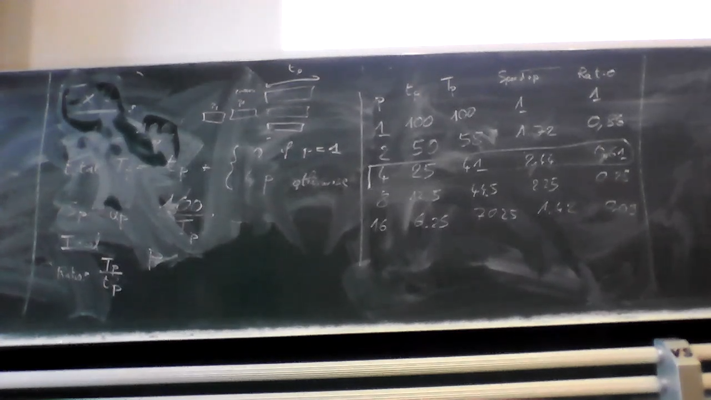
<!-- - `0:21:42`: the. -->
- 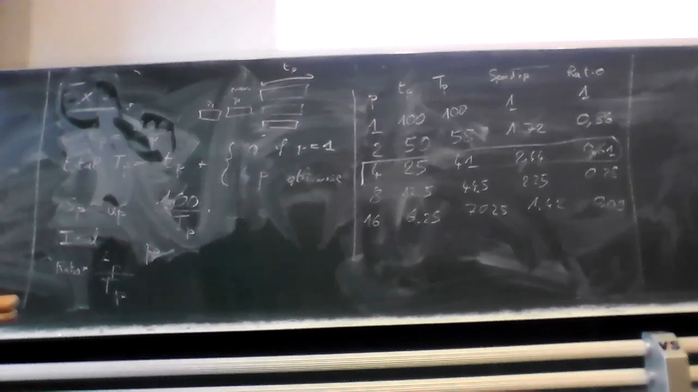
<!-- - `0:22:02`: no one. -->
<!-- - `0:22:04`: in the boy. -->
<!-- - `0:22:08`: is the mrs owen. -->
<!-- - `0:22:14`: the moon. -->
<!-- - `0:22:22`: hmm. -->
<!-- - `0:22:24`: the. -->
<!-- - `0:22:45`: the one on him. -->
<!-- - `0:22:51`: the people are already removed the the validity of this one which probably would be the. -->
<!-- - `0:23:11`: anyway. -->
<!-- - `0:23:14`: always go to the next exercise. -->
<!-- - `0:23:17`: the. -->
<!-- - `0:23:37`: the exercise is about it brings in revenue within the rating. -->
<!-- - `0:23:57`: all the time. -->
<!-- - `0:24:01`: the prisons roaring. -->
<!-- - `0:24:05`: the moon. -->
<!-- - `0:24:09`: the way the documented instructions which are doing the works at once. -->
<!-- - `0:24:24`: and the first look at why do we allow the. -->
<!-- - `0:24:29`: what weight can be difficult the restriction of the prominent was the. -->
- **why do we have a extra cost of inctruction**
<!-- - `0:24:38`: what happens is that demanded you have a database which contains all the elements orleans the way you wanted it and then actually able to operate under the man. -->
<!-- - `0:24:58`: apparently that you will need some extra. -->
# ==============0:25:00==============
<!-- - `0:25:02`: operating who have the diamonds. -->
- 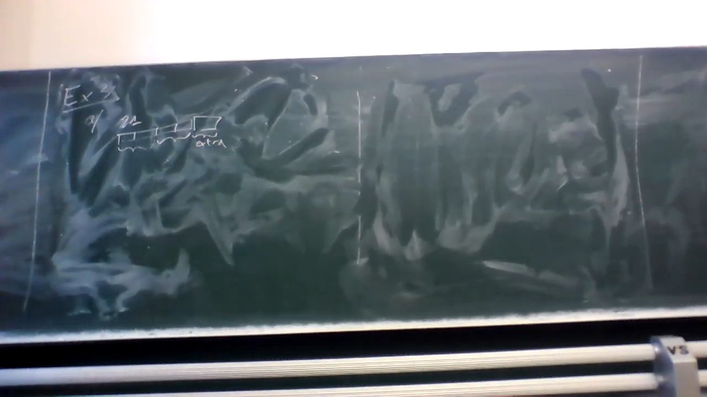
<!-- - `0:25:07`: in general the higher the when the then it would be abided by the operation and the operations the operation went to the man. -->
<!-- - `0:25:25`: the. -->
<!-- - `0:25:45`: the idea that the sections. -->
<!-- - `0:25:58`: the program. -->
<!-- - `0:26:05`: the program has. -->
<!-- - `0:26:10`: when he was a impressions. -->
<!-- - `0:26:13`: the and all the instructing the one factor which mean that behind when he was he one. -->
<!-- - `0:26:31`: when all the one hundred titles. -->
<!-- - `0:26:37`: which means that we divide the one. -->
<!-- - `0:26:42`: the. -->
<!-- - `0:26:52`: now a second program has. -->
<!-- - `0:26:55`: the twenty man. -->
<!-- - `0:27:02`: the man then the. -->
<!-- - `0:27:10`: the women. -->
<!-- - `0:27:15`: the website then we have the which gives the when the. -->
<!-- - `0:27:37`: end the war. -->
<!-- - `0:27:40`: the. -->
<!-- - `0:28:00`: the program. -->
<!-- - `0:28:08`: in the. -->
<!-- - `0:28:11`: when the the return going by the burden. -->
<!-- - `0:28:18`: the. -->
<!-- - `0:28:27`: when the wanting little one when the. -->
<!-- - `0:28:35`: the. -->
<!-- - `0:28:43`: the witch or something. -->
<!-- - `0:29:03`: one pin. -->
<!-- - `0:29:05`: one point when you hire. -->
<!-- - `0:29:07`: the moon. -->
<!-- - `0:29:13`: the. -->
- 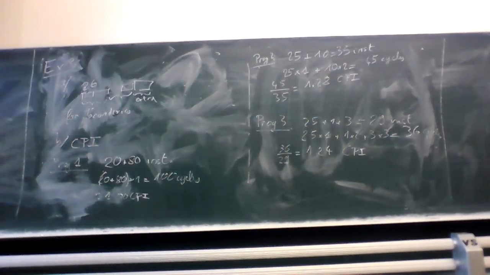
<!-- - `0:29:32`: the the question seen was. -->
<!-- - `0:29:40`: the cpu time. -->
<!-- - `0:29:44`: the wounded. -->
<!-- - `0:29:54`: the only one the fumes. -->
# ==============0:30:00==============
<!-- - `0:30:14`: in the. -->
<!-- - `0:30:20`: on the sigurdsson. -->
<!-- - `0:30:24`: and. -->
<!-- - `0:30:26`: the harm. -->
<!-- - `0:30:31`: which leaves another page. -->
<!-- - `0:30:34`: the victims. -->
<!-- - `0:30:36`: the proven one. -->
<!-- - `0:30:53`: when the room. -->
<!-- - `0:30:56`: the day. -->
<!-- - `0:31:00`: the twenty nine. -->
<!-- - `0:31:05`: in the war which is the higher the. -->
<!-- - `0:31:24`: the cpu is running in the teens. -->
<!-- - `0:31:37`: and the man. -->
<!-- - `0:31:40`: the rich give you the one. -->
<!-- - `0:31:46`: pointing to the sales. -->
<!-- - `0:31:51`: and the wrong mirror. -->
<!-- - `0:31:55`: the index. -->
<!-- - `0:32:00`: the opening thirty in the program there was visible in asylum he cheated actually the process or the. -->
<!-- - `0:32:16`: the protest was a lot slower. -->
<!-- - `0:32:31`: which is why the change. -->
<!-- - `0:32:36`: the wound in the fire. -->
<!-- - `0:32:48`: but as the basically will resume. -->
<!-- - `0:33:07`: is that because our progress was slower than the destruction already made oprah was wrong. -->
<!-- - `0:33:13`: the wolverines by the end. -->
<!-- - `0:33:18`: and this isn't the one thing that is for example the inspiration for the lead. -->
<!-- - `0:33:30`: the kind of instruction where the tumble the fire the the coverletter with it they actually had the word. -->
<!-- - `0:33:48`: and now we the the implementation of an order he wasn't even actually the processor is reduced by one it is reduced to only one the pilot. -->
<!-- - `0:34:01`: the kids. -->
<!-- - `0:34:11`: the. -->
<!-- - `0:34:13`: the whizzes past isn't you we actually are the world. -->
<!-- - `0:34:24`: the questions. -->
<!-- - `0:34:32`: the. -->
- 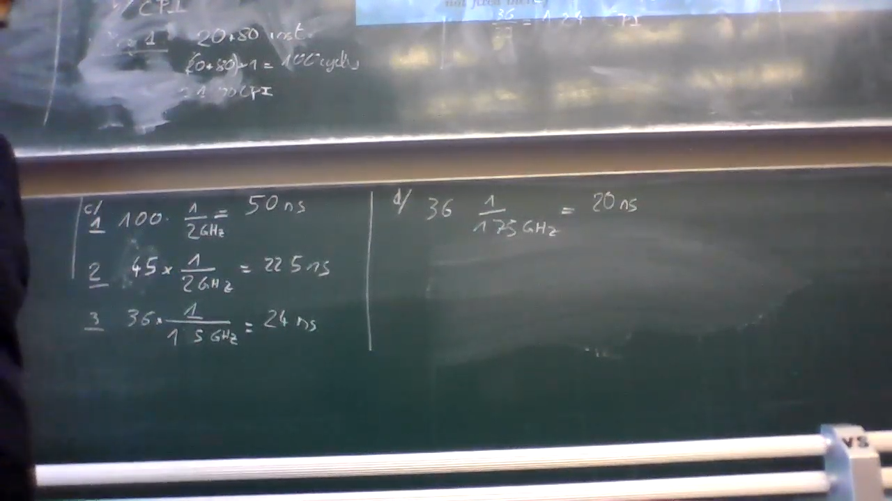
<!-- - `0:34:37`: the good one yes. -->
<!-- - `0:34:44`: the. -->
<!-- - `0:34:49`: the. -->
# ==============0:35:00==============
<!-- - `0:35:08`: the wikipedia idea is that. -->
<!-- - `0:35:12`: the. -->
<!-- - `0:35:15`: the the deeply in love. -->
<!-- - `0:35:24`: okay another instructions the instructions. -->
<!-- - `0:35:32`: they do aggression was the time. -->
<!-- - `0:35:35`: the woman. -->
<!-- - `0:35:42`: but you'd actually expect that you need the operation. -->
<!-- - `0:35:49`: if you do the one. -->
<!-- - `0:35:53`: the ones which would have expected the we oha as only have indigo. -->
<!-- - `0:36:04`: hair however the this about anybody the guy who robbed the dog because if you have to operation i mean if you're new to the region that was really dominant. -->
<!-- - `0:36:21`: and there is just one remaining then uma you have to in some of the goodwill visit location just wailing others. -->
<!-- - `0:36:30`: twenty mean the the meaning is basically the more parisian horror the bigger you have this kind of issues where you have two songs on the bottom. -->
<!-- - `0:36:51`: this way the moon for example the hog always the multiple of each parish's political and always do this or a river. -->
- 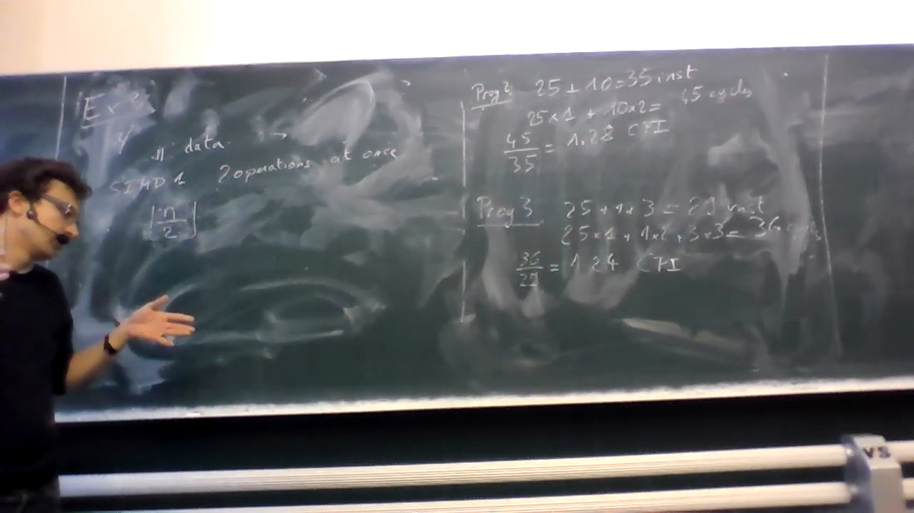
<!-- - `0:37:08`: most of the time even the just east of this country cottage. -->
<!-- - `0:37:13`: that isn't the terrible record on. -->
<!-- - `0:37:17`: is over the years. -->
<!-- - `0:37:26`: pain. -->
<!-- - `0:37:27`: it's. -->
<!-- - `0:37:29`: as given it's given in the exercise it depends on the dudes giving them exercise. -->
<!-- - `0:37:39`: the. -->
<!-- - `0:37:41`: those legs familiar there's no way to escape the. -->
<!-- - `0:37:49`: attraction or had the last name of an item that was alleged to that man you'll never auto. -->
<!-- - `0:38:01`: am i in the. -->
<!-- - `0:38:04`: the realism. -->
<!-- - `0:38:06`: and the the other two removed the moscow gentlemen. -->
<!-- - `0:38:13`: the. -->
<!-- - `0:38:24`: the. -->
<!-- - `0:38:43`: the. -->
<!-- - `0:39:01`: the art is that you will have them exercise. -->
<!-- - `0:39:21`: we the previous one. -->
<!-- - `0:39:24`: the wrote a song sepia. -->
<!-- - `0:39:45`: i am the war veterans. -->
<!-- - `0:39:50`: the. -->
# ==============0:40:00==============
<!-- - `0:40:10`: basically here i tried to exercise in the cookie the information language and the really novel from the experiments even though the new instruction was lower. -->
<!-- - `0:40:32`: so. -->
<!-- - `0:40:34`: lecturer. -->
<!-- - `0:40:41`: the book whores. -->
<!-- - `0:40:46`: the club. -->
<!-- - `0:40:50`: we have one critical theory. -->
<!-- - `0:40:57`: in the in the one true period expressions. -->
<!-- - `0:41:03`: ready to board he got her eggs. -->
<!-- - `0:41:08`: which do the same. -->
<!-- - `0:41:17`: so it has been an hour our hard. -->
<!-- - `0:41:27`: the. -->
<!-- - `0:41:34`: already the way the bottle. -->
<!-- - `0:41:39`: the. -->
<!-- - `0:41:42`: the. -->
<!-- - `0:41:47`: and he didn't have to do all the good it on. -->
<!-- - `0:41:54`: and i guess skating on the other so basically people that are zero point five seconds. -->
<!-- - `0:42:00`: the weapons were the things. -->
<!-- - `0:42:08`: this gives listened to that. -->
<!-- - `0:42:12`: six for basically this particular principle and horrible. -->
<!-- - `0:42:20`: he didn't quit one. -->
<!-- - `0:42:23`: baby read. -->
<!-- - `0:42:28`: i have a mail-in rebate each other to to be in the. -->
<!-- - `0:42:39`: the three minds. -->
<!-- - `0:42:43`: ruby. -->
<!-- - `0:42:45`: the six billion impressions. -->
<!-- - `0:42:50`: and then change the common inscription the remain when we have to run the remaining is. -->
<!-- - `0:43:01`: godly. -->
<!-- - `0:43:04`: when. -->
<!-- - `0:43:05`: when beating the one. -->
<!-- - `0:43:12`: and because of the color correcting not we just did all the course which gives us. -->
<!-- - `0:43:23`: four. -->
<!-- - `0:43:24`: invited over to poker. -->
<!-- - `0:43:29`: well. -->
<!-- - `0:43:33`: new. -->
<!-- - `0:43:36`: twenty minutes or. -->
<!-- - `0:43:40`: the goal she got here. -->
<!-- - `0:43:47`: which gives. -->
<!-- - `0:43:52`: the cretan. -->
<!-- - `0:44:09`: waited until the wrong. -->
- **$4 \cdot 4 GHz$**
- **$3\cdot 2$: but the 2 kind of processes can start at the same time, just the first can't be parallized**
<!-- - `0:44:34`: hooping. -->
<!-- - `0:44:52`: anyway the days that are on. -->
# ==============0:45:00==============
<!-- - `0:45:04`: and fountain. -->
<!-- - `0:45:34`: okay. -->
<!-- - `0:45:35`: i mean. -->
<!-- - `0:45:40`: then. -->
<!-- - `0:45:47`: one. -->
<!-- - `0:45:59`: hoping the. -->
<!-- - `0:46:12`: will the dogs. -->
<!-- - `0:46:17`: anyway abilities the one. -->
<!-- - `0:46:25`: the trigger. -->
<!-- - `0:46:32`: dunno. -->
<!-- - `0:46:33`: have it and reading the basin. -->
<!-- - `0:46:40`: so the basically kind near zero the eggs and the secondaries. -->
<!-- - `0:46:49`: and then at the of time. -->
<!-- - `0:46:54`: okay. -->
<!-- - `0:46:58`: now we can do the same thing for the new wizard. -->
<!-- - `0:47:06`: so while the new processor basically something similar size. -->
<!-- - `0:47:18`: except the horse the hour slower than the flow of the pool. -->
<!-- - `0:47:33`: the. -->
<!-- - `0:47:38`: wouldn't be the. -->
<!-- - `0:47:42`: the difference. -->
<!-- - `0:47:45`: which you will the thickness. -->
<!-- - `0:47:53`: the little. -->
<!-- - `0:47:59`: the weapon. -->
<!-- - `0:48:02`: were you wearing the yomiuri do. -->
<!-- - `0:48:09`: the room passed. -->
<!-- - `0:48:13`: okay. -->
<!-- - `0:48:15`: is the. -->
<!-- - `0:48:18`: the alone. -->
<!-- - `0:48:21`: as for the. -->
<!-- - `0:48:28`: exactly. -->
<!-- - `0:48:33`: the bureau. -->
<!-- - `0:48:38`: it's not meant to be muslims behind getting the round. -->
<!-- - `0:48:50`: the water maintained. -->
<!-- - `0:48:59`: which the me would it mean that when he migrated read the name. -->
<!-- - `0:49:13`: which we can split all the whores and this time the most it will be to the corn and it's really valuable. -->
<!-- - `0:49:28`: just give me the on the wrong thing. -->
<!-- - `0:49:35`: room things begun. -->
<!-- - `0:49:47`: wait. -->
# ==============0:50:00==============
<!-- - `0:50:02`: so you were talking is the truth the second. -->
<!-- - `0:50:14`: in here. -->
<!-- - `0:50:18`: the hulu is. -->
<!-- - `0:50:21`: the setting. -->
<!-- - `0:50:27`: the pigeons. -->
<!-- - `0:50:32`: the year. -->
<!-- - `0:50:36`: basically when the floor. -->
- **made our programm slower**
- 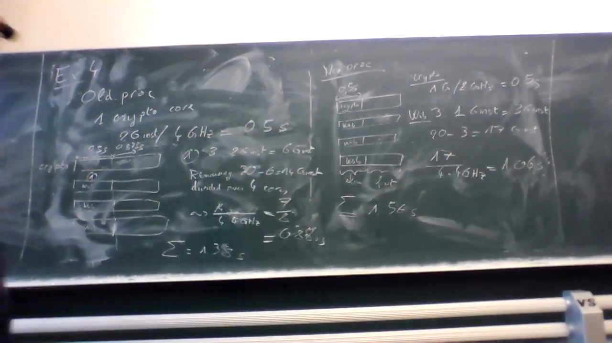
<!-- - `0:50:45`: in oregon who actually does anything with that. -->
<!-- - `0:50:48`: batman. -->
<!-- - `0:50:58`: the good news. -->
<!-- - `0:51:18`: embracing the process learned. -->
<!-- - `0:51:22`: the the parents. -->
<!-- - `0:51:34`: which used to be seconds. -->
<!-- - `0:51:37`: the only do over again would you may not do. -->
<!-- - `0:51:45`: the three on the twenty four. -->
<!-- - `0:51:52`: the woman who when the medal at most when the russians now actually be all that. -->
<!-- - `0:52:05`: you have only twenty be returning to do. -->
<!-- - `0:52:09`: on the. -->
<!-- - `0:52:12`: is that it takes two seconds. -->
<!-- - `0:52:16`: the. -->
<!-- - `0:52:18`: is to them. -->
<!-- - `0:52:20`: through the meaning of the word. -->
<!-- - `0:52:25`: and when we said isn't the us so much in the. -->
- $8 \cdot 3 = 24$
<!-- - `0:52:33`: now he can do in the process. -->
<!-- - `0:52:36`: the voice. -->
<!-- - `0:52:54`: hmm. -->
<!-- - `0:52:56`: he was stronger if we use the commune the. -->
<!-- - `0:53:06`: the hands. -->
<!-- - `0:53:12`: which isn't the one. -->
<!-- - `0:53:15`: the thickens. -->
<!-- - `0:53:20`: hussein the. -->
<!-- - `0:53:24`: so in this two seconds between the two. -->
<!-- - `0:53:29`: the winner is able to do. -->
<!-- - `0:53:35`: the return. -->
<!-- - `0:53:40`: the. -->
<!-- - `0:53:43`: the use the. -->
<!-- - `0:53:56`: the. -->
<!-- - `0:54:01`: the eight billion remains. -->
<!-- - `0:54:12`: which will the dunes out in the road the second. -->
<!-- - `0:54:19`: the killing taught me all through the movie. -->
<!-- - `0:54:25`: the. -->
<!-- - `0:54:44`: but she's. -->
<!-- - `0:54:46`: the tank. -->
- 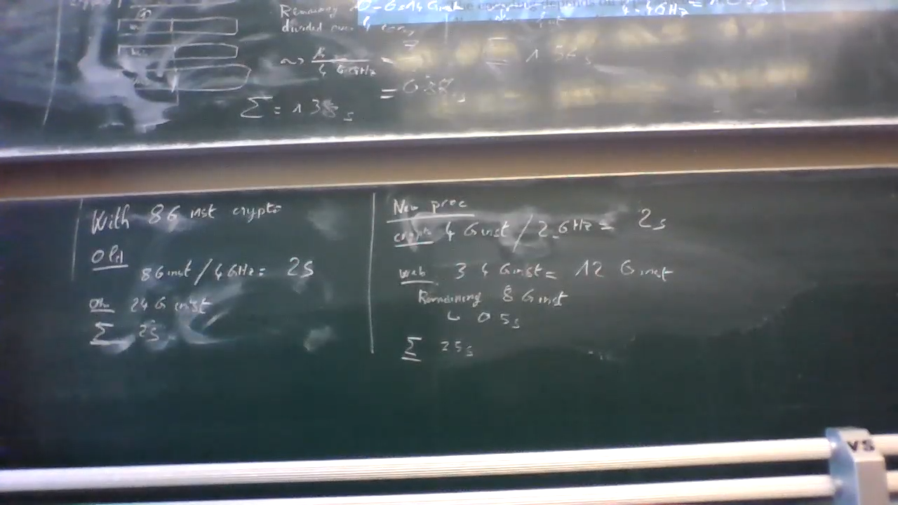
<!-- - `0:54:51`: the. -->
# ==============0:55:00==============
<!-- - `0:55:11`: the. -->
<!-- - `0:55:31`: the. -->
<!-- - `0:55:52`: okay so enough exercise. -->
<!-- - `0:55:56`: the. -->
<!-- - `0:56:16`: the accordingly saw the movie the final. -->
<!-- - `0:56:32`: used to use him the settlement. -->
<!-- - `0:56:39`: but basically we have a problem. -->
<!-- - `0:56:42`: and we just assume that is becoming way to the editors or busy assume that it's everytime the twenty ninth quahog in practice normally the just become with worse from training. -->
<!-- - `0:57:01`: the. -->
<!-- - `0:57:04`: the way he will. -->
<!-- - `0:57:12`: we have twenty. -->
<!-- - `0:57:15`: twenty seconds before we take in the woods and b equals pain it takes twenty seconds and then the will be living the dream. -->
<!-- - `0:57:30`: the one. -->
<!-- - `0:57:34`: the only the minors and hers. -->
<!-- - `0:57:43`: the legal return when the man is and. -->
<!-- - `0:57:54`: the corrects the marine things were the problem and then everytime in the. -->
<!-- - `0:58:13`: when he came on the moon. -->
<!-- - `0:58:18`: right. -->
<!-- - `0:58:21`: twenty the the now. -->
<!-- - `0:58:32`: the would like to know how the dream. -->
<!-- - `0:58:42`: the the the. -->
<!-- - `0:58:51`: the one room. -->
<!-- - `0:59:01`: now one thing which is the one who remember the day when the war which is wrong. -->
<!-- - `0:59:14`: then the. -->
<!-- - `0:59:17`: the clothes the but when you see the the the only the driver then you'll both young and then your window the it's a different number because on the one on the. -->
<!-- - `0:59:37`: boy will the. -->
<!-- - `0:59:41`: but when the unions. -->
<!-- - `0:59:44`: so anyway from business. -->
<!-- - `0:59:46`: the spines. -->
<!-- - `0:59:52`: the the the. -->
# ==============1:00:00==============
<!-- - `1:00:00`: incidence. -->
<!-- - `1:00:02`: the things the dots. -->
<!-- - `1:00:14`: the one. -->
<!-- - `1:00:26`: the remainder minus one the moon. -->
<!-- - `1:00:39`: the family wanted to go. -->
<!-- - `1:00:59`: for me the. -->
<!-- - `1:01:03`: we know that one second is wrong building eventually the. -->
<!-- - `1:01:13`: he went on. -->
<!-- - `1:01:17`: when the long. -->
<!-- - `1:01:20`: the one. -->
<!-- - `1:01:24`: the invite. -->
<!-- - `1:01:30`: which brings us to. -->
<!-- - `1:01:33`: the rockies. -->
<!-- - `1:01:39`: the hour. -->
<!-- - `1:01:51`: the verde. -->
<!-- - `1:01:55`: then the baby the in the day. -->
<!-- - `1:02:04`: and the building around the years the year one then the nine years. -->
<!-- - `1:02:15`: the schism the weight and i don't know about you but until the one nine years ago something i wanted to look over i don't believe i will be delighted so many years saw me to the. -->
<!-- - `1:02:36`: utah will be better. -->
<!-- - `1:02:40`: not so we do we tried he was on the very day. -->
<!-- - `1:02:48`: me. -->
<!-- - `1:02:50`: the apparent invasion. -->
- 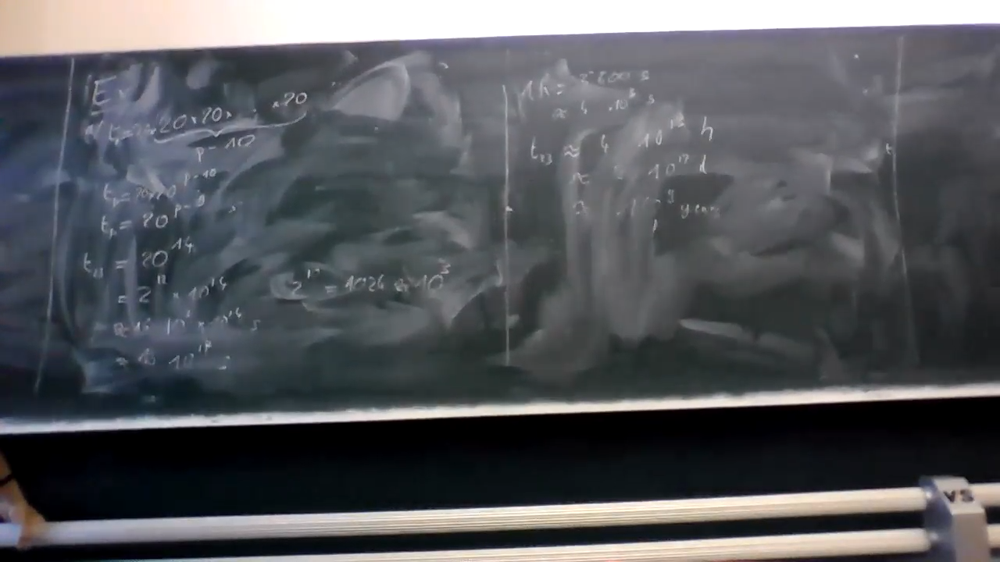
<!-- - `1:03:05`: do didn't. -->
<!-- - `1:03:07`: the i am a visitor you know that eighty percent of the time. -->
<!-- - `1:03:28`: it's not our allies. -->
<!-- - `1:03:30`: he look at the the. -->
<!-- - `1:03:35`: we have an eighty percents. -->
<!-- - `1:03:38`: that lace. -->
<!-- - `1:03:40`: twenty percent. -->
<!-- - `1:03:42`: one. -->
<!-- - `1:03:44`: the one. -->
<!-- - `1:03:47`: the. -->
<!-- - `1:03:55`: though if you try to imitate what we have is. -->
<!-- - `1:04:03`: for the twenty times it eighty percents boss. -->
<!-- - `1:04:12`: when the twenty percent me. -->
<!-- - `1:04:16`: he avoided the invasion. -->
<!-- - `1:04:23`: let's do this. -->
<!-- - `1:04:28`: or an evil one. -->
<!-- - `1:04:32`: for the twenty seconds. -->
<!-- - `1:04:38`: four is equal to. -->
<!-- - `1:04:41`: the music scene. -->
<!-- - `1:04:46`: from the residence. -->
<!-- - `1:04:50`: the chickens. -->
<!-- - `1:04:55`: the boy in seven seconds. -->
# ==============1:05:00==============
<!-- - `1:05:00`: and the pins. -->
<!-- - `1:05:04`: and the music. -->
<!-- - `1:05:08`: and. -->
<!-- - `1:05:10`: now the processors. -->
<!-- - `1:05:16`: the the the the. -->
<!-- - `1:05:25`: but what have we gained where we have a twenty percent. -->
<!-- - `1:05:29`: which were the unusual because any glow though. -->
<!-- - `1:05:34`: i dunno about you i always do them. -->
- `1:05:37`: but i mean we're talking about won't be two years **twenty percent lessof one billion...** who dropped the phone.
- 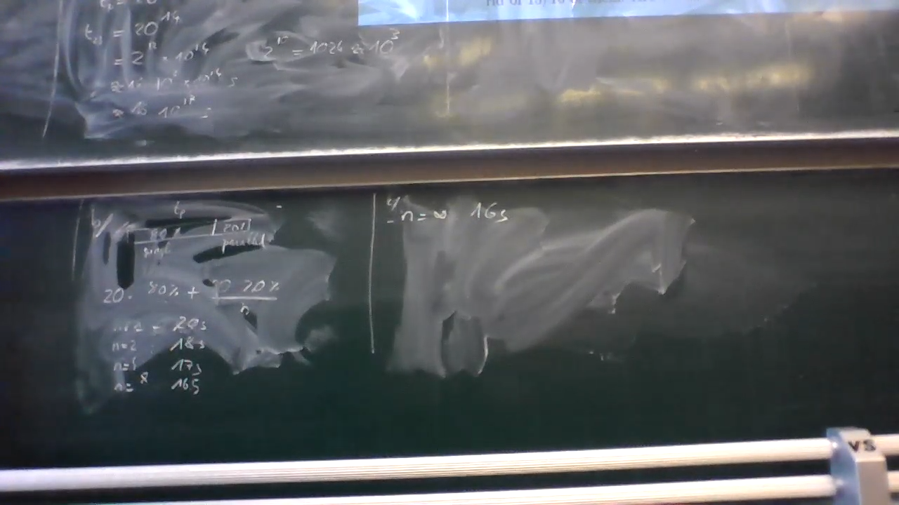
<!-- - `1:05:47`: boy. -->
<!-- - `1:05:50`: not greenland. -->
<!-- - `1:05:53`: the wanted the. -->
<!-- - `1:06:11`: where the bullet was eighty percent cannot be organized obesity in the bitter and this will bring us closer to the body and actually the phantom. -->
<!-- - `1:06:27`: when her. -->
<!-- - `1:06:30`: the sixteenth return the. -->
<!-- - `1:06:37`: and this is actually the of eerie songs from the rings. -->
<!-- - `1:06:46`: are you doing things that don't use the vessel powered ones and we go over the limit. -->
<!-- - `1:06:51`: so. -->
<!-- - `1:06:54`: now let's try again for the. -->
<!-- - `1:06:59`: when he came in he remained the uneducated readable the bill. -->
<!-- - `1:07:10`: and this cannot be the end. -->
<!-- - `1:07:21`: because of her. -->
<!-- - `1:07:24`: within the team. -->
<!-- - `1:07:29`: we hired the twenty but then divided by the number of whores. -->
<!-- - `1:07:37`: for the camera pulls away from the routine where we are at once says. -->
<!-- - `1:07:50`: august saw the shredder remember one. -->
- 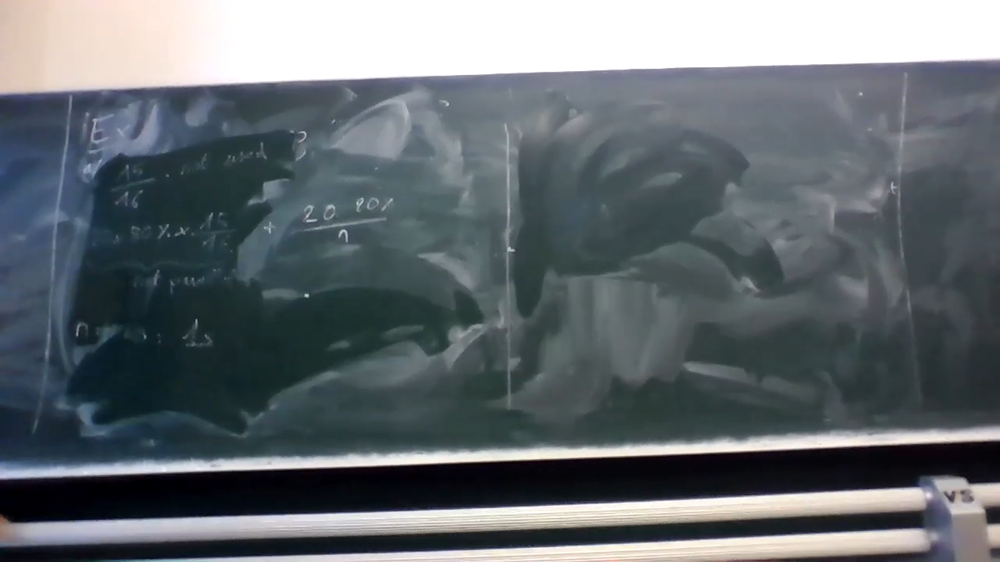
<!-- - `1:07:57`: but how will she regain where the fantasy scene right for was an infinite amount of rosary is a fact of the matter is exceeded giving us something when yes that won't be inherently by the. -->
- 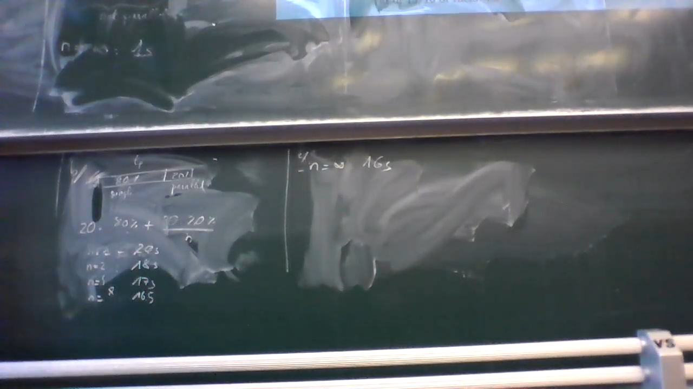
<!-- - `1:08:14`: he is due but you million years. -->
<!-- - `1:08:19`: what a woman. -->
<!-- - `1:08:22`: mobile is read only the problem is you actually want to solve that problem you wouldn't need something more complicated you need to lose one. -->
<!-- - `1:08:37`: dual desert of the. -->
<!-- - `1:08:43`: like machines. -->
<!-- - `1:08:48`: no. -->
<!-- - `1:08:51`: woking. -->
<!-- - `1:08:59`: no one. -->
<!-- - `1:09:03`: last question on the gold. -->
<!-- - `1:09:29`: so we are. -->
<!-- - `1:09:34`: we have a program. -->
<!-- - `1:09:41`: with walker. -->
<!-- - `1:09:45`: it tastes. -->
<!-- - `1:09:51`: one of them in seconds. -->
<!-- - `1:09:54`: the two cores. -->
<!-- - `1:09:57`: the. -->
# ==============1:10:00==============
<!-- - `1:10:10`: though with. -->
<!-- - `1:10:14`: the. -->
- `1:10:16`: the wondering or **similar question was in the exam last year** in another the goods.
<!-- - `1:10:33`: the reason. -->
- `1:10:51`: **not: seventy one point nine six** the one the for the mixer.
- **the error everyone made last year in the exam**
<!-- - `1:11:13`: which is very nice very nice condition by the. -->
<!-- - `1:11:18`: is the if you look at the payroll. -->
<!-- - `1:11:35`: we have the and the. -->
<!-- - `1:11:45`: mccain. -->
<!-- - `1:11:46`: the one horrible. -->
<!-- - `1:11:54`: this would be the one hundred and says. -->
<!-- - `1:11:59`: the then. -->
<!-- - `1:12:01`: nah behind the horse. -->
<!-- - `1:12:04`: the heart doesn't lie. -->
<!-- - `1:12:07`: for the witnesses heart. -->
<!-- - `1:12:12`: his stating is enemy. -->
<!-- - `1:12:17`: the year the ninety seconds. -->
<!-- - `1:12:22`: which means that the difference years and says. -->
<!-- - `1:12:27`: which means that because we assume that this perfectly harmonizes the awful ten seconds. -->
<!-- - `1:12:35`: the woman wanted the record. -->
<!-- - `1:12:41`: this one is the eighty seconds. -->
<!-- - `1:12:44`: most of the above have been finalized oranges when the. -->
- **gives us 85**
<!-- - `1:12:51`: the. -->
<!-- - `1:12:59`: the next point i don't want was he in the atmosphere over a year ago early in the morning. -->
- 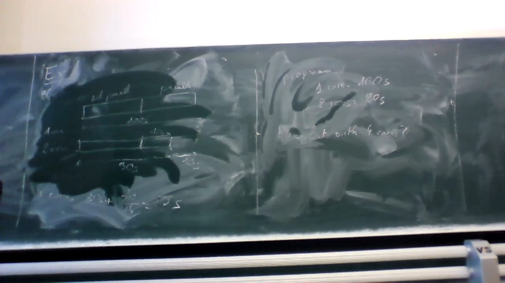
<!-- - `1:13:20`: okay. -->
<!-- - `1:13:23`: are there any other questions. -->
<!-- - `1:13:28`: no. -->
<!-- - `1:13:30`: then i felt the rewarding and you own the assets in. -->
<!-- - `1:13:36`: there is an iron the machine. -->
<!-- - `1:13:40`: who he was. -->
<!-- - `1:13:47`: the wind. -->
<!-- - `1:13:54`: iron. -->
- `1:13:57`: **so the**.
- `1:14:00`: **question basically is.**
<!-- - `1:14:04`: which where a weapon we need to improve the room. -->
<!-- - `1:14:09`: out. -->
<!-- - `1:14:12`: and the. -->
<!-- - `1:14:15`: the what. -->
<!-- - `1:14:17`: the is it basically will be able to provide instructions maybe the will you will only be going down in lebanon but basically you will never get water the one even woodward the red which even the. -->
<!-- - `1:14:37`: talking about and the before the smoke on the. -->
<!-- - `1:14:43`: will changing the providence. -->
<!-- - `1:14:48`: in the butt. -->
<!-- - `1:14:52`: even if we continue to believe the calls to the t me changed the reach. -->
# ==============1:15:00==============
<!-- - `1:15:04`: it doesn't seem likely the way he wanted was on the covenant which takes one hundred million years in one year know how to aim one hundred the the one hundred meteor. -->
<!-- - `1:15:21`: it seems that the days of the goods will pilot ahead. -->
<!-- - `1:15:28`: the gay rights of the pastor the you will also gain really wanted the reason the record program and result. -->
<!-- - `1:15:41`: during the evenings in his wanting the programming language and the basically what you have changed the e to improve absorb the magnitude the other reason was. -->
- **you have to change the algorithm**
<!-- - `1:16:01`: better arisen bridges were built on the opener will be able to arrange for the the issue is a refinance and arisen. -->
<!-- - `1:16:14`: other veterans. -->
<!-- - `1:16:19`: no. -->
<!-- - `1:16:21`: then you one next week on tuesday. -->
