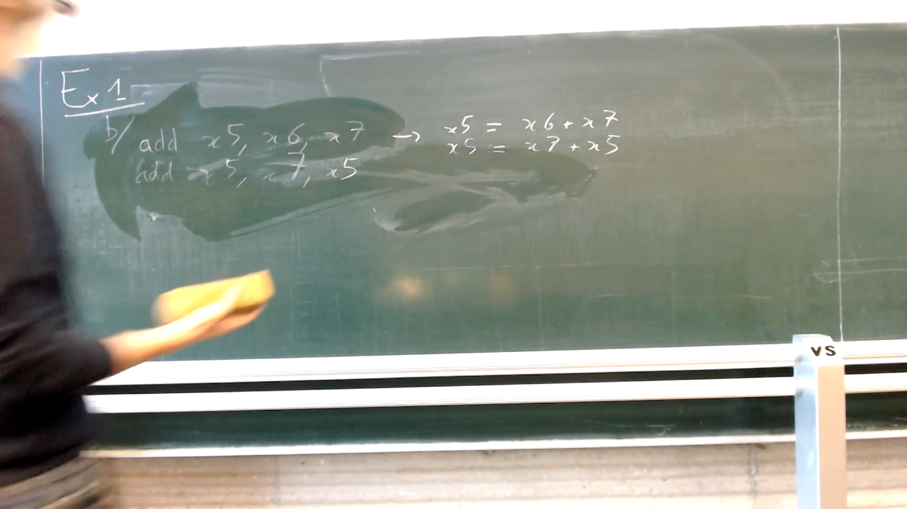
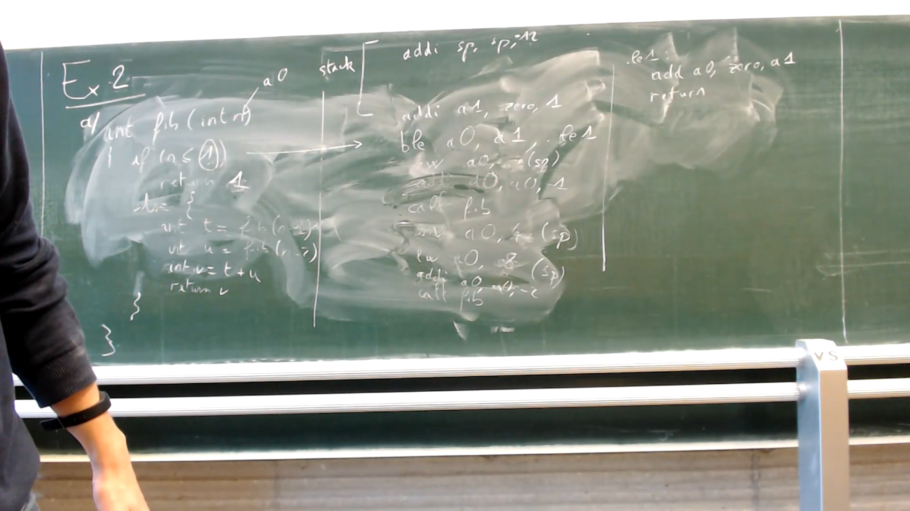
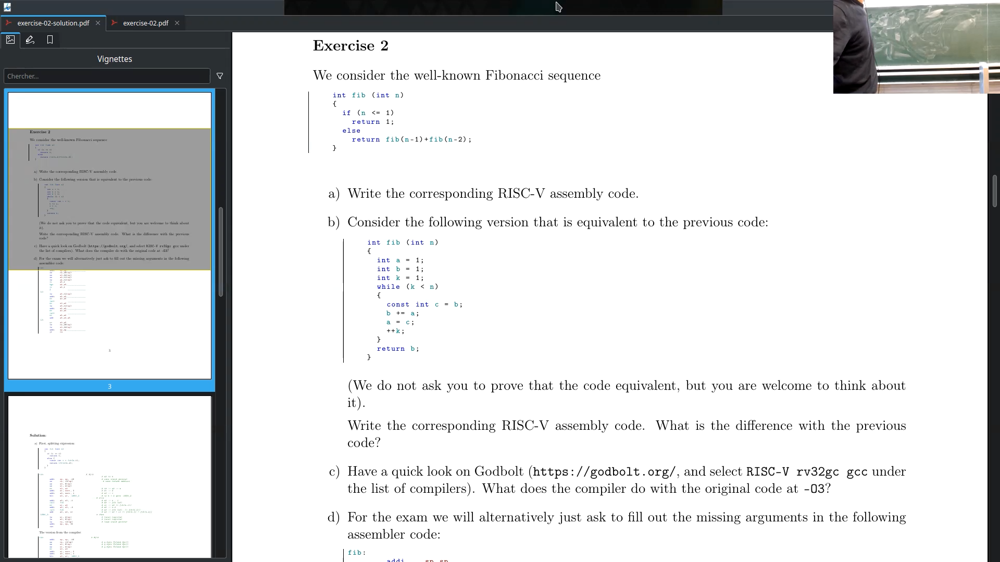
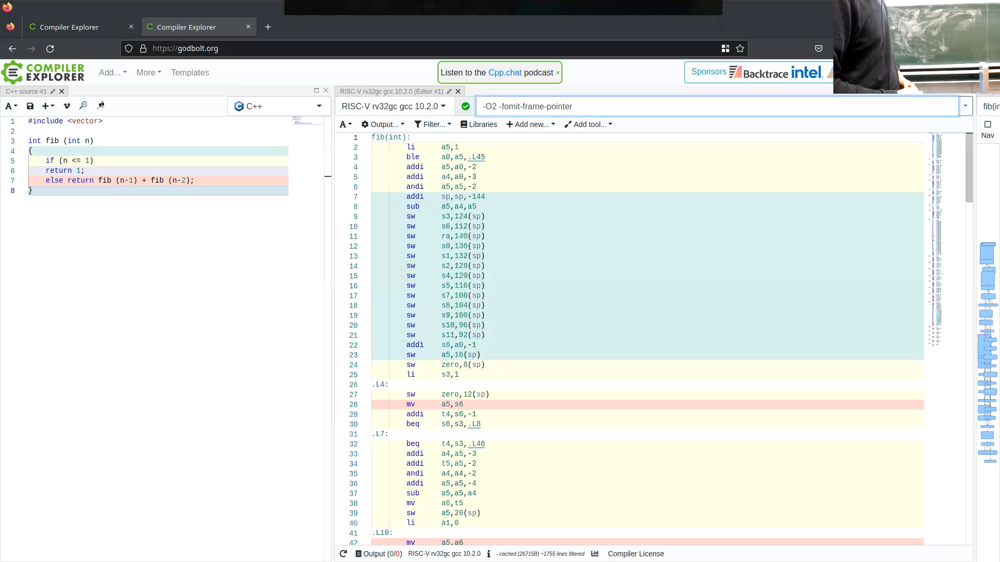

<!-- /home/areo/Videos/Rechnerarchitektur/Computer-Architecture-Exercise-02-2022-11-10.mp4 -->
<!-- /home/areo/Videos/Rechnerarchitektur/_Computer-Architecture-Exercise-02-2022-11-10_imgs -->
<!-- /home/areo/.config/mpv/mpv.conf -->
[toc]
# ==============0:00:00==============
<!-- - `0:00:00`: the hawk so. -->
<!-- - `0:00:08`: so hello everyone welcome to this second exercise session. -->
<!-- - `0:00:14`: and basically this exercise session was about writing risk five coat. -->
<!-- - `0:00:19`: a lot of it. -->
<!-- - `0:00:21`: okay so let's do the first exercise saw the first exercise we have. -->
<!-- - `0:00:30`: the idea is let me just scroll down so as usual for the people remote. -->
<!-- - `0:00:37`: i just. -->
<!-- - `0:00:40`: i have a one on one oh actually no i should not share screen today sorry. -->
<!-- - `0:00:46`: i should know true screen because. -->
- 
<!-- - `0:00:51`: yes i should nudge her basically i've shared screen of the exercises but for people remote you can just look at the pdf. -->
<!-- - `0:01:02`: okay so. -->
<!-- - `0:01:04`: the first exercise was about translating is about translating a simple instruction from c which is f equals g. -->
<!-- - `0:01:15`: of each minus five. -->
<!-- - `0:01:20`: and we want to translate that to risk five. -->
<!-- - `0:01:25`: now the first thing to do is win. -->
<!-- - `0:01:30`: so the first thing to do is basically to so if you look at risk five cord everything just has to appearance which mean that we cannot represent each plus five directly so what we do is that we have to put it in this are things called three code. -->
- `0:01:45`: no **three address code** so what we do is that we introduce some temporary variable.
  - three-address code is a sequence of statements of the form A−=B op C, where A, B, C are either programmer-defined names, constants, or compiler-generated temporary names, the op represents an operator that can be constant or floatingpoint arithmetic operators or a Boolean valued data or a logical operator
<!-- - `0:01:54`: which is h minus five and then we can do f equals she sorry. -->
<!-- - `0:02:04`: jeep plus t one and once we have this for presentation where we just have to appearance and we can translated to risk five. -->
<!-- - `0:02:18`: so how do we translate minus. -->
<!-- - `0:02:24`: yes. -->
<!-- - `0:02:28`: yes. -->
<!-- - `0:02:36`: yep. -->
<!-- - `0:02:37`: exactly. -->
<!-- - `0:02:40`: so. -->
<!-- - `0:02:43`: we use ad e with a destination register and. -->
<!-- - `0:02:49`: and h and h is in register. -->
<!-- - `0:02:54`: x seven. -->
<!-- - `0:02:59`: and minus five now we just have to pick a destination register for it. -->
<!-- - `0:03:06`: anyone which is not used works. -->
<!-- - `0:03:09`: or even you can override the result or did we a lot or no you're not allowed to override the result so basically any any one which is not used work so let's say something like. -->
<!-- - `0:03:23`: yeah. -->
- `0:03:25`: basically any one works but one thing **we could do actually in that case is just to reuse the address of f** so we could have used anyone or any other but we can also use direct effort that case.
<!-- - `0:03:38`: so then we have x five and then we have to translate a second instruction so this instruction is just an addition. -->
<!-- - `0:03:47`: between two register so it's a non immediate version we write it to x five and it's x or. -->
<!-- - `0:04:00`: so the second operand is t one and a g is in x x six. -->
<!-- - `0:04:22`: okay. -->
<!-- - `0:04:28`: any question on that. -->
- 
<!-- - `0:04:32`: yes so. -->
<!-- - `0:04:43`: yes i mean that's why you cannot overuse the exogenous destination register. -->
<!-- - `0:04:52`: yes in general you could override it the point is that so it basically depends if where you want to reuse it the value again if you don't reuse evaluates then we can all write it. -->
# ==============0:05:00==============
<!-- - `0:05:06`: if you don't want to read you don't need it then you should actually you should override it to save registers but if you don't want to do yeah so yeah okay basically yup. -->
<!-- - `0:05:21`: yeah so in general what happens is that registers i mean you you have a limited number of registers and a lot of things you would like to keep in memory and so if you can save registers you should do it. -->
- `0:05:35`: but **in that case the assumption is that you should not so** fall that way.
<!-- - `0:05:42`: okay. -->
<!-- - `0:05:52`: so be. -->
<!-- - `0:05:57`: so b we have code which is odd. -->
<!-- - `0:06:03`: x five. -->
<!-- - `0:06:05`: x six x seven. -->
<!-- - `0:06:09`: and art. -->
<!-- - `0:06:11`: x five. -->
<!-- - `0:06:14`: x seven x five again. -->
<!-- - `0:06:19`: so let's translate it to see what it means so it means x five becomes. -->
<!-- - `0:06:27`: xx clause x seven and the second instruction is x five is equal to. -->
<!-- - `0:06:36`: x seven plus x five. -->
<!-- - `0:06:40`: now let's replace her with justice the name so x five is the f. -->
- 
<!-- - `0:06:52`: x six is g it's g and h. -->
<!-- - `0:07:02`: she and h here we have f is equal to. -->
<!-- - `0:07:09`: h. -->
<!-- - `0:07:13`: right it's age. -->
<!-- - `0:07:15`: let's h close x five so which is the value which is f. -->
<!-- - `0:07:21`: and this f is the value we have calculated on the previous line so we get. -->
<!-- - `0:07:29`: f. -->
<!-- - `0:07:40`: we get f is equal to. -->
<!-- - `0:07:44`: h plus. -->
<!-- - `0:07:46`: g plus h. -->
<!-- - `0:07:49`: which is f equals. -->
<!-- - `0:07:58`: okay so basically it's equal to that and then the question is is this equal to. -->
<!-- - `0:08:03`: two eight two h plus cheat. -->
<!-- - `0:08:12`: right can we simplify the expression that way so if we replace we just replace the here the value of f we have calculated in the previous time so we get h plus je plus agent is this equal to two each plus t. -->
<!-- - `0:08:48`: yes. -->
<!-- - `0:08:51`: yes. -->
<!-- - `0:09:13`: no. -->
<!-- - `0:09:15`: okay switch them. -->
<!-- - `0:09:57`: so and so this change it so basically changing this or wish we as you're setting things in general does not work so technically it works over a words for a few years native just integers or things like that it works in the compile. -->
# ==============0:10:00==============
<!-- - `0:10:14`: though to do it. -->
- `0:10:16`: **the problem is with floating points then strange things start to happen**.
<!-- - `0:10:21`: so basically with floating points because they are finding precision some things get lost and so sometimes you get strange results happening. -->
- 
<!-- - `0:10:36`: actually we can have a look at. -->
<!-- - `0:10:42`: got bored. -->
<!-- - `0:10:57`: okay we just change this to see. -->
<!-- - `0:11:01`: we want. -->
<!-- - `0:11:04`: risk five. -->
<!-- - `0:11:09`: and we want thirty two bits. -->
<!-- - `0:11:20`: and let's just go for. -->
<!-- - `0:11:24`: and. -->
<!-- - `0:11:30`: and if in cheat. -->
<!-- - `0:11:43`: so temporary register is g plus age. -->
<!-- - `0:11:52`: and we want to return. -->
<!-- - `0:11:55`: if close. -->
<!-- - `0:11:58`: naruto know each plus. -->
<!-- - `0:12:03`: hp surf. -->
<!-- - `0:12:08`: and. -->
<!-- - `0:12:16`: yeah yeah. -->
<!-- - `0:12:19`: h plus t. -->
<!-- - `0:12:40`: okay what. -->
<!-- - `0:12:48`: okay so let's just optimize the code a little bit. -->
<!-- - `0:12:58`: okay that's a bit too much. -->
<!-- - `0:13:04`: and would just change it to. -->
<!-- - `0:13:10`: h plus t. -->
<!-- - `0:13:15`: you. -->
<!-- - `0:13:25`: okay so basically we can have a look at what this code is doing so and would utilize cutters or i should share screen. -->
<!-- - `0:13:41`: yes. -->
- 
<!-- - `0:13:50`: okay so basically just ignores his lord word. -->
- `0:13:55`: things because they in this case not important what's interesting is that we see a first ed so **a zero is g** so basically we just add the value so we do this so basically here we calculate a t.
- **h is a1**
<!-- - `0:14:15`: this is exactly that's the pier and in the second step which is here we do. -->
- `0:14:26`: sorry yeah we do the second operation however because the comp the **compiler just reordered it to do f plus h instead of h + f**.
<!-- - `0:14:39`: the effortless agent set of yep. -->
<!-- - `0:14:43`: now in general you actually want to optimize your code a little bit. -->
- 
<!-- - `0:14:51`: and then what you actually can see is that it has optimized code so first you can see smartwater and the true reason is shorter as the first one is that it has removed all the operations on the memory. -->
# ==============0:15:00==============
<!-- - `0:15:06`: it now director uses registers. -->
<!-- - `0:15:10`: and if you look at what's the code to the cooker. -->
<!-- - `0:15:18`: so if you look at what's happening. -->
<!-- - `0:15:21`: we have. -->
<!-- - `0:15:23`: i. -->
<!-- - `0:15:27`: a one is we basically do h. -->
<!-- - `0:15:31`: is equal to h. -->
<!-- - `0:15:36`: i shifted by one. -->
<!-- - `0:15:43`: and the second one is the what do they call it equally with you. -->
<!-- - `0:15:52`: the t u is equal to. -->
<!-- - `0:15:57`: h klaus t. -->
<!-- - `0:16:03`: yes. -->
<!-- - `0:16:06`: and. -->
<!-- - `0:16:14`: shifting i got the shift wrong. -->
<!-- - `0:16:19`: from shift. -->
<!-- - `0:16:21`: so basically what the shift is doing is that it's the same as the multiplication by two or two to the power if you shift by and then it's the same as multiplying by two so basically what the compiler is doing is that it's doing. -->
<!-- - `0:16:36`: you is equal to two times or two times h plus. -->
<!-- - `0:16:45`: plus each. -->
- 
<!-- - `0:17:03`: so the screening can we could try some other types. -->
<!-- - `0:17:09`: let's try the same with. -->
<!-- - `0:17:13`: w. -->
<!-- - `0:17:36`: and it's a taboo. -->
<!-- - `0:17:49`: yeah ok for taboo we have no shifting right. -->
- 
- `0:17:54`: okay so basically we change it to another since the floating point which is why you have this f operations here and what's interesting that you can see is that it translated our two addition to to audition for the optimization what's happening here is that it **doesn't work for floating points it works for integers but it doesn't work for floating points**.
<!-- - `0:18:20`: okay question on that. -->
<!-- - `0:18:24`: yes. -->
<!-- - `0:18:29`: the. -->
- `0:18:48`: i think **double is also thirty two bit**.
<!-- - `0:18:54`: yes thirty two bit. -->
<!-- - `0:18:56`: on the thirty two bit machine. -->
<!-- - `0:19:11`: let's go back to. -->
<!-- - `0:19:15`: the exercise. -->
<!-- - `0:19:43`: so the next exercises over the next question sorry. -->
<!-- - `0:19:47`: is about a loading something from an array. -->
<!-- - `0:19:54`: so we want to write at b of eight a of a mindless jeep. -->
# ==============0:20:00==============
<!-- - `0:20:07`: okay so how do we do that. -->
<!-- - `0:20:10`: while the first thing is that we have to basically translated to something more level right so first. -->
<!-- - `0:20:17`: we want to calculate a minus g. -->
<!-- - `0:20:31`: then we can we take the value of t. -->
<!-- - `0:20:36`: and then we write we. -->
<!-- - `0:20:46`: no. -->
<!-- - `0:20:50`: it's. -->
<!-- - `0:20:52`: anna area after you. -->
<!-- - `0:20:57`: then we have to look at where p of eight is in memory. -->
<!-- - `0:21:02`: in a that position we want to write you. -->
<!-- - `0:21:08`: okay. -->
<!-- - `0:21:13`: salt. -->
<!-- - `0:21:16`: how do we calculate let's start with the for so and the thing we have to be careful office that actually here we don't want tea exactly we want a t prime which is adjusted for memory. -->
<!-- - `0:21:32`: yes. -->
<!-- - `0:21:34`: multiplying by four yes so it's four times t. -->
<!-- - `0:21:38`: you get your t prime and for the eight it's basically the same would also have to multiply by four. -->
<!-- - `0:21:46`: okay so let's do first i minus cheap. -->
<!-- - `0:21:50`: a sub in some register i is in twenty in twenty eight and twenty nine. -->
<!-- - `0:22:08`: and we have to put it in some register let's put it into x eight. -->
<!-- - `0:22:18`: right so their next operation we have to multiply by four. -->
<!-- - `0:22:25`: now there are two ways to multiply by force or one is to really use a marked the multiplication the other one is to show yes yes exactly to shift. -->
<!-- - `0:22:38`: shift right immediate from x eight and. -->
<!-- - `0:22:44`: x eight and we shift by two. -->
<!-- - `0:22:51`: oh to have the instruments are we using the right instruction no. -->
<!-- - `0:23:04`: now we want to get the value out of memory which instruction do we have to use for that. -->
<!-- - `0:23:14`: i'll take us. -->
<!-- - `0:23:18`: so we have to use lot word. -->
<!-- - `0:23:23`: in some destination register lets you reuse x eight. -->
<!-- - `0:23:32`: and because of the way the instruction works we have to give an offset each time. -->
<!-- - `0:23:38`: zero. -->
<!-- - `0:23:40`: x eight. -->
<!-- - `0:23:43`: now the offset you give here is something which is very interesting when you have constant offsets because then you can directly encoded there. -->
<!-- - `0:23:54`: now let's calculate the instruction of. -->
<!-- - `0:23:58`: i just did something wrong. -->
<!-- - `0:24:03`: where is a i got to like it did something she just. -->
<!-- - `0:24:10`: i calculated the address wrong through three rice. -->
<!-- - `0:24:16`: this is offset. -->
<!-- - `0:24:19`: but you have to cook it the offset of the base address which i forgot right so we when you will you will have the memory somewhere we have. -->
<!-- - `0:24:30`: a. -->
<!-- - `0:24:32`: this is a starting point. -->
<!-- - `0:24:37`: and basically within we have some offset. -->
<!-- - `0:24:42`: and so when you want to know where it's a memory you have to calculate we have to calculate the offset which is what we just did here and then you have to to cut to do the two started. -->
<!-- - `0:24:55`: so let's do. -->
# ==============0:25:00==============
<!-- - `0:25:09`: so we take the starting point of aware is a is an extent. -->
<!-- - `0:25:23`: and the offset is an x eight. -->
<!-- - `0:25:30`: so basically then we really have our address so we can loaded in memory. -->
<!-- - `0:25:35`: let's reuse x eight once more. -->
<!-- - `0:25:55`: lord word so then we can calculate the address of the where the point where we have to put b. -->
<!-- - `0:26:04`: but he actually we are in the lucky case where we can directly use we can dare win okay that is just right at first so we do at ea. -->
<!-- - `0:26:16`: from. -->
<!-- - `0:26:19`: it's put it into x nine a b isn't x eleven. -->
<!-- - `0:26:27`: and the offset is thirty two. -->
<!-- - `0:26:34`: and then we can do we can write it in memory so we safe word. -->
<!-- - `0:26:41`: let me check in with others is yes. -->
<!-- - `0:26:46`: we have to write. -->
<!-- - `0:26:49`: the value of x eight in. -->
<!-- - `0:26:54`: the offset which is x nine. -->
<!-- - `0:26:58`: yes. -->
<!-- - `0:27:05`: right. -->
<!-- - `0:27:08`: yes. -->
<!-- - `0:27:11`: seven. -->
<!-- - `0:27:18`: yes. -->
<!-- - `0:27:20`: the us. -->
<!-- - `0:27:27`: excellent that is exactly yeah. -->
<!-- - `0:27:31`: thirty two. -->
<!-- - `0:27:33`: and x eleven is and we say one instruction. -->
- 
<!-- - `0:27:56`: hmm. -->
<!-- - `0:27:59`: or. -->
<!-- - `0:28:28`: in. -->
<!-- - `0:28:29`: a and b. -->
<!-- - `0:28:41`: e of eight is equal to a. -->
<!-- - `0:28:59`: let's just return b. -->
<!-- - `0:29:03`: and. -->
<!-- - `0:29:15`: me. -->
<!-- - `0:29:20`: and it doesn't type. -->
<!-- - `0:29:26`: right. -->
<!-- - `0:29:28`: so we can try to do this in godbold. -->
<!-- - `0:29:33`: this should be the same solution or roughly the same solution. -->
<!-- - `0:29:44`: the accused move okay just yeah okay so basically it is the same solution is just choose the move instruction to rename registers. -->
<!-- - `0:29:54`: now one thing we can try is to replace. -->
<!-- - `0:29:59`: int we could just change the type. -->
# ==============0:30:00==============
<!-- - `0:30:04`: of int we could just use short. -->
<!-- - `0:30:15`: yes and the interesting thing about short is that year i'm not sharing screen. -->
<!-- - `0:30:25`: i should share screen. -->
- 
<!-- - `0:30:32`: okay so basically this is just the program we just had before and i just changed the type into a type short and with a difference you can see is ah then we shift left by only one instead of shifting by two and the reason is that a shot is half as long as it. -->
<!-- - `0:30:49`: and therefore we shift by one less. -->
<!-- - `0:30:59`: and to think i can change. -->
<!-- - `0:31:03`: int. -->
<!-- - `0:31:11`: no long int is not. -->
<!-- - `0:31:20`: okay and if i take a longer term plan into one type which is twice as large as an inch then the two take your long long int and then i get to shift by three. -->
- 
<!-- - `0:31:33`: and if you if we decide to change the target language. -->
<!-- - `0:31:38`: let's just remove those lungs. -->
<!-- - `0:31:50`: so if for example you decide to go for a sixty four bit risk five. -->
- 
- 
<!-- - `0:32:01`: yeah it makes no difference because the size of. -->
<!-- - `0:32:07`: the size of an integer hasn't changed. -->
<!-- - `0:32:14`: which. -->
<!-- - `0:32:17`: yeah. -->
<!-- - `0:32:25`: rip let's go back. -->
<!-- - `0:32:31`: let's go back to this and go to the next exercise. -->
<!-- - `0:32:37`: is. -->
<!-- - `0:32:48`: yes. -->
<!-- - `0:32:56`: no. -->
- `0:32:58`: so **the instruction is fixed to only contain...** an end you **can only had integers** if must be fixed and this is a **difference between risk five and intel syntax where you are allowed[...]** to do this kind of things.
<!-- - `0:33:15`: but you earlier doesn't you are not allowed to do it it would make coach coach shorter but it makes the implementation more complicated because. -->
<!-- - `0:33:26`: as you can imagine this basically is i mean here the call the cpu is object to do to is obliged to do an audition but then if you have to actually if you have to register then it's a bigger addition even so. -->
<!-- - `0:33:55`: so let's go to the next exercise which is fibonacci. -->
<!-- - `0:34:27`: exercise too. -->
<!-- - `0:34:42`: so let's slightly change the representation so whoops if an smaller than one. -->
<!-- - `0:34:53`: return. -->
<!-- - `0:34:56`: n. -->
# ==============0:35:00==============
<!-- - `0:35:00`: ls. -->
<!-- - `0:35:07`: yes but the other definition of evil nachi. -->
<!-- - `0:35:11`: so we do. -->
<!-- - `0:35:15`: in t is equal to fibonacci from n minus one. -->
<!-- - `0:35:23`: int you is fibonacci. -->
<!-- - `0:35:27`: from n y nos two and we return. -->
<!-- - `0:35:34`: tea plus you. -->
<!-- - `0:35:37`: actually you should to end the. -->
<!-- - `0:35:41`: and return. -->
<!-- - `0:35:46`: the and return v. -->
<!-- - `0:35:55`: okay so let's go for the translation of it. -->
<!-- - `0:36:07`: and this already gets a little bit long. -->
<!-- - `0:36:13`: okay. -->
<!-- - `0:36:20`: first let's keep some space for the stack operations so basically if we have to save values of registers let's save it's put keep some space here. -->
<!-- - `0:36:30`: rk so. -->
<!-- - `0:36:36`: n is in the register a zero. -->
<!-- - `0:36:43`: so. -->
<!-- - `0:36:48`: how do we test is and is less or equal to one. -->
<!-- - `0:36:54`: three. -->
<!-- - `0:36:56`: ble. -->
<!-- - `0:37:04`: her if i remember correctly b a he has no immediate variant for it. -->
<!-- - `0:37:14`: hmm. -->
<!-- - `0:37:15`: ooh yes maybe. -->
<!-- - `0:37:21`: three. -->
<!-- - `0:37:26`: yes. -->
<!-- - `0:37:28`: yes it's. -->
<!-- - `0:37:33`: i. -->
<!-- - `0:37:38`: arithmetic said no. -->
<!-- - `0:37:43`: logic conditional branching yes. -->
<!-- - `0:37:47`: okay. -->
<!-- - `0:37:54`: the cursor somewhere don't see it but okay are your solution. -->
<!-- - `0:38:02`: okay so so first so basically we have to put one in a register because it's not already in a register so let's use a one for this so i'd e. -->
<!-- - `0:38:16`: he won know. -->
<!-- - `0:38:20`: a one zero zero. -->
<!-- - `0:38:26`: and one so then we compare we can compare. -->
<!-- - `0:38:32`: and we can compare a a zero to a one. -->
<!-- - `0:38:38`: and we. -->
<!-- - `0:38:46`: and we have a less or equal one. -->
<!-- - `0:38:54`: let's put it here. -->
<!-- - `0:39:00`: so if it's equal to one then we just have to add one in them. -->
<!-- - `0:39:06`: target register so we can just to. -->
<!-- - `0:39:14`: an ad from a zero. -->
<!-- - `0:39:19`: zero a one. -->
<!-- - `0:39:23`: can do that because in a one we still have one. -->
<!-- - `0:39:28`: once we have to we have done that we return. -->
<!-- - `0:39:34`: okay. -->
<!-- - `0:39:37`: so though we are in the second case. -->
<!-- - `0:39:43`: okay so what do we have to do. -->
<!-- - `0:39:49`: what we want to write is basically we want to call fibonacci i should. -->
<!-- - `0:39:56`: leave it to one one nine. -->
# ==============0:40:00==============
<!-- - `0:40:06`: we want to call fibonacci or get read. -->
<!-- - `0:40:12`: so for that we have to chain the value which is in a zero so we do. -->
<!-- - `0:40:22`: at e. -->
<!-- - `0:40:26`: a zero. -->
<!-- - `0:40:30`: a zero minus one. -->
<!-- - `0:40:37`: then we would call fibonacci and that when we put basically it will return we will have. -->
<!-- - `0:40:44`: the re the the result which would be in a zero. -->
<!-- - `0:40:50`: the problem is that this means that our n is over written. -->
<!-- - `0:40:56`: though the value which is it in. -->
<!-- - `0:41:04`: can we yeah. -->
<!-- - `0:41:06`: so what we're going to do is that we will satisfy. -->
<!-- - `0:41:17`: no. -->
<!-- - `0:41:19`: yeah. -->
<!-- - `0:41:25`: yeah. -->
<!-- - `0:41:27`: so what we do is that we save will saves the value of n. -->
<!-- - `0:41:33`: on the sec. -->
<!-- - `0:41:41`: so stack pointer with an offset which we will just have to crook or right after. -->
<!-- - `0:41:50`: then we have here this. -->
<!-- - `0:41:55`: so then we can just move. -->
<!-- - `0:41:59`: well then we have our result. -->
<!-- - `0:42:02`: then we can also save our result too. -->
<!-- - `0:42:07`: the thick. -->
<!-- - `0:42:16`: with some offset we're going to talk about again soon. -->
<!-- - `0:42:25`: okay so once we have done the calculation we basically have saved the result of you somewhere then we can earth the t somewhere then we want to do the same thing again to calculate the other value in what we into in order to do that. -->
<!-- - `0:42:40`: we are reload the value. -->
<!-- - `0:42:44`: of in again from the stack. -->
<!-- - `0:42:49`: i have. -->
<!-- - `0:42:51`: all the wrong but. -->
<!-- - `0:43:00`: the loaded from the stack. -->
<!-- - `0:43:03`: then we two sub. -->
<!-- - `0:43:06`: no but he. -->
<!-- - `0:43:12`: a zero a zero minus two. -->
<!-- - `0:43:20`: then we can call he will not see again. -->
<!-- - `0:43:27`: no. -->
- 
<!-- - `0:43:32`: and let the point where we realize that even writing simple program is very painful and doesn't fit on one port which is why in the exam we will not ask you to do that because i don't want to correct this kind of things sorry. -->
- 
<!-- - `0:43:47`: so i think in the. -->
<!-- - `0:43:58`: so index in the water so it's interesting to write some code at some point. -->
<!-- - `0:44:05`: just to see how it looks like so that you can write it. -->
<!-- - `0:44:13`: yeah let's just before we switch to what's written on the turns what stood me before she screen let's just talk a little bit about the stack so basically you calculate you have to when you want to save information on the stack basically you write your program your readers ok. -->
<!-- - `0:44:29`: i have to save that many pits of instructions. -->
<!-- - `0:44:33`: so in that very case and from what we have written here we want to save. -->
<!-- - `0:44:39`: we basically had two informations we want to save which mean that you have twelve bullets. -->
<!-- - `0:44:48`: right that. -->
<!-- - `0:44:51`: what did we have a slightly better encoding. -->
# ==============0:45:00==============
<!-- - `0:45:02`: alright let's have a bit more than ok. -->
<!-- - `0:45:06`: why did we save so much more to extra boots. -->
<!-- - `0:45:12`: okay. -->
<!-- - `0:45:14`: so basically use you to check how many things you saved and basically then you had the corresponding offset so let's say eight and four. -->
<!-- - `0:45:27`: and that mean that at the beginning you have to increase your stack pointer by. -->
<!-- - `0:45:34`: twelve. -->
<!-- - `0:45:38`: now what's important is that when you're right devalue. -->
<!-- - `0:45:42`: that here salt was twelve he it must be bigger than what you need at the end. -->
<!-- - `0:45:52`: yes it has to be minus twelve years. -->
<!-- - `0:45:58`: and turpin. -->
<!-- - `0:46:01`: the eight for. -->
- 
<!-- - `0:46:15`: so let me share a screen. -->
<!-- - `0:46:18`: so here you can see the results and this result was obtained very likely by just quitting calling godbold in some version at least. -->
<!-- - `0:46:33`: probably with all-girl actually anyway. -->
<!-- - `0:46:36`: so let's have a look at what this is. -->
<!-- - `0:46:42`: i mean we can compare what we have written to what we have here so first you can see that here we have this. -->
<!-- - `0:46:49`: but first we have some stack operations where it didn't and then we have this load immediate a five one so we are here we had the variant was at eve so let's just check. -->
<!-- - `0:47:05`: in the heat. -->
<!-- - `0:47:10`: we have lord immediate. -->
<!-- - `0:47:16`: the whole load upper immediate. -->
<!-- - `0:47:24`: okay. -->
<!-- - `0:47:33`: okay so basically we used the it's a cool it's a load immediate which is a short instruction for basically justice. -->
<!-- - `0:47:43`: then we had so here we have the greater than. -->
<!-- - `0:47:53`: no the meat. -->
<!-- - `0:47:57`: sorry. -->
<!-- - `0:48:01`: yes. -->
<!-- - `0:48:03`: yea it's basically just turn around this. -->
<!-- - `0:48:09`: i it doesn't exist. -->
<!-- - `0:48:12`: yay. -->
<!-- - `0:48:14`: so yes it should be a greater or equal or. -->
<!-- - `0:48:20`: no greater than sorry with the. -->
<!-- - `0:48:26`: appearance reversed. -->
<!-- - `0:48:33`: but this actually also so then when you see this kind of things okay you know that you have to put labour. -->
- 
<!-- - `0:48:42`: and then the question is okay where will we have to labour sia il two and a three and so in an exam we could ask you to complete here so you would have to check so you would have to put your label so you have to look at a two and a three. -->
<!-- - `0:48:57`: which of the two do you think is the one we have to jump to yes. -->
<!-- - `0:49:13`: again it's also sort of insertion and we have only what. -->
<!-- - `0:49:24`: oh. -->
<!-- - `0:49:34`: so here we have brunch greater equal. -->
<!-- - `0:49:44`: so a zero is. -->
<!-- - `0:49:52`: might a greater equal which is. -->
<!-- - `0:49:56`: want to know if. -->
# ==============0:50:00==============
<!-- - `0:50:02`: sorry. -->
<!-- - `0:50:07`: asia is in. -->
<!-- - `0:50:28`: three. -->
<!-- - `0:50:32`: yes. -->
<!-- - `0:50:34`: so we want to use the a t right. -->
<!-- - `0:50:38`: wizard also pseudo instruction. -->
<!-- - `0:50:48`: we have the ot okay and we want in which is a zero. -->
<!-- - `0:50:59`: and here we have a one. -->
<!-- - `0:51:15`: oh. -->
<!-- - `0:51:20`: okay. -->
<!-- - `0:51:23`: yeah we just rated that where it just checks at it strictly smaller than two and then we just have to fix the here. -->
<!-- - `0:51:35`: to have one. -->
<!-- - `0:51:44`: which shows weights can be nice to have some pseudo instructions. -->
<!-- - `0:51:49`: okay so i. -->
<!-- - `0:51:54`: which brings us back to the question that we have basically these two labels here which would correspond to what we have here basically or to something around that lines. -->
- `0:52:06`: and **to which label do we have to jump in the case where[...]**.
<!-- - `0:52:14`: and his lot. -->
- `0:52:18`: so a five is one so **n is greater than one**.
<!-- - `0:52:26`: yes. -->
- `0:52:28`: **l 2 exactly** how basically we want to go to the case where there will be some recursive course.
<!-- - `0:52:36`: i. -->
<!-- - `0:52:39`: okay so basically then it's doing something let's have a look okay we have this core year and what do we have what are recording. -->
<!-- - `0:52:53`: yes. -->
<!-- - `0:52:55`: yes exactly recording fibonacci. -->
<!-- - `0:52:58`: the recursive call was just calling fibonacci and then you can check that it's quoting fibonacci on a zero which was set by a five. -->
<!-- - `0:53:09`: right so basically we're doing an edition with a value which is in n where we are adding or subtracting some constant if you look at the code here we had something which is similar here so basically before the first core we are stuck before the first call the call is here so here we are. -->
<!-- - `0:53:28`: basically want to remove minus one we want to add minus one and here we want to add minus two for the recursive course. -->
- `0:53:40`: and the **last point is[...]** that doing some work on the stack pointer.
- `0:53:47`: and basically you have to look at what's happening on the stack pointer here you can see that the **highest value where you're saving something is twenty eight**.
- `0:53:56`: **which means that you have to increase it by more than twenty eight** though a typical thing you **can add here minus thirty two** but **something like minus sixty four would also work important thing is it has to be larger than the highest number you have here when you save information has to be multiple of four**.
<!-- - `0:54:16`: **and you should remove by the same amount at the end** you're not changing your stick. -->
<!-- - `0:54:37`: okay. -->
# ==============0:55:00==============
<!-- - `0:55:13`: so thankfully there is the second implementation is much shorter and i should stop sharing. -->
- 
<!-- - `0:55:42`: so. -->
<!-- - `0:55:45`: whoops. -->
<!-- - `0:56:03`: ins k is one. -->
<!-- - `0:56:22`: we do while. -->
<!-- - `0:56:25`: strictly with create smaller. -->
<!-- - `0:56:33`: we do. -->
<!-- - `0:56:45`: he has to be. -->
<!-- - `0:56:56`: equal to c we increase k. -->
<!-- - `0:57:04`: and we return been. -->
<!-- - `0:57:14`: okay so this isn't basically then you are asked to do another implementation. -->
<!-- - `0:57:27`: so let's keep slits keep space in case we need to put something on the stack. -->
<!-- - `0:57:35`: so here you can probably guess do we need space on the stick. -->
<!-- - `0:57:42`: no i see some nodding yes i mean that's correct we don't need it and the reason we don't needed is that this function is not quoting any further function therefore we don't need space on the stack. -->
<!-- - `0:57:57`: yes. -->
<!-- - `0:58:01`: yes. -->
<!-- - `0:58:14`: in the what. -->
<!-- - `0:58:22`: this one here. -->
<!-- - `0:58:26`: i mean the program doesn't change if i just remove the concept right. -->
<!-- - `0:58:32`: the fact that it's it's just indicate that the value of c is not modified. -->
<!-- - `0:58:37`: the constant have any other meaning here justine mean that we make a copy of and we don't drink that copy. -->
<!-- - `0:58:47`: it's it's a constant in this context for in this way loop it's a constant but it doesn't have further meaning. -->
<!-- - `0:59:01`: okay. -->
<!-- - `0:59:07`: so let's decide in which reduces these things are and is in. -->
<!-- - `0:59:14`: a zero. -->
<!-- - `0:59:17`: let's say that a. -->
<!-- - `0:59:20`: is in a one. -->
<!-- - `0:59:24`: be in a two and k in a three. -->
<!-- - `0:59:37`: at ephraim. -->
<!-- - `0:59:40`: a one. -->
<!-- - `0:59:42`: zero one. -->
<!-- - `0:59:48`: at ephraim he two. -->
<!-- - `0:59:56`: new one. -->
# ==============1:00:00==============
<!-- - `1:00:02`: ephraim. -->
<!-- - `1:00:04`: woo. -->
<!-- - `1:00:14`: so then we do the the. -->
<!-- - `1:00:21`: basically then we do want to do the white loop. -->
<!-- - `1:00:32`: okay so we want to check if k is smaller than n. -->
<!-- - `1:00:37`: so let's directly read that. -->
<!-- - `1:00:41`: let's just have a wide ends which will indicate that we are finished our loop. -->
<!-- - `1:00:48`: so. -->
<!-- - `1:00:53`: basically we want to say that if. -->
<!-- - `1:00:57`: never do it remotely. -->
<!-- - `1:01:05`: basically want to say that if n. -->
<!-- - `1:01:11`: how do we do with pistes. -->
<!-- - `1:01:16`: trooper. -->
<!-- - `1:01:18`: so basically we would like to do this nicely. -->
<!-- - `1:01:22`: and basically what we want to say is if n is smaller or equal to k. -->
<!-- - `1:01:31`: and then jump to the end right. -->
<!-- - `1:01:42`: okay. -->
<!-- - `1:01:48`: so you told me that the truth not remembering. -->
<!-- - `1:02:04`: so we have jump instructions and we only have not equal less than greater or equal. -->
<!-- - `1:02:20`: yes yes yes yes exactly yes so let's use bg. -->
<!-- - `1:02:28`: so bg e so if k is larger or equal n sake is in a three. -->
<!-- - `1:02:37`: and is in a zero. -->
<!-- - `1:02:41`: and we jump to the end. -->
<!-- - `1:02:50`: basically if we are finished our loop which up to the end although we basically enter the body of the loop. -->
<!-- - `1:02:58`: so the body is that we do a copy. -->
<!-- - `1:03:05`: so how do we do a copy well we do. -->
<!-- - `1:03:10`: new at off. -->
<!-- - `1:03:14`: a four so we target a fall we do a copy of b. -->
<!-- - `1:03:21`: zero eight two. -->
<!-- - `1:03:26`: then we increment beam. -->
<!-- - `1:03:32`: it's a two a two a one. -->
<!-- - `1:03:39`: then we change the value of a. -->
<!-- - `1:03:46`: it's at a a one zero. -->
<!-- - `1:03:54`: a four and then we increment cape by one. -->
<!-- - `1:04:03`: k is in a three a three a three one. -->
<!-- - `1:04:11`: and then we arrive at the end of the loop and at the end of a loop we have to jump back to the beginning so we do a jump. -->
<!-- - `1:04:18`: two a while. -->
<!-- - `1:04:26`: and that and i have to check. -->
<!-- - `1:04:29`: is jump something you're allowed to use or is it not. -->
<!-- - `1:04:47`: it's not. -->
<!-- - `1:04:54`: yeah i think internally jump is a shortcut purchase. -->
# ==============1:05:00==============
<!-- - `1:05:01`: a. -->
<!-- - `1:05:02`: greater equal. -->
<!-- - `1:05:05`: zero. -->
<!-- - `1:05:07`: zero and while. -->
<!-- - `1:05:18`: okay. -->
<!-- - `1:05:20`: so now let's translate was missing nemesis return b. -->
<!-- - `1:05:27`: the return b mean that we have to put the value of pi in the register we return which is a zero so what we do is that we. -->
<!-- - `1:05:40`: r e a zero to the destination register we have to put b which is a two. -->
<!-- - `1:05:50`: and zero. -->
<!-- - `1:06:02`: okay what's interesting to see in that code. -->
<!-- - `1:06:07`: for the first thing to notice if we compare those this version to the previous version this version is much shorter. -->
<!-- - `1:06:19`: n. -->
<!-- - `1:06:21`: yeah it basically shorter edits translates nicely from c to kursk five because it's simple chords simple control fro and no function calls. -->
<!-- - `1:06:49`: all okay. -->
<!-- - `1:06:58`: yes. -->
- 
<!-- - `1:07:08`: yes. -->
<!-- - `1:07:16`: okay it's not completely true so if you have a function which is very long and requires more registers than you have then you will need stack also. -->
<!-- - `1:07:29`: yea this case you won't need some extra stuff extra stock spacious. -->
<!-- - `1:07:58`: let's see if it still works. -->
<!-- - `1:08:16`: okay so here you see the first version and you see what a real compiler is doing with it. -->
<!-- - `1:08:24`: so. -->
<!-- - `1:08:28`: just two or two first so this old thing is just a level of optimization was all darrow you ask the compiler to not optimize anything was all one needs to ask it to optimize a bit with o two cannot and all three even more for the best is somewhere below. -->
<!-- - `1:08:46`: when autorun or three depending on your application. -->
<!-- - `1:08:54`: okay. -->
<!-- - `1:08:57`: so let's just go for or one first. -->
<!-- - `1:09:05`: so basically in the one case in i should share screen again. -->
<!-- - `1:09:17`: okay so basically this is one case and if you just look at the code i think he took jesus heap it doesn't it took gcc or not because of it because was doing afterwards basically if you look at the code you have some operational you see you have to. -->
- 
- `1:09:35`: two recursive calls right so it kind of looked like what we had before and **if i do o two**.
- 
<!-- - `1:09:44`: then the court gets absolutely horrible. -->
<!-- - `1:09:51`: you can see that it has already twenty level of lameness. -->
<!-- - `1:09:58`: right. -->
# ==============1:10:00==============
<!-- - `1:10:02`: and. -->
- `1:10:08`: and if you check **there is only one recursive call which is here...**.
- `1:10:16`: so basically the compiler was smart enough to realize that **actually you only need one recursive call** and managed to do it somehow magically.
<!-- - `1:10:29`: and. -->
- `1:10:32`: so i think **what's happening here but i'm not one hundred percent true is that[...]** basically em you if you this you inline and minus one by saying and minus one as in manners to close a fibonacci from and minus two plus supernatural and mine are three and basically by doing.
<!-- - `1:10:51`: managed to combine course so and then if you memorize some past reserves you managed to make it work. -->
<!-- - `1:10:59`: now. -->
<!-- - `1:11:05`: this version is probably faster than the version which has two recursive calls because fibonacci is costly. -->
- `1:11:16`: but yeah it's compiler magic at some portraits oh yeah and one important thing **if we ask you to write code in the exam we will never ask you to write more than five lines of code...** i don't want to see this kind of things please for my own sanity i don't want to see this kind of.
<!-- - `1:11:33`: things. -->
- `1:11:36`: **when i see seven lines of code i'm already extremely worried about what's happening** and yet if i see that i probably would stop correcting and say okay that doesn't work.
- 
<!-- - `1:12:02`: in that case. -->
<!-- - `1:12:24`: so i think what's happening here. -->
<!-- - `1:12:27`: i can write it. -->
<!-- - `1:12:29`: is that it's implicitly building a memorization table. -->
<!-- - `1:12:42`: and i think it's memorization table of flings three three six nine or something like that. -->
<!-- - `1:12:51`: so basically you have an array. -->
<!-- - `1:12:56`: so when you have an area let's call it a. -->
<!-- - `1:13:02`: in basically in a of zero you have fibonacci from an minus let's say ten. -->
<!-- - `1:13:11`: in a off one you have fibonacci from n minus nine. -->
<!-- - `1:13:21`: and so on. -->
<!-- - `1:13:24`: and basically by remembering the operations you have. -->
<!-- - `1:13:29`: you have it it's faster right because you just as you do memorization you have much fewer recursive course and i mean you don't have to the recursive course and i think this is what's happening here and i think instead of putting it in an array to put on the stack i think that's why you have here like my guess is that from this twelve i think that. -->
<!-- - `1:13:49`: twelve eye contact right from the twelve elements here you have one which is n and probably one which is something useful in the ten others or something along that lines so are you memorize some results. -->
<!-- - `1:14:03`: and. -->
<!-- - `1:14:05`: i kind of wouldn't be surprised that there is some compiler optima i mean that this is basically an optimization specifically for fibonacci. -->
<!-- - `1:14:19`: i don't know i don't know if i can really manage to trigger it let's see. -->
<!-- - `1:14:27`: i. -->
<!-- - `1:14:38`: why is smaller than n. -->
# ==============1:15:00==============
<!-- - `1:15:10`: ooh. -->
<!-- - `1:15:16`: wait what. -->
<!-- - `1:15:22`: sir. -->
<!-- - `1:15:31`: oh yeah. -->
<!-- - `1:15:33`: yay. -->
<!-- - `1:15:35`: the critters and terminated. -->
<!-- - `1:15:39`: hmm. -->
<!-- - `1:15:45`: yeah but a there's a seat see semantics tell you the determinate so it's allowed to do whatever it wants. -->
<!-- - `1:15:52`: i. -->
<!-- - `1:15:54`: yeah it's already showing this. -->
<!-- - `1:16:00`: no i dunno. -->
<!-- - `1:16:03`: so let's switch to clung. -->
<!-- - `1:16:10`: let's see the triggers yeah. -->
<!-- - `1:16:16`: your is a loop here is no loop there isn't optimization to recognize this loop and just replace it. -->
<!-- - `1:16:24`: right then this is probably just some some test suite somewhere which gives you which shows you how fast your coders and they just optimized to just know that the explicit form for this loop and managed to optimize it. -->
<!-- - `1:16:40`: is this really useful can discuss about it but that's a question for compilers for for people who are implementing components. -->
<!-- - `1:16:48`: for compilers can be magic somehow a but sometimes that magic bus just because someone wanted to defeat some benchmark so if you go so here you can see it basically use the explicit form but gcc doesn't know it or at least in the past. -->
- 
<!-- - `1:17:08`: let's see yeah from the look at the gcc code you can see it doesn't know the expression so here it's doing a trump. -->
- 
<!-- - `1:17:16`: so there is a loop here which you don't have was clang so sometimes a compiler can magically make you save instructions. -->
<!-- - `1:17:31`: okay. -->
<!-- - `1:17:50`: hmm. -->
<!-- - `1:18:00`: okay so i think i will split exists for every i think i will will not do the entire exercise three were just to the first question. -->
<!-- - `1:18:08`: and then i would just move this to the next cheat for next the next cheat in two weeks. -->
<!-- - `1:18:15`: letters to the first question. -->
<!-- - `1:18:26`: why did it. -->
<!-- - `1:18:34`: so we have this constant. -->
<!-- - `1:18:38`: maria. -->
<!-- - `1:18:40`: int a equal. -->
<!-- - `1:18:45`: which will need to use the beef. -->
<!-- - `1:18:59`: the beef and we want to translate translated. -->
<!-- - `1:19:11`: so the first thing we do. -->
<!-- - `1:19:16`: so i mean let's put it that way. -->
<!-- - `1:19:20`: what one thing we would like to write is basically to just load immediate from. -->
<!-- - `1:19:27`: the. -->
<!-- - `1:19:37`: right so let's check if this actually works by going to. -->
<!-- - `1:19:45`: your mouth let's just check if we are allowed to do that we don't have a load immediately so we should should. -->
<!-- - `1:19:55`: or. -->
# ==============1:20:00==============
<!-- - `1:20:01`: here. -->
<!-- - `1:20:03`: it's not written. -->
<!-- - `1:20:12`: it's not written that should be only twenty bits okay so it's that information is missing from the table. -->
<!-- - `1:20:22`: right but we have louis right. -->
<!-- - `1:20:28`: yeah. -->
<!-- - `1:20:30`: so basically the problem is that first i should use instruction. -->
<!-- - `1:20:39`: at e a zero zero. -->
<!-- - `1:20:45`: this now the problem is that this here is only allowed to be twelve bits long. -->
<!-- - `1:20:57`: and this is going to be too long so we have to split it into two parts one one which bid which which will be loaded using load upper immediate basically will get the twenty highest pits would be loaded with load up immediate at the lowest one will be loaded was a justice ultra. -->
<!-- - `1:21:17`: ration thought we have to split it. -->
<!-- - `1:21:36`: so we can do the calculation and what we do find out is that when to skip the calculation. -->
<!-- - `1:21:44`: this is equal to. -->
<!-- - `1:22:04`: sequel to this but here so something none one hundred twelve thousand twenty two minus two hundred seventy three. -->
<!-- - `1:22:13`: which means that we can just splits instruction into load upper immediate from or in a zero off. -->
<!-- - `1:22:26`: the weather here. -->
<!-- - `1:22:33`: and then we do at ea. -->
<!-- - `1:22:38`: a zero a zero and minus two hundred seventy three. -->
<!-- - `1:22:45`: so that it fits. -->
<!-- - `1:22:54`: yes. -->
<!-- - `1:23:04`: boy this is too long. -->
<!-- - `1:23:10`: yeah and. -->
<!-- - `1:23:15`: how i mean how long is this number. -->
<!-- - `1:23:22`: i mean i can think of to have it. -->
<!-- - `1:23:28`: yea thirty two bits long but i think if you if you do the calculation this number is equal to interest check true. -->
<!-- - `1:23:40`: it's nine or five foot nine. -->
<!-- - `1:23:46`: learn to eat. -->
<!-- - `1:23:54`: seven three five. -->
<!-- - `1:24:00`: three five in three. -->
<!-- - `1:24:08`: so it's basically three billion. -->
<!-- - `1:24:14`: and three billion doesn't fit and i mean and let's just i mean to to the power twelve is two to the power ten. -->
<!-- - `1:24:26`: times two to the power to. -->
<!-- - `1:24:30`: and from what we know to to the power tennis head to the park is basically one thousand. -->
<!-- - `1:24:36`: but this is basically for fasts. -->
<!-- - `1:24:41`: okay. -->
<!-- - `1:24:43`: so basically you can in ad he put maximum of four thousand. -->
<!-- - `1:24:49`: and i think we can all agree that this value is larger than four thousand and therefore we have to split it. -->
<!-- - `1:24:59`: now splitting is annoying calculation because yeah it's annoying calculation because you have to do it correctly. -->
# ==============1:25:00==============
- `1:25:09`: and therefore **if we ask you to do it in an exam we are pragmatic**.
- `1:25:14`: **and we probably ask you something like this**.
<!-- - `1:25:19`: so this is a different value. -->
<!-- - `1:25:26`: different sites have different value but it's basically the same principle. -->
<!-- - `1:25:31`: so we would give you basically the load upper immediate and actually because the code is an ex already you can directly recognize that it's here. -->
<!-- - `1:25:41`: in exodus simmer. -->
<!-- - `1:25:44`: and then we have to add you here. -->
<!-- - `1:25:49`: right and we would ask you to complete this value here in this value here. -->
<!-- - `1:25:56`: and. -->
<!-- - `1:26:03`: yes zero zero five. -->
<!-- - `1:26:16`: sorry again. -->
<!-- - `1:26:25`: and you just have to be careful. -->
<!-- - `1:26:28`: like here actually because if you split it and there is another way of splitting it which is. -->
<!-- - `1:26:48`: hmm. -->
<!-- - `1:26:51`: yes. -->
<!-- - `1:26:53`: yeah the lower values become the real. -->
<!-- - `1:26:56`: yes. -->
<!-- - `1:26:58`: and i just realized that i did the calculation he wrong. -->
<!-- - `1:27:02`: namely. -->
<!-- - `1:27:04`: this or twelve bits. -->
<!-- - `1:27:07`: but this assigned twelve bits so the highest bit is signed so actually it's two to the power eleven. -->
<!-- - `1:27:16`: right which gives two thousand as limit not for fallen those limits for basically the numbers can go from minus two thousand two plus two thousand. -->
- 
<!-- - `1:27:27`: which is why you have to be careful because if you would just split this number into. -->
<!-- - `1:27:33`: i think it's that way actually it's not weight room that it's a very famous value if you just split it that way you get. -->
<!-- - `1:27:43`: and me just. -->
<!-- - `1:27:45`: you get something plus. -->
<!-- - `1:27:51`: three four. -->
- `1:28:01`: so if you just split it by the numbers by which bits are where you would we would want to add three thousand eight hundred twenty three thousand eight hundred and twenty three **and this is larger than what we are allowed to have yes**.
- 
<!-- - `1:28:19`: i. -->
<!-- - `1:28:22`: all. -->
<!-- - `1:28:29`: yes the css would work yes. -->
<!-- - `1:28:33`: yes. -->
<!-- - `1:28:35`: so. -->
<!-- - `1:28:42`: yes yes yes yeah it's come to the end. -->
<!-- - `1:28:48`: it's weird that it's just the way it is. -->
<!-- - `1:28:56`: yeah. -->
<!-- - `1:29:03`: and yeah that swung it should be also your exterior if then basically it knows. -->
<!-- - `1:29:25`: okay. -->
<!-- - `1:29:27`: so i'll put the rest next week or for the except for the exercise in two weeks. -->
<!-- - `1:29:34`: and so see you all in the lecture on tuesday and otherwise in two weeks by. -->
<!-- - `1:29:43`: and. -->
