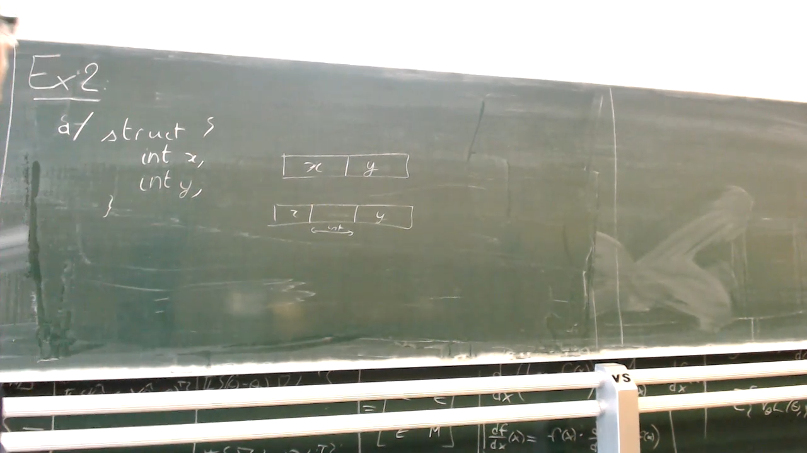

<!-- /home/areo/Videos/Rechnerarchitektur/Computer-Architecture-Exercise-03-2022-11-24.mp4 -->
<!-- /home/areo/Videos/Rechnerarchitektur/_Computer-Architecture-Exercise-03-2022-11-24_imgs -->
<!-- /home/areo/.config/mpv/mpv.conf -->
[toc]
# ==============0:00:00==============
<!-- - `0:00:03`: rookery. -->
<!-- - `0:00:16`: okay so many thoughts. -->
<!-- - `0:00:18`: so we have our set of here we'll use instead of making the programs now they have changed the setup in some whole of the work anymore which is imo. -->
<!-- - `0:00:29`: crowd incidents of exercise which is the exercise room who didn't love me but we had a nazi the key was adults. -->
<!-- - `0:00:44`: but basically he was about trying to. -->
<!-- - `0:00:48`: as we have a program the program to convert the ways so if you look at in terms of c code what's happening at the time. -->
<!-- - `0:01:02`: and it's frightening to see how. -->
<!-- - `0:01:05`: though the. -->
<!-- - `0:01:40`: okay. -->
<!-- - `0:01:47`: though there are two things to do the calculating the mass. -->
<!-- - `0:01:55`: and see what impact this so. -->
<!-- - `0:02:01`: in max is equal to. -->
<!-- - `0:02:05`: the one minus one. -->
<!-- - `0:02:10`: and it's inherently unequal. -->
<!-- - `0:02:18`: woo. -->
<!-- - `0:02:28`: wallpaper. -->
<!-- - `0:02:34`: for star starters. -->
<!-- - `0:02:39`: like wanting a drink and realizing the. -->
<!-- - `0:02:43`: hawks. -->
<!-- - `0:02:47`: you actually into that one didn't work either right. -->
<!-- - `0:02:53`: what wonders okay the words interesting. -->
<!-- - `0:02:58`: even the room mic doesn't work. -->
<!-- - `0:03:04`: anyway. -->
<!-- - `0:03:11`: club guessing that a. -->
<!-- - `0:03:15`: the new. -->
<!-- - `0:03:19`: a one. -->
<!-- - `0:03:23`: and the the. -->
<!-- - `0:03:29`: that in smacks into register for exploding into the. -->
<!-- - `0:03:35`: what we do is the goal. -->
<!-- - `0:03:39`: on the. -->
<!-- - `0:03:49`: i got a few questions last week at the end the bots are well known the story that they don't do anything on memory right they just put the information on the gestures and clear the lord pits. -->
<!-- - `0:04:08`: so we first put into the occurred the venue. -->
<!-- - `0:04:14`: then a honeymoon. -->
<!-- - `0:04:17`: the. -->
<!-- - `0:04:25`: i said put it into on the phone. -->
<!-- - `0:04:33`: hawkins and then another check if a zero is smaller or equal to the max. -->
<!-- - `0:04:40`: the t. -->
<!-- - `0:04:44`: within reason. -->
<!-- - `0:04:46`: had. -->
<!-- - `0:04:48`: from. -->
<!-- - `0:04:50`: a. -->
<!-- - `0:04:53`: the zero. -->
<!-- - `0:04:56`: and humor. -->
# ==============0:05:00==============
<!-- - `0:05:05`: the red. -->
<!-- - `0:05:08`: yes. -->
<!-- - `0:05:19`: that's. -->
<!-- - `0:05:22`: the case saw we want less. -->
<!-- - `0:05:29`: t. -->
<!-- - `0:05:31`: right. -->
<!-- - `0:05:34`: he yet to be. -->
<!-- - `0:05:38`: the game. -->
<!-- - `0:05:41`: the if intimates is smaller than eight so if a clue is smaller than eight and the the day. -->
<!-- - `0:05:56`: alright. -->
<!-- - `0:06:00`: so then then from the interesting question what does it mean to convert an into jacqueline. -->
<!-- - `0:06:07`: the thread what does it mean to. -->
<!-- - `0:06:13`: the one piece of code but what does it mean to convert an unsigned to an end. -->
<!-- - `0:06:22`: the while doesn't mean he doesn't want anything right or just a just a bit so when you just change the interpretation what it does do is move the bits. -->
<!-- - `0:06:46`: into a wall. -->
<!-- - `0:06:54`: otherwise. -->
<!-- - `0:07:00`: the wall. -->
<!-- - `0:07:02`: the man. -->
<!-- - `0:07:08`: the converting between signed and unsigned doesn't do anything. -->
<!-- - `0:07:15`: yes. -->
<!-- - `0:07:18`: for. -->
- 2\*\*19-1 = 524287
<!-- - `0:07:26`: i tried. -->
<!-- - `0:07:32`: the. -->
- 
<!-- - `0:07:44`: the. -->
<!-- - `0:07:51`: the reading of everything. -->
<!-- - `0:07:54`: the. -->
<!-- - `0:08:14`: spa. -->
<!-- - `0:08:16`: the. -->
- 
<!-- - `0:08:38`: okay so now let's try our second let's convert our second piece of code the difference is. -->
<!-- - `0:08:45`: the teachers basic editor the difference is a new rehab and then. -->
<!-- - `0:09:10`: the unsigned and then the code is difference. -->
<!-- - `0:09:16`: the what is the solution. -->
- 
- `0:09:35`: the is **what changes when we[...]**.
<!-- - `0:09:56`: some sign comparison. -->
<!-- - `0:09:58`: the. -->
# ==============0:10:00==============
- `0:10:19`: basically there is **exactly no difference...**.
<!-- - `0:10:24`: there is exactly no difference. -->
- `0:10:27`: **because it doesn't change the bits we are comparing** however **one thing to realize is that a number as integer is always smaller than int max because it's the largest possible integer**. **which means that if you're comparing ? integers**.
- `0:10:47`: **a < INTMAX always returns true**.
- the maximum value that can be stored in unsigned int is stored as a constant in the <climits> header file. whose value can be used as UINT_MAX: https://www.geeksforgeeks.org/maximum-value-of-unsigned-int-in-c/

<!-- - `0:10:51`: not back. -->
<!-- - `0:11:05`: the. -->
<!-- - `0:11:15`: the. -->
<!-- - `0:11:21`: the. -->
<!-- - `0:11:25`: the. -->
<!-- - `0:11:41`: so the next quiz. -->
<!-- - `0:11:43`: fuck. -->
<!-- - `0:11:55`: c the c is about the stomach we have in the pregnant a witness attempting jumping to jumping thumping the dozens can overflow the point is if you remember the lecture we had to jumping instruction one was jumping around the place. -->
- `0:12:14`: the other **one was jumping close and one was as jumping further away**.
<!-- - `0:12:27`: so if you look at the confluence of two fossils of forty seven that fits with me think about the earth. -->
<!-- - `0:12:42`: in that case he can do the simplement circumvention. -->
<!-- - `0:12:47`: the instruction. -->
<!-- - `0:13:04`: however in the second the basically the first season the pacing have to split our consequence. -->
<!-- - `0:13:12`: the. -->
<!-- - `0:13:25`: lower it first conrad. -->
<!-- - `0:13:27`: the kid. -->
<!-- - `0:13:30`: the game. -->
<!-- - `0:13:40`: the. -->
<!-- - `0:13:45`: in that face because we are all approaching the instruction. -->
<!-- - `0:13:52`: the desert room. -->
<!-- - `0:13:56`: the. -->
<!-- - `0:14:01`: the one man. -->
<!-- - `0:14:07`: the fuel. -->
<!-- - `0:14:21`: okay so when you want to jump to a place that way it's similar to audition when you want to lower confidence basically if you have to be put away you have to use an extra instructions to set up a bit. -->
- 0xBADEB ❯ 765419
- hex(0xBADEB \* 2\*\*12 -2) ❯ '0xbadeaffe'
<!-- - `0:14:35`: otherwise you don't have him. -->
<!-- - `0:14:38`: okay. -->
<!-- - `0:14:43`: so let's go to the exercise. -->
- 
<!-- - `0:14:48`: the. -->
# ==============0:15:00==============
<!-- - `0:15:08`: the. -->
<!-- - `0:15:19`: the fact of the mock exam from last year. -->
<!-- - `0:15:33`: the. -->
<!-- - `0:15:38`: so basically we're working on a stretcher. -->
<!-- - `0:15:41`: the. -->
<!-- - `0:15:47`: the minutes. -->
<!-- - `0:15:57`: then basically you're told that a memory that represented what infant the first and the next then the. -->
<!-- - `0:16:10`: it's based on poets represented the poodle because it would also imagine that you have some space the same i dunno the two between the two perhaps in representing nothing and then whine. -->
<!-- - `0:16:27`: however in that case we're called exactly that the memory. -->
- 
<!-- - `0:16:32`: the size. -->
<!-- - `0:16:45`: is equal to the size is. -->
<!-- - `0:16:51`: the and the size of an int is. -->
<!-- - `0:17:05`: two words. -->
<!-- - `0:17:07`: the one where the two words. -->
<!-- - `0:17:13`: okay. -->
- 
<!-- - `0:17:15`: the. -->
<!-- - `0:17:30`: the. -->
<!-- - `0:17:51`: and basically we all have our up. -->
<!-- - `0:17:56`: coins in an error. -->
<!-- - `0:17:58`: the and we would like to fought them. -->
<!-- - `0:18:06`: then we use lexicographic ordering on them so basic theme. -->
<!-- - `0:18:11`: the. -->
<!-- - `0:18:20`: do the first look at the forty minutes and the excitement to equal the new look at the whiteboard. -->
<!-- - `0:18:29`: the end we had given me the code. -->
<!-- - `0:18:36`: the how to do that. -->
<!-- - `0:18:42`: the first call the tea. -->
<!-- - `0:18:50`: so if you want to you to the point where if you look at the code you see that it goes it's putting things in the sack pointer into position twenty eight which mean that we need more than twenty eight and needs to be a multiple of four. -->
<!-- - `0:19:08`: or even put for the two. -->
<!-- - `0:19:12`: the then we have to look a little bit more precisely. -->
<!-- - `0:19:22`: the fold. -->
<!-- - `0:19:28`: the mirror. -->
<!-- - `0:19:36`: the. -->
<!-- - `0:19:49`: in the. -->
<!-- - `0:19:55`: so in the last year we have to then do our separation therefore we have to do the opposite of the soul. -->
# ==============0:20:00==============
<!-- - `0:20:13`: and then basically we have to add some trim instructions. -->
<!-- - `0:20:21`: well yes. -->
<!-- - `0:20:23`: the in and actually look through the internet because there's only one place we can jump. -->
<!-- - `0:20:33`: mainly to the enable. -->
<!-- - `0:20:36`: therefore all this other thing so. -->
<!-- - `0:20:42`: the and then if you want to listen modi had visited grateful to the different breakfast we have. -->
- 
<!-- - `0:20:56`: and the point is that women it is you. -->
<!-- - `0:21:02`: the finest one and basically when you turn to the end you don't override this minus one. -->
<!-- - `0:21:11`: the. -->
<!-- - `0:21:31`: the. -->
<!-- - `0:21:36`: the. -->
<!-- - `0:21:57`: the question. -->
<!-- - `0:22:02`: we had the program for the time basically winner instead of having the. -->
<!-- - `0:22:09`: the in so now we have an area to area is rich. -->
<!-- - `0:22:18`: we have basically an array. -->
<!-- - `0:22:22`: the arab papers. -->
<!-- - `0:22:32`: the progress of programming remains a basic thesis this is the program is called scripts. -->
<!-- - `0:22:44`: the versus the basically either you love them have the array. -->
<!-- - `0:23:04`: we have an array which contains your structure so for example your points. -->
<!-- - `0:23:09`: why the venue over all the structure and then you put your area into that yet you put your coordinate into different areas. -->
<!-- - `0:23:19`: the embedded me here in this in this person we went through the option for having every aspect of error anyone who proper coordinates again. -->
<!-- - `0:23:35`: the the. -->
<!-- - `0:23:55`: the. -->
<!-- - `0:24:12`: the. -->
<!-- - `0:24:26`: the. -->
- 
<!-- - `0:24:36`: the first thing to realize is that when you have a jury of he. -->
<!-- - `0:24:52`: for zero. -->
<!-- - `0:24:58`: the. -->
# ==============0:25:00==============
<!-- - `0:25:18`: the and when you address memory addressing in the words for this as position is zero. -->
<!-- - `0:25:38`: we start up a etc. -->
<!-- - `0:25:42`: which means that you want to access to positions. -->
<!-- - `0:25:47`: the ignore for the day is. -->
<!-- - `0:25:59`: a good by two. -->
<!-- - `0:26:02`: the flu the two the two. -->
<!-- - `0:26:16`: the question is. -->
<!-- - `0:26:22`: where do we go. -->
<!-- - `0:26:24`: you will have slightly more conditions. -->
<!-- - `0:26:29`: and if you look at the pool you can see that the last thing it does when you do job. -->
<!-- - `0:26:35`: we return easy we return do anything to gently return one macrae. -->
<!-- - `0:26:41`: the question is can we do one of the reasons we do the question is when do we return one. -->
<!-- - `0:26:55`: the code basically what do we have it registers. -->
<!-- - `0:27:02`: the renewing of my pocket of death reopens at the beginning we have minus one. -->
<!-- - `0:27:09`: the then week with you and they will put on the top. -->
<!-- - `0:27:18`: so what do we have a four so where was he for written april was written near the crate so in. -->
<!-- - `0:27:36`: a four for basically a whole will be our first coordinate is a five second coordinates and then we compare. -->
<!-- - `0:27:49`: it is less than. -->
<!-- - `0:27:53`: which is okafor is near in that place we want to return minus one we are the place with minus one is already memory therefore we can turn to. -->
<!-- - `0:28:04`: the. -->
<!-- - `0:28:09`: the women want equal rights for women are not equal here if they are not be hurried want to retire one. -->
<!-- - `0:28:23`: therefore the what. -->
<!-- - `0:28:32`: then again here we have something similar with the same equivalence to the inner hoop. -->
<!-- - `0:28:39`: but if it's less than. -->
<!-- - `0:28:42`: we want to return minus one with me the. -->
<!-- - `0:28:47`: the equipped men want to return one. -->
<!-- - `0:29:02`: which is the. -->
- `0:29:18`: all the and then **you ask why the operation stack pointer...** where this question is simple **because this is**.
- 
- `0:29:38`: **leave function and we don't need to save registers and because we don't need to save registers** or ?... **we don't need space on the stack**.
- `0:29:49`: **we don't need space on the stack to save some information** we can just stop there and i mean **we don't need to reserve extra space and if we don't need to reserve extra space we don't need the operation on the stack pointer**.
# ==============0:30:00==============
<!-- - `0:30:05`: questions. -->
<!-- - `0:30:07`: the. -->
<!-- - `0:30:17`: the. -->
<!-- - `0:30:43`: the. -->
<!-- - `0:30:47`: what the fuck. -->
<!-- - `0:31:07`: the. -->
<!-- - `0:31:16`: the endless pursue me have. -->
<!-- - `0:31:26`: the basically you have a bank account where there is some information in memory about homage or something. -->
<!-- - `0:31:39`: there is some space in richest one how much memory of how much money you still have in your bank account. -->
<!-- - `0:31:45`: and it split into two hearts. -->
<!-- - `0:31:48`: be the first one the other and higher the. -->
<!-- - `0:31:57`: it's innocent included. -->
<!-- - `0:32:01`: now obviously lonely will want his number to be the for europe. -->
- `0:32:10`: the and we have **any idea why actually you don't want to use floating point in that case.[...]** represent the of money.
- `0:32:26`: **because there are rounding errors** that was much better to use an integer to integer the hover you want to representative.
<!-- - `0:32:38`: you want to avoid the rolling years when that face exercise made the decision to go into others. -->
- `0:32:47`: which means that we're limited way for you the amount of money you could have on your gold is also limited to the size of an integer which means that **if you want to buy twitter or something your your your your account will overflow but the exercise doesn't really take for the kind of things** but in a bank.
<!-- - `0:33:07`: probably want to check the scandal he can. -->
<!-- - `0:33:12`: so we want to write a function that takes like you have enough memory. -->
<!-- - `0:33:17`: the exercise though. -->
<!-- - `0:33:25`: the one. -->
<!-- - `0:33:36`: the. -->
<!-- - `0:33:39`: the mean let's let's first break it in. -->
<!-- - `0:33:49`: the first reading residency. -->
<!-- - `0:33:53`: often in a language. -->
<!-- - `0:33:57`: the euro. -->
<!-- - `0:34:02`: the. -->
<!-- - `0:34:22`: and the simpler we assume that the numbers are positive and thirty eight three is zero because it's just easier to the lesson throw away the snacks. -->
<!-- - `0:34:39`: the. -->
<!-- - `0:34:44`: the money. -->
<!-- - `0:34:53`: the takeover. -->
# ==============0:35:00==============
<!-- - `0:35:05`: the ima the. -->
<!-- - `0:35:16`: the more the merrier. -->
<!-- - `0:35:28`: the more money you have. -->
<!-- - `0:35:35`: the. -->
<!-- - `0:35:53`: the. -->
<!-- - `0:36:12`: the fact that it's positive right. -->
<!-- - `0:36:21`: the because we know that he too was positive so we told me to check the model. -->
<!-- - `0:36:31`: why the positive. -->
<!-- - `0:36:34`: the. -->
<!-- - `0:36:54`: so. -->
<!-- - `0:36:56`: the remote that if you want to do it in the rear the value would also try to have to take them out of santa lives are all the buzz make it easier even the. -->
<!-- - `0:37:15`: so first we do. -->
<!-- - `0:37:18`: the extracted so you all have zero. -->
<!-- - `0:37:31`: he awoke with wanting. -->
<!-- - `0:37:33`: the pair are. -->
<!-- - `0:37:42`: the money's great though. -->
<!-- - `0:38:01`: two they do. -->
<!-- - `0:38:03`: the is. -->
<!-- - `0:38:15`: and as is the. -->
<!-- - `0:38:24`: the or year. -->
<!-- - `0:38:35`: one. -->
<!-- - `0:38:37`: the. -->
<!-- - `0:38:57`: the. -->
- 
<!-- - `0:39:17`: the. -->
<!-- - `0:39:37`: the. -->
<!-- - `0:39:57`: the. -->
# ==============0:40:00==============
<!-- - `0:40:18`: the about removing the need so we wanted. -->
<!-- - `0:40:26`: the. -->
<!-- - `0:40:36`: the. -->
<!-- - `0:40:44`: the. -->
<!-- - `0:40:59`: the. -->
<!-- - `0:41:15`: the. -->
<!-- - `0:41:25`: the. -->
<!-- - `0:41:44`: the basically when you want to pay for the game. -->
<!-- - `0:42:02`: great news. -->
<!-- - `0:42:04`: the memory you suspect that you have to pay. -->
<!-- - `0:42:15`: then read the memory man. -->
<!-- - `0:42:18`: but let's spread the fire. -->
<!-- - `0:42:23`: the truth. -->
<!-- - `0:42:44`: the fall too. -->
<!-- - `0:42:50`: the bag. -->
<!-- - `0:42:56`: the basically the. -->
<!-- - `0:43:16`: checked it and then we heard it again. -->
<!-- - `0:43:19`: then we return the this is a very simple case and as you also realize he would have sent them all the because negative he was the walrus. -->
<!-- - `0:43:39`: numbers again but basically the name. -->
- 
<!-- - `0:43:43`: was just to go before the. -->
<!-- - `0:43:52`: the. -->
<!-- - `0:43:57`: the. -->
<!-- - `0:44:16`: the. -->
<!-- - `0:44:24`: the so and then invested the. -->
<!-- - `0:44:40`: the. -->
<!-- - `0:44:59`: the pain was so bad. -->
# ==============0:45:00==============
<!-- - `0:45:08`: the idea that what you do is you take the money elephant paid. -->
<!-- - `0:45:22`: otherwise return arrows. -->
<!-- - `0:45:26`: i know what happens is that you have forgotten to protect your the bank account so basically your two processes which are trying to play at the same time and that calling this code. -->
<!-- - `0:45:41`: and the question is what is happening. -->
<!-- - `0:45:44`: the irony the vote in which order there is in which all the. -->
- 
<!-- - `0:46:04`: i have accepted differently once in our program. -->
<!-- - `0:46:11`: rehab. -->
<!-- - `0:46:13`: the in zero we know. -->
<!-- - `0:46:21`: the then the. -->
<!-- - `0:46:32`: a zero then we know the. -->
<!-- - `0:46:45`: the. -->
<!-- - `0:46:54`: then the. -->
<!-- - `0:46:57`: the on the. -->
<!-- - `0:47:19`: zero to one. -->
<!-- - `0:47:23`: the basically this is absurdly what's happening below below the value the value to read right back to motorway. -->
<!-- - `0:47:44`: and what's happening now is that we have two processes in the ribbing he was to operational paradigm. -->
<!-- - `0:47:51`: the first ticket. -->
- `0:48:12`: **we first check what is going to happen if run first the first process and then the second process[...]**.
<!-- - `0:48:18`: so we start with the recent one reason the couch and the memory we have. -->
<!-- - `0:48:26`: and. -->
<!-- - `0:48:28`: the first was his first basically it will load. -->
<!-- - `0:48:37`: the money the neuro seem to. -->
<!-- - `0:48:43`: the memory. -->
<!-- - `0:48:47`: i know the pain it will get back this one. -->
<!-- - `0:48:52`: and then it will. -->
<!-- - `0:48:54`: the years. -->
<!-- - `0:48:58`: enough on the t. -->
<!-- - `0:49:01`: the then will call the second process where the second process will try to pay fifty fifty you will realize that it does not fit. -->
<!-- - `0:49:19`: and wisdom will just say that you're not allowed to pay but this is not the only behavior that can happen. -->
<!-- - `0:49:30`: because we're the euros. -->
<!-- - `0:49:36`: actually the second process also fed for this. -->
<!-- - `0:49:41`: the. -->
# ==============0:50:00==============
<!-- - `0:50:05`: also fetches it and also realize it had the money. -->
<!-- - `0:50:09`: the case where a pair. -->
<!-- - `0:50:17`: the eu the first process says between that to the finish and then the other is basically has two other processes taking up suddenly. -->
<!-- - `0:50:38`: and the bank account was minus one rookie. -->
<!-- - `0:50:47`: because i checked the second process check with the old value and then took the new venue. -->
<!-- - `0:51:01`: but what can also happen. -->
<!-- - `0:51:08`: is that the checks with the orbit still know the old value. -->
<!-- - `0:51:14`: one. -->
<!-- - `0:51:18`: process one sees the and they pay. -->
<!-- - `0:51:29`: and then you write back and therefore basically the first episode fifteen in the house. -->
<!-- - `0:51:38`: the forty niners. -->
<!-- - `0:51:45`: which actually mean that you have managed to make money off of brighton managed to pay twice resulted in the woods and three your account. -->
- 
<!-- - `0:52:03`: no. -->
<!-- - `0:52:17`: oh. -->
- `0:52:40`: so let the **our process one[...]**.
<!-- - `0:52:45`: when it's sickening. -->
<!-- - `0:52:48`: and it's ticket when it's taken what can it read for violence it can henry. -->
<!-- - `0:52:55`: one hundred euro. -->
<!-- - `0:52:59`: it can be. -->
<!-- - `0:53:06`: hiking on the road. -->
<!-- - `0:53:09`: henry ford. -->
<!-- - `0:53:13`: fifty years. -->
- `0:53:15`: right **depending on the whether the complete amount of money was written by the second process**.
<!-- - `0:53:26`: though in both of those cases the result is you cannot pay. -->
<!-- - `0:53:33`: hey. -->
<!-- - `0:53:48`: i didn't want to pay. -->
<!-- - `0:53:54`: and when it was paid once to fight back pretty. -->
<!-- - `0:53:58`: okay. -->
<!-- - `0:54:08`: the room. -->
<!-- - `0:54:13`: so a process to limit shakes a lot of money. -->
<!-- - `0:54:20`: it was either hundreds. -->
<!-- - `0:54:25`: orbit with the wifi. -->
<!-- - `0:54:36`: the fair. -->
<!-- - `0:54:44`: and let it pay. -->
<!-- - `0:54:47`: with me the walking i do. -->
# ==============0:55:00==============
- 
<!-- - `0:55:21`: and we know that he works by. -->
<!-- - `0:55:26`: or writing the motto on the back so all the money. -->
<!-- - `0:55:43`: lot fifty. -->
<!-- - `0:55:48`: in the case we. -->
<!-- - `0:55:52`: or in the case for process one was a loss of iraq. -->
<!-- - `0:55:58`: but taunting the white princess two was enough massacre rough. -->
- `0:56:07`: **but you can also have mixed results.[...]** or you can.
<!-- - `0:56:11`: fifty years. -->
- `0:56:16`: **if the fifty was written after the forty nine was written but before the fifty cents was written** central africa.
<!-- - `0:56:26`: and then the odds of appear. -->
<!-- - `0:56:32`: the. -->
<!-- - `0:56:42`: the kicking fail wicked the the failure reporting to fifty because it was before the rise. -->
<!-- - `0:56:53`: and here we go fifty which means it doesn't stop. -->
<!-- - `0:57:03`: okay. -->
<!-- - `0:57:08`: what the conclusion of this exercise. -->
<!-- - `0:57:13`: read the book. -->
<!-- - `0:57:15`: who got the money. -->
<!-- - `0:57:20`: i forgot here the combination where women may paid again. -->
<!-- - `0:57:29`: read this. -->
<!-- - `0:57:36`: so. -->
<!-- - `0:57:39`: fuck. -->
<!-- - `0:57:40`: the point is that. -->
<!-- - `0:57:44`: when we pay we have to check with them about one hip hop so when we paid we saw when. -->
<!-- - `0:57:59`: so when we pay what the amount of money we can see. -->
<!-- - `0:58:03`: we can see. -->
<!-- - `0:58:06`: burns. -->
<!-- - `0:58:08`: mushrooms. -->
<!-- - `0:58:22`: so we want to pay fifty for it so we wanted a fifty so we have to check what the model we see so we can see the mavs. -->
<!-- - `0:58:34`: the amount was nine and the vermont forty nine fifty. -->
<!-- - `0:58:39`: the the. -->
<!-- - `0:58:45`: near mouth of one minus one and the wall. -->
<!-- - `0:58:56`: the. -->
<!-- - `0:59:00`: the mile. -->
<!-- - `0:59:07`: the. -->
<!-- - `0:59:10`: the bottom line. -->
<!-- - `0:59:13`: the. -->
<!-- - `0:59:16`: is the tea. -->
<!-- - `0:59:28`: and he wants to pay again and read about the money. -->
<!-- - `0:59:33`: and you can you have the money. -->
<!-- - `0:59:38`: the case either one hundred saw on the t. -->
<!-- - `0:59:53`: all you see that amount of money. -->
# ==============1:00:00==============
<!-- - `1:00:01`: the fire. -->
<!-- - `1:00:25`: so. -->
<!-- - `1:00:33`: we get minus one fifty. -->
<!-- - `1:00:37`: wickets minus one. -->
<!-- - `1:00:47`: the. -->
<!-- - `1:01:07`: the fire. -->
<!-- - `1:01:11`: the appointment. -->
<!-- - `1:01:15`: the. -->
<!-- - `1:01:20`: the one percent here is to read about all possible reason. -->
<!-- - `1:01:38`: the only way to be one hundred percent certain we have all possible result is just to enumerate all possible paths in the program. -->
<!-- - `1:01:51`: and this is definitely not something i can do because the problem is that. -->
<!-- - `1:01:56`: so what can we conclude from that where the mods are thinking about a program is complicated. -->
<!-- - `1:02:04`: and because that is all possible parts and especially to share via the you are very soon into trouble. -->
<!-- - `1:02:12`: if you share my troubles without protecting the one thing to realize is that in that example we made the slightly simplifying assumption that when you write the word it's economy which means that when you write. -->
- 
<!-- - `1:02:32`: fifty you end up with fifty. -->
<!-- - `1:02:36`: problem is i mean this was in most processes talking all processes. -->
<!-- - `1:02:45`: the. -->
<!-- - `1:02:51`: not completely obvious which is wrong for larger objects. -->
<!-- - `1:03:01`: the because my son is into processes. -->
<!-- - `1:03:08`: parker writes of a mouth into the same place in memory. -->
- `1:03:14`: the **basically there are three possible results[...]** in the case we make assumption we assume that it was coming so we assume that one when the covenant is upon your pipes it can also you can also end up with a mixed mix of the club.
- 
<!-- - `1:03:34`: the nation's right and also between the press evaluating somebody from the eu. -->
- **when you write bytes you can end up with a mix of the combinations**
- `1:03:39`: **in practice what's happening is that in memory it's atomic so a word you will not have the mix...** but if you're writing an array or something larger one can end up with mixed? the premises which ranges from rebel warm obligated.
<!-- - `1:03:56`: which would make probably even more complicated. -->
<!-- - `1:04:00`: and. -->
- `1:04:03`: the **one solution which is used by the resparray language for example is that if two programs share a value[...]** then they can either both read it basically your digital writing going from two places.
<!-- - `1:04:23`: without soul protection. -->
<!-- - `1:04:26`: the driver is the only one process embedded in writing and otherwise you need to share it properly with some protection to avoid the problems we are talking about right now. -->
<!-- - `1:04:41`: the other questions. -->
<!-- - `1:04:45`: the snow. -->
<!-- - `1:04:49`: okay then i guess we can to stop early. -->
<!-- - `1:04:54`: and thank you for coming and let's see you in two weeks hopefully i managed to get this system under control from for that. -->
# ==============1:05:00==============
<!-- - `1:05:05`: the. -->
- **50.0, 50.5, 48.5, -48, -1.5, -1**
