<!-- /home/areo/Videos/Rechnerarchitektur_old/computer-architecture-20211021.mp4 -->
<!-- /home/areo/Videos/Rechnerarchitektur_old/_computer-architecture-20211021_imgs -->
<!-- /home/areo/.config/mpv/mpv.conf -->
[toc]
# ==============0:00:00==============
<!-- - `0:00:00`: the. -->
<!-- - `0:00:04`: alright so do we talking about at first about sedative and memory a little bit and then about like time space and time so let me first show you the and. -->
<!-- - `0:00:19`: now if need to find my button again. -->
<!-- - `0:00:26`: the the slides below it are and this time i'm trying to the white you seeing my other point of which did not work last time or and so on. -->
- `0:00:43`: here is where we there last time so what i wanted to to show you here is that bit was a **tremendous increase in**.
- `0:00:52`: **memory capacity in in since the seventies** and meters since i was a teenager actually so so so i i had a my first computer actually bought in in around like the beginning of this plot sway ninety eighty and dumb.
- `0:01:10`: it's really exponential to know that the the x xs here is a linear at the the **y axis is log scale** the locks gates that means in any kind of straight line heater like it would be an exponential curve in.
<!-- - `0:01:30`: the. -->
- `0:01:32`: also the **costs went down** in the same way or if you can think are ugly into the wrong the **relative performance per cost went up** so this plotter at the bottom is from the author copied from the boston computer museum which had that.
<!-- - `0:01:52`: for the last one number he was estimated and by by the author actually in the picture bank well. -->
<!-- - `0:02:06`: the author i am starting to think i am over it here i bet the author which the author provides together with the book you as a two thousand twenty number which is twice as big as the one which has sandwich was two hundred fifty billion. -->
- 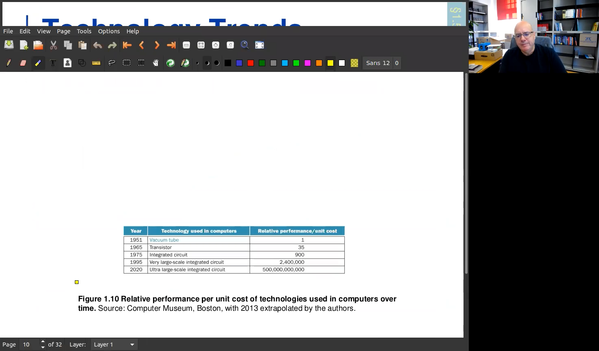
<!-- - `0:02:25`: okay profitability as is five hundred billion. -->
<!-- - `0:02:30`: but but anyhow you see this this trend in the year just as an asset of a short anecdote where b b going to buy a really big machine with a two terabyte a main memory and it's actually cheaper than the medium. -->
<!-- - `0:02:47`: size car these days which is also something i did not not expect and and the strength will probably continue so this is really not stocking that the then then then the memory you have is increasing and this is also a problem of which we going to have focus on in chapter five. -->
- 
<!-- - `0:03:07`: so close to the end of the and is in the second part of this whole electoral not today but of the lecture series alright am. -->
<!-- - `0:03:18`: the the real reason why we had this is the semiconductor technology and and maybe to give you some some insight into this one how this works here is you have this. -->
- 
- `0:03:33`: silicon ingots with like a **cylinder** and from that you can **slice off these wafers** and then.
<!-- - `0:03:42`: i. -->
- `0:03:43`: oops sorry and then these wavers through a **optical process...** they're like lots of **structures kind of printed on and are like her**.
- `0:03:53`: **manufactured in a certain way layers of it** and then you get here these are **wafers with patterns on it** and then you contest the wafers and and then you're having here and.
- `0:04:07`: he took these certainly need to put them in url to put produce chips i mean i think this is the reason why they're called chips you they are all hours apart dice so you put pick is wafer into your cutting into these individual bits they're super usually supposed to be almost always identical and then **these crosses here**.
- `0:04:28`: **mean that like you would have some production failure** and that's the reason for that is **because this process you on the right here is not perfect** and you will always introduce sort of box they called for it's actually so independent physically a physical manufacturing box if you want and then some of these so he will.
<!-- - `0:04:48`: not work. -->
- `0:04:50`: and you have to start them out and there's a whole lecture on this topic hollywood actually test these and we're not talking about this here **then you need to put this into a plastic** chicken **and put connections to it** switzerland is kind of the bonding in the packages and then you tested again and may.
# ==============0:05:00==============
- `0:05:10`: maybe them some auditioning one said a need to be removed because the obagi skin **test them again and some additional ones need to be removed** to the customers so that the most important concept here and this is why the why the system the book is yields like how much.
<!-- - `0:05:31`: or how many. -->
<!-- - `0:05:34`: and the percentage of of chips you actually get friends and it's not hundred percent in reality because you have always is physical issues and then some other guards parade like here and here's a former yes sir his pictures right and here's a picture of off think of me. -->
- `0:05:53`: and into a seed cecil into the wafer and you see like of course **at the border you can use these chips but the the middle** you can use these and this would be like five hundred six four dislike the size to a leaf or properly.
- 
<!-- - `0:06:13`: and that's already the veins the technology so ten nanometers the intuitive still the tin mango meteor but the bmd who is to hearses for these laps like the process besought here this is done in the lead and his lips are currently a very hot topic both in industry and in quantity. -->
<!-- - `0:06:33`: just because there's a. -->
<!-- - `0:06:36`: like they're not enough and chips produced these days and then cars cannot be manufactured to be cetera and and this lap that are into and owns its own laps and to the mds is using other labs and thus like companies require hamas and some have laps and currently. -->
<!-- - `0:06:56`: for instance amd uses a seven nanometre technology in the sun nanometers means the does shirt is modest size off and you can have in this optical process the graphic process said if the smallest the while it's the transistor british never heard of but francis traits of course not clear what what. -->
<!-- - `0:07:16`: i mean it's kind of when you produce these chops then inside a desert chips and an insight this modest talk to you can produce but have this linked fear and the smaller there is it's as better. -->
<!-- - `0:07:30`: alright and yet so maybe also here this number is pretty interesting so each add chip at the end of die is roughly like one square centimeter like ten by ten millimeter to like maybe like the the needle of my thump and. -->
<!-- - `0:07:50`: and and yeah that's how our chips are produced and there's this concept of yield on the mixed a slide or something which i i'm not so sure why why the author put it into the book but that the maya maya argument is as follows the the cost to to chip the time right back for. -->
<!-- - `0:08:10`: the processor. -->
<!-- - `0:08:12`: if it is a puzzle consists of one die obvious i should have mentioned that that nowadays may be multiple chips are put into one of addiction then not identical ones at different once and then you would have minded chips a pair of processor you want but usually. -->
- `0:08:32`: think of just having sort of one or one taiwan then one with the one that corresponds to one processor and the question is what's the the cost of this dependence of of of various factors so of course the **yield goes inversely linear** right.
<!-- - `0:08:53`: because if you have lists out that the percentage is the percentage of of tips which work then at the very end in them. -->
<!-- - `0:09:05`: and now the interesting part case is kind of this long this the whole argument and from actually here this is what the author of the book wants to point out so if you are put in this year deal in the formula on the top you will. -->
- `0:09:24`: we'll see that the **die area goes into the cost per die like monotonically increasing** a **die area would increase** the cost which is kind of what you would expect like is bigger this said you would want to have a chip which is likened to thumbs to newsom's to natives of sum then you would to.
- `0:09:44`: have an mmo to pay more **however there is this thing here this is two...** which says okay we're actually not having a linear cook connection here so the **die area of the size of our chip goes into the**.
# ==============0:10:00==============
- `0:10:05`: **costs with this example he quadratically** the actually explained in the book that this some.
- `0:10:12`: **this connection is emperiticaly determined** of this this thing here at the bottom which i showed here and this is an empirical formula on its we cannot really explain dislike form when monitoring the manufacturing process and even earlier this is claire's just sort of the point that to me.
- 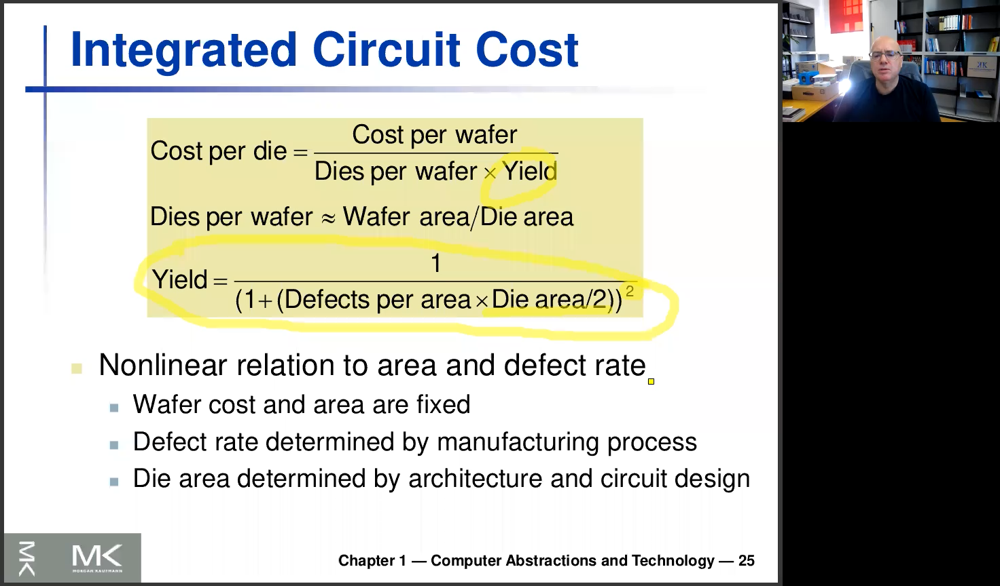
<!-- - `0:10:32`: glad it's not an year but may be. -->
<!-- - `0:10:36`: equal bills with three or four like gotten on the year above linear. -->
<!-- - `0:10:41`: alright so we're not going to do any computation on this in the exercises i think and let's move on to performance and before i i i do that so there's an example in the book with the airplanes which i don't find it and fittings will let me give you some other. -->
- 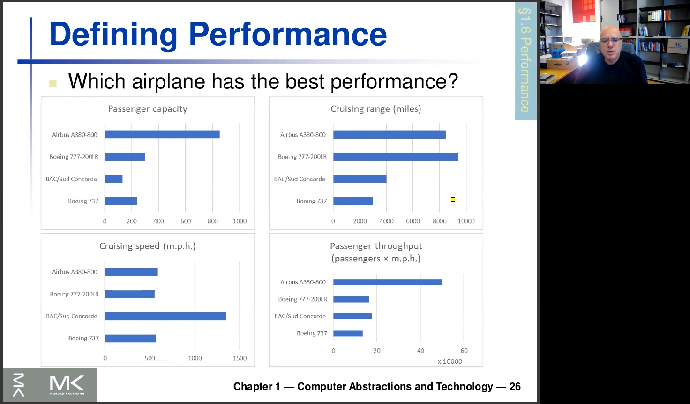
<!-- - `0:11:02`: motivations and in the first one i want to it's kind of a top-down an education or motivation bem and so this book here i can see myself stories and see myself in order to to be able to. -->
- 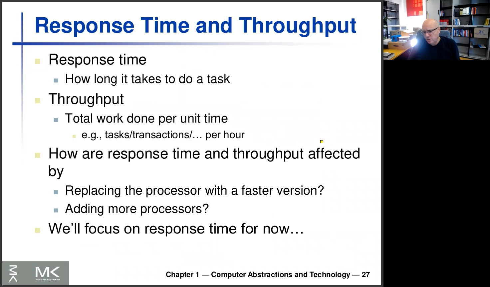
<!-- - `0:11:21`: i. -->
<!-- - `0:11:25`: yeah what anime out little let's not not bothered about that so i hope you see what i'm what i'm showing now my my chat is the just a second okay and this book here is like from nineteen ninety eight it was. -->
<!-- - `0:11:43`: during the time i am after my otherwise studying the prime example of performance analysis which is also if it occurred around the same time as the books of all electrolytes and this one was also from the nineties the audacity or deficient in the it says the article the assistance. -->
<!-- - `0:12:03`: performance and it's a little bit dated but of course like it says still do. -->
<!-- - `0:12:10`: a good read and maybe you'll find more information about this in the web so if you want to know how you really statistic of two distinct precisely on this may this is an additional. -->
- 
<!-- - `0:12:23`: great. -->
<!-- - `0:12:25`: okay but now let me show you the first example which is from the book and so i've pretty boss with an alias already and and as a motivational extent and it's this it's like a small program which we're going to. -->
<!-- - `0:12:45`: evaluate it's running time so i did this already before as you can see so i'll start again so that you can really see sir taking his time since four minutes or so or five minutes let's put it this way and. -->
- 
<!-- - `0:13:02`: it doesn't matter expert application so so the code is it is produced in corso. -->
- `0:13:12`: ernest's it sir the extra code is the one here right so this is the **matrix multiplication in python** and you're on top i'll i'll get the zero metrics which is the recite initialized to zero and then i have yes of course two random ones.
- 
<!-- - `0:13:30`: because they need to do something of course i could have just put them. -->
<!-- - `0:13:37`: concrete value is there but it just generate the brain the end and tiered this is the most important part this is the the size of the matrix which could cook to one hundred. -->
<!-- - `0:13:48`: then the the item group or program is pretty fast food as if in in a zero point three seconds if i put those sorry. -->
<!-- - `0:14:02`: if i could put two hundred then it it's already consistently slower so that twice as a slow ads as far as his low rates it's the fifth or off of what is it like roughly seven right. -->
- `0:14:17`: and the reason for that is because **matrix multiplication is actually cubic algoirthm** you see this also if you're an.
<!-- - `0:14:27`: and if you look at the code here so desire three four looks great and all are in the range of one to ten and and yes it's a simple complexity analysis which gives you. -->
<!-- - `0:14:41`: such like a cubic complexity and then if you increase this number here to two nine hundred sixteen. -->
<!-- - `0:14:50`: then you get what what the other window is showing here like five minutes so this will i keep it running in the background okay now. -->
# ==============0:15:00==============
<!-- - `0:15:02`: the first. -->
<!-- - `0:15:05`: i'm sorry to hear the first thing i want to say show you here is and it's also from the book is what how can you make this faster because we wanted to have a fast computing rate and by doing actually at the end faster processes. -->
- 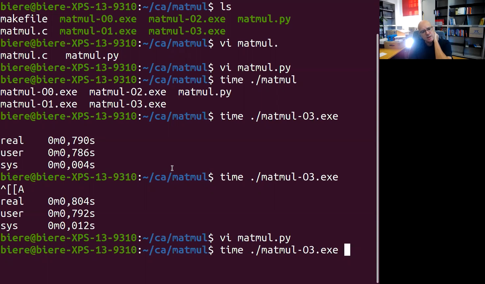
- `0:15:24`: but before you do that maybe on a high level there are some other ways of optimization i mean there's actually something which i will show you later in the year when we talk about caches how you can optimize this further but the **simplest trick of course is to just write a c program** which does the same so.
<!-- - `0:15:44`: so i need like a slightly more complicated initialization for the of or for the two mattresses and to see also here they are initialized to be a nine hundred and sixty but a sixty mattresses and then it's almost identical quote i don't have pissed off. -->
- 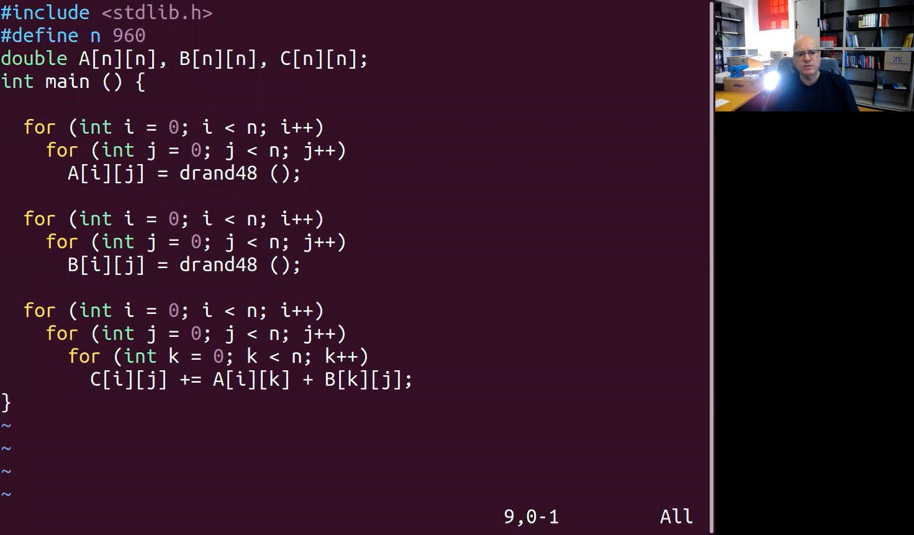
<!-- - `0:16:04`: fancy a range based photo from python and c bloodless i would have it but i wanted to see here and that of course i have to compile it so this this other this type of program is interpreted to the python pro an interpreter would then directly interpret his python. -->
<!-- - `0:16:25`: actually there's a compilation of pussies in the background but it would only generate them. -->
<!-- - `0:16:30`: like a byte code and then run a despite called interpreted. -->
<!-- - `0:16:35`: and what i show you here is likes then the compilation was the gcc compiler in four different optimizations and if you're you see already here the the the one with the process optimization is an envelope it was one second zero point eight seconds the rebuffing the reason for that is. -->
<!-- - `0:16:55`: cause because i'm running the other one in the background and also the laptop years i'm using it for zoom so without any lag you can only run the program itself takes a zero point eight sentence and yes of course this is a then an imprecise measurement digital. -->
<!-- - `0:17:15`: located and then maybe take the averages and. -->
<!-- - `0:17:22`: alright now i also want to show what happens if i don't optimize the optimization level of zero and then it takes i think of one five seconds on an unloaded machine so maybe here so i dunno ya eight seconds say any house effect but then i did this before and i were into it. -->
- 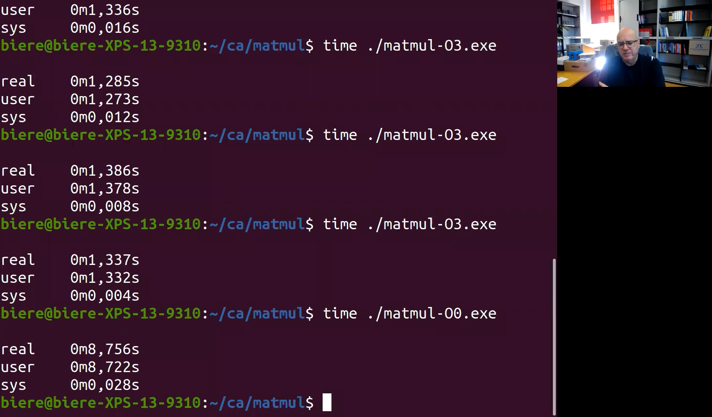
<!-- - `0:17:41`: where this machine was not used it's actual laptop here and it was five seconds. -->
<!-- - `0:17:47`: okay and then you get from five seconds to slightly below. -->
<!-- - `0:17:52`: what we saw above your two slightly below one second so it's a fifth or sixth whistle so the compiler gives you by using two doing something clever here the factor of six and and of course this is a prime example for for optimizations built into. -->
<!-- - `0:18:12`: compiler and if you really want to learn about this what the kite compiler really does then you need to to go to compiler class a but but i'm i. -->
<!-- - `0:18:24`: and like in the book there will be also the assembler code for that but will going to look at that in the in the second lecture because i'm not now alright. -->
<!-- - `0:18:37`: so you can get here at the factor off of the earth survive time sixty so three hundred seconds to one seconds effect of **more than three hundred by by just switching from python to c** and yes there's like edition. -->
<!-- - `0:18:57`: things you can do and then each chip of the there's like some. -->
<!-- - `0:19:02`: something in which goes in this direction at the very end of course he can paralyze it and then. -->
<!-- - `0:19:09`: what you get here is. -->
<!-- - `0:19:13`: sorry this is the wrong thing here. -->
<!-- - `0:19:20`: and you will get actually effect of forty thousands i cant find the the picture at the moment yet. -->
<!-- - `0:19:28`: the right one here like you get like a factor of forty thousand what we did here was this patient person he actually took him at three hundred seconds and then we translated it to see the hours took like zero point eight but was a different machine i think this was some of the book some some interprocess of money. -->
<!-- - `0:19:48`: in the movie slot so completely different processor than what i have here in the uk but the ranges is the same six hundred the effect of under seventy five when we had like a factor of three hundred four hundred grain and you can increase this by by these other methods of the other chapters and then at the end with. -->
# ==============0:20:00==============
<!-- - `0:20:09`: six even go to n like fifty thousand times faster like then then the sir this version he kept here. -->
<!-- - `0:20:19`: with python. -->
- 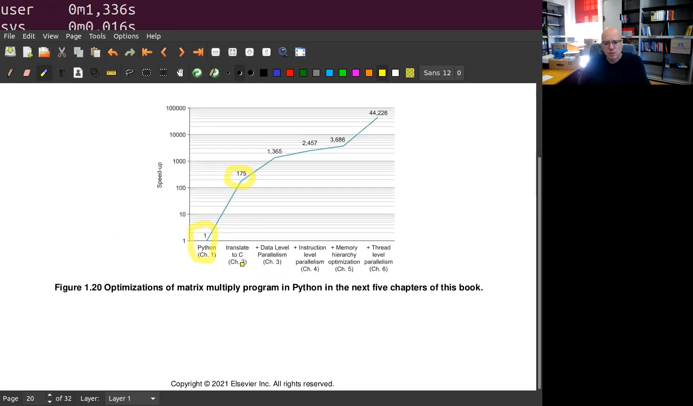
<!-- - `0:20:22`: okay so this was one motivation but i have not alone and i want to show you this so maybe you see getting back i have for started to fill my empty shelves year and there's their books from donald knuth in particular huh this one is there these are the art of compute the pro. -->
<!-- - `0:20:41`: cramming in the. -->
<!-- - `0:20:44`: of course this is the least these are the five minutes of computer science they're actually older than i am and to the original series and to adult muth and has also been with visiting beaten against a couple of years ago in two thousand and thirteen and he awesome measures like time of at least. -->
<!-- - `0:21:04`: ever since and then you've changed the way how he measures it and you see it here he he measures time in terms of amendments so that's why there's a wikipedia article on this members you can also find it in those books in the art of computer programming series. -->
- `0:21:24`: and what's memes well memes simply means like at a program **can be measured machine independently**.
- `0:21:36`: the **performance of a program can be measured by measuring how many memory accesses it does** came.
- `0:21:41`: and **it's actually a pretty solid way of measuring the time**.
<!-- - `0:21:46`: if you don't want to commit to a to a particular machine because machines are changing like every biker through three years you have new processes and new technologies and and so sort of if you want to keep the discussion for instance of the the effect of of of running an egg with them on on some of em. -->
<!-- - `0:22:06`: machine independent of the current process of generation you might want to use something like that act so memphis and then even if you would go to the latest google phone clues say just say he finished a book in two thousand and fifteen and then just recently there was in the night. -->
- `0:22:27`: sir books and posits will be actually similar last year and and you measure that you're going through this book and you will check out how he measures times then you'll see he doesn't find this makes the weighted assets that he programs in c by the wayside of billions of c his seabed extra me and **it's called**.
- 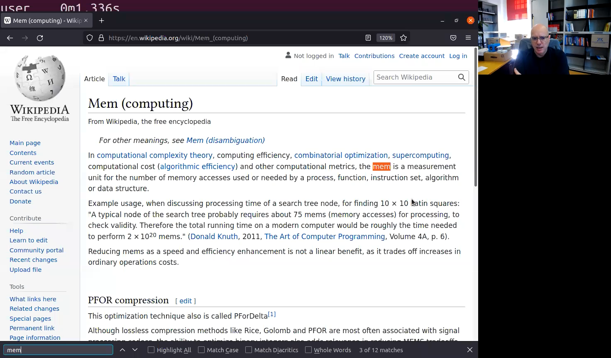
- `0:22:47`: **literate programming** it's like **every point of access is hidden in a macro and then whenever the pointer dereference it's value excesses the aray if you want then you would ineease this global memes counter and at the end when the program finishes you print this number**.
<!-- - `0:23:07`: his number. -->
<!-- - `0:23:10`: okay that's how knuth bassett that it looks like still a little bit like academics on the food gets you know the third motivation that and this here is by me on github so he go to my github page you will see there's like them here these on my. -->
- 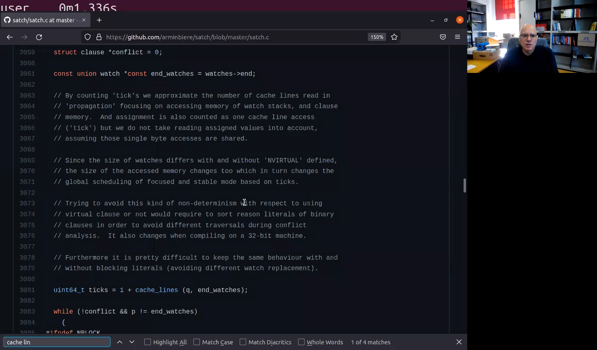
<!-- - `0:23:29`: okay then there's the sach a sat solver which i did for the education to. -->
- `0:23:37`: for purposes earlier this year there was a seminar in the paper i i program distinct just a nice example of sat solving and at the the problem here was that **the sat solvers consists of multiple faces and you don't want to spend too much time in each of the faces** wrangle and would have spent the same time near the sanctum here.
- `0:23:57`: now **of course you could do this with a with sort of like a real time clock** return clock but the the **bad thing about using a real clock is that you you would actually kind of put non-deterministic in the program** because a weld is clock is not completely accurate and the procon might try running one run a little bit further.
<!-- - `0:24:17`: than than before for the same time and then you get sort of strange effects by by by by switching to this other face too early and therefore you need to kind of measure the time taken by scientists or some inside of the program and we could use the. -->
- `0:24:37`: memes of thunder knuth but it's also pretty awkward because then every the reference of a point of reference each homage to one you need to kind of increment this counter and it's also not accurate enough because **what's really the time taken**.
- `0:24:58`: **in this modern processor is actually how many cache lines you're going to excess** and this is of course the topic of chapter five so i cannot explain all the details here but what at the end but very nicely for getting sort of like it did the monistic and pretty priests.
# ==============0:25:00==============
- `0:25:17`: sighs then a def a mad a precise way of measuring the speed of one face so that you can switch between other ones but at the same time there is **to measure how many cache lines you actually excessed** and of course you each has need to sort of approximate is so so and recall.
- `0:25:38`: it's not memes because donald knuth was the meme so **we call them ticks** three you could also say **how many cache lines did you**.
- `0:25:48`: **excess during the hot spot of the algorithm** and it's not that complicated so here's the the edwards for that while he just **take the two pointers you you subtract from them and divide by the size of the cache line** this is done **with the shift because that's cheaper than the division**.
- 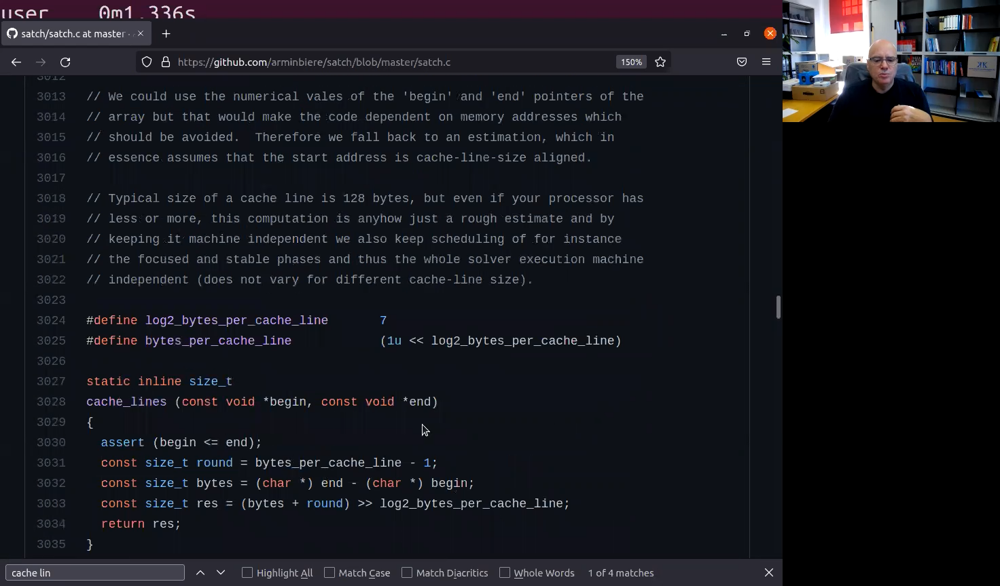
<!-- - `0:26:08`: vision and you see her already it's like we assume here simply that the catch lines on the twenty eighth fight even if it's not the case like sixty four pike was the latest example on that this is still pretty good. -->
<!-- - `0:26:24`: an estimate an end and yes so so so it looks pretty complicated and all but why why i'm showing it as well this is one example there even if you do some high-level high-performance computation in this case implementing assets over it's kind of important to understand. -->
<!-- - `0:26:44`: like how caching might how the process will work with respect to this memory issues and it and it turns out that at least phones that have the programming perspective this is like what i claim here when this program is that the b and. -->
- `0:27:02`: and then the **number of cache line acccessed is a better better metric** at least a deterministic one than tie.
- `0:27:12`: and and also better than booth's memory speeches of course and not the same so cache lines are as i said from twenty eight pints and it's like if you have this line in the cache it's cheaper to access all of these on the twenty eight bytes by **knuth would for instance**.
- `0:27:32`: **count a memory access to two different cache lines the same as memory access within one cache line** which is not accurate.
<!-- - `0:27:43`: alright so this is the the the motivations i i wanted to gift from the to the book cause this response time right so that should be finished by now writes with this thing took know a slightly more than five minute this is the response time of the. -->
<!-- - `0:28:01`: the matrix multiplication or. -->
<!-- - `0:28:04`: am. -->
- `0:28:06`: so it's how long it takes to do a task to but there's something else weeps like a throughput and and **throughput is like how much work you can do** right so so because sir this machine here has four core so **i could actually try to run four matrix multiplication**.
- `0:*28:26`: **in parallel maybe they would take the same time** that they'd be ticketed a bit more each **but altogether they would have done almost four times the work in the same time** the **throughput would increase**.
- 
<!-- - `0:28:42`: and that's kind of what we're after here in in in this book so first we're going to have to look at response time improvements and then later look at methods to improve also throughput and as i've already explained. -->
<!-- - `0:29:01`: ultimately the the the way how it's done today is like getting lots of butts of course to do lots of work in parallel and this way increase the throughput but not necessarily response time. -->
- `0:29:17`: okay and there's like the one caveat here like in at and this is already **discussed before with this mems and this cache lines** and it's like **what do you read take as time** and if you take.
- 
- `0:29:36`: real time there's like two times one is like how how **how long it really took in reality** is called off from the **wall clock time or elapsed time** there on the top right to the spot you.
- `0:29:52`: and this includes all the time instead of b saw him before him maybe i should actually show you this with the time commentator so here it was almost the same surreal time as the ballpark time while the **user time...** missed.
# ==============0:30:00==============
- `0:30:10`: it's **time spend on running this process** of doing this matrix multiplication misinterpret that the python program and then there was a **little bit of system like maybe this was reading the libraries to interpret this python program**.
- 
<!-- - `0:30:27`: this is a python program and here for the thumb. -->
<!-- - `0:30:35`: c program the difference is actually not that much rain. -->
<!-- - `0:30:41`: i. -->
- `0:30:45`: so **cpu time** is really sort of an **only the program is running and not something else from the system** or maybe.
- `0:30:57`: when **not: disc chops or network excesses** and that's why also classic that **you have these two user and real** on what we just saw and the **on the slides it's kind of elapsed time and the cpu time** then instead of elapsed time i prefer the term workshop time because that's really make clear that that you are.
<!-- - `0:31:17`: really that that sir that what what it means where there's no no ambiguity there if you say what time. -->
<!-- - `0:31:27`: okay. -->
- `0:31:28`: then on the computer architecture if you forgot about forget about the throughput at the moment it might have been course and you could **measure time with the fourth way** so **we saw now...**.
- `0:31:44`: we saw these **mems** we saw.
<!-- - `0:31:50`: bissau. -->
- `0:31:52`: these are **cache line excesses** then **we real clock time** and **user time** i would call him a **but you could also just measure how many clock cycles the processor used to to compute** the dismisses actually pretty pretty exact except for a technics eat it again.
<!-- - `0:32:12`: and like issues like memories thoughts or. -->
- `0:32:18`: i miss predictions and whatever and this is of course **if you run like one job on one dedicated machine pretty deterministic but if you run multiple jobs...** you have might have and even my mac in the course or you need to react to external events.
- `0:32:37`: this is not completely.
- `0:32:39`: back a **not completely deterministic anymore** and actually can also be used to secure the text but in any case for us like an the simplest abstraction we can measure only more how many clock cycles did it take to to execute say a certain programmer.
<!-- - `0:33:01`: and. -->
<!-- - `0:33:04`: and this is shown on this pictured here and and as lights are slightly more technical. -->
<!-- - `0:33:12`: discussion about that which will follow but let's just like focus first on. -->
<!-- - `0:33:20`: on on this kind of basic principles which you must have seen in any digital design constantly have not attended which is the same course let me just explain what what dennis our are like. -->
- 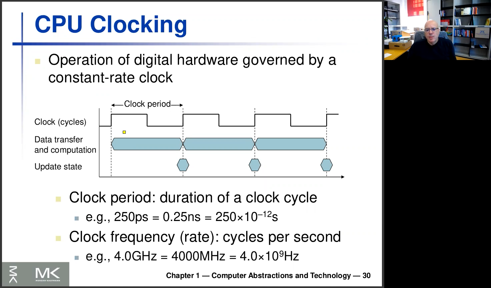
<!-- - `0:33:36`: and a new one. -->
<!-- - `0:33:39`: like clang important if you want. -->
<!-- - `0:33:43`: should for switching them just a second. -->
<!-- - `0:33:49`: okay so. -->
<!-- - `0:33:52`: in principle in each design a week when we have this kind of abstraction with with the clock here so this dusty notes kind of clock and then and this is in essence the state of our system. -->
<!-- - `0:34:11`: and then we the the read the state okay and and produce through some function so i'll i'll put your a kind of a block. -->
<!-- - `0:34:25`: and also read some some input we produce some. -->
<!-- - `0:34:31`: next statement we remember and this is the input. -->
<!-- - `0:34:38`: and this is the next state. -->
<!-- - `0:34:43`: and and then in addition often there's like a second clock here which you can interpreted as special going on here's where this would be the output alright and one. -->
<!-- - `0:34:58`: okay so they element maybe that slight divide is a little bit here so this is the next state logic here and and and. -->
# ==============0:35:00==============
<!-- - `0:35:14`: and everything which is a kind of a computed in one clock cycle not here it's a clock input which has this shape effort i have already the clock years into just didn't have the line there. -->
<!-- - `0:35:30`: and of this of this this is kind of the shape of the clock which you see here on on on top of this huh. -->
<!-- - `0:35:41`: then i'll be up. -->
<!-- - `0:35:44`: you would just read here. -->
<!-- - `0:35:48`: the the current state and and produce them here and here the next state. -->
- `0:35:56`: and and then save the state here and then the the crucial part here is that this part here is next state logic here is sir needs to be computed writer it has some what look what we with all actually delayed it will take some time to compute this.
<!-- - `0:36:16`: and am. -->
- 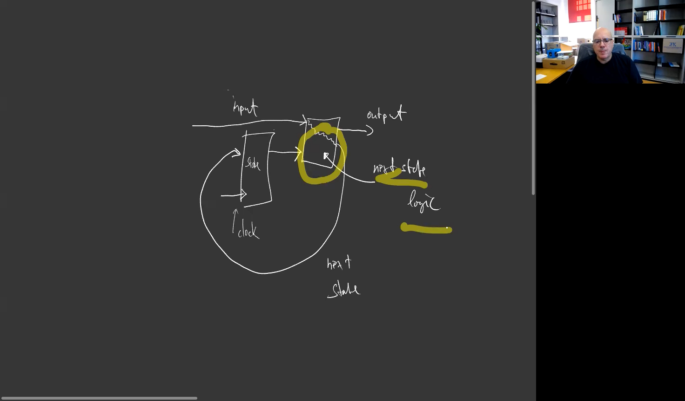
<!-- - `0:36:20`: and usually you can think of if he would go that here too. -->
- `0:36:25`: **zoom in into the next state logic** rate then you would have from maybe mike gates then maybe a navigate here am and if you have not seen gates that this is an an interior and and this is an or and right and so this continues to.
<!-- - `0:36:46`: read stuff from here and then at the end you you need to produce the next state here. -->
<!-- - `0:36:54`: and then computing this logically of course in into reality this will be mapped to a lower level actually the transistors but we're not looking at this level yet so maybe i'll talk a little bit late about cmos mk now so so so so this logical gate will take some time. -->
<!-- - `0:37:13`: ends well this is maybe like a but to compute this time here is the time it takes from an input list or from here to effect the output here the mistakes that may be around ten picosecond so this is the range wipe may be an it not lord she could. -->
<!-- - `0:37:33`: second in one picosecond is one thousand offer a nanosecond and that's the inverse of one giga announced just to give you sort of the the relation rates are all processors so this clock here and we have the cops here and this clock duration hear this. -->
- 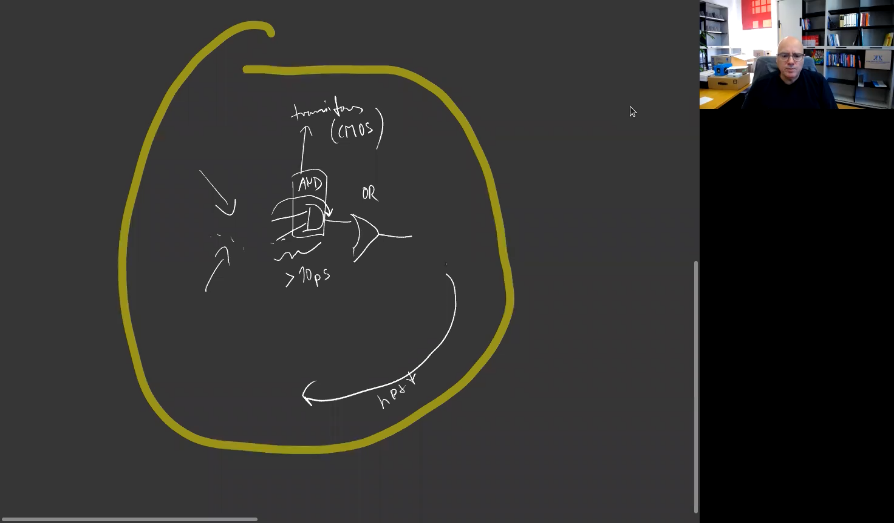
- `0:37:53`: this usually in the range that **this clock deration here is in the range of of nanoseconds because the clock frequency which is the inverse is in the range of gigahertz rates** nowadays as you see here it's more like a falcon got helpful current this for computers or even for fallon says likens french.
- `0:38:13`: and then **the inverse of it would be like one fourth of a nanoseconds which is two houndred fifty pico seconds** now if you go back to my picture and i would say like one engage taste tenant tenant take the picosecond compute and then there's like a another one here another ten seconds straight then he can only sort of have twenty five pico seconds.
- `0:38:34`: in one clock period... spring like a.
- `0:38:42`: twenty five with food this way and then **until then you need to compute the next state** and **then at that point you're getting the next edge** actually there's a trick here which is kind of a very old and very effective trick is.
<!-- - `0:39:00`: that in here like these things could actually use that if compete view you you don't care about sort of this or how it is propagates the changes in computation and then it will take them. -->
- `0:39:16`: maybe in needs **some time until the next state function stabilizes as it doesn't change anymore** but then it's fixed at zero in one for one bit and i just have **to make this clock appear long enough** such that this happens like **you have the computational trick...** through our oil.
- 
<!-- - `0:39:35`: our aim gates here that writes up and now i have the wrong color here hassle. -->
- `0:39:42`: and then **at the end of course that stabilizes because the state doesn't change** and then you have computed next to function **only at that point you're reading the next state and updating the current state** and and as a trickier so.
# ==============0:40:00==============
- 
- 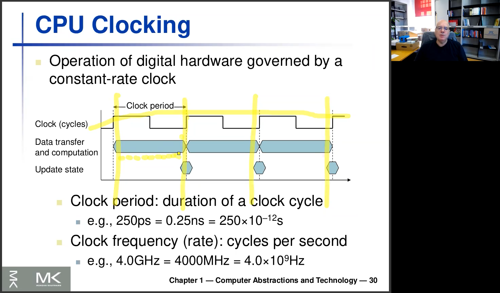
- `0:40:02`: this is kind of an edge triggered from the sign which i cannot go into but the basic idea is that **the dashed lines here, you really sort of open a little bit the the input for the next state when this comes back here**.
- `0:40:23`: wait here to read this thing here and then the **only a small** set of very rare is more like the the **fraction of time you will read here this next state and update this state here** and **during that time here the output is still kept stable** or it would take of perth lake also pretty long.
- 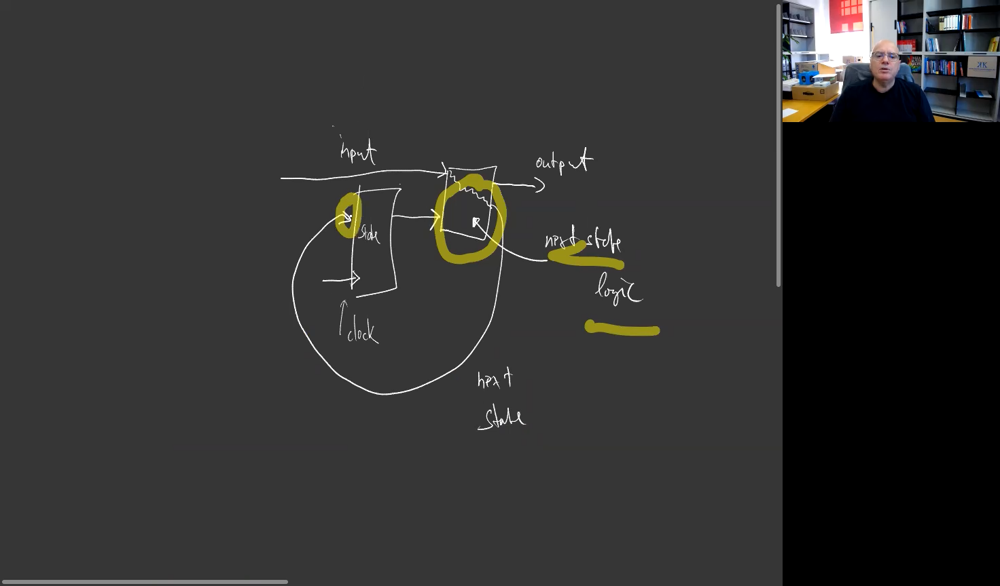
<!-- - `0:40:43`: an aunt was to to estate that is chased they change actual trickles down beard is annexed a function to this is kind of this this an abstraction you get here by having this edge triggered design alright but you see already here a very important fundamental to a pro. -->
- `0:41:03`: **problem:...** so you can make the **clock frequency only**.
- `0:41:11`: and air is supper **so high such that the clock period allows the logic like in our case the next state logic to finish it's computation and stabilize**.
- `0:41:30`: frank exactly as he can so so the point is **if you're making a clock frequency too high this clock down here would open up this input too early, then this**
- `0:41:48`: **next state logic would not be computed yet and you get strange response** we can only **then you have to slow down the clock** end and that's the point here **this of course depends on how...**.
- `0:42:03`: like **how many gates you have here** your like how much computation the **depth of this circuit here**.
<!-- - `0:42:12`: and awkward like lots of other things are which is not part of the topic of this class but if you would really want to really implement our design and processes then then that's what you would need to also traced like. -->
<!-- - `0:42:31`: one thing i just want to mention is that for now it's likely you have one output here and then this issue is like hung or ten times four times then this might actually or the produce here. -->
<!-- - `0:42:48`: for this guy here that would increase the the time here and then if it would just use it once so there's like also and then sizes of this you've been you implement these gates here with sea mosque you can also turn the knob into a once a size these are trans. -->
<!-- - `0:43:08`: justice in a certain way such that you can reduce the time here but then again this might have other effects so say any also there's like this is known that and on the physical air but like i wanted to explain your here and the principle which is clear right so he cannot you need to reduce the amount. -->
<!-- - `0:43:28`: of computation between two clock ticks. -->
<!-- - `0:43:33`: amin is if you go back to the graph you have to adjust for the slides is it how i mean the time between two crooker i mean the clock period is supposed to be the time for one instructional i'll be below the level of one thousand exactly this is what we're going to discuss. -->
<!-- - `0:43:53`: answer to the first and if you go too late at two am. -->
<!-- - `0:43:59`: to to the chip the forward you will see that in principle one instruction will be executed per clock that is of course not true and that's also what we're going to in the second half after. -->
- `0:44:16`: he didn't in this lecture today because **instructions might actually take multiple cycles** it might also be opposite so we'll see this later that you can even get **with clever like out of order technology you can even have multiple instructions finished**.
- `0:44:35`: **in one clock cycle** but if you think about the simplest kind of way of implementing of processes so for instance if the look at that and this is the processors rate then it would may be a part of the **input would be the program part of the input would be**.
- `0:44:54`: **the data** at the end and then in one clocks i picked execute one one the instruction button that's why this is a very particular question here then you need to do all the spirit create like like this complex instruction within one foc cycle and that might take too much time right because.
# ==============0:45:00==============
<!-- - `0:45:14`: we need to wait until everything in the worst-case stabilizes and then we have to. -->
- `0:45:21`: reduce the earth to the the clock frequency and to the the whole design will become slower so one **one trick we're going to learn is that the kind of splitting the work in such a way that maybe we do only half of the book train at one clock cycle but then maybe we can get a**.
- `0:45:40`: **higher throughput** so that's exactly the cradle you're going to to look at throughout this whole lecture so what you see here is his first sort of the simplest version and for the simplest version ah yes clock cycle as you said corresponds to one
- `0:45:58`: one instruction prayer but it's of course not the whole truth but that's why also do and it's what i said like i had this **five ways of measuring time. clock cycle is not one measurements** and we're going to discuss this in the second half of today's lecture and theoretical question the cia.
<!-- - `0:46:18`: yet how precise is the clock frequency and how is it general recall this is out there that this is pretty precise or did they have like a certain. -->
<!-- - `0:46:29`: then okay the the restore is it supposed to be pretty precise because they have a specific copy for generating the clocks have is like a clock generator i think is an oscillator or something and this is pretty precise however if you think maybe you could do another picture here this is awesome. -->
<!-- - `0:46:49`: part of his physical things i already explained here this part will be fair here right. -->
<!-- - `0:46:57`: and you need to put into it to get the clock to all this to do since you don't have to this is only the sort of schematic what you're really happy that you have lots of sort of different flip-flops like everywhere like the state elements which only one bit by hill horse the idea is that this whole thing your voice all state. -->
<!-- - `0:47:17`: and then of course you need to have something which distributes this clock right. -->
<!-- - `0:47:24`: and the some wires for rights will be started like the channels on the on the silicon and they also take time and you have the same issue as with his inaugurated need to make sure that you don't have too many so you might need to sort of repeat or sort of. -->
<!-- - `0:47:42`: is said of yeah and if you have a flip look very down here free then there's kind of something which causes a clock skew in whatever rain. -->
<!-- - `0:47:54`: and i but all of that is done by tourists to the it's not completely true actually so what's happened in the science is. -->
<!-- - `0:48:06`: not for a bj but for four wheel and a essex is that you're do kind of a top down design you go lay down in a level of abstraction until you hit sort of like the transistors and the routing but then at the very end made it to these effects such as discussed like hear this but there's need to distribute the clock. -->
<!-- - `0:48:26`: and to also have some some other like fame walk or whatever resizing of system sisters at you you cannot get the time you actually expected when you started from the pole case we have a feedback loop which unfortunate goes because really dance it's like if you would compile a program nowadays and then the compiler would say oh. -->
<!-- - `0:48:47`: yeah he fell and i cannot release what is to assemble instructions so please give me another empress marie and a heart of people already doing this that he could really go down to his lower level of physics and then you get maybe an issue you get he has a really long tiny pockets quiet and because of that we need to restructure the logic in that. -->
<!-- - `0:49:06`: in the end make mean you need to re be signed some parts of your pipeline and software and not that used too much to that except that what you what you saw with the example with my success of it's also very similar instead of you will really have this leaky abstraction you cannot get it as fast as possible then you need to understand. -->
<!-- - `0:49:27`: what's going on at the bottom and then change the way how you design as something like some live it up or maybe even might have been in your stretched. -->
<!-- - `0:49:38`: okay so clock is precise a principle but you have a physical effect that the clock is also just like the wire which is like like needs to connect all these so all these flip-flops then furthermore actually you will have multiple clocks when the memory system has it's own clock. -->
- `0:49:58`: and then the discussed already do **multiple clocks** on on the cheap and and then the input and output the chips hooper sort of parts of the chip you have might have blocks of will and today's circuit chip you with if yes like the range of of six or even a docent.
# ==============0:50:00==============
<!-- - `0:50:18`: sir clock sexually okay so same principle yes. -->
<!-- - `0:50:23`: but yeah there's this specific issue that it need to be stupid the clock and then there might. -->
<!-- - `0:50:30`: alright one more question clocks so in modern processes you can do something called overclocking is that mean that the time is nuts i mean that meant that the time can be optimized rate yes exactly and what's happening and that will be discussed is a little bit i think there's also the slights but i don't. -->
<!-- - `0:50:49`: thing today is that when you you can increase the clock but then you need to guarantee that the sun. -->
<!-- - `0:50:58`: and the snitching he sought is actually this is level below that of the gates on the transistors as a quads switch lever but you really take into account like the transistor switch times rain and maybe even one day the one you have revisited the the critically alike for the. -->
<!-- - `0:51:18`: optics but at the switch level rate then you will will have to have models which pretty okay if you do it like that then you will put you with more heat rate and that's than the effects in order to keep the computation. -->
<!-- - `0:51:33`: pass morning off right then you need to sort of we had this year in the apa picture here if you keep them white small enough for each gate right then you'll need to. -->
- `0:51:44`: produce more heat and this heat needs to be taken out like for those who beat their own gaming machines they know that if they increase the the frequency they put to this **over clocking then they have to add more cooling to the system**.
<!-- - `0:52:02`: okay. -->
<!-- - `0:52:07`: so i'm not sure so where we have now the half time. -->
<!-- - `0:52:15`: and question and nonsense so i will stop the the recording paused the recording for a second and then not stop sharing and pause it just hope they don't kill it. -->
<!-- - `0:52:36`: alright so now that we saw the importance of this sir. -->
<!-- - `0:52:43`: clock here and it really am. -->
<!-- - `0:52:47`: yeah so it's it's a kind of an artifact grade of all this certain implementation is done like this abstraction eg he was getting but that's what i explained at the very beginning so we have layers of layers of abstraction and here the layer is is a clock and this so soon christmas. -->
<!-- - `0:53:07`: clock based design. -->
<!-- - `0:53:12`: and i alright you're not sharing screen again sculpture thank you. -->
<!-- - `0:53:20`: i help you. -->
<!-- - `0:53:25`: i'm sharing screen again okay sub so here you can on the computer of course the cpu time but it's like the number of clock cycles time the clock cycle times i should point out. -->
- 
- `0:53:41`: at **the number of clock cycles is of course something you can actually get from the processor** are **usually processors have an instruction where you can read...** the current number of **the current clock cycle and then like it's usually sixty four bit register** and **then after you done**.
- `0:54:02`: **with a program you can also get the clock cycle and then you take the difference then that will be sort of your the number of clock cycles it took for your program**.
- 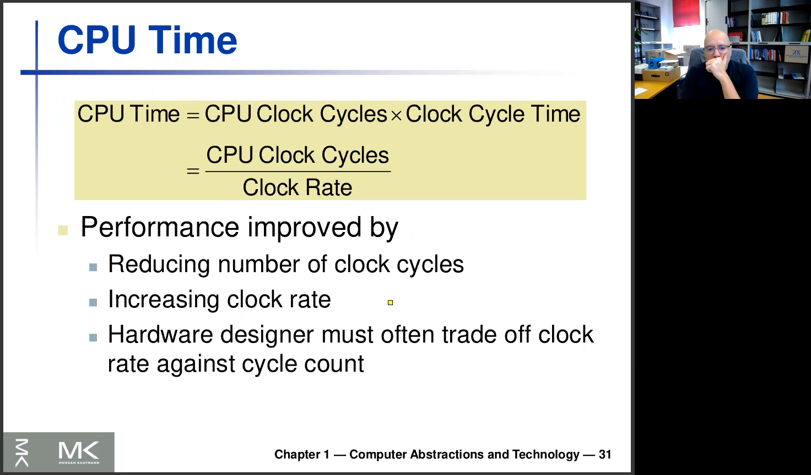
- `0:54:12`: and then the cpu time then of course is because the drop rate is is fixed and actually this is also completely true anymore **there's ways of slowing down the clock...** or as we discussed right of **intel has this thing like turbo mode...** or something he heard about tube remotely from.
- `0:54:32`: this exactly means the opposite for your **you know that like maybe there's only one thread running but it's like this matrix multiplication that needs lots of power...** so that's is what happened to my laptop right then i got the zero point eight seconds and **therefore i actually slow down all other cores which are not needed** because i'm only thing.
- `0:54:52`: matrix multiplication and **then i increase the clock frequency because i'm still can sort of keep below the temperature budget** so like the heat can still be from the chip **this one core which is running...** will not conduct **is then allowed to produce a little bit more heat than**.
# ==============0:55:00==============
- `0:55:12`: **usually** fall for already.
- `0:55:15`: but **if you ignore that...** sort of like this like yeah it's pretty like more than ten years to decide third of this **clock scaling** and then your do you compute the cpu time as the number of clock cypress times the clock cycle time like this period so before.
<!-- - `0:55:35`: between two. -->
<!-- - `0:55:37`: fuck edges. -->
<!-- - `0:55:40`: and all if you want to say the frequency so the recording the pu great but i for some reason i prefer frequency it's the latest with the ghosts of this clock cycle time i think you get the point right i think this is not that complicated. -->
<!-- - `0:55:56`: maybe i should also point out that it's some or some companies actually they they do a dual. -->
<!-- - `0:56:04`: the edge design and so unlike junta does for instance so they would have they speech some flip flops here at this part in this flip some flip-flops here and this is a kind of pipelining which we're going to discuss actually but this is like a very low level. -->
<!-- - `0:56:24`: eight and and of course they're trying to do some semi automatically these days about putting for us at the the basic the most simple notion of this is that you only have the rising edge it's called like when putting up the edge you will need to stabilise the next day logic into. -->
<!-- - `0:56:43`: incomplete mixed team. -->
<!-- - `0:56:47`: okay and in the simplest models that what i just said like a fixed clock no truck skating and and yep. -->
<!-- - `0:56:56`: only sort of rising edge synchronous design then this is your cpu time. -->
- `0:57:04`: okay now we can of course increase the clock rate this is what this fox killing that his tuba mode of into a trademark ring at an a does and you can **reduce the number of clock cycles...** and so the question is how can you do that well.
- `0:57:22`: **can make instructions more complex for instance so that like one instruction does much more work than some others** this way you decrease the number of clock cycles.
- `0:57:35`: on end and this is a tradeoff and yes it is a **risc five** of what we saw actually goes into this direction of of **making things simple** and and **making jops a little bit more complicated** in the sense that **you might need multiple instructions** but **because of that**.
- `0:57:55`: **the individual instruction is simpler to implement and therefore you can increase the clock rate** so this is kind of what we're going to look at now.
<!-- - `0:58:09`: and yet and yet you continue to sutton some of these computations but i think at least for me it's pretty obviously you have clock rates and clock cyclists and then you compare how much or how fast something is and and we're going to do this. -->
- 
- `0:58:28`: indeed **the exercises** is next.
<!-- - `0:58:32`: week in details so i think this is something one really has to sort of stone into some computations and it's perfect for for the exercise so i'm not going to to do that now. -->
<!-- - `0:58:45`: what i want to do the show also is this in instruction count and dislike of the instructions but as i said there was this excellent question before whether each seven o'clock cycle would it would execute one instruction is of course natural because. -->
- 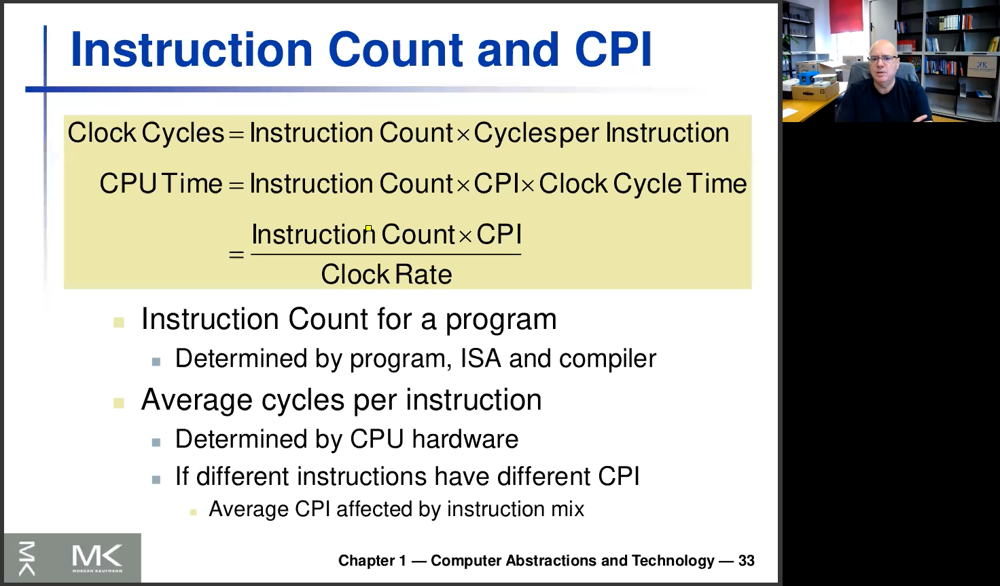
<!-- - `0:59:06`: b. -->
- `0:59:08`: if you're a for instance doing pipelining then it might be actually the case that you're you're having **for each pipelines state..** just be going to see we have like **...one clock cycle** like to execute this pipeline stitch but **only if you run through all the steps in the pipeline**.
- `0:59:27`: **you finsih one instruction** and that can actually be likely that i think the maximum washing up with pentium four which was around twenty stages rates vs twenty clock cycles until one instructions change.
- `0:59:43`: **however if you keep this pipeline busy you will actually still produce like one finished instruction per clock cycle because it just lots of overlapped**.
<!-- - `0:59:53`: and. -->
- `0:59:55`: and in addition it might be that you have for you split the work even inside of the process or not like at the core level but inside of the process i have some **parallelization...** to remember this nice pictogram we had with the airplane ride and a valuable set of fences to do additional payroll.
# ==============1:00:00==============
- `1:00:15`: it could be done in one clock cycle and if you just had to to efficient operations in like an hour metrics example of a method that wasn't multiplication and addition so many of you can actually do them in parallel and **then for both of them one will only need one clock cycle** so **this is why there's not a direct correspondence between clock**.
- `1:00:36`: **and then instruction**.
- `1:00:40`: but of course like **on the very high level we can compute maybe an average number of cycles per instruction** that we take our program the measure like how many cycles would we take the instructional average like one point four for instance and then multiply this by how many sparks.
<!-- - `1:01:00`: his behalf and then we get the the clock cycles and by that begin again get the cpu time but no depending on the number of instructions we have. -->
<!-- - `1:01:11`: and the reason i'm showing the movie this is because this is what they actually use in in in this a benchmark the spec benchmarks between to the discuss now and. -->
<!-- - `1:01:24`: of course. -->
- `1:01:26`: **what kind of instruction and cycles per instruction depends on the program then** because **for for different programs you might have more instruction that take long time like for instance multiplication might take a long time** or like lots of **memory accesses takes a long time, that's actually the worst thing** so this is why i showed you before or.
<!-- - `1:01:46`: it is a memes in this case line of excess cones because that's the. -->
<!-- - `1:01:52`: one of the sort of bottlenecks the memory exists but there may be other computations the memory is not the bottleneck but the sort of extra maybe like floating point computation. -->
<!-- - `1:02:06`: that's probably true for this matrix but a completely so loose look at that later. -->
- `1:02:12`: **so different instructions have different clocks per instructions and then the different programs have that too** and yes lenny can do **again with this model you can come do some computations** and the various tradeoffs for so you can implement a **processor which has...**.
- 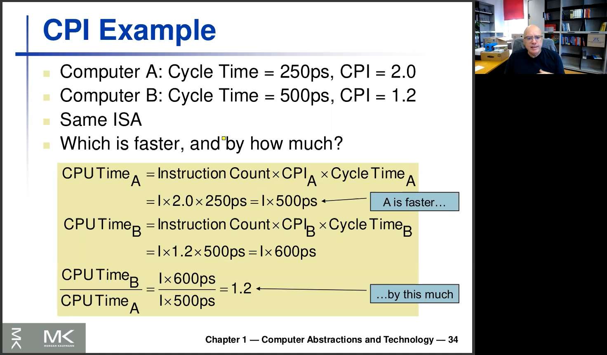
- `1:02:32`: **smaller clocks per instruction and then another one but then the clock cycle time goes up** on and that's what you see yourself in these examples and and we'll do this in the the exercises more details i think the principle should be clear.
- `1:02:53`: and yes and then of course do what you really have he says i think i hinted at that already that sort of **for different instructions...** like addition or multiplication **the average clocks per instruction are**.
- 
- `1:03:12`: **different** and that's why you made it great so you take her there maybe in this brooklyn might have like eighty percent additions and interests that this clock clocks pill addiction and then so many loads and whatever applied to the references and that's why i he has like a more precise modern of his thing of later.
- `1:03:32`: ethan and **one addition will not always take the same number of cycles** fall for very very very reasons but like the **it's way more precise as if you would just take the average clocks per instructions for all programs**.
- `1:03:53`: alright and then again we can do an example but like like such a computations and this will be best done in an **exercise** it's not really complicated it's just the weight off of seeing these tradeoffs maybe more with real numbers we're going to do this.
- 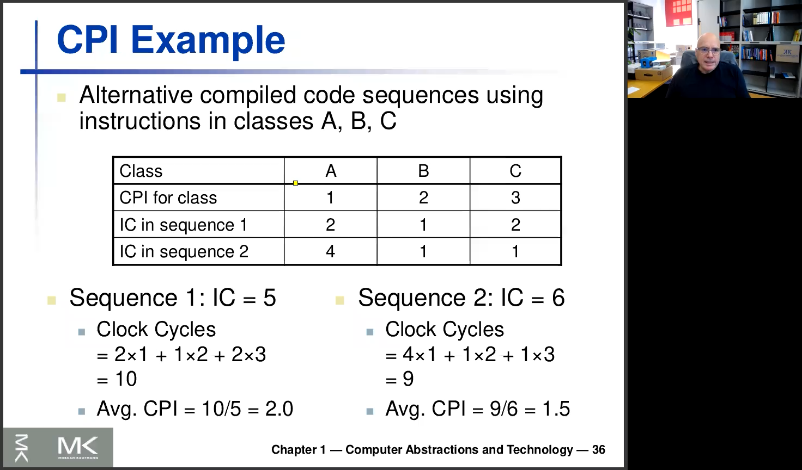
<!-- - `1:04:13`: next week on the exercise she. -->
- `1:04:16`: alright so you could do it like that so you take the instructions per program you take the o'clock cyprus banks extraction and then the **seconds per clock cycle, the clock period** in this way gives you the cpu time and of course like the algorithmic issue so i'll show you some later.
<!-- - `1:04:36`: quebec actually with this so. -->
<!-- - `1:04:39`: with his. -->
<!-- - `1:04:42`: matrix multiplication a program because that's actually not in the book but this like a very nice trick on you check the herbs and and get way better matrix multiplication then we saw already this example with the programming language bright so we were if you use python we. -->
# ==============1:05:00==============
<!-- - `1:05:01`: when he produced way more instructions because python interprets this so while it compiles into the despite quoting and interprets despite code which takes way more instructions than this compiler a business program produced by the c compiler which sort of almost close to the metal to the re processor only it. -->
- **algoritm: use better algorithm for e.g. matrix mulitpilication**
- `1:05:21`: has the necessary instructions vessels and **c: no type checking going on and so on because it's a typed language** and then of course we saw this in the compiler so much that i remember **o three...** would likely involve way more crisis **compiler optimization** in that there were two assists **reduces the instruction count** and.
- `1:05:41`: also because **it might actually use cheaper instructions the clocks per instructions** and then last not but least this is what is the core of this lecture so these cushioning some pop we will not really look much in this lecture but you need to be available anyhow.
<!-- - `1:06:00`: we will look here at the bottom at this that what you could gain by. -->
- `1:06:06`: and by by by changing or or kind of and using a different instruction set architecture so really look he and his lecture hall houses of the architecture which means should be similar **how the design of the assembler language affects then later the design of the process on which allows for optimazation**.
- 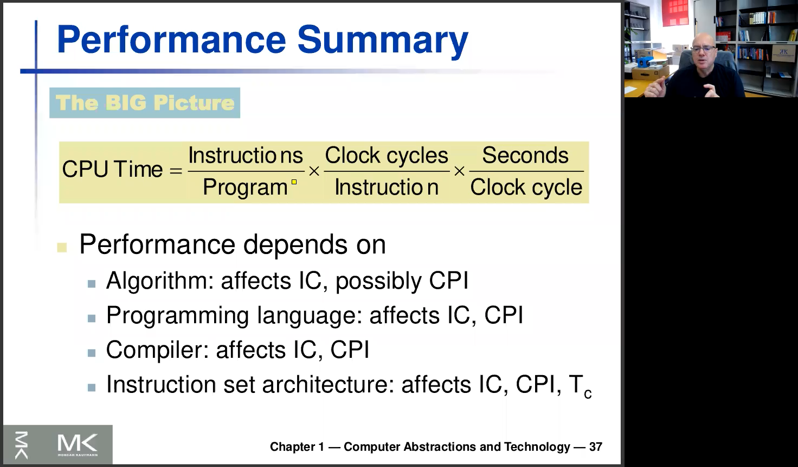
<!-- - `1:06:26`: last certain optimization which is at the core of chapter four and. -->
<!-- - `1:06:32`: and to some extent a certain sense we are optimizing here in this lecture he owns the last bullet of the instructors architecture and one that gives you. -->
<!-- - `1:06:47`: alright so here's do. -->
<!-- - `1:06:51`: powell trends i think one should switch should explain this and it explains lay curb one particular aspect which some people call it the like there was the **pile wall** in two thousand and. -->
- 
<!-- - `1:07:05`: for three of my favorite one he released and. -->
- `1:07:10`: because there's a **nice book** and the **race for a game machine** it's content books if you want to note that cohen's toronto she knew what his **yellow line...** is.
- `1:07:21`: this is when the playstation three and the xbox three sixty processes will be designed a clean austin in texas and they were both designed by either him and his book i was just mentioning like the race for a gaming mashine is.
- 
- 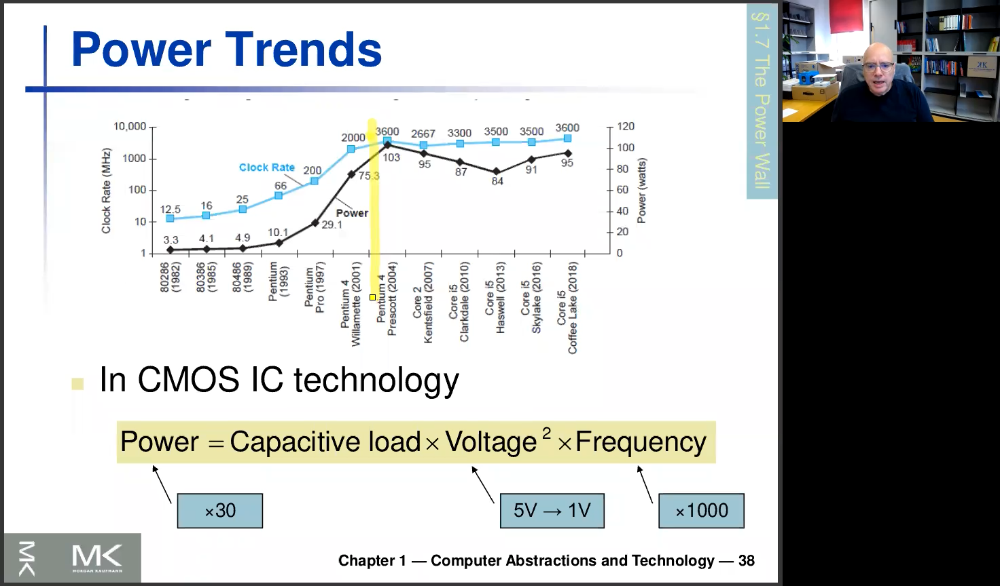
- `1:07:41`: about this trend situation that both companies like sony and microsoft i asked i be able to build a processor for them with out knowing that the other one was listening but of course competitors and during that time artist was also like when input was working on these pentium four.
- `1:08:01`: oh it was really **the time that this sort of cmos technology hit this power issue that likely there was no way to to get sort by scaling down the**.
- `1:08:18`: **the transistors and increasing the clock for instance get faster processors**.
- `1:08:24`: and **so everybody now started to have two very long pipelines** of his phantom four was the this twenty est packed them was mentioned before ending additionally **since then we are really pretty stable in the frequency** and authority to see this because this eleventh hour turrets like here i think like in this book.
- `1:08:44`: it's was said **ibm expected that this power pc in in these machines they were using would go up to even five giga house which we don't have today...** and the reason is because this would just produce **too much heat which cannot be offloaded from the chip** and.
- `1:09:04`: and another aspect which is in here but it's only a side note here a date you **could also actually dramatically decrease the power needed to run a processor by decreasing the voltage because it goes in quadratically...** but there the.
- `1:09:24`: signers like his **physical designers already hit the limit of what is doable and so it seems like we cannot go further down without...** making so **producing lots of noise, then these signals which are used in his gates are not precise enough** and he would turn down the **voltage...** so then what did she **means the difference between zeros**.
- `1:09:44`: **and ones** that are **capacitive**.
- `1:09:50`: **states** like in this scene was watching.
- `1:09:53`: okay and that's why at **around that time** so almost twenty years ago **people stopped scaling the frequency and it's only because of power we cannot produce we cannot increase the frequency more with all these transistors without producing much more heat**.
# ==============1:10:00==============
- 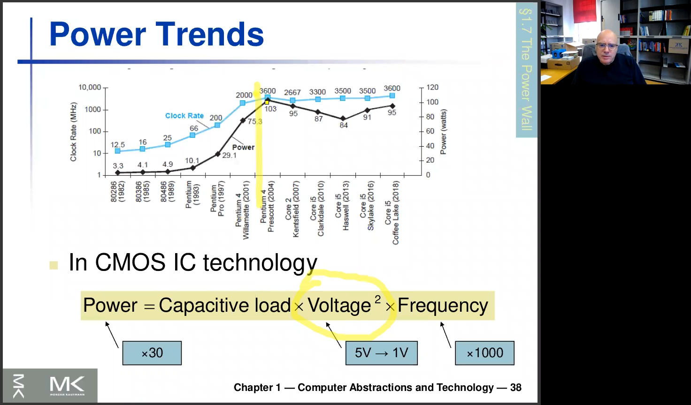
- `1:10:13`: however the the the moore's law which they removed six people because it kind of seems just to story continues partially not exponentially anymore but maybe like a pony is likely to increase every year which means we have **more and more transistors and the only way then to**.
- `1:10:33`: **to sort of stay within this power budget you have**.
- `1:10:39`: **to add more parallelism** on the chalk and on the on the on the on the on the corso so this has started to you within tulsa this is the into history **around the time when they realize this...** and this is a **core two and it**.
- `1:10:59`: **and it had mulitple cores on one die** and it continues of course nowadays behalf for lots of course like you can buy machines with sixteen was easily even as a consumer and your phones have eight cores and to.
<!-- - `1:11:19`: yep and ccfl course is something you can have for four and a silver and. -->
- `1:11:28`: by the way **also around that time the graphics cards were really like making a big impact for the games and other applications because they would really go massively towards this parallelization would have lots of cores like thousands of cores**.
- `1:11:47`: hurry and and here's an **example how you compute that** but i i think we do not even put this into the lecture because i think this is too too specific.
- 
<!-- - `1:12:00`: okay and you you kind of see em again like a entered and other processes like how much. -->
- `1:12:11`: the improvement began in the eleventh hour around that time so those are the three i mentioned before it is two processes for the gaming machines by design and since then the the the the slope here off the single thread winnipeg processor performance it's coin.
- 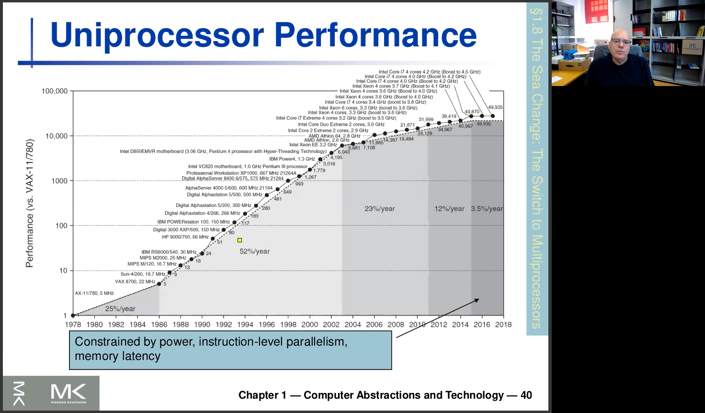
<!-- - `1:12:31`: really slowed down right so here it was. -->
<!-- - `1:12:36`: it still seems to be exponential we're not sure really have any more rights etsy really seems to like. -->
<!-- - `1:12:42`: having this shape right sorry about that shakes me to get my tablet. -->
- `1:12:48`: like here this almost looks like a straight line rights and the system **exponentially because again here we have a log scale** patio like the yeah it's going arm in and maybe it's not even a straight line anymore and then it will not be an exponential improvement anymore if you have a linear texas.
<!-- - `1:13:09`: right so i mean here it's like still up if somebody writes three point five percent per year that innocent explanation improvement like he said it would be nice to have that much interest these days on your money but it's clearly slowing down however still be getting more and more course more and more transistors. -->
<!-- - `1:13:27`: one more course so he over all the machines which could actually still continue to to improve and the reason for the improvement the most recent improvements here was i would say there's more amd machines actually so it stops it too. -->
- 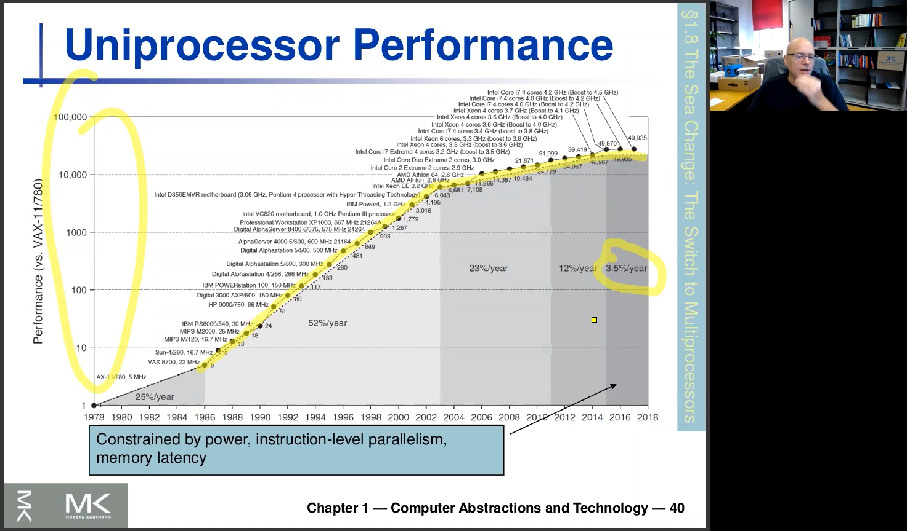
- `1:13:47`: thousand and eighteen but we actually do have quite **some improvement here from amd** and that's due but my understanding is that this is **due to the better caches and better memories** so maybe the actually sr if this continues like chump through the pain.
<!-- - `1:14:08`: empty machines these days. -->
<!-- - `1:14:11`: okay so but we have mighty processes so that's mighty force it originally was called mighty processors happened now it would say mighty course and this requires explicit parallel programming which is really a beast as i mentioned before i've been teaching this for quite some time and we'll talk about. -->
- 
<!-- - `1:14:30`: just in the last chapter of the book and also at and it's very hard to do so some people say it still requires hero programmers to really get sort of this and like mighty cause will use the pro like this mighty course in order to get them the improvements. -->
- `1:14:51`: ns and while the some of this **other parallelism we're going to discussing this lecture like pipelining and out of order** this is something which **is transparent to the programmer to get this for free** in a certain sense except again.
# ==============1:15:00==============
<!-- - `1:15:11`: have this leaky abstractions and there's one leaky abstractions which you should be aware of and we're going to discuss this later this is. -->
- `1:15:21`: and branches so practice might be mis predicted then did you have that you will fall for the reasons you learn in this lecture you will slow down your program and that's why you **should avoid cranches** you believe in going for ultimate to performance.
<!-- - `1:15:42`: now last but not least that is more on so we can relate to. -->
- 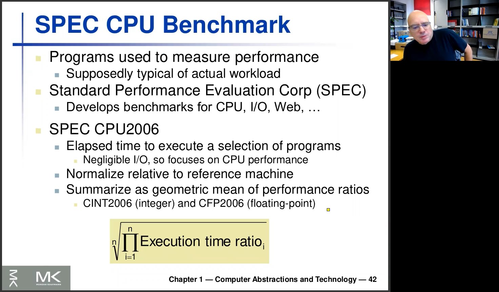
- `1:15:49`: much of exercises on this the only thing which is interesting here is an exercise in maybe also in in general here is this what you see here in the bottom and b is this this whole piece **one of the most important benchmarks in the computing industry the spec benchmark** cars xp.
<!-- - `1:16:09`: you didn't. -->
<!-- - `1:16:11`: i found so i didn't look at that much into detail before i read the book and so the type i find this quite interesting so let me explain this to you. -->
- `1:16:20`: so nd the the thing i went to was was interesting forty for the for the bin for the exercise is is this part here that **they use the geometric mean and not the arithmetic mean** and to so what's the spec benchmark okay so what they do is they take.
<!-- - `1:16:40`: so the physical its parameters to put the eater i'm sorry for my pin. -->
<!-- - `1:16:47`: so this is spic spic two thousand and seventeen and. -->
<!-- - `1:16:57`: i. -->
<!-- - `1:17:01`: a cases of hiv some soccer and. -->
- `1:17:07`: how did he do this with a big ticket sort of a **set of benchmarks which are in programs and they run some computation** and you probably are familiar with many of them said like there's a a program which is also scripting language.
<!-- - `1:17:25`: then there's like a compiler here is. -->
<!-- - `1:17:30`: route planning these creepy ben simulation that's like the four simulating networks and then this is some text parsing length the better application will be looking bitch. -->
<!-- - `1:17:45`: new compression that's like my izumi snuggling in the cloud with this recording yeah some deep learning yeah we've mentioned already if all goes to this monte carlo tree search is behind then i forgot this is not difficult because it doesn't have to be owning it but the multicolor research. -->
<!-- - `1:18:06`: then there's like some classic the search for sudoku and compression okay and then it isa would have afford this particular law and so you need to use a compiler they probably houston into the compiler like gcc whatever and then for this particular program at this particular input in. -->
<!-- - `1:18:26`: more instructions would be like the two thousand billion instructions for this perl benchmarks and so on and as you can see the kind of wanted to have the same range so they are all in this sort of thousands of billions of instructions. -->
- `1:18:41`: then you'll see it here the **clocks per instruction in this differs wastly** writes of the **perl interpreter...** is.
- `1:18:50`: that **is actually making use of his am out of order hardware quite effectively** heal even more right so he would have er you only need like zero point three clocks to finish one instruction so they can be heavily heavily paralyzed within the processor while the.
<!-- - `1:19:10`: other cases i would still have the most heavy one on on business is this town here this data compression seems to not be able to to finish instructions much python one clock cycle like. -->
<!-- - `1:19:27`: like average clock cycle every four cycles per instruction you spawn points for anyhow so you get this mix and somebody has to decide what to what to use there. -->
- `1:19:38`: then the the **clock cycle time is constant** this was one of the christian which is also not completely true on all machines so **maybe this was the machine they used in the google cloud but this is important and there's no turbo mode or whatever happening here** to you in.
<!-- - `1:19:57`: and then let's eat an actual time it took to to to run this. -->
# ==============1:20:00==============
- `1:20:03`: program on this machine okay so we're trying to measure here this processor how fast is this procession it took is this much time now what does spec two so it takes now this a **reference time...** and this is and so i had to look it up so this is usually some **some strange process**.
- `1:20:24`: for years he was always a sun machines and i think since son does not exist anymore the students use but **they still use these hardware because there's like this spark hardawre** the **spark is the latest processor which runs this sun assembler**.
<!-- - `1:20:44`: and i. -->
<!-- - `1:20:46`: then they have to be like one machine there and and also execute this the programs on that one will of course be different like a different program because the compiler will produce the central for the spike machine and it will take that much time for instance for this data compression as almost. -->
<!-- - `1:21:06`: this thing is actually faster but for other things it's like twice as as yet even almost like three times as. -->
<!-- - `1:21:15`: the fastest zoom that this entire machine masses despite the machete. -->
- `1:21:20`: okay and **then you divide these times you get then this column here at the end** okay.
<!-- - `1:21:26`: and then this gives you yet such a set but this is almost three times two point four i mean here's the biggest difference four point six one for the compiler it seems like the compilers have a faster are running on a on on into it and on the spark and a year but here for co. -->
- `1:21:46`: impression slightly the opposite okay and then and it's the ultimate thing and as this expands this former enough **you need to compute an overall number** so you want to say somehow **compared a spark machine a intel machine is two point three six faster** dependent.
<!-- - `1:22:06`: and that's computed deal with his geometric mean and. -->
- `1:22:13`: and if i still have time i will show you the sauce on the blackboard and **then you can compare two machines** so you **can also maybe runner amd machine** and **then his amd machine would get maybe a different number like four point five** and **then you want to say this amd machine**.
<!-- - `1:22:32`: is sir. -->
- `1:22:35`: since they are **is so much faster than the intel machine** and then you'll probably **want to divide this four point five at by this two point three six and then this**.
- 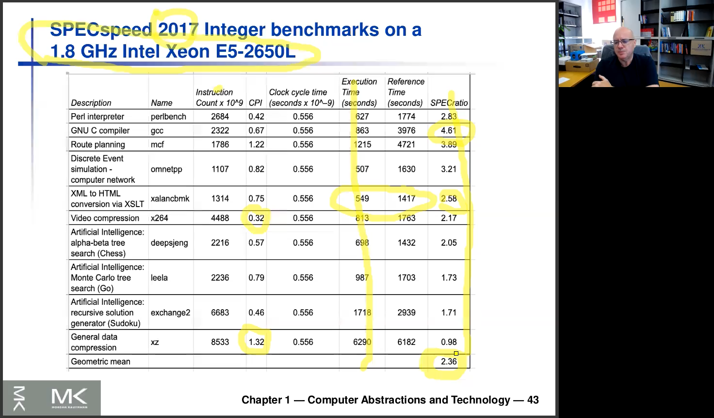
- `1:22:47`: this **vector should give you how much faster amd machine is**.
- `1:22:55`: and **for that you need to do this and geometric means because otherwise the reference machine time would actually have an influence**.
- `1:23:08`: okay so this is **there's also like a power version but i don't want i want to skip that** because.
- 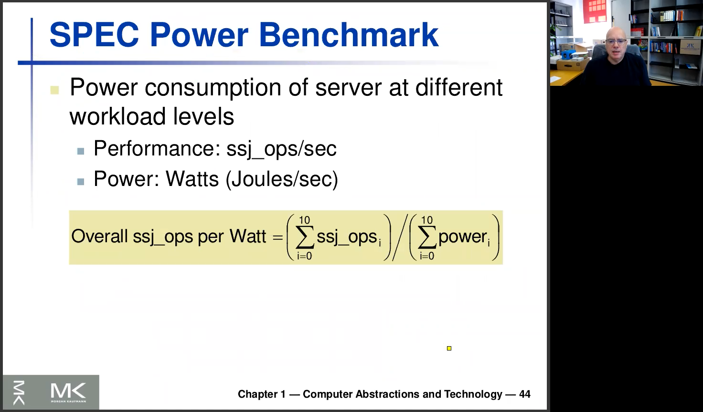
<!-- - `1:23:16`: that's something i i don't want to explain so we're missing this part on the pins fall under the law and the fallacy low low hour at either end and so i be not explain this and now may be next. -->
- 
- 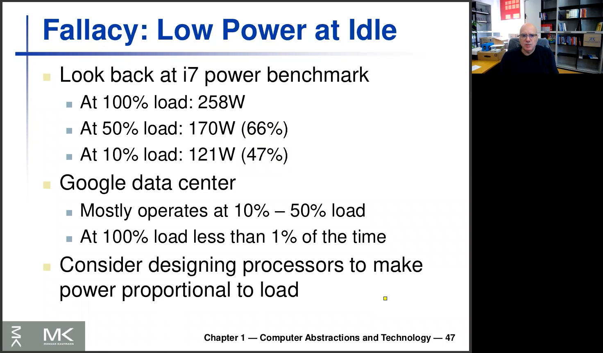
<!-- - `1:23:36`: sweet but i. -->
<!-- - `1:23:40`: so that would lead me to the end and i'm open for questions. -->
<!-- - `1:23:48`: so we already have some questioned into chance. -->
<!-- - `1:23:55`: so first question is why the geometric mean and to think of no no other mean like the arithmetic mean this is exactly something i can show you a very fast i'm still sharing right yes. -->
<!-- - `1:24:12`: so i need to have a new page so i'll do it very fast and then we could do this awesome exercise but i felt like i i'll i'll do it so if you're. -->
<!-- - `1:24:27`: i have and. -->
- `1:24:31`: since also not explained in the book so that's why this information is not by me so **let's assume...** so the first term.
<!-- - `1:24:40`: a machine like the pics s one second for the first program right so let's say compression and the as two seconds for the for the. -->
<!-- - `1:24:52`: for the second in let's say completion rate compression and compilation and the reference machine here takes all one and part two and then there's the second machine so maybe this is into a hear you're here this is interest rate then. -->
# ==============1:25:00==============
<!-- - `1:25:09`: the other one here this t one is our amd machine. -->
<!-- - `1:25:14`: okay now if you recall it would be the score of this thing would be like the view speak score would be if m m s one divided by all one times and asked to divide it by our two okay. -->
<!-- - `1:25:34`: k n and then if you want to compare it against the eight this pic of the other machine then you would get t one he might but all one. -->
<!-- - `1:25:45`: tea to be mined by party to knesset can see these guys cancelled right. -->
<!-- - `1:25:52`: he writes i would actually just get rid of the square root of the the second skier geometric means of the seconds would be kind of this this thing here goes away now if you would do the same with the arithmetic mean break you would tiff m s s one or what. -->
<!-- - `1:26:11`: our one plus. -->
<!-- - `1:26:14`: as to over rs two provided by and yet one half of that is kansas i'm not showing this or welch's to make sure you don't forget. -->
<!-- - `1:26:29`: ah right. -->
<!-- - `1:26:34`: sorry d two he might have but are too. -->
<!-- - `1:26:41`: then what you actually get here at the end is or s one or two plus s two on one divided by it or just put it wednesday at t one or two class of teeth who are are two or like. -->
- `1:26:59`: awhile and now you see there are these guys here and say **it depends on the the machine you using as comparison like in our case was the spark machine to determine this ratio** and it's like why **it's better to have this ratio where**.
- `1:27:20`: **r's go away then the ratio of arithmetic**.
- 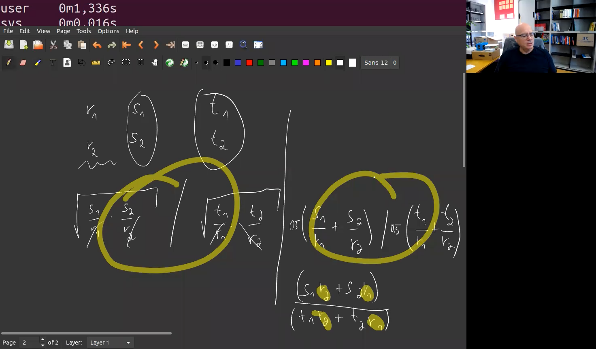
<!-- - `1:27:24`: elkins explained that's what i want to explain so we still have like maybe like one or like fourth in one equation or some. -->
<!-- - `1:27:34`: okay so then one should question so modern processes have rebel frequencies to minimise poet usage which mechanism increase and decrease the frequency internally. -->
<!-- - `1:27:47`: oh i think they only did the mechanism this is of course something operating system specific and actually if you go back to the there's like two two questions that of course like what's the hapa for doing this there today i actually don't know exactly but you have to control this is clock somehow. -->
<!-- - `1:28:07`: the clock divisions are usually by high off a frequency of this clock and then you can sort of tap only every tenth. -->
<!-- - `1:28:15`: a clock cycle you put a small counter around the clock and an only upper tennessee repeated and then speed you can generate multiple blocks from one or two layer and then of course then you tap like menu put the output that could be berry this is the hotmail pop and for the software purposes of the puzzle record way more complex. -->
<!-- - `1:28:36`: he like ben might be the ideas then you want to do it and here is this a little bit of of of that and i think there's like that also. -->
<!-- - `1:28:48`: a picture i wanted to show here which is related to this and earlier this month here. -->
<!-- - `1:28:58`: that one for the fantasy it was and while i can't find it at the moon and anyhow so this part here lets you think about like what kind of policies you'll you'll want to do that's more not for a single processor this is for the whole cloud but the similar argument. -->
<!-- - `1:29:18`: or it's like when do you want to switch to to set up like a lower frequency for instance or when to save some power and in this example for the cloud when you have sort of like go downhill by fifty percent is the sixty percent lord you don't say fifty percent. -->
<!-- - `1:29:38`: all of the power read so it's a tradeoff and the same kind of things have to be done in the uk. -->
<!-- - `1:29:46`: in the operating system so that's very complicated and to lucid even be due for instance or benchmarking force for for scientific papers be really completely switched dissolved because it's completely unclear how it really works. -->
# ==============1:30:00==============
<!-- - `1:30:02`: like what's the policy i don't think it's pretty her completely clear and it's like internal and no. -->
<!-- - `1:30:10`: the two parts okay i hope this made it a little bit clear that they're like. -->
<!-- - `1:30:16`: these two parts. -->
<!-- - `1:30:19`: alright. -->
<!-- - `1:30:21`: alright. -->
<!-- - `1:30:25`: if you see one more short we could do it otherwise i'd say we stopped for now and no one had stopped. -->
<!-- - `1:30:32`: okay then see you next week august and use the forum if you have more questions sort of as synchronicity. -->
<!-- - `1:30:43`: i. -->
<!-- - `1:30:47`: no need to find mine zoo the game. -->
<!-- - `1:30:51`: your. -->
<!-- - `1:30:59`: don't hear it. -->
<!-- - `1:31:01`: the. -->
