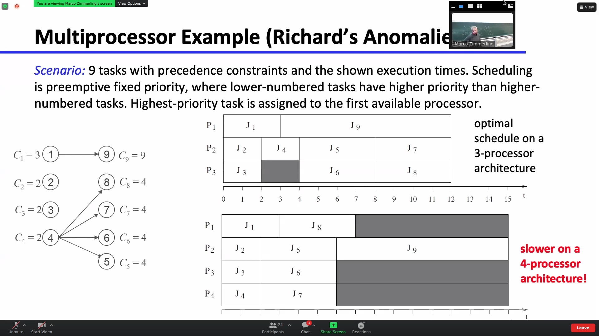

<!-- /home/areo/Videos/Einführung_in_Embedded_Systems/Introduction_to_ESE_2022_12_13_08_14_17-H__Pd4GYm6s.mp4 -->
<!-- /home/areo/Videos/Einführung_in_Embedded_Systems/_Introduction_to_ESE_2022_12_13_08_14_17-H__Pd4GYm6s_imgs -->
<!-- /home/areo/.config/mpv/mpv.conf -->
[toc]
# ==============0:00:00==============
<!-- - `00:00:00`: the. -->
<!-- - `00:00:20`: the. -->
<!-- - `00:00:40`: the. -->
<!-- - `00:01:00`: the. -->
<!-- - `00:01:20`: the. -->
<!-- - `00:01:40`: the. -->
<!-- - `00:02:02`: recording in progress the morning. -->
<!-- - `00:02:11`: the welcome to the east a lecturer isn't embedded systems will finish a rhythm scheduling today and start with the ship's owner shared shared resources. -->
<!-- - `00:02:24`: the brief announcement next week i can only give the lecture virtually on soon i cannot be here in cyborg next week. -->
<!-- - `00:02:35`: so i will post the same link on an alias. -->
<!-- - `00:02:39`: next monday at the latest one. -->
<!-- - `00:02:43`: and exercises and i had a chat with the the tutors and they reported that there's very little time to or there's not enough time to discuss the solutions and also go through the task of the next exercise sheet so we will no longer introduce the next exercise. -->
<!-- - `00:03:03`: sheet but we will of course. -->
<!-- - `00:03:05`: go through the the solutions and you can you can ask questions. -->
<!-- - `00:03:10`: also we had to look at the overall schedule and it just makes more sense to not have an exercise today but rather shifted to next week and i posted this analysis last night and was on the forum. -->
<!-- - `00:03:23`: i saw no exercise today and next we will discuss the solutions of the fourth exercise sheet and to solve these exercises are some of the tasks on the fourth exercise sheet you need the material that i'm only going to present today so yeah. -->
<!-- - `00:03:41`: right so that's the plan for for next week so next week tuesday morning lecture only on zoom but the exercise of course will take place in presence with the usual recording an online stream in the afternoon next week. -->
<!-- - `00:03:56`: okay so so much about organization we still have to finish one chapter on scheduling we already discussed or one lecture about a pair of class scheduling we looked at the earliest deadline you are listed and first within and without president's constraints and last week will. -->
<!-- - `00:04:16`: looked at scheduling of carrier dick tests and when the deadlines are equal to the periods. -->
<!-- - `00:04:24`: which we also called implicit deadlines looked at rate monitoring scheduling and so it is like a special case and more generally one can do deadly monotony scheduling if the deadlines are also allowed to be less than period. -->
<!-- - `00:04:38`: and of course zdf is applicable to both involve situations. -->
<!-- - `00:04:45`: grind saw the more realistic task and in actually the real embedded systems is that you have a mix of these tasks so typically you have some interrupts and. -->
<!-- - `00:04:59`: to react to external events so these are event driven and then trigger a periodic test so you you may not know when these tasks actually or when these events arrive and the stars execute but very often you also have periodic tasks to do sensing control of that are based on strictly a periodic timer. -->
# ==============0:05:00==============
<!-- - `00:05:18`: us to ensure the correctness of the system for example. -->
<!-- - `00:05:22`: so we have to deal with with mixed assets that feature both of these types of tasks. -->
<!-- - `00:05:29`: and just here for a definition and there are two subtypes are important types of a periodic task one of them is a sporadic task and the other one is is what does a film from task and a sporadic task is one where we actually can make an assumption on on the or arrival of these of these. -->
<!-- - `00:05:49`: the events. -->
<!-- - `00:05:52`: so as we said a periodic task and arrives and this was the arrival of a task they can arrive at any time. -->
<!-- - `00:06:00`: but sometimes we are lucky and can make an assumption all we know in which environment we are going to operate so we can for example say what is the minimum distance between two consecutive events as two consecutive arises of and a periodic task and if we can define. -->
<!-- - `00:06:19`: such a lower balance on the inter arrival time. -->
<!-- - `00:06:23`: or equivalently that's the sort of an upper bound on the maximum rate of task occurrence. -->
<!-- - `00:06:31`: then we can come up with an offline guarantee up to schedule such products such sporadic trust. -->
<!-- - `00:06:40`: if we are unlucky and we cannot guarantee such a lower bound on the inter arrival time then yes we can hope for is that one such a task arrives. -->
<!-- - `00:06:52`: we can check online can i schedule the corresponding computation of this task and if so i will accept the request and executed if not i will just reject it. -->
<!-- - `00:07:06`: so you are playing guarantee if you have sexual or bond if you don't have such a law boned you can just when one such a task arrives you can execute and schedule ability tests or would you answer called an online acceptance test to check if i can accept and execute this. -->
<!-- - `00:07:26`: task instance. -->
<!-- - `00:07:28`: in order to meet etc. -->
<!-- - `00:07:30`: okay so and in in general as usual if you would like to meet all the time and constraints of the very critical tasks so these could be periodic tasks with time constraints but also a priori task the timing constraints i would like to make sure that all the same constraints of these really critical tasks are being met while trying to do the best i can. -->
<!-- - `00:07:50`: then for all the remaining dust what does it mean it means that i would like to provide an small average response time for soft and real time since so i'm trying to execute them as soon as possible without any any guarantees so that's the overall of objective of these either. -->
<!-- - `00:08:10`: ribbons that we are going to look at. -->
<!-- - `00:08:14`: okay some just for completeness and brief list of assumptions we will look at only at the tasks where the deadline is equal to the period. -->
<!-- - `00:08:24`: all periodic tasks arrive at time zero. -->
<!-- - `00:08:28`: when you boot up the system rains and then things start. -->
<!-- - `00:08:34`: a periodic tests we don't know when they arrive. -->
<!-- - `00:08:40`: but we know what is the computation time of this apparent house so this is something that that you will have to know song one such a task arrive arrives you have to know what is the execution time what's the worst case execution time what we do know when they arrive and all the tasks are fully preemptive. -->
<!-- - `00:09:00`: okay so very simple affair scheme tool to schedule a periodic and a periodic classes what we already looked at some of the previous lectures called becker on scheduling. -->
<!-- - `00:09:11`: so we assumed that all periodic tests are scheduled using red monitoring scheduling. -->
<!-- - `00:09:17`: and whenever the processor has some free time it checks whether there are any a product tasks and schedules them in the background. -->
<!-- - `00:09:30`: so whenever the processor is not busy processing hyper high priority periodic task we have to meet all the all the timing constraints the process can be used to execute a periodic task so here's a very simple example we have two periodic tasks. -->
<!-- - `00:09:50`: the first one as a period of six six x ray so this is the higher priority task because it has a lower period than than the other times to talk to which has a period of ten. -->
# ==============0:10:00==============
<!-- - `00:10:03`: to write my twenty scheduling the tasks of the shortest period good sized varieties of to one has to expert. -->
<!-- - `00:10:10`: until one has an execution time of two and tofu as an execution time of force and as we said they all arrive at the same time at time zero. -->
<!-- - `00:10:20`: so of course the higher priority task is the process of the first that executes for two time units then the who gets the processor executes for. -->
<!-- - `00:10:29`: for ten minutes in the meantime and how tour and a periodic task has arrived so this is the arrival of an apiary task in here this little number this one indicates that this pass has an execution time of one time. -->
<!-- - `00:10:44`: here it has an execute a multiple times. -->
<!-- - `00:10:48`: okay now we can just check so how how does the schedule evolve so he told toi executes four four time units then at the time six when touch was finished the next the second instance of task for one has already arrived saw this task gets the processor and it executes afterwards however desert get. -->
<!-- - `00:11:08`: there's a gap of two time units between time aids and time tim and this time is now used by veterans scheduling to process this a periodic. -->
<!-- - `00:11:21`: then it continues like this here we have another arrival it could arrive later but here in this example it's it's at time twelfth and it needs to dominance to execute then one needs to look clear when is the next gap in the schedule and it is here between sixteen and eighteen which is. -->
<!-- - `00:11:38`: just sufficient to serve as a periodic task so in this way we can very easily handle both periodic and impurity tests on the advantage of this scheme is that it's simple to understand and also very easy and easy to implement what you have to do in your implementation is basically to have to. -->
<!-- - `00:11:58`: task queues one for for the periodic task. -->
<!-- - `00:12:02`: that are surfed using rate monotonic scheduling and you have another cube of the period us so when there's an event that triggers an interrupt you put the task into this queue. -->
<!-- - `00:12:14`: and it doesn't really matter in which order your he will serve these taxes could be first come first serve or whatever. -->
<!-- - `00:12:23`: right and whenever the cpu is free your check is there's something in this cure and you execute. -->
<!-- - `00:12:31`: and what is also very nice is that the scheme doesn't change at all the execution of the periodic task so it doesn't change. -->
<!-- - `00:12:39`: when these tas stardom when they finish is just when the processes feed you use it. -->
<!-- - `00:12:46`: so these are the advantages that the disadvantages is that the response time of the periodic apiary task can be extremely long so there might be very very little gaps in the schedule if you have a lot of periodic tasks executed with a high computation load you may get every hundred time units. -->
<!-- - `00:13:05`: just an example one free time unit to serve and in a periodic request so these requests may then have to wait up to one hundred time units until they are actually searched. -->
<!-- - `00:13:17`: so that's that's a disadvantage you'll have get very long response names for these events. -->
<!-- - `00:13:26`: so to improve on this. -->
<!-- - `00:13:29`: people looked at many many other schemes that were just going to look at two more of the schemes in which are also quite intuitive and simple to understand and the idea of the of the of the pointing server is essentially to define an artificial periodic task so you have your usual periodic. -->
<!-- - `00:13:48`: last in the system and we defined one more task. -->
<!-- - `00:13:53`: and when this task gets the processor the task pilots or checks whether there are any pending a paired requests and if the and if there are any pending requests and that the computation time that is allocated to this task is used to serve these air periodic. -->
<!-- - `00:14:13`: request so this is essentially what is also written year and a bit more verbose way so we introduce a special task it's called polyester task ps and the name calling just comes from the cave when this task gets the processor it pilots it checks whether there any pending a periodic requests. -->
<!-- - `00:14:33`: as in this task is scheduled or has a has a given period tears. -->
<!-- - `00:14:40`: and it has a computation time cs and this computation time series this is essentially the budget or the capacity of this server. -->
<!-- - `00:14:48`: so how much of the processing times. -->
<!-- - `00:14:52`: am i am willing to dedicate to a periodic task. -->
<!-- - `00:14:58`: okay and this this task and all the other period carcillo system are just scheduled equally using redmond and twenty schedule. -->
# ==============0:15:00==============
<!-- - `00:15:10`: and the very nice thing is that this ts the period of this falling server task can be used or can be adjusted depending on the application requirements so i may have i may want my a periodic requests my events are handled within a certain time you a time interval. -->
<!-- - `00:15:28`: on average i can choose this this period depending on this requirement. -->
<!-- - `00:15:38`: so advantages it approves average response time and disadvantages is that you may also you will you still have to wait until this server task scheduled saw let's look at an example and everything will become much more clear so it's and again we have to pay. -->
<!-- - `00:15:55`: great task now a slightly different parameter sought to task to one as an execution time of one and a period of four. -->
<!-- - `00:16:03`: and to tour and executing him have for too little longer and. -->
<!-- - `00:16:09`: a period of six sought to once again our highest priority task and now we introduce one more period task our polling silver task yes and we assign it a budget or computation time of two end a period of five. -->
<!-- - `00:16:29`: so when you just look at at the period one has four to two her six and this peninsula has has five so this p s has has an intermediate priority and it has an intimate so it has a lower priority than to one but it has a higher priority than top two. -->
<!-- - `00:16:46`: and this task is now scheduled so all these these three tasks for one to two and this one ps task on our scheduled using rate monotonic scheduling. -->
<!-- - `00:16:57`: all this task arrive at time zero as we said in the beginning. -->
<!-- - `00:17:02`: and which one gets the processor the highest priority task and this is in this case to one because it has the lord's appearance or to one executes afterwards the peninsula task is to process them but here at this point in time no if a periodic requests have arrived saw the tire. -->
<!-- - `00:17:22`: task just suspends itself and says oh okay i don't have anything to do. -->
<!-- - `00:17:27`: please use the cpu for the other periodic task so this is what happens here at time one. -->
<!-- - `00:17:34`: it could execute for two time units but it says no i'm not going to execute because there are no pending there no. -->
<!-- - `00:17:43`: a periodic task spin and therefore to to get the process and executes. -->
<!-- - `00:17:50`: now we have an arrival here of a periodic requests with the computational demand of two timers. -->
<!-- - `00:17:59`: but. -->
<!-- - `00:18:04`: this one here. -->
<!-- - `00:18:07`: needs to execute first. -->
<!-- - `00:18:12`: and no it is here we have the arrival of the second insert of taiwan. -->
<!-- - `00:18:19`: and then here the second instance of the pulling to the task arrives so here at at this point in time the cpu is dedicated to this bs task. -->
<!-- - `00:18:30`: and now it sees okay i need to execute something for two time units so it does exactly this it uses all it's capacity to serve the pending a product request. -->
<!-- - `00:18:45`: right and then the whole thing here a continuous year we have a new arrival. -->
<!-- - `00:18:51`: and this actually leads to him too in preemption it leads to an unknown this one vessel it does when listening to a branch near we have a preemption because the one preamps to two and afterwards. -->
<!-- - `00:19:04`: this one here gets again the processor and be served as a project request. -->
<!-- - `00:19:10`: again here note that this a periodic request only has a computation and demand of one time and so the cpu executes here at this point in time for one time unit. -->
<!-- - `00:19:22`: to serve as a periodic request but afterwards it says i'm done with the processing and it yep. -->
<!-- - `00:19:34`: all. -->
<!-- - `00:19:35`: the us was. -->
<!-- - `00:19:47`: which a periodic request. -->
<!-- - `00:19:52`: this one here this morning. -->
# ==============0:20:00==============
<!-- - `00:20:04`: oh yeah but it is only served here when this parody task that the p s task is again activated. -->
<!-- - `00:20:14`: this. -->
<!-- - `00:20:15`: this task here at the bottom this is our our server task and it is activated with a period of fire. -->
<!-- - `00:20:27`: so this a product request definitely has to wait until the task is again inserted into the reticule and it gets the processor then it is ok i have something to execute. -->
<!-- - `00:20:44`: yes in this task of course can also be interrupted so this is what i wanted to say so here at this point in time there's another pending request this server task gets the processor it starts to execute this a product request with a demand of two time units but right in the middle the higher priority task to one is again activate. -->
<!-- - `00:21:03`: it's sort preempts this ps task. -->
<!-- - `00:21:06`: execute someone and then only after once you can finish. -->
<!-- - `00:21:11`: okay so this is the the polling server so as you can see it improve it i think if you think about it the more you can see that this will definitely improve the average response time compared to baker on scheduling we now have this t as parameter to take into account all application requirements but we still have. -->
<!-- - `00:21:30`: to wait here this request here that arrives still has to wait until. -->
<!-- - `00:21:38`: there's plenty of us actually. -->
<!-- - `00:21:41`: is activated activated again. -->
<!-- - `00:21:44`: in terms of scheduled ability analysis when you'll remember we had such a such a formula and an efficient skating ability test for our him and this can be straightforward the extended so we now have one more task so instead of interest we have endless one task. -->
<!-- - `00:22:01`: which is just plucked into the right side of this of this formula and here on the left side we have a have a higher utilization so this is the utilization of our normal periodic task and we just have to add dear processor utilization of the server task. -->
<!-- - `00:22:17`: so yeah this way we get one sufficient skill independent test. -->
<!-- - `00:22:25`: okay so. -->
<!-- - `00:22:29`: this was about and now let's let's round it let's get get to this one this point that we may have a firm task. -->
<!-- - `00:22:48`: so at some point in time some a parodic request arrives and we now need to check online at this time instance where we can accept what i have to reject this apparently quick request and we have to rejected if we cannot schedule. -->
<!-- - `00:23:04`: the computation of this task within within it's deadline. -->
<!-- - `00:23:09`: and when can we actually accept such a such a task warrior what is the schedule ability or condition and if we assume that the that that the computation time of this a priority request year which is called c a on on the slayer so if if this computation time. -->
<!-- - `00:23:29`: is less than or equal to the budget of the server. -->
<!-- - `00:23:33`: which means that once the. -->
<!-- - `00:23:37`: so this year means so. -->
<!-- - `00:23:41`: this means that once the the task is the processor it can it can completely if serve it can fully serve the periodic requests within one activation. -->
<!-- - `00:23:54`: then it is it is very clear that in the worst case. -->
<!-- - `00:24:00`: one of her daughters. -->
<!-- - `00:24:05`: so let's say this is the periodic our periodic server task ps rain. -->
<!-- - `00:24:12`: and in the worst case this a periodic request year arrives just after this this peninsula task. -->
<!-- - `00:24:23`: it has suspended itself man so here the task gets to cpu the server task but it sees there is no air periodic requests pending so just freeze freeze the procession. -->
<!-- - `00:24:37`: remember this this happened here attainments this one. -->
<!-- - `00:24:42`: so it says i don't have anything to execute and shortly afterwards this a periodic request arrives then we have to wait. -->
<!-- - `00:24:53`: for one entire period of this summer task. -->
<!-- - `00:24:59`: until it can be served. -->
# ==============0:25:00==============
<!-- - `00:25:02`: and in the worst case it sir. -->
<!-- - `00:25:06`: in in the worst case we have to. -->
<!-- - `00:25:10`: yeah we have to wait for godot know exactly when it's actually going to execute so in the worst case it just executes you. -->
<!-- - `00:25:18`: so it it it's another. -->
<!-- - `00:25:22`: yes. -->
<!-- - `00:25:25`: right so so this this polling center task could be delayed or blocked. -->
<!-- - `00:25:29`: by some a higher priority task and it's blocked unto him. -->
<!-- - `00:25:38`: saw in the worst case it can take this along with her. -->
<!-- - `00:25:49`: and therefore the skating ability is guaranteed if this condition is holds close to the deadline is less than or equal. -->
<!-- - `00:25:57`: so if the deadline is sometime here after tunes. -->
<!-- - `00:26:11`: then i can execute. -->
<!-- - `00:26:14`: this or surface a periodic requests within the venus timing string. -->
<!-- - `00:26:19`: now here is slightly more complex formula if the computation time of this a periodic request is higher than the silver budget. -->
<!-- - `00:26:29`: which means i need multiple instances of the silver task to fully serve the impurity request in this case i still need to wait in the worst case one entire period but then i need multiple instances of the tasks. -->
<!-- - `00:26:46`: who serve one parent request. -->
<!-- - `00:26:50`: and how many instances of this tasks of it as anita can be convoluted can be computed like this see a debate in the ceiling. -->
<!-- - `00:27:00`: times the period of the task. -->
<!-- - `00:27:06`: and again this is only as sufficient and i will add this to the science it's only a sufficient skating ability condition because you don't know when exactly it's going to be solved. -->
<!-- - `00:27:17`: okay so this was so just to recap. -->
<!-- - `00:27:22`: we introduced an artificial periodic task with a given budget and period that serves a periodic requests when something has been so this is one way to do it and to reduce the. -->
<!-- - `00:27:37`: average response time but as we said in the worst case you still have to wait quite some time until. -->
<!-- - `00:27:45`: these requests i actually served. -->
<!-- - `00:27:49`: and there's nowhere the last item that we are going to look at is called total bandwidth server and in one sentence the main goal or idea of this algorithm is stood one is to dedicate the the processor or like the full bandwidth of the server to the processor immediately off. -->
<!-- - `00:28:08`: after the arrival of such an impurity request saw salih you're you're trying to serve this a periodic request as soon as possible so you need you don't have to wait until the year you're trying to executed as soon as possible so that is the very high level idea of this total. -->
<!-- - `00:28:29`: bandwidth so and it's called totaled and the surfer because you are trying to give the total denver the full capacity of this of the server of the server task tool to the a periodic request. -->
<!-- - `00:28:42`: and here we are not no longer looking at red monotony scattered them we are looking at cdf so tasks are being scheduled using edi ef and when in a periodic request arrives when the cave impurity can request arise we assign it. -->
<!-- - `00:29:00`: a certain deadline and the stair landing is computed using this this former i will explain the formula later. -->
<!-- - `00:29:11`: so whenever such a request arrives here let's start over from the menu. -->
<!-- - `00:29:27`: requests arise when a certain computation time. -->
<!-- - `00:29:31`: see snake hair. -->
<!-- - `00:29:34`: ck suitcase could get some sleep. -->
<!-- - `00:29:38`: and then we compute. -->
<!-- - `00:29:42`: what should be the absolute death deadline of this ask using the formula. -->
<!-- - `00:29:52`: and this request is then inserted into the ridicule like any other task in the process of schedules distance using the earliest loafers to either of them. -->
# ==============0:30:00==============
<!-- - `00:30:10`: again now instead of having a sort of server budget. -->
<!-- - `00:30:16`: oh which was crunchier we called it a t tier people what was see us right see us here we are soldiers was like an absolute number antagonists you we have utilization factor. -->
<!-- - `00:30:30`: a fraction of processor time that is. -->
<!-- - `00:30:34`: available for for serving a product has caught us. -->
<!-- - `00:30:39`: okay so that's basically all or request the rice you compute the deadline on online on the flyer and then the task is handled like any other task in the system using alias. -->
<!-- - `00:30:56`: yeah and this this can be easily implemented with very low overhead and yup it's sort of tries to serve these a product requests or is it sort of leads to the fact that this a product requests are served as soon as possible and it can massively reduce the average response time that's that. -->
<!-- - `00:31:13`: dear that's the main advantage so let's let's look at a concrete example so we have two periodic tasks to one in toronto. -->
<!-- - `00:31:23`: computation time was three and a period of six. -->
<!-- - `00:31:27`: and here at toto as a computation time of two and a period of it right and here we have our a a priority request. -->
<!-- - `00:31:39`: initially i saw which task is the process of first year it's the the task with the with the earliest deadline so this is how one so to one gets the process at time zero and it executes. -->
<!-- - `00:31:56`: afterwards know at time time three we have the arrival of an apiary request and it has a computation nil demand of one time units or now at time three we have to compute the the deadline. -->
<!-- - `00:32:10`: the formula was the maximum of the year. -->
<!-- - `00:32:15`: deadline of the period instance of the previous a periodic request and the release time of the periodic request. -->
<!-- - `00:32:27`: saw maximum between this or initially it is zero so this this one is serious so you just take the maximum of zero and the arrival time of a periodic request so we have to take the maximum of zero and three. -->
<!-- - `00:32:41`: it's just just free. -->
<!-- - `00:32:56`: and then the formula says it's the computational demand of the year or a product request divided by the server utilization your server utilization factor of of the server so this is see one. -->
<!-- - `00:33:12`: so it's one divided by zero point two five. -->
<!-- - `00:33:16`: so zero point two five years is near the bandwidth that we are willing to. -->
<!-- - `00:33:22`: dedicate to to the soul. -->
<!-- - `00:33:26`: and this of course is three plus four saw. -->
<!-- - `00:33:32`: the deadline of that we compute for for the first a periodic requests the sentiment. -->
<!-- - `00:33:39`: and because this deadline is earlier than the deadline of total. -->
<!-- - `00:33:45`: the cpu is immediately dedicated to this a periodic request. -->
<!-- - `00:33:53`: and only afterwards it executes toto. -->
<!-- - `00:33:56`: sure you can always ask. -->
<!-- - `00:34:07`: and it's here written on on the first sled so on. -->
<!-- - `00:34:11`: so that's that's the general formula and by definition the zero is zero. -->
<!-- - `00:34:20`: and if we want to compute d one. -->
<!-- - `00:34:25`: so it's it's a dk is a d of d it's red. -->
<!-- - `00:34:33`: so it's that stood another example for us or for the second arrival yet it's a computationally mind of two swords two divided by zero point two five and again we have to take so now we can look at it you have to take the maximum. -->
<!-- - `00:34:48`: the maximum between the arrival time of the of the periodic request and the previous deadline so which one comes later and of course again it's the arrival time is later it's it's now it's nine grand. -->
# ==============0:35:00==============
<!-- - `00:35:02`: right right. -->
<!-- - `00:35:04`: so it is a nine plus plus eight it's two divided by one fourth thoughts. -->
<!-- - `00:35:11`: at seventeen. -->
<!-- - `00:35:17`: and then you just yeah i mean to to see when this is actually surfed you'll just have to look at the df saw which task has the earliest deadline and you would see that it's only on yourself here and here let's look at this instance and some bit bit more interesting. -->
<!-- - `00:35:34`: it arrives at time fourteen and again we have to town take the maximum between the arrival time and the deadline of the previous previous. -->
<!-- - `00:35:46`: instance. -->
<!-- - `00:35:48`: so which one is is greater it is now dear previous deadline is no greater so here we have seventeen plus. -->
<!-- - `00:35:58`: four is twenty one. -->
<!-- - `00:36:01`: so for because again we have a computation of demand of one. -->
<!-- - `00:36:08`: divided by zero points now. -->
<!-- - `00:36:12`: sport. -->
<!-- - `00:36:16`: not that. -->
<!-- - `00:36:19`: not that difficult i think yeah so to rubber rubber neat and and and. -->
<!-- - `00:36:25`: and idea i think. -->
<!-- - `00:36:28`: fucking. -->
<!-- - `00:36:31`: right so now you can also understand the advantage because it's really shown in the example on that the toilet of the server is immediately assigned to it whenever possible so here it is really immediately assigned you it has to wait slightly red and then it's again served here it's it's also has a very small awaiting. -->
<!-- - `00:36:50`: time until it's actually soft saw it on average reduces the response there. -->
<!-- - `00:36:56`: for a periodic request. -->
<!-- - `00:37:00`: yeah and i wanted to say a few words about the formula but i think i'm going to skip it for a forum for timing reasons. -->
<!-- - `00:37:09`: where does this where where does this formula come from. -->
<!-- - `00:37:24`: very briefly. -->
<!-- - `00:37:29`: let's say this is the deadline of the previous task ends of the previous paragraph the students then then of the next one. -->
<!-- - `00:37:39`: then the. -->
<!-- - `00:37:41`: the. -->
<!-- - `00:37:43`: time the processor is dedicated to serving this request here somewhere in the minutes. -->
<!-- - `00:37:52`: must be smaller than the. -->
<!-- - `00:37:55`: then the budget then the server utilization. -->
<!-- - `00:38:00`: saw. -->
<!-- - `00:38:02`: just him. -->
<!-- - `00:38:04`: so now we are going to compute the length of this interval dk when his detainment dk manners once so that's the length of his insulin divided by how much time we actually need to need to execute. -->
<!-- - `00:38:19`: in this in order to be a feasible schedule must be less than or equal to the fraction that that we. -->
<!-- - `00:38:28`: the portion of processor time that the gift talk to the server. -->
<!-- - `00:38:33`: and if we. -->
<!-- - `00:38:35`: want to maximize this we just use equality. -->
<!-- - `00:38:40`: to give it the total bandwidth. -->
<!-- - `00:38:46`: and all you can do something simple. -->
<!-- - `00:38:51`: calculations here you get to this form an anti clean minus one ckd made by the summer budget so that that's already very very similar tool to this formula here and now you can just notice that the next task instance may not arrive. -->
<!-- - `00:39:09`: five immediately after saw the arrival may not be immediately or at right at this at this deadline it could also be a little bit later. -->
<!-- - `00:39:20`: at time arcade. -->
<!-- - `00:39:23`: and this is why we then take the maximum here so we take the later one. -->
<!-- - `00:39:28`: in order to assign the full bandwidth to the sun. -->
<!-- - `00:39:32`: to the server. -->
<!-- - `00:39:36`: okay so that's that's just you just just the intuition and the scalability test test this is also very straightforward extension of the necessary and sufficient scalability test with a head for a df and implicit deadlines or this only holds when the deadlines are equal to an appearance which is an assumption. -->
<!-- - `00:39:54`: we make here and yeah just that the the portion of processing time they'd be assigned to two serving parodic task and plaster fraction of processing time that be assigned to the server must be less than or equal to one and if this is satisfy them stephanie. -->
# ==============0:40:00==============
<!-- - `00:40:14`: it's canada. -->
<!-- - `00:40:17`: okay so this concludes the long chapter on real time real time scheduling and there are plenty of tasks on the next exercise sheet on the on the fourth one only some of them are sort of. -->
<!-- - `00:40:33`: mandatory there are several optional ones and but i would recommend tool to look at them especially before the exam just to just to practice a bit more. -->
- 
<!-- - `00:40:47`: okay. -->
<!-- - `00:40:48`: sort of. -->
<!-- - `00:40:50`: at the very beginning of the year real time scheduling chapter we looked at we had timing constraints then we had these presidents constraints and we had a resource constraints. -->
<!-- - `00:41:02`: and now we're essentially talking about resource constraints so of course you'll have to as a task have to use some resources and very often might have noticed nieto the same reasons very simple example is the cpu. -->
- 
- 
<!-- - `00:41:22`: and there could be certain data structures certain memory area species peripheral devices so these are all resources that may be shared across multiple. -->
<!-- - `00:41:34`: toss a periodical curtis and very often and these resources can become can end up in an inconsistent state when medical tasks are operating on them in and bury unc an uncontrolled way at the same time. -->
<!-- - `00:41:53`: so when pass may start to and. -->
<!-- - `00:41:58`: modify some entries in a data structure then another takes over and it's a complete mess saw what you know also from other lectures i think operating systems and so on that one would like to earn. -->
<!-- - `00:42:13`: using mutual exclusion i saw only a give make sure that only one task operates on a shared resource at any given time and you want to or have to guarantee this. -->
<!-- - `00:42:35`: one way is tour. -->
<!-- - `00:42:38`: very simple but also rather stupid way is to just this allow any preemption or disable interrupts then you can be sure that you will never be interrupted or was somebody else jumps in and takes over. -->
<!-- - `00:42:52`: but they are much more elaborate conceptions such as semaphores or utexas that can be used talk to it chieftains. -->
<!-- - `00:43:03`: so when for example the currently running task tries to access a shared resource an exclusive resource that is secured or locked by a semaphore. -->
<!-- - `00:43:15`: and the semaphore is already taken by by it and another task then this task will be will be blocked solid this tasker switches from running into the weight state and it waits. -->
<!-- - `00:43:26`: it is blocked until the semaphore is again released. -->
<!-- - `00:43:32`: and when this happens. -->
<!-- - `00:43:35`: the task in us again the the ridicule and then it can try to acquire the semaphore and excess then shed research. -->
- 
<!-- - `00:43:47`: so in more general terms when you have a shared shared resource in arcade and you have to toss then each of these resources resources must be secured by a dedicated semaphore escape. -->
<!-- - `00:44:01`: and if before. -->
<!-- - `00:44:04`: one of the tasks can access or use the resource it has to acquire the semaphore using weight so it sort of executes this this made primitive weight as k to signal hey i want to access the resource and when it gets to acquire the the the semaphore it can use the resource and wanted. -->
<!-- - `00:44:24`: finished using the resource it executes the signal primitive here to give the similar phobic. -->
<!-- - `00:44:34`: in this way you are sort of in under these critical sections where you can be sure that you have you as a task having exclusive resource. -->
<!-- - `00:44:42`: exclusive access to to the resource. -->
<!-- - `00:44:47`: and what is written here below is what i what i already own or he said before so when run it as executes the weight primitive on the locked semaphore saw some other task is already working on the resource then it enters the wasted until another task executes the signal print. -->
# ==============0:45:00==============
<!-- - `00:45:05`: and when it has leaves the waiting state it doesn't go into the running state so it doesn't go from waiting to ram it it is put into the ridicule and only if it is the highest priority task at that specific time it gets again the processor it can try to get the semaphore by executing. -->
<!-- - `00:45:25`: wait primitive and then it can use. -->
<!-- - `00:45:29`: use the resource so that's like the general what like the basic mechanism when you want to protect extroverts of resources using simple forms. -->
<!-- - `00:45:42`: sure. -->
<!-- - `00:45:50`: are. -->
<!-- - `00:45:52`: you have made the task here in this example you have to task and it's just you can think of it there's now an example maybe it becomes clear when when when we go go go go for the example. -->
<!-- - `00:46:06`: saw it chester as an example of two or three slates on the free autos saw their free autos offers and primitives to disable entrance and this of course can be used to make sure that you have exclusive access to to a resource that's called task into critical then everything is this. -->
- 
<!-- - `00:46:26`: abled and you can execute but of course yours should uses very rarely and only for very short portions of your code because it will block. -->
<!-- - `00:46:37`: and yet interrupt him entrance. -->
- 
<!-- - `00:46:42`: most of sophisticated one is also in free autos you have your taxes are various special kind of semaphore and we will we will go go go for the for example let's go through the example so here you have to set the mutex so you have to semaphore and the this red ball. -->
- 
<!-- - `00:47:01`: here's a selector it it's a token and a task can only access this shared resource this is a blue star year when it has the token. -->
<!-- - `00:47:14`: so therefore this this task needs to execute semaphore for take. -->
<!-- - `00:47:18`: and since the semaphore is not yet taken it can actually get the semaphore and now it can start to access the resource now via in this example task b also wants to access this shared resource so it also executes semaphore take but of course it's already taken so therefore this task interest the. -->
<!-- - `00:47:38`: rating state so that's why it gets grey here so it is put into the waiting state it is blocked because the semaphore is already taken. -->
<!-- - `00:47:47`: then at some point as as just done it has finished an executing or using the resource so it gives back the seller for this token by executing its semi forgive so it gives us emma fullback. -->
<!-- - `00:48:02`: and this will eventually activate a task be it actually gets the semaphore and no one can. -->
<!-- - `00:48:10`: so yeah i think it's easiest to think of a semaphore using this this talking and you can only access the resource when you are the holder of this token. -->
- 
<!-- - `00:48:27`: okay that's just dumb sir howard would look like in code you have to wake and create this the semaphore. -->
<!-- - `00:48:33`: in your main program for example here two tasks are created that would like to access the same shared shared resource and before they can access the shared resource each task needs to execute semaphore take and afterwards similar forgive so this could reside in such an execution function. -->
<!-- - `00:48:53`: so this is how you could do this in free autos but there are other ways as well. -->
- 
<!-- - `00:49:01`: okay so what's what's now the problem one of the problems is with shared resources is what is called priority inversion and and why would introduce introduced the problem is unknown so let's look at a at a very concrete example again we have the same picture from before we have to talk to tasks to one into the toilet would like to use. -->
- 
<!-- - `00:49:21`: the same resource arcane. -->
<!-- - `00:49:24`: and we just assumed that a taiwan has a higher priority than the tattoo for example because it has a shorter period and preemption is a lot so what happens now when we use semaphores and let's assume that talk to two arrives before to one so it gets the process of first and normally execute. -->
<!-- - `00:49:44`: at the at some point in time here tau tool would like to exceed use use the resource saw it it executes wait. -->
<!-- - `00:49:55`: and begins to use the resource so it is inside it's critical section. -->
# ==============0:50:00==============
<!-- - `00:50:02`: and while it is inside the critical section. -->
<!-- - `00:50:06`: the the higher priority tasks are one arise so this task gets gets the process because it has the higher priority why are the other one is actually inside it's critical section. -->
<!-- - `00:50:19`: this is all science so it starts to execute and now something interesting happens here at at time one because now also taiwan would like to use the resource but of course it cannot because it cannot get get the semaphore they cannot get to get this token. -->
<!-- - `00:50:36`: and this essentially means that this task enters the waiting state. -->
<!-- - `00:50:42`: it is blocked. -->
<!-- - `00:50:45`: and the lower priority task to tool gets again the processor and can finish it's critical section and only afterwards to one can access the resource and so on. -->
<!-- - `00:50:57`: so this this blocking time here is what we want. -->
<!-- - `00:51:02`: right we don't want that to one exorcise the resource wild or two is operating on on the resource so this is a blocking time that we we we we definitely need. -->
- 
<!-- - `00:51:18`: so let's now it it's a busy slate i know but let's go through it. -->
<!-- - `00:51:25`: now let's let's say we instead of two tasks we have no three three tasks and taiwan has the highest priority of taught who has the second highest rated intermediate variety and so three has the lowest permit. -->
<!-- - `00:51:43`: and let's assume that only tall one to three are operating on a shared resource saw again two to three arrives first it gets the processor also enters it's creating a section then cohen arrives of is exactly as before. -->
<!-- - `00:52:00`: and again it is blocked because taiwan is blocked because to three has already entered the critical section it has a similar force or to one is put into the waiting state and to three. -->
<!-- - `00:52:13`: i can. -->
<!-- - `00:52:16`: resume within it's critical section. -->
<!-- - `00:52:21`: but now interestingly tattoo to no aeration. -->
<!-- - `00:52:28`: and how do definitely gets the processor because it has a higher priority and it also gets to execute for whatever computation time it needs because. -->
<!-- - `00:52:40`: it has the higher priority and it does not need to operate on the same shared resource. -->
<!-- - `00:52:47`: so now the time the tall one is blocked gets much much longer. -->
<!-- - `00:52:55`: so here the time was essentially bounded by the length of the of the critical sexual so in the worst case to one could be blocked by the length of the the critical section of the tube. -->
<!-- - `00:53:08`: but here now it is it is it in addition blocked by it by this computation time of total. -->
<!-- - `00:53:16`: now imagine that you have a fourth or fifth or sixth task with an intermediate parity that are completely unrelated which means that they don't need to access this shared resource and all these tasks can keep blocking and blocking and blocking to one because they they always get get there. -->
<!-- - `00:53:37`: get the get the processor and to three can never finish it's critical connection. -->
<!-- - `00:53:42`: so this can essentially leads to an unbounded blocking time in taiwan never gives gets the processor back. -->
<!-- - `00:53:50`: so this is a big problem and it happens and i will have a real world example later on where where this has happened. -->
<!-- - `00:54:01`: so again this blocking time here here and here this is what we need this is unavoidable so this is it a good blocking time but this blocking time here in the middle is what is what is the problem. -->
<!-- - `00:54:17`: and it can be undaunted because this time can be unbounded or there could be other tasks that keep locking and blocking and blocking poland. -->
<!-- - `00:54:26`: okay and why is it called priority inversion because if you look at at this interval tower between t three and t six. -->
<!-- - `00:54:34`: here in this interval tall three executes to two executes again tells three so all the all the tasks with a lower priority get the processor even though taiwan has the highest perhaps he saw it sort of inverted. -->
<!-- - `00:54:51`: okay so i hope that the problem is is now is now clear and again researchers have been busy for many years coming up with many different protocols called resource access protocols toward to solve this problem with different strengths and and guarantees that they can. -->
# ==============0:55:00==============
- 
<!-- - `00:55:10`: give in there are solutions for fixed priority scheduling dynamic priority scheduling and some. -->
<!-- - `00:55:17`: and we will just look at at two of them and yeah the basic idea is to basically win such such a spit when a task blocks one or more hampered the task it temporarily gets iron perigee so you're sort of trying soon as you're you're modifying the task varieties. -->
<!-- - `00:55:37`: in order to avoid such such such province and all the methods differ in the way they modifier that task narratives. -->
- 
<!-- - `00:55:49`: and. -->
<!-- - `00:55:51`: again just maybe for you after the lecture when you look at it again some assumptions that you make in the following. -->
<!-- - `00:55:58`: and most importantly is this third bullet point here so each task has a nominal priority p capital. -->
<!-- - `00:56:09`: he i it's just a prairie that is assigned to the task for example using red monotonic scheduling so based on the period you assign it a given purity but then all these other rhythms will temporarily assign tasks oh when they block when they are blocked and when they blocking some other task you will assign it. -->
<!-- - `00:56:29`: a temporary priority which is called the act of parenting and we use small p i talk to you not desperate. -->
<!-- - `00:56:39`: ok yes. -->
<!-- - `00:56:41`: so very simple scheme i dunno if it's even worth to give it a name it's called non preemptive protocols so the idea is to just to to disallow any any any preemption and how can you do this you can do this by assigning whenever. -->
- 
<!-- - `00:56:59`: a task enters a critical section you just assign it the highest priority. -->
<!-- - `00:57:05`: over. -->
<!-- - `00:57:07`: and therefore this task can never be interrupted that can never be be printed you can be sure that parity inversion will not secure. -->
<!-- - `00:57:19`: so this clearly solves the problem but it also creates an unnecessary blocking for unrelated tasks which will see them in just a minute so here again we have the exact same example from before sorry. -->
- 
<!-- - `00:57:36`: so here we are at the example where this task this task of the intermediate priority. -->
<!-- - `00:57:42`: yeah could lead to an unbounded and blocking time and now here on the right side we use this non preemptive protocol. -->
<!-- - `00:57:54`: saw here when to three enters it's critical section it gets assigned the highest priority. -->
<!-- - `00:58:03`: this means that even though healed to once and becomes active is is activated in here to talk and will never be interrupted we're just finished executing it's prettier since. -->
<!-- - `00:58:17`: so only afterwards to tool can can start to execute and he does can access the shared resource so everything's everything's fine. -->
<!-- - `00:58:26`: so the problem is clearly served so this is the advantage of this listed here but it can lead to unnecessary blocking time and this is here shown in this example so just assumed that only told to enter three of these two tasks you would like to access the shared resource. -->
- 
<!-- - `00:58:44`: one year to three he arrives that's execute he had enters it's critical section it gets the highest purity an hour a completely unrelated task to one. -->
<!-- - `00:58:56`: is activated with the highest priority and that is blocked even though it really doesn't want to access the shared reasons. -->
<!-- - `00:59:06`: yep. -->
<!-- - `00:59:16`: this leads us to a more intelligent oh way of doing it it's called the purity inheritance protocol. -->
- 
<!-- - `00:59:23`: it's a long text here and i'm i'm trying not to go through through all the texts now and just focus on on the maybe you just just go onto the examiner. -->
<!-- - `00:59:46`: it's all when when a task is activated. -->
<!-- - `00:59:51`: and it is blocked by a lower priority task. -->
<!-- - `00:59:54`: then this lower priority task. -->
<!-- - `00:59:58`: gets assigned the priority of of the of the blocked task. -->
# ==============1:00:00==============
<!-- - `01:00:06`: and. -->
<!-- - `01:00:11`: so it's now. -->
<!-- - `01:00:14`: maybe maybe we just go home and go to the example then you can look and see it. -->
- 
<!-- - `01:00:21`: so this is again our our scenario it's the same scenario that we had here and before. -->
<!-- - `01:00:29`: with three tasks and tall one to three would like to exist on the same shared resource. -->
<!-- - `01:00:40`: and. -->
<!-- - `01:00:42`: so here everything is normal. -->
<!-- - `01:00:45`: though three years into the critical section taiwan starts execute now here taiwan would like to also access the shared resource but it cannot because the three already has a symbolism. -->
<!-- - `01:00:59`: and what is happening now is that so what is so the situation now is that tall three blocks to one. -->
<!-- - `01:01:09`: because toll-free already has has a similar form. -->
<!-- - `01:01:13`: and the protocol now says that. -->
<!-- - `01:01:17`: tall three now gets gets gets the priority of tall one. -->
<!-- - `01:01:23`: so taiwan this blocked it cannot execute and therefore it transfers or transmits or now that the purity of taiwan is given two to three this is indicated here at the bottom saw initially to three has a parity of pi three and at this point. -->
<!-- - `01:01:42`: it gets assigned the nominate variety of tasks to him. -->
<!-- - `01:01:48`: so taught to three is now the task with the highest priority in the system. -->
<!-- - `01:01:55`: why does it why is it called parity inheritance particle because toth free at this point in time inherits the priority of time. -->
<!-- - `01:02:05`: okay so at time t three. -->
<!-- - `01:02:10`: tower three has the highest rating so it now continues to execute it's critical section and it has the highest priority and this means in particular that now when tower tool becomes active to kept taught how to can no longer pretend toll free. -->
<!-- - `01:02:27`: so let's go back. -->
<!-- - `01:02:31`: here went to two became active it it presented to three and we had this had this unpredictable blocking time here. -->
- 
<!-- - `01:02:42`: and this is now effectively avoided because tall three has the highest priority in the system. -->
- 
<!-- - `01:02:49`: so it just continues to execute and to the end of it's critical sexual. -->
<!-- - `01:02:56`: and then it's at this point in time it sees that it no longer blocks any other higher priority task thought it gets again it's original or nominate priority. -->
<!-- - `01:03:09`: and therefore now again till one is the task of the highest priority it gets gets the processor it acquires the similar for it can enter the critical section finished racing or the critical section and so on. -->
<!-- - `01:03:23`: thought this is an example that explains all of this i hope it's it's and we even have tumor to tumor examples let's go by example today maybe this is this is easier so. -->
<!-- - `01:03:35`: again this blocking here between t three ante for this is definitely needed because we don't want to talk to one gets to access the resource wired to three is already right but what we definitely want to avoid this is this unbound blocking and this is exactly what is happening here. -->
<!-- - `01:03:56`: because toll-free gets to execute because it has the highest priority here at this point in time we avoid this this this blocking time that we really don't want. -->
<!-- - `01:04:08`: fuck. -->
<!-- - `01:04:09`: we still get some blocking here. -->
<!-- - `01:04:12`: but it is bounded by the length of the critical section. -->
<!-- - `01:04:19`: hmm. -->
<!-- - `01:04:21`: right right so by doing this priority assignment and in inheritance we make sure that that the blocking time is really just just the minimum necessary if you want. -->
<!-- - `01:04:35`: and yeah you just have to work a little bit by yourself for these examples and also the exercise task and then you'll understand and all the all the all the rules and how it works as as explained on islam. -->
- 
- 
<!-- - `01:04:51`: so he is now a second example. -->
<!-- - `01:04:54`: again. -->
<!-- - `01:04:56`: three tas you can see the task for one operates on on the shared resource a total operates on a different resource. -->
# ==============1:05:00==============
<!-- - `01:05:07`: it's called b or abi and to three it's a really crazy task it operates on both resorts in a in a nested nested way. -->
<!-- - `01:05:18`: so. -->
<!-- - `01:05:19`: what happens you know so tall three becomes active starts to execute and it enters the critical section in order to work on an resource aid. -->
<!-- - `01:05:29`: and then nested inside this critical section as of now is really crazy it also starts to work on this other shared shared resource was a pretty complicated piece of code i guess. -->
<!-- - `01:05:43`: thirty it interrupts the processing and here at this point in time though two would also like to excess resource b. -->
<!-- - `01:05:54`: but of course it it cannot so to three or blocks total. -->
<!-- - `01:06:00`: what is now happening with the priorities now the priority of todd who is transferred or transmitted two to three to three inherits the priority of total. -->
<!-- - `01:06:14`: and this is exactly showing him saw the nominal prayers or initially the protea of tasks or three years p three it's nominal priority and yet at this point it inherits the priority of tasks thoughtful. -->
<!-- - `01:06:30`: now tossed to one arise it has a higher it has the highest protein saw it interrupts the task. -->
<!-- - `01:06:39`: it gets the processor and here now it wants to operate on resource a which is also not possible because to three has already entered this critical section. -->
<!-- - `01:06:50`: and now tasked to three inherits this parity it inherits the priority of their it and inherits the highest priority of all the tasks of the blocks. -->
<!-- - `01:07:05`: so he'll it here up to here it was only blocking taught to to saw it gets gets the priority of fast title but here it starts to also blocked our one so it inherits the priority of us to one. -->
<!-- - `01:07:19`: yeah when it gets gets to execute. -->
<!-- - `01:07:24`: and it also keeps keeps this priority even though it finishes. -->
<!-- - `01:07:29`: and is finished with with resource b because it is still blocking tossed or one which would like to access resources so he keeps the same priority afterwards it goes back and. -->
<!-- - `01:07:41`: the skin finishes. -->
<!-- - `01:07:43`: so it's a slightly more complicated complicated example where you see that it does not always come going back to the enormity of priority it can also inherit the priority of a higher to the blocks. -->
- 
<!-- - `01:08:00`: good example. -->
<!-- - `01:08:05`: what do we have you know we have that tawang is only operating on resource am to three on resource b be total was no idea nor the crazy concept that would like to access for resources. -->
<!-- - `01:08:23`: what is happening. -->
<!-- - `01:08:26`: he had enters critical section four b then to toss once. -->
<!-- - `01:08:32`: skins activated and enters his critical section on air. -->
<!-- - `01:08:38`: now because toto is a crazy task it would also like to operate on be right in the middle so here at this point in time. -->
<!-- - `01:08:46`: tall three blocks to two. -->
<!-- - `01:08:54`: right. -->
<!-- - `01:08:56`: tower three is already operating on b. -->
<!-- - `01:09:00`: and to tour here at this point in time at time t two would also like to work on b. -->
<!-- - `01:09:09`: it is it is blocked by a toll toll free because toll-free had already has the top and has to is semaphore so therefore. -->
<!-- - `01:09:17`: there are three inherits the parity of total does is shown here and it gets gets a higher priority gets a parody of task total. -->
<!-- - `01:09:27`: then everything continuous an hour to one becomes active and it's at some point in time at time t for it would like to work on resource a. -->
<!-- - `01:09:42`: but the total was already working on resources. -->
<!-- - `01:09:46`: so not now. -->
<!-- - `01:09:49`: tall one is blocked by it all too. -->
# ==============1:10:00==============
<!-- - `01:10:01`: so what is the situation at the four. -->
<!-- - `01:10:04`: eighty four we have it. -->
<!-- - `01:10:11`: our three. -->
<!-- - `01:10:13`: blocks. -->
<!-- - `01:10:16`: how to write end. -->
<!-- - `01:10:22`: through it all. -->
<!-- - `01:10:24`: blogs. -->
<!-- - `01:10:27`: one. -->
<!-- - `01:10:31`: right. -->
<!-- - `01:10:34`: so at this point in time here at t four through two inherits the purity of. -->
<!-- - `01:10:42`: owens. -->
<!-- - `01:10:44`: so the active variety of tasks to tour so this letting out the small pie is set to the nominal authority of the hostile ones. -->
<!-- - `01:10:54`: but because to two to three blocks to total. -->
<!-- - `01:11:01`: the active parity of task total. -->
<!-- - `01:11:12`: is. -->
<!-- - `01:11:14`: assigned the activity. -->
<!-- - `01:11:18`: of that total which is then equal to the nominal authority of castile once. -->
<!-- - `01:11:26`: so this is what what what what is written here again so we have this set sort of. -->
- 
<!-- - `01:11:32`: interesting blocking the tower three blocks tall tool or two blocks to one and therefore talk to three inherits the priority of hostile ones. -->
<!-- - `01:11:45`: this is also shown here so it gets gets the highest priority and this is needed if you work through other examples in order to avoid this this unbounded interference proper. -->
- 
<!-- - `01:12:00`: okay so this is this happens happens patterns are furious or these these apparently inversions are very frequent i've also seen it in my own research and kept me busy for for many days to find find the bug and but i didn't work on the mars pathfinder and. -->
<!-- - `01:12:18`: and which was like a mission in the nineties i think they sent us this robert morris and it's it's and it's and it's very sophisticated embedded system if you want. -->
<!-- - `01:12:29`: and yeah they they had some at some strange strange box in the beginning of this of this mission saw a few days into the mission nominal have started gathering in the space of begin explaining to the system receives. -->
<!-- - `01:12:45`: so it was it was constantly resetting itself and of course it could not acquire any any daytime during utah this system system resets. -->
<!-- - `01:12:57`: so they then investigated this and the suffer that was running on on the mars pathfinder was provided by the ex-works it's accompanying already mentioned this company and now look at look at sir let's look very briefly at the at the architecture of the system so this this pathfinder contains an information bar. -->
- 
<!-- - `01:13:17`: which you can think of as a shared memory area so this is like a shared shared resource that is used for passing information between different components of the spacecraft towards it some shared resource that is used to exchange data between different components and in his in the system. -->
<!-- - `01:13:38`: so now we get to look at the priorities of of the different components or the batman management task ran frequently with a high priority to move certain kinds of data in and out of the information bus access to the bus are synchronized with mutual exclusion saw exactly what we looked at so some. -->
<!-- - `01:13:55`: zen are forced to use the exact same conference sec dissect same concepts and there was one task this bus management hosted had the highest highest authority. -->
- 
<!-- - `01:14:07`: so highest priority was the retrieval of data from the shared memory from this information pass. -->
<!-- - `01:14:14`: then they also gathered some meteorites logical data. -->
<!-- - `01:14:20`: less important less frequents or pedder lower priority has had the lowest priority. -->
<!-- - `01:14:27`: and then there was also a medium priority tasks needed for communication. -->
<!-- - `01:14:34`: and if the base station on the phone. -->
<!-- - `01:14:38`: some them. -->
<!-- - `01:14:41`: with the earth i guess. -->
<!-- - `01:14:43`: so we have basically three activities a higher priority retrieve data from the shared memory medium communication task and lowest priority to collect some humidity temperature or whatever data from from months so it's all sort of them naturally given priorities depending on the urgency or importance. -->
# ==============1:15:00==============
<!-- - `01:15:03`: of these of these tas. -->
- 
<!-- - `01:15:05`: and desert as a paper that you can read and it's just some some text that i copy pasted and thought. -->
<!-- - `01:15:13`: just a bit more more details and they're very interesting pieces here so the long running communications task with this intermediate parity. -->
<!-- - `01:15:26`: so it as we said here it has the intermediate purity. -->
<!-- - `01:15:31`: this one. -->
<!-- - `01:15:32`: oregon would prevent it from running consequently preventing the blocked pass information to us from running so. -->
<!-- - `01:15:41`: if you just look at it it's exactly what we had here at the very beginning. -->
- 
<!-- - `01:15:46`: we had and we have an intermediate task within so we have a task of an intermediate charity that prevents a low priority task but this lower priority task has has already access to a shared resource and therefore keeps blocking the high-spirited so this is exactly what what has happened in this in this mission here. -->
<!-- - `01:16:06`: as explained here. -->
<!-- - `01:16:08`: in this one. -->
<!-- - `01:16:10`: on the slides and luckily they used a watchdog timer which we also discussed of your few weeks ago that would reset the processor because it saw that some task was never getting getting the process again so it was a very critical task if i used a watchdog timer to detect when it would not get the processor for some time. -->
<!-- - `01:16:30`: and this would lead to a system reset so due to the priority inversion they had the blocking and the blocking led to the watchdog timer doing the system resets. -->
- 
<!-- - `01:16:44`: yeah. -->
<!-- - `01:16:46`: they essentially solved this problem by enabling priority inheritance so this design company. -->
<!-- - `01:16:56`: i guess that's a very good job the provision for a software update and possibilities also they could update the software on this mass pathfinder and what they did in a new patch was to enable the priority inheritance which solved the problem. -->
<!-- - `01:17:18`: how to debug and embedded systems on mars is at work in general is alright while also what we discussed in the very first lectures is very very difficult. -->
<!-- - `01:17:29`: but here it's succeeded. -->
<!-- - `01:17:33`: okay so the in the last fifty minutes or would like just like to highlight if you earn an interesting anomalies that can happen. -->
- 
- 
<!-- - `01:17:44`: so let's suppose you'll ever have a real time system and you did that all the scheduling you have understood all the material in the lectures and you designed everything and it works. -->
<!-- - `01:17:56`: and now i'm giving you a new processor. -->
<!-- - `01:17:59`: just because i have a lot of money i buy a buy the latest and greatest process over from arm and and i ask you the question with real-time constraints to be satisfied i mean the process of his newer it's faster why why should they should they not be satisfied or maybe this this processor has more of course. -->
<!-- - `01:18:19`: then your old processor. -->
<!-- - `01:18:24`: and what you will learn in the next five ten minutes is that just using a better processor with more cause or faster core may lead to not meeting the ricoh ri time constraints anymore. -->
<!-- - `01:18:40`: and this is sort of not intuitive and therefore it's called a nominee instead of something that you don't expect. -->
<!-- - `01:18:46`: and this is something that i really would like you to learn in this lecture that real time is not about being fast or doing things fast real-time is really meeting meeting timing constraints and just doing something faster because you for example have a faster processor doesn't mean that you can still meet the written constraints. -->
<!-- - `01:19:05`: so in the media and if you talk to other processor processes professors in the department they may think about real time as doing things fast but that's that's not our understanding of of return. -->
<!-- - `01:19:19`: so when there are other anomalies or just look at when you look at cash's pipelines and speculative execution you have similar anomalies but we will look at some scheduling elements. -->
<!-- - `01:19:33`: just buy buy buy a few examples. -->
- 
<!-- - `01:19:36`: so here is is the first example. -->
<!-- - `01:19:39`: i. -->
<!-- - `01:19:40`: we have two tests to wanting to talk to one has ai operating. -->
<!-- - `01:19:47`: and. -->
<!-- - `01:19:49`: both need to excess as before they have to access both the shout resources we have we have normal normal execution but right in the middle of the day they also have a critical section to access this this shed shed reasons. -->
# ==============1:20:00==============
<!-- - `01:20:03`: and if you look at the year at the upper plot here and just your your old processor you're you are able to meet meals on meet all the deadlines over here you haven't never certain execution time and we have a deadline here of between two and eight. -->
<!-- - `01:20:20`: and nine lets deadline of seven and here we have a deadline of twenty three so deadline deadline of seven. -->
<!-- - `01:20:28`: so now you're probably know what will happen so now i give you a processor that executes can execute these tasks twice as fast. -->
<!-- - `01:20:40`: what will happen. -->
<!-- - `01:20:43`: the situation is now the task to tours or the the arrival of the task is exactly the same so until two arrives at time zero into one at the time too so now because because it executes that twice as fast to two is already inside it's critical section. -->
<!-- - `01:21:02`: then talk to one gets the process on business as the higher priority but now it is blocked here it is blocked because to three already has says the locket has a semaphore so it keeps executing in it's own in it's critical section so it delays the execution of tor one to the point that it misses it. -->
<!-- - `01:21:20`: dinner. -->
<!-- - `01:21:23`: so if you have shared resource resources and you usually have shared resources in your system and you just use a faster processor be aware that this can lead to a deadly since this means that you may have to adjust your your schedules on him. -->
<!-- - `01:21:41`: timing constraints. -->
- 
<!-- - `01:21:48`: okay now we're. -->
<!-- - `01:21:51`: have an more complicated example but it's. -->
<!-- - `01:21:55`: especially not that not that difficult so we have and nine or nine tasks now. -->
<!-- - `01:22:03`: ask one two three four five six seven eight nine. -->
<!-- - `01:22:09`: gear we also see the computational demand of these tasks or test to one for example experts will three time units and see nine as our task nine is really heavy tasks and it's execute for nineteen. -->
<!-- - `01:22:21`: and to make it a bit more interesting the autism president's constraints saw the task nine can only execute after tower tasks one has finished. -->
<!-- - `01:22:30`: and task five six seven and eight can only execute after tough task for his finish so these are the only presidents constraints. -->
<!-- - `01:22:40`: and now let's assume we have her and has an embedded system with earth three cause of three processes and process a one prisoner tube was a processor three. -->
<!-- - `01:22:52`: and the highest priority task is assigned to the first available processor. -->
<!-- - `01:22:59`: so let's remember we can just go go through this example so that the highest prototype is assigned to the first available presence and so what is the highest priority task so. -->
<!-- - `01:23:11`: so lower number tasks have the highest per have higher priority sought task one has has the highest priority and task nine has the lowest print. -->
<!-- - `01:23:19`: okay so the highest bravery to task gets assigned the first available processes are the highest grow the task this task one and it gets gets the first available available process and saw it just execute task one on process on one. -->
<!-- - `01:23:34`: then we still have to have available processes at that time zero so we just execute the task to hear and task three on the third processing. -->
<!-- - `01:23:48`: what do we do at the time to what is the highest priority task that is still in the reticule it is task for. -->
<!-- - `01:23:59`: and. -->
<!-- - `01:24:03`: and task. -->
<!-- - `01:24:06`: it is task for rent. -->
<!-- - `01:24:09`: and we cannot execute any other task because the task nine needs to wait for for task one and these four hear these four here need to execute once a task or four has finished. -->
<!-- - `01:24:24`: ok saw pier at this time time three are we only the only option we have is to execute a task task name and a time for it it just evolves just because task four is finished we can now start to execute these to these four tons so in this. -->
<!-- - `01:24:43`: i actually like the optimal schedule if you have three processes in in your architecture and you can see that the overall execution time. -->
<!-- - `01:24:53`: who finish. -->
<!-- - `01:24:55`: all the tass is twelfth time units. -->
<!-- - `01:24:59`: let's now assume that we have a fourth procession. -->
# ==============1:25:00==============
- 
<!-- - `01:25:03`: so instead of three we have no four course in architecture. -->
<!-- - `01:25:11`: in the beginning it's just the same. -->
<!-- - `01:25:14`: we go by a priority in task one has the highest priority against the first processor and has torn to three tasks for. -->
<!-- - `01:25:25`: then they are all busy until the time torn at time tool. -->
<!-- - `01:25:29`: i. -->
<!-- - `01:25:31`: we now can already start to execute these because fast four is already finished so we continue with the iceberg which is if then six then seven. -->
<!-- - `01:25:44`: then yeah at this point in time we cannot start a task. -->
<!-- - `01:26:01`: highest priority task that is still in the ridicule and that is task task eight and asinine so it's yeah if you go step by step you will see on the schedule would look like this and you get a longer longer overall execution time. -->
<!-- - `01:26:17`: so this is one of the anemones that can happen in a mighty processing system so he now. -->
<!-- - `01:26:24`: so here we i had one where we had a the processor so if you have a single processor and it runs faster you can get deadline misses here we are now looking at mit processor machine. -->
<!-- - `01:26:36`: and if you will go from three to four in this example it will lead to a longer execution time and. -->
- 
<!-- - `01:26:46`: so we saw fewer have this is another example we are still given of three or three processes. -->
<!-- - `01:26:55`: but the computation times are reduced by one so just assume that we can somehow make implement the task more efficiently you go you will look again at your code and you'll make every task a little bit faster so you need less and execution time to finish all the task so in this exam. -->
<!-- - `01:27:15`: bumblebee assumed that just the computation times of all the tasks are reduced by one compared to the to the previous example. -->
<!-- - `01:27:23`: and as you were if you go step by step you will see that you end up with this schedule and it is. -->
<!-- - `01:27:30`: it is again one time unit longer than than the previous and the original schedule with the original executioners. -->
<!-- - `01:27:40`: and the year the the last then the nominee is when we drop some of the president's constraints so we have fewer constraints which may intuitively intuitively make you now think okay then now i have much more flexibility and it will get smoother and faster but yeah when you're gone. -->
- 
<!-- - `01:27:58`: step by step and through this example you will see that you end up of an execution time of sixteen. -->
<!-- - `01:28:05`: instead of twelve so it's forty minutes longer. -->
<!-- - `01:28:10`: it just because your fewer fewer constraints you will schedule santos a little bit earlier when you follow this scheduling rule and this changes the ordering and therefore get an overall. -->
<!-- - `01:28:24`: longer execution. -->
<!-- - `01:28:29`: okay so this is all for for today's lecture of next week we will finish this this chapter. -->
<!-- - `01:28:36`: by looking at the very important mechanisms when tasks want to exchange data. -->
<!-- - `01:28:42`: and. -->
<!-- - `01:29:05`: less in january. -->
<!-- - `01:29:07`: okay thank you bye. -->
<!-- - `01:29:18`: recording stopped. -->

# Timestamps
00:41:00 different constraints
00:45:07 leaving the waiting state
00:48:11 best way to think about semaphore
00:50:56 we want blocking time
00:52:55 orignal worst case bound for waiting time
00:54:25 reason for name
00:55:58
01:01:02
01:01:55 reason for name PIP
01:02:31 unpredictable blocking time
01:03:35
01:03:47 want to avoid unbounded blocking
01:07:45 inheriting even higher priority
01:10:33
01:15:37 exactly example from beginning
01:18:39 anomaly
01:18:46 real meaning of real-time
